# LESSON 08 — TRÒ CHUYỆN VỀ THỜI TIẾT

> **Module 02 — Everyday Conversations / Những cuộc hội thoại thường ngày**
> **Chủ đề:** Talking About the Weather — Mô tả thời tiết và mở đầu cuộc trò chuyện
> **Trình độ gợi ý:** A1–A2
> **Thời lượng:** 8–12 phút học bài + 5–10 phút luyện nói

---

## 1. Tình huống thực tế

Trong cuộc sống hằng ngày, thời tiết là một trong những chủ đề dễ dùng nhất để bắt đầu và duy trì cuộc trò chuyện.

Bạn thường cần nói về thời tiết khi:

* hỏi hôm nay thời tiết thế nào;
* hỏi dự báo thời tiết cho ngày mai;
* hỏi liệu trời có mưa hay không;
* mô tả trời nắng, nhiều mây hoặc có gió;
* nói rằng trời nóng, lạnh hoặc mát;
* nói về mưa, tuyết hoặc bão;
* hỏi thời tiết có cải thiện hay không;
* bình luận về thời tiết hiện tại;
* nói về sở thích đối với ngày nắng hoặc ngày mưa;
* quyết định nên ở trong nhà hay ra ngoài;
* nhắc ai đó mang ô hoặc mặc thêm quần áo;
* dùng thời tiết để mở đầu một cuộc trò chuyện tự nhiên.

Bạn cần biết cách nói những câu như:

* **What's the weather like today?**
* **How's the weather today?**
* **Do you know the weather forecast for tomorrow?**
* **Do you think it'll rain today?**
* **I hope it'll clear up.**
* **It looks like rain.**
* **It's freezing cold.**
* **What a hot day!**
* **I prefer sunny days.**
* **It looks like it's going to rain.**


---

## 2. Mục tiêu bài học

Sau bài học, người học có thể:

1. Hỏi thời tiết bằng **What's the weather like?**
2. Hỏi thời tiết hiện tại bằng **How's the weather today?**
3. Hỏi dự báo bằng **Do you know the weather forecast for tomorrow?**
4. Dự đoán thời tiết bằng **Do you think it'll ...?**
5. Dùng **It looks like ...** để nói về dấu hiệu thời tiết.
6. Dùng **be going to** để dự đoán từ dấu hiệu hiện tại.
7. Mô tả thời tiết bằng **sunny**, **cloudy**, **windy**, **hot**, **cold**, **cool**.
8. Nói về mưa, tuyết, gió và bão.
9. Dùng **I hope ...** để diễn đạt hy vọng về thời tiết.
10. Dùng **clear up** để nói thời tiết trở nên tốt hơn.
11. Bình luận bằng **It's a beautiful day, isn't it?**
12. Nói về sở thích bằng **I prefer ...**
13. Đưa ra lời khuyên phù hợp với thời tiết.
14. Duy trì một đoạn hội thoại 6–8 lượt về thời tiết.

---

## 3. Sơ đồ giao tiếp

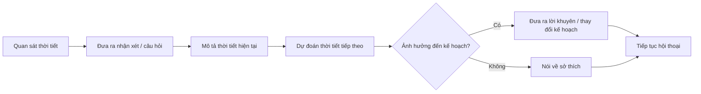

### Mẫu đơn giản

`What's the weather like today?`
→ `It's cloudy and a little windy.`
→ `Do you think it'll rain?`
→ `It looks like rain.`
→ `Then I'll take an umbrella.`

---

# 4. Từ vựng trọng tâm — Core Vocabulary

## 4.1. **weather** /ˈweð.ər/

**Nghĩa:** thời tiết


**Ví dụ:**

* **What's the weather like today?**
  — Hôm nay thời tiết thế nào?

* **The weather is beautiful today.**
  — Hôm nay thời tiết rất đẹp.

---

## 4.2. **temperature** /ˈtem.prə.tʃər/

**Nghĩa:** nhiệt độ

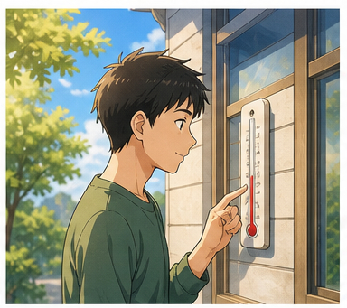

**Ví dụ:**

* **What's the temperature today?**
  — Hôm nay nhiệt độ bao nhiêu?

* **The temperature is very high today.**
  — Hôm nay nhiệt độ rất cao.

---

## 4.3. **forecast** /ˈfɔː.kɑːst/

**Nghĩa:** dự báo


**Ví dụ:**

* **Do you know the weather forecast for tomorrow?**
  — Bạn có biết dự báo thời tiết ngày mai không?

* **The forecast says it will rain.**
  — Dự báo nói rằng trời sẽ mưa.

### Cụm quan trọng

* **weather forecast** — dự báo thời tiết
* **forecast for tomorrow** — dự báo cho ngày mai

---

## 4.4. **clear up** /klɪər ʌp/

**Nghĩa:** quang đãng hơn, trời tạnh hoặc bớt mây


**Ví dụ:**

* **I hope it'll clear up soon.**
  — Tôi hy vọng trời sẽ sớm quang.

* **It should clear up this afternoon.**
  — Chiều nay trời có lẽ sẽ quang hơn.

---

## 4.5. **outside** /ˌaʊtˈsaɪd/

**Nghĩa:** bên ngoài, ngoài trời


**Ví dụ:**

* **I prefer being outside.**
  — Tôi thích ở ngoài trời hơn.

* **It's too hot outside.**
  — Ngoài trời nóng quá.

---

## 4.6. **sunny** /ˈsʌn.i/

**Nghĩa:** có nắng


**Ví dụ:**

* **It's sunny today.**
  — Hôm nay trời nắng.

* **I prefer sunny days.**
  — Tôi thích những ngày nắng hơn.

---

## 4.7. **cloudy** /ˈklaʊ.di/

**Nghĩa:** nhiều mây


**Ví dụ:**

* **It was cloudy in the morning.**
  — Buổi sáng trời nhiều mây.

* **It's getting cloudy.**
  — Trời đang nhiều mây dần.

---

## 4.8. **windy** /ˈwɪn.di/

**Nghĩa:** nhiều gió


**Ví dụ:**

* **It's very windy today.**
  — Hôm nay trời rất nhiều gió.

* **It was cold and windy yesterday.**
  — Hôm qua trời lạnh và nhiều gió.

---

## 4.9. **bright** /braɪt/

**Nghĩa trong bài:** sáng, nhiều ánh sáng


**Ví dụ:**

* **It's very bright outside.**
  — Bên ngoài trời rất sáng.

* **The sky is bright and clear.**
  — Bầu trời sáng và quang đãng.

---

## 4.10. **hot** /hɒt/

**Nghĩa:** nóng


**Ví dụ:**

* **It's very hot today.**
  — Hôm nay trời rất nóng.

* **What a hot day!**
  — Hôm nay nóng thật!

---

## 4.11. **cold** /kəʊld/

**Nghĩa:** lạnh


**Ví dụ:**

* **It's cold outside.**
  — Ngoài trời lạnh.

* **The mornings are cold here.**
  — Buổi sáng ở đây khá lạnh.

---

## 4.12. **cool** /kuːl/

**Nghĩa trong bài:** mát, hơi lạnh dễ chịu


**Ví dụ:**

* **It's cool this morning.**
  — Sáng nay trời mát.

* **The evening is cool and pleasant.**
  — Buổi tối mát và dễ chịu.

---

## 4.13. **freezing** /ˈfriː.zɪŋ/

**Nghĩa:** rất lạnh, lạnh cóng


**Ví dụ:**

* **It's freezing outside.**
  — Ngoài trời lạnh cóng.

* **It's freezing cold today.**
  — Hôm nay trời lạnh buốt.

---

## 4.14. **stuffy** /ˈstʌf.i/

**Nghĩa:** oi bức, ngột ngạt; bí


**Ví dụ:**

* **It's hot and stuffy today.**
  — Hôm nay trời nóng và oi bức.

* **The room feels stuffy.**
  — Căn phòng có cảm giác bí.

---

## 4.15. **rain** /reɪn/

**Nghĩa:** mưa; trời mưa


**Ví dụ:**

* **Do you think it'll rain today?**
  — Bạn có nghĩ hôm nay trời sẽ mưa không?

* **It looks like rain.**
  — Có vẻ trời sắp mưa.

---

## 4.16. **get wet** /ɡet wet/

**Nghĩa:** bị ướt


**Ví dụ:**

* **Take an umbrella or you'll get wet.**
  — Mang ô đi, nếu không bạn sẽ bị ướt.

* **I got wet in the rain.**
  — Tôi bị ướt vì mưa.

---

## 4.17. **snow** /snəʊ/

**Nghĩa:** tuyết


**Ví dụ:**

* **There's snow on the ground.**
  — Có tuyết trên mặt đất.

* **It may snow tonight.**
  — Tối nay có thể có tuyết.

---

## 4.18. **ground** /ɡraʊnd/

**Nghĩa:** mặt đất


**Ví dụ:**

* **The ground is white with snow.**
  — Mặt đất trắng xóa vì tuyết.

* **The ground is wet after the rain.**
  — Mặt đất ướt sau cơn mưa.

---

## 4.19. **storm** /stɔːm/

**Nghĩa:** cơn bão, giông bão

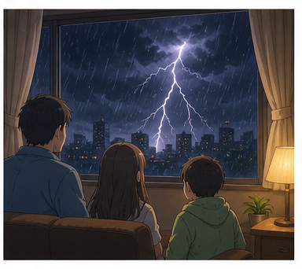

**Ví dụ:**

* **A storm is coming this afternoon.**
  — Chiều nay sẽ có bão.

* **We stayed inside because of the storm.**
  — Chúng tôi ở trong nhà vì cơn bão.

---

## 4.20. **snowstorm** /ˈsnəʊ.stɔːm/

**Nghĩa:** bão tuyết

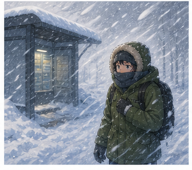

**Ví dụ:**

* **There was a snowstorm this morning.**
  — Sáng nay có một trận bão tuyết.

* **The roads are closed because of the snowstorm.**
  — Đường bị đóng vì bão tuyết.

---

## 4.21. **hurricane** /ˈhʌr.ɪ.kən/

**Nghĩa:** bão lớn, cuồng phong

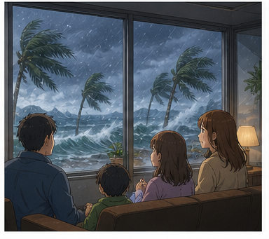

**Ví dụ:**

* **A hurricane is approaching the coast.**
  — Một cơn bão lớn đang tiến gần bờ biển.

* **People stayed indoors during the hurricane.**
  — Mọi người ở trong nhà trong thời gian có bão.

---

## 4.22. **south** /saʊθ/

**Nghĩa:** phía nam

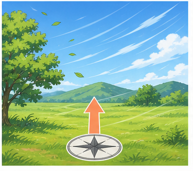

**Ví dụ:**

* **The wind is blowing from the south.**
  — Gió đang thổi từ phía nam.

* **It's warmer in the south.**
  — Phía nam ấm hơn.

---

## 4.23. **fine** /faɪn/

**Nghĩa trong bài:** thời tiết đẹp, khô ráo và dễ chịu


**Ví dụ:**

* **It's fine today.**
  — Hôm nay thời tiết đẹp.

* **I hope it'll be fine tomorrow.**
  — Tôi hy vọng ngày mai thời tiết đẹp.

---

# 5. Bảng tổng hợp từ vựng

| Từ / cụm từ     | IPA             | Nghĩa tiếng Việt | Ví dụ ngắn               |
| --------------- | --------------- | ---------------- | ------------------------ |
| **weather**     | /ˈweð.ər/       | thời tiết        | What's the weather like? |
| **temperature** | /ˈtem.prə.tʃər/ | nhiệt độ         | What's the temperature?  |
| **forecast**    | /ˈfɔː.kɑːst/    | dự báo           | weather forecast         |
| **clear up**    | /klɪər ʌp/      | trời quang hơn   | It'll clear up.          |
| **outside**     | /ˌaʊtˈsaɪd/     | bên ngoài        | It's cold outside.       |
| **sunny**       | /ˈsʌn.i/        | có nắng          | It's sunny.              |
| **cloudy**      | /ˈklaʊ.di/      | nhiều mây        | It's cloudy.             |
| **windy**       | /ˈwɪn.di/       | nhiều gió        | It's windy.              |
| **bright**      | /braɪt/         | sáng             | It's very bright.        |
| **hot**         | /hɒt/           | nóng             | It's hot.                |
| **cold**        | /kəʊld/         | lạnh             | It's cold.               |
| **cool**        | /kuːl/          | mát              | It's cool.               |
| **freezing**    | /ˈfriː.zɪŋ/     | lạnh cóng        | It's freezing.           |
| **stuffy**      | /ˈstʌf.i/       | oi bức, bí       | It's hot and stuffy.     |
| **rain**        | /reɪn/          | mưa              | It'll rain.              |
| **get wet**     | /ɡet wet/       | bị ướt           | You'll get wet.          |
| **snow**        | /snəʊ/          | tuyết            | Snow is falling.         |
| **ground**      | /ɡraʊnd/        | mặt đất          | snow on the ground       |
| **storm**       | /stɔːm/         | bão, giông       | A storm is coming.       |
| **snowstorm**   | /ˈsnəʊ.stɔːm/   | bão tuyết        | a snowstorm              |
| **hurricane**   | /ˈhʌr.ɪ.kən/    | bão lớn          | a hurricane              |
| **south**       | /saʊθ/          | phía nam         | from the south           |
| **fine**        | /faɪn/          | thời tiết đẹp    | It'll be fine.           |

---

# 6. Mẫu câu giao tiếp — Useful Structures

## 6.1. Hỏi thời tiết


### **What's the weather like?**

— Thời tiết thế nào?

Có thể thêm thời gian hoặc địa điểm:

* **What's the weather like today?**
* **What's the weather like in Hanoi?**
* **What's the weather like there?**

### Cách khác

### **How's the weather today?**

— Hôm nay thời tiết thế nào?

---

## 6.2. Mô tả thời tiết với **It's + tính từ**

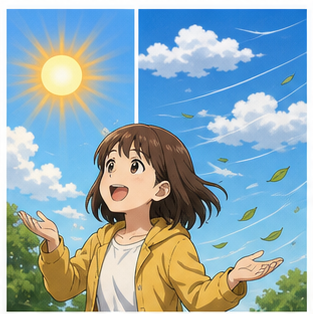

### **It's + tính từ thời tiết**

* **It's sunny.**
* **It's cloudy.**
* **It's windy.**
* **It's hot.**
* **It's cold.**
* **It's cool.**
* **It's freezing.**

Ví dụ:

**A:** How's the weather today?
**B:** It's sunny and warm.

---

## 6.3. Hỏi dự báo thời tiết

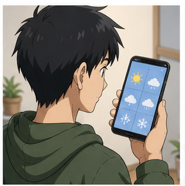

### **Do you know the weather forecast for + thời gian?**

* **Do you know the weather forecast for tomorrow?**
* **Do you know the forecast for this weekend?**

— Bạn có biết dự báo thời tiết cho ... không?

Cách đơn giản hơn:

### **What's the forecast for tomorrow?**

---

## 6.4. Hỏi dự đoán về thời tiết

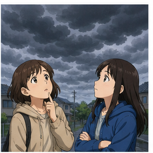

### **Do you think it'll + động từ?**

* **Do you think it'll rain today?**
* **Do you think it'll snow tonight?**
* **Do you think it'll clear up later?**

Cũng có thể dùng:

### **Do you think it'll be + tính từ?**

* **Do you think it'll be sunny tomorrow?**
* **Do you think it'll be cold tonight?**

---

## 6.5. Nói về hy vọng


### **I hope + mệnh đề**

* **I hope the forecast is right.**
* **I hope it'll clear up.**
* **I hope it doesn't rain tomorrow.**
* **I hope it'll be sunny this weekend.**

— Tôi hy vọng...

---

## 6.6. Dùng **clear up**


### **It'll clear up.**

— Trời sẽ quang hơn / sẽ tạnh.

Ví dụ:

* **I hope it'll clear up soon.**
* **It should clear up this afternoon.**

**clear up** thường dùng khi:

* mưa sắp tạnh;
* mây sắp tan;
* thời tiết xấu sắp cải thiện.

---

## 6.7. Dùng **It looks like ...**


### **It looks like + danh từ**

* **It looks like rain.**
  — Có vẻ trời sắp mưa.

* **It looks like a storm.**
  — Có vẻ sắp có bão.

### **It looks like + mệnh đề**

* **It looks like it's going to rain.**
* **It looks like the weather is getting worse.**

---

## 6.8. Dự đoán bằng **be going to**


Khi nhìn thấy dấu hiệu rõ ràng ở hiện tại, có thể dùng:

### **It is going to + động từ**

* **It's going to rain.**
* **It's going to snow.**

Ví dụ:

> The sky is very dark. **It's going to rain.**

---

## 6.9. Nói thời tiết trong quá khứ

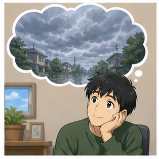

### **It was + tính từ**

* **It was cloudy this morning.**
* **It was cold yesterday.**
* **It was sunny last weekend.**

### Với hiện tượng thời tiết

* **It rained yesterday.**
* **It snowed last night.**

---

## 6.10. Nói mưa sắp tạnh


### **The rain will be over soon.**

— Mưa sẽ sớm tạnh.

Cách nói tự nhiên khác:

* **The rain should stop soon.**
* **It should stop raining soon.**

---

## 6.11. Nói về tuyết


### **The ground is covered with snow.**

— Mặt đất phủ đầy tuyết.

### **The snow is five centimeters deep.**

— Tuyết dày 5 cm.

Ví dụ:

* **There's a lot of snow on the ground.**
* **The ground is white with snow.**

---

## 6.12. Nói về gió


### **The wind is blowing from + hướng**

* **The wind is blowing from the south.**
* **The wind is blowing from the north.**

Cách đơn giản hơn:

* **It's windy today.**
* **There's a strong wind outside.**

---

## 6.13. Bình luận về thời tiết


### **It's + tính từ + today.**

* **It's beautiful today.**
* **It's cold today.**
* **It's very hot today.**

### Câu cảm thán

**What a beautiful day!**

**What a hot day!**

**What terrible weather!**

---

## 6.14. Dùng câu hỏi đuôi để mở rộng hội thoại


### **It's + tính từ, isn't it?**

* **It's cold today, isn't it?**
* **It's a beautiful day, isn't it?**
* **The weather is bad, isn't it?**

Cấu trúc này rất hữu ích để bắt đầu cuộc trò chuyện.

---

## 6.15. Nói về sở thích thời tiết


### **I prefer + danh từ**

* **I prefer sunny days.**
* **I prefer cool weather.**

### **I prefer + V-ing**

* **I prefer staying inside when it rains.**
* **I prefer being outside when it's sunny.**

### Hỏi người khác

**Do you like rainy days?**

---

## 6.16. Đưa lời khuyên theo thời tiết


### **You should + V**

* **You should take an umbrella.**
* **You should wear a jacket.**
* **You should stay inside.**

### **You'd better + V**

* **You'd better put on more clothes.**
* **You'd better take an umbrella.**

> **had better** thường mạnh hơn **should**.

---

# 7. Các kiểu thời tiết cơ bản

## Trời đẹp

* **sunny** — có nắng
* **bright** — sáng
* **clear** — quang đãng
* **fine** — thời tiết đẹp
* **warm** — ấm

## Trời không thuận lợi

* **cloudy** — nhiều mây
* **rainy** — có mưa
* **windy** — nhiều gió
* **stormy** — có giông bão
* **snowy** — có tuyết

## Nhiệt độ

* **hot** — nóng
* **warm** — ấm
* **cool** — mát
* **cold** — lạnh
* **freezing** — lạnh cóng

### Sơ đồ

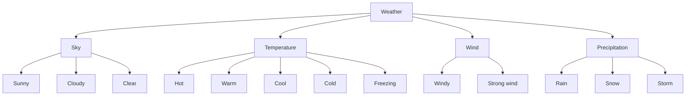

---

# 8. Phân biệt **weather**, **climate** và **temperature**

## **weather**

= thời tiết tại một thời điểm hoặc trong khoảng thời gian ngắn.

**The weather is sunny today.**

---

## **climate**

= khí hậu đặc trưng của một khu vực trong thời gian dài.

**Vietnam has a tropical climate.**

---

## **temperature**

= nhiệt độ.

**The temperature is 30 degrees.**

### So sánh

| Từ              | Nghĩa     | Ví dụ                      |
| --------------- | --------- | -------------------------- |
| **weather**     | thời tiết | The weather is nice today. |
| **climate**     | khí hậu   | The climate is tropical.   |
| **temperature** | nhiệt độ  | The temperature is 30°C.   |

---

# 9. Phát âm trọng tâm

## 9.1. **weather**

**weather**
/ˈweð.ər/

Chú ý âm **/ð/**.

Không đọc giống **whether** về nghĩa, dù hai từ phát âm gần như giống nhau.

---

## 9.2. **temperature**

**temperature**
/ˈtem.prə.tʃər/

Trọng âm:

**TEM**-pera-ture

Trong hội thoại, các âm giữa thường được đọc nhanh.

---

## 9.3. **forecast**

**forecast**
/ˈfɔː.kɑːst/

Trọng âm:

**FORE**-cast

---

## 9.4. **cloudy**

**cloudy**
/ˈklaʊ.di/

Trọng âm:

**CLOUD**-y

---

## 9.5. **windy**

**windy**
/ˈwɪn.di/

Trọng âm:

**WIN**-dy

> **wind** trong **windy** phát âm /wɪnd/.

---

## 9.6. **freezing**

**freezing**
/ˈfriː.zɪŋ/

Trọng âm:

**FREE**-zing

---

## 9.7. **hurricane**

**hurricane**
/ˈhʌr.ɪ.kən/

Trọng âm:

**HUR**-ri-cane

---

## 9.8. Nối âm trong câu

### **What's the weather like?**

Nên luyện cả cụm:

`What's-the-weather-like?`

### **Do you think it'll rain?**

Luyện:

`Do-you-think-it'll-rain?`

### **It looks like it's going to rain.**

Nên chia theo cụm ý:

`It-looks-like / it's-going-to-rain.`

---

# 10. Hội thoại thực tế — Real-Life Conversation

## Hội thoại chính — Thời tiết hôm nay


**Mai:** What's the weather like today?
**Alex:** It's fine now, but it looks a little cloudy.
**Mai:** Do you think it'll rain later?
**Alex:** Probably. The forecast says there's a chance of rain this afternoon.
**Mai:** That's too bad. I wanted to go for a walk.
**Alex:** It may clear up later.
**Mai:** I hope so.
**Alex:** Take an umbrella just in case.
**Mai:** Good idea.

### Nội dung giao tiếp

```text
Hỏi thời tiết
      ↓
Mô tả hiện tại
      ↓
Dự đoán
      ↓
Nói ảnh hưởng đến kế hoạch
      ↓
Đưa lời khuyên
      ↓
Phản hồi
```

---

## Hội thoại 2 — Ngày mưa hay ngày nắng?


**Linh:** It looks like it's going to rain.
**Nam:** Yeah. The sky is getting really dark.
**Linh:** Don't you like rainy days?
**Nam:** Not much. I prefer sunny days.
**Linh:** Really? I actually like rainy days.
**Nam:** Why?
**Linh:** I think they're relaxing. I can stay inside and read.
**Nam:** I prefer being outside, so sunny weather is better for me.

---

## Hội thoại 3 — Trời trở lạnh


**Anna:** It's freezing today, isn't it?
**Ben:** It really is. The temperature dropped a lot last night.
**Anna:** Do you think it'll snow?
**Ben:** Maybe. The forecast says it might snow this evening.
**Anna:** I didn't bring a warm coat.
**Ben:** You'd better put on something warmer before you go outside.
**Anna:** You're right. I don't want to get sick.
**Ben:** And be careful if the roads get icy.

---

## Hội thoại 4 — Kế hoạch cuối tuần


**Minh:** Do you know the weather forecast for the weekend?
**Lan:** Saturday should be sunny, but Sunday may be rainy.
**Minh:** That's good. We can go to the park on Saturday.
**Lan:** Yes. It should be warm too.
**Minh:** What about Sunday?
**Lan:** We could stay inside and watch a movie.
**Minh:** That sounds good.
**Lan:** Let's check the forecast again tomorrow.

---

# 11. Natural Expressions — Cách nói tự nhiên

| Cụm từ                            | Nghĩa                        | Khi dùng            |
| --------------------------------- | ---------------------------- | ------------------- |
| **What's the weather like?**      | Thời tiết thế nào?           | Hỏi thời tiết       |
| **How's the weather?**            | Thời tiết ra sao?            | Hỏi tự nhiên        |
| **It's sunny.**                   | Trời nắng.                   | Mô tả               |
| **It's cloudy.**                  | Trời nhiều mây.              | Mô tả               |
| **It's windy.**                   | Trời nhiều gió.              | Mô tả               |
| **It's freezing.**                | Trời lạnh cóng.              | Mô tả               |
| **It's a beautiful day.**         | Hôm nay đẹp trời.            | Bình luận           |
| **What a beautiful day!**         | Hôm nay đẹp thật!            | Cảm thán            |
| **Do you think it'll rain?**      | Bạn nghĩ trời sẽ mưa không?  | Dự đoán             |
| **It looks like rain.**           | Có vẻ trời sắp mưa.          | Dự đoán             |
| **It's going to rain.**           | Trời sắp mưa.                | Dự đoán từ dấu hiệu |
| **I hope it'll clear up.**        | Tôi hy vọng trời sẽ quang.   | Hy vọng             |
| **The forecast says ...**         | Dự báo nói rằng...           | Nói dự báo          |
| **It should clear up later.**     | Lát nữa trời có lẽ sẽ quang. | Dự đoán             |
| **Take an umbrella.**             | Mang ô đi.                   | Lời khuyên          |
| **Just in case.**                 | Để phòng trường hợp cần.     | Phòng ngừa          |
| **You'll get wet.**               | Bạn sẽ bị ướt.               | Cảnh báo            |
| **It's too hot outside.**         | Ngoài trời nóng quá.         | Bình luận           |
| **I prefer sunny days.**          | Tôi thích ngày nắng hơn.     | Sở thích            |
| **I love rainy days.**            | Tôi thích những ngày mưa.    | Sở thích            |
| **I prefer being outside.**       | Tôi thích ở ngoài trời hơn.  | Sở thích            |
| **The weather's getting worse.**  | Thời tiết đang xấu đi.       | Thay đổi            |
| **The weather's getting better.** | Thời tiết đang tốt lên.      | Thay đổi            |
| **Nice weather, isn't it?**       | Thời tiết đẹp nhỉ?           | Mở đầu hội thoại    |

---

# 12. Lỗi thường gặp — Common Mistakes

## Lỗi 1: Hỏi **How is weather?**

❌ **How is weather today?**

✅ **How is the weather today?**

✅ **What's the weather like today?**

Cần có **the** trước **weather** trong cấu trúc này.

---

## Lỗi 2: Dùng **How is the weather like?**

❌ **How is the weather like?**

✅ **How is the weather?**

Hoặc:

✅ **What's the weather like?**

Không kết hợp hai cấu trúc thành một.

---

## Lỗi 3: Nói **It's rain**

❌ **It's rain.**

Nếu đang mưa:

✅ **It's raining.**

Nếu mô tả thời tiết:

✅ **It's rainy.**

Nếu dự đoán:

✅ **It will rain.**

---

## Lỗi 4: Nói **It's sun**

❌ **It's sun.**

✅ **It's sunny.**

### Tương tự

* **cloud** → **cloudy**
* **wind** → **windy**
* **rain** → **rainy**
* **snow** → **snowy**

---

## Lỗi 5: Nhầm **weather** và **temperature**

❌ **The weather is 30 degrees.**

Tự nhiên hơn:

✅ **The temperature is 30 degrees.**

Hoặc:

✅ **It's 30 degrees today.**

---

## Lỗi 6: Dùng **very freezing**

❌ **It's very freezing.**

✅ **It's freezing.**

Hoặc:

✅ **It's extremely cold.**

**freezing** đã mang nghĩa rất lạnh.

---

## Lỗi 7: Dùng sai sau **look like**

❌ **It looks like to rain.**

✅ **It looks like rain.**

✅ **It looks like it's going to rain.**

---

## Lỗi 8: Nhầm **will** và **be going to**

Khi chỉ đưa ra dự đoán hoặc ý kiến:

✅ **I think it'll rain tomorrow.**

Khi nhìn thấy dấu hiệu rõ:

✅ **Look at those dark clouds. It's going to rain.**

---

## Lỗi 9: Nhầm **cool** và **cold**

### **cool**

= mát, hơi lạnh nhưng thường dễ chịu.

**It's cool this evening.**

### **cold**

= lạnh.

**It's cold outside.**

---

## Lỗi 10: Dùng sai **prefer**

❌ **I prefer sunny days than rainy days.**

✅ **I prefer sunny days to rainy days.**

Hoặc đơn giản:

✅ **I prefer sunny days.**

---

## Lỗi 11: Quên **-ing** sau **prefer** khi nói về hoạt động

❌ **I prefer be outside.**

✅ **I prefer being outside.**

Hoặc:

✅ **I prefer to be outside.**

---

## Lỗi 12: Dùng lời khuyên sai cấu trúc

❌ **You'd better to take an umbrella.**

✅ **You'd better take an umbrella.**

### Cấu trúc

`had better + V nguyên mẫu`

---

# 13. Luyện tập có hướng dẫn

## Bài 1 — Nối từ với nghĩa

1. sunny
2. windy
3. forecast
4. freezing
5. storm
6. clear up

A. bão
B. có nắng
C. quang hơn / tạnh
D. dự báo
E. nhiều gió
F. lạnh cóng

<details>
<summary>Đáp án</summary>

1–B
2–E
3–D
4–F
5–A
6–C

</details>

---

## Bài 2 — Điền từ vào chỗ trống

Dùng:

`sunny` · `forecast` · `rain` · `clear up` · `freezing`

1. Do you know the weather ________ for tomorrow?
2. Do you think it'll ________ today?
3. I hope it'll ________ soon.
4. It's very cold. In fact, it's ________.
5. I prefer ________ days.

<details>
<summary>Đáp án</summary>

1. forecast
2. rain
3. clear up
4. freezing
5. sunny

</details>

---

## Bài 3 — Chọn câu đúng

### 1. Bạn muốn hỏi thời tiết.

* A. How is weather today?
* B. What's the weather like today?
* C. What the weather is like today?

**Đáp án:** B

---

### 2. Bạn nhìn thấy mây đen và nghĩ sắp mưa.

* A. It looks like it's going to rain.
* B. It looks like to rain.
* C. It looks rain.

**Đáp án:** A

---

### 3. Bạn muốn nói trời đang mưa.

* A. It's rain.
* B. It raining.
* C. It's raining.

**Đáp án:** C

---

### 4. Bạn muốn khuyên người khác mang ô.

* A. You'd better take an umbrella.
* B. You'd better to take an umbrella.
* C. You better taking an umbrella.

**Đáp án:** A

---

## Bài 4 — Chọn từ phù hợp

### 1. Mặt trời đang chiếu sáng.

**sunny / windy**

→ **sunny**

### 2. Gió thổi mạnh.

**cloudy / windy**

→ **windy**

### 3. Nhiệt độ rất thấp.

**freezing / bright**

→ **freezing**

### 4. Bầu trời đầy mây.

**cloudy / hot**

→ **cloudy**

### 5. Mưa và mây đang biến mất dần.

**clear up / get wet**

→ **clear up**

---

## Bài 5 — Hoàn thành hội thoại

**A:** What's the ________ like today?
**B:** It's cloudy and a little windy.
**A:** Do you think it'll ________?
**B:** Yes. It looks ________ rain.
**A:** I wanted to go outside this afternoon.
**B:** It may ________ up later.
**A:** I hope so.
**B:** Take an umbrella just in ________.

<details>
<summary>Đáp án</summary>

1. weather
2. rain
3. like
4. clear
5. case

</details>

---

## Bài 6 — **will** hay **going to**

Chọn đáp án phù hợp.

### 1.

Look at those dark clouds. It ________ rain.

* A. will
* B. is going to

**Đáp án:** B

---

### 2.

I think it ________ be sunny tomorrow.

* A. will
* B. is going to

**Đáp án:** A

---

### 3.

The sky is getting darker. There ________ be a storm.

* A. is going to
* B. will probably

**Đáp án gợi ý:** A

---

# 14. Speaking Challenge — Thử thách nói

## Nhiệm vụ 1 — Mô tả thời tiết

Đọc các câu sau thành tiếng:

* **It's sunny today.**
* **It's cloudy and windy.**
* **It's quite cool this morning.**
* **It's freezing outside.**
* **It looks like rain.**
* **I hope it'll clear up.**
* **The forecast says it'll rain.**
* **What a beautiful day!**

Đọc mỗi câu hai lần:

* lần 1 chậm và rõ;
* lần 2 với tốc độ hội thoại tự nhiên.

---

## Nhiệm vụ 2 — Tạo 5 câu hỏi

Dùng các cấu trúc:

1. **What's the weather like ...?**
2. **How's the weather ...?**
3. **Do you think it'll ...?**
4. **Do you know the forecast ...?**
5. **Do you like ... days?**

Ví dụ:

> **Do you think it'll rain this afternoon?**

---

## Nhiệm vụ 3 — Mô tả thời tiết hiện tại

Nói ít nhất **5 câu** về thời tiết nơi bạn đang ở.

Có thể nói về:

* bầu trời;
* nhiệt độ;
* gió;
* mưa;
* cảm giác của bạn;
* dự đoán vài giờ tới.

Ví dụ:

> **It's cloudy today. It's quite warm, but it's also windy. I think it might rain later. I hope it clears up in the evening.**

---

## Nhiệm vụ 4 — Hội thoại 8 lượt

Tạo một đoạn hội thoại có ít nhất:

* 1 câu hỏi về thời tiết;
* 2 tính từ thời tiết;
* 1 câu dự đoán;
* 1 câu **I hope ...**;
* 1 câu nói sở thích;
* 1 lời khuyên;
* 1 phản hồi;
* 1 quyết định về hoạt động.

---

## Nhiệm vụ 5 — Ghi âm

Ghi âm từ **45–60 giây**, sau đó kiểm tra:

* [ ] Tôi dùng đúng **What's the weather like?**
* [ ] Tôi có thể dùng ít nhất 5 tính từ thời tiết.
* [ ] Tôi phân biệt **rain** và **raining**.
* [ ] Tôi dùng đúng **It looks like ...**
* [ ] Tôi có thể dùng **going to** để dự đoán.
* [ ] Tôi có thể dùng **I hope ...**
* [ ] Tôi có thể nói về thời tiết mình thích.
* [ ] Tôi có thể đưa một lời khuyên phù hợp với thời tiết.
* [ ] Tôi có thể duy trì hội thoại ít nhất 45 giây.

---

# 15. Practice Mission — Nhiệm vụ thực tế

Trong hôm nay, hãy mở đầu một cuộc trò chuyện bằng công thức:

> **Weather comment → Question → Prediction → Preference → Plan**

Ví dụ:

> **It's really cloudy today.**
> ↓
> **Do you think it'll rain?**
> ↓
> **Yes. It looks like it's going to rain this afternoon.**
> ↓
> **I prefer sunny days.**
> ↓
> **Me too. Let's stay inside if it rains.**

Sau đó tự tạo một đoạn hội thoại **8 lượt nói** cho một trong các tình huống:

* trời sắp mưa;
* ngày hè rất nóng;
* buổi sáng lạnh;
* cuối tuần có thể có bão;
* dự định đi picnic;
* lên kế hoạch đi biển;
* trời tuyết;
* hai người có sở thích thời tiết khác nhau.

---

# 16. Tự đánh giá cuối bài

Đánh dấu khi bạn có thể thực hiện mà không nhìn bài:

* [ ] Tôi có thể hỏi **What's the weather like?**
* [ ] Tôi có thể hỏi **How's the weather today?**
* [ ] Tôi có thể hỏi về **weather forecast**.
* [ ] Tôi có thể dùng **sunny**.
* [ ] Tôi có thể dùng **cloudy**.
* [ ] Tôi có thể dùng **windy**.
* [ ] Tôi có thể dùng **hot / warm / cool / cold / freezing**.
* [ ] Tôi có thể nói **It's raining.**
* [ ] Tôi có thể nói **It looks like rain.**
* [ ] Tôi có thể nói **It's going to rain.**
* [ ] Tôi có thể dùng **I hope ...**
* [ ] Tôi hiểu **clear up**.
* [ ] Tôi có thể nói về mưa, tuyết và bão.
* [ ] Tôi có thể dùng **It's ..., isn't it?**
* [ ] Tôi có thể nói **I prefer sunny days.**
* [ ] Tôi có thể nói **I prefer being outside.**
* [ ] Tôi có thể đưa lời khuyên phù hợp với thời tiết.
* [ ] Tôi có thể duy trì hội thoại ít nhất 45 giây.

---

# 17. Câu hỏi mở cuối bài

**Imagine you planned an outdoor trip with your friends, but the sky suddenly becomes dark and windy. How would you describe the weather, predict what may happen next, and decide whether to continue the trip?**

*Hãy tưởng tượng bạn đã lên kế hoạch đi chơi ngoài trời với bạn bè, nhưng bầu trời đột nhiên tối lại và gió mạnh hơn. Bạn sẽ mô tả thời tiết, dự đoán điều gì có thể xảy ra tiếp theo và quyết định có tiếp tục chuyến đi hay không như thế nào?*

---

# 18. Ghi chú dành cho giảng viên

* **Module:** 02 — Everyday Conversations / Những cuộc hội thoại thường ngày
* **Chủ điểm:** Talking About the Weather
* **Thời lượng video:** 8–12 phút
* **Luyện nói:** 5–10 phút

### Trọng tâm từ vựng

* weather
* temperature
* forecast
* clear up
* outside
* sunny
* cloudy
* windy
* bright
* hot
* cold
* cool
* freezing
* stuffy
* rain
* get wet
* snow
* ground
* storm
* snowstorm
* hurricane
* south
* fine

### Trọng tâm cấu trúc

* **What's the weather like?**
* **How's the weather today?**
* **It's sunny / cloudy / windy.**
* **Do you know the weather forecast for tomorrow?**
* **What's the forecast for tomorrow?**
* **Do you think it'll rain?**
* **Do you think it'll be sunny?**
* **I hope it'll clear up.**
* **I hope it doesn't rain.**
* **It looks like rain.**
* **It looks like it's going to rain.**
* **It's going to rain.**
* **It was cloudy this morning.**
* **The rain should stop soon.**
* **The wind is blowing from the south.**
* **It's freezing cold.**
* **What a beautiful day!**
* **It's cold today, isn't it?**
* **I prefer sunny days.**
* **I prefer being outside.**
* **You should take an umbrella.**
* **You'd better put on more clothes.**

### Trọng tâm phát âm

* **weather**
* **temperature**
* **forecast**
* **cloudy**
* **windy**
* **freezing**
* **hurricane**
* **outside**

### Lưu ý ngôn ngữ

* Dùng:

  * **What's the weather like?**
  * **How's the weather?**

  Không dùng:

  * `How is the weather like?`
* **It's raining** = trời đang mưa.
* **It's rainy** = thời tiết có mưa / trời hay mưa.
* **It will rain** = trời sẽ mưa.
* **sunny**, **cloudy**, **windy**, **rainy**, **snowy** là tính từ.
* **temperature** dùng để nói nhiệt độ cụ thể.
* **weather** dùng để mô tả tình trạng thời tiết tổng thể.
* **climate** dùng để nói về khí hậu dài hạn.
* **It looks like rain** và **It looks like it's going to rain** đều tự nhiên.
* **be going to** đặc biệt hữu ích khi có dấu hiệu rõ ràng ở hiện tại.
* **will** thường phù hợp với ý kiến hoặc dự đoán chung.
* **freezing** đã mang nghĩa rất lạnh nên không cần thêm **very**.
* **cool** nhẹ hơn **cold**.
* **clear up** có thể dùng khi mưa tạnh, mây tan hoặc thời tiết nói chung cải thiện.
* **I prefer A to B**:

  * **I prefer sunny days to rainy days.**
* Sau **prefer** có thể dùng:

  * **V-ing**
  * **to + V**
* **had better + V nguyên mẫu**, không dùng **to**.

### Hoạt động gợi ý — Weather Reporter

Chia lớp thành nhóm nhỏ.

Mỗi nhóm nhận một tình huống thời tiết:

* trời nắng và nóng;
* trời nhiều mây và có gió;
* trời đang mưa;
* trời lạnh và có tuyết;
* sắp có bão.

Một người đóng vai **người dẫn chương trình**, một người đóng vai **phóng viên thời tiết**.

Người dẫn hỏi:

> **What's the weather like today?**

> **Do you think it'll rain later?**

> **What's the forecast for tomorrow?**

Phóng viên phải sử dụng ít nhất:

* 3 tính từ thời tiết;
* 1 câu dự đoán;
* 1 câu **I think ...**;
* 1 câu **It looks like ...**;
* 1 lời khuyên.

Ví dụ:

> **It's cloudy and very windy today. It looks like it's going to rain. I think there may be a storm this afternoon, so you'd better take an umbrella if you go outside.**

### Role-play mẫu — Lên kế hoạch ngoài trời

**Người A nhận:**

> Bạn muốn đi picnic vào chiều nay.

**Người B nhận:**

> Trời hiện đang nhiều mây và dự báo có mưa vào buổi chiều.

Người A phải sử dụng ít nhất:

* **What's the weather like?**
* **Do you think it'll rain?**
* **I hope ...**
* **What should we do?**

Người B phải sử dụng ít nhất:

* **It's cloudy / windy.**
* **The forecast says ...**
* **It looks like ...**
* **We should ...**
* **How about ...?**

Hai người phải thống nhất một quyết định cuối cùng:

> **Let's wait until the weather clears up.**

hoặc:

> **Let's stay inside and do something else.**

---
