# LESSON 09 — MỘT BUỔI ĐI XEM PHIM

> **Module 02 — Everyday Conversations / Những cuộc hội thoại thường ngày**
> **Chủ đề:** Seeing a Movie — Nói về phim, mua vé và chia sẻ cảm nhận
> **Trình độ gợi ý:** A1–A2
> **Thời lượng:** 8–12 phút học bài + 5–10 phút luyện nói

---

## 1. Tình huống thực tế

Đi xem phim là một tình huống giao tiếp rất phổ biến khi bạn muốn:

* rủ bạn bè đi xem phim;
* hỏi người khác thích thể loại phim nào;
* chọn một bộ phim để xem;
* hỏi phim đang chiếu ở đâu;
* hỏi phim nói về điều gì;
* hỏi diễn viên nào đóng trong phim;
* hỏi phim dài bao lâu;
* mua vé xem phim;
* hỏi còn vé hay không;
* chọn vị trí ngồi trong rạp;
* nói về diễn viên hoặc đạo diễn yêu thích;
* nhận xét phim sau khi xem;
* nói phim thú vị, cảm động hoặc nhàm chán;
* hỏi người khác có thích bộ phim hay không.

Bạn cần biết cách nói những câu như:

* **Would you like to go to a movie?**
* **Sure, I'd love to.**
* **What movie do you want to see?**
* **What's it about?**
* **Who's in the film?**
* **How long does it last?**
* **Are there any tickets left?**
* **Two adults, please.**
* **Let's sit at the back.**
* **Did you enjoy the movie?**
* **It was an interesting film, wasn't it?**
* **It was a touching movie.**

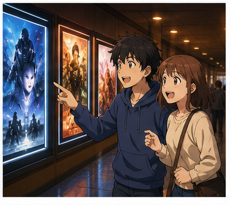

---

## 2. Mục tiêu bài học

Sau bài học, người học có thể:

1. Rủ người khác đi xem phim bằng **Would you like to go to a movie?**
2. Nhận lời bằng **Sure, I'd love to.**
3. Hỏi người khác muốn xem phim nào.
4. Hỏi phim thuộc thể loại gì.
5. Hỏi phim nói về nội dung gì.
6. Hỏi diễn viên nào đóng trong phim.
7. Hỏi thời lượng phim bằng **How long does it last?**
8. Hỏi xem còn vé hay không.
9. Mua vé bằng các mẫu câu đơn giản.
10. Chọn vị trí ngồi trong rạp.
11. Nói về diễn viên hoặc ngôi sao điện ảnh yêu thích.
12. Nói về thể loại phim mình thích.
13. Hỏi người khác có thích bộ phim hay không.
14. Đưa ra nhận xét bằng **interesting**, **boring**, **touching**.
15. Duy trì một đoạn hội thoại 6–8 lượt về một buổi đi xem phim.

---

## 3. Sơ đồ giao tiếp

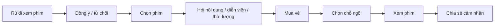

### Mẫu đơn giản

`Would you like to go to a movie?`
→ `Sure, I'd love to.`
→ `What movie do you want to see?`
→ `How about an action movie?`
→ `Sounds good.`
→ `Let's get the tickets.`

---

# 4. Từ vựng trọng tâm — Core Vocabulary

## 4.1. **movie** /ˈmuː.vi/

**Nghĩa:** phim điện ảnh

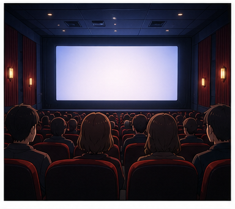

**Ví dụ:**

* **Would you like to go to a movie?**
  — Bạn có muốn đi xem phim không?

* **What movie do you want to see?**
  — Bạn muốn xem phim nào?

---

## 4.2. **film** /fɪlm/

**Nghĩa:** phim


**Ví dụ:**

* **Who's in the film?**
  — Ai đóng trong phim?

* **It was an interesting film.**
  — Đó là một bộ phim thú vị.

> **movie** phổ biến hơn trong tiếng Anh-Mỹ.
> **film** rất phổ biến trong tiếng Anh-Anh.

---

## 4.3. **action movie** /ˈæk.ʃən ˌmuː.vi/

**Nghĩa:** phim hành động


**Ví dụ:**

* **I really enjoy action movies.**
  — Tôi rất thích phim hành động.

* **Do you want to watch an action movie?**
  — Bạn có muốn xem phim hành động không?

---

## 4.4. **horror movie** /ˈhɒr.ər ˌmuː.vi/

**Nghĩa:** phim kinh dị

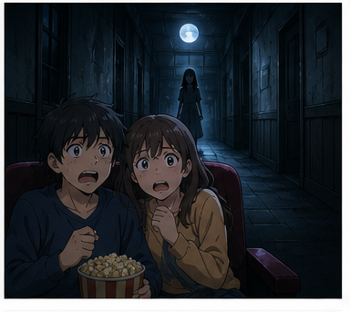

**Ví dụ:**

* **Do you like horror movies?**
  — Bạn có thích phim kinh dị không?

* **I don't watch horror movies at night.**
  — Tôi không xem phim kinh dị vào ban đêm.

---

## 4.5. **comedy** /ˈkɒm.ə.di/

**Nghĩa:** phim hài; thể loại hài

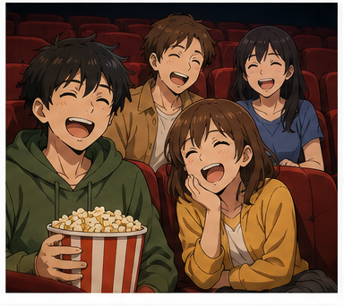

**Ví dụ:**

* **I prefer comedy.**
  — Tôi thích phim hài hơn.

* **That comedy was really funny.**
  — Bộ phim hài đó rất vui.

---

## 4.6. **director** /daɪˈrek.tər/

**Nghĩa:** đạo diễn

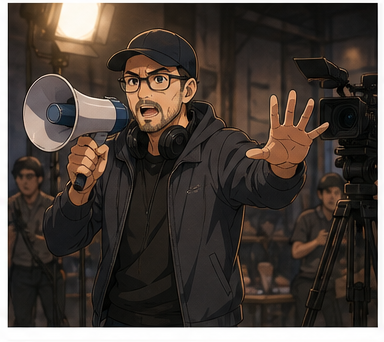

**Ví dụ:**

* **Who's the director?**
  — Đạo diễn là ai?

* **She's a famous film director.**
  — Cô ấy là một đạo diễn phim nổi tiếng.

---

## 4.7. **actor** /ˈæk.tər/

**Nghĩa:** nam diễn viên; diễn viên

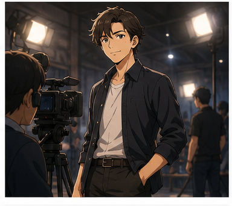

**Ví dụ:**

* **He's my favorite actor.**
  — Anh ấy là diễn viên yêu thích của tôi.

* **Who's the main actor?**
  — Nam diễn viên chính là ai?

---

## 4.8. **actress** /ˈæk.trəs/

**Nghĩa:** nữ diễn viên


**Ví dụ:**

* **She's a famous actress.**
  — Cô ấy là một nữ diễn viên nổi tiếng.

* **Who's your favorite actress?**
  — Nữ diễn viên yêu thích của bạn là ai?

---

## 4.9. **play a role** /pleɪ ə rəʊl/

**Nghĩa:** đóng một vai


**Ví dụ:**

* **He plays the main role.**
  — Anh ấy đóng vai chính.

* **She played an important role in the film.**
  — Cô ấy đóng một vai quan trọng trong phim.

---

## 4.10. **role** /rəʊl/

**Nghĩa:** vai diễn

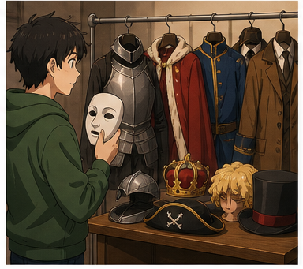

**Ví dụ:**

* **What role does he play?**
  — Anh ấy đóng vai gì?

* **She has the leading role.**
  — Cô ấy đóng vai chính.

---

## 4.11. **movie star** /ˈmuː.vi stɑːr/

**Nghĩa:** ngôi sao điện ảnh

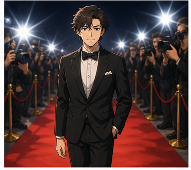

**Ví dụ:**

* **Who's your favorite movie star?**
  — Ngôi sao điện ảnh yêu thích của bạn là ai?

* **He became a famous movie star.**
  — Anh ấy trở thành một ngôi sao điện ảnh nổi tiếng.

---

## 4.12. **screen** /skriːn/

**Nghĩa:** màn hình; màn chiếu


**Ví dụ:**

* **The screen is very large.**
  — Màn chiếu rất lớn.

* **Don't sit too close to the screen.**
  — Đừng ngồi quá gần màn chiếu.

---

## 4.13. **ticket** /ˈtɪk.ɪt/

**Nghĩa:** vé

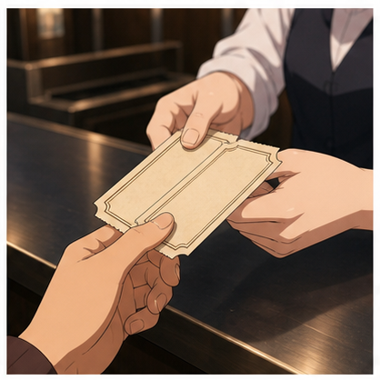

**Ví dụ:**

* **Are there any tickets left?**
  — Còn vé không?

* **I have two tickets for the cinema.**
  — Tôi có hai vé xem phim.

### Cụm quan trọng

* **buy a ticket** — mua vé
* **book a ticket** — đặt vé
* **movie ticket** — vé xem phim

---

## 4.14. **front row** /ˌfrʌnt ˈrəʊ/

**Nghĩa:** hàng ghế đầu

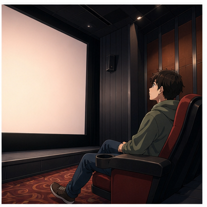

**Ví dụ:**

* **I like to sit in the front row.**
  — Tôi thích ngồi hàng đầu.

* **The front row is too close to the screen.**
  — Hàng đầu quá gần màn hình.

---

## 4.15. **back row** /ˌbæk ˈrəʊ/

**Nghĩa:** hàng ghế phía sau

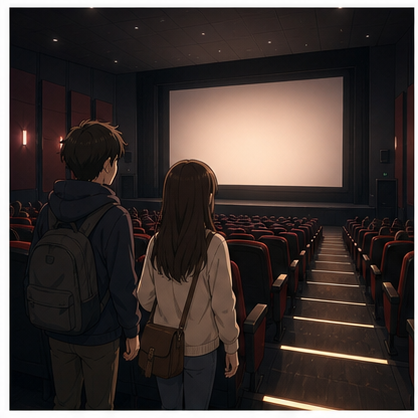

**Ví dụ:**

* **Let's sit in the back row.**
  — Chúng ta ngồi hàng ghế phía sau nhé.

* **I prefer sitting at the back.**
  — Tôi thích ngồi phía sau hơn.

---

## 4.16. **interesting** /ˈɪn.trə.stɪŋ/

**Nghĩa:** thú vị

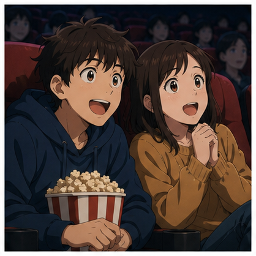

**Ví dụ:**

* **It was an interesting film.**
  — Đó là một bộ phim thú vị.

* **The story was very interesting.**
  — Câu chuyện rất thú vị.

---

## 4.17. **boring** /ˈbɔː.rɪŋ/

**Nghĩa:** nhàm chán


**Ví dụ:**

* **That film was boring.**
  — Bộ phim đó thật nhàm chán.

* **The first half was a little boring.**
  — Nửa đầu phim hơi nhàm chán.

---

## 4.18. **touching** /ˈtʌtʃ.ɪŋ/

**Nghĩa:** cảm động


**Ví dụ:**

* **It was a touching movie.**
  — Đó là một bộ phim cảm động.

* **The ending was very touching.**
  — Phần kết rất cảm động.

---

## 4.19. **ending** /ˈen.dɪŋ/

**Nghĩa:** phần kết, kết thúc của phim

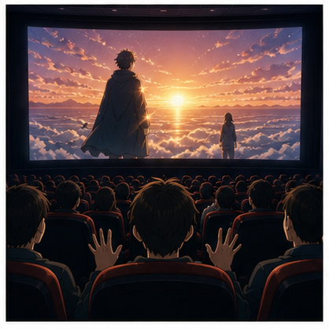

**Ví dụ:**

* **Did you like the ending?**
  — Bạn có thích đoạn kết không?

* **The ending surprised me.**
  — Đoạn kết khiến tôi bất ngờ.

---

## 4.20. **cinema** /ˈsɪn.ə.mə/

**Nghĩa:** rạp chiếu phim


**Ví dụ:**

* **I have two tickets for the cinema.**
  — Tôi có hai vé xem phim.

* **Let's meet outside the cinema.**
  — Chúng ta gặp nhau bên ngoài rạp nhé.

---

# 5. Bảng tổng hợp từ vựng

| Từ / cụm từ      | IPA               | Nghĩa tiếng Việt  | Ví dụ ngắn            |
| ---------------- | ----------------- | ----------------- | --------------------- |
| **movie**        | /ˈmuː.vi/         | phim              | Let's watch a movie.  |
| **film**         | /fɪlm/            | phim              | It was a good film.   |
| **action movie** | /ˈæk.ʃən ˌmuː.vi/ | phim hành động    | I like action movies. |
| **horror movie** | /ˈhɒr.ər ˌmuː.vi/ | phim kinh dị      | a horror movie        |
| **comedy**       | /ˈkɒm.ə.di/       | phim hài          | I like comedy.        |
| **director**     | /daɪˈrek.tər/     | đạo diễn          | Who's the director?   |
| **actor**        | /ˈæk.tər/         | diễn viên nam     | favorite actor        |
| **actress**      | /ˈæk.trəs/        | nữ diễn viên      | famous actress        |
| **play a role**  | /pleɪ ə rəʊl/     | đóng vai          | play the main role    |
| **role**         | /rəʊl/            | vai diễn          | main role             |
| **movie star**   | /ˈmuː.vi stɑːr/   | ngôi sao điện ảnh | favorite movie star   |
| **screen**       | /skriːn/          | màn chiếu         | big screen            |
| **ticket**       | /ˈtɪk.ɪt/         | vé                | two tickets           |
| **front row**    | /ˌfrʌnt ˈrəʊ/     | hàng ghế đầu      | sit in the front row  |
| **back row**     | /ˌbæk ˈrəʊ/       | hàng ghế sau      | sit in the back row   |
| **interesting**  | /ˈɪn.trə.stɪŋ/    | thú vị            | an interesting film   |
| **boring**       | /ˈbɔː.rɪŋ/        | nhàm chán         | a boring film         |
| **touching**     | /ˈtʌtʃ.ɪŋ/        | cảm động          | a touching movie      |
| **ending**       | /ˈen.dɪŋ/         | đoạn kết          | a good ending         |
| **cinema**       | /ˈsɪn.ə.mə/       | rạp phim          | go to the cinema      |

---

# 6. Mẫu câu giao tiếp — Useful Structures

## 6.1. Rủ người khác đi xem phim

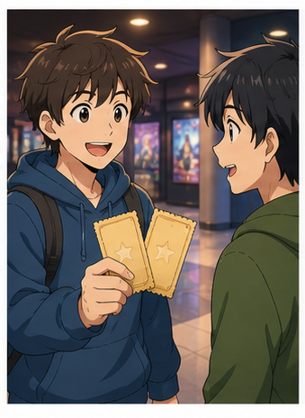

### **Would you like to go to a movie?**

— Bạn có muốn đi xem phim không?

Cách khác:

* **Would you like to go to the cinema?**
* **Do you want to see a movie?**
* **How about going to the cinema?**

### Nhận lời

**Sure, I'd love to.**

— Được chứ, tôi rất muốn.

### Từ chối lịch sự

**I'd love to, but I'm busy tonight.**

— Tôi rất muốn, nhưng tối nay tôi bận.

---

## 6.2. Hỏi người khác muốn xem phim nào

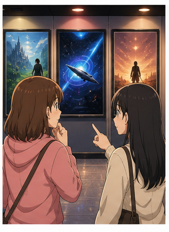

### **What movie do you want to see?**

— Bạn muốn xem phim nào?

Cách khác:

* **Which movie do you want to see?**
* **What do you want to watch?**

### Trả lời

* **I'd like to see an action movie.**
* **How about a comedy?**

---

## 6.3. Hỏi thể loại phim

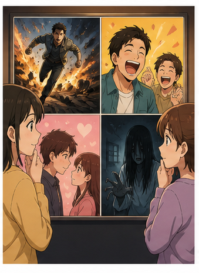

### **What kind of movies do you like?**

— Bạn thích thể loại phim nào?

Ví dụ trả lời:

* **I like action movies.**
* **I enjoy horror movies.**
* **I prefer comedy.**
* **I like romantic movies.**

---

## 6.4. Hỏi phim nói về điều gì

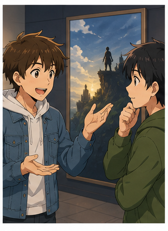

### **What's it about?**

— Phim nói về điều gì?

Ví dụ:

**A:** What's it about?
**B:** It's about a young man who wants to become a champion.

Cách khác:

### **What's the movie about?**

---

## 6.5. Hỏi ai đóng trong phim

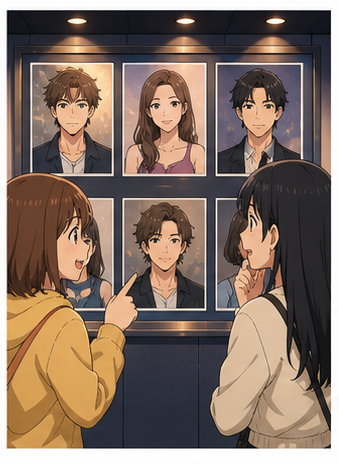

### **Who's in the film?**

— Ai đóng trong phim?

Có thể hỏi cụ thể:

* **Who's the main actor?**
* **Who's the main actress?**
* **Who plays the main role?**

---

## 6.6. Hỏi về đạo diễn

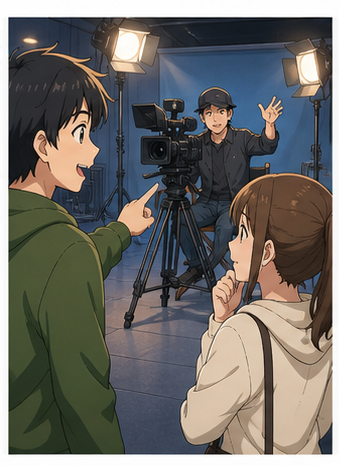

### **Who directed it?**

— Ai đạo diễn bộ phim?

Hoặc:

### **Who's the director?**

— Đạo diễn là ai?

---

## 6.7. Hỏi phim đang chiếu ở đâu

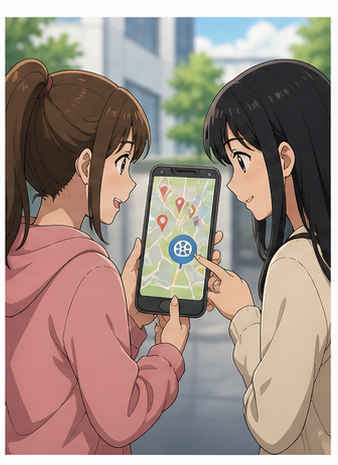

### **Where is it showing?**

— Phim đang chiếu ở đâu?

Có thể nói:

* **Which cinema is showing it?**
* **Is it showing at the cinema near here?**

---

## 6.8. Hỏi giờ chiếu

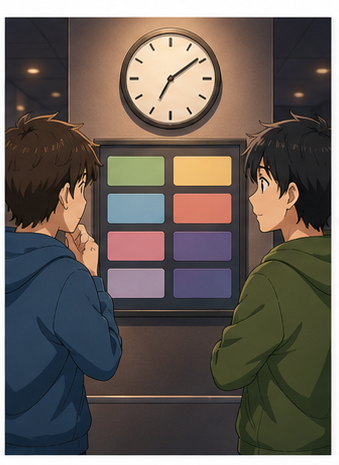

### **What time does the movie start?**

— Phim bắt đầu lúc mấy giờ?

Ví dụ:

* **The movie starts at 6:30.**
* **There's a showing at eight.**

---

## 6.9. Hỏi thời lượng phim

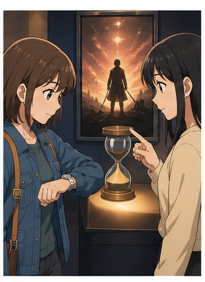

### **How long does it last?**

— Phim kéo dài bao lâu?

Hoặc:

### **How long is the movie?**

— Bộ phim dài bao lâu?

Trả lời:

* **It lasts about two hours.**
* **It's around two hours long.**

---

## 6.10. Hỏi còn vé không

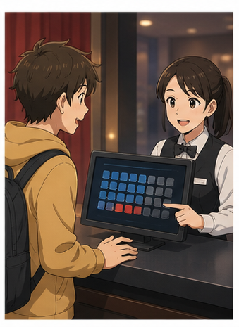

### **Are there any tickets left?**

— Còn vé không?

Cách khác:

* **Do you still have tickets for the 7 p.m. showing?**
* **Are there any seats left?**

### Trả lời

* **Yes, there are.**
* **Sorry, it's sold out.**

---

## 6.11. Mua vé xem phim

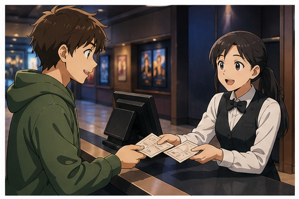

### **Two adults, please.**

— Cho tôi hai vé người lớn.

Cách đầy đủ hơn:

### **Two tickets for the 7 p.m. showing, please.**

Hoặc:

### **I'd like two tickets, please.**

---

## 6.12. Hỏi về chỗ ngồi

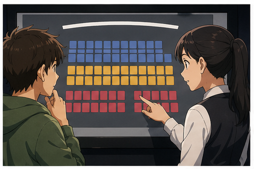

### **Where would you like to sit?**

— Bạn muốn ngồi ở đâu?

Có thể trả lời:

* **I'd like to sit at the back.**
* **I prefer the middle.**
* **I'd like to sit in the front row.**

---

## 6.13. Đề xuất chỗ ngồi

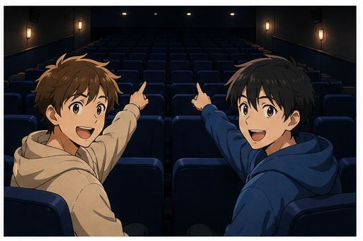

### **Let's sit at the back.**

— Chúng ta ngồi phía sau nhé.

### **Let's sit in the middle.**

— Chúng ta ngồi ở giữa nhé.

### **Let's sit near the front.**

— Chúng ta ngồi gần phía trước nhé.

---

## 6.14. Nói lý do không muốn ngồi gần

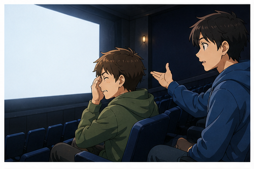

### **I don't like being too near the screen.**

— Tôi không thích ngồi quá gần màn hình.

**Cấu trúc:**

`like / don't like + V-ing`

Ví dụ:

* **I like sitting at the back.**
* **I don't like sitting near the screen.**

---

## 6.15. Hỏi diễn viên yêu thích

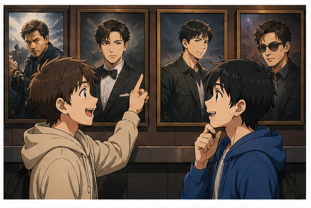

### **Who's your favorite movie star?**

— Ngôi sao điện ảnh yêu thích của bạn là ai?

Cách cụ thể hơn:

* **Who's your favorite actor?**
* **Who's your favorite actress?**

---

## 6.16. Hỏi người khác có thích phim không


### **Did you enjoy the movie?**

— Bạn có thích bộ phim không?

Cách khác:

* **Did you like the movie?**
* **What did you think of the movie?**
* **How was the movie?**

---

## 6.17. Nhận xét phim

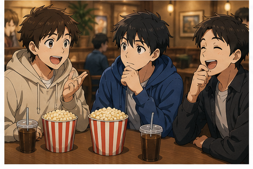

### **It was + tính từ**

* **It was interesting.**
* **It was boring.**
* **It was touching.**
* **It was funny.**
* **It was exciting.**
* **It was great.**

Ví dụ:

**It was a really touching movie.**

— Đó là một bộ phim rất cảm động.

---

## 6.18. Dùng câu hỏi đuôi để chia sẻ cảm nhận


### **It was an interesting film, wasn't it?**

— Bộ phim thú vị nhỉ?

Cách tương tự:

* **It was great, wasn't it?**
* **The ending was surprising, wasn't it?**

Đây là cách tự nhiên để mời người kia đồng ý hoặc đưa ra ý kiến.

---

## 6.19. Nói phim khó hiểu hoặc thiếu ý nghĩa

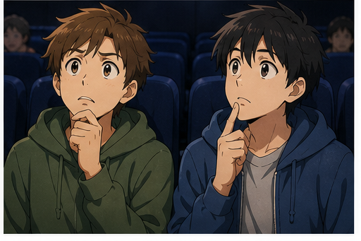

### **It didn't seem to have much meaning.**

— Bộ phim có vẻ không có nhiều ý nghĩa.

Cách khác:

* **I didn't really understand the story.**
* **The story was a little confusing.**
* **I didn't understand the ending.**

---

# 7. Các thể loại phim phổ biến

| Thể loại                 | Tiếng Anh                    | Ví dụ                       |
| ------------------------ | ---------------------------- | --------------------------- |
| Phim hành động           | **action movie**             | I like action movies.       |
| Phim hài                 | **comedy**                   | Let's watch a comedy.       |
| Phim kinh dị             | **horror movie**             | I don't like horror movies. |
| Phim tình cảm            | **romance / romantic movie** | She likes romantic movies.  |
| Phim khoa học viễn tưởng | **science fiction / sci-fi** | I love sci-fi movies.       |
| Phim hoạt hình           | **animated movie**           | It's an animated movie.     |
| Phim phiêu lưu           | **adventure movie**          | It's an adventure movie.    |
| Phim chính kịch          | **drama**                    | It's a serious drama.       |
| Phim tài liệu            | **documentary**              | I watched a documentary.    |
| Phim giả tưởng           | **fantasy movie**            | I enjoy fantasy movies.     |

### Sơ đồ

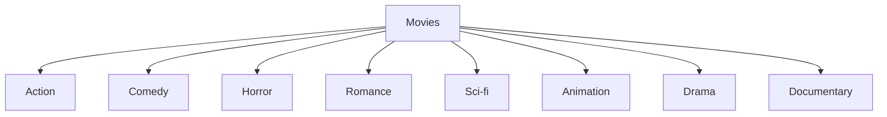

---

# 8. Phân biệt **movie**, **film** và **cinema**

## **movie**

= một bộ phim.

**Let's watch a movie.**

---

## **film**

= một bộ phim; nghĩa gần giống **movie**.

**It was a good film.**

---

## **cinema**

= rạp chiếu phim hoặc điện ảnh nói chung.

**Let's go to the cinema.**

### So sánh

| Từ         | Nghĩa          | Ví dụ                   |
| ---------- | -------------- | ----------------------- |
| **movie**  | bộ phim        | I watched a movie.      |
| **film**   | bộ phim        | It was a good film.     |
| **cinema** | rạp chiếu phim | Let's go to the cinema. |

> Tiếng Anh-Mỹ thường dùng **go to the movies**.
> Tiếng Anh-Anh thường dùng **go to the cinema**.

---

# 9. Phát âm trọng tâm

## 9.1. **movie**

**movie**
/ˈmuː.vi/

Trọng âm:

**MOV**-ie

---

## 9.2. **horror**

**horror**
/ˈhɒr.ər/

Trọng âm:

**HOR**-ror

---

## 9.3. **director**

**director**
/daɪˈrek.tər/

Trọng âm:

di-**REC**-tor

---

## 9.4. **ticket**

**ticket**
/ˈtɪk.ɪt/

Trọng âm:

**TICK**-et

---

## 9.5. **interesting**

**interesting**
/ˈɪn.trə.stɪŋ/

Trọng âm:

**IN**-ter-est-ing

---

## 9.6. **boring**

**boring**
/ˈbɔː.rɪŋ/

Trọng âm:

**BOR**-ing

---

## 9.7. **touching**

**touching**
/ˈtʌtʃ.ɪŋ/

Trọng âm:

**TOUCH**-ing

---

## 9.8. Nối âm trong hội thoại

### **Would you like to ...?**

Trong hội thoại nhanh:

`Would-you-like-to`

### **What do you want to see?**

Nên luyện cả cụm:

`What-do-you-want-to-see?`

### **Did you enjoy the movie?**

Luyện:

`Did-you-enjoy-the-movie?`

---

# 10. Hội thoại thực tế — Real-Life Conversation

## Hội thoại chính — Rủ bạn đi xem phim


**Hugo:** Are you free this evening?
**Alex:** Yes. Why?
**Hugo:** I have two tickets for the cinema. Would you like to go with me?
**Alex:** Sure, I'd love to. What movie are we seeing?
**Hugo:** It's an action movie.
**Alex:** Great. What time does it start?
**Hugo:** It starts at 6:30.
**Alex:** How long does it last?
**Hugo:** Around two hours.
**Alex:** Perfect. Let's meet outside the cinema at six.

### Nội dung giao tiếp

```text
Kiểm tra người kia có rảnh
        ↓
Đưa lời mời
        ↓
Nhận lời
        ↓
Hỏi phim
        ↓
Hỏi giờ chiếu
        ↓
Hỏi thời lượng
        ↓
Chốt giờ gặp
```

---

## Hội thoại 2 — Mua vé


**Customer:** Hi. Are there any tickets left for the seven o'clock showing?
**Staff:** Yes. How many would you like?
**Customer:** Two adults, please.
**Staff:** Would you like to sit near the front or at the back?
**Customer:** Somewhere in the middle, please.
**Staff:** These two seats are available.
**Customer:** Great. How much are they?
**Staff:** They're twelve dollars each.
**Customer:** That's fine. Thank you.
**Staff:** Enjoy the movie.

---

## Hội thoại 3 — Chọn phim


**Mai:** What kind of movies do you like?
**Nam:** I really enjoy action movies and comedy. What about you?
**Mai:** I prefer dramas and romantic movies.
**Nam:** How about this new action comedy?
**Mai:** What's it about?
**Nam:** It's about two police officers who have to work together.
**Mai:** Who's in it?
**Nam:** Daniel Lee plays the main role.
**Mai:** Oh, I like him. Let's watch it.
**Nam:** Great. I'll check the showtimes.

---

## Hội thoại 4 — Sau khi xem phim


**Linh:** Did you enjoy the movie?
**Minh:** Yes. I thought it was really interesting.
**Linh:** Me too. The ending was very touching.
**Minh:** I liked the actors too.
**Linh:** The main actor was excellent, wasn't he?
**Minh:** Definitely. But the movie was a little long.
**Linh:** That's true. The middle part was slightly boring.
**Minh:** Still, I'd watch it again.
**Linh:** Same here.

---

# 11. Natural Expressions — Cách nói tự nhiên

| Cụm từ                                 | Nghĩa                                | Khi dùng          |
| -------------------------------------- | ------------------------------------ | ----------------- |
| **Would you like to go to a movie?**   | Bạn muốn đi xem phim không?          | Mời               |
| **I'd love to.**                       | Tôi rất muốn.                        | Nhận lời          |
| **What do you want to see?**           | Bạn muốn xem gì?                     | Chọn phim         |
| **What kind of movies do you like?**   | Bạn thích loại phim nào?             | Hỏi sở thích      |
| **What's it about?**                   | Phim nói về gì?                      | Hỏi nội dung      |
| **Who's in it?**                       | Ai đóng trong đó?                    | Hỏi diễn viên     |
| **Who's the director?**                | Đạo diễn là ai?                      | Hỏi đạo diễn      |
| **What time does it start?**           | Phim bắt đầu lúc mấy giờ?            | Hỏi giờ chiếu     |
| **How long is it?**                    | Phim dài bao lâu?                    | Hỏi thời lượng    |
| **Are there any tickets left?**        | Còn vé không?                        | Mua vé            |
| **Two tickets, please.**               | Cho tôi hai vé.                      | Mua vé            |
| **Where would you like to sit?**       | Bạn muốn ngồi ở đâu?                 | Chọn ghế          |
| **Let's sit at the back.**             | Ngồi phía sau nhé.                   | Đề xuất           |
| **I prefer the middle.**               | Tôi thích ngồi giữa hơn.             | Chọn chỗ          |
| **Did you enjoy the movie?**           | Bạn thích phim không?                | Hỏi cảm nhận      |
| **What did you think of it?**          | Bạn thấy phim thế nào?               | Hỏi ý kiến        |
| **It was great.**                      | Phim rất hay.                        | Nhận xét          |
| **It was touching.**                   | Phim cảm động.                       | Nhận xét          |
| **It was a little boring.**            | Phim hơi chán.                       | Nhận xét          |
| **The ending was great.**              | Đoạn kết rất hay.                    | Nhận xét          |
| **I loved it.**                        | Tôi rất thích.                       | Cảm nhận tích cực |
| **It wasn't really my kind of movie.** | Nó không hẳn là kiểu phim tôi thích. | Không quá thích   |
| **I'd watch it again.**                | Tôi sẽ xem lại.                      | Khen phim         |
| **It's worth watching.**               | Phim đáng xem.                       | Gợi ý phim        |

---

# 12. Lỗi thường gặp — Common Mistakes

## Lỗi 1: Dùng **see movie** nhưng thiếu mạo từ

❌ **I want to see movie.**

✅ **I want to see a movie.**

Nếu nói về một phim cụ thể:

✅ **I want to see the movie.**

---

## Lỗi 2: Dùng sai sau **Would you like**

❌ **Would you like go to a movie?**

✅ **Would you like to go to a movie?**

### Cấu trúc

`Would you like to + V?`

---

## Lỗi 3: Dùng sai sau **enjoy**

❌ **I enjoy to watch movies.**

✅ **I enjoy watching movies.**

### Cấu trúc

`enjoy + V-ing`

---

## Lỗi 4: Hỏi nội dung bằng **How is it about?**

❌ **How is the movie about?**

✅ **What's the movie about?**

✅ **What's it about?**

---

## Lỗi 5: Sai câu hỏi về diễn viên

❌ **Who is play in the movie?**

✅ **Who's in the movie?**

Hoặc:

✅ **Who plays the main role?**

---

## Lỗi 6: Nhầm **interesting** và **interested**

### **interesting**

= thứ gì đó thú vị.

✅ **The movie was interesting.**

### **interested**

= người cảm thấy hứng thú.

✅ **I'm interested in the movie.**

❌ **The movie was interested.**

---

## Lỗi 7: Nhầm **boring** và **bored**

### **boring**

= gây nhàm chán.

**The movie was boring.**

### **bored**

= cảm thấy chán.

**I was bored.**

---

## Lỗi 8: Dùng **in the back** không đúng khi nói chỗ ngồi

Khi nói vị trí trong rạp:

✅ **sit at the back**

✅ **sit in the back row**

✅ **sit in the front row**

---

## Lỗi 9: Dùng sai **last**

❌ **How long is the movie last?**

✅ **How long does the movie last?**

Hoặc:

✅ **How long is the movie?**

---

## Lỗi 10: Nhầm **fun** và **funny**

### **funny**

= gây cười.

**The movie was funny.**

### **fun**

= vui, thú vị khi trải nghiệm.

**The movie was fun.**

---

## Lỗi 11: Dùng **very touching me**

❌ **The movie was very touching me.**

✅ **The movie was very touching.**

Hoặc:

✅ **The movie really touched me.**

---

## Lỗi 12: Dùng **like** sai sau câu hỏi

❌ **How did you like about the movie?**

✅ **Did you like the movie?**

✅ **What did you think of the movie?**

---

# 13. Luyện tập có hướng dẫn

## Bài 1 — Nối từ với nghĩa

1. director
2. ticket
3. touching
4. boring
5. front row
6. movie star

A. nhàm chán
B. đạo diễn
C. cảm động
D. hàng ghế đầu
E. vé
F. ngôi sao điện ảnh

<details>
<summary>Đáp án</summary>

1–B
2–E
3–C
4–A
5–D
6–F

</details>

---

## Bài 2 — Điền từ vào chỗ trống

Dùng:

`tickets` · `touching` · `movie` · `director` · `boring`

1. Would you like to go to a ________?
2. Are there any ________ left?
3. Who's the ________?
4. The ending was very ________.
5. I didn't like the film. It was ________.

<details>
<summary>Đáp án</summary>

1. movie
2. tickets
3. director
4. touching
5. boring

</details>

---

## Bài 3 — Chọn câu đúng

### 1. Bạn muốn rủ bạn đi xem phim.

* A. Would you like go to a movie?
* B. Would you like to go to a movie?
* C. Would you like going to a movie?

**Đáp án:** B

---

### 2. Bạn muốn hỏi nội dung phim.

* A. What's it about?
* B. How is it about?
* C. What does it about?

**Đáp án:** A

---

### 3. Bạn muốn hỏi phim dài bao lâu.

* A. How long does it last?
* B. How long it lasts?
* C. How long does it lasting?

**Đáp án:** A

---

### 4. Bạn muốn nói bộ phim nhàm chán.

* A. I was boring.
* B. The movie was bored.
* C. The movie was boring.

**Đáp án:** C

---

## Bài 4 — **interesting** hay **interested**

1. The movie was very ________.
2. I'm really ________ in this new film.
3. The story sounds ________.
4. Are you ________ in seeing it?

<details>
<summary>Đáp án</summary>

1. interesting
2. interested
3. interesting
4. interested

</details>

---

## Bài 5 — **boring** hay **bored**

1. The movie was ________.
2. I was ________ during the movie.
3. The story became ________ after an hour.
4. The children looked ________.

<details>
<summary>Đáp án</summary>

1. boring
2. bored
3. boring
4. bored

</details>

---

## Bài 6 — Hoàn thành hội thoại

**A:** Would you like to go to a ________ tonight?
**B:** Sure, I'd love to. What do you want to ________?
**A:** How about the new action movie?
**B:** Sounds good. What's it ________?
**A:** It's about a secret agent.
**B:** How long does it ________?
**A:** About two hours.
**B:** Great. Are there any ________ left?

<details>
<summary>Đáp án</summary>

1. movie
2. see
3. about
4. last
5. tickets

</details>

---

# 14. Speaking Challenge — Thử thách nói

## Nhiệm vụ 1 — Đọc mẫu câu

Đọc các câu sau thành tiếng:

* **Would you like to go to a movie?**
* **Sure, I'd love to.**
* **What kind of movies do you like?**
* **What's it about?**
* **Who's in the film?**
* **How long does it last?**
* **Are there any tickets left?**
* **Let's sit at the back.**
* **Did you enjoy the movie?**
* **It was a touching movie.**

Đọc mỗi câu hai lần:

* lần 1 chậm và rõ;
* lần 2 với tốc độ hội thoại tự nhiên.

---

## Nhiệm vụ 2 — Nói về sở thích phim

Nói ít nhất **5 câu** về sở thích của bạn.

Có thể trả lời:

1. Bạn thích thể loại phim nào?
2. Bạn không thích thể loại nào?
3. Diễn viên yêu thích của bạn là ai?
4. Bạn thích xem phim ở nhà hay ở rạp?
5. Bạn thích ngồi ở đâu trong rạp?

Ví dụ:

> **I really enjoy action movies. I also like comedy, but I don't like horror movies very much. I prefer watching movies at the cinema because the screen is bigger. I usually sit in the middle.**

---

## Nhiệm vụ 3 — Mua vé

Đóng vai khách hàng tại rạp phim.

Phải sử dụng ít nhất:

* **Are there any tickets left?**
* **Two tickets, please.**
* **What time does it start?**
* **How long does it last?**
* **I'd like to sit ...**

---

## Nhiệm vụ 4 — Hội thoại 8 lượt

Tạo một đoạn hội thoại có ít nhất:

* 1 lời mời đi xem phim;
* 1 câu hỏi về thể loại;
* 1 câu hỏi về nội dung;
* 1 câu hỏi về diễn viên;
* 1 câu hỏi về giờ chiếu;
* 1 câu hỏi về thời lượng;
* 1 quyết định chọn phim;
* 1 giờ gặp cụ thể.

---

## Nhiệm vụ 5 — Ghi âm

Ghi âm từ **45–60 giây**, sau đó kiểm tra:

* [ ] Tôi dùng đúng **Would you like to + V?**
* [ ] Tôi dùng đúng **enjoy + V-ing**.
* [ ] Tôi có thể hỏi **What's it about?**
* [ ] Tôi có thể hỏi **Who's in the film?**
* [ ] Tôi có thể hỏi **How long does it last?**
* [ ] Tôi phân biệt **interesting / interested**.
* [ ] Tôi phân biệt **boring / bored**.
* [ ] Tôi có thể mua vé bằng tiếng Anh.
* [ ] Tôi có thể đưa ra nhận xét về một bộ phim.
* [ ] Tôi có thể duy trì hội thoại ít nhất 45 giây.

---

# 15. Practice Mission — Nhiệm vụ thực tế

Trong hôm nay, hãy tạo một cuộc hội thoại theo công thức:

> **Invitation → Choose a movie → Ask details → Buy tickets → Watch → Review**

Ví dụ:

> **Would you like to go to a movie tonight?**
> ↓
> **Sure, I'd love to.**
> ↓
> **How about the new comedy?**
> ↓
> **What's it about?**
> ↓
> **It's about two friends who travel around Europe.**
> ↓
> **Sounds good. What time does it start?**
> ↓
> **At seven thirty.**
> ↓
> **Great. Let's get the tickets.**

Sau đó viết hoặc nói một đoạn hội thoại **8–10 lượt** cho một trong các tình huống:

* rủ bạn đi xem phim;
* chọn giữa hai bộ phim;
* mua vé tại rạp;
* chọn ghế trong rạp;
* nói về diễn viên yêu thích;
* nói về bộ phim vừa xem;
* giới thiệu một bộ phim hay;
* tranh luận xem phim hành động hay phim hài.

---

# 16. Tự đánh giá cuối bài

Đánh dấu khi bạn có thể thực hiện mà không nhìn bài:

* [ ] Tôi có thể nói **Would you like to go to a movie?**
* [ ] Tôi có thể nhận lời bằng **I'd love to.**
* [ ] Tôi có thể hỏi **What movie do you want to see?**
* [ ] Tôi có thể hỏi **What kind of movies do you like?**
* [ ] Tôi có thể hỏi **What's it about?**
* [ ] Tôi có thể hỏi **Who's in the film?**
* [ ] Tôi có thể hỏi **Who's the director?**
* [ ] Tôi có thể hỏi **What time does it start?**
* [ ] Tôi có thể hỏi **How long does it last?**
* [ ] Tôi có thể hỏi **Are there any tickets left?**
* [ ] Tôi có thể mua một hoặc nhiều vé.
* [ ] Tôi có thể nói nơi mình muốn ngồi.
* [ ] Tôi biết **front row** và **back row**.
* [ ] Tôi có thể hỏi **Did you enjoy the movie?**
* [ ] Tôi có thể dùng **interesting**.
* [ ] Tôi có thể dùng **boring**.
* [ ] Tôi có thể dùng **touching**.
* [ ] Tôi phân biệt **interesting / interested**.
* [ ] Tôi phân biệt **boring / bored**.
* [ ] Tôi có thể duy trì hội thoại ít nhất 45 giây.

---

# 17. Câu hỏi mở cuối bài

**Imagine you have two free movie tickets for tonight. How would you invite a friend, choose a movie together, decide where to sit, and talk about the film after watching it?**

*Hãy tưởng tượng bạn có hai vé xem phim miễn phí cho tối nay. Bạn sẽ rủ một người bạn như thế nào, cùng chọn phim ra sao, quyết định chỗ ngồi và nói gì về bộ phim sau khi xem?*

---

# 18. Ghi chú dành cho giảng viên

* **Module:** 02 — Everyday Conversations / Những cuộc hội thoại thường ngày
* **Chủ điểm:** Seeing a Movie
* **Thời lượng video:** 8–12 phút
* **Luyện nói:** 5–10 phút

### Trọng tâm từ vựng

* movie
* film
* action movie
* horror movie
* comedy
* director
* actor
* actress
* role
* play a role
* movie star
* screen
* ticket
* front row
* back row
* interesting
* boring
* touching
* ending
* cinema

### Trọng tâm cấu trúc

* **Would you like to go to a movie?**
* **Sure, I'd love to.**
* **What movie do you want to see?**
* **What kind of movies do you like?**
* **What's it about?**
* **Who's in the film?**
* **Who plays the main role?**
* **Who's the director?**
* **Where is it showing?**
* **What time does the movie start?**
* **How long does it last?**
* **Are there any tickets left?**
* **Two tickets, please.**
* **Where would you like to sit?**
* **Let's sit at the back.**
* **I'd like to sit in the front row.**
* **I don't like being too near the screen.**
* **Who's your favorite movie star?**
* **Did you enjoy the movie?**
* **What did you think of it?**
* **It was interesting / boring / touching.**
* **It was an interesting film, wasn't it?**

### Trọng tâm phát âm

* **movie**
* **horror**
* **director**
* **ticket**
* **interesting**
* **boring**
* **touching**
* **cinema**

### Lưu ý ngôn ngữ

* **Would you like to + V** dùng để đưa ra lời mời lịch sự.
* **I'd love to** là cách nhận lời tự nhiên.
* Sau **enjoy** dùng **V-ing**:

  * **I enjoy watching movies.**
* **What's it about?** dùng để hỏi nội dung.
* **Who's in it?** dùng để hỏi diễn viên.
* **How long does it last?** và **How long is it?** đều có thể hỏi thời lượng.
* **movie** và **film** đều chỉ bộ phim.
* **cinema** thường chỉ rạp chiếu phim.
* **interesting** mô tả sự vật gây hứng thú.
* **interested** mô tả cảm xúc của người.
* **boring** mô tả thứ gây nhàm chán.
* **bored** mô tả người cảm thấy chán.
* **touching** mang nghĩa cảm động.
* Dùng:

  * **sit at the back**
  * **sit in the back row**
  * **sit in the front row**
* **play a role** = đóng một vai.
* **main role / leading role** = vai chính.
* Khi nhận xét phim ở quá khứ, ưu tiên:

  * **It was ...**
  * **The ending was ...**
  * **I liked ...**
  * **I didn't like ...**

### Hoạt động gợi ý — Choose a Movie

Chia lớp thành nhóm 2–3 người.

Mỗi người có sở thích khác nhau.

Ví dụ:

**Người A:**

> Thích phim hành động và khoa học viễn tưởng. Không thích phim kinh dị.

**Người B:**

> Thích phim hài và phim tình cảm. Không thích phim quá dài.

**Người C:**

> Thích phim kinh dị nhưng chỉ rảnh sau 7 giờ tối.

Cả nhóm phải hỏi nhau:

> **What kind of movies do you like?**

> **What do you want to see?**

> **What's it about?**

> **How long does it last?**

> **What time does it start?**

Sau đó cả nhóm phải thống nhất **một bộ phim và một giờ chiếu**.

### Role-play mẫu — Tại quầy vé

**Người A nhận:**

> Bạn muốn mua hai vé cho suất 7:30. Bạn không muốn ngồi quá gần màn hình.

**Người B nhận:**

> Suất 7:30 vẫn còn ghế ở hàng đầu, giữa và hàng sau.

Người A phải sử dụng ít nhất:

* **Are there any tickets left?**
* **Two tickets, please.**
* **Where are the seats?**
* **I don't like sitting too near the screen.**
* **I'd prefer ...**

Người B phải sử dụng ít nhất:

* **Yes, there are.**
* **Where would you like to sit?**
* **We have seats ...**
* **These seats are available.**
* **Enjoy the movie.**

### Role-play mẫu — Sau khi xem phim

**Người A nhận:**

> Bạn rất thích bộ phim vì diễn viên chính và đoạn kết.

**Người B nhận:**

> Bạn thấy phim hơi dài và có vài đoạn nhàm chán.

Phải sử dụng ít nhất:

* **Did you enjoy the movie?**
* **I thought ...**
* **It was ...**
* **The ending was ...**
* **The main actor ...**
* **I agree / I don't agree.**
* **I'd watch it again / I wouldn't watch it again.**

Mục tiêu cuối cùng là mỗi người đưa ra một đánh giá ngắn:

> **I'd recommend it because ...**

hoặc:

> **I wouldn't recommend it because ...**

---
