# LESSON 10 — NHỜ NGƯỜI KHÁC HỖ TRỢ

> **Module 02 — Everyday Conversations / Những cuộc hội thoại thường ngày**
> **Chủ đề:** Asking for Help — Yêu cầu giúp đỡ và phản hồi một cách lịch sự
> **Trình độ gợi ý:** A1–A2
> **Thời lượng:** 8–12 phút học bài + 5–10 phút luyện nói

---

## 1. Tình huống thực tế

Trong cuộc sống hằng ngày, bạn thường cần nhờ người khác giúp khi:

* cần ai đó lấy hoặc đưa một đồ vật;
* cần mang một vật nặng;
* muốn nhờ ai đó làm giúp một việc nhỏ;
* không thể tự di chuyển hoặc xử lý tình huống;
* cần tìm một người hoặc đồ vật bị mất;
* gặp tình huống nguy hiểm;
* nhìn thấy cháy, khói hoặc tai nạn;
* cần gọi dịch vụ khẩn cấp;
* cần nhờ người khác giữ bình tĩnh hoặc đứng yên;
* muốn hỏi xem chuyện gì đã xảy ra;
* muốn trấn an và đề nghị giúp đỡ người khác.

Bạn cần biết cách nói những câu như:

* **Could you do me a favor?**
* **Could you help me carry this box?**
* **Pass me the book, please.**
* **Could you please take this letter to him?**
* **Please help me find my daughter.**
* **What's the matter?**
* **What happened?**
* **What's wrong?**
* **Don't worry. Let me help you.**
* **Hold on.**
* **Stay still.**
* **Be careful.**
* **Somebody help me!**
* **Call the fire department!**


---

## 2. Mục tiêu bài học

Sau bài học, người học có thể:

1. Nhờ người khác giúp bằng **Could you help me ...?**
2. Nhờ một việc nhỏ bằng **Could you do me a favor?**
3. Yêu cầu lịch sự bằng **Could you please + V ...?**
4. Nhờ ai đó đưa một đồ vật bằng **Pass me ..., please.**
5. Nhờ mang một đồ vật bằng **help me carry ...**
6. Nhờ tìm người hoặc đồ vật bị mất.
7. Hỏi vấn đề bằng **What's the matter?**
8. Hỏi chuyện gì đã xảy ra bằng **What happened?**
9. Hỏi tình trạng bằng **What's wrong?**
10. Đề nghị giúp bằng **Let me help you.**
11. Trấn an bằng **Don't worry.**
12. Dùng **Hold on**, **Stay still** và **Be careful** trong tình huống cần hỗ trợ.
13. Biết cách kêu cứu trong tình huống khẩn cấp.
14. Biết cách yêu cầu gọi lực lượng cứu hộ phù hợp.
15. Phân biệt lời nhờ thông thường và lời kêu cứu khẩn cấp.
16. Duy trì một đoạn hội thoại 6–8 lượt khi cần giúp đỡ.

---

## 3. Sơ đồ giao tiếp

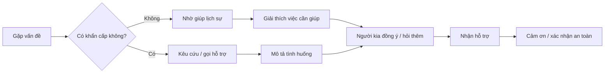

### Mẫu đơn giản

`Could you help me, please?`
→ `Sure. What's the matter?`
→ `I can't carry this box upstairs.`
→ `No problem. Let me help you.`
→ `Thank you very much.`

---

# 4. Từ vựng trọng tâm — Core Vocabulary

## 4.1. **help** /help/

**Nghĩa:** giúp đỡ; sự giúp đỡ

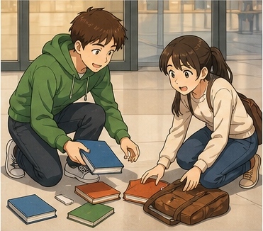

**Ví dụ:**

* **Could you help me?**
  — Bạn có thể giúp tôi không?

* **I need some help.**
  — Tôi cần một chút giúp đỡ.

---

## 4.2. **favor** /ˈfeɪ.vər/

**Nghĩa:** việc giúp đỡ, việc làm hộ


### Cụm quan trọng

**do someone a favor**

= giúp ai một việc

**Ví dụ:**

* **Could you do me a favor?**
  — Bạn có thể giúp tôi một việc không?

* **Can you do me a small favor?**
  — Bạn có thể giúp tôi một việc nhỏ không?

---

## 4.3. **carry** /ˈkær.i/

**Nghĩa:** mang, xách, khiêng

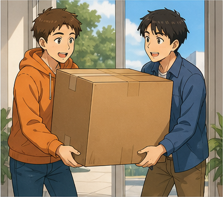

**Ví dụ:**

* **Could you help me carry this box?**
  — Bạn có thể giúp tôi mang chiếc hộp này không?

* **This bag is too heavy to carry.**
  — Chiếc túi này quá nặng để mang.

---

## 4.4. **pass** /pɑːs/

**Nghĩa trong bài:** đưa, chuyền

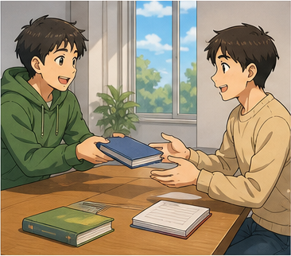

**Ví dụ:**

* **Pass me the book, please.**
  — Làm ơn đưa tôi quyển sách.

* **Could you pass me the water?**
  — Bạn có thể đưa tôi chai nước không?

---

## 4.5. **upstairs** /ˌʌpˈsteəz/

**Nghĩa:** lên tầng trên; ở tầng trên

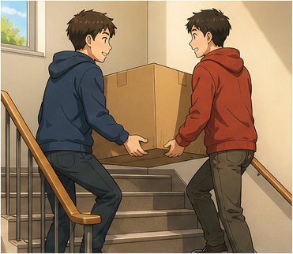

**Ví dụ:**

* **Could you help me carry the box upstairs?**
  — Bạn có thể giúp tôi mang hộp lên tầng trên không?

* **My room is upstairs.**
  — Phòng của tôi ở tầng trên.

---

## 4.6. **letter** /ˈlet.ər/

**Nghĩa:** thư


**Ví dụ:**

* **Could you take this letter to him?**
  — Bạn có thể mang lá thư này đến cho anh ấy không?

* **I received a letter yesterday.**
  — Hôm qua tôi nhận được một lá thư.

---

## 4.7. **find** /faɪnd/

**Nghĩa:** tìm thấy

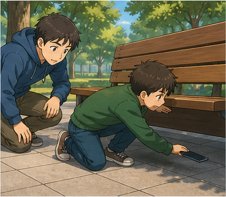

**Ví dụ:**

* **Please help me find my daughter.**
  — Làm ơn giúp tôi tìm con gái.

* **I can't find my phone.**
  — Tôi không tìm thấy điện thoại.

---

## 4.8. **handbag** /ˈhænd.bæɡ/

**Nghĩa:** túi xách tay


**Ví dụ:**

* **I can't find my handbag.**
  — Tôi không tìm thấy túi xách.

* **Someone took my handbag.**
  — Ai đó đã lấy túi xách của tôi.

---

## 4.9. **thief** /θiːf/

**Nghĩa:** kẻ trộm

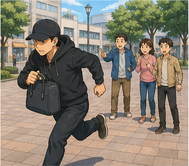

**Ví dụ:**

* **Stop! Thief!**
  — Dừng lại! Có trộm!

* **The thief ran away.**
  — Kẻ trộm đã chạy mất.

---

## 4.10. **fire** /faɪər/

**Nghĩa:** lửa; đám cháy

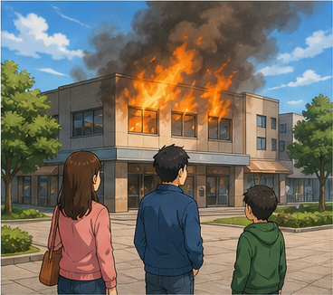

**Ví dụ:**

* **There's a fire!**
  — Có cháy!

* **Call the fire department!**
  — Gọi cứu hỏa đi!

---

## 4.11. **smoke** /sməʊk/

**Nghĩa:** khói

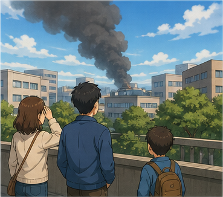

**Ví dụ:**

* **Can you see the smoke over there?**
  — Bạn có thấy khói ở đằng kia không?

* **There's a lot of smoke.**
  — Có rất nhiều khói.

---

## 4.12. **firefighter** /ˈfaɪəˌfaɪ.tər/

**Nghĩa:** lính cứu hỏa

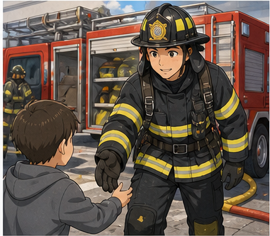

**Ví dụ:**

* **The firefighters are coming.**
  — Lính cứu hỏa đang đến.

* **Call the firefighters.**
  — Hãy gọi lực lượng cứu hỏa.

---

## 4.13. **dangerous** /ˈdeɪn.dʒər.əs/

**Nghĩa:** nguy hiểm

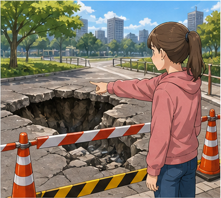

**Ví dụ:**

* **It's dangerous. Stay back.**
  — Nguy hiểm đấy. Hãy lùi lại.

* **Don't go inside. It's dangerous.**
  — Đừng đi vào trong. Nguy hiểm lắm.

---

## 4.14. **careful** /ˈkeə.fəl/

**Nghĩa:** cẩn thận


**Ví dụ:**

* **Be careful!**
  — Cẩn thận!

* **Please be careful on the stairs.**
  — Hãy cẩn thận khi đi cầu thang.

---

## 4.15. **hold on** /həʊld ɒn/

**Nghĩa:** chờ một chút; giữ chặt

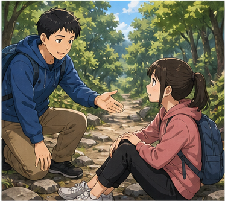

**Ví dụ:**

* **Hold on. I'll help you.**
  — Chờ một chút. Tôi sẽ giúp bạn.

* **Hold on to the rail.**
  — Hãy bám vào tay vịn.

---

## 4.16. **stay still** /steɪ stɪl/

**Nghĩa:** đứng yên, không cử động

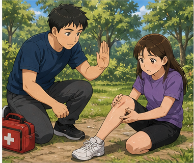

**Ví dụ:**

* **Stay still. Don't move.**
  — Đứng yên. Đừng cử động.

* **Please stay still for a moment.**
  — Hãy đứng yên một lúc.

---

## 4.17. **get down** /ɡet daʊn/

**Nghĩa:** xuống dưới

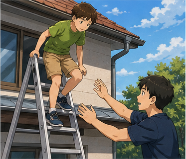

**Ví dụ:**

* **Be careful when you get down.**
  — Hãy cẩn thận khi xuống.

* **Can you get down by yourself?**
  — Bạn có thể tự xuống được không?

---

## 4.18. **climb** /klaɪm/

**Nghĩa:** leo, trèo

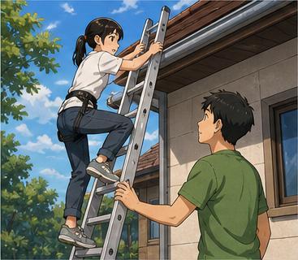

**Ví dụ:**

* **The cat climbed a tree.**
  — Con mèo trèo lên cây.

* **Don't climb up there. It's dangerous.**
  — Đừng trèo lên đó. Nguy hiểm lắm.

---

## 4.19. **emergency** /ɪˈmɜː.dʒən.si/

**Nghĩa:** tình huống khẩn cấp

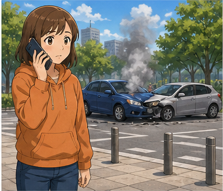

**Ví dụ:**

* **This is an emergency.**
  — Đây là tình huống khẩn cấp.

* **Call the emergency services.**
  — Hãy gọi dịch vụ khẩn cấp.

---

## 4.20. **injured** /ˈɪn.dʒəd/

**Nghĩa:** bị thương

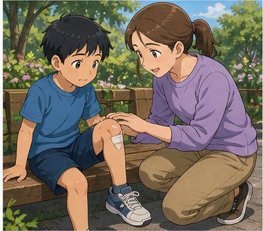

**Ví dụ:**

* **I think he's injured.**
  — Tôi nghĩ anh ấy bị thương.

* **Is anyone injured?**
  — Có ai bị thương không?

---

## 4.21. **stuck** /stʌk/

**Nghĩa:** bị mắc kẹt


**Ví dụ:**

* **My cat is stuck in a tree.**
  — Con mèo của tôi bị mắc kẹt trên cây.

* **The door is stuck.**
  — Cánh cửa bị kẹt.

---

## 4.22. **over there** /ˌəʊ.və ˈðeər/

**Nghĩa:** ở đằng kia


**Ví dụ:**

* **Can you see the smoke over there?**
  — Bạn có thấy khói ở đằng kia không?

* **The police officer is over there.**
  — Cảnh sát ở đằng kia.

---

# 5. Bảng tổng hợp từ vựng

| Từ / cụm từ     | IPA             | Nghĩa tiếng Việt    | Ví dụ ngắn             |
| --------------- | --------------- | ------------------- | ---------------------- |
| **help**        | /help/          | giúp đỡ             | Help me, please.       |
| **favor**       | /ˈfeɪ.vər/      | việc giúp đỡ        | Do me a favor.         |
| **carry**       | /ˈkær.i/        | mang, xách          | Carry this box.        |
| **pass**        | /pɑːs/          | đưa, chuyền         | Pass me the book.      |
| **upstairs**    | /ˌʌpˈsteəz/     | lên tầng trên       | Carry it upstairs.     |
| **letter**      | /ˈlet.ər/       | thư                 | Take this letter.      |
| **find**        | /faɪnd/         | tìm thấy            | Find my bag.           |
| **handbag**     | /ˈhænd.bæɡ/     | túi xách            | my handbag             |
| **thief**       | /θiːf/          | kẻ trộm             | Stop the thief!        |
| **fire**        | /faɪər/         | lửa, cháy           | There's a fire!        |
| **smoke**       | /sməʊk/         | khói                | I can see smoke.       |
| **firefighter** | /ˈfaɪəˌfaɪ.tər/ | lính cứu hỏa        | Call the firefighters. |
| **dangerous**   | /ˈdeɪn.dʒər.əs/ | nguy hiểm           | It's dangerous.        |
| **careful**     | /ˈkeə.fəl/      | cẩn thận            | Be careful.            |
| **hold on**     | /həʊld ɒn/      | chờ / giữ chặt      | Hold on.               |
| **stay still**  | /steɪ stɪl/     | đứng yên            | Stay still.            |
| **get down**    | /ɡet daʊn/      | xuống dưới          | Get down carefully.    |
| **climb**       | /klaɪm/         | leo, trèo           | Climb the ladder.      |
| **emergency**   | /ɪˈmɜː.dʒən.si/ | tình huống khẩn cấp | an emergency           |
| **injured**     | /ˈɪn.dʒəd/      | bị thương           | He is injured.         |
| **stuck**       | /stʌk/          | mắc kẹt             | The cat is stuck.      |
| **over there**  | /ˌəʊ.və ˈðeər/  | ở đằng kia          | Look over there.       |

---

# 6. Mẫu câu giao tiếp — Useful Structures

## 6.1. Nhờ người khác giúp


### **Could you help me?**

— Bạn có thể giúp tôi không?

Có thể thêm việc cần giúp:

### **Could you help me + V ...?**

* **Could you help me carry this box?**
* **Could you help me find my bag?**
* **Could you help me open this door?**

> **Could you ...?** lịch sự hơn **Can you ...?** trong nhiều tình huống.

---

## 6.2. Nhờ ai đó giúp một việc nhỏ


### **Could you do me a favor?**

— Bạn có thể giúp tôi một việc không?

Cách khác:

* **Can you do me a favor?**
* **Could I ask you a favor?**

### Hội thoại

**A:** Could you do me a favor?
**B:** Sure. What do you need?

---

## 6.3. Nhờ đưa đồ vật

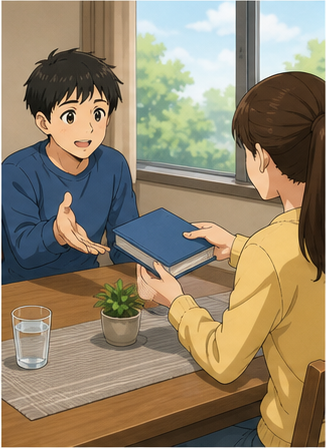

### **Pass me + đồ vật, please.**

* **Pass me the book, please.**
* **Pass me that box, please.**

Lịch sự hơn:

### **Could you pass me + đồ vật?**

* **Could you pass me the water?**

---

## 6.4. Nhờ người khác mang đồ

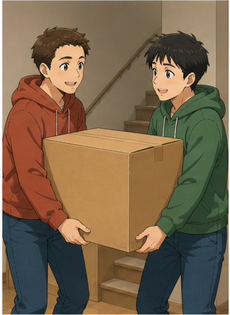

### **Could you help me carry + đồ vật?**

* **Could you help me carry this box upstairs?**
* **Could you help me carry these bags?**

Cấu trúc:

`help + người + V nguyên mẫu`

Ví dụ:

**She helped me carry the table.**

---

## 6.5. Nhờ ai đó làm một việc lịch sự


### **Could you please + V ...?**

* **Could you please take this letter to him?**
* **Could you please wait here?**
* **Could you please open the door?**

Đây là một cấu trúc lịch sự và rất hữu ích trong giao tiếp.

---

## 6.6. Nhờ tìm người hoặc đồ vật


### **Please help me find + người / đồ vật.**

* **Please help me find my daughter.**
* **Please help me find my phone.**

Hoặc:

### **Could you help me find ...?**

* **Could you help me find my handbag?**

---

## 6.7. Hỏi có chuyện gì

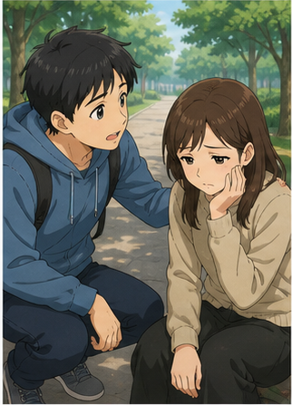

### **What's the matter?**

— Có chuyện gì vậy?

Dùng khi nhận thấy người khác:

* đang lo lắng;
* bị đau;
* gặp vấn đề;
* cần giúp đỡ.

Ví dụ:

**A:** What's the matter?
**B:** I can't move my leg.

---

## 6.8. Hỏi chuyện gì đã xảy ra

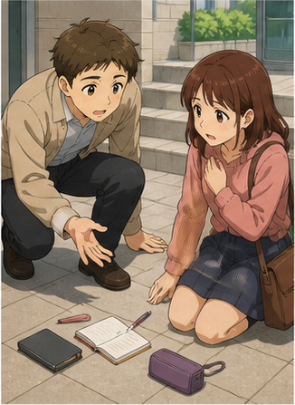

### **What happened?**

— Chuyện gì đã xảy ra?

Ví dụ:

**A:** You look worried. What happened?
**B:** I can't find my daughter.

---

## 6.9. Hỏi ai đó có vấn đề gì


### **What's wrong?**

— Có chuyện gì không?

### **What's wrong with you?**

— Bạn bị sao vậy?

Trong nhiều tình huống thông thường, **What's wrong?** nghe mềm và tự nhiên hơn.

---

## 6.10. Đề nghị giúp

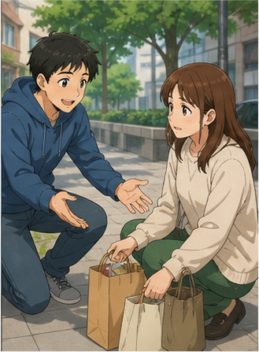

### **Let me help you.**

— Để tôi giúp bạn.

Có thể cụ thể hơn:

* **Let me carry that for you.**
* **Let me have a look.**
* **Let me call someone for you.**

### Cấu trúc

`Let me + V`

---

## 6.11. Trấn an người khác


### **Don't worry.**

— Đừng lo.

Có thể kết hợp:

* **Don't worry. I'll help you.**
* **Don't worry. Everything is okay.**
* **Don't worry. Help is coming.**

---

## 6.12. Yêu cầu chờ


### **Hold on.**

— Chờ một chút.

Cách khác:

* **Wait a moment.**
* **Just a second.**
* **Please wait here.**

---

## 6.13. Yêu cầu không cử động

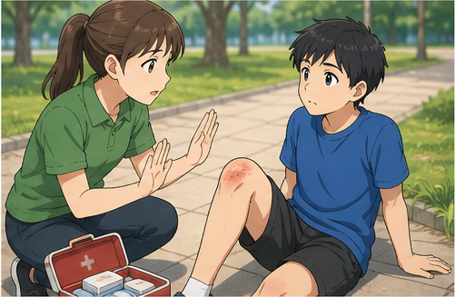

### **Stay still.**

— Hãy đứng yên / đừng cử động.

Có thể nói:

* **Stay still. Don't move.**
* **Please stay still for a moment.**

Thường dùng khi:

* người bị ngã;
* người bị đau;
* cần kiểm tra vết thương;
* cần tránh làm tình hình xấu hơn.

---

## 6.14. Cảnh báo người khác


### **Be careful!**

— Cẩn thận!

Ví dụ:

* **Be careful! The floor is wet.**
* **Be careful when you climb down.**
* **Be careful. It's dangerous.**

---

## 6.15. Kêu cứu


Trong tình huống khẩn cấp:

### **Help!**

### **Somebody help me!**

— Có ai giúp tôi với!

Có thể nói rõ vấn đề:

* **Help! There's a fire!**
* **Somebody help me! I can't move!**
* **Help! My child is missing!**

> Trong tình huống khẩn cấp, ưu tiên câu ngắn, rõ và dễ hiểu.

---

## 6.16. Báo cháy

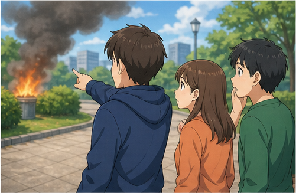

### **There's a fire!**

— Có cháy!

### **Call the fire department!**

— Gọi cứu hỏa!

### **I can see smoke over there.**

— Tôi thấy khói ở đằng kia.

---

## 6.17. Gọi dịch vụ khẩn cấp

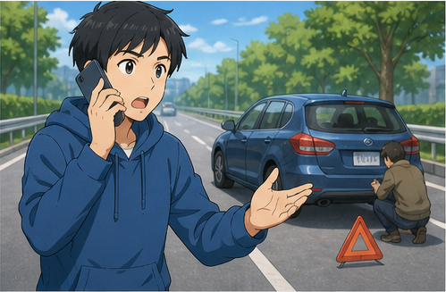

Khi gọi hỗ trợ, cần nói rõ:

1. bạn cần loại hỗ trợ nào;
2. chuyện gì đã xảy ra;
3. bạn đang ở đâu;
4. có ai bị thương hay không.

### Mẫu

**I need help.**

**There's been an accident.**

**Someone is injured.**

**We're at ...**

---

## 6.18. Nói ai đó bị mắc kẹt

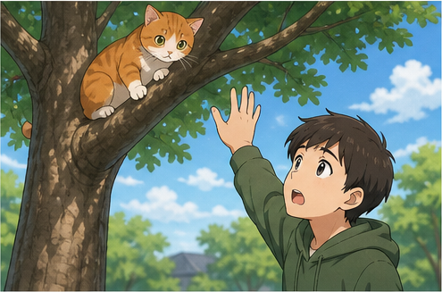

### **Someone / something is stuck + vị trí.**

* **My cat is stuck in a tree.**
* **The child is stuck upstairs.**

### Hỏi trợ giúp

**Could you please help?**

---

## 6.19. Nói ai đó bị thương

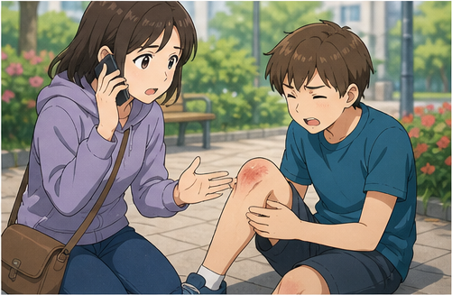

### **I think + người + is injured.**

* **I think he's injured.**
* **I think she's hurt.**

### Hỏi

**Is anyone injured?**

— Có ai bị thương không?

---

# 7. Các mức độ nhờ giúp đỡ

## Yêu cầu đơn giản, thân mật

**Can you help me?**

**Pass me the book, please.**

---

## Yêu cầu lịch sự

**Could you help me?**

**Could you please open the door?**

**Could you do me a favor?**

---

## Đề nghị người khác giúp

**Let me help you.**

**Can I help you?**

---

## Tình huống khẩn cấp

**Help!**

**Somebody help me!**

**Call an ambulance!**

**Call the fire department!**

### Sơ đồ

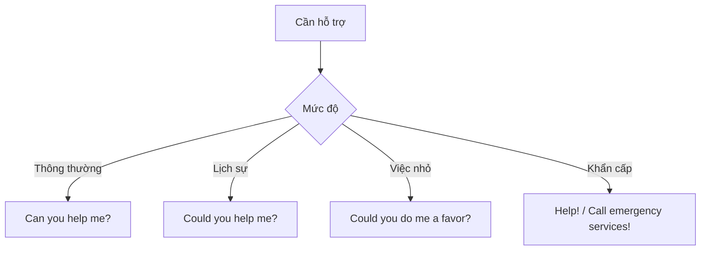

---

# 8. Phân biệt **help**, **help me** và **help me + V**

## **help**

Có thể là động từ hoặc danh từ.

**I need help.**

— Tôi cần giúp đỡ.

---

## **help me**

= giúp tôi.

**Please help me.**

---

## **help me + V**

= giúp tôi làm việc gì.

**Could you help me carry this box?**

**Can you help me find my phone?**

### Cấu trúc

`help + someone + V`

Thông thường không cần **to**.

✅ **Help me carry this box.**

Cũng có thể gặp:

✅ **Help me to carry this box.**

Nhưng dạng không có **to** thường gọn và tự nhiên hơn trong giao tiếp.

---

# 9. Phát âm trọng tâm

## 9.1. **favor**

**favor**
/ˈfeɪ.vər/

Trọng âm:

**FA**-vor

---

## 9.2. **carry**

**carry**
/ˈkær.i/

Trọng âm:

**CAR**-ry

---

## 9.3. **dangerous**

**dangerous**
/ˈdeɪn.dʒər.əs/

Trọng âm:

**DAN**-ger-ous

---

## 9.4. **firefighter**

**firefighter**
/ˈfaɪəˌfaɪ.tər/

Nhấn chính vào:

**FIRE**-fighter

---

## 9.5. **emergency**

**emergency**
/ɪˈmɜː.dʒən.si/

Trọng âm:

e-**MER**-gen-cy

---

## 9.6. **injured**

**injured**
/ˈɪn.dʒəd/

Trọng âm:

**IN**-jured

---

## 9.7. **thief**

**thief**
/θiːf/

Chú ý âm đầu **/θ/**.

---

## 9.8. Nối âm trong câu

### **Could you help me?**

Trong hội thoại tự nhiên:

`Could-you-help-me?`

### **Could you do me a favor?**

Luyện theo cụm:

`Could-you / do-me-a-favor?`

### **What's the matter?**

Luyện:

`What's-the-matter?`

---

# 10. Hội thoại thực tế — Real-Life Conversation

## Hội thoại chính — Nhờ mang đồ

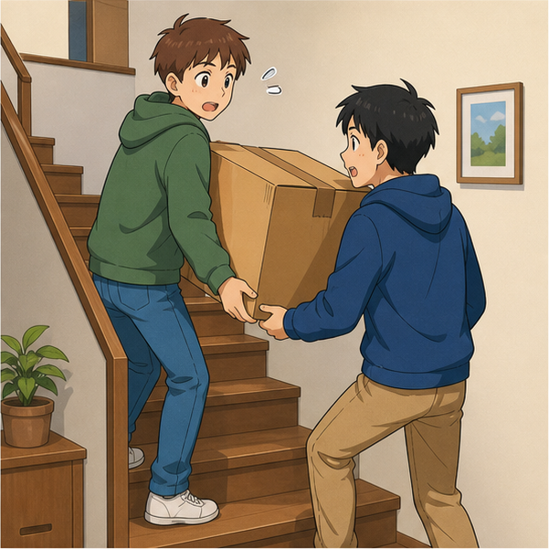

**Mai:** Alex, could you do me a favor?
**Alex:** Sure. What do you need?
**Mai:** Could you help me carry this box upstairs?
**Alex:** Of course. Is it heavy?
**Mai:** A little. I can't carry it by myself.
**Alex:** No problem. I'll take this side.
**Mai:** Be careful on the stairs.
**Alex:** Don't worry. I've got it.
**Mai:** Thank you so much.
**Alex:** You're welcome.

### Nội dung giao tiếp

```text
Mở lời
    ↓
Nhờ giúp
    ↓
Giải thích việc cần làm
    ↓
Người kia đồng ý
    ↓
Phối hợp thực hiện
    ↓
Cảm ơn
```

---

## Hội thoại 2 — Tìm đồ bị mất


**Linh:** Excuse me. Could you help me, please?
**Staff:** Of course. What's the matter?
**Linh:** I can't find my handbag.
**Staff:** Where did you last see it?
**Linh:** I think I had it near the café.
**Staff:** What does it look like?
**Linh:** It's small and black.
**Staff:** Don't worry. Let me check the lost and found desk.
**Linh:** Thank you.
**Staff:** I'll be back in a moment.

---

## Hội thoại 3 — Có cháy

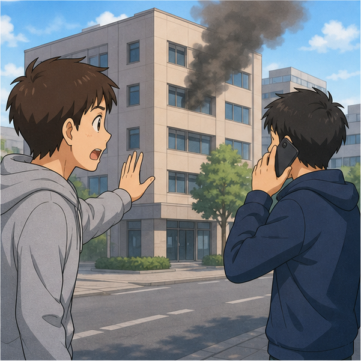

**Anna:** Oh my goodness! There's a fire!
**Ben:** Where?
**Anna:** Look! There's smoke coming from that building.
**Ben:** Stay back. It's dangerous.
**Anna:** Should we go and have a look?
**Ben:** No. Let's call the fire department.
**Anna:** Good idea. I'll call now.
**Ben:** Make sure nobody goes near the building.
**Anna:** Okay. The firefighters are on their way.

---

## Hội thoại 4 — Gọi hỗ trợ cho thú cưng

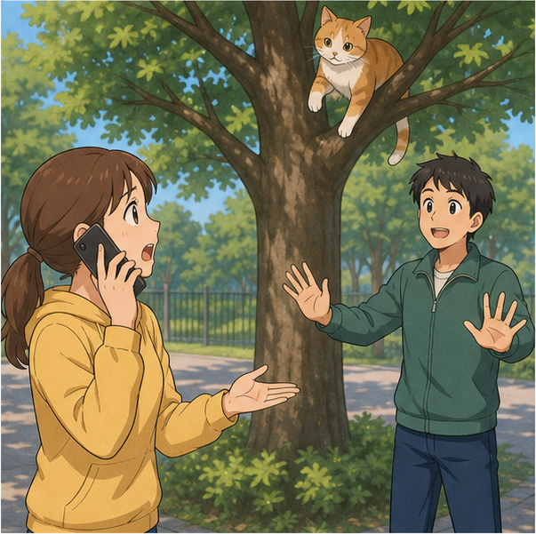

**Operator:** Emergency services. How can I help you?
**Caller:** Hello. I need some help. My cat is stuck in a tree.
**Operator:** Is the cat injured?
**Caller:** I think so. He can't get down.
**Operator:** How high is he?
**Caller:** Quite high. I can't reach him safely.
**Operator:** All right. Don't try to climb the tree yourself.
**Caller:** Okay. What should I do?
**Operator:** Stay nearby and keep the area clear. We'll arrange assistance.
**Caller:** Thank you. Please hurry.

---

# 11. Natural Expressions — Cách nói tự nhiên

| Cụm từ                        | Nghĩa                             | Khi dùng               |
| ----------------------------- | --------------------------------- | ---------------------- |
| **Can you help me?**          | Bạn giúp tôi được không?          | Nhờ giúp               |
| **Could you help me?**        | Bạn có thể giúp tôi không?        | Lịch sự hơn            |
| **Could you do me a favor?**  | Bạn giúp tôi một việc được không? | Việc nhỏ               |
| **Could you please ...?**     | Bạn có thể vui lòng...?           | Yêu cầu lịch sự        |
| **Pass me ..., please.**      | Đưa tôi ... nhé.                  | Nhờ đưa đồ             |
| **I need some help.**         | Tôi cần giúp đỡ.                  | Nói nhu cầu            |
| **What's the matter?**        | Có chuyện gì vậy?                 | Hỏi vấn đề             |
| **What happened?**            | Chuyện gì xảy ra?                 | Hỏi sự việc            |
| **What's wrong?**             | Có chuyện gì không?               | Hỏi tình trạng         |
| **Let me help you.**          | Để tôi giúp bạn.                  | Đề nghị giúp           |
| **Don't worry.**              | Đừng lo.                          | Trấn an                |
| **Hold on.**                  | Chờ một chút.                     | Yêu cầu chờ            |
| **Stay still.**               | Đứng yên.                         | Tránh cử động          |
| **Don't move.**               | Đừng cử động.                     | Tình huống cần an toàn |
| **Be careful.**               | Cẩn thận.                         | Cảnh báo               |
| **Watch out!**                | Coi chừng!                        | Cảnh báo nhanh         |
| **Help!**                     | Cứu với!                          | Khẩn cấp               |
| **Somebody help me!**         | Có ai giúp tôi với!               | Khẩn cấp               |
| **There's a fire!**           | Có cháy!                          | Báo nguy hiểm          |
| **Call for help!**            | Gọi người giúp đi!                | Khẩn cấp               |
| **Call the fire department!** | Gọi cứu hỏa!                      | Cháy                   |
| **Someone is injured.**       | Có người bị thương.               | Báo tình trạng         |
| **He's stuck.**               | Anh ấy bị mắc kẹt.                | Báo tình trạng         |
| **Help is on the way.**       | Người hỗ trợ đang đến.            | Trấn an                |
| **It's okay now.**            | Bây giờ ổn rồi.                   | Sau khi xử lý          |

---

# 12. Lỗi thường gặp — Common Mistakes

## Lỗi 1: Dùng sai sau **Could you**

❌ **Could you helping me?**

✅ **Could you help me?**

### Cấu trúc

`Could you + V nguyên mẫu?`

---

## Lỗi 2: Dùng sai **do me a favor**

❌ **Could you make me a favor?**

✅ **Could you do me a favor?**

### Cụm cố định

`do someone a favor`

---

## Lỗi 3: Dùng **help me to carrying**

❌ **Could you help me to carrying the box?**

✅ **Could you help me carry the box?**

Hoặc:

✅ **Could you help me to carry the box?**

---

## Lỗi 4: Sai trật tự từ với **pass**

❌ **Pass the book me, please.**

✅ **Pass me the book, please.**

Hoặc:

✅ **Pass the book to me, please.**

---

## Lỗi 5: Dùng **What happen?**

❌ **What happen?**

✅ **What happened?**

Khi hỏi chuyện vừa xảy ra, dùng quá khứ:

**What happened?**

---

## Lỗi 6: Dùng **What's happen?**

❌ **What's happen?**

✅ **What happened?**

Hoặc nếu sự việc đang diễn ra:

✅ **What's happening?**

---

## Lỗi 7: Nhầm **What's wrong?** và **What's wrong with ...?**

### Chung

**What's wrong?**

— Có chuyện gì vậy?

### Hỏi về người hoặc vật cụ thể

**What's wrong with your phone?**

— Điện thoại của bạn bị sao vậy?

---

## Lỗi 8: Dùng sai **Let me**

❌ **Let me to help you.**

✅ **Let me help you.**

### Cấu trúc

`Let me + V nguyên mẫu`

---

## Lỗi 9: Dùng **Don't worried**

❌ **Don't worried.**

✅ **Don't worry.**

Sau **don't** dùng động từ nguyên mẫu.

---

## Lỗi 10: Dùng câu quá lịch sự trong tình huống khẩn cấp

Trong tình huống bình thường:

✅ **Could you please help me?**

Nhưng khi có nguy hiểm tức thời, câu ngắn rõ ràng tốt hơn:

✅ **Help!**

✅ **Call an ambulance!**

✅ **There's a fire!**

---

## Lỗi 11: Nhầm **careful** và **carefully**

### **careful**

tính từ:

**Be careful.**

### **carefully**

trạng từ:

**Carry it carefully.**

---

## Lỗi 12: Nhầm **lost** và **stolen**

### **lost**

= bị mất, không biết ở đâu.

**My bag is lost.**

### **stolen**

= bị ai đó lấy trộm.

**My bag was stolen.**

Không nên khẳng định **stolen** nếu chỉ đơn giản là chưa tìm thấy đồ.

---

# 13. Luyện tập có hướng dẫn

## Bài 1 — Nối từ với nghĩa

1. favor
2. carry
3. firefighter
4. dangerous
5. thief
6. stuck

A. nguy hiểm
B. kẻ trộm
C. mang, xách
D. mắc kẹt
E. lính cứu hỏa
F. việc giúp đỡ

<details>
<summary>Đáp án</summary>

1–F
2–C
3–E
4–A
5–B
6–D

</details>

---

## Bài 2 — Điền từ vào chỗ trống

Dùng:

`favor` · `carry` · `matter` · `careful` · `help`

1. Could you do me a ________?
2. Could you help me ________ this box?
3. What's the ________?
4. Be ________! The floor is wet.
5. Somebody ________ me!

<details>
<summary>Đáp án</summary>

1. favor
2. carry
3. matter
4. careful
5. help

</details>

---

## Bài 3 — Chọn câu đúng

### 1. Bạn muốn nhờ ai đó giúp.

* A. Could you helping me?
* B. Could you help me?
* C. Could you to help me?

**Đáp án:** B

---

### 2. Bạn muốn nhờ ai đó giúp một việc.

* A. Could you make me a favor?
* B. Could you do me a favor?
* C. Could you give me favor?

**Đáp án:** B

---

### 3. Bạn muốn hỏi chuyện gì đã xảy ra.

* A. What happened?
* B. What happen?
* C. What's happen?

**Đáp án:** A

---

### 4. Bạn muốn nói “Để tôi giúp bạn”.

* A. Let me to help you.
* B. Let me helping you.
* C. Let me help you.

**Đáp án:** C

---

## Bài 4 — Chọn câu phù hợp với tình huống

### 1. Bạn cần một người bạn giúp mang hộp.

**Could you help me carry this box?**

### 2. Bạn thấy ai đó đang lo lắng.

**What's the matter?**

### 3. Một người vừa bị ngã.

**Stay still. Don't move.**

### 4. Bạn nhìn thấy cháy.

**There's a fire! Call the fire department!**

### 5. Bạn muốn giúp một người đang mang nhiều túi.

**Let me help you with those bags.**

---

## Bài 5 — **lost** hay **stolen**

1. I can't find my phone. I think it's ________.
2. Someone took my bike. It was ________.
3. She left her bag somewhere and now it's ________.
4. The police found the ________ car.

<details>
<summary>Đáp án gợi ý</summary>

1. lost
2. stolen
3. lost
4. stolen

</details>

---

## Bài 6 — Hoàn thành hội thoại

**A:** Excuse me. Could you ________ me?
**B:** Of course. What's the ________?
**A:** I can't find my handbag.
**B:** Don't ________. Let me help you look for it.
**A:** Thank you. I think I left it over ________.
**B:** Okay. Let's have a ________.

<details>
<summary>Đáp án</summary>

1. help
2. matter
3. worry
4. there
5. look

</details>

---

# 14. Speaking Challenge — Thử thách nói

## Nhiệm vụ 1 — Đọc mẫu câu

Đọc các câu sau thành tiếng:

* **Could you help me?**
* **Could you do me a favor?**
* **Pass me the book, please.**
* **Could you help me carry this box?**
* **What's the matter?**
* **What happened?**
* **Don't worry. Let me help you.**
* **Hold on.**
* **Stay still.**
* **Be careful!**

Đọc mỗi câu hai lần:

* lần 1 chậm và rõ;
* lần 2 với tốc độ hội thoại tự nhiên.

---

## Nhiệm vụ 2 — Tạo 5 lời nhờ giúp

Dùng 5 cấu trúc:

1. **Can you help me ...?**
2. **Could you help me ...?**
3. **Could you do me a favor?**
4. **Could you please ...?**
5. **Pass me ..., please.**

Ví dụ:

> **Could you help me carry these bags?**

---

## Nhiệm vụ 3 — Phản hồi khi người khác cần giúp

Một người nói:

> **I can't find my phone.**

Bạn phải trả lời ít nhất 3 câu, ví dụ:

> **Don't worry. Let me help you. Where did you last see it?**

Luyện với các tình huống:

* không tìm thấy điện thoại;
* mang hộp quá nặng;
* bị ngã;
* không tìm thấy con;
* nhìn thấy khói;
* thú cưng mắc kẹt.

---

## Nhiệm vụ 4 — Hội thoại 8 lượt

Tạo một đoạn hội thoại có ít nhất:

* 1 lời nhờ giúp;
* 1 câu hỏi **What's the matter?**
* 1 câu giải thích vấn đề;
* 1 câu **Don't worry**;
* 1 câu **Let me help you**;
* 1 câu hướng dẫn hoặc cảnh báo;
* 1 lời cảm ơn;
* 1 câu kết thúc.

---

## Nhiệm vụ 5 — Ghi âm

Ghi âm từ **45–60 giây**, sau đó kiểm tra:

* [ ] Tôi dùng đúng **Could you + V?**
* [ ] Tôi dùng đúng **do me a favor**.
* [ ] Tôi dùng đúng **help me + V**.
* [ ] Tôi có thể hỏi **What's the matter?**
* [ ] Tôi có thể hỏi **What happened?**
* [ ] Tôi có thể dùng **Don't worry**.
* [ ] Tôi có thể dùng **Let me help you**.
* [ ] Tôi biết dùng câu ngắn khi có tình huống khẩn cấp.
* [ ] Tôi có thể phản hồi tự nhiên khi người khác cần giúp.
* [ ] Tôi có thể duy trì hội thoại ít nhất 45 giây.

---

# 15. Practice Mission — Nhiệm vụ thực tế

Trong hôm nay, hãy luyện một tình huống theo công thức:

> **Problem → Ask for help → Explain → Offer help → Action → Thank**

Ví dụ:

> **Could you help me, please?**
> ↓
> **Sure. What's the matter?**
> ↓
> **I can't carry this box upstairs.**
> ↓
> **No problem. Let me help you.**
> ↓
> **Please be careful. It's quite heavy.**
> ↓
> **I've got it.**
> ↓
> **Thank you very much.**

Sau đó viết hoặc nói một đoạn hội thoại **8–10 lượt** cho một trong các tình huống:

* nhờ mang một chiếc hộp;
* nhờ mở cửa;
* nhờ tìm điện thoại;
* nhờ tìm túi xách;
* một người bị ngã;
* nhìn thấy khói;
* thú cưng bị mắc kẹt;
* một đứa trẻ bị lạc.

---

# 16. Tự đánh giá cuối bài

Đánh dấu khi bạn có thể thực hiện mà không nhìn bài:

* [ ] Tôi có thể nói **Can you help me?**
* [ ] Tôi có thể nói **Could you help me?**
* [ ] Tôi có thể dùng **Could you do me a favor?**
* [ ] Tôi có thể dùng **Could you please + V?**
* [ ] Tôi có thể dùng **Pass me ..., please.**
* [ ] Tôi có thể dùng **help me + V**.
* [ ] Tôi có thể hỏi **What's the matter?**
* [ ] Tôi có thể hỏi **What happened?**
* [ ] Tôi có thể hỏi **What's wrong?**
* [ ] Tôi có thể nói **Don't worry.**
* [ ] Tôi có thể nói **Let me help you.**
* [ ] Tôi có thể nói **Hold on.**
* [ ] Tôi có thể nói **Stay still.**
* [ ] Tôi có thể nói **Be careful.**
* [ ] Tôi biết cách kêu **Help!**
* [ ] Tôi biết cách báo **There's a fire!**
* [ ] Tôi phân biệt được **lost** và **stolen**.
* [ ] Tôi có thể nhờ giúp một cách lịch sự.
* [ ] Tôi có thể phản hồi khi người khác nhờ giúp.
* [ ] Tôi có thể duy trì hội thoại ít nhất 45 giây.

---

# 17. Câu hỏi mở cuối bài

**Imagine you are in a shopping center and suddenly realize that you cannot find your bag. How would you ask a staff member for help, explain the problem, describe the bag, and respond when they offer to help you?**

*Hãy tưởng tượng bạn đang ở một trung tâm mua sắm và đột nhiên nhận ra mình không tìm thấy túi. Bạn sẽ nhờ nhân viên giúp như thế nào, giải thích vấn đề ra sao, mô tả chiếc túi và phản hồi thế nào khi họ đề nghị giúp bạn?*

---

# 18. Ghi chú dành cho giảng viên

* **Module:** 02 — Everyday Conversations / Những cuộc hội thoại thường ngày
* **Chủ điểm:** Asking for Help
* **Thời lượng video:** 8–12 phút
* **Luyện nói:** 5–10 phút

### Trọng tâm từ vựng

* help
* favor
* carry
* pass
* upstairs
* letter
* find
* handbag
* thief
* fire
* smoke
* firefighter
* dangerous
* careful
* hold on
* stay still
* get down
* climb
* emergency
* injured
* stuck
* over there

### Trọng tâm cấu trúc

* **Can you help me?**
* **Could you help me?**
* **Could you help me + V ...?**
* **Could you do me a favor?**
* **Could you please + V ...?**
* **Pass me ..., please.**
* **Please help me find ...**
* **What's the matter?**
* **What happened?**
* **What's wrong?**
* **Don't worry.**
* **Let me help you.**
* **Let me have a look.**
* **Hold on.**
* **Stay still.**
* **Don't move.**
* **Be careful.**
* **Help!**
* **Somebody help me!**
* **There's a fire!**
* **Call the fire department!**
* **Someone is injured.**
* **Someone is stuck ...**

### Trọng tâm phát âm

* **favor**
* **carry**
* **dangerous**
* **firefighter**
* **emergency**
* **injured**
* **thief**
* **careful**

### Lưu ý ngôn ngữ

* Sau **could you** dùng động từ nguyên mẫu:

  * **Could you help me?**
* Cụm cố định:

  * **do someone a favor**
* Dùng:

  * **help me carry**
  * **help me find**
* **Let me + V**, không dùng **to**:

  * **Let me help you.**
* **What happened?** hỏi về chuyện đã xảy ra.
* **What's happening?** hỏi việc đang diễn ra.
* **What's the matter?** và **What's wrong?** đều có thể hỏi khi ai đó gặp vấn đề.
* **careful** là tính từ:

  * **Be careful.**
* **carefully** là trạng từ:

  * **Carry it carefully.**
* **lost** = bị thất lạc.
* **stolen** = bị lấy trộm.
* Trong tình huống bình thường, nên dùng lời nhờ lịch sự.
* Trong tình huống khẩn cấp, nên ưu tiên câu:

  * ngắn;
  * rõ;
  * trực tiếp;
  * nêu đúng nguy hiểm hoặc loại hỗ trợ cần thiết.

### Hoạt động gợi ý — Help Desk

Chia lớp thành cặp.

**Người A** nhận một vấn đề.

Ví dụ:

> Bạn không tìm thấy điện thoại.

**Người B** là nhân viên hỗ trợ.

Người A phải sử dụng:

> **Excuse me. Could you help me?**

Người B hỏi:

> **Of course. What's the matter?**

Người A giải thích:

> **I can't find my phone.**

Người B hỏi thêm:

> **Where did you last see it?**

> **What does it look like?**

Cuối cùng phải có:

> **Don't worry. Let me help you.**

và:

> **Thank you very much.**

### Role-play mẫu — Nhờ giúp một việc

**Người A nhận:**

> Bạn cần mang hai chiếc hộp nặng lên tầng trên.

**Người B nhận:**

> Bạn đang rảnh và có thể giúp.

Người A phải sử dụng ít nhất:

* **Could you do me a favor?**
* **Could you help me ...?**
* **It's quite heavy.**
* **Be careful.**
* **Thank you.**

Người B phải sử dụng ít nhất:

* **Sure.**
* **No problem.**
* **Let me help you.**
* **I've got it.**
* **You're welcome.**

### Role-play mẫu — Tình huống khẩn cấp

**Người A nhận:**

> Bạn nhìn thấy khói bốc ra từ một căn phòng.

**Người B nhận:**

> Bạn ở gần đó và chưa biết chuyện gì xảy ra.

Hai người phải sử dụng ít nhất:

* **There's smoke over there.**
* **There's a fire!**
* **Stay back.**
* **It's dangerous.**
* **Call the fire department.**
* **Don't go inside.**

Mục tiêu cuối cùng là đưa ra hành động an toàn:

> **Let's move away from the building and call for help.**

---
