# LESSON 11 — ĐI XEM BIỂU DIỄN ÂM NHẠC

> **Module 02 — Everyday Conversations / Những cuộc hội thoại thường ngày**
> **Chủ đề:** Going to a Concert — Âm nhạc, nghệ sĩ và các buổi biểu diễn trực tiếp
> **Trình độ gợi ý:** A1–A2
> **Thời lượng:** 8–12 phút học bài + 5–10 phút luyện nói

---

## 1. Tình huống thực tế

Trong cuộc sống hằng ngày, bạn có thể cần nói về âm nhạc và các buổi biểu diễn khi:

* hỏi bạn bè thích thể loại nhạc nào;
* nói về ca sĩ hoặc nghệ sĩ yêu thích;
* rủ người khác đi xem hòa nhạc;
* hỏi một buổi biểu diễn diễn ra khi nào;
* hỏi còn vé hay không;
* mua một hoặc nhiều vé;
* hỏi vị trí ghế ngồi;
* hỏi xem ghế có người ngồi chưa;
* muốn đổi sang vị trí ngồi khác;
* hỏi có cần đặt vé trước hay không;
* nói về sân khấu và chất lượng âm thanh;
* nói về nhịp điệu và cảm giác khi nghe nhạc;
* hỏi về nguồn gốc của một thể loại âm nhạc;
* chia sẻ cảm nhận sau một buổi biểu diễn.

Bạn cần biết cách nói những câu như:

* **Do you often go to concerts?**
* **What kind of music do you like?**
* **Do you like jazz?**
* **I like country music.**
* **Are there any tickets left for tonight's show?**
* **I'd like two tickets, please.**
* **Do you have anything in the front rows?**
* **Sorry, we're sold out.**
* **Is this seat taken?**
* **Do I have to book in advance?**
* **Where can I buy a ticket?**
* **The music is great for dancing, isn't it?**

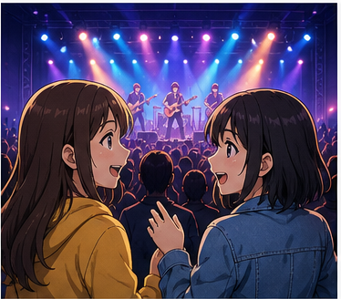

---

## 2. Mục tiêu bài học

Sau bài học, người học có thể:

1. Hỏi người khác có thường đi xem hòa nhạc hay không.
2. Hỏi và nói về thể loại âm nhạc yêu thích.
3. Dùng **Do you like ...?** để hỏi sở thích âm nhạc.
4. Hỏi còn vé bằng **Are there any tickets left ...?**
5. Mua vé bằng **I'd like ... tickets, please.**
6. Hỏi về vị trí ghế bằng **Do you have anything ...?**
7. Hiểu và sử dụng **sold out**.
8. Hỏi khi nào còn vé bằng **When do you have tickets?**
9. Hỏi xem một chỗ ngồi đã có người hay chưa.
10. Hỏi nơi có thể mua vé.
11. Hỏi có cần đặt vé trước hay không.
12. Nói về ca sĩ, ban nhạc và nghệ sĩ yêu thích.
13. Nói một nghệ sĩ nổi tiếng vì điều gì.
14. Mô tả âm nhạc bằng **rhythm**, **acoustic**, **fascinating**.
15. Hỏi về nguồn gốc của một thể loại âm nhạc.
16. Duy trì một đoạn hội thoại 6–8 lượt về một buổi biểu diễn âm nhạc.

---

## 3. Sơ đồ giao tiếp

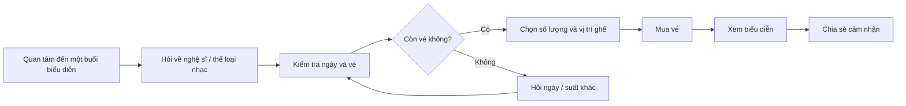

### Mẫu đơn giản

`Do you like pop music?`
→ `Yes, I do.`
→ `There's a concert this Friday.`
→ `Are there any tickets left?`
→ `Yes, there are.`
→ `Great. I'd like two tickets, please.`

---

# 4. Từ vựng trọng tâm — Core Vocabulary

## 4.1. **concert** /ˈkɒn.sət/

**Nghĩa:** buổi hòa nhạc, buổi biểu diễn âm nhạc

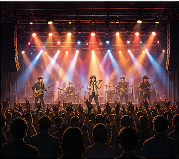

**Ví dụ:**

* **Do you often go to concerts?**
  — Bạn có thường đi xem hòa nhạc không?

* **We're going to a concert tonight.**
  — Tối nay chúng tôi sẽ đi xem hòa nhạc.

---

## 4.2. **music** /ˈmjuː.zɪk/

**Nghĩa:** âm nhạc

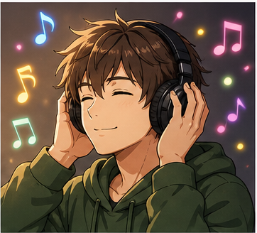

**Ví dụ:**

* **I really enjoy listening to music.**
  — Tôi rất thích nghe nhạc.

* **What kind of music do you like?**
  — Bạn thích loại nhạc nào?

> **music** là danh từ không đếm được trong cách dùng thông thường.

---

## 4.3. **jazz** /dʒæz/

**Nghĩa:** nhạc jazz

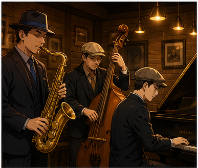

**Ví dụ:**

* **Do you like jazz?**
  — Bạn có thích nhạc jazz không?

* **We listened to jazz last night.**
  — Tối qua chúng tôi nghe nhạc jazz.

---

## 4.4. **country music** /ˈkʌn.tri ˌmjuː.zɪk/

**Nghĩa:** nhạc đồng quê

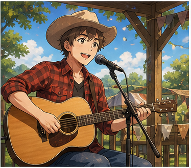

**Ví dụ:**

* **I like country music.**
  — Tôi thích nhạc đồng quê.

* **My father listens to country music.**
  — Bố tôi nghe nhạc đồng quê.

---

## 4.5. **pop music** /pɒp ˈmjuː.zɪk/

**Nghĩa:** nhạc pop

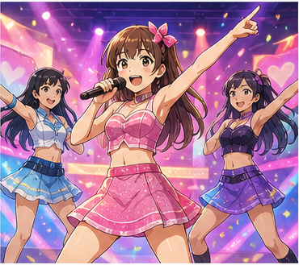

**Ví dụ:**

* **Do you like pop music?**
  — Bạn có thích nhạc pop không?

* **Pop music is very popular with young people.**
  — Nhạc pop rất phổ biến với người trẻ.

---

## 4.6. **rap music** /ræp ˈmjuː.zɪk/

**Nghĩa:** nhạc rap

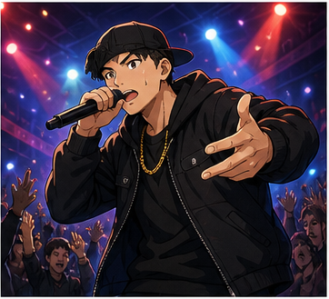

**Ví dụ:**

* **I like rap music because of its rhythm.**
  — Tôi thích nhạc rap vì nhịp điệu của nó.

* **Do you listen to rap?**
  — Bạn có nghe nhạc rap không?

---

## 4.7. **symphony orchestra** /ˈsɪm.fə.ni ˈɔː.kɪ.strə/

**Nghĩa:** dàn nhạc giao hưởng

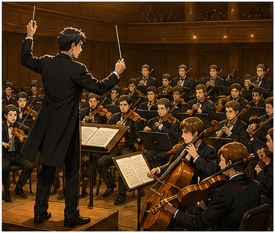

**Ví dụ:**

* **The symphony orchestra was excellent.**
  — Dàn nhạc giao hưởng rất xuất sắc.

* **I've never seen a symphony orchestra live.**
  — Tôi chưa bao giờ xem trực tiếp một dàn nhạc giao hưởng.

---

## 4.8. **stage** /steɪdʒ/

**Nghĩa:** sân khấu

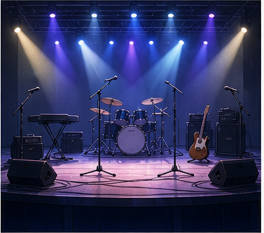

**Ví dụ:**

* **Our seats are near the stage.**
  — Ghế của chúng tôi ở gần sân khấu.

* **The singer walked onto the stage.**
  — Ca sĩ bước lên sân khấu.

---

## 4.9. **ticket** /ˈtɪk.ɪt/

**Nghĩa:** vé


**Ví dụ:**

* **Do you have any tickets for the concert?**
  — Bạn còn vé cho buổi hòa nhạc không?

* **I'd like two tickets, please.**
  — Tôi muốn mua hai vé.

### Cụm quan trọng

* **buy a ticket** — mua vé
* **book a ticket** — đặt vé
* **concert ticket** — vé hòa nhạc

---

## 4.10. **sold out** /ˌsəʊld ˈaʊt/

**Nghĩa:** bán hết vé

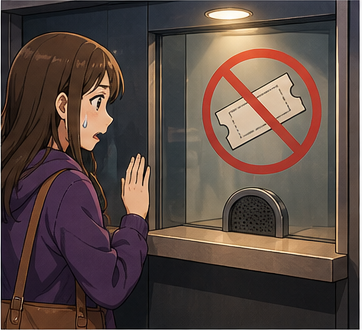

**Ví dụ:**

* **Sorry, we're sold out.**
  — Xin lỗi, chúng tôi đã hết vé.

* **The concert sold out very quickly.**
  — Vé buổi hòa nhạc đã bán hết rất nhanh.

---

## 4.11. **front row** /ˌfrʌnt ˈrəʊ/

**Nghĩa:** hàng ghế đầu

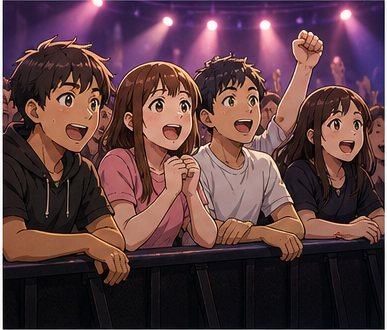

**Ví dụ:**

* **Do you have any seats in the front row?**
  — Bạn có ghế nào ở hàng đầu không?

* **The front row is very close to the stage.**
  — Hàng đầu rất gần sân khấu.

---

## 4.12. **seat** /siːt/

**Nghĩa:** ghế, chỗ ngồi

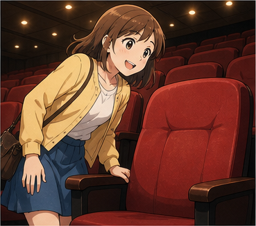

**Ví dụ:**

* **Is this seat taken?**
  — Ghế này có người ngồi chưa?

* **These are our seats.**
  — Đây là ghế của chúng ta.

---

## 4.13. **acoustics** /əˈkuː.stɪks/

**Nghĩa:** chất lượng âm học của một không gian

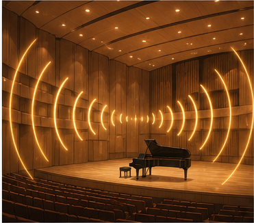

**Ví dụ:**

* **The acoustics are excellent in this hall.**
  — Âm thanh trong khán phòng này rất tốt.

* **The acoustics aren't very good here.**
  — Chất lượng âm thanh ở đây không tốt lắm.

---

## 4.14. **accompaniment** /əˈkʌm.pən.i.mənt/

**Nghĩa:** phần nhạc đệm

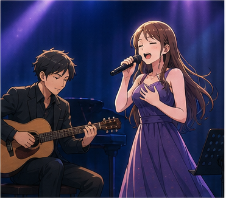

**Ví dụ:**

* **She sang with piano accompaniment.**
  — Cô ấy hát với phần đệm piano.

* **The song has a simple guitar accompaniment.**
  — Bài hát có phần đệm guitar đơn giản.

---

## 4.15. **rhythm** /ˈrɪð.əm/

**Nghĩa:** nhịp điệu

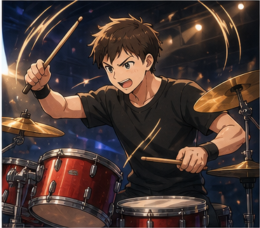

**Ví dụ:**

* **This song has a strong rhythm.**
  — Bài hát này có nhịp điệu mạnh.

* **It's easy to dance to this rhythm.**
  — Rất dễ nhảy theo nhịp này.

---

## 4.16. **idol** /ˈaɪ.dəl/

**Nghĩa:** thần tượng

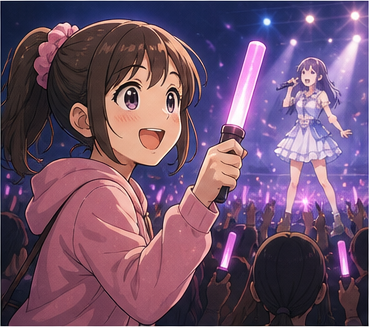

**Ví dụ:**

* **She's my musical idol.**
  — Cô ấy là thần tượng âm nhạc của tôi.

* **Who was your idol when you were younger?**
  — Khi còn trẻ, thần tượng của bạn là ai?

---

## 4.17. **famous** /ˈfeɪ.məs/

**Nghĩa:** nổi tiếng

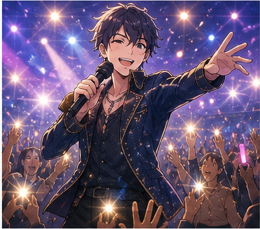

**Ví dụ:**

* **She's a famous singer.**
  — Cô ấy là một ca sĩ nổi tiếng.

* **He's famous for his live performances.**
  — Anh ấy nổi tiếng với các màn biểu diễn trực tiếp.

---

## 4.18. **famous for** /ˈfeɪ.məs fɔːr/

**Nghĩa:** nổi tiếng vì, nổi tiếng với

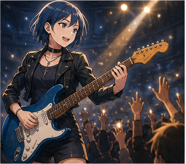

**Ví dụ:**

* **She's famous for her powerful voice.**
  — Cô ấy nổi tiếng với giọng hát mạnh mẽ.

* **The band is famous for its live shows.**
  — Ban nhạc nổi tiếng với những buổi diễn trực tiếp.

---

## 4.19. **fascinating** /ˈfæs.ɪ.neɪ.tɪŋ/

**Nghĩa:** hấp dẫn, cuốn hút

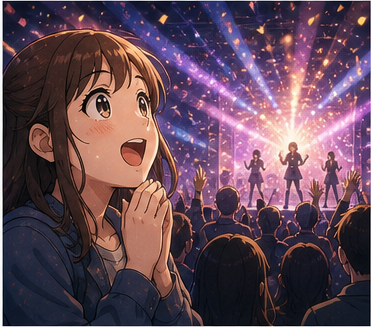

**Ví dụ:**

* **The performance was fascinating.**
  — Buổi biểu diễn rất cuốn hút.

* **It's fascinating to listen to live music.**
  — Nghe nhạc trực tiếp rất hấp dẫn.

---

## 4.20. **music fan** /ˈmjuː.zɪk fæn/

**Nghĩa:** người yêu thích âm nhạc

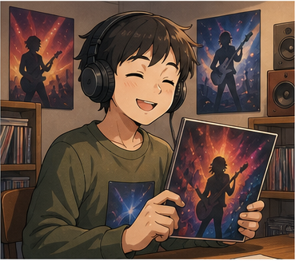

**Ví dụ:**

* **I'm a big music fan.**
  — Tôi là một người rất yêu âm nhạc.

* **She's a huge jazz fan.**
  — Cô ấy là một người rất mê nhạc jazz.

---

## 4.21. **book in advance** /bʊk ɪn ədˈvɑːns/

**Nghĩa:** đặt trước

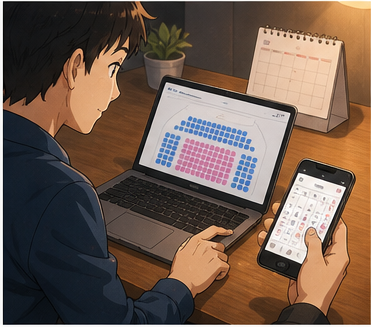

**Ví dụ:**

* **Do I have to book in advance?**
  — Tôi có phải đặt trước không?

* **You should book your tickets in advance.**
  — Bạn nên đặt vé trước.

---

# 5. Bảng tổng hợp từ vựng

| Từ / cụm từ            | IPA                      | Nghĩa tiếng Việt    | Ví dụ ngắn              |
| ---------------------- | ------------------------ | ------------------- | ----------------------- |
| **concert**            | /ˈkɒn.sət/               | buổi hòa nhạc       | go to a concert         |
| **music**              | /ˈmjuː.zɪk/              | âm nhạc             | listen to music         |
| **jazz**               | /dʒæz/                   | nhạc jazz           | I like jazz.            |
| **country music**      | —                        | nhạc đồng quê       | listen to country music |
| **pop music**          | —                        | nhạc pop            | I like pop music.       |
| **rap music**          | —                        | nhạc rap            | rap music has rhythm    |
| **symphony orchestra** | /ˈsɪm.fə.ni ˈɔː.kɪ.strə/ | dàn nhạc giao hưởng | a symphony orchestra    |
| **stage**              | /steɪdʒ/                 | sân khấu            | near the stage          |
| **ticket**             | /ˈtɪk.ɪt/                | vé                  | two tickets             |
| **sold out**           | /ˌsəʊld ˈaʊt/            | hết vé              | We're sold out.         |
| **front row**          | /ˌfrʌnt ˈrəʊ/            | hàng ghế đầu        | front-row seats         |
| **seat**               | /siːt/                   | chỗ ngồi            | Is this seat taken?     |
| **acoustics**          | /əˈkuː.stɪks/            | âm học              | good acoustics          |
| **accompaniment**      | /əˈkʌm.pən.i.mənt/       | nhạc đệm            | piano accompaniment     |
| **rhythm**             | /ˈrɪð.əm/                | nhịp điệu           | strong rhythm           |
| **idol**               | /ˈaɪ.dəl/                | thần tượng          | my idol                 |
| **famous**             | /ˈfeɪ.məs/               | nổi tiếng           | a famous singer         |
| **famous for**         | —                        | nổi tiếng vì        | famous for her voice    |
| **fascinating**        | /ˈfæs.ɪ.neɪ.tɪŋ/         | cuốn hút            | fascinating music       |
| **music fan**          | —                        | người mê âm nhạc    | a big music fan         |
| **book in advance**    | —                        | đặt trước           | book in advance         |

---

# 6. Mẫu câu giao tiếp — Useful Structures

## 6.1. Hỏi người khác có thường đi xem hòa nhạc không

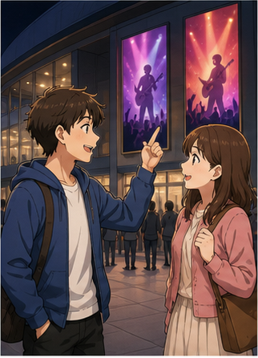

### **Do you often go to concerts?**

— Bạn có thường đi xem hòa nhạc không?

Trả lời:

* **Yes, I do.**
* **Not very often.**
* **Sometimes.**
* **No, but I'd like to.**

---

## 6.2. Hỏi thể loại âm nhạc yêu thích

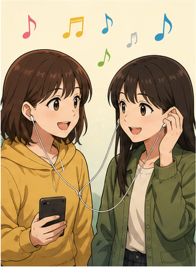

### **What kind of music do you like?**

— Bạn thích thể loại nhạc nào?

Cách khác:

* **What type of music do you like?**
* **What music do you usually listen to?**

Trả lời:

* **I like pop music.**
* **I really enjoy jazz.**
* **I listen to a lot of rap.**

---

## 6.3. Hỏi một thể loại cụ thể

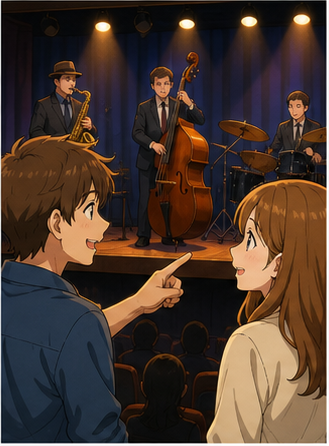

### **Do you like + thể loại nhạc?**

* **Do you like jazz?**
* **Do you like pop music?**
* **Do you like country music?**

### Phản hồi

* **Yes, I do.**
* **Not really.**
* **I love it.**
* **It's not really my kind of music.**

---

## 6.4. Nói mình thích một thể loại nhạc

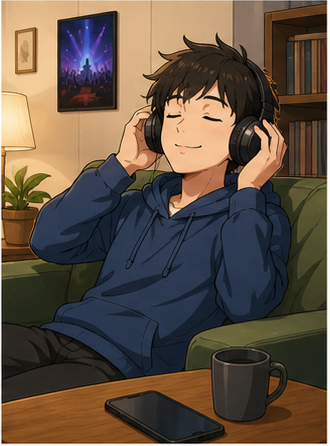

### **I like + thể loại nhạc.**

* **I like country music.**
* **I like jazz.**
* **I like pop music.**

### Mạnh hơn

* **I really like ...**
* **I love ...**
* **I really enjoy listening to ...**

---

## 6.5. Hỏi còn vé không

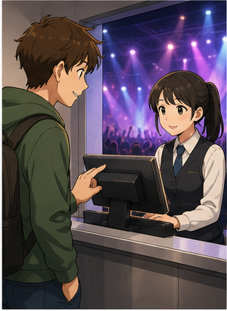

### **Are there any tickets left for + sự kiện?**

* **Are there any tickets left for tonight's show?**
* **Are there any tickets left for Friday's concert?**

— Còn vé cho ... không?

Cách khác:

### **Do you have any tickets for the concert?**

---

## 6.6. Mua vé

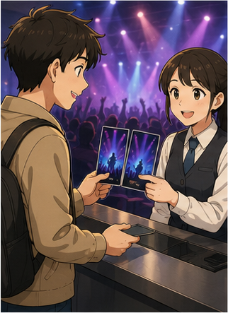

### **I'd like + số lượng + tickets, please.**

* **I'd like two tickets, please.**
* **I'd like four tickets for Friday, please.**

Có thể thêm ngày:

### **I'd like two tickets for October 20th, please.**

---

## 6.7. Hỏi vị trí ghế

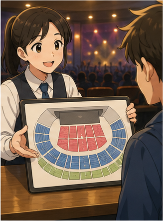

### **Do you have anything in the front rows?**

— Bạn có ghế nào ở các hàng phía trước không?

Tự nhiên và cụ thể hơn:

### **Do you have any seats in the front rows?**

Cách khác:

* **Do you have anything near the stage?**
* **Do you have seats in the middle?**
* **Do you have anything farther back?**

---

## 6.8. Nói hết vé

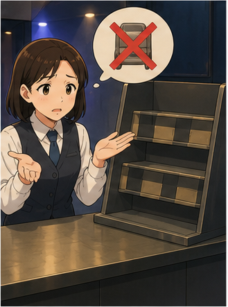

### **Sorry, we're sold out.**

— Xin lỗi, chúng tôi đã hết vé.

Cách khác:

* **I'm sorry. There are no tickets left.**
* **Tonight's show is sold out.**

---

## 6.9. Hỏi khi nào còn vé

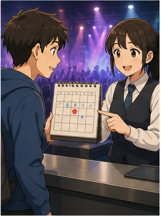

### **When do you have tickets available?**

— Khi nào bên bạn còn vé?

Hoặc:

* **Do you have tickets for another night?**
* **What dates are still available?**
* **Are there tickets for Friday?**

---

## 6.10. Hỏi ghế đã có người ngồi chưa

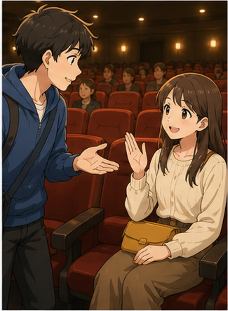

### **Is this seat taken?**

— Ghế này có người ngồi chưa?

Nếu chưa:

**No, it's free.**

Nếu đã có người:

**Yes, sorry. Someone's sitting here.**

---

## 6.11. Hỏi nơi mua vé

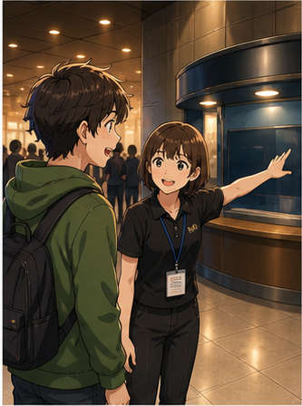

### **Where can I buy a ticket?**

— Tôi có thể mua vé ở đâu?

Cách khác:

* **Where can I get tickets?**
* **Can I buy tickets here?**

---

## 6.12. Hỏi có cần đặt vé trước không

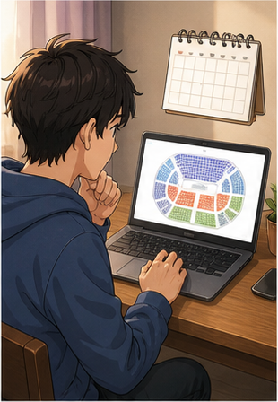

### **Do I have to book in advance?**

— Tôi có phải đặt trước không?

Cách khác:

* **Should I book in advance?**
* **Do I need to book ahead?**

### Trả lời

* **Yes, it's a very popular concert.**
* **No, you can buy tickets at the door.**

---

## 6.13. Nói về nghệ sĩ nổi tiếng

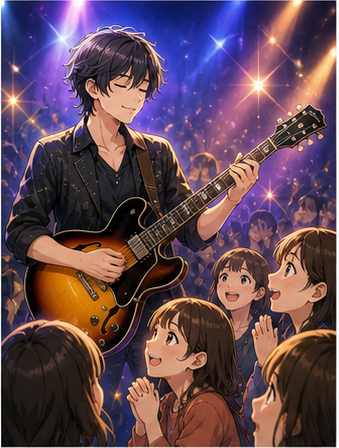

### **be famous for + danh từ / V-ing**

* **She's famous for her voice.**
* **He's famous for writing love songs.**
* **The band is famous for its live performances.**

### Cấu trúc

`be famous for + noun / V-ing`

---

## 6.14. Hỏi thần tượng âm nhạc

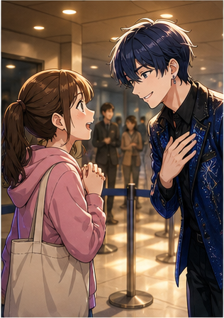

### **Who's your musical idol?**

— Thần tượng âm nhạc của bạn là ai?

Cách tự nhiên khác:

* **Who's your favorite singer?**
* **Who's your favorite artist?**
* **Who's your favorite band?**

---

## 6.15. Nói về nhạc đệm

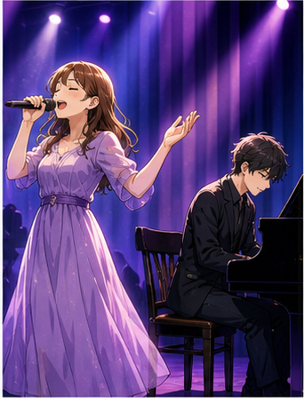

### **sing with + nhạc cụ + accompaniment**

* **She'll sing with piano accompaniment.**

Cách giao tiếp đơn giản hơn:

* **She'll sing with a piano.**
* **The pianist will accompany her.**

---

## 6.16. Nhận xét âm nhạc

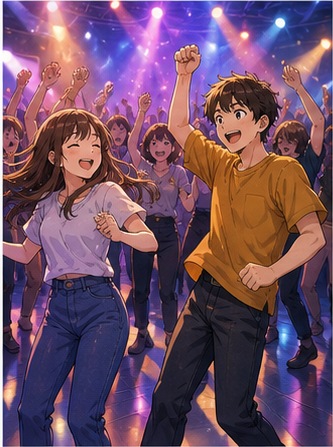

### **The music is great for dancing.**

— Âm nhạc rất phù hợp để nhảy.

Có thể thêm câu hỏi đuôi:

### **The music is great for dancing, isn't it?**

— Nhạc này rất hợp để nhảy nhỉ?

---

## 6.17. Nói về nhịp điệu

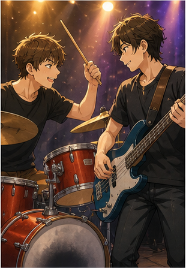

### **It has a + tính từ + rhythm.**

* **It has a strong rhythm.**
* **It has a clear rhythm.**
* **The rhythm is easy to follow.**

### Nói về khiêu vũ

**It's easy to dance to.**

— Nhạc này dễ nhảy theo.

---

## 6.18. Hỏi nguồn gốc âm nhạc

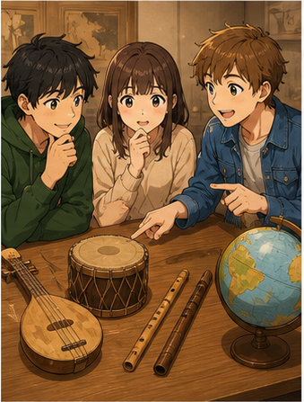

### **Can you tell me about the origins of this music?**

— Bạn có thể cho tôi biết về nguồn gốc của loại nhạc này không?

Cách đơn giản hơn:

### **Where does this kind of music come from?**

— Thể loại nhạc này có nguồn gốc từ đâu?

---

## 6.19. Nói về chất lượng âm thanh

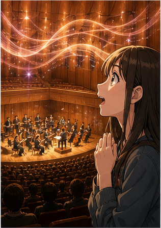

### **The acoustics are + tính từ.**

* **The acoustics are excellent.**
* **The acoustics are very good.**
* **The acoustics aren't good enough.**

— Chất lượng âm thanh của không gian...

---

## 6.20. Nói về trải nghiệm nghe nhạc

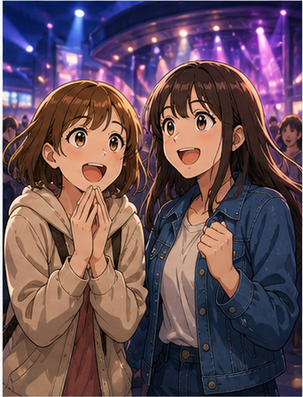

### **It's + tính từ + to + V**

* **It's fascinating to listen to live music.**
* **It's exciting to see the band live.**
* **It's relaxing to listen to jazz.**

---

# 7. Các thể loại âm nhạc phổ biến

| Thể loại        | Tiếng Anh            | Ví dụ                             |
| --------------- | -------------------- | --------------------------------- |
| Nhạc pop        | **pop music**        | I like pop music.                 |
| Nhạc rock       | **rock music**       | He listens to rock.               |
| Nhạc rap        | **rap / hip-hop**    | I enjoy rap music.                |
| Nhạc jazz       | **jazz**             | Do you like jazz?                 |
| Nhạc đồng quê   | **country music**    | She loves country music.          |
| Nhạc cổ điển    | **classical music**  | I listen to classical music.      |
| Nhạc điện tử    | **electronic music** | This club plays electronic music. |
| Nhạc R&B        | **R&B**              | I like R&B.                       |
| Nhạc dân gian   | **folk music**       | This is traditional folk music.   |
| Nhạc giao hưởng | **symphonic music**  | We heard symphonic music.         |

### Sơ đồ

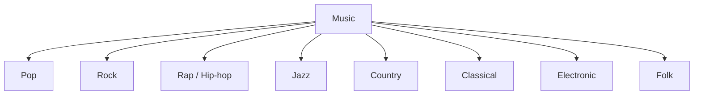

---

# 8. Phân biệt **concert**, **show**, **performance** và **gig**

## **concert**

Buổi biểu diễn âm nhạc trước khán giả.

**We're going to a concert tonight.**

---

## **show**

Từ rộng hơn, có thể là:

* hòa nhạc;
* kịch;
* chương trình giải trí;
* biểu diễn sân khấu.

**Are there any tickets left for tonight's show?**

---

## **performance**

Một màn hoặc buổi biểu diễn.

**The performance was excellent.**

---

## **gig**

Cách nói thân mật về một buổi diễn âm nhạc, đặc biệt với ban nhạc hoặc nghệ sĩ.

**The band has a gig tonight.**

### So sánh

| Từ              | Nghĩa               | Sắc thái                    |
| --------------- | ------------------- | --------------------------- |
| **concert**     | hòa nhạc            | thông dụng                  |
| **show**        | buổi biểu diễn      | rộng                        |
| **performance** | màn/buổi trình diễn | trung tính, trang trọng hơn |
| **gig**         | buổi diễn           | thân mật                    |

---

# 9. Phát âm trọng tâm

## 9.1. **concert**

**concert**
/ˈkɒn.sət/

Trọng âm:

**CON**-cert

---

## 9.2. **music**

**music**
/ˈmjuː.zɪk/

Trọng âm:

**MU**-sic

---

## 9.3. **orchestra**

**orchestra**
/ˈɔː.kɪ.strə/

Trọng âm:

**OR**-ches-tra

---

## 9.4. **acoustics**

**acoustics**
/əˈkuː.stɪks/

Trọng âm:

a-**COUS**-tics

---

## 9.5. **rhythm**

**rhythm**
/ˈrɪð.əm/

Chú ý:

* từ có cách viết khá khó;
* âm đầu giống **ri-**;
* âm **/ð/** ở giữa.

---

## 9.6. **famous**

**famous**
/ˈfeɪ.məs/

Trọng âm:

**FA**-mous

---

## 9.7. **fascinating**

**fascinating**
/ˈfæs.ɪ.neɪ.tɪŋ/

Trọng âm:

**FAS**-ci-na-ting

---

## 9.8. Nối âm trong hội thoại

### **Do you like jazz?**

Luyện:

`Do-you-like-jazz?`

### **Are there any tickets left?**

Luyện theo cụm:

`Are-there-any / tickets-left?`

### **Is this seat taken?**

Luyện:

`Is-this-seat-taken?`

---

# 10. Hội thoại thực tế — Real-Life Conversation

## Hội thoại chính — Mua vé hòa nhạc

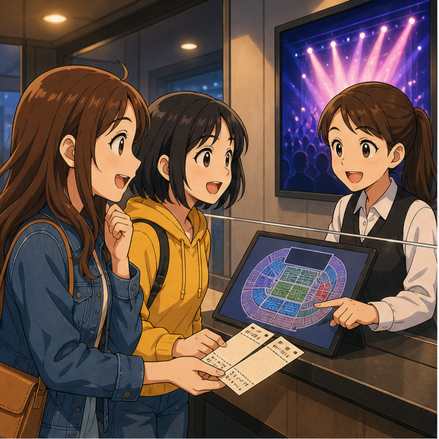

**Customer:** Excuse me. Do you have any tickets for tonight's concert?
**Staff:** Yes, we do. How many do you need?
**Customer:** I'd like two tickets, please.
**Staff:** We have seats near the stage and some farther back.
**Customer:** Do you have anything in the middle?
**Staff:** Yes. These two seats are available.
**Customer:** Great. How much are they?
**Staff:** They're $40 each.
**Customer:** That's fine. I'll take them.
**Staff:** Here you are. Enjoy the concert.

### Nội dung giao tiếp

```text
Hỏi còn vé
     ↓
Chọn số lượng
     ↓
Hỏi vị trí ghế
     ↓
Chọn ghế
     ↓
Hỏi giá
     ↓
Mua vé
     ↓
Kết thúc
```

---

## Hội thoại 2 — Hết vé

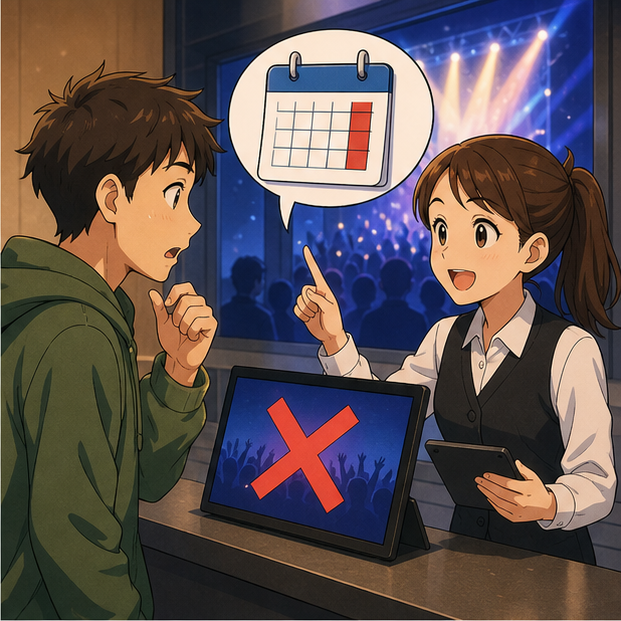

**Mai:** Hi. Are there any tickets left for Saturday's show?
**Staff:** I'm sorry. Saturday is sold out.
**Mai:** Oh, that's too bad. When do you have tickets available?
**Staff:** We still have tickets for Sunday evening.
**Mai:** What time does the concert start?
**Staff:** At seven thirty.
**Mai:** Do you have any seats near the front?
**Staff:** We have two in the fifth row.
**Mai:** Perfect. I'll take them.
**Staff:** Great.

---

## Hội thoại 3 — Nói về sở thích âm nhạc

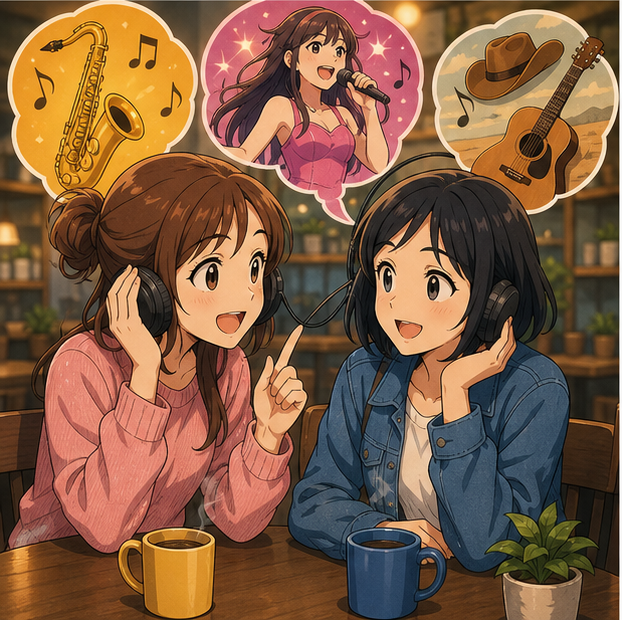

**Alex:** Do you often go to concerts?
**Nam:** Yes. I really enjoy live music.
**Alex:** What kind of music do you like?
**Nam:** Mostly pop and rap. What about you?
**Alex:** I prefer jazz and country music.
**Nam:** Really? I didn't know you were such a music fan.
**Alex:** I listen to music every day.
**Nam:** There's a jazz concert next week. Would you like to go?
**Alex:** Definitely. That sounds great.

---

## Hội thoại 4 — Sau buổi biểu diễn

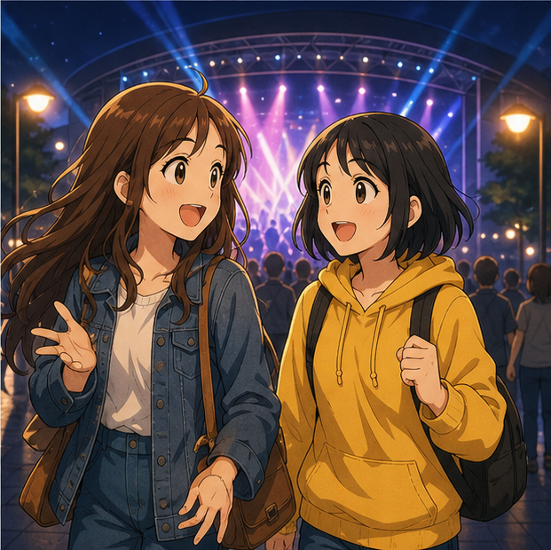

**Linh:** What did you think of the concert?
**Minh:** I loved it. The singer was amazing.
**Linh:** I agree. She has a fantastic voice.
**Minh:** And the band was excellent too.
**Linh:** The acoustics were really good, weren't they?
**Minh:** Yes. Everything sounded very clear.
**Linh:** My favorite song was the last one.
**Minh:** Mine too. The rhythm was great.
**Linh:** I'd definitely see them again.
**Minh:** Same here.

---

# 11. Natural Expressions — Cách nói tự nhiên

| Cụm từ                                    | Nghĩa                                    | Khi dùng        |
| ----------------------------------------- | ---------------------------------------- | --------------- |
| **Do you often go to concerts?**          | Bạn thường đi hòa nhạc không?            | Hỏi thói quen   |
| **What kind of music do you like?**       | Bạn thích loại nhạc nào?                 | Hỏi sở thích    |
| **I'm a big music fan.**                  | Tôi rất mê âm nhạc.                      | Nói sở thích    |
| **I really enjoy live music.**            | Tôi rất thích nhạc trực tiếp.            | Nói sở thích    |
| **Who's your favorite singer?**           | Ca sĩ yêu thích của bạn là ai?           | Hỏi nghệ sĩ     |
| **Are there any tickets left?**           | Còn vé không?                            | Hỏi vé          |
| **I'd like two tickets, please.**         | Tôi muốn hai vé.                         | Mua vé          |
| **Do you have anything near the stage?**  | Có ghế nào gần sân khấu không?           | Hỏi ghế         |
| **Is this seat taken?**                   | Ghế này có người chưa?                   | Hỏi chỗ ngồi    |
| **We're sold out.**                       | Chúng tôi đã hết vé.                     | Hết vé          |
| **When do you have tickets available?**   | Khi nào còn vé?                          | Hỏi suất khác   |
| **Where can I buy tickets?**              | Tôi mua vé ở đâu?                        | Hỏi địa điểm    |
| **Do I need to book in advance?**         | Tôi có cần đặt trước không?              | Hỏi đặt vé      |
| **I'll take these seats.**                | Tôi lấy các ghế này.                     | Mua vé          |
| **The seats are too close to the stage.** | Ghế quá gần sân khấu.                    | Nhận xét vị trí |
| **Do you have anything farther back?**    | Có ghế nào xa hơn không?                 | Đổi vị trí      |
| **The music is great for dancing.**       | Nhạc rất hợp để nhảy.                    | Nhận xét        |
| **I love the rhythm.**                    | Tôi rất thích nhịp điệu.                 | Cảm nhận        |
| **The acoustics are great.**              | Âm thanh trong khán phòng rất tốt.       | Nhận xét        |
| **The performance was amazing.**          | Màn biểu diễn thật tuyệt.                | Nhận xét        |
| **She has an amazing voice.**             | Cô ấy có giọng hát tuyệt vời.            | Khen ca sĩ      |
| **I'd love to see them live.**            | Tôi rất muốn xem họ biểu diễn trực tiếp. | Nói mong muốn   |
| **I'd definitely go again.**              | Tôi chắc chắn sẽ đi lần nữa.             | Sau buổi diễn   |

---

# 12. Lỗi thường gặp — Common Mistakes

## Lỗi 1: Dùng **a music**

❌ **I like a music.**

✅ **I like music.**

**music** thường là danh từ không đếm được.

Nhưng có thể nói:

✅ **a song**

✅ **a piece of music**

---

## Lỗi 2: Dùng sai sau **listen**

❌ **I listen music every day.**

✅ **I listen to music every day.**

### Cấu trúc

`listen to + something`

---

## Lỗi 3: Nói **go concert**

❌ **I go concert every month.**

✅ **I go to concerts every month.**

### Cấu trúc

`go to + event/place`

---

## Lỗi 4: Dùng sai **sold out**

❌ **The tickets are sell out.**

✅ **The tickets are sold out.**

Hoặc:

✅ **The concert is sold out.**

---

## Lỗi 5: Hỏi vé nhưng thiếu **any**

❌ **Do you have tickets left?**

Câu này vẫn có thể hiểu, nhưng tự nhiên hơn:

✅ **Do you have any tickets left?**

✅ **Are there any tickets left?**

---

## Lỗi 6: Dùng sai **famous for**

❌ **She's famous of her voice.**

✅ **She's famous for her voice.**

### Cấu trúc

`be famous for + noun / V-ing`

---

## Lỗi 7: Nhầm **hear** và **listen to**

### **hear**

= nghe thấy một cách tự nhiên.

**I can hear music.**

### **listen to**

= chủ động nghe.

**I listen to music every day.**

---

## Lỗi 8: Dùng sai **enjoy**

❌ **I enjoy to listen to music.**

✅ **I enjoy listening to music.**

### Cấu trúc

`enjoy + V-ing`

---

## Lỗi 9: Dùng **in the stage**

❌ **The singer is in the stage.**

✅ **The singer is on the stage.**

### Quy tắc

`on stage / on the stage`

---

## Lỗi 10: Nhầm **seat** và **sit**

### **seat**

danh từ = ghế, chỗ ngồi.

**This seat is free.**

### **sit**

động từ = ngồi.

**Let's sit here.**

---

## Lỗi 11: Nói **Is this chair taken?** trong rạp

Không sai, nhưng với chỗ ngồi tại rạp hoặc hòa nhạc, tự nhiên hơn:

✅ **Is this seat taken?**

---

## Lỗi 12: Dùng **very fascinating me**

❌ **The concert was very fascinating me.**

✅ **The concert was fascinating.**

Hoặc:

✅ **I found the concert fascinating.**

---

# 13. Luyện tập có hướng dẫn

## Bài 1 — Nối từ với nghĩa

1. concert
2. stage
3. sold out
4. rhythm
5. idol
6. acoustics

A. sân khấu
B. thần tượng
C. hết vé
D. hòa nhạc
E. nhịp điệu
F. chất lượng âm học

<details>
<summary>Đáp án</summary>

1–D
2–A
3–C
4–E
5–B
6–F

</details>

---

## Bài 2 — Điền từ vào chỗ trống

Dùng:

`tickets` · `stage` · `music` · `sold out` · `rhythm`

1. I really enjoy listening to ________.
2. Are there any ________ left?
3. Our seats are near the ________.
4. Sorry, tonight's show is ________.
5. This song has a strong ________.

<details>
<summary>Đáp án</summary>

1. music
2. tickets
3. stage
4. sold out
5. rhythm

</details>

---

## Bài 3 — Chọn câu đúng

### 1. Bạn muốn hỏi người khác thích thể loại nhạc nào.

* A. What kind of music do you like?
* B. What kind music you like?
* C. What music kind do you like?

**Đáp án:** A

---

### 2. Bạn muốn hỏi còn vé không.

* A. Are there any tickets left?
* B. Are any tickets leave?
* C. Have there tickets left?

**Đáp án:** A

---

### 3. Bạn muốn nói buổi diễn đã hết vé.

* A. The concert is sell out.
* B. The concert is sold out.
* C. The concert solding out.

**Đáp án:** B

---

### 4. Bạn muốn hỏi ghế có người chưa.

* A. Is this seat taken?
* B. Does this seat take?
* C. Is this seat taking?

**Đáp án:** A

---

## Bài 4 — **hear** hay **listen to**

1. I usually ________ music when I study.
2. Can you ________ that piano?
3. We went to ________ a live orchestra.
4. I can ________ someone singing outside.

<details>
<summary>Đáp án</summary>

1. listen to
2. hear
3. listen to
4. hear

</details>

---

## Bài 5 — **seat** hay **sit**

1. Is this ________ taken?
2. Let's ________ near the back.
3. Our ________ are in row five.
4. You can ________ here.

<details>
<summary>Đáp án</summary>

1. seat
2. sit
3. seats
4. sit

</details>

---

## Bài 6 — Hoàn thành hội thoại

**A:** Excuse me. Are there any ________ left for tonight's concert?
**B:** Yes. How many do you need?
**A:** I'd ________ two, please.
**B:** Do you want seats near the ________?
**A:** Not too close. Do you have anything farther ________?
**B:** Yes. These seats are available.
**A:** Great. I'll ________ them.

<details>
<summary>Đáp án</summary>

1. tickets
2. like
3. stage
4. back
5. take

</details>

---

# 14. Speaking Challenge — Thử thách nói

## Nhiệm vụ 1 — Đọc mẫu câu

Đọc các câu sau thành tiếng:

* **Do you often go to concerts?**
* **What kind of music do you like?**
* **Do you like jazz?**
* **Are there any tickets left?**
* **I'd like two tickets, please.**
* **Is this seat taken?**
* **Do I have to book in advance?**
* **The music is great for dancing.**
* **The acoustics are excellent.**
* **The performance was fascinating.**

Đọc mỗi câu hai lần:

* lần 1 chậm và rõ;
* lần 2 với tốc độ hội thoại tự nhiên.

---

## Nhiệm vụ 2 — Nói về sở thích âm nhạc

Nói ít nhất **5 câu** về bản thân.

Có thể trả lời:

1. Bạn thích loại nhạc nào?
2. Bạn thường nghe nhạc khi nào?
3. Ca sĩ hoặc ban nhạc yêu thích của bạn là ai?
4. Bạn có thường đi xem biểu diễn trực tiếp không?
5. Bạn thích ngồi gần hay xa sân khấu?

Ví dụ:

> **I really like pop music and jazz. I listen to music every day. I usually listen to music when I'm studying or travelling. I enjoy live concerts, but I don't like sitting too close to the stage.**

---

## Nhiệm vụ 3 — Mua vé hòa nhạc

Đóng vai khách hàng.

Phải sử dụng ít nhất:

* **Are there any tickets left?**
* **I'd like two tickets, please.**
* **Do you have anything near the stage?**
* **How much are they?**
* **I'll take them.**

---

## Nhiệm vụ 4 — Hội thoại 8 lượt

Tạo một đoạn hội thoại có ít nhất:

* 1 câu hỏi về thể loại âm nhạc;
* 1 câu nói sở thích;
* 1 lời rủ đi hòa nhạc;
* 1 câu hỏi còn vé;
* 1 câu hỏi vị trí ghế;
* 1 câu hỏi giá vé;
* 1 quyết định mua vé;
* 1 câu xác nhận cuối cùng.

---

## Nhiệm vụ 5 — Ghi âm

Ghi âm từ **45–60 giây**, sau đó kiểm tra:

* [ ] Tôi có thể hỏi **What kind of music do you like?**
* [ ] Tôi dùng đúng **listen to music**.
* [ ] Tôi dùng đúng **enjoy + V-ing**.
* [ ] Tôi có thể hỏi **Are there any tickets left?**
* [ ] Tôi có thể dùng **I'd like ... tickets, please.**
* [ ] Tôi hiểu **sold out**.
* [ ] Tôi có thể hỏi **Is this seat taken?**
* [ ] Tôi có thể nói về **stage** và **seat**.
* [ ] Tôi có thể nhận xét về một buổi biểu diễn.
* [ ] Tôi có thể duy trì hội thoại ít nhất 45 giây.

---

# 15. Practice Mission — Nhiệm vụ thực tế

Trong hôm nay, hãy tạo một cuộc hội thoại theo công thức:

> **Music preference → Concert suggestion → Ticket check → Seat choice → Purchase → Review**

Ví dụ:

> **What kind of music do you like?**
> ↓
> **I really like jazz.**
> ↓
> **There's a jazz concert this Saturday. Would you like to go?**
> ↓
> **Sure. Are there any tickets left?**
> ↓
> **Yes. They still have seats in the middle.**
> ↓
> **Great. Let's get two tickets.**

Sau đó viết hoặc nói một đoạn hội thoại **8–10 lượt** cho một trong các tình huống:

* rủ bạn đi hòa nhạc;
* mua vé tại quầy;
* buổi diễn đã hết vé;
* chọn giữa ghế gần và xa sân khấu;
* nói về ca sĩ yêu thích;
* nói về một thể loại nhạc;
* chia sẻ cảm nhận sau buổi diễn;
* chọn giữa pop, jazz và rap.

---

# 16. Tự đánh giá cuối bài

Đánh dấu khi bạn có thể thực hiện mà không nhìn bài:

* [ ] Tôi có thể hỏi **Do you often go to concerts?**
* [ ] Tôi có thể hỏi **What kind of music do you like?**
* [ ] Tôi có thể dùng **Do you like ...?**
* [ ] Tôi có thể nói **I like pop / jazz / country music.**
* [ ] Tôi có thể dùng **listen to music**.
* [ ] Tôi có thể dùng **enjoy listening to music**.
* [ ] Tôi có thể hỏi **Are there any tickets left?**
* [ ] Tôi có thể nói **I'd like two tickets, please.**
* [ ] Tôi hiểu **sold out**.
* [ ] Tôi có thể hỏi về vị trí ghế.
* [ ] Tôi có thể hỏi **Is this seat taken?**
* [ ] Tôi có thể hỏi **Where can I buy a ticket?**
* [ ] Tôi có thể hỏi **Do I have to book in advance?**
* [ ] Tôi có thể dùng **famous for**.
* [ ] Tôi có thể nói về **rhythm**.
* [ ] Tôi hiểu **acoustics**.
* [ ] Tôi có thể nói về nghệ sĩ mình yêu thích.
* [ ] Tôi có thể nhận xét về một buổi biểu diễn.
* [ ] Tôi có thể duy trì hội thoại ít nhất 45 giây.

---

# 17. Câu hỏi mở cuối bài

**Imagine your favorite artist is performing in your city next month. How would you invite a friend, ask about tickets and seats, and describe what kind of experience you hope to have at the concert?**

*Hãy tưởng tượng nghệ sĩ yêu thích của bạn sẽ biểu diễn tại thành phố của bạn vào tháng tới. Bạn sẽ rủ một người bạn như thế nào, hỏi về vé và chỗ ngồi ra sao, và bạn mong đợi trải nghiệm gì tại buổi hòa nhạc?*

---

# 18. Ghi chú dành cho giảng viên

* **Module:** 02 — Everyday Conversations / Những cuộc hội thoại thường ngày
* **Chủ điểm:** Going to a Concert
* **Thời lượng video:** 8–12 phút
* **Luyện nói:** 5–10 phút

### Trọng tâm từ vựng

* concert
* music
* jazz
* country music
* pop music
* rap music
* symphony orchestra
* stage
* ticket
* sold out
* front row
* seat
* acoustics
* accompaniment
* rhythm
* idol
* famous
* famous for
* fascinating
* music fan
* book in advance

### Trọng tâm cấu trúc

* **Do you often go to concerts?**
* **What kind of music do you like?**
* **What type of music do you like?**
* **Do you like jazz?**
* **I like country music.**
* **I really enjoy listening to music.**
* **Are there any tickets left for ...?**
* **Do you have any tickets for ...?**
* **I'd like two tickets, please.**
* **Do you have any seats in the front rows?**
* **Sorry, we're sold out.**
* **When do you have tickets available?**
* **Is this seat taken?**
* **Where can I buy a ticket?**
* **Do I have to book in advance?**
* **Who's your favorite singer?**
* **be famous for + noun / V-ing**
* **The music is great for dancing.**
* **It has a strong rhythm.**
* **It's easy to dance to.**
* **Can you tell me about the origins of this music?**
* **The acoustics are excellent.**
* **It's fascinating to listen to live music.**

### Trọng tâm phát âm

* **concert**
* **music**
* **orchestra**
* **acoustics**
* **rhythm**
* **famous**
* **fascinating**
* **stage**

### Lưu ý ngôn ngữ

* **music** thường là danh từ không đếm được:

  * **I like music.**
* Dùng:

  * **listen to music**

  Không dùng:

  * `listen music`
* **go to a concert**, không dùng `go concert`.
* Sau **enjoy** dùng **V-ing**:

  * **I enjoy listening to music.**
* **sold out** = đã bán hết.
* Có thể nói:

  * **The concert is sold out.**
  * **The tickets are sold out.**
* **seat** = chỗ ngồi.
* **sit** = hành động ngồi.
* **on stage / on the stage** dùng khi nói nghệ sĩ ở trên sân khấu.
* **be famous for + noun / V-ing**:

  * **She's famous for her voice.**
  * **He's famous for writing songs.**
* **hear** = nghe thấy.
* **listen to** = chủ động nghe.
* **rhythm** = nhịp điệu.
* **acoustics** thường ở dạng số nhiều khi nói về đặc tính âm thanh của một địa điểm.
* **book in advance** = đặt trước.
* **front row** = hàng đầu.
* Có thể dùng **near the stage**, **in the middle**, **farther back** để mô tả vị trí chỗ ngồi.

### Hoạt động gợi ý — Music Survey

Chia lớp thành cặp.

Mỗi người hỏi bạn cùng cặp:

> **What kind of music do you like?**

> **Who's your favorite singer?**

> **How often do you listen to music?**

> **Do you often go to concerts?**

> **Would you like to see your favorite artist live?**

Sau đó giới thiệu lại bạn cùng cặp bằng 4–5 câu.

Ví dụ:

> **Mai really likes pop music. She listens to music every day. Her favorite singer is ... She doesn't go to concerts very often, but she'd love to see her favorite artist live.**

### Role-play mẫu — Mua vé hòa nhạc

**Người A nhận:**

> Bạn muốn mua hai vé cho buổi biểu diễn tối thứ Sáu. Bạn muốn ghế ở giữa, không quá gần sân khấu.

**Người B nhận:**

> Hàng đầu còn ghế, khu vực giữa còn hai ghế, hàng sau còn nhiều ghế.

Người A phải sử dụng ít nhất:

* **Are there any tickets left?**
* **I'd like two tickets, please.**
* **Do you have anything in the middle?**
* **I don't want to sit too close to the stage.**
* **How much are they?**

Người B phải sử dụng ít nhất:

* **Yes, we do.**
* **We have seats ...**
* **These two are available.**
* **They're ... each.**
* **Here you are.**

### Role-play mẫu — Hết vé

**Người A nhận:**

> Bạn muốn mua vé cho tối thứ Bảy.

**Người B nhận:**

> Thứ Bảy đã hết vé nhưng Chủ nhật vẫn còn vé.

Phải sử dụng ít nhất:

* **Are there any tickets left for Saturday?**
* **We're sold out.**
* **When do you have tickets available?**
* **We have tickets for Sunday.**
* **What time does it start?**
* **I'll take ...**

### Role-play mẫu — Sau buổi biểu diễn

**Người A nhận:**

> Bạn rất thích ca sĩ và chất lượng âm thanh.

**Người B nhận:**

> Bạn thích ban nhạc và nhịp điệu nhưng thấy ghế hơi xa sân khấu.

Hai người phải dùng:

* **What did you think of the concert?**
* **I loved ...**
* **The acoustics were ...**
* **The rhythm was ...**
* **The seats were ...**
* **I'd go again / I wouldn't choose those seats again.**

Kết thúc bằng một đánh giá ngắn:

> **Overall, it was a great concert.**

---
