# LESSON 12 — GIAO TIẾP TRONG THẾ GIỚI TRỰC TUYẾN

> **Module 02 — Everyday Conversations / Những cuộc hội thoại thường ngày**
> **Chủ đề:** Internet & Online Communication — Internet, website, email và hoạt động trực tuyến
> **Trình độ gợi ý:** A1–A2
> **Thời lượng:** 8–12 phút học bài + 5–10 phút luyện nói

---

## 1. Tình huống thực tế

Internet là một phần quen thuộc của cuộc sống hằng ngày. Bạn có thể cần nói về Internet khi:

* hỏi người khác có biết sử dụng máy tính không;
* nói về việc sử dụng Internet;
* trò chuyện với bạn bè trực tuyến;
* mua sắm trực tuyến;
* tìm kiếm thông tin;
* truy cập một website;
* gửi và nhận email;
* gửi tệp đính kèm;
* tải tệp xuống máy;
* tải ảnh hoặc tài liệu lên mạng;
* tạo tài khoản và mật khẩu;
* lưu một tệp;
* gặp lỗi máy tính;
* làm mất dữ liệu;
* thiết lập các biện pháp bảo mật;
* nói về lợi ích hoặc tác hại của việc sử dụng Internet.

Bạn cần biết cách nói những câu như:

* **Do you know how to use a computer?**
* **Are you online?**
* **I often chat online.**
* **I often shop online.**
* **Do you often use the Internet?**
* **I download music from the Internet.**
* **You can find more information online.**
* **Search for the information online.**
* **My computer crashed.**
* **I lost the file.**
* **Have you set up a firewall?**
* **Enter your password.**
* **Let's set up a password.**
* **Could you email me the file?**

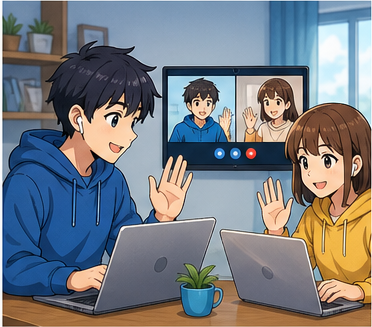

---

## 2. Mục tiêu bài học

Sau bài học, người học có thể:

1. Hỏi người khác có biết sử dụng máy tính không.
2. Hỏi về thói quen sử dụng Internet.
3. Nói về việc trò chuyện trực tuyến.
4. Nói về mua sắm trực tuyến.
5. Hỏi người khác đã từng mua hàng online hay chưa.
6. Nói về việc tìm kiếm thông tin trên Internet.
7. Dùng **search for** để nói về việc tìm kiếm.
8. Dùng **download** và **upload** đúng ngữ cảnh.
9. Nói về website và đường dẫn.
10. Gửi hoặc yêu cầu người khác gửi email.
11. Nói về tệp và tệp đính kèm.
12. Nói về việc lưu tệp.
13. Giải thích khi máy tính gặp sự cố.
14. Nói về mật khẩu và tài khoản.
15. Hiểu vai trò cơ bản của **firewall**.
16. Đưa ra lời khuyên đơn giản về an toàn trực tuyến.
17. Nói về lợi ích và hạn chế của Internet.
18. Duy trì một đoạn hội thoại 6–8 lượt về hoạt động trực tuyến.

---

## 3. Sơ đồ giao tiếp

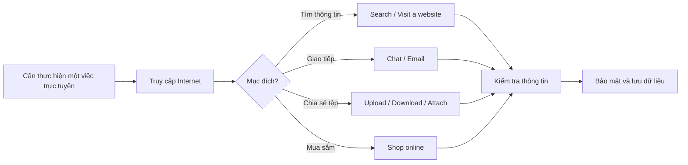

### Mẫu đơn giản

`Are you online?`
→ `Yes, I am.`
→ `Could you send me the file?`
→ `Sure. I'll email it to you.`
→ `Please attach the latest version.`
→ `No problem.`

---

# 4. Từ vựng trọng tâm — Core Vocabulary

## 4.1. **Internet** /ˈɪn.tə.net/

**Nghĩa:** Internet, mạng Internet


**Ví dụ:**

* **Do you often use the Internet?**
  — Bạn có thường sử dụng Internet không?

* **You can find a lot of information on the Internet.**
  — Bạn có thể tìm thấy rất nhiều thông tin trên Internet.

---

## 4.2. **online** /ˌɒnˈlaɪn/

**Nghĩa:** trực tuyến, trên mạng


**Ví dụ:**

* **I often chat online.**
  — Tôi thường trò chuyện trực tuyến.

* **You can buy tickets online.**
  — Bạn có thể mua vé trực tuyến.

---

## 4.3. **information** /ˌɪn.fəˈmeɪ.ʃən/

**Nghĩa:** thông tin


**Ví dụ:**

* **I need more information.**
  — Tôi cần thêm thông tin.

* **You can find the information online.**
  — Bạn có thể tìm thông tin trên mạng.

> **information** thường là danh từ không đếm được.

---

## 4.4. **chat online** /tʃæt ˌɒnˈlaɪn/

**Nghĩa:** trò chuyện trực tuyến

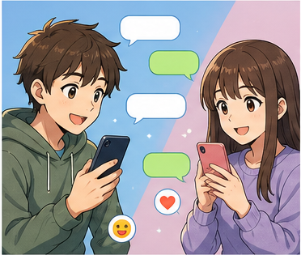

**Ví dụ:**

* **I often chat online with my friends.**
  — Tôi thường trò chuyện trực tuyến với bạn bè.

* **Do you like chatting online?**
  — Bạn có thích trò chuyện trực tuyến không?

---

## 4.5. **shop online** /ʃɒp ˌɒnˈlaɪn/

**Nghĩa:** mua sắm trực tuyến


**Ví dụ:**

* **I often shop online.**
  — Tôi thường mua sắm trực tuyến.

* **Have you ever shopped online?**
  — Bạn đã từng mua hàng trực tuyến chưa?

---

## 4.6. **website** /ˈweb.saɪt/

**Nghĩa:** trang web, website


**Ví dụ:**

* **What's the website address?**
  — Địa chỉ website là gì?

* **You can find it on their website.**
  — Bạn có thể tìm thấy thông tin đó trên website của họ.

---

## 4.7. **browser** /ˈbraʊ.zər/

**Nghĩa:** trình duyệt web


**Ví dụ:**

* **Open your browser.**
  — Hãy mở trình duyệt.

* **Which browser do you use?**
  — Bạn sử dụng trình duyệt nào?

---

## 4.8. **search for** /sɜːtʃ fɔːr/

**Nghĩa:** tìm kiếm

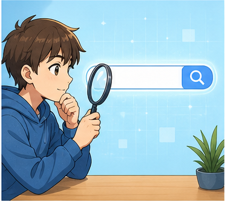

**Ví dụ:**

* **Search for the information online.**
  — Hãy tìm thông tin trên mạng.

* **I'm searching for a new laptop.**
  — Tôi đang tìm một chiếc laptop mới.

---

## 4.9. **file** /faɪl/

**Nghĩa:** tệp, tập tin


**Ví dụ:**

* **Please send me the file.**
  — Hãy gửi cho tôi tệp đó.

* **I can't find the file.**
  — Tôi không tìm thấy tệp.

---

## 4.10. **save** /seɪv/

**Nghĩa:** lưu

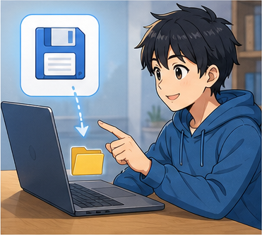

**Ví dụ:**

* **Don't forget to save your work.**
  — Đừng quên lưu công việc của bạn.

* **Save the file before you close the program.**
  — Hãy lưu tệp trước khi đóng chương trình.

---

## 4.11. **download** /ˌdaʊnˈləʊd/

**Nghĩa:** tải xuống


**Ví dụ:**

* **I downloaded the file from the website.**
  — Tôi đã tải tệp xuống từ website.

* **Where can I download the document?**
  — Tôi có thể tải tài liệu ở đâu?

---

## 4.12. **upload** /ˌʌpˈləʊd/

**Nghĩa:** tải lên


**Ví dụ:**

* **Please upload the photo.**
  — Hãy tải ảnh lên.

* **I uploaded the file to the website.**
  — Tôi đã tải tệp lên website.

---

## 4.13. **email** /ˈiː.meɪl/

**Nghĩa:** email; gửi email

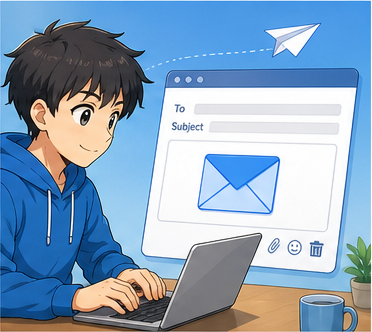

**Ví dụ:**

* **Could you email me the file?**
  — Bạn có thể gửi tệp cho tôi qua email không?

* **I sent you an email yesterday.**
  — Hôm qua tôi đã gửi email cho bạn.

---

## 4.14. **attachment** /əˈtætʃ.mənt/

**Nghĩa:** tệp đính kèm


**Ví dụ:**

* **Please check the attachment.**
  — Hãy kiểm tra tệp đính kèm.

* **I forgot to attach the file.**
  — Tôi quên đính kèm tệp.

---

## 4.15. **link** /lɪŋk/

**Nghĩa:** đường dẫn, liên kết


**Ví dụ:**

* **Can you send me the link?**
  — Bạn có thể gửi cho tôi đường dẫn không?

* **Click the link to open the page.**
  — Nhấp vào đường dẫn để mở trang.

---

## 4.16. **password** /ˈpɑːs.wɜːd/

**Nghĩa:** mật khẩu

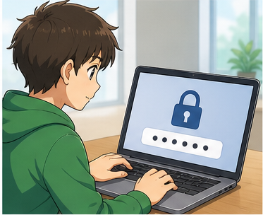

**Ví dụ:**

* **Enter your password.**
  — Nhập mật khẩu của bạn.

* **Don't share your password with anyone.**
  — Đừng chia sẻ mật khẩu với bất kỳ ai.

---

## 4.17. **account** /əˈkaʊnt/

**Nghĩa:** tài khoản

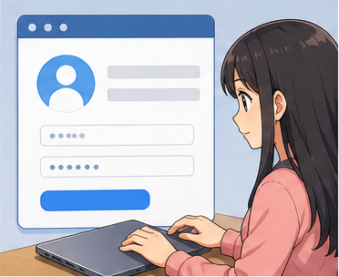

**Ví dụ:**

* **I created a new account.**
  — Tôi đã tạo một tài khoản mới.

* **I can't log in to my account.**
  — Tôi không thể đăng nhập vào tài khoản.

---

## 4.18. **set up** /set ʌp/

**Nghĩa:** thiết lập, cài đặt

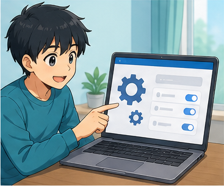

**Ví dụ:**

* **Let's set up a new password.**
  — Hãy thiết lập một mật khẩu mới.

* **Can you help me set up my account?**
  — Bạn có thể giúp tôi thiết lập tài khoản không?

---

## 4.19. **firewall** /ˈfaɪə.wɔːl/

**Nghĩa:** tường lửa


**Ví dụ:**

* **Have you set up a firewall?**
  — Bạn đã thiết lập tường lửa chưa?

* **A firewall helps protect your computer.**
  — Tường lửa giúp bảo vệ máy tính.

---

## 4.20. **crash** /kræʃ/

**Nghĩa trong bài:** máy tính hoặc chương trình bị lỗi và ngừng hoạt động

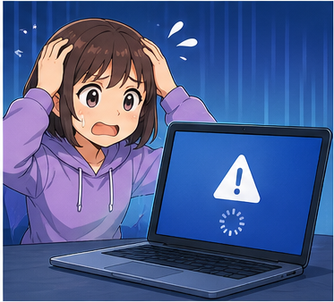

**Ví dụ:**

* **My computer crashed while I was working.**
  — Máy tính của tôi bị lỗi khi tôi đang làm việc.

* **The program keeps crashing.**
  — Chương trình liên tục bị lỗi.

---

## 4.21. **lost** /lɒst/

**Nghĩa:** bị mất

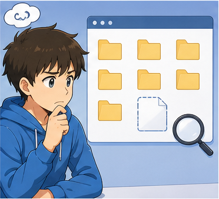

**Ví dụ:**

* **The file is lost.**
  — Tệp đã bị mất.

* **I lost some of my work.**
  — Tôi đã mất một phần công việc.

---

## 4.22. **fascinated by** /ˈfæs.ɪ.neɪ.tɪd baɪ/

**Nghĩa:** rất hứng thú, bị cuốn hút bởi


**Ví dụ:**

* **Many people are fascinated by new technology.**
  — Nhiều người rất hứng thú với công nghệ mới.

* **He's fascinated by computers.**
  — Anh ấy rất hứng thú với máy tính.

---

## 4.23. **waste time** /weɪst taɪm/

**Nghĩa:** lãng phí thời gian


**Ví dụ:**

* **Don't waste too much time online.**
  — Đừng lãng phí quá nhiều thời gian trên mạng.

* **I sometimes waste time watching short videos.**
  — Đôi khi tôi lãng phí thời gian xem video ngắn.

---

# 5. Bảng tổng hợp từ vựng

| Từ / cụm từ       | IPA              | Nghĩa tiếng Việt         | Ví dụ ngắn               |
| ----------------- | ---------------- | ------------------------ | ------------------------ |
| **Internet**      | /ˈɪn.tə.net/     | Internet                 | use the Internet         |
| **online**        | /ˌɒnˈlaɪn/       | trực tuyến               | chat online              |
| **information**   | /ˌɪn.fəˈmeɪ.ʃən/ | thông tin                | find information         |
| **chat online**   | —                | trò chuyện trực tuyến    | I chat online.           |
| **shop online**   | —                | mua sắm trực tuyến       | I shop online.           |
| **website**       | /ˈweb.saɪt/      | website                  | visit a website          |
| **browser**       | /ˈbraʊ.zər/      | trình duyệt              | open the browser         |
| **search for**    | /sɜːtʃ fɔːr/     | tìm kiếm                 | search for information   |
| **file**          | /faɪl/           | tệp                      | send a file              |
| **save**          | /seɪv/           | lưu                      | save the file            |
| **download**      | /ˌdaʊnˈləʊd/     | tải xuống                | download a file          |
| **upload**        | /ˌʌpˈləʊd/       | tải lên                  | upload a photo           |
| **email**         | /ˈiː.meɪl/       | email                    | send an email            |
| **attachment**    | /əˈtætʃ.mənt/    | tệp đính kèm             | open the attachment      |
| **link**          | /lɪŋk/           | đường dẫn                | send the link            |
| **password**      | /ˈpɑːs.wɜːd/     | mật khẩu                 | enter your password      |
| **account**       | /əˈkaʊnt/        | tài khoản                | create an account        |
| **set up**        | /set ʌp/         | thiết lập                | set up an account        |
| **firewall**      | /ˈfaɪə.wɔːl/     | tường lửa                | set up a firewall        |
| **crash**         | /kræʃ/           | gặp lỗi, ngừng hoạt động | My computer crashed.     |
| **lost**          | /lɒst/           | bị mất                   | The file is lost.        |
| **fascinated by** | —                | bị cuốn hút bởi          | fascinated by technology |
| **waste time**    | —                | lãng phí thời gian       | waste time online        |

---

# 6. Mẫu câu giao tiếp — Useful Structures

## 6.1. Hỏi khả năng sử dụng máy tính

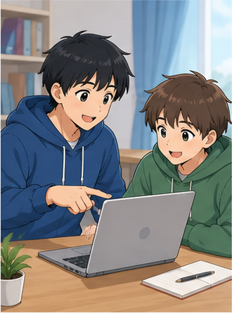

### **Do you know how to use a computer?**

— Bạn có biết sử dụng máy tính không?

### Cấu trúc

`Do you know how to + V?`

Ví dụ:

* **Do you know how to send an email?**
* **Do you know how to download this file?**
* **Do you know how to create an account?**

---

## 6.2. Hỏi người khác có đang trực tuyến không

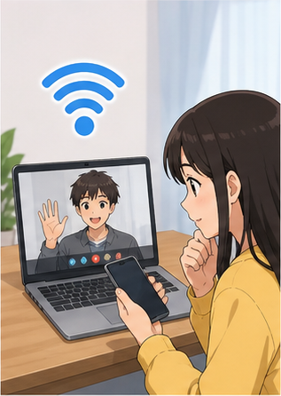

### **Are you online?**

— Bạn có đang online không?

Cách khác:

* **Are you on the Internet right now?**
* **Are you connected to the Internet?**

---

## 6.3. Nói về thói quen trực tuyến

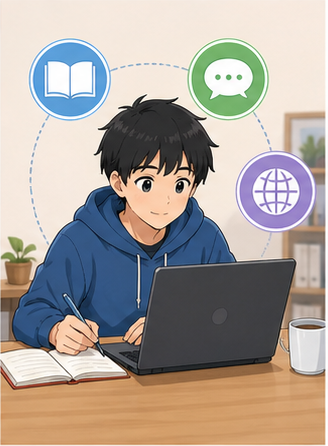

### **I often + V ...**

* **I often chat online.**
* **I often shop online.**
* **I often watch videos online.**
* **I often search for information online.**

### Hỏi

**Do you often + V ...?**

* **Do you often shop online?**
* **Do you often chat online?**

---

## 6.4. Hỏi về trải nghiệm mua sắm trực tuyến


### **Have you ever + V3 ...?**

* **Have you ever shopped online?**
* **Have you ever bought something from this website?**

Trả lời:

* **Yes, I have.**
* **No, I haven't.**
* **No, never.**

---

## 6.5. Tìm kiếm thông tin

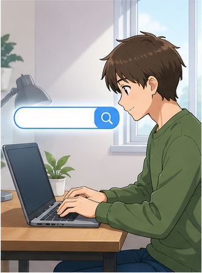

### **search for + thông tin / đồ vật**

* **Search for the information online.**
* **I'm searching for a hotel.**
* **Can you search for the website?**

### Cách khác

**Look it up online.**

— Hãy tra cứu nó trên mạng.

---

## 6.6. Nói về việc sử dụng Internet để lấy thông tin


### **You can find + thông tin + online.**

* **You can find more information online.**
* **You can find the address on their website.**

Cách khác:

### **You can get more information by searching online.**

---

## 6.7. Tải tệp xuống

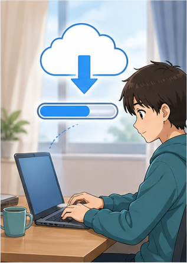

### **download + tệp + from + nguồn**

* **Download the file from the website.**
* **I downloaded the document from the Internet.**

### Cấu trúc

`download something from somewhere`

---

## 6.8. Tải tệp lên

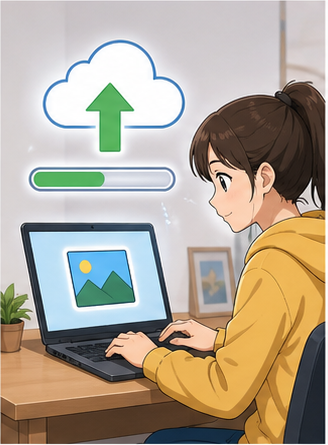

### **upload + tệp + to + nơi nhận**

* **Upload the photo to the website.**
* **I uploaded the document to the shared folder.**

### Cấu trúc

`upload something to somewhere`

---

## 6.9. Gửi tệp qua email

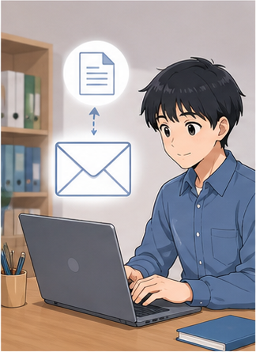

### **Could you email me + đồ vật?**

* **Could you email me the file?**
* **Could you email me the information?**

Cách khác:

### **Could you send me the file by email?**

---

## 6.10. Gửi đường dẫn


### **Could you send me the link?**

— Bạn có thể gửi đường dẫn cho tôi không?

Cách khác:

* **Can you share the link with me?**
* **Please send me the website address.**

---

## 6.11. Nói về tệp đính kèm

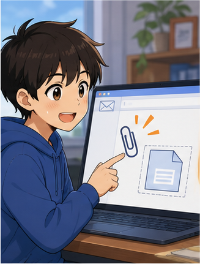

### **I've attached + tệp.**

* **I've attached the document.**
* **I've attached the photo.**

### Hỏi

* **Did you get the attachment?**
* **Can you open the attachment?**

---

## 6.12. Nói về việc lưu tệp

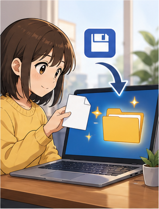

### **save + tệp**

* **Save the file.**
* **Don't forget to save your work.**

### Lời khuyên

**You should save your work regularly.**

— Bạn nên lưu công việc thường xuyên.

---

## 6.13. Nói máy tính gặp sự cố

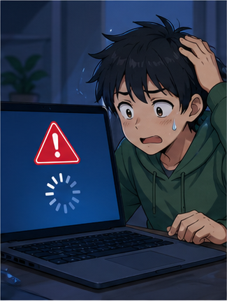

### **My computer crashed.**

— Máy tính của tôi bị lỗi / bị treo và dừng hoạt động.

Ví dụ:

* **My computer crashed while I was saving the file.**
* **The program crashed again.**

---

## 6.14. Nói tệp bị mất

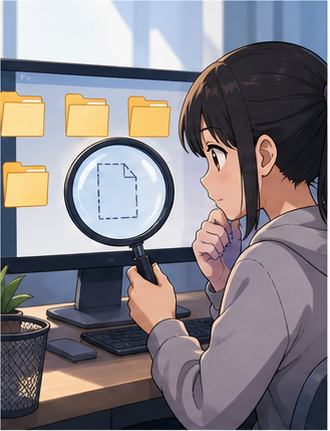

### **I lost the file.**

— Tôi đã làm mất tệp.

### **The file is gone.**

— Tệp đã biến mất / không còn nữa.

### **I can't find the file.**

— Tôi không tìm thấy tệp.

---

## 6.15. Thiết lập mật khẩu

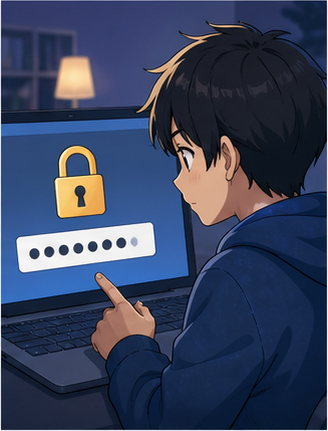

### **Let's set up a password.**

— Hãy thiết lập mật khẩu.

### **Enter your password.**

— Nhập mật khẩu của bạn.

### **Create a strong password.**

— Hãy tạo một mật khẩu mạnh.

---

## 6.16. Hỏi về firewall

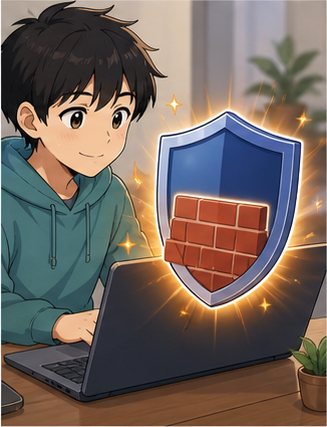

### **Have you set up a firewall?**

— Bạn đã thiết lập tường lửa chưa?

Cách khác:

* **Is your firewall turned on?**
* **Do you have security software installed?**

---

## 6.17. Nói về sở thích trực tuyến


### **I enjoy + V-ing**

* **I enjoy chatting online.**
* **I enjoy watching videos online.**
* **I enjoy shopping online.**

### Cấu trúc

`enjoy + V-ing`

---

## 6.18. Nói một hoạt động gây lãng phí thời gian


### **It's a waste of time to + V.**

* **It's a waste of time to argue online.**

### Tự nhiên hơn khi nói về hoạt động

### **V-ing + is a waste of time.**

* **Spending hours online is a waste of time.**

Cách nhẹ hơn:

* **I think I spend too much time online.**

---

## 6.19. Nói mình rất thích một hoạt động trực tuyến


### **I'm really into + danh từ / V-ing.**

* **I'm really into online gaming.**
* **I'm really into chatting online.**

— Tôi rất thích / rất mê...

Cách khác:

* **I'm a big fan of ...**
* **I really enjoy ...**

---

## 6.20. Hỏi xem có chuyện gì với máy tính

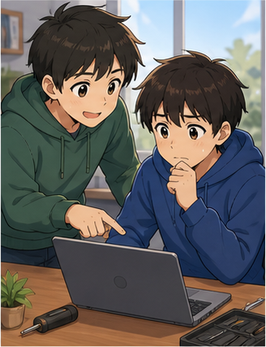

### **What's wrong with your computer?**

— Máy tính của bạn bị sao vậy?

### **What happened?**

— Chuyện gì đã xảy ra?

### Phản hồi

**My computer crashed and I lost my file.**

---

# 7. Các hoạt động trực tuyến phổ biến

| Hoạt động             | Tiếng Anh                  | Ví dụ                          |
| --------------------- | -------------------------- | ------------------------------ |
| Trò chuyện trực tuyến | **chat online**            | I chat online with my friends. |
| Mua sắm trực tuyến    | **shop online**            | I often shop online.           |
| Tìm thông tin         | **search for information** | Search for it online.          |
| Xem video             | **watch videos online**    | I watch videos online.         |
| Gửi email             | **send an email**          | I'll send you an email.        |
| Tải xuống             | **download a file**        | Download the document.         |
| Tải lên               | **upload a file**          | Upload the photo.              |
| Chia sẻ đường dẫn     | **share a link**           | Share the link with me.        |
| Đăng nhập             | **log in**                 | Log in to your account.        |
| Đăng xuất             | **log out**                | Don't forget to log out.       |
| Tạo tài khoản         | **create an account**      | Create a new account.          |
| Lưu công việc         | **save your work**         | Save your work regularly.      |

### Sơ đồ

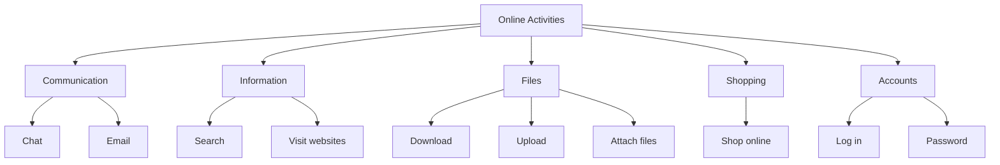

---

# 8. Phân biệt **search**, **search for**, **find** và **look up**

## **search**

= tìm kiếm, kiểm tra một nơi hoặc hệ thống.

**I searched the website.**

---

## **search for**

= tìm kiếm một thứ cụ thể.

**I'm searching for information.**

---

## **find**

= tìm thấy kết quả.

**I found the information.**

### So sánh

**I searched for the file, but I couldn't find it.**

— Tôi tìm tệp nhưng không tìm thấy.

---

## **look up**

= tra cứu thông tin.

**Look up the word online.**

— Tra từ đó trên mạng.

### Bảng so sánh

| Cụm            | Nghĩa             | Ví dụ                |
| -------------- | ----------------- | -------------------- |
| **search**     | tìm trong một nơi | Search the website.  |
| **search for** | tìm một thứ       | Search for the file. |
| **find**       | tìm thấy          | I found it.          |
| **look up**    | tra cứu           | Look it up online.   |

---

# 9. Phát âm trọng tâm

## 9.1. **Internet**

**Internet**
/ˈɪn.tə.net/

Trọng âm:

**IN**-ter-net

---

## 9.2. **online**

**online**
/ˌɒnˈlaɪn/

Trọng âm chính:

on-**LINE**

---

## 9.3. **information**

**information**
/ˌɪn.fəˈmeɪ.ʃən/

Trọng âm:

in-for-**MA**-tion

---

## 9.4. **download**

Động từ:

**download**
/ˌdaʊnˈləʊd/

Trọng âm thường rơi mạnh vào phần:

down-**LOAD**

---

## 9.5. **website**

**website**
/ˈweb.saɪt/

Trọng âm:

**WEB**-site

---

## 9.6. **password**

**password**
/ˈpɑːs.wɜːd/

Trọng âm:

**PASS**-word

---

## 9.7. **firewall**

**firewall**
/ˈfaɪə.wɔːl/

Trọng âm:

**FIRE**-wall

---

## 9.8. Nối âm trong hội thoại

### **Do you know how to ...?**

Luyện theo cụm:

`Do-you-know-how-to...?`

### **Could you send me the file?**

Luyện:

`Could-you-send-me-the-file?`

### **Have you ever shopped online?**

Luyện:

`Have-you-ever-shopped-online?`

---

# 10. Hội thoại thực tế — Real-Life Conversation

## Hội thoại chính — Trò chuyện về thói quen sử dụng Internet

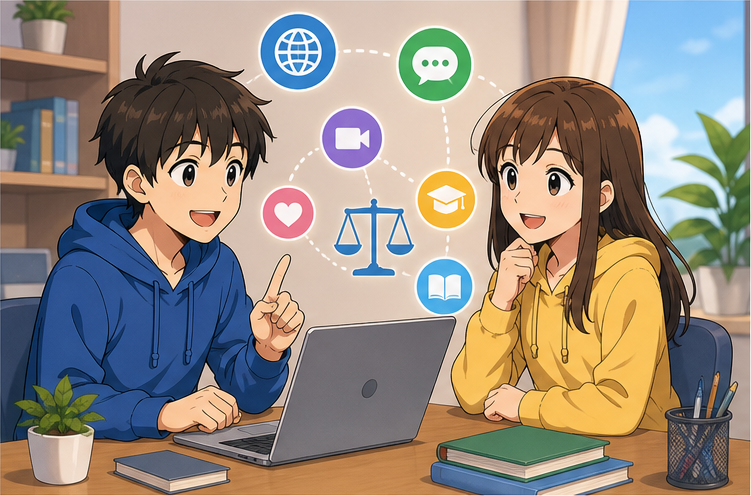

**Hugo:** Do you often use the Internet?
**Mai:** Yes, every day. I use it for studying, chatting and watching videos.
**Hugo:** Do you often chat online?
**Mai:** Yes. I have a few friends I talk to online. What about you?
**Hugo:** I mostly use the Internet to search for information.
**Mai:** Do you ever shop online?
**Hugo:** Sometimes. It's convenient, but I always check the website carefully first.
**Mai:** That's a good idea.
**Hugo:** What do you use the Internet for most?
**Mai:** Probably studying and talking to friends.

### Nội dung giao tiếp

```text
Hỏi thói quen
      ↓
Nói mục đích sử dụng
      ↓
Hỏi hoạt động cụ thể
      ↓
Chia sẻ trải nghiệm
      ↓
Đưa ra ý kiến
      ↓
Tiếp tục hội thoại
```

---

## Hội thoại 2 — Máy tính gặp sự cố

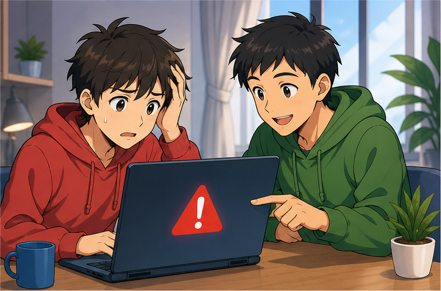

**Nam:** What's wrong?
**Linh:** My computer crashed while I was working.
**Nam:** Did you lose your file?
**Linh:** I think so. I can't find the latest version.
**Nam:** Did you save your work before it crashed?
**Linh:** Not recently. I forgot.
**Nam:** That's unfortunate. You should save your work more often.
**Linh:** You're right. I'll remember next time.
**Nam:** Let's see if we can recover the file.
**Linh:** Thanks. I really hope we can.

---

## Hội thoại 3 — Gửi tài liệu qua email


**Alex:** Could you send me the report?
**Mai:** Sure. Do you want me to email it to you?
**Alex:** Yes, please. Could you also attach the photos?
**Mai:** No problem. What's your email address?
**Alex:** I'll send it to you in a message.
**Mai:** Great. I'll send everything this afternoon.
**Alex:** Thanks. Could you also send me the link to the website?
**Mai:** Of course. I'll include it in the email.
**Alex:** Perfect. Thanks for your help.
**Mai:** You're welcome.

---

## Hội thoại 4 — Mua sắm trực tuyến


**Linh:** Have you ever bought clothes online?
**Nam:** Yes, many times.
**Linh:** Is it easy?
**Nam:** Usually. I search for what I want, check the price and read the product information.
**Linh:** Do you always pay online?
**Nam:** Not always. It depends on the website.
**Linh:** How do you know if a website is safe?
**Nam:** I check the website address and don't enter my password on unfamiliar pages.
**Linh:** That makes sense.
**Nam:** You should always be careful when shopping online.

---

# 11. Natural Expressions — Cách nói tự nhiên

| Cụm từ                             | Nghĩa                                   | Khi dùng        |
| ---------------------------------- | --------------------------------------- | --------------- |
| **Are you online?**                | Bạn đang online à?                      | Hỏi trạng thái  |
| **Do you use the Internet a lot?** | Bạn dùng Internet nhiều không?          | Hỏi thói quen   |
| **I chat online.**                 | Tôi trò chuyện trực tuyến.              | Hoạt động       |
| **I shop online.**                 | Tôi mua hàng online.                    | Hoạt động       |
| **Have you ever shopped online?**  | Bạn từng mua hàng online chưa?          | Hỏi trải nghiệm |
| **Search for it online.**          | Tìm nó trên mạng đi.                    | Hướng dẫn       |
| **Look it up online.**             | Tra nó trên mạng đi.                    | Tra cứu         |
| **I found it online.**             | Tôi tìm thấy nó trên mạng.              | Nói kết quả     |
| **Can you send me the link?**      | Gửi tôi đường dẫn được không?           | Chia sẻ         |
| **Could you email it to me?**      | Gửi nó qua email cho tôi được không?    | Yêu cầu         |
| **I've attached the file.**        | Tôi đã đính kèm tệp.                    | Email           |
| **Check the attachment.**          | Kiểm tra tệp đính kèm.                  | Email           |
| **Download the file.**             | Tải tệp xuống.                          | Tệp             |
| **Upload the photo.**              | Tải ảnh lên.                            | Tệp             |
| **Don't forget to save it.**       | Đừng quên lưu nó.                       | Nhắc nhở        |
| **My computer crashed.**           | Máy tính của tôi bị lỗi.                | Sự cố           |
| **I lost the file.**               | Tôi làm mất tệp.                        | Sự cố           |
| **I can't log in.**                | Tôi không đăng nhập được.               | Tài khoản       |
| **I forgot my password.**          | Tôi quên mật khẩu.                      | Tài khoản       |
| **Let's reset the password.**      | Hãy đặt lại mật khẩu.                   | Xử lý lỗi       |
| **Set up an account.**             | Thiết lập tài khoản.                    | Tài khoản       |
| **Be careful online.**             | Hãy cẩn thận trên mạng.                 | Bảo mật         |
| **Don't share your password.**     | Đừng chia sẻ mật khẩu.                  | Bảo mật         |
| **That's convenient.**             | Cái đó tiện.                            | Nhận xét        |
| **It saves a lot of time.**        | Nó tiết kiệm nhiều thời gian.           | Lợi ích         |
| **I spend too much time online.**  | Tôi dành quá nhiều thời gian trên mạng. | Hạn chế         |

---

# 12. Lỗi thường gặp — Common Mistakes

## Lỗi 1: Dùng **do shopping online**

Có thể hiểu, nhưng trong giao tiếp tự nhiên nên dùng:

✅ **I shop online.**

Thay vì:

△ **I do shopping online.**

---

## Lỗi 2: Dùng sai **information**

❌ **I need some informations.**

✅ **I need some information.**

✅ **I need more information.**

**information** thường không có dạng số nhiều.

---

## Lỗi 3: Quên **for** sau **search**

❌ **I'm searching a new phone.**

✅ **I'm searching for a new phone.**

### Cấu trúc

`search for + something`

---

## Lỗi 4: Nhầm **search** và **find**

❌ **I searched the information yesterday.**

Nếu muốn nói “tìm kiếm”:

✅ **I searched for the information yesterday.**

Nếu đã tìm thấy:

✅ **I found the information yesterday.**

---

## Lỗi 5: Nhầm **download from** và **upload to**

### Tải xuống

✅ **Download the file from the website.**

### Tải lên

✅ **Upload the file to the website.**

---

## Lỗi 6: Dùng sai sau **enjoy**

❌ **I enjoy to chat online.**

✅ **I enjoy chatting online.**

### Cấu trúc

`enjoy + V-ing`

---

## Lỗi 7: Dùng **on Internet**

❌ **I found it on Internet.**

✅ **I found it on the Internet.**

Hoặc tự nhiên hơn:

✅ **I found it online.**

---

## Lỗi 8: Nói **my computer died** trong giao tiếp thông thường

Có thể dùng thân mật, nhưng khi mô tả lỗi kỹ thuật rõ hơn:

✅ **My computer crashed.**

✅ **My computer stopped working.**

---

## Lỗi 9: Dùng sai **save**

❌ **I saved my file in the Internet.**

Nếu lưu trên máy:

✅ **I saved the file on my computer.**

Nếu lưu trên dịch vụ trực tuyến:

✅ **I saved the file online.**

✅ **I saved the file to cloud storage.**

---

## Lỗi 10: Nhầm **file** và **folder**

### **file**

= một tệp.

**Open the file.**

### **folder**

= thư mục chứa các tệp.

**Open the folder.**

---

## Lỗi 11: Nhầm **log in** và **sign up**

### **sign up**

= đăng ký tài khoản mới.

**I signed up yesterday.**

### **log in**

= đăng nhập vào tài khoản đã có.

**I can't log in.**

---

## Lỗi 12: Dùng sai **password**

❌ **Enter to your password.**

✅ **Enter your password.**

Hoặc:

✅ **Type in your password.**

---

## Lỗi 13: Quên đính kèm tệp

Nếu nói:

**I've attached the file.**

hãy chắc chắn tệp thực sự được đính kèm.

Một câu rất hữu ích:

✅ **Sorry, I forgot to attach the file.**

---

## Lỗi 14: Chia sẻ mật khẩu

Không nên nói:

❌ **I'll send you my password.**

Trong tình huống thông thường, nên:

✅ **I'll reset my password.**

✅ **I'll send you the file instead.**

> Không nên chia sẻ mật khẩu cá nhân với người khác.

---

# 13. Luyện tập có hướng dẫn

## Bài 1 — Nối từ với nghĩa

1. download
2. password
3. firewall
4. website
5. attachment
6. search for

A. mật khẩu
B. website
C. tải xuống
D. tìm kiếm
E. tệp đính kèm
F. tường lửa

<details>
<summary>Đáp án</summary>

1–C
2–A
3–F
4–B
5–E
6–D

</details>

---

## Bài 2 — Điền từ vào chỗ trống

Dùng:

`online` · `file` · `password` · `download` · `information`

1. I often shop ________.
2. Please send me the ________.
3. Don't share your ________.
4. Where can I ________ this document?
5. I need more ________.

<details>
<summary>Đáp án</summary>

1. online
2. file
3. password
4. download
5. information

</details>

---

## Bài 3 — Chọn câu đúng

### 1. Bạn muốn nói mình thường mua hàng trực tuyến.

* A. I often shop online.
* B. I often shop in online.
* C. I often shopping online.

**Đáp án:** A

---

### 2. Bạn muốn tìm thông tin.

* A. I'm searching information.
* B. I'm searching for information.
* C. I'm search for information.

**Đáp án:** B

---

### 3. Bạn muốn nói máy tính vừa gặp lỗi.

* A. My computer crashed.
* B. My computer crash.
* C. My computer crashing yesterday.

**Đáp án:** A

---

### 4. Bạn muốn nhờ gửi tệp qua email.

* A. Could you email me the file?
* B. Could you email the file me?
* C. Could you emailing me the file?

**Đáp án:** A

---

## Bài 4 — **download** hay **upload**

1. ________ the document from the website to your computer.
2. ________ your profile photo to the website.
3. I ________ the PDF from the Internet yesterday.
4. Please ________ the completed assignment to the system.

<details>
<summary>Đáp án</summary>

1. Download
2. Upload
3. downloaded
4. upload

</details>

---

## Bài 5 — **search for** hay **find**

1. I'm ________ my missing document.
2. I finally ________ the document.
3. Can you ________ some information about the course?
4. Where did you ________ this website?

<details>
<summary>Đáp án</summary>

1. searching for
2. found
3. search for
4. find

</details>

---

## Bài 6 — Hoàn thành hội thoại

**A:** Could you send me the ________?
**B:** Sure. Do you want me to email it to you?
**A:** Yes, please. Could you also send me the ________ to the website?
**B:** No problem. I'll include it in the email.
**A:** Great. Don't forget the ________.
**B:** Don't worry. I've already attached the file.
**A:** Perfect. I'll ________ it when I get the email.
**B:** Okay. I'll send it now.

<details>
<summary>Đáp án gợi ý</summary>

1. file
2. link
3. attachment
4. download

</details>

---

# 14. Speaking Challenge — Thử thách nói

## Nhiệm vụ 1 — Đọc mẫu câu

Đọc các câu sau thành tiếng:

* **Do you know how to use a computer?**
* **Do you often use the Internet?**
* **I often chat online.**
* **Have you ever shopped online?**
* **Search for it online.**
* **Could you email me the file?**
* **Can you send me the link?**
* **Don't forget to save your work.**
* **My computer crashed.**
* **I forgot my password.**

Đọc mỗi câu hai lần:

* lần 1 chậm và rõ;
* lần 2 với tốc độ hội thoại tự nhiên.

---

## Nhiệm vụ 2 — Nói về thói quen sử dụng Internet

Nói ít nhất **5 câu** về bản thân.

Có thể trả lời:

1. Bạn sử dụng Internet bao lâu mỗi ngày?
2. Bạn thường làm gì trên Internet?
3. Bạn có mua sắm trực tuyến không?
4. Bạn có thường gửi email không?
5. Bạn thường tìm kiếm loại thông tin nào?

Ví dụ:

> **I use the Internet every day. I usually search for information, watch videos and chat with my friends. I sometimes shop online. I also use email for school and work.**

---

## Nhiệm vụ 3 — Giải thích một sự cố máy tính

Tình huống:

> Máy tính của bạn gặp lỗi và bạn không tìm thấy tệp vừa làm.

Phải sử dụng ít nhất:

* **My computer crashed.**
* **I can't find the file.**
* **I forgot to save it.**
* **What should I do?**
* **Can you help me?**

---

## Nhiệm vụ 4 — Hội thoại 8 lượt

Tạo một đoạn hội thoại có ít nhất:

* 1 câu hỏi về thói quen Internet;
* 1 hoạt động trực tuyến;
* 1 yêu cầu gửi tệp;
* 1 câu nói về email;
* 1 câu nói về download hoặc upload;
* 1 câu về password;
* 1 lời khuyên về bảo mật;
* 1 câu kết thúc.

---

## Nhiệm vụ 5 — Ghi âm

Ghi âm từ **45–60 giây**, sau đó kiểm tra:

* [ ] Tôi có thể nói về các hoạt động trực tuyến.
* [ ] Tôi dùng đúng **shop online**.
* [ ] Tôi dùng đúng **search for**.
* [ ] Tôi phân biệt **search for** và **find**.
* [ ] Tôi phân biệt **download** và **upload**.
* [ ] Tôi dùng đúng **enjoy + V-ing**.
* [ ] Tôi có thể nói về email và attachment.
* [ ] Tôi có thể nói về password.
* [ ] Tôi có thể giải thích một sự cố máy tính đơn giản.
* [ ] Tôi có thể duy trì hội thoại ít nhất 45 giây.

---

# 15. Practice Mission — Nhiệm vụ thực tế

Trong hôm nay, hãy tạo một cuộc hội thoại theo công thức:

> **Online task → Request → Share information → Problem → Solution → Confirm**

Ví dụ:

> **Could you send me the report?**
> ↓
> **Sure. I'll email it to you.**
> ↓
> **Could you attach the photos too?**
> ↓
> **No problem.**
> ↓
> **I can't open the attachment.**
> ↓
> **I'll upload it and send you a link instead.**
> ↓
> **Great. Thanks.**

Sau đó viết hoặc nói một đoạn hội thoại **8–10 lượt** cho một trong các tình huống:

* gửi tài liệu qua email;
* chia sẻ đường dẫn website;
* mua hàng trực tuyến;
* không đăng nhập được;
* quên mật khẩu;
* mất tệp sau khi máy tính gặp lỗi;
* tải một tài liệu xuống;
* tải bài tập lên hệ thống;
* tìm kiếm thông tin trực tuyến.

---

# 16. Tự đánh giá cuối bài

Đánh dấu khi bạn có thể thực hiện mà không nhìn bài:

* [ ] Tôi có thể hỏi **Do you know how to use a computer?**
* [ ] Tôi có thể hỏi về thói quen sử dụng Internet.
* [ ] Tôi có thể nói **I chat online.**
* [ ] Tôi có thể nói **I shop online.**
* [ ] Tôi có thể hỏi **Have you ever shopped online?**
* [ ] Tôi có thể dùng **search for**.
* [ ] Tôi có thể dùng **find**.
* [ ] Tôi có thể nói về website.
* [ ] Tôi có thể gửi hoặc yêu cầu một **link**.
* [ ] Tôi có thể nói về **file**.
* [ ] Tôi có thể dùng **save**.
* [ ] Tôi phân biệt **download** và **upload**.
* [ ] Tôi có thể nói về email.
* [ ] Tôi biết **attachment** là gì.
* [ ] Tôi có thể nói về **account**.
* [ ] Tôi có thể nói về **password**.
* [ ] Tôi hiểu **set up**.
* [ ] Tôi hiểu **firewall** ở mức cơ bản.
* [ ] Tôi có thể nói **My computer crashed.**
* [ ] Tôi có thể duy trì hội thoại ít nhất 45 giây.

---

# 17. Câu hỏi mở cuối bài

**Imagine you have an important assignment on your computer. Your computer suddenly crashes before you send it, and you are not sure whether the latest file was saved. How would you explain the problem to a friend, ask for help, recover your work, and make sure it does not happen again?**

*Hãy tưởng tượng bạn có một bài tập quan trọng trên máy tính. Máy tính đột nhiên gặp lỗi trước khi bạn gửi bài và bạn không chắc phiên bản mới nhất đã được lưu hay chưa. Bạn sẽ giải thích vấn đề, nhờ bạn bè giúp, tìm cách khôi phục công việc và tránh để sự việc xảy ra lần nữa như thế nào?*

---

# 18. Ghi chú dành cho giảng viên

* **Module:** 02 — Everyday Conversations / Những cuộc hội thoại thường ngày
* **Chủ điểm:** Internet & Online Communication
* **Thời lượng video:** 8–12 phút
* **Luyện nói:** 5–10 phút

### Trọng tâm từ vựng

* Internet
* online
* information
* chat online
* shop online
* website
* browser
* search for
* file
* save
* download
* upload
* email
* attachment
* link
* password
* account
* set up
* firewall
* crash
* lost
* fascinated by
* waste time

### Trọng tâm cấu trúc

* **Do you know how to use a computer?**
* **Are you online?**
* **Do you often use the Internet?**
* **I often chat online.**
* **I often shop online.**
* **Have you ever shopped online?**
* **Search for ...**
* **Look it up online.**
* **You can find more information online.**
* **download something from ...**
* **upload something to ...**
* **Could you email me the file?**
* **Could you send me the link?**
* **I've attached the file.**
* **Don't forget to save your work.**
* **My computer crashed.**
* **I lost the file.**
* **I can't find the file.**
* **Let's set up a password.**
* **Enter your password.**
* **Have you set up a firewall?**
* **I enjoy + V-ing.**
* **I'm really into + noun / V-ing.**

### Trọng tâm phát âm

* **Internet**
* **online**
* **information**
* **website**
* **download**
* **upload**
* **password**
* **firewall**
* **attachment**

### Lưu ý ngôn ngữ

* **shop online** tự nhiên hơn **do shopping online** trong giao tiếp thông thường.
* **information** thường là danh từ không đếm được:

  * **some information**
  * **more information**
* Dùng:

  * **search for something**
  * **find something**
* **search for** mô tả quá trình tìm.
* **find** mô tả kết quả tìm thấy.
* **look up** thường dùng khi tra cứu thông tin.
* **download something from somewhere**:

  * **download a file from a website**
* **upload something to somewhere**:

  * **upload a file to a website**
* Sau **enjoy** dùng **V-ing**:

  * **I enjoy chatting online.**
* Dùng:

  * **on the Internet**
  * **online**
* **My computer crashed** là cách tự nhiên để nói máy tính hoặc hệ thống bị lỗi và ngừng hoạt động.
* **save** = lưu dữ liệu.
* **file** = tệp.
* **folder** = thư mục.
* **sign up** = đăng ký.
* **log in** = đăng nhập.
* **log out** = đăng xuất.
* **attachment** = tệp được gửi kèm email.
* Không nên chia sẻ mật khẩu cá nhân.
* Với người học A1–A2, nội dung an toàn trực tuyến nên tập trung vào:

  * mật khẩu;
  * website lạ;
  * tệp đính kèm;
  * lưu dữ liệu;
  * đăng xuất khỏi thiết bị dùng chung.

### Hoạt động gợi ý — Online Habits Survey

Chia lớp thành cặp.

Mỗi người hỏi bạn cùng cặp:

> **How often do you use the Internet?**

> **What do you usually do online?**

> **Do you often chat online?**

> **Have you ever shopped online?**

> **What kind of information do you search for?**

> **Do you use email often?**

Sau đó giới thiệu lại bạn cùng cặp bằng 4–5 câu.

Ví dụ:

> **Mai uses the Internet every day. She usually searches for information, watches videos and chats with her friends. She sometimes shops online and uses email for school.**

### Role-play mẫu — Gửi tài liệu

**Người A nhận:**

> Bạn cần một báo cáo và ba ảnh từ người B.

**Người B nhận:**

> Bạn có báo cáo và ảnh trên máy tính.

Người A phải sử dụng ít nhất:

* **Could you send me the report?**
* **Could you email it to me?**
* **Could you attach the photos?**
* **Can you send me the link too?**
* **Thanks.**

Người B phải sử dụng ít nhất:

* **Sure.**
* **I'll email it to you.**
* **I'll attach the files.**
* **I'll send you the link.**
* **No problem.**

### Role-play mẫu — Máy tính gặp lỗi

**Người A nhận:**

> Máy tính của bạn bị lỗi khi đang làm bài. Bạn chưa lưu trong khoảng 30 phút.

**Người B nhận:**

> Bạn đang giúp người A kiểm tra xem có thể tìm lại tệp hay không.

Người A phải sử dụng ít nhất:

* **My computer crashed.**
* **I can't find the file.**
* **I forgot to save my work.**
* **Can you help me?**
* **What should I do?**

Người B phải sử dụng ít nhất:

* **Don't worry.**
* **Let's have a look.**
* **Search for the file.**
* **You should save your work regularly.**
* **Let's see if we can recover it.**

### Role-play mẫu — An toàn tài khoản

**Người A nhận:**

> Bạn không đăng nhập được và nghĩ rằng mình đã quên mật khẩu.

**Người B nhận:**

> Bạn đang hướng dẫn người A xử lý vấn đề.

Hai người phải sử dụng ít nhất:

* **I can't log in.**
* **I forgot my password.**
* **Let's reset it.**
* **Create a new password.**
* **Don't share your password.**
* **Can you log in now?**

Kết thúc bằng:

> **Yes, it works now. Thanks for your help.**

---
