# LESSON 13 — CHUẨN BỊ LÊN CHUYẾN BAY

> **Module 03 — Travel Ready / Tiếng Anh cho những chuyến đi**
> **Chủ đề:** Airport Check-in & Boarding — Làm thủ tục, hành lý, thẻ lên máy bay và cửa khởi hành
> **Trình độ gợi ý:** A1–A2
> **Thời lượng:** 8–12 phút học bài + 5–10 phút luyện nói

---

## 1. Tình huống thực tế

Khi đi máy bay, trước khi lên chuyến bay bạn thường phải thực hiện nhiều bước tại sân bay.

Bạn có thể cần tiếng Anh để:

* tìm quầy làm thủ tục;
* hỏi về chuyến bay;
* xuất trình vé và hộ chiếu;
* làm thủ tục check-in;
* gửi hành lý ký gửi;
* hỏi về giới hạn hành lý;
* hỏi xem hành lý có bị quá cân không;
* hỏi một túi có được mang lên máy bay hay không;
* nhận boarding pass;
* hỏi giờ khởi hành;
* hỏi giờ bắt đầu boarding;
* tìm cửa khởi hành;
* hỏi nhân viên tại quầy thông tin;
* xác nhận số hiệu chuyến bay;
* xử lý vấn đề liên quan đến hành lý;
* hỏi hướng đi trong sân bay.

Bạn cần biết cách nói những câu như:

* **I'd like to check in, please.**
* **Could you tell me where I can check in for flight VN100?**
* **Is this the counter for flight SC204 to Thailand?**
* **May I see your ticket and passport?**
* **Do you have any luggage to check in?**
* **How many pieces of baggage do you want to check in?**
* **Can I take this bag as a carry-on?**
* **Is my suitcase overweight?**
* **What's the baggage allowance?**
* **When will the flight begin boarding?**
* **How do I get to Gate 8 from here?**
* **What time does the flight depart?**
* **Here's your boarding pass.**

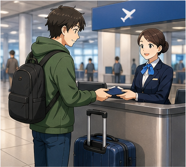

---

## 2. Mục tiêu bài học

Sau bài học, người học có thể:

1. Hiểu và sử dụng **check in** trong bối cảnh sân bay.
2. Hỏi vị trí quầy check-in.
3. Hỏi về một chuyến bay cụ thể.
4. Nói và hiểu số hiệu chuyến bay.
5. Xuất trình vé và hộ chiếu.
6. Nói về hành lý.
7. Phân biệt hành lý ký gửi và hành lý xách tay.
8. Hỏi về số kiện hành lý.
9. Hỏi về giới hạn hành lý.
10. Hiểu và sử dụng **overweight**.
11. Hỏi xem một túi có thể mang lên máy bay hay không.
12. Hiểu **boarding pass**.
13. Hỏi giờ bắt đầu boarding.
14. Hỏi giờ máy bay khởi hành.
15. Tìm đúng cửa khởi hành.
16. Hỏi nhân viên tại quầy thông tin.
17. Dùng các mẫu câu lịch sự như **Could you tell me...?**
18. Duy trì đoạn hội thoại 6–8 lượt tại quầy check-in.

---

## 3. Sơ đồ giao tiếp

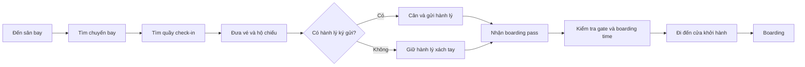

### Mẫu đơn giản

`I'd like to check in, please.`
→ `May I see your passport and ticket?`
→ `Here you are.`
→ `Do you have any luggage to check in?`
→ `Just one suitcase.`
→ `Here's your boarding pass.`
→ `Thank you.`

---

# 4. Từ vựng trọng tâm — Core Vocabulary

## 4.1. **check in** /ˌtʃek ˈɪn/

**Nghĩa:** làm thủ tục trước chuyến bay

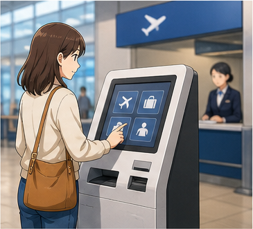

**Ví dụ:**

* **I'd like to check in, please.**
  — Tôi muốn làm thủ tục check-in.

* **Where can I check in for flight VN100?**
  — Tôi có thể làm thủ tục cho chuyến VN100 ở đâu?

> **check in** là động từ.
> **check-in** có thể được dùng như danh từ hoặc tính từ: **check-in counter**.

---

## 4.2. **flight** /flaɪt/

**Nghĩa:** chuyến bay

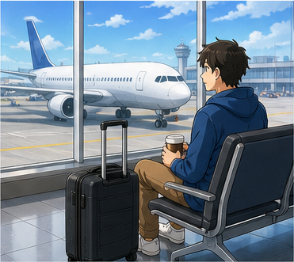

**Ví dụ:**

* **What time is your flight?**
  — Chuyến bay của bạn lúc mấy giờ?

* **My flight departs at 9 a.m.**
  — Chuyến bay của tôi khởi hành lúc 9 giờ sáng.

---

## 4.3. **flight number** /ˈflaɪt ˌnʌm.bər/

**Nghĩa:** số hiệu chuyến bay


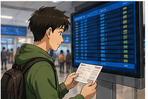
**Ví dụ:**

* **What's your flight number?**
  — Số hiệu chuyến bay của bạn là gì?

* **My flight number is VN100.**
  — Số hiệu chuyến bay của tôi là VN100.

---

## 4.4. **ticket** /ˈtɪk.ɪt/

**Nghĩa:** vé

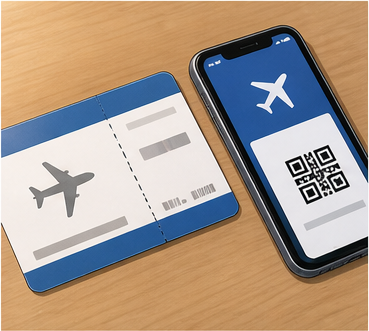

**Ví dụ:**

* **May I see your ticket?**
  — Tôi có thể xem vé của bạn được không?

* **Here's my ticket.**
  — Đây là vé của tôi.

---

## 4.5. **passport** /ˈpɑːs.pɔːt/

**Nghĩa:** hộ chiếu

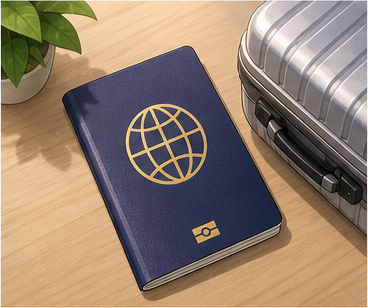

**Ví dụ:**

* **May I see your passport?**
  — Tôi có thể xem hộ chiếu của bạn được không?

* **Here are our passports.**
  — Đây là hộ chiếu của chúng tôi.

---

## 4.6. **luggage** /ˈlʌɡ.ɪdʒ/

**Nghĩa:** hành lý

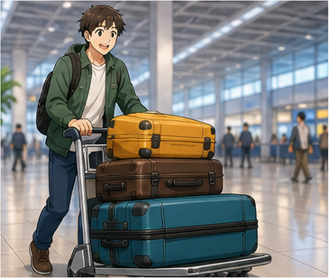

**Ví dụ:**

* **Do you have any luggage?**
  — Bạn có hành lý không?

* **I only have one suitcase.**
  — Tôi chỉ có một vali.

> **luggage** thường là danh từ không đếm được.

Không nói:

❌ **two luggages**

Nên nói:

✅ **two pieces of luggage**

---

## 4.7. **baggage** /ˈbæɡ.ɪdʒ/

**Nghĩa:** hành lý


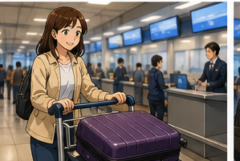
**Ví dụ:**

* **How many pieces of baggage do you have?**
  — Bạn có bao nhiêu kiện hành lý?

* **Your baggage is within the allowance.**
  — Hành lý của bạn nằm trong giới hạn cho phép.

> **baggage** và **luggage** đều thường là danh từ không đếm được.

---

## 4.8. **suitcase** /ˈsuːt.keɪs/

**Nghĩa:** vali

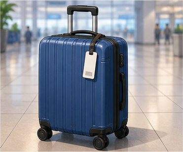

**Ví dụ:**

* **I have one suitcase.**
  — Tôi có một vali.

* **This suitcase is quite heavy.**
  — Vali này khá nặng.

---

## 4.9. **carry-on** /ˈkær.i ɒn/

**Nghĩa:** hành lý xách tay

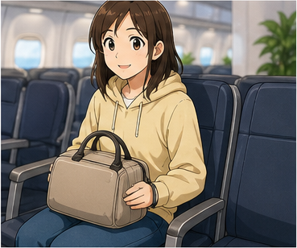

**Ví dụ:**

* **Can I take this bag as a carry-on?**
  — Tôi có thể mang túi này lên máy bay dưới dạng hành lý xách tay không?

* **I only have a carry-on.**
  — Tôi chỉ có hành lý xách tay.

---

## 4.10. **checked baggage**

**Nghĩa:** hành lý ký gửi

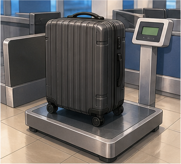

**Ví dụ:**

* **I have one piece of checked baggage.**
  — Tôi có một kiện hành lý ký gửi.

* **Where do I drop off my checked baggage?**
  — Tôi gửi hành lý ký gửi ở đâu?

---

## 4.11. **counter** /ˈkaʊn.tər/

**Nghĩa:** quầy

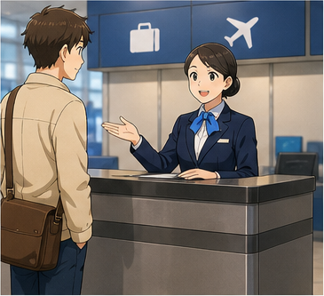

**Ví dụ:**

* **Is this the counter for flight SC204?**
  — Đây có phải quầy cho chuyến SC204 không?

* **Please go to Counter 12.**
  — Vui lòng đến quầy số 12.

---

## 4.12. **check-in counter**

**Nghĩa:** quầy làm thủ tục


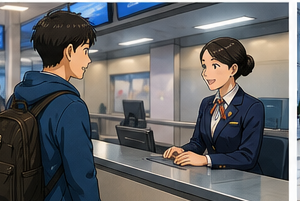
**Ví dụ:**

* **Where is the check-in counter?**
  — Quầy check-in ở đâu?

* **The check-in counter is over there.**
  — Quầy làm thủ tục ở đằng kia.

---

## 4.13. **information desk**

**Nghĩa:** quầy thông tin

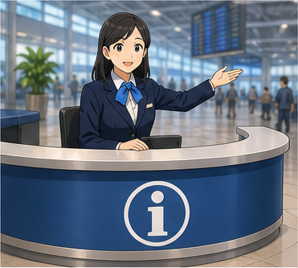

**Ví dụ:**

* **You can ask at the information desk.**
  — Bạn có thể hỏi tại quầy thông tin.

* **Where is the information desk?**
  — Quầy thông tin ở đâu?

---

## 4.14. **boarding pass** /ˈbɔː.dɪŋ pɑːs/

**Nghĩa:** thẻ lên máy bay

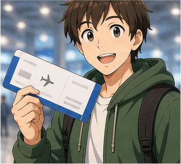

**Ví dụ:**

* **Here's your boarding pass.**
  — Đây là thẻ lên máy bay của bạn.

* **Please keep your boarding pass with you.**
  — Hãy giữ thẻ lên máy bay bên mình.

---

## 4.15. **gate** /ɡeɪt/

**Nghĩa:** cửa khởi hành / cửa lên máy bay

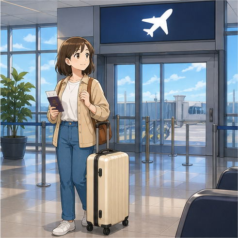

**Ví dụ:**

* **Which gate should I go to?**
  — Tôi nên đến cửa nào?

* **Your flight leaves from Gate 8.**
  — Chuyến bay của bạn khởi hành từ cửa số 8.

---

## 4.16. **depart** /dɪˈpɑːt/

**Nghĩa:** khởi hành

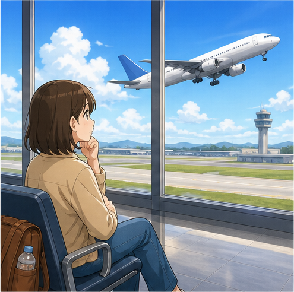

**Ví dụ:**

* **Flight 127 departs at 9 a.m.**
  — Chuyến bay 127 khởi hành lúc 9 giờ sáng.

* **What time does the flight depart?**
  — Chuyến bay khởi hành lúc mấy giờ?

---

## 4.17. **departure** /dɪˈpɑː.tʃər/

**Nghĩa:** sự khởi hành


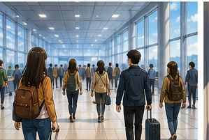
**Ví dụ:**

* **What's the departure time?**
  — Giờ khởi hành là mấy giờ?

* **Please check the departure board.**
  — Hãy kiểm tra bảng thông tin khởi hành.

---

## 4.18. **board** /bɔːd/

**Nghĩa:** lên máy bay


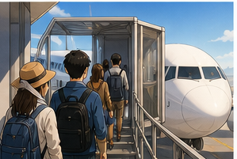
**Ví dụ:**

* **Passengers are now boarding the plane.**
  — Hành khách hiện đang lên máy bay.

* **When can we board?**
  — Khi nào chúng tôi có thể lên máy bay?

---

## 4.19. **boarding** /ˈbɔː.dɪŋ/

**Nghĩa:** việc hành khách lên máy bay

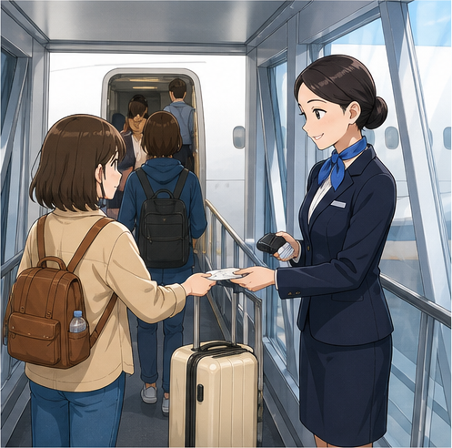

**Ví dụ:**

* **When will boarding begin?**
  — Khi nào bắt đầu lên máy bay?

* **Boarding begins at 8:30.**
  — Việc lên máy bay bắt đầu lúc 8 giờ 30.

---

## 4.20. **overweight** /ˌəʊ.vəˈweɪt/

**Nghĩa:** quá cân

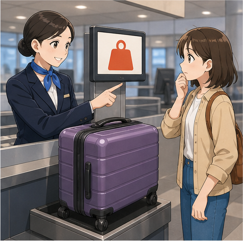

**Ví dụ:**

* **Your suitcase is overweight.**
  — Vali của bạn bị quá cân.

* **Is my bag overweight?**
  — Túi của tôi có bị quá cân không?

---

## 4.21. **baggage allowance**

**Nghĩa:** giới hạn hành lý được phép mang theo

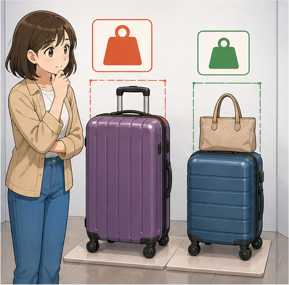

**Ví dụ:**

* **What's the baggage allowance?**
  — Giới hạn hành lý là bao nhiêu?

* **The baggage allowance is 20 kilograms.**
  — Giới hạn hành lý là 20 kg.

---

## 4.22. **weigh** /weɪ/

**Nghĩa:** cân; có trọng lượng


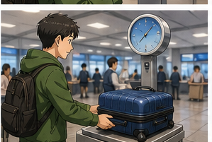
**Ví dụ:**

* **We need to weigh your suitcase.**
  — Chúng tôi cần cân vali của bạn.

* **How much does this bag weigh?**
  — Túi này nặng bao nhiêu?

---

## 4.23. **destination** /ˌdes.tɪˈneɪ.ʃən/

**Nghĩa:** điểm đến


**Ví dụ:**

* **What's your final destination?**
  — Điểm đến cuối cùng của bạn là đâu?

* **Tokyo is my final destination.**
  — Tokyo là điểm đến cuối cùng của tôi.

---

# 5. Bảng tổng hợp từ vựng

| Từ / cụm từ           | IPA               | Nghĩa tiếng Việt   | Ví dụ ngắn                   |
| --------------------- | ----------------- | ------------------ | ---------------------------- |
| **check in**          | /ˌtʃek ˈɪn/       | làm thủ tục        | check in for a flight        |
| **flight**            | /flaɪt/           | chuyến bay         | flight VN100                 |
| **flight number**     | —                 | số hiệu chuyến bay | What's your flight number?   |
| **ticket**            | /ˈtɪk.ɪt/         | vé                 | show your ticket             |
| **passport**          | /ˈpɑːs.pɔːt/      | hộ chiếu           | show your passport           |
| **luggage**           | /ˈlʌɡ.ɪdʒ/        | hành lý            | have some luggage            |
| **baggage**           | /ˈbæɡ.ɪdʒ/        | hành lý            | checked baggage              |
| **suitcase**          | /ˈsuːt.keɪs/      | vali               | one suitcase                 |
| **carry-on**          | /ˈkær.i ɒn/       | hành lý xách tay   | take it as a carry-on        |
| **checked baggage**   | —                 | hành lý ký gửi     | one piece of checked baggage |
| **counter**           | /ˈkaʊn.tər/       | quầy               | check-in counter             |
| **information desk**  | —                 | quầy thông tin     | ask at the information desk  |
| **boarding pass**     | /ˈbɔː.dɪŋ pɑːs/   | thẻ lên máy bay    | Here's your boarding pass.   |
| **gate**              | /ɡeɪt/            | cửa lên máy bay    | Gate 8                       |
| **depart**            | /dɪˈpɑːt/         | khởi hành          | departs at 9 a.m.            |
| **departure**         | /dɪˈpɑː.tʃər/     | sự khởi hành       | departure time               |
| **board**             | /bɔːd/            | lên máy bay        | board the plane              |
| **boarding**          | /ˈbɔː.dɪŋ/        | việc lên máy bay   | boarding begins              |
| **overweight**        | /ˌəʊ.vəˈweɪt/     | quá cân            | baggage is overweight        |
| **baggage allowance** | —                 | giới hạn hành lý   | 20 kg allowance              |
| **weigh**             | /weɪ/             | cân / nặng         | weigh the suitcase           |
| **destination**       | /ˌdes.tɪˈneɪ.ʃən/ | điểm đến           | final destination            |

---

# 6. Mẫu câu giao tiếp — Useful Structures

## 6.1. Yêu cầu làm thủ tục

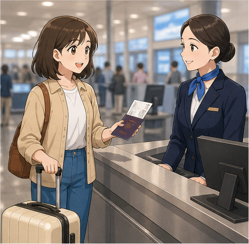

### **I'd like to check in, please.**

— Tôi muốn làm thủ tục check-in.

### Cấu trúc

`I'd like to + V, please.`

Ví dụ:

* **I'd like to check in, please.**
* **I'd like to change my seat, please.**
* **I'd like to check this suitcase, please.**

---

## 6.2. Hỏi vị trí quầy làm thủ tục

### **Could you tell me where I can check in for flight VN100?**

— Bạn có thể cho tôi biết tôi có thể làm thủ tục cho chuyến VN100 ở đâu không?

### Cấu trúc

`Could you tell me where + subject + can + V?`

Ví dụ:

* **Could you tell me where I can check in?**
* **Could you tell me where Gate 8 is?**
* **Could you tell me where the information desk is?**

---

## 6.3. Xác nhận quầy check-in

### **Is this the counter for flight SC204 to Thailand?**

— Đây có phải quầy cho chuyến SC204 đi Thái Lan không?

Cách khác:

* **Is this the check-in counter for VN100?**
* **Am I at the right counter?**

---

## 6.4. Hỏi về chuyến bay

### **I'd like to know whether there is a flight to New York.**

— Tôi muốn biết liệu có chuyến bay tới New York hay không.

Ở trình độ A1–A2 có thể dùng câu đơn giản hơn:

### **Is there a flight to New York?**

---

## 6.5. Yêu cầu xem vé và hộ chiếu

### **May I see your ticket and passport?**

— Tôi có thể xem vé và hộ chiếu của bạn được không?

Cách khác:

* **Can I see your passport, please?**
* **May I see your boarding documents?**

### Phản hồi

* **Here you are.**
* **Sure. Here they are.**
* **Of course.**

---

## 6.6. Hỏi về hành lý ký gửi

### **Do you have any luggage to check in?**

— Bạn có hành lý cần ký gửi không?

Trả lời:

* **Yes, one suitcase.**
* **Yes, I have two bags.**
* **No, just this carry-on.**
* **No, I don't.**

---

## 6.7. Hỏi số kiện hành lý

### **How many pieces of baggage do you want to check in?**

— Bạn muốn ký gửi bao nhiêu kiện hành lý?

Trả lời:

* **Just one.**
* **Two suitcases.**
* **I only have one bag.**

---

## 6.8. Hỏi về hành lý xách tay

### **Can I take this bag as a carry-on?**

— Tôi có thể mang túi này lên máy bay dưới dạng hành lý xách tay không?

Cách khác:

* **Can I take this on the plane?**
* **Is this bag small enough for carry-on?**

---

## 6.9. Hỏi giới hạn hành lý

### **What's the baggage allowance?**

— Giới hạn hành lý được phép là bao nhiêu?

Cách khác:

* **How much baggage can I check in?**
* **What's the weight limit for checked baggage?**

---

## 6.10. Hỏi hành lý có quá cân không

### **Is my suitcase overweight?**

— Vali của tôi có bị quá cân không?

Phản hồi:

* **No, it's within the limit.**
* **Yes, it's two kilograms overweight.**

---

## 6.11. Hỏi giờ khởi hành

### **What time does the flight depart?**

— Chuyến bay khởi hành lúc mấy giờ?

Ví dụ:

**Flight 127 departs at 9 a.m.**

---

## 6.12. Hỏi giờ boarding

### **When will the flight begin boarding?**

— Khi nào chuyến bay bắt đầu cho hành khách lên máy bay?

Tự nhiên hơn trong nhiều tình huống:

### **When does boarding begin?**

Hoặc:

### **What time does boarding start?**

---

## 6.13. Hỏi cửa khởi hành

### **Which gate should I go to?**

— Tôi nên đến cửa nào?

### **What gate is the flight leaving from?**

— Chuyến bay khởi hành từ cửa nào?

---

## 6.14. Hỏi đường đến cửa khởi hành

### **How do I get to Gate 8 from here?**

— Tôi đi đến cửa số 8 từ đây như thế nào?

Cách khác:

* **Where is Gate 8?**
* **Could you show me the way to Gate 8?**
* **Is Gate 8 far from here?**

---

## 6.15. Trao boarding pass

### **Here's your boarding pass.**

— Đây là thẻ lên máy bay của bạn.

Câu tiếp theo thường gặp:

* **Your gate is Gate 12.**
* **Boarding begins at 8:30.**
* **Please be at the gate 30 minutes before departure.**

---

## 6.16. Thông báo chuyến bay sắp được gọi

### **Your flight will be called shortly.**

— Chuyến bay của bạn sẽ sớm được gọi.

Hoặc:

### **Boarding will begin in about ten minutes.**

— Việc lên máy bay sẽ bắt đầu trong khoảng 10 phút nữa.

---

## 6.17. Đưa giấy tờ

### **Here you are.**

— Đây ạ.

Nếu có nhiều đồ:

### **Here they are.**

Ví dụ:

**Staff:** May I see your passports?
**Passenger:** Sure. **Here they are.**

---

## 6.18. Hỏi điểm đến

### **What's your final destination?**

— Điểm đến cuối cùng của bạn là đâu?

Trả lời:

* **Tokyo.**
* **My final destination is New York.**
* **I'm flying to Bangkok.**

---

# 7. Quy trình làm thủ tục tại sân bay

| Bước                 | Tiếng Anh                     | Ví dụ                             |
| -------------------- | ----------------------------- | --------------------------------- |
| Tìm chuyến bay       | **find your flight**          | I need to find flight VN100.      |
| Tìm quầy             | **find the check-in counter** | Where is the check-in counter?    |
| Làm thủ tục          | **check in**                  | I'd like to check in.             |
| Đưa hộ chiếu         | **show your passport**        | Here's my passport.               |
| Cân hành lý          | **weigh your baggage**        | Please put your bag on the scale. |
| Ký gửi hành lý       | **check your baggage**        | I'd like to check this suitcase.  |
| Nhận thẻ lên máy bay | **get your boarding pass**    | Here's your boarding pass.        |
| Kiểm tra gate        | **check your gate**           | Your gate is Gate 8.              |
| Đi đến gate          | **go to the gate**            | How do I get to Gate 8?           |
| Lên máy bay          | **board the plane**           | Boarding starts at 8:30.          |

### Sơ đồ

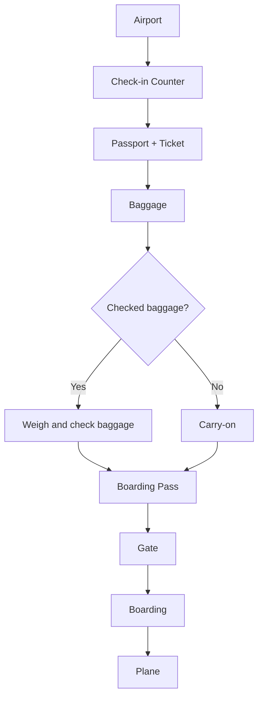

---

# 8. Phân biệt **luggage**, **baggage**, **suitcase** và **carry-on**

## **luggage**

= hành lý nói chung.

**I have some luggage.**

Không dùng:

❌ **two luggages**

Dùng:

✅ **two pieces of luggage**

---

## **baggage**

= hành lý, thường gặp nhiều trong ngữ cảnh sân bay.

**Do you have any baggage to check?**

---

## **suitcase**

= một chiếc vali cụ thể.

**I have one suitcase.**

Có thể đếm:

* one suitcase
* two suitcases
* three suitcases

---

## **carry-on**

= hành lý bạn mang theo lên khoang hành khách.

**I only have a carry-on.**

---

## Bảng so sánh

| Từ           | Nghĩa             | Có thể đếm trực tiếp? | Ví dụ                |
| ------------ | ----------------- | --------------------: | -------------------- |
| **luggage**  | hành lý nói chung |                 Không | some luggage         |
| **baggage**  | hành lý           |                 Không | one piece of baggage |
| **suitcase** | vali              |                    Có | two suitcases        |
| **carry-on** | hành lý xách tay  |    Có trong giao tiếp | one carry-on         |

---

# 9. Phát âm trọng tâm

## 9.1. **check in**

**check in**
/ˌtʃek ˈɪn/

Luyện theo cụm:

`check-IN`

**I'd like to check in.**

---

## 9.2. **flight**

**flight**
/flaɪt/

Chú ý cụm phụ âm cuối **/t/**.

---

## 9.3. **passport**

**passport**
/ˈpɑːs.pɔːt/

Trọng âm:

**PASS**-port

---

## 9.4. **luggage**

**luggage**
/ˈlʌɡ.ɪdʒ/

Trọng âm:

**LUG**-gage

Không đọc thành:

❌ /luː-geɪdʒ/

---

## 9.5. **boarding**

**boarding**
/ˈbɔː.dɪŋ/

Trọng âm:

**BOARD**-ing

---

## 9.6. **boarding pass**

**boarding pass**

Luyện liền cụm:

`BOARD-ing-pass`

---

## 9.7. **departure**

**departure**
/dɪˈpɑː.tʃər/

Trọng âm:

de-**PAR**-ture

---

## 9.8. **overweight**

**overweight**
/ˌəʊ.vəˈweɪt/

Trọng âm chính:

over-**WEIGHT**

---

## 9.9. **allowance**

**allowance**
/əˈlaʊ.əns/

Trọng âm:

a-**LOW**-ance

---

## 9.10. Nối âm trong hội thoại

### **I'd like to check in, please.**

Luyện:

`I'd-like-to-check-in-please.`

### **May I see your passport?**

Luyện:

`May-I-see-your-passport?`

### **Do you have any luggage?**

Luyện:

`Do-you-have-any-luggage?`

### **When does boarding begin?**

Luyện:

`When-does-boarding-begin?`

### **How do I get to Gate 8?**

Luyện:

`How-do-I-get-to-Gate-eight?`

---

# 10. Hội thoại thực tế — Real-Life Conversation

## Hội thoại chính — Làm thủ tục check-in

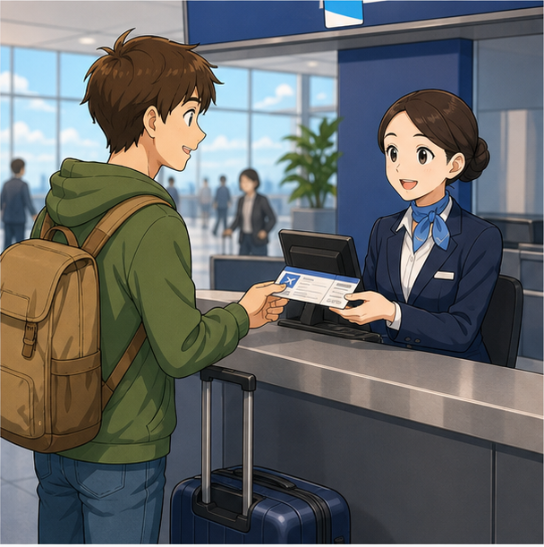

**Staff:** Good evening, sir. How may I help you?
**Passenger:** I'd like to check in, please.
**Staff:** Of course. May I see your ticket and passport?
**Passenger:** Sure. Here you are.
**Staff:** Thank you. Do you have any luggage to check in?
**Passenger:** No, just this travel bag. Can I take it as a carry-on?
**Staff:** Yes, that's fine.
**Passenger:** Great.
**Staff:** Here's your boarding pass. Your gate is Gate 8, and boarding begins in about ten minutes.
**Passenger:** Perfect. Thank you very much.
**Staff:** You're welcome. Have a nice flight.

### Nội dung giao tiếp

```text
Yêu cầu check-in
        ↓
Đưa vé và hộ chiếu
        ↓
Kiểm tra hành lý
        ↓
Xác nhận carry-on
        ↓
Nhận boarding pass
        ↓
Kiểm tra gate
        ↓
Đi đến cửa khởi hành
```

---

## Hội thoại 2 — Hỏi vị trí quầy check-in

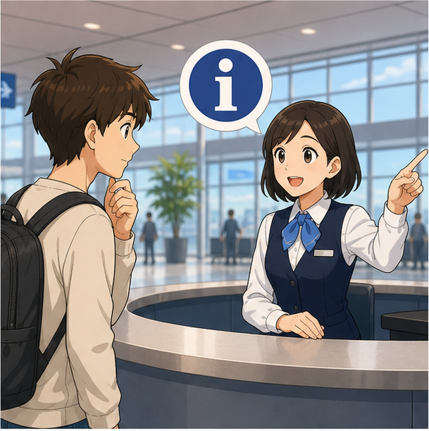

**Passenger:** Excuse me. Could you tell me where I can check in for flight VN100 to Tokyo?
**Staff:** Certainly. Which airline are you flying with?
**Passenger:** Vietnam Airlines.
**Staff:** The check-in counters are in Zone B.
**Passenger:** Is that far from here?
**Staff:** No. Go straight ahead and turn left after the information desk.
**Passenger:** Thank you.
**Staff:** You're welcome.

---

## Hội thoại 3 — Hành lý quá cân

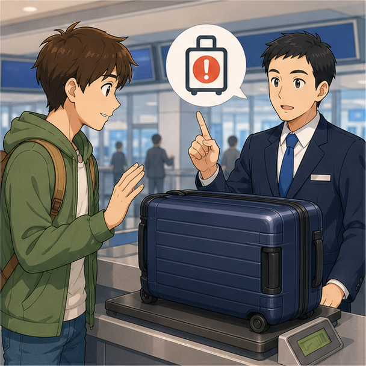

**Staff:** Please put your suitcase on the scale.
**Passenger:** Sure.
**Staff:** Your suitcase weighs 23 kilograms.
**Passenger:** Is that okay?
**Staff:** Your baggage allowance is 20 kilograms, so it's three kilograms overweight.
**Passenger:** I see. What can I do?
**Staff:** You can remove some items or pay an excess baggage fee.
**Passenger:** I'll move some things to my carry-on.
**Staff:** That's fine. We can weigh it again afterward.
**Passenger:** Thank you.

---

## Hội thoại 4 — Tìm cửa khởi hành

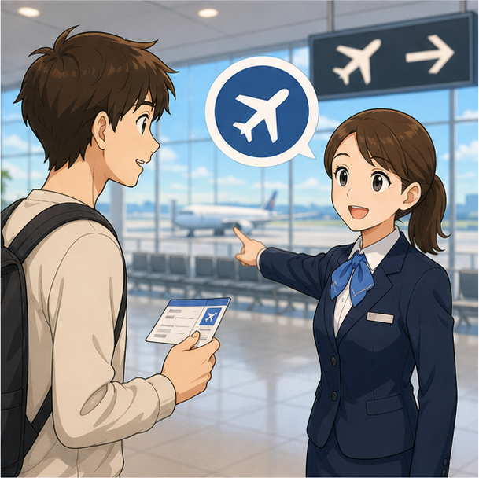

**Passenger:** Excuse me. How do I get to Gate 8 from here?
**Staff:** Go straight ahead and follow the signs for Gates 1 to 12.
**Passenger:** Is it far?
**Staff:** It's about a five-minute walk.
**Passenger:** When does boarding begin?
**Staff:** Boarding starts at 8:30.
**Passenger:** And what time does the flight depart?
**Staff:** At 9 a.m.
**Passenger:** Great. Thank you for your help.
**Staff:** You're welcome.

---

## Hội thoại 5 — Xác nhận chuyến bay


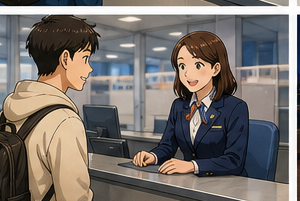
**Passenger:** Excuse me. Is this the counter for flight SC204 to Thailand?
**Staff:** Yes, it is.
**Passenger:** Great. I'd like to check in, please.
**Staff:** May I see your passport and ticket?
**Passenger:** Here they are.
**Staff:** Thank you. How many pieces of baggage would you like to check in?
**Passenger:** Just one suitcase.
**Staff:** Okay. Please put it on the scale.
**Passenger:** Sure.
**Staff:** Everything is fine. Here's your boarding pass.

---

# 11. Natural Expressions — Cách nói tự nhiên

| Cụm từ                                | Nghĩa                                    | Khi dùng    |
| ------------------------------------- | ---------------------------------------- | ----------- |
| **I'd like to check in, please.**     | Tôi muốn làm thủ tục.                    | Check-in    |
| **Where can I check in?**             | Tôi có thể check-in ở đâu?               | Tìm quầy    |
| **Is this the right counter?**        | Đây có đúng quầy không?                  | Xác nhận    |
| **May I see your passport?**          | Tôi có thể xem hộ chiếu không?           | Nhân viên   |
| **Here you are.**                     | Đây ạ.                                   | Đưa giấy tờ |
| **Do you have any luggage?**          | Bạn có hành lý không?                    | Check-in    |
| **Just one suitcase.**                | Chỉ một vali thôi.                       | Hành lý     |
| **I only have a carry-on.**           | Tôi chỉ có hành lý xách tay.             | Hành lý     |
| **Can I take this as a carry-on?**    | Tôi mang cái này lên máy bay được không? | Hành lý     |
| **Is my bag overweight?**             | Túi có quá cân không?                    | Hành lý     |
| **What's the baggage allowance?**     | Giới hạn hành lý là bao nhiêu?           | Hành lý     |
| **Here's your boarding pass.**        | Đây là boarding pass của bạn.            | Check-in    |
| **Which gate should I go to?**        | Tôi nên đến cửa nào?                     | Gate        |
| **Where is Gate 8?**                  | Cửa số 8 ở đâu?                          | Hỏi đường   |
| **Is it far from here?**              | Có xa đây không?                         | Hỏi đường   |
| **When does boarding begin?**         | Khi nào bắt đầu boarding?                | Boarding    |
| **What time does the flight depart?** | Máy bay khởi hành lúc mấy giờ?           | Thời gian   |
| **Your flight is on time.**           | Chuyến bay đúng giờ.                     | Thông tin   |
| **Have a nice flight.**               | Chúc bạn có chuyến bay vui vẻ.           | Kết thúc    |
| **Thank you for your help.**          | Cảm ơn bạn đã giúp.                      | Kết thúc    |

---

# 12. Lỗi thường gặp — Common Mistakes

## Lỗi 1: Dùng **check** thay cho **check in**

❌ **I want to check my flight.**

Nếu muốn nói làm thủ tục:

✅ **I'd like to check in.**

---

## Lỗi 2: Dùng **check-in** như động từ

❌ **I need to check-in now.**

✅ **I need to check in now.**

### Ghi nhớ

* **check in** = động từ
* **check-in** = danh từ / tính từ

Ví dụ:

**check-in counter**

---

## Lỗi 3: Nói **luggages**

❌ **I have two luggages.**

✅ **I have two pieces of luggage.**

Hoặc tự nhiên hơn:

✅ **I have two bags.**

✅ **I have two suitcases.**

---

## Lỗi 4: Nói **a luggage**

❌ **I have a luggage.**

✅ **I have some luggage.**

✅ **I have one piece of luggage.**

✅ **I have one suitcase.**

---

## Lỗi 5: Nhầm **boarding pass** và **passport**

### **passport**

= hộ chiếu.

### **boarding pass**

= thẻ lên máy bay.

Bạn thường cần mang cả hai khi qua các bước tại sân bay.

---

## Lỗi 6: Nhầm **gate** và **counter**

### **counter**

= nơi làm thủ tục.

### **gate**

= nơi bạn chờ và lên máy bay.

Quy trình:

`check-in counter → security → gate → plane`

---

## Lỗi 7: Nói **What time the flight depart?**

❌ **What time the flight depart?**

✅ **What time does the flight depart?**

---

## Lỗi 8: Nói **When boarding start?**

❌ **When boarding start?**

✅ **When does boarding start?**

Hoặc:

✅ **When does boarding begin?**

---

## Lỗi 9: Dùng **go on the plane** khi muốn nói “lên máy bay”

Có thể hiểu nhưng từ chính xác hơn là:

✅ **board the plane**

Ví dụ:

**Passengers are boarding the plane now.**

---

## Lỗi 10: Nhầm **depart** và **departure**

### **depart**

= động từ.

**The flight departs at 9 a.m.**

### **departure**

= danh từ.

**The departure time is 9 a.m.**

---

## Lỗi 11: Nói **How many baggage?**

❌ **How many baggage do you have?**

Do **baggage** không đếm trực tiếp:

✅ **How many pieces of baggage do you have?**

Hoặc:

✅ **How many bags do you have?**

---

## Lỗi 12: Dùng **very heavy** khi muốn nói hành lý vượt mức cho phép

**very heavy** chỉ nói túi nặng.

Nếu vượt giới hạn của hãng:

✅ **My suitcase is overweight.**

---

## Lỗi 13: Dùng sai **carry-on**

❌ **Can I check in this carry-on with me?**

Nếu muốn mang lên máy bay:

✅ **Can I take this as a carry-on?**

---

## Lỗi 14: Trả lời quá ngắn

Ví dụ:

**Staff:** Do you have any luggage to check in?
△ **Passenger:** Yes.

Tự nhiên hơn:

✅ **Yes, just one suitcase.**

Hoặc:

✅ **Yes, I have one suitcase to check in.**

---

# 13. Luyện tập có hướng dẫn

## Bài 1 — Nối từ với nghĩa

1. boarding pass
2. passport
3. luggage
4. gate
5. overweight
6. counter

A. hộ chiếu
B. quầy
C. cửa lên máy bay
D. hành lý
E. thẻ lên máy bay
F. quá cân

<details>
<summary>Đáp án</summary>

1–E
2–A
3–D
4–C
5–F
6–B

</details>

---

## Bài 2 — Điền từ vào chỗ trống

Dùng:

`passport` · `gate` · `boarding pass` · `luggage` · `check in`

1. I'd like to ________, please.
2. May I see your ________?
3. Do you have any ________?
4. Here's your ________.
5. Your flight leaves from ________ 8.

<details>
<summary>Đáp án</summary>

1. check in
2. passport
3. luggage
4. boarding pass
5. Gate

</details>

---

## Bài 3 — Chọn câu đúng

### 1. Bạn muốn làm thủ tục.

* A. I'd like to check in, please.
* B. I'd like checking in, please.
* C. I'd like check-in, please.

**Đáp án:** A

---

### 2. Bạn muốn hỏi cửa số 8 ở đâu.

* A. Where Gate 8?
* B. Where is Gate 8?
* C. Where does Gate 8?

**Đáp án:** B

---

### 3. Bạn muốn hỏi chuyến bay khởi hành lúc mấy giờ.

* A. What time does the flight depart?
* B. What time the flight depart?
* C. What time is flight depart?

**Đáp án:** A

---

### 4. Bạn muốn hỏi liệu túi có thể làm hành lý xách tay không.

* A. Can I take this as a carry-on?
* B. Can I carry-on this?
* C. Can I take this carry?

**Đáp án:** A

---

## Bài 4 — **gate** hay **counter**

1. I need to check in. Which ________ should I go to?
2. Boarding begins at ________ 12.
3. Is this the check-in ________ for VN100?
4. How do I get to ________ 8?

<details>
<summary>Đáp án</summary>

1. counter
2. Gate
3. counter
4. Gate

</details>

---

## Bài 5 — **depart**, **departure** hay **boarding**

1. What time does the flight ________?
2. The ________ time is 9 a.m.
3. ________ begins at 8:30.
4. Our flight ________ in one hour.

<details>
<summary>Đáp án</summary>

1. depart
2. departure
3. Boarding
4. departs

</details>

---

## Bài 6 — Hoàn thành hội thoại

**Staff:** Good morning. How may I help you?
**Passenger:** I'd like to ________, please.
**Staff:** May I see your ticket and ________?
**Passenger:** Sure. Here you are.
**Staff:** Do you have any ________ to check in?
**Passenger:** Just one suitcase.
**Staff:** Great. Here's your ________. Your flight leaves from Gate 10.
**Passenger:** Thank you. When does ________ begin?
**Staff:** At 9:15.

<details>
<summary>Đáp án gợi ý</summary>

1. check in
2. passport
3. luggage / baggage
4. boarding pass
5. boarding

</details>

---

# 14. Speaking Challenge — Thử thách nói

## Nhiệm vụ 1 — Đọc mẫu câu

Đọc các câu sau thành tiếng:

* **I'd like to check in, please.**
* **Could you tell me where I can check in?**
* **Is this the counter for flight VN100?**
* **May I see your ticket and passport?**
* **Do you have any luggage to check in?**
* **Can I take this bag as a carry-on?**
* **What's the baggage allowance?**
* **Is my suitcase overweight?**
* **When does boarding begin?**
* **How do I get to Gate 8?**

Đọc mỗi câu hai lần:

* lần 1 chậm và rõ;
* lần 2 với tốc độ hội thoại tự nhiên.

---

## Nhiệm vụ 2 — Mô tả chuyến bay của bạn

Hãy tưởng tượng bạn sắp bay từ Hà Nội đến Tokyo.

Nói ít nhất **5 câu**.

Có thể sử dụng:

* **I'm flying to Tokyo.**
* **My flight number is VN100.**
* **The flight departs at 9 a.m.**
* **I have one suitcase and one carry-on.**
* **I need to check in first.**
* **My gate is Gate 12.**

---

## Nhiệm vụ 3 — Làm thủ tục check-in

Bạn là hành khách.

Phải sử dụng ít nhất:

* **I'd like to check in, please.**
* **Here you are.**
* **I have one suitcase.**
* **Can I take this as a carry-on?**
* **Which gate should I go to?**
* **Thank you.**

---

## Nhiệm vụ 4 — Hội thoại 8 lượt

Tạo đoạn hội thoại có ít nhất:

* 1 câu yêu cầu check-in;
* 1 câu hỏi về passport;
* 1 câu về luggage;
* 1 câu về carry-on;
* 1 câu về boarding pass;
* 1 câu hỏi về gate;
* 1 câu hỏi về boarding time;
* 1 câu kết thúc lịch sự.

---

## Nhiệm vụ 5 — Ghi âm

Ghi âm từ **45–60 giây**, sau đó kiểm tra:

* [ ] Tôi có thể nói **I'd like to check in, please.**
* [ ] Tôi hiểu **flight number**.
* [ ] Tôi có thể nói về passport.
* [ ] Tôi phân biệt **luggage** và **suitcase**.
* [ ] Tôi hiểu **checked baggage**.
* [ ] Tôi hiểu **carry-on**.
* [ ] Tôi biết **boarding pass** là gì.
* [ ] Tôi biết **gate** là gì.
* [ ] Tôi có thể hỏi giờ boarding.
* [ ] Tôi có thể hỏi giờ departure.
* [ ] Tôi có thể hỏi hành lý có quá cân hay không.
* [ ] Tôi có thể duy trì hội thoại ít nhất 45 giây.

---

# 15. Practice Mission — Nhiệm vụ thực tế

Trong hôm nay, hãy tạo một cuộc hội thoại theo công thức:

> **Find counter → Check in → Show documents → Check baggage → Receive boarding pass → Find gate**

Ví dụ:

> **Excuse me. Where can I check in for flight VN100?**
> ↓
> **Please go to Counter 12.**
> ↓
> **I'd like to check in, please.**
> ↓
> **May I see your passport and ticket?**
> ↓
> **Here you are.**
> ↓
> **Do you have any baggage to check in?**
> ↓
> **Yes, one suitcase.**
> ↓
> **Here's your boarding pass. Your gate is Gate 8.**
> ↓
> **Thank you.**

Sau đó viết hoặc nói một đoạn hội thoại **8–10 lượt** cho một trong các tình huống:

* tìm quầy check-in;
* làm thủ tục cho chuyến bay;
* gửi hành lý ký gửi;
* hành lý bị quá cân;
* hỏi giới hạn hành lý;
* hỏi liệu một túi có thể làm carry-on;
* tìm cửa khởi hành;
* hỏi giờ boarding;
* hỏi giờ departure;
* hỏi nhân viên tại information desk.

---

# 16. Tự đánh giá cuối bài

Đánh dấu khi bạn có thể thực hiện mà không nhìn bài:

* [ ] Tôi hiểu **check in**.
* [ ] Tôi có thể nói **I'd like to check in, please.**
* [ ] Tôi có thể hỏi vị trí quầy check-in.
* [ ] Tôi hiểu **flight** và **flight number**.
* [ ] Tôi có thể nói về ticket.
* [ ] Tôi có thể nói về passport.
* [ ] Tôi hiểu **luggage**.
* [ ] Tôi hiểu **baggage**.
* [ ] Tôi biết **luggage** và **baggage** thường không đếm trực tiếp.
* [ ] Tôi có thể nói **one suitcase**.
* [ ] Tôi hiểu **checked baggage**.
* [ ] Tôi hiểu **carry-on**.
* [ ] Tôi có thể hỏi **Can I take this as a carry-on?**
* [ ] Tôi hiểu **baggage allowance**.
* [ ] Tôi hiểu **overweight**.
* [ ] Tôi biết **boarding pass** là gì.
* [ ] Tôi biết **gate** là gì.
* [ ] Tôi có thể hỏi **When does boarding begin?**
* [ ] Tôi có thể hỏi **What time does the flight depart?**
* [ ] Tôi có thể hỏi **How do I get to Gate 8?**
* [ ] Tôi có thể duy trì hội thoại tại sân bay ít nhất 45 giây.

---

# 17. Câu hỏi mở cuối bài

**Imagine you arrive at an international airport for your first flight abroad. You need to find the correct check-in counter, check one suitcase, keep one bag as a carry-on, receive your boarding pass and find the correct gate. What would you say to the airport staff from the moment you arrive until you are ready to board the plane?**

*Hãy tưởng tượng bạn đến một sân bay quốc tế để thực hiện chuyến bay nước ngoài đầu tiên. Bạn cần tìm đúng quầy check-in, ký gửi một vali, giữ một túi làm hành lý xách tay, nhận boarding pass và tìm đúng cửa khởi hành. Bạn sẽ nói gì với nhân viên sân bay từ lúc đến sân bay cho đến khi sẵn sàng lên máy bay?*

---

# 18. Ghi chú dành cho giảng viên

* **Module:** 03 — Travel Ready / Tiếng Anh cho những chuyến đi
* **Chủ điểm:** Airport Check-in & Boarding
* **Thời lượng video:** 8–12 phút
* **Luyện nói:** 5–10 phút

### Trọng tâm từ vựng

* check in
* flight
* flight number
* ticket
* passport
* luggage
* baggage
* suitcase
* carry-on
* checked baggage
* counter
* check-in counter
* information desk
* boarding pass
* gate
* depart
* departure
* board
* boarding
* overweight
* baggage allowance
* weigh
* destination

### Trọng tâm cấu trúc

* **I'd like to check in, please.**
* **Could you tell me where I can check in?**
* **Could you tell me where Gate 8 is?**
* **Is this the counter for flight VN100?**
* **I'd like to know whether there is a flight to New York.**
* **May I see your ticket and passport?**
* **Here you are.**
* **Do you have any luggage to check in?**
* **How many pieces of baggage do you have?**
* **Can I take this as a carry-on?**
* **What's the baggage allowance?**
* **Is my suitcase overweight?**
* **Here's your boarding pass.**
* **Which gate should I go to?**
* **How do I get to Gate 8 from here?**
* **When does boarding begin?**
* **What time does the flight depart?**
* **What's your final destination?**
* **Have a nice flight.**

### Trọng tâm phát âm

* **check in**
* **flight**
* **passport**
* **luggage**
* **baggage**
* **suitcase**
* **boarding**
* **boarding pass**
* **departure**
* **overweight**
* **allowance**

### Lưu ý ngôn ngữ

* **check in** là động từ:

  * **I'd like to check in.**

* **check-in** thường là danh từ hoặc tính từ:

  * **check-in counter**
  * **online check-in**

* **luggage** và **baggage** thường không đếm được.

Không dùng:

* ❌ **two luggages**
* ❌ **three baggages**

Dùng:

* **two pieces of luggage**

* **three pieces of baggage**

* **two bags**

* **three suitcases**

* **suitcase** là danh từ đếm được:

  * one suitcase
  * two suitcases

* **carry-on** là hành lý được mang theo vào khoang hành khách.

* **checked baggage** là hành lý được gửi vào khoang hành lý của máy bay.

* **boarding pass** khác **passport**:

  * passport = hộ chiếu;
  * boarding pass = thẻ lên máy bay.

* **gate** khác **counter**:

  * counter = quầy làm thủ tục;
  * gate = cửa lên máy bay.

* **depart** là động từ:

  * **The flight departs at 9 a.m.**

* **departure** là danh từ:

  * **The departure time is 9 a.m.**

* **board** = lên phương tiện:

  * **board the plane**

* **boarding** = quá trình hành khách lên máy bay:

  * **Boarding begins at 8:30.**

* Để hỏi đường, ưu tiên:

  * **Where is Gate 8?**
  * **How do I get to Gate 8?**
  * **Could you tell me where Gate 8 is?**

* Với người học A1–A2, ưu tiên các phản hồi ngắn nhưng đầy đủ:

  * **Yes, one suitcase.**
  * **No, just this carry-on.**
  * **My flight number is VN100.**
  * **I'm flying to Tokyo.**
  * **Thank you for your help.**

### Hoạt động gợi ý — Airport Check-in Survey

Chia lớp thành cặp.

Mỗi người hỏi bạn cùng cặp:

> **Where are you flying to?**

> **What's your flight number?**

> **How many bags do you have?**

> **Do you have any checked baggage?**

> **Do you have a carry-on?**

> **What time does your flight depart?**

> **What gate are you leaving from?**

Sau đó giới thiệu lại bạn cùng cặp bằng 4–5 câu.

Ví dụ:

> **Mai is flying to Tokyo on flight VN100. Her flight departs at 9 a.m. She has one suitcase to check in and one carry-on. Her flight leaves from Gate 12.**

### Role-play mẫu — Check-in

**Người A nhận:**

> Bạn là hành khách bay chuyến VN100 đến Tokyo. Bạn có một vali ký gửi và một ba lô xách tay.

**Người B nhận:**

> Bạn là nhân viên tại quầy check-in.

Người A phải sử dụng ít nhất:

* **I'd like to check in, please.**
* **Here you are.**
* **I have one suitcase.**
* **Can I take this bag as a carry-on?**
* **Which gate should I go to?**
* **Thank you.**

Người B phải sử dụng ít nhất:

* **May I see your passport and ticket?**
* **Do you have any luggage to check in?**
* **Please put your suitcase on the scale.**
* **Here's your boarding pass.**
* **Your gate is Gate 8.**
* **Have a nice flight.**

### Role-play mẫu — Hành lý quá cân

**Người A nhận:**

> Vali của bạn nặng 24 kg nhưng giới hạn hành lý là 20 kg.

**Người B nhận:**

> Bạn là nhân viên sân bay và phải giải thích vấn đề.

Người A phải sử dụng ít nhất:

* **Is my suitcase overweight?**
* **What's the baggage allowance?**
* **How much does my suitcase weigh?**
* **What can I do?**

Người B phải sử dụng ít nhất:

* **Your suitcase weighs 24 kilograms.**
* **The allowance is 20 kilograms.**
* **Your suitcase is four kilograms overweight.**
* **You can remove some items.**

### Role-play mẫu — Tìm cửa khởi hành

**Người A nhận:**

> Bạn có boarding pass nhưng không biết Gate 12 ở đâu. Boarding bắt đầu lúc 10:30.

**Người B nhận:**

> Bạn là nhân viên sân bay.

Người A phải sử dụng ít nhất:

* **Excuse me.**
* **How do I get to Gate 12?**
* **Is it far from here?**
* **When does boarding begin?**
* **Thank you for your help.**

Người B phải sử dụng ít nhất:

* **Go straight ahead.**
* **Follow the signs.**
* **It's about a five-minute walk.**
* **Boarding begins at 10:30.**
* **You're welcome.**

### Role-play mẫu — Quầy thông tin

**Người A nhận:**

> Bạn không biết mình phải check-in ở đâu cho chuyến SC204 đi Bangkok.

**Người B nhận:**

> Bạn làm việc tại quầy thông tin.

Hai người phải sử dụng ít nhất:

* **Could you tell me where I can check in?**
* **What's your flight number?**
* **My flight number is SC204.**
* **Please go to Counter 16.**
* **Is it far from here?**
* **No, it's just around the corner.**
* **Thank you.**

Kết thúc bằng:

> **You're welcome. Have a nice flight.**
