# LESSON 14 — NHẬN PHÒNG VÀ SỬ DỤNG DỊCH VỤ KHÁCH SẠN

> **Module 03 — Travel Ready / Tiếng Anh cho những chuyến đi**
> **Chủ đề:** At the Hotel — Đặt phòng, nhận phòng, yêu cầu dịch vụ và trả phòng
> **Trình độ gợi ý:** A1–A2
> **Thời lượng:** 8–12 phút học bài + 5–10 phút luyện nói

---

## 1. Tình huống thực tế

Khi đi du lịch, công tác hoặc nghỉ dưỡng, bạn thường cần giao tiếp với nhân viên khách sạn trong nhiều tình huống khác nhau, chẳng hạn:

* hỏi khách sạn còn phòng hay không;
* hỏi giá phòng;
* hỏi loại phòng;
* yêu cầu một phòng yên tĩnh;
* đặt phòng trước;
* nhận phòng khi đã có đặt phòng;
* nhận phòng khi chưa đặt trước;
* nói số đêm muốn ở;
* hỏi về phòng tiêu chuẩn hoặc phòng suite;
* hỏi phòng có giường đôi hoặc hai giường đơn;
* hỏi phòng có được trang bị đầy đủ không;
* điền phiếu thông tin khi check-in;
* nhận chìa khóa hoặc thẻ phòng;
* hỏi về Wi-Fi;
* hỏi giờ ăn sáng;
* yêu cầu khăn tắm hoặc đồ dùng bổ sung;
* yêu cầu dọn phòng;
* sử dụng dịch vụ giặt là hoặc giặt khô;
* báo sự cố trong phòng;
* hỏi lễ tân giúp đỡ;
* yêu cầu đổi phòng;
* hỏi về hóa đơn;
* thanh toán;
* trả phòng.

Bạn cần biết cách nói những câu như:

* **Do you have any rooms available?**
* **Do you have a cheap room?**
* **I'd like a quiet room.**
* **How much is the room?**
* **What kind of room would you like?**
* **Would you like a standard room or a suite?**
* **How long would you like to stay?**
* **Do you have any preferences?**
* **We didn't make a reservation.**
* **We'd like to stay for four nights.**
* **Could you please fill out this form?**
* **May I see the room first?**
* **Is the room well equipped?**
* **This is your receipt and your key.**
* **Could you send someone to clean the room?**
* **I'd like to check out, please.**

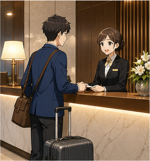

---

## 2. Mục tiêu bài học

Sau bài học, người học có thể:

1. Hỏi khách sạn còn phòng hay không.
2. Hỏi giá phòng.
3. Hỏi và lựa chọn loại phòng.
4. Phân biệt **standard room** và **suite**.
5. Yêu cầu một phòng yên tĩnh.
6. Nói mình đã hoặc chưa đặt phòng.
7. Nói số đêm dự định ở.
8. Nói về sở thích hoặc yêu cầu đối với phòng.
9. Hiểu và sử dụng **available**, **vacant** và **fully occupied**.
10. Hỏi phòng có được trang bị đầy đủ hay không.
11. Nói về các loại giường như **twin beds** và **double bed**.
12. Điền thông tin khi nhận phòng.
13. Hỏi xem có thể xem phòng trước không.
14. Giao tiếp với **receptionist**.
15. Yêu cầu dịch vụ dọn phòng.
16. Hỏi về dịch vụ giặt là và giặt khô.
17. Yêu cầu thêm khăn tắm hoặc vật dụng trong phòng.
18. Báo một vấn đề trong phòng.
19. Hỏi về hóa đơn và biên lai.
20. Thực hiện hội thoại check-out đơn giản.
21. Duy trì một đoạn hội thoại 6–8 lượt tại khách sạn.

---

## 3. Sơ đồ giao tiếp

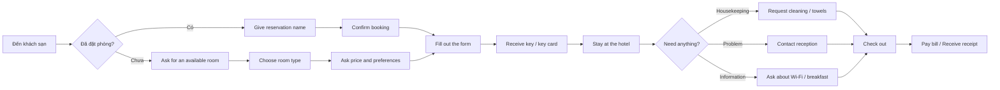

### Mẫu đơn giản

`Do you have a reservation?`
→ `Yes, I do.`
→ `May I have your name, please?`
→ `It's Mai Nguyen.`
→ `Please fill out this form.`
→ `Sure.`
→ `Here's your key card.`
→ `Thank you.`

---

# 4. Từ vựng trọng tâm — Core Vocabulary

## 4.1. **hotel** /həʊˈtel/

**Nghĩa:** khách sạn

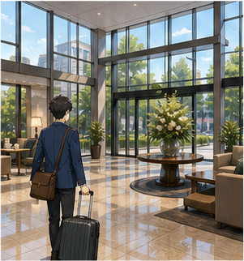

**Ví dụ:**

* **We're staying at a hotel near the airport.**
  — Chúng tôi đang ở một khách sạn gần sân bay.

* **Is there a hotel near here?**
  — Có khách sạn nào gần đây không?

---

## 4.2. **reservation** /ˌrez.əˈveɪ.ʃən/

**Nghĩa:** sự đặt trước, đặt phòng

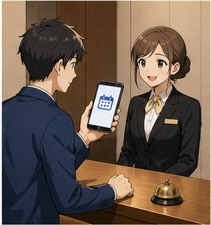

**Ví dụ:**

* **I have a reservation under Nguyen.**
  — Tôi có đặt phòng dưới tên Nguyen.

* **We didn't make a reservation.**
  — Chúng tôi chưa đặt phòng trước.

### Cụm hữu ích

* **make a reservation** — đặt phòng
* **have a reservation** — có đặt phòng
* **confirm a reservation** — xác nhận đặt phòng
* **cancel a reservation** — hủy đặt phòng

---

## 4.3. **reception** /rɪˈsep.ʃən/

**Nghĩa:** quầy lễ tân; khu vực lễ tân

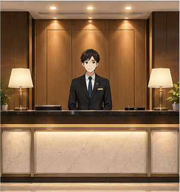

**Ví dụ:**

* **Please ask at reception.**
  — Vui lòng hỏi tại quầy lễ tân.

* **I'll leave it at reception.**
  — Tôi sẽ để nó ở quầy lễ tân.

---

## 4.4. **receptionist** /rɪˈsep.ʃən.ɪst/

**Nghĩa:** nhân viên lễ tân

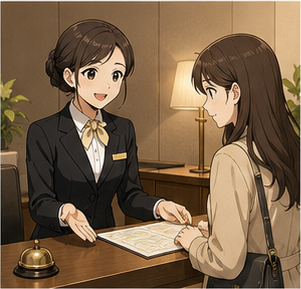

**Ví dụ:**

* **The receptionist gave us our key cards.**
  — Nhân viên lễ tân đã đưa thẻ phòng cho chúng tôi.

* **I'll ask the receptionist.**
  — Tôi sẽ hỏi nhân viên lễ tân.

> **reception** = quầy/khu vực lễ tân.
> **receptionist** = người làm việc tại quầy lễ tân.

---

## 4.5. **room** /ruːm/

**Nghĩa:** phòng

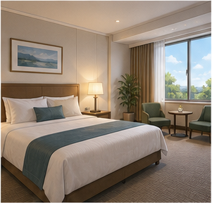

**Ví dụ:**

* **Do you have a room available?**
  — Khách sạn còn phòng không?

* **I'd like a quiet room.**
  — Tôi muốn một phòng yên tĩnh.

---

## 4.6. **standard room** /ˈstæn.dəd ruːm/

**Nghĩa:** phòng tiêu chuẩn

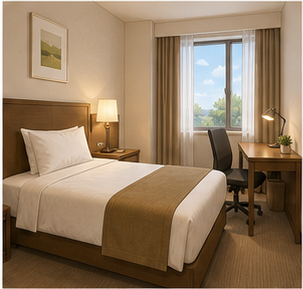

**Ví dụ:**

* **I'd like a standard room.**
  — Tôi muốn một phòng tiêu chuẩn.

* **How much is a standard room per night?**
  — Một phòng tiêu chuẩn giá bao nhiêu mỗi đêm?

---

## 4.7. **suite** /swiːt/

**Nghĩa:** phòng suite, phòng hạng cao thường có không gian rộng hơn và có thể gồm nhiều khu vực/phòng

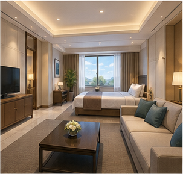

**Ví dụ:**

* **Would you like a standard room or a suite?**
  — Bạn muốn phòng tiêu chuẩn hay phòng suite?

* **The suite has a separate living room.**
  — Phòng suite có một phòng khách riêng.

> **suite** phát âm là **/swiːt/**, giống từ **sweet**.

---

## 4.8. **quiet** /ˈkwaɪ.ət/

**Nghĩa:** yên tĩnh


**Ví dụ:**

* **I'd like a quiet room.**
  — Tôi muốn một phòng yên tĩnh.

* **Do you have a quiet room away from the elevator?**
  — Bạn có phòng yên tĩnh cách xa thang máy không?

---

## 4.9. **available** /əˈveɪ.lə.bəl/

**Nghĩa:** còn trống, có sẵn để sử dụng

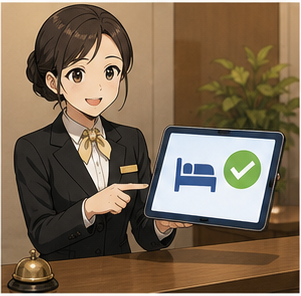

**Ví dụ:**

* **Do you have any rooms available tonight?**
  — Tối nay khách sạn còn phòng không?

* **We have one twin room available.**
  — Chúng tôi còn một phòng hai giường đơn.

---

## 4.10. **vacant** /ˈveɪ.kənt/

**Nghĩa:** đang trống, chưa có người sử dụng

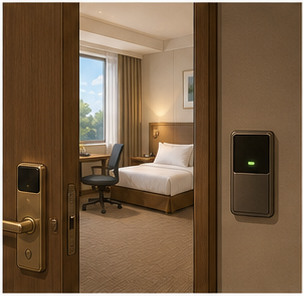

**Ví dụ:**

* **Are there any rooms vacant?**
  — Có phòng nào đang trống không?

* **This room is vacant now.**
  — Phòng này hiện đang trống.

### Trong giao tiếp khách sạn

Câu tự nhiên hơn thường là:

**Do you have any rooms available?**

thay vì:

**Are there any beds vacant?**

---

## 4.11. **occupied** /ˈɒk.jə.paɪd/

**Nghĩa:** đang có người sử dụng; đã có khách

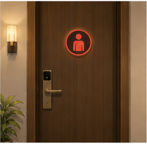

**Ví dụ:**

* **All our rooms are occupied.**
  — Tất cả các phòng của chúng tôi đều đã có khách.

* **That room is currently occupied.**
  — Phòng đó hiện đang có khách.

---

## 4.12. **fully occupied**

**Nghĩa:** kín phòng, tất cả phòng đều có khách

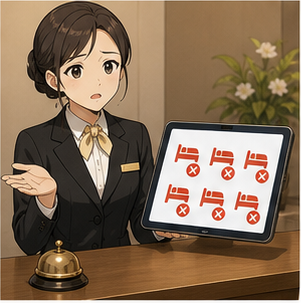

**Ví dụ:**

* **All our rooms are fully occupied tonight.**
  — Tối nay tất cả các phòng của chúng tôi đều kín.

### Cách nói phổ biến khác

**We're fully booked tonight.**

— Tối nay khách sạn đã kín phòng.

---

## 4.13. **twin room** /twɪn ruːm/

**Nghĩa:** phòng có hai giường đơn

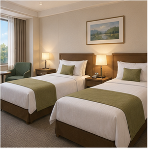

**Ví dụ:**

* **We'd like a twin room, please.**
  — Chúng tôi muốn một phòng hai giường đơn.

* **Does the room have twin beds?**
  — Phòng có hai giường đơn không?

---

## 4.14. **twin bed** /twɪn bed/

**Nghĩa:** giường đơn; trong ngữ cảnh khách sạn thường nói **twin beds** để chỉ hai giường đơn

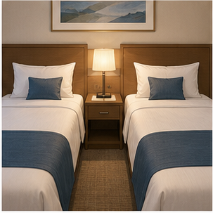

**Ví dụ:**

* **The room has two twin beds.**
  — Phòng có hai giường đơn.

---

## 4.15. **double room** /ˈdʌb.əl ruːm/

**Nghĩa:** phòng dành cho hai người, thường có một giường đôi

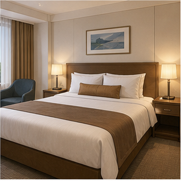

**Ví dụ:**

* **I'd like a double room.**
  — Tôi muốn một phòng đôi.

* **Is a double room available tonight?**
  — Tối nay còn phòng đôi không?

---

## 4.16. **well equipped** /ˌwel ɪˈkwɪpt/

**Nghĩa:** được trang bị đầy đủ

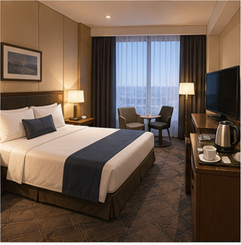

**Ví dụ:**

* **Is the room well equipped?**
  — Phòng có được trang bị đầy đủ không?

* **The rooms are well equipped with air conditioning and Wi-Fi.**
  — Các phòng được trang bị tốt với điều hòa và Wi-Fi.

---

## 4.17. **facilities** /fəˈsɪl.ə.tiz/

**Nghĩa:** cơ sở vật chất, tiện nghi

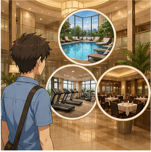

**Ví dụ:**

* **What facilities does the hotel have?**
  — Khách sạn có những tiện nghi gì?

* **The hotel has a swimming pool and a gym.**
  — Khách sạn có hồ bơi và phòng gym.

---

## 4.18. **amenities** /əˈmiː.nə.tiz/

**Nghĩa:** tiện nghi, đồ dùng hoặc dịch vụ phục vụ sự thoải mái của khách

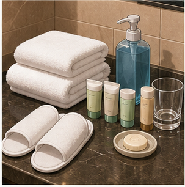

**Ví dụ:**

* **What amenities are included?**
  — Những tiện nghi nào được bao gồm?

* **The room includes basic amenities.**
  — Phòng bao gồm các tiện nghi cơ bản.

---

## 4.19. **key** /kiː/

**Nghĩa:** chìa khóa


**Ví dụ:**

* **Here is your key.**
  — Đây là chìa khóa của bạn.

---

## 4.20. **key card** /ˈkiː kɑːd/

**Nghĩa:** thẻ phòng, thẻ mở cửa phòng

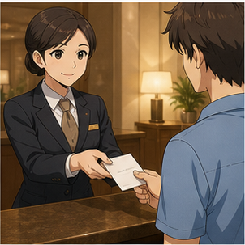

**Ví dụ:**

* **Here's your key card. You're in room 305.**
  — Đây là thẻ phòng của bạn. Bạn ở phòng 305.

* **I lost my key card.**
  — Tôi làm mất thẻ phòng.

---

## 4.21. **form** /fɔːm/

**Nghĩa:** biểu mẫu, phiếu thông tin


**Ví dụ:**

* **Could you please fill out this form?**
  — Bạn vui lòng điền biểu mẫu này được không?

* **Where should I sign the form?**
  — Tôi nên ký vào đâu trên biểu mẫu?

---

## 4.22. **fill out** /fɪl aʊt/

**Nghĩa:** điền thông tin vào biểu mẫu

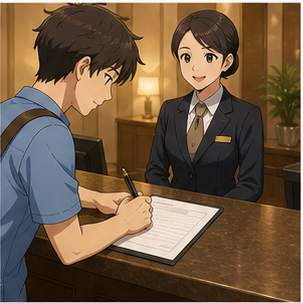

**Ví dụ:**

* **Please fill out this form.**
  — Vui lòng điền phiếu này.

* **Do I need to fill this out?**
  — Tôi có cần điền cái này không?

---

## 4.23. **stay** /steɪ/

**Nghĩa:** ở, lưu trú

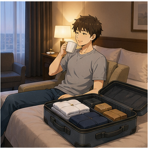

**Ví dụ:**

* **We'd like to stay for four nights.**
  — Chúng tôi muốn ở bốn đêm.

* **How long are you staying?**
  — Bạn sẽ ở bao lâu?

---

## 4.24. **night** /naɪt/

**Nghĩa:** đêm


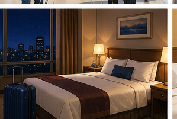
**Ví dụ:**

* **We're staying for three nights.**
  — Chúng tôi sẽ ở ba đêm.

* **How much is the room per night?**
  — Phòng giá bao nhiêu mỗi đêm?

---

## 4.25. **preference** /ˈpref.ər.əns/

**Nghĩa:** sở thích, lựa chọn ưu tiên

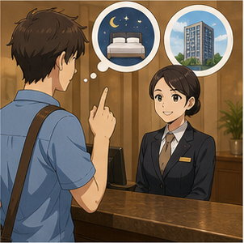

**Ví dụ:**

* **Do you have any preferences?**
  — Bạn có yêu cầu hoặc sở thích gì không?

* **I'd prefer a room on a higher floor.**
  — Tôi muốn một phòng ở tầng cao hơn.

---

## 4.26. **receipt** /rɪˈsiːt/

**Nghĩa:** biên lai

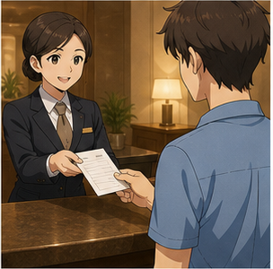

**Ví dụ:**

* **This is your receipt.**
  — Đây là biên lai của bạn.

* **Could I have a receipt, please?**
  — Tôi có thể lấy biên lai được không?

> Chữ **p** trong **receipt** không được phát âm.

---

## 4.27. **bill** /bɪl/

**Nghĩa:** hóa đơn cần thanh toán

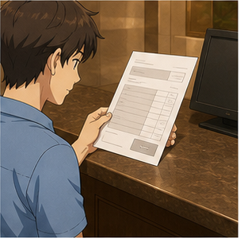

**Ví dụ:**

* **Could I see the bill, please?**
  — Tôi có thể xem hóa đơn được không?

* **Is breakfast included in the bill?**
  — Bữa sáng có được tính trong hóa đơn không?

---

## 4.28. **housekeeping** /ˈhaʊsˌkiː.pɪŋ/

**Nghĩa:** bộ phận dọn phòng


**Ví dụ:**

* **Could you send housekeeping to my room?**
  — Bạn có thể cho nhân viên dọn phòng lên phòng tôi không?

* **Housekeeping will come in a few minutes.**
  — Nhân viên dọn phòng sẽ đến sau vài phút.

---

## 4.29. **clean** /kliːn/

**Nghĩa:** dọn sạch, làm sạch


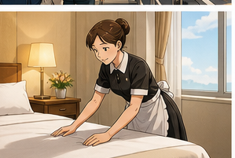
**Ví dụ:**

* **Could you clean the room, please?**
  — Bạn có thể dọn phòng giúp tôi được không?

* **The room hasn't been cleaned yet.**
  — Phòng vẫn chưa được dọn.

---

## 4.30. **dry cleaning** /ˌdraɪ ˈkliː.nɪŋ/

**Nghĩa:** dịch vụ giặt khô

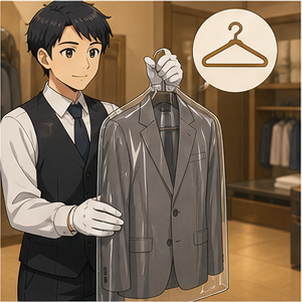

**Ví dụ:**

* **Do you offer dry cleaning?**
  — Khách sạn có dịch vụ giặt khô không?

* **I'd like to have this jacket dry-cleaned.**
  — Tôi muốn giặt khô chiếc áo khoác này.

---

## 4.31. **laundry service** /ˈlɔːn.dri ˌsɜː.vɪs/

**Nghĩa:** dịch vụ giặt là


**Ví dụ:**

* **Do you have a laundry service?**
  — Khách sạn có dịch vụ giặt là không?

---

## 4.32. **check in**

**Nghĩa:** làm thủ tục nhận phòng

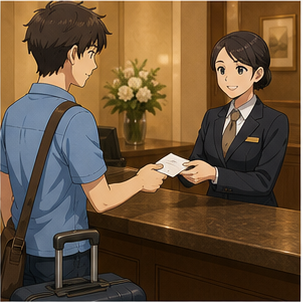

**Ví dụ:**

* **I'd like to check in, please.**
  — Tôi muốn làm thủ tục nhận phòng.

* **What time can we check in?**
  — Chúng tôi có thể nhận phòng lúc mấy giờ?

---

## 4.33. **check out**

**Nghĩa:** làm thủ tục trả phòng

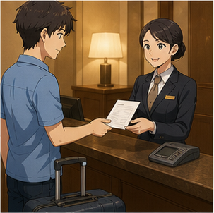

**Ví dụ:**

* **I'd like to check out, please.**
  — Tôi muốn trả phòng.

* **What time is check-out?**
  — Giờ trả phòng là mấy giờ?

---

# 5. Bảng tổng hợp từ vựng

| Từ / cụm từ         | IPA              | Nghĩa tiếng Việt     | Ví dụ ngắn           |
| ------------------- | ---------------- | -------------------- | -------------------- |
| **hotel**           | /həʊˈtel/        | khách sạn            | stay at a hotel      |
| **reservation**     | /ˌrez.əˈveɪ.ʃən/ | đặt phòng            | make a reservation   |
| **reception**       | /rɪˈsep.ʃən/     | quầy lễ tân          | ask at reception     |
| **receptionist**    | /rɪˈsep.ʃən.ɪst/ | nhân viên lễ tân     | ask the receptionist |
| **room**            | /ruːm/           | phòng                | book a room          |
| **standard room**   | —                | phòng tiêu chuẩn     | a standard room      |
| **suite**           | /swiːt/          | phòng suite          | book a suite         |
| **quiet**           | /ˈkwaɪ.ət/       | yên tĩnh             | a quiet room         |
| **available**       | /əˈveɪ.lə.bəl/   | còn trống            | rooms available      |
| **vacant**          | /ˈveɪ.kənt/      | đang trống           | a vacant room        |
| **occupied**        | /ˈɒk.jə.paɪd/    | đang có khách        | room occupied        |
| **fully occupied**  | —                | kín phòng            | fully occupied       |
| **twin room**       | —                | phòng hai giường đơn | book a twin room     |
| **double room**     | —                | phòng đôi            | book a double room   |
| **well equipped**   | —                | được trang bị tốt    | well-equipped room   |
| **facilities**      | /fəˈsɪl.ə.tiz/   | cơ sở vật chất       | hotel facilities     |
| **amenities**       | /əˈmiː.nə.tiz/   | tiện nghi            | room amenities       |
| **key card**        | —                | thẻ phòng            | room key card        |
| **form**            | /fɔːm/           | biểu mẫu             | registration form    |
| **fill out**        | /fɪl aʊt/        | điền biểu mẫu        | fill out a form      |
| **stay**            | /steɪ/           | lưu trú              | stay four nights     |
| **preference**      | /ˈpref.ər.əns/   | yêu cầu/sở thích     | room preference      |
| **receipt**         | /rɪˈsiːt/        | biên lai             | get a receipt        |
| **bill**            | /bɪl/            | hóa đơn              | pay the bill         |
| **housekeeping**    | /ˈhaʊsˌkiː.pɪŋ/  | bộ phận dọn phòng    | call housekeeping    |
| **dry cleaning**    | —                | giặt khô             | dry-cleaning service |
| **laundry service** | —                | dịch vụ giặt là      | use laundry service  |
| **check in**        | —                | nhận phòng           | check in at 2 p.m.   |
| **check out**       | —                | trả phòng            | check out at noon    |

---

# 6. Mẫu câu giao tiếp — Useful Structures

## 6.1. Hỏi còn phòng hay không

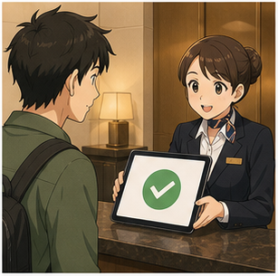

### **Do you have any rooms available?**

— Khách sạn còn phòng không?

Có thể thêm thời gian:

* **Do you have any rooms available tonight?**
* **Do you have any rooms available this weekend?**

### Cách khác

**Do you have any vacancies?**

— Khách sạn còn phòng trống không?

---

## 6.2. Hỏi phòng giá rẻ

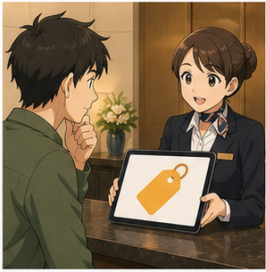

### **Do you have a cheap room?**

— Bạn có phòng giá rẻ không?

Tự nhiên và lịch sự hơn:

* **Do you have any cheaper rooms?**
* **What's your cheapest room?**
* **Do you have anything more affordable?**

---

## 6.3. Hỏi giá phòng

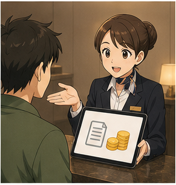

### **How much is the room?**

— Phòng giá bao nhiêu?

Tự nhiên hơn khi cần rõ giá mỗi đêm:

### **How much is the room per night?**

Ví dụ:

* **How much is a standard room per night?**
* **How much is the suite?**

---

## 6.4. Yêu cầu một phòng yên tĩnh

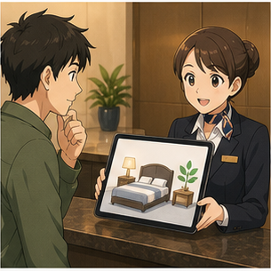

### **I'd like a quiet room, please.**

— Tôi muốn một phòng yên tĩnh.

Có thể nói:

* **I'd prefer a quiet room.**
* **Could I have a quiet room?**
* **Could I have a room away from the elevator?**

---

## 6.5. Hỏi loại phòng

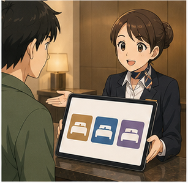

### **What kind of room would you like?**

— Bạn muốn loại phòng nào?

Trả lời:

* **I'd like a standard room.**
* **I'd like a suite.**
* **We'd like a twin room.**
* **We'd like a double room.**

---

## 6.6. Hỏi standard room hay suite

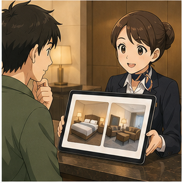

### **Would you like a standard room or a suite?**

— Bạn muốn phòng tiêu chuẩn hay phòng suite?

Trả lời:

* **A standard room, please.**
* **A suite, please.**
* **How much is the difference?**

---

## 6.7. Nói chưa đặt phòng trước

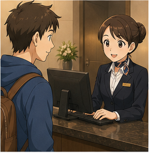

### **We didn't make a reservation.**

— Chúng tôi chưa đặt phòng trước.

Cách tự nhiên khác:

### **We don't have a reservation.**

— Chúng tôi không có đặt phòng.

Sau đó có thể hỏi:

**Do you have any rooms available?**

---

## 6.8. Nói mình có đặt phòng

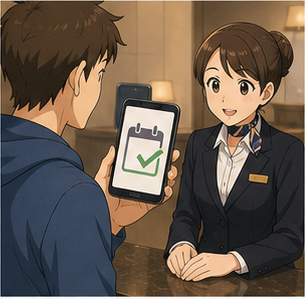

### **I have a reservation.**

— Tôi có đặt phòng.

Tự nhiên hơn:

### **I have a reservation under Nguyen.**

— Tôi có đặt phòng dưới tên Nguyen.

Hoặc:

**I booked a room online.**

— Tôi đã đặt phòng trực tuyến.

---

## 6.9. Hỏi số người

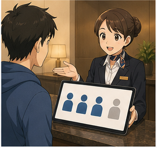

### **Is it just the two of you?**

— Chỉ có hai người thôi phải không?

Hoặc:

### **How many guests will be staying?**

— Sẽ có bao nhiêu khách lưu trú?

Trả lời:

* **Just the two of us.**
* **There are three of us.**
* **It's just me.**

---

## 6.10. Hỏi thời gian lưu trú

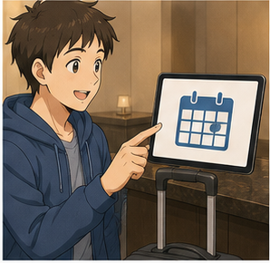

### **How long would you like to stay?**

— Bạn muốn ở bao lâu?

Một câu trong bài:

### **How long do you intend to stay?**

Đúng ngữ pháp nhưng trang trọng hơn.

Trong khách sạn thường dùng:

* **How many nights will you be staying?**
* **How long are you staying?**

Trả lời:

**We'd like to stay for four nights.**

---

## 6.11. Hỏi yêu cầu về phòng

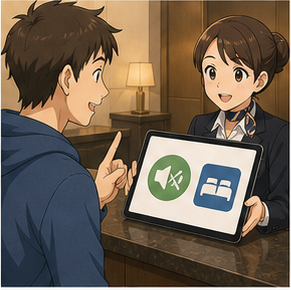

### **Do you have any preferences?**

— Bạn có yêu cầu hoặc sở thích gì không?

Có thể trả lời:

* **I'd like a quiet room.**
* **I'd prefer a higher floor.**
* **I'd like a room with a view.**
* **I'd prefer a room away from the elevator.**

---

## 6.12. Yêu cầu điền biểu mẫu

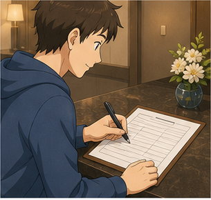

### **Could you please fill out this form?**

— Bạn vui lòng điền biểu mẫu này được không?

Phản hồi:

* **Of course.**
* **Sure.**
* **Where should I sign?**
* **Do I need to fill out everything?**

---

## 6.13. Hỏi xem có thể xem phòng trước không


### **May I see the room first?**

— Tôi có thể xem phòng trước không?

Cách khác:

* **Could I see the room first?**
* **Is it possible to see the room before I check in?**

Phản hồi:

**Yes, of course. Just a moment, please.**

---

## 6.14. Hỏi phòng có được trang bị đầy đủ không

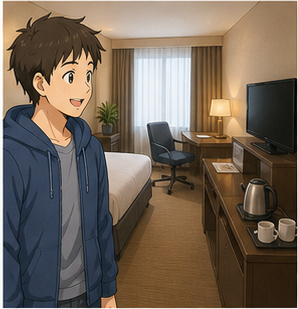

### **Is the room well equipped?**

— Phòng có được trang bị đầy đủ không?

Cụ thể hơn:

* **Does the room have air conditioning?**
* **Does the room have Wi-Fi?**
* **Is there a refrigerator in the room?**
* **Is there a safe in the room?**

---

## 6.15. Nhận chìa khóa hoặc thẻ phòng

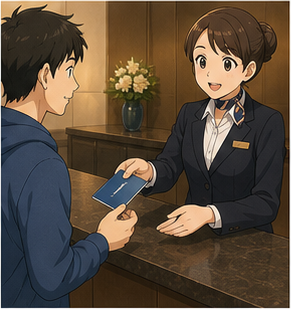

### **Here's your key card.**

— Đây là thẻ phòng của bạn.

Hoặc:

### **This is your key and your receipt.**

— Đây là chìa khóa và biên lai của bạn.

Có thể bổ sung:

**You're in room 305 on the third floor.**

---

## 6.16. Hỏi về Wi-Fi

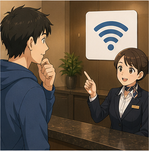

### **Is Wi-Fi available in the room?**

— Trong phòng có Wi-Fi không?

### **What's the Wi-Fi password?**

— Mật khẩu Wi-Fi là gì?

### **Is Wi-Fi free?**

— Wi-Fi có miễn phí không?

---

## 6.17. Hỏi về bữa sáng


### **Is breakfast included?**

— Bữa sáng có được bao gồm không?

### **What time is breakfast?**

— Bữa sáng lúc mấy giờ?

### **Where is breakfast served?**

— Bữa sáng được phục vụ ở đâu?

---

## 6.18. Yêu cầu thêm khăn tắm


### **Could I have some extra towels, please?**

— Tôi có thể xin thêm khăn tắm được không?

Cách khác:

* **Could you send some towels to my room?**
* **We need two more towels, please.**

---

## 6.19. Yêu cầu dọn phòng

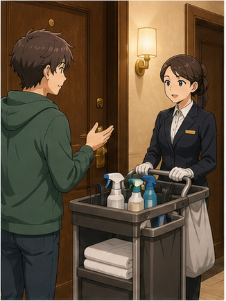

### **Could you send housekeeping to my room?**

— Bạn có thể cho nhân viên dọn phòng lên phòng tôi không?

Hoặc:

### **Could someone clean my room, please?**

---

## 6.20. Báo sự cố trong phòng

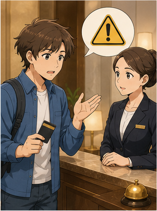

### **There's a problem with my room.**

— Phòng của tôi có vấn đề.

Sau đó nói cụ thể:

* **The air conditioner isn't working.**
* **The shower isn't working.**
* **There's no hot water.**
* **The Wi-Fi isn't working.**
* **The room is too noisy.**

---

## 6.21. Yêu cầu đổi phòng

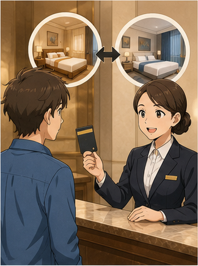

### **Could I change rooms?**

— Tôi có thể đổi phòng không?

### **Could you move me to another room?**

— Bạn có thể chuyển tôi sang phòng khác không?

---

## 6.22. Hỏi về dịch vụ giặt là

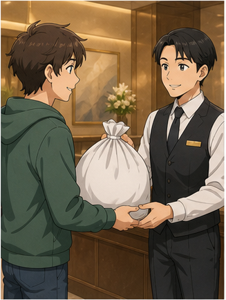

### **Do you have a laundry service?**

— Khách sạn có dịch vụ giặt là không?

### **Do you offer dry cleaning?**

— Khách sạn có dịch vụ giặt khô không?

---

## 6.23. Hỏi giờ trả phòng

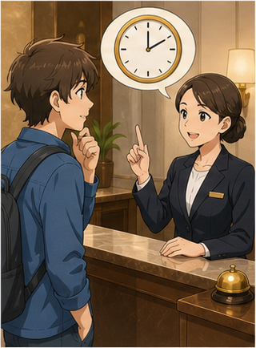

### **What time is check-out?**

— Giờ trả phòng là mấy giờ?

Hoặc:

### **What time do I need to check out?**

---

## 6.24. Trả phòng


### **I'd like to check out, please.**

— Tôi muốn trả phòng.

Nhân viên có thể hỏi:

**What room were you in?**

Khách:

**Room 305.**

---

## 6.25. Hỏi hóa đơn


### **Could I see the bill, please?**

— Tôi có thể xem hóa đơn được không?

### **Could you explain this charge?**

— Bạn có thể giải thích khoản phí này không?

---

## 6.26. Xin biên lai


### **Could I have a receipt, please?**

— Tôi có thể lấy biên lai không?

---

# 7. Các loại phòng và dịch vụ khách sạn phổ biến

| Nội dung              | Tiếng Anh            | Ví dụ                          |
| --------------------- | -------------------- | ------------------------------ |
| Phòng tiêu chuẩn      | **standard room**    | I'd like a standard room.      |
| Phòng suite           | **suite**            | How much is the suite?         |
| Phòng hai giường đơn  | **twin room**        | We'd like a twin room.         |
| Phòng đôi             | **double room**      | Is a double room available?    |
| Phòng đơn             | **single room**      | I need a single room.          |
| Phòng yên tĩnh        | **quiet room**       | I'd prefer a quiet room.       |
| Phòng có tầm nhìn đẹp | **room with a view** | I'd like a room with a view.   |
| Dọn phòng             | **housekeeping**     | Please send housekeeping.      |
| Giặt là               | **laundry service**  | Do you have laundry service?   |
| Giặt khô              | **dry cleaning**     | Do you offer dry cleaning?     |
| Wi-Fi                 | **Wi-Fi**            | What's the Wi-Fi password?     |
| Bữa sáng              | **breakfast**        | Is breakfast included?         |
| Phòng gym             | **gym**              | Where is the gym?              |
| Hồ bơi                | **swimming pool**    | What time does the pool close? |
| Nhận phòng            | **check in**         | I'd like to check in.          |
| Trả phòng             | **check out**        | I'd like to check out.         |

### Sơ đồ


---

# 8. Phân biệt **available**, **vacant**, **occupied** và **fully booked**

## **available**

= có sẵn để khách đặt hoặc sử dụng.

**Do you have any rooms available?**

Đây là cách hỏi tự nhiên nhất khi muốn biết khách sạn còn phòng không.

---

## **vacant**

= đang trống, chưa có người sử dụng.

**The room is vacant.**

Trong giao tiếp với lễ tân, **available** thường tự nhiên hơn **vacant**.

---

## **occupied**

= đang có người sử dụng.

**The room is occupied.**

---

## **fully occupied**

= tất cả phòng đều có người sử dụng.

**All our rooms are fully occupied.**

---

## **fully booked**

= tất cả phòng đã được đặt.

**We're fully booked tonight.**

Đây là một trong những cách phổ biến nhất trong ngành khách sạn.

### Bảng so sánh

| Cụm                | Ý nghĩa              | Ví dụ                         |
| ------------------ | -------------------- | ----------------------------- |
| **available**      | còn có thể đặt       | Do you have a room available? |
| **vacant**         | đang trống           | The room is vacant.           |
| **occupied**       | đang có khách        | The room is occupied.         |
| **fully occupied** | tất cả đang có khách | All rooms are fully occupied. |
| **fully booked**   | tất cả đã được đặt   | We're fully booked tonight.   |

---

# 9. Phát âm trọng tâm

## 9.1. **hotel**

**hotel**
/həʊˈtel/

Trọng âm:

ho-**TEL**

---

## 9.2. **reservation**

**reservation**
/ˌrez.əˈveɪ.ʃən/

Trọng âm:

re-ser-**VA**-tion

---

## 9.3. **reception**

**reception**
/rɪˈsep.ʃən/

Trọng âm:

re-**CEP**-tion

---

## 9.4. **receptionist**

**receptionist**
/rɪˈsep.ʃən.ɪst/

Chú ý phần:

re-**CEP**-tion-ist

---

## 9.5. **standard**

**standard**
/ˈstæn.dəd/

Trọng âm:

**STAN**-dard

---

## 9.6. **suite**

**suite**
/swiːt/

Phát âm giống:

**sweet**

Không đọc thành “su-it”.

---

## 9.7. **quiet**

**quiet**
/ˈkwaɪ.ət/

Hai âm tiết:

**QUI**-et

---

## 9.8. **occupied**

**occupied**
/ˈɒk.jə.paɪd/

Trọng âm:

**OC**-cu-pied

---

## 9.9. **equipped**

**equipped**
/ɪˈkwɪpt/

Âm cuối:

**/kwɪpt/**

---

## 9.10. **receipt**

**receipt**
/rɪˈsiːt/

Trọng âm:

re-**CEIPT**

Chữ **p** không phát âm.

---

## 9.11. **reservation** và **reception**

Không nhầm:

* **reservation** = đặt phòng
* **reception** = lễ tân

---

## 9.12. Nối âm trong hội thoại

### **Do you have a reservation?**

Luyện:

`Do-you-have-a-reservation?`

### **How long would you like to stay?**

Luyện:

`How-long-would-you-like-to-stay?`

### **Could you please fill out this form?**

Luyện:

`Could-you-please-fill-out-this-form?`

### **I'd like a quiet room.**

Luyện:

`I'd-like-a-quiet-room.`

---

# 10. Hội thoại thực tế — Real-Life Conversation

## Hội thoại chính — Nhận phòng khi chưa đặt trước


**Receptionist:** Good evening. Welcome to the Sunrise Hotel. How can I help you?

**Guest:** Hi. We don't have a reservation. Do you have any rooms available?

**Receptionist:** Yes. Is it just the two of you?

**Guest:** Yes, just the two of us.

**Receptionist:** How many nights would you like to stay?

**Guest:** We'd like to stay for four nights.

**Receptionist:** Would you like a standard room or a suite?

**Guest:** A standard room, please. We'd also like a quiet room.

**Receptionist:** Certainly. We have a quiet room on the fifth floor.

**Guest:** Great. How much is it per night?

**Receptionist:** It's $80 per night, including breakfast.

**Guest:** That sounds good. May I see the room first?

**Receptionist:** Of course. Just a moment, please.

### Nội dung giao tiếp

```text
Chào hỏi
    ↓
Hỏi còn phòng
    ↓
Xác nhận số khách
    ↓
Nói số đêm
    ↓
Chọn loại phòng
    ↓
Nói yêu cầu
    ↓
Hỏi giá
    ↓
Xác nhận
```

---

## Hội thoại 2 — Nhận phòng khi đã đặt trước


**Receptionist:** Good afternoon. Do you have a reservation?

**Mai:** Yes. I have a reservation under Mai Nguyen.

**Receptionist:** Let me check. Yes, I found it. A double room for three nights.

**Mai:** That's right.

**Receptionist:** Could I see your passport, please?

**Mai:** Of course. Here you are.

**Receptionist:** Thank you. Could you please fill out this form?

**Mai:** Sure. Where should I sign?

**Receptionist:** At the bottom, please.

**Mai:** Done.

**Receptionist:** Thank you. Here's your key card. You're in room 508.

**Mai:** Thanks. Is breakfast included?

**Receptionist:** Yes. Breakfast is served from 6:30 to 10:00.

**Mai:** Perfect. Thank you.

---

## Hội thoại 3 — Yêu cầu dịch vụ trong phòng


**Guest:** Hello. This is room 305.

**Receptionist:** Hello. How can I help you?

**Guest:** Could you send some extra towels to my room, please?

**Receptionist:** Certainly. How many would you like?

**Guest:** Two, please.

**Receptionist:** No problem. Housekeeping will bring them up shortly.

**Guest:** Thank you. Also, do you have a laundry service?

**Receptionist:** Yes, we do. There's a laundry bag and a price list in your room.

**Guest:** Great. Thanks for your help.

**Receptionist:** You're welcome.

---

## Hội thoại 4 — Báo sự cố trong phòng


**Guest:** Hello. There's a problem with my room.

**Receptionist:** I'm sorry to hear that. What's wrong?

**Guest:** The air conditioner isn't working.

**Receptionist:** I see. What room are you in?

**Guest:** Room 412.

**Receptionist:** We'll send someone to check it.

**Guest:** Thank you. The room is also quite warm.

**Receptionist:** If we can't fix it quickly, we can move you to another room.

**Guest:** That would be great. Thank you.

**Receptionist:** You're welcome, and we apologize for the inconvenience.

---

## Hội thoại 5 — Hỏi dịch vụ khách sạn


**Guest:** Excuse me. Could you tell me where the gym is?

**Receptionist:** Certainly. It's on the second floor.

**Guest:** What time does it open?

**Receptionist:** It opens at 6 a.m. and closes at 10 p.m.

**Guest:** Is there a swimming pool too?

**Receptionist:** Yes. The pool is on the ground floor.

**Guest:** Great. Is Wi-Fi free?

**Receptionist:** Yes. The Wi-Fi password is on your key card holder.

**Guest:** Perfect. Thanks for letting me know.

**Receptionist:** My pleasure.

---

## Hội thoại 6 — Trả phòng


**Guest:** Good morning. I'd like to check out, please.

**Receptionist:** Certainly. What room were you in?

**Guest:** Room 508.

**Receptionist:** Just a moment, please. Here's your bill.

**Guest:** Thank you. Is breakfast included in this amount?

**Receptionist:** Yes, it is.

**Guest:** Great. Can I pay by card?

**Receptionist:** Of course.

**Guest:** Could I have a receipt, please?

**Receptionist:** Certainly. Here's your receipt.

**Guest:** Thank you. We had a very nice stay.

**Receptionist:** We're glad to hear that. Have a safe trip!

---

# 11. Natural Expressions — Cách nói tự nhiên

| Cụm từ                                      | Nghĩa                                     | Khi dùng       |
| ------------------------------------------- | ----------------------------------------- | -------------- |
| **Do you have any rooms available?**        | Khách sạn còn phòng không?                | Tìm phòng      |
| **I have a reservation.**                   | Tôi có đặt phòng.                         | Check-in       |
| **We don't have a reservation.**            | Chúng tôi chưa đặt phòng.                 | Walk-in        |
| **I'd like a quiet room.**                  | Tôi muốn phòng yên tĩnh.                  | Yêu cầu        |
| **I'd prefer a higher floor.**              | Tôi muốn tầng cao hơn.                    | Yêu cầu        |
| **How much is it per night?**               | Giá bao nhiêu mỗi đêm?                    | Hỏi giá        |
| **How many nights would you like to stay?** | Bạn muốn ở mấy đêm?                       | Check-in       |
| **Just the two of us.**                     | Chỉ hai chúng tôi.                        | Số khách       |
| **A standard room, please.**                | Một phòng tiêu chuẩn nhé.                 | Chọn phòng     |
| **Could I see the room first?**             | Tôi có thể xem phòng trước không?         | Kiểm tra phòng |
| **Could you please fill out this form?**    | Vui lòng điền phiếu này.                  | Check-in       |
| **Here you are.**                           | Đây ạ.                                    | Đưa giấy tờ    |
| **Here's your key card.**                   | Đây là thẻ phòng của bạn.                 | Check-in       |
| **Is breakfast included?**                  | Bữa sáng có bao gồm không?                | Dịch vụ        |
| **What's the Wi-Fi password?**              | Mật khẩu Wi-Fi là gì?                     | Dịch vụ        |
| **Could I have some extra towels?**         | Tôi có thể xin thêm khăn không?           | Dịch vụ        |
| **Could you send housekeeping?**            | Có thể cho nhân viên dọn phòng đến không? | Dịch vụ        |
| **There's a problem with my room.**         | Phòng tôi có vấn đề.                      | Báo lỗi        |
| **The air conditioner isn't working.**      | Điều hòa không hoạt động.                 | Báo lỗi        |
| **Could I change rooms?**                   | Tôi có thể đổi phòng không?               | Báo lỗi        |
| **Do you have laundry service?**            | Có dịch vụ giặt là không?                 | Dịch vụ        |
| **I'd like to check out.**                  | Tôi muốn trả phòng.                       | Check-out      |
| **Could I see the bill?**                   | Tôi có thể xem hóa đơn không?             | Thanh toán     |
| **Can I pay by card?**                      | Tôi có thể trả bằng thẻ không?            | Thanh toán     |
| **Could I have a receipt?**                 | Tôi có thể lấy biên lai không?            | Check-out      |
| **We had a nice stay.**                     | Chúng tôi đã có kỳ lưu trú rất tốt.       | Kết thúc       |

---

# 12. Lỗi thường gặp — Common Mistakes

## Lỗi 1: Dùng **I want** trong mọi yêu cầu

Không sai hoàn toàn:

△ **I want a quiet room.**

Nhưng trong khách sạn nên lịch sự hơn:

✅ **I'd like a quiet room.**

✅ **Could I have a quiet room?**

---

## Lỗi 2: Nhầm **reservation** với **reception**

❌ **I have a reception.**

✅ **I have a reservation.**

* **reservation** = đặt phòng
* **reception** = quầy lễ tân

---

## Lỗi 3: Nói **I have reservation**

❌ **I have reservation.**

✅ **I have a reservation.**

**reservation** là danh từ đếm được.

---

## Lỗi 4: Nói sai thời gian lưu trú

❌ **I stay four nights.**

Nếu nói kế hoạch:

✅ **I'd like to stay for four nights.**

✅ **I'm staying for four nights.**

---

## Lỗi 5: Dùng **during four nights**

❌ **We're staying during four nights.**

✅ **We're staying for four nights.**

### Cấu trúc

`for + khoảng thời gian`

---

## Lỗi 6: Nhầm **suite** với cách đọc theo chữ viết

❌ đọc gần như “su-it”

✅ **suite** /swiːt/

Âm giống **sweet**.

---

## Lỗi 7: Hỏi phòng còn trống bằng câu không tự nhiên

△ **Are there any beds vacant?**

Tự nhiên hơn:

✅ **Do you have any rooms available?**

Hoặc:

✅ **Do you have any vacancies?**

---

## Lỗi 8: Nhầm **room** và **bed**

**room** = phòng.

**bed** = giường.

Một khách sạn có thể còn giường nhưng không nhất thiết còn một phòng riêng.

---

## Lỗi 9: Nhầm **twin room** và **double room**

### **twin room**

Thường có **hai giường đơn**.

### **double room**

Thường dành cho hai người, thường có **một giường đôi**.

---

## Lỗi 10: Dùng sai **fill out**

❌ **Fill this form.**

Có thể hiểu, nhưng tự nhiên hơn:

✅ **Fill out this form.**

Anh-Anh cũng thường dùng:

✅ **Fill in this form.**

---

## Lỗi 11: Nói **make check-in**

❌ **I want to make check-in.**

✅ **I'd like to check in.**

---

## Lỗi 12: Nói **make check-out**

❌ **I want to make check-out.**

✅ **I'd like to check out.**

---

## Lỗi 13: Nhầm **bill** và **receipt**

### **bill**

= hóa đơn cho biết bạn cần trả bao nhiêu.

**Could I see the bill?**

### **receipt**

= biên lai chứng minh bạn đã thanh toán.

**Could I have a receipt?**

---

## Lỗi 14: Nói quá trực tiếp khi báo lỗi

△ **My air conditioner is broken. Fix it.**

Lịch sự hơn:

✅ **The air conditioner isn't working. Could you send someone to check it, please?**

---

## Lỗi 15: Dùng sai **on room 305**

❌ **I'm on room 305.**

✅ **I'm in room 305.**

---

## Lỗi 16: Nhầm **at reception** và **at the receptionist**

✅ **Ask at reception.**

✅ **Ask the receptionist.**

Không nên:

❌ **Ask at the receptionist.**

---

## Lỗi 17: Nói **How much the room?**

❌ **How much the room?**

✅ **How much is the room?**

Tự nhiên hơn:

✅ **How much is it per night?**

---

## Lỗi 18: Trả lời quá ngắn

Ví dụ:

**Receptionist:** Do you have any preferences?

△ **Guest:** Yes.

Câu này khiến hội thoại dừng lại.

Tốt hơn:

✅ **Yes. I'd prefer a quiet room on a higher floor.**

---

# 13. Luyện tập có hướng dẫn

## Bài 1 — Nối từ với nghĩa

1. reservation
2. receptionist
3. suite
4. receipt
5. vacant
6. twin room

A. phòng hai giường đơn
B. nhân viên lễ tân
C. phòng suite
D. đặt phòng
E. biên lai
F. còn trống

<details>
<summary>Đáp án</summary>

1–D
2–B
3–C
4–E
5–F
6–A

</details>

---

## Bài 2 — Điền từ vào chỗ trống

Dùng:

`reservation` · `quiet` · `available` · `nights` · `receipt`

1. Do you have any rooms ______ tonight?
2. I have a ______ under Nguyen.
3. I'd like a ______ room, please.
4. We're staying for four ______.
5. Could I have a ______, please?

<details>
<summary>Đáp án</summary>

1. available
2. reservation
3. quiet
4. nights
5. receipt

</details>

---

## Bài 3 — Chọn câu đúng

### 1. Bạn muốn hỏi khách sạn còn phòng không.

* A. Do you have any rooms available?
* B. Do you have room free?
* C. Have you any room empty?

**Đáp án:** A

---

### 2. Bạn muốn một phòng yên tĩnh.

* A. I want room quiet.
* B. I'd like a quiet room.
* C. I'd like quiet a room.

**Đáp án:** B

---

### 3. Bạn có đặt phòng trước.

* A. I have a reservation.
* B. I have reservation.
* C. I am reservation.

**Đáp án:** A

---

### 4. Bạn muốn ở bốn đêm.

* A. We'd like to stay for four nights.
* B. We'd like stay four night.
* C. We'd like to stay during four nights.

**Đáp án:** A

---

### 5. Bạn muốn trả phòng.

* A. I'd like check out.
* B. I'd like to check out.
* C. I'd like to make check out.

**Đáp án:** B

---

## Bài 4 — **available**, **occupied** hay **fully booked**

1. Do you have any rooms ______ tonight?
2. Sorry, we're ______ tonight.
3. Room 204 is currently ______.
4. This room is ______ if you'd like to see it.

<details>
<summary>Đáp án gợi ý</summary>

1. available
2. fully booked
3. occupied
4. available / vacant

</details>

---

## Bài 5 — **bill** hay **receipt**

1. Could I see the ______ before I pay?
2. I paid by card and asked for a ______.
3. There's an extra charge on my ______.
4. Keep the ______ in case you need proof of payment.

<details>
<summary>Đáp án</summary>

1. bill
2. receipt
3. bill
4. receipt

</details>

---

## Bài 6 — Hoàn thành hội thoại check-in

**Receptionist:** Good evening. Do you have a ______?

**Guest:** No, we don't. Do you have any rooms ______?

**Receptionist:** Yes. How many ______ would you like to stay?

**Guest:** Three nights.

**Receptionist:** Would you like a standard room or a ______?

**Guest:** A standard room, please. We'd like a ______ room.

**Receptionist:** Certainly. Could you please fill out this ______?

**Guest:** Of course.

<details>
<summary>Đáp án</summary>

1. reservation
2. available
3. nights
4. suite
5. quiet
6. form

</details>

---

## Bài 7 — Hoàn thành hội thoại báo sự cố

Dùng:

`working` · `room` · `help` · `someone` · `problem`

**Guest:** Hello. There's a ______ with my room.

**Receptionist:** I'm sorry. How can I ______?

**Guest:** The air conditioner isn't ______.

**Receptionist:** What ______ are you in?

**Guest:** Room 502.

**Receptionist:** We'll send ______ to check it.

<details>
<summary>Đáp án</summary>

1. problem
2. help
3. working
4. room
5. someone

</details>

---

## Bài 8 — Sắp xếp thành hội thoại

Sắp xếp các câu:

A. **We'd like to stay for three nights.**
B. **Do you have any rooms available?**
C. **Yes. How many nights would you like to stay?**
D. **Good evening. How can I help you?**
E. **We don't have a reservation.**

<details>
<summary>Đáp án gợi ý</summary>

D → E → B → C → A

</details>

---

# 14. Speaking Challenge — Thử thách nói

## Nhiệm vụ 1 — Đọc mẫu câu

Đọc các câu sau thành tiếng:

* **Do you have any rooms available?**
* **I have a reservation under Nguyen.**
* **We don't have a reservation.**
* **I'd like a quiet room.**
* **How much is the room per night?**
* **We'd like to stay for four nights.**
* **Could you please fill out this form?**
* **May I see the room first?**
* **Is breakfast included?**
* **What's the Wi-Fi password?**
* **Could I have some extra towels?**
* **There's a problem with my room.**
* **The air conditioner isn't working.**
* **I'd like to check out, please.**
* **Could I have a receipt?**

Đọc mỗi câu hai lần:

* lần 1 chậm và rõ;
* lần 2 với tốc độ hội thoại tự nhiên.

---

## Nhiệm vụ 2 — Mô phỏng check-in

Hãy tưởng tượng bạn đến khách sạn mà **chưa đặt phòng trước**.

Bạn cần nói ít nhất 5 câu và sử dụng:

* **We don't have a reservation.**
* **Do you have any rooms available?**
* **We'd like to stay for ... nights.**
* **I'd like a quiet room.**
* **How much is it per night?**

Ví dụ:

> **Good evening. We don't have a reservation. Do you have any rooms available? We'd like to stay for three nights. We'd prefer a quiet twin room. How much is it per night?**

---

## Nhiệm vụ 3 — Nhận phòng khi đã đặt trước

Tình huống:

> Bạn đã đặt một phòng đôi trong ba đêm.

Phải sử dụng ít nhất:

* **I have a reservation.**
* **It's under ...**
* **Here you are.**
* **Is breakfast included?**
* **What's the Wi-Fi password?**

---

## Nhiệm vụ 4 — Báo vấn đề trong phòng

Tình huống:

> Điều hòa không hoạt động và phòng rất nóng.

Phải sử dụng:

* **There's a problem with my room.**
* **The air conditioner isn't working.**
* **Could you send someone to check it?**
* **Could I change rooms if necessary?**
* **Thank you for your help.**

---

## Nhiệm vụ 5 — Hội thoại 8 lượt

Tạo một đoạn hội thoại có ít nhất:

* 1 câu nói về reservation;
* 1 câu hỏi về phòng còn trống;
* 1 câu nói số đêm;
* 1 yêu cầu về loại phòng;
* 1 câu hỏi về giá;
* 1 câu hỏi về tiện nghi;
* 1 câu lịch sự với **could**;
* 1 câu kết thúc.

---

## Nhiệm vụ 6 — Ghi âm

Ghi âm từ **45–60 giây**, sau đó kiểm tra:

* [ ] Tôi có thể hỏi khách sạn còn phòng không.
* [ ] Tôi có thể nói mình có hoặc chưa đặt phòng.
* [ ] Tôi có thể nói số đêm muốn ở.
* [ ] Tôi có thể hỏi giá phòng.
* [ ] Tôi phân biệt **standard room** và **suite**.
* [ ] Tôi biết **twin room** là gì.
* [ ] Tôi có thể yêu cầu một **quiet room**.
* [ ] Tôi có thể hỏi về Wi-Fi.
* [ ] Tôi có thể hỏi về breakfast.
* [ ] Tôi có thể yêu cầu housekeeping.
* [ ] Tôi có thể báo một sự cố trong phòng.
* [ ] Tôi có thể nói **I'd like to check out.**
* [ ] Tôi phân biệt **bill** và **receipt**.
* [ ] Tôi có thể duy trì hội thoại ít nhất 45 giây.

---

# 15. Practice Mission — Nhiệm vụ thực tế

Trong hôm nay, hãy tạo một cuộc hội thoại theo công thức:

> **Arrival → Reservation → Room → Preference → Service → Problem → Solution → Check-out**

Ví dụ:

> **Good evening. I have a reservation under Nguyen.**
> ↓
> **Certainly. How many nights will you be staying?**
> ↓
> **Three nights. I'd prefer a quiet room.**
> ↓
> **We have one on the fifth floor.**
> ↓
> **Is Wi-Fi included?**
> ↓
> **Yes, it is.**
> ↓
> **Great. Could you also tell me what time breakfast starts?**
> ↓
> **Breakfast starts at 6:30 a.m.**
> ↓
> **Perfect. Thank you.**

Sau đó viết hoặc nói một đoạn hội thoại **8–10 lượt** cho một trong các tình huống:

* nhận phòng khi đã đặt trước;
* nhận phòng khi chưa đặt trước;
* hỏi phòng giá rẻ;
* yêu cầu phòng yên tĩnh;
* hỏi phòng twin hoặc double;
* hỏi Wi-Fi;
* hỏi giờ ăn sáng;
* xin thêm khăn;
* yêu cầu dọn phòng;
* yêu cầu dịch vụ giặt là;
* báo điều hòa không hoạt động;
* báo không có nước nóng;
* yêu cầu đổi phòng;
* hỏi giờ check-out;
* kiểm tra hóa đơn;
* yêu cầu biên lai.

---

# 16. Tự đánh giá cuối bài

Đánh dấu khi bạn có thể thực hiện mà không nhìn bài:

* [ ] Tôi có thể hỏi **Do you have any rooms available?**
* [ ] Tôi có thể nói **I have a reservation.**
* [ ] Tôi có thể nói **We don't have a reservation.**
* [ ] Tôi biết **reservation** khác **reception**.
* [ ] Tôi có thể hỏi giá phòng.
* [ ] Tôi có thể nói **I'd like a quiet room.**
* [ ] Tôi phân biệt **standard room** và **suite**.
* [ ] Tôi biết **twin room** là gì.
* [ ] Tôi biết **double room** là gì.
* [ ] Tôi có thể nói số đêm muốn ở.
* [ ] Tôi có thể hiểu câu **Do you have any preferences?**
* [ ] Tôi có thể điền form khi check-in.
* [ ] Tôi hiểu **fill out this form**.
* [ ] Tôi có thể hỏi **May I see the room first?**
* [ ] Tôi có thể hỏi phòng có Wi-Fi không.
* [ ] Tôi có thể hỏi **Is breakfast included?**
* [ ] Tôi có thể xin thêm khăn.
* [ ] Tôi có thể yêu cầu housekeeping.
* [ ] Tôi có thể báo một vấn đề trong phòng.
* [ ] Tôi có thể yêu cầu đổi phòng.
* [ ] Tôi biết **laundry service** là gì.
* [ ] Tôi biết **dry cleaning** là gì.
* [ ] Tôi có thể nói **I'd like to check out.**
* [ ] Tôi phân biệt **bill** và **receipt**.
* [ ] Tôi có thể duy trì hội thoại tại khách sạn ít nhất 45 giây.

---

# 17. Câu hỏi mở cuối bài

**Imagine you arrive at a hotel in another country late in the evening. You don't have a reservation, you need a quiet room for three nights, and after checking in you discover that the air conditioner is not working. How would you speak to the receptionist from arrival until the problem is solved?**

*Hãy tưởng tượng bạn đến một khách sạn ở nước ngoài vào buổi tối muộn. Bạn chưa đặt phòng, cần một phòng yên tĩnh trong ba đêm và sau khi nhận phòng bạn phát hiện điều hòa không hoạt động. Bạn sẽ nói chuyện với nhân viên lễ tân từ lúc đến khách sạn cho tới khi vấn đề được giải quyết như thế nào?*

---

# 18. Ghi chú dành cho giảng viên

* **Module:** 03 — Travel Ready / Tiếng Anh cho những chuyến đi
* **Chủ điểm:** At the Hotel — Hotel Check-in, Services & Check-out
* **Thời lượng video:** 8–12 phút
* **Luyện nói:** 5–10 phút

### Trọng tâm từ vựng

* hotel
* reservation
* reception
* receptionist
* room
* standard room
* suite
* quiet
* available
* vacant
* occupied
* fully occupied
* fully booked
* twin room
* twin bed
* double room
* well equipped
* facilities
* amenities
* key
* key card
* form
* fill out
* stay
* night
* preference
* receipt
* bill
* housekeeping
* clean
* laundry service
* dry cleaning
* check in
* check out

### Trọng tâm cấu trúc

* **Do you have any rooms available?**
* **Do you have any vacancies?**
* **Do you have any cheaper rooms?**
* **How much is the room?**
* **How much is it per night?**
* **I'd like a quiet room.**
* **What kind of room would you like?**
* **Would you like a standard room or a suite?**
* **I have a reservation.**
* **I have a reservation under ...**
* **We don't have a reservation.**
* **Is it just the two of you?**
* **How many nights would you like to stay?**
* **We'd like to stay for four nights.**
* **Do you have any preferences?**
* **Could you please fill out this form?**
* **May I see the room first?**
* **Is the room well equipped?**
* **Here's your key card.**
* **Is breakfast included?**
* **What's the Wi-Fi password?**
* **Could I have some extra towels?**
* **Could you send housekeeping?**
* **There's a problem with my room.**
* **The air conditioner isn't working.**
* **Could I change rooms?**
* **Do you have a laundry service?**
* **What time is check-out?**
* **I'd like to check out, please.**
* **Could I see the bill?**
* **Could I have a receipt?**

### Trọng tâm phát âm

* **hotel**
* **reservation**
* **reception**
* **receptionist**
* **standard**
* **suite**
* **quiet**
* **available**
* **occupied**
* **equipped**
* **receipt**

### Lưu ý ngôn ngữ

* Khi yêu cầu dịch vụ trong khách sạn, **I'd like...** và **Could I have...?** lịch sự hơn **I want...**.

Ví dụ:

* **I'd like a quiet room.**

* **Could I have some extra towels?**

* **reservation** = đặt phòng.

* **reception** = quầy/khu vực lễ tân.

* **receptionist** = nhân viên lễ tân.

* Khi hỏi khách sạn còn phòng, ưu tiên:

  * **Do you have any rooms available?**
  * **Do you have any vacancies?**

thay cho các cấu trúc dịch trực tiếp từ tiếng Việt.

* **available** = có sẵn để đặt.

* **vacant** = đang trống.

* **occupied** = đang được sử dụng.

* **fully booked** = tất cả đã được đặt.

* **suite** đọc là:

  * /swiːt/

  giống **sweet**.

* **twin room** thường có hai giường đơn.

* **double room** thường dành cho hai người và thường có một giường đôi.

* Khi nói thời gian lưu trú:

  * **stay for three nights**
  * **stay for a week**

* **How long do you intend to stay?** xuất hiện trong bài và hoàn toàn đúng, nhưng hơi trang trọng.

Với A1–A2 nên ưu tiên:

* **How long would you like to stay?**

* **How many nights will you be staying?**

* **fill out a form** phổ biến trong tiếng Anh-Mỹ.

* **fill in a form** cũng phổ biến trong tiếng Anh-Anh.

* **check in** là động từ:

  * **I'd like to check in.**

* **check-in** có thể dùng như danh từ/tính từ:

  * **check-in time**

* **check out** là động từ:

  * **I'd like to check out.**

* **check-out** có thể dùng như danh từ:

  * **What time is check-out?**

* **bill** = số tiền/hóa đơn cần thanh toán.

* **receipt** = biên lai sau khi thanh toán.

* Chữ **p** trong **receipt** không được phát âm.

* Khi báo sự cố, dạy người học theo công thức:

```text
Problem
    ↓
Room number
    ↓
Request
    ↓
Confirm solution
```

Ví dụ:

> **There's a problem with my room.**
> **The air conditioner isn't working.**
> **I'm in room 412.**
> **Could you send someone to check it?**

---

### Hoạt động gợi ý — Hotel Preference Survey

Chia lớp thành cặp.

Mỗi người hỏi bạn cùng cặp:

> **What kind of hotel do you usually stay in?**

> **Do you prefer a twin room or a double room?**

> **Do you like staying on a higher floor?**

> **Would you prefer a quiet room?**

> **Which hotel facilities are important to you?**

> **Do you usually eat breakfast at the hotel?**

> **Do you use hotel Wi-Fi?**

Sau đó giới thiệu lại bạn cùng cặp bằng 4–5 câu.

Ví dụ:

> **Mai prefers quiet hotels. She usually chooses a double room and likes staying on a higher floor. Free Wi-Fi and breakfast are important to her. She also likes hotels with a swimming pool.**

---

### Role-play mẫu — Nhận phòng khi chưa đặt trước

**Người A nhận:**

> Bạn và một người bạn đến khách sạn. Hai người chưa đặt phòng và muốn ở bốn đêm.

Người A phải sử dụng ít nhất:

* **We don't have a reservation.**
* **Do you have any rooms available?**
* **Just the two of us.**
* **We'd like to stay for four nights.**
* **I'd like a quiet room.**
* **How much is it per night?**

**Người B nhận:**

> Bạn là receptionist. Khách sạn còn standard room và suite.

Người B phải sử dụng ít nhất:

* **Welcome. How can I help you?**
* **Is it just the two of you?**
* **How many nights would you like to stay?**
* **Would you like a standard room or a suite?**
* **Do you have any preferences?**
* **Could you please fill out this form?**

---

### Role-play mẫu — Nhận phòng khi đã đặt trước

**Người A nhận:**

> Bạn đã đặt một double room trong ba đêm.

Phải sử dụng:

* **I have a reservation under ...**
* **Here you are.**
* **Is breakfast included?**
* **What's the Wi-Fi password?**
* **What time is check-out?**

**Người B nhận:**

> Bạn là receptionist.

Phải sử dụng:

* **Let me check.**
* **Yes, I found your reservation.**
* **Could I see your passport, please?**
* **Please fill out this form.**
* **Here's your key card.**
* **You're in room ...**

Kết thúc bằng:

> **Enjoy your stay.**

---

### Role-play mẫu — Phòng có sự cố

**Người A nhận:**

> Điều hòa trong phòng không hoạt động.

Người A phải sử dụng:

* **There's a problem with my room.**
* **The air conditioner isn't working.**
* **I'm in room ...**
* **Could you send someone to check it?**
* **Could I change rooms if it can't be fixed?**

**Người B nhận:**

> Bạn là receptionist.

Người B phải sử dụng:

* **I'm sorry to hear that.**
* **What room are you in?**
* **We'll send someone to check it.**
* **If necessary, we can move you to another room.**
* **We apologize for the inconvenience.**

---

### Role-play mẫu — Yêu cầu dịch vụ

**Người A nhận:**

> Bạn cần hai khăn tắm mới và muốn hỏi về dịch vụ giặt là.

Phải sử dụng:

* **Could I have two extra towels?**
* **Could you send them to my room?**
* **Do you have a laundry service?**
* **Do you offer dry cleaning?**
* **How much does it cost?**

**Người B nhận:**

> Bạn là receptionist.

Phải sử dụng:

* **Sure, no problem.**
* **Housekeeping will bring them up.**
* **Yes, we have a laundry service.**
* **The price list is in your room.**

---

### Role-play mẫu — Trả phòng

**Người A nhận:**

> Bạn muốn trả phòng, kiểm tra hóa đơn và xin biên lai.

Phải sử dụng:

* **I'd like to check out, please.**
* **I was in room ...**
* **Could I see the bill?**
* **Can I pay by card?**
* **Could I have a receipt?**

**Người B nhận:**

> Bạn là receptionist.

Phải sử dụng:

* **Certainly.**
* **Just a moment, please.**
* **Here's your bill.**
* **You can pay by card.**
* **Here's your receipt.**
* **Have a safe trip.**

Kết thúc bằng:

> **Thank you. We had a very nice stay.**

---

### Chuỗi role-play hoàn chỉnh

Có thể cho học viên luyện toàn bộ trải nghiệm khách sạn:


Mỗi cặp học viên phải duy trì hội thoại từ **12–16 lượt**, sử dụng tối thiểu:

* 5 từ vựng về phòng;
* 3 câu hỏi;
* 3 yêu cầu lịch sự;
* 1 tình huống gặp vấn đề;
* 1 giải pháp;
* 1 đoạn check-out.

Mục tiêu cuối cùng là giúp người học có thể xử lý một trải nghiệm khách sạn cơ bản bằng tiếng Anh mà không cần học thuộc nguyên một đoạn hội thoại.
