# LESSON 15 — NÓI VỀ SÁCH VÀ NỘI DUNG YÊU THÍCH

> **Module 03 — Travel Ready / Tiếng Anh cho những chuyến đi**
> **Chủ đề:** Books, Magazines & Reading — Sách, tạp chí, bài viết và thói quen đọc
> **Trình độ gợi ý:** A1–A2
> **Thời lượng:** 8–12 phút học bài + 5–10 phút luyện nói

---

## 1. Tình huống thực tế

Đọc sách, báo, tạp chí và các bài viết trực tuyến là những hoạt động rất phổ biến. Trong giao tiếp hằng ngày, bạn có thể cần nói về:

* loại sách mình thích;
* cuốn sách vừa đọc xong;
* một cuốn tiểu thuyết thú vị;
* nội dung hoặc cốt truyện của một cuốn sách;
* nhân vật mình yêu thích;
* những tình tiết bất ngờ trong truyện;
* một câu chuyện cảm động;
* một cuốn sách dễ đọc;
* truyện trinh thám;
* truyện khoa học viễn tưởng;
* bài viết trên báo hoặc tạp chí;
* số mới nhất của một tạp chí;
* đăng ký đọc tạp chí;
* giá đăng ký;
* một bài viết thú vị về môi trường;
* việc đọc sách có phải là sở thích của mình hay không.

Bạn cần biết cách nói những câu như:

* **Do you like reading books?**
* **I've just finished a novel.**
* **What do you think of the novel you just finished?**
* **It's very readable.**
* **It's a moving story.**
* **I couldn't stop thinking about it.**
* **It attracts your attention.**
* **What do you like best about it?**
* **I enjoy reading detective stories.**
* **The plot is full of twists and turns.**
* **I like the main character.**
* **Did you see that interesting article?**
* **Science fiction books are popular with young people.**
* **Is that the latest issue?**
* **I've been a subscriber for three years.**
* **How much does it cost to subscribe?**

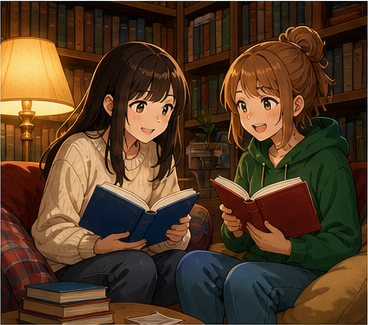

---

## 2. Mục tiêu bài học

Sau bài học, người học có thể:

1. Hỏi người khác có thích đọc sách không.
2. Nói về thói quen đọc sách.
3. Nói mình vừa đọc xong một cuốn sách.
4. Hỏi ý kiến về một cuốn sách.
5. Đưa ra nhận xét đơn giản về một cuốn tiểu thuyết.
6. Nói một câu chuyện dễ đọc hay khó đọc.
7. Nói một câu chuyện cảm động.
8. Nói về cốt truyện.
9. Nói về nhân vật chính.
10. Dùng **twists and turns** để nói về những tình tiết bất ngờ.
11. Nói về thể loại truyện trinh thám.
12. Nói về sách khoa học viễn tưởng.
13. Nói về báo và tạp chí.
14. Hỏi về số mới nhất của một tạp chí.
15. Nói về một bài báo thú vị.
16. Hỏi về việc đăng ký tạp chí.
17. Dùng đúng **enjoy + V-ing**.
18. Duy trì một đoạn hội thoại 6–8 lượt về sách hoặc nội dung yêu thích.

---

## 3. Sơ đồ giao tiếp

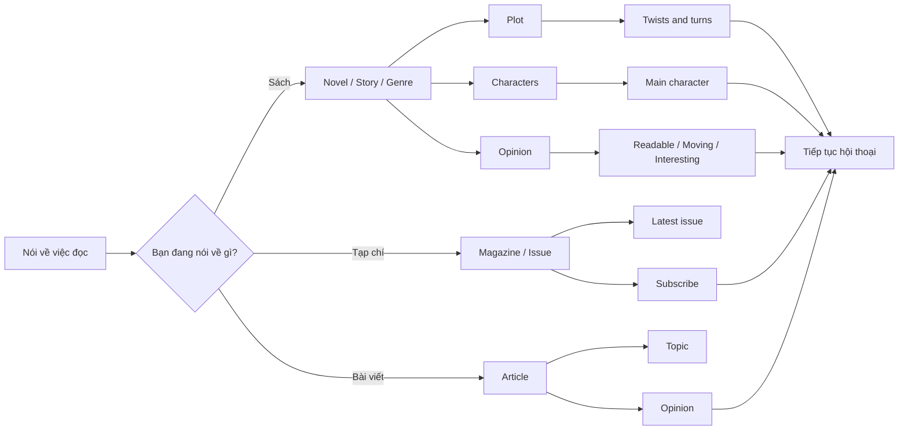

### Mẫu đơn giản

`Do you like reading books?`
→ `Yes, I do.`
→ `What kind of books do you like?`
→ `I enjoy reading detective stories.`
→ `What do you like best about them?`
→ `I like the plots and the twists and turns.`

---

# 4. Từ vựng trọng tâm — Core Vocabulary

## 4.1. **book** /bʊk/

**Nghĩa:** sách

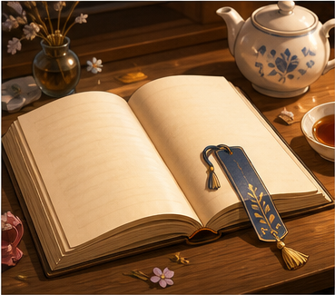

**Ví dụ:**

* **Do you like reading books?**
  — Bạn có thích đọc sách không?

* **This is one of my favorite books.**
  — Đây là một trong những cuốn sách yêu thích của tôi.

---

## 4.2. **novel** /ˈnɒv.əl/

**Nghĩa:** tiểu thuyết

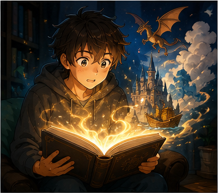

**Ví dụ:**

* **I've just finished a novel.**
  — Tôi vừa đọc xong một cuốn tiểu thuyết.

* **What do you think of the novel?**
  — Bạn nghĩ gì về cuốn tiểu thuyết?

---

## 4.3. **story** /ˈstɔː.ri/

**Nghĩa:** câu chuyện

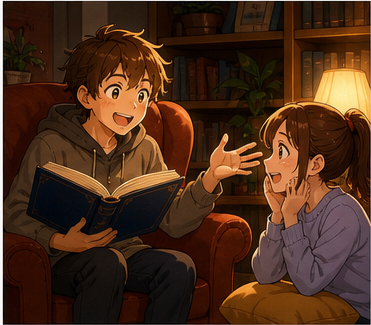

**Ví dụ:**

* **It's a very simple story.**
  — Đó là một câu chuyện rất đơn giản.

* **It's a moving story.**
  — Đó là một câu chuyện cảm động.

---

## 4.4. **plot** /plɒt/

**Nghĩa:** cốt truyện

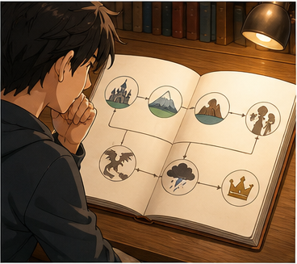

**Ví dụ:**

* **The plot is very interesting.**
  — Cốt truyện rất thú vị.

* **What do you think of the plot?**
  — Bạn nghĩ gì về cốt truyện?

---

## 4.5. **twists and turns** /ˌtwɪsts ən ˈtɜːnz/

**Nghĩa:** những tình tiết bất ngờ, những bước ngoặt liên tục

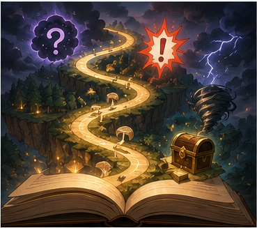

**Ví dụ:**

* **The plot is full of twists and turns.**
  — Cốt truyện có rất nhiều tình tiết bất ngờ.

* **I like stories with lots of twists and turns.**
  — Tôi thích những câu chuyện có nhiều bước ngoặt.

---

## 4.6. **character** /ˈkær.ək.tər/

**Nghĩa:** nhân vật

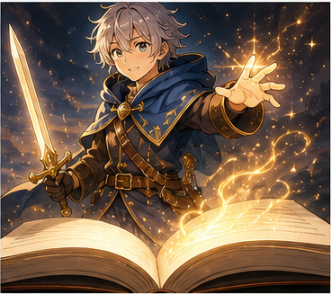

**Ví dụ:**

* **Who's your favorite character?**
  — Nhân vật yêu thích của bạn là ai?

* **I like this character because she's smart.**
  — Tôi thích nhân vật này vì cô ấy thông minh.

---

## 4.7. **main character** /ˌmeɪn ˈkær.ək.tər/

**Nghĩa:** nhân vật chính

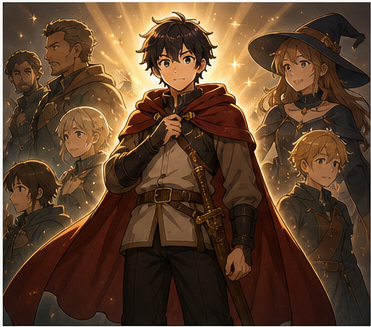

**Ví dụ:**

* **I really like the main character.**
  — Tôi thực sự thích nhân vật chính.

* **The main character is very clever.**
  — Nhân vật chính rất thông minh.

---

## 4.8. **readable** /ˈriː.də.bəl/

**Nghĩa:** dễ đọc, hấp dẫn đủ để tiếp tục đọc

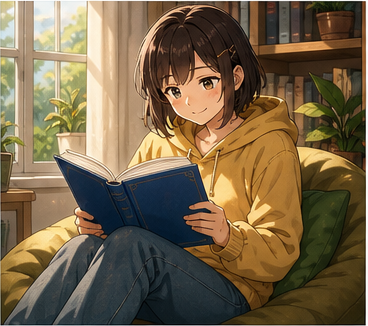

**Ví dụ:**

* **It's not a masterpiece, but it's very readable.**
  — Nó không phải kiệt tác, nhưng rất dễ đọc.

* **The book is simple and readable.**
  — Cuốn sách đơn giản và dễ đọc.

---

## 4.9. **moving** /ˈmuː.vɪŋ/

**Nghĩa trong bài:** cảm động, gây xúc động

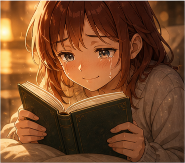

**Ví dụ:**

* **It's a moving story.**
  — Đó là một câu chuyện cảm động.

* **The ending was very moving.**
  — Phần kết rất cảm động.

---

## 4.10. **masterpiece** /ˈmɑː.stə.piːs/

**Nghĩa:** kiệt tác

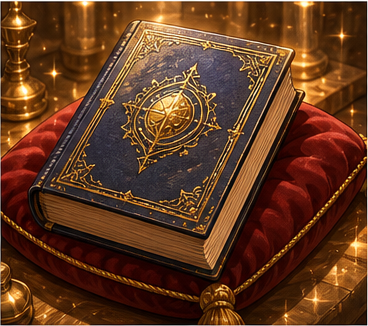

**Ví dụ:**

* **Some people think this novel is a masterpiece.**
  — Một số người cho rằng tiểu thuyết này là một kiệt tác.

* **It's not a masterpiece, but I enjoyed it.**
  — Nó không phải kiệt tác, nhưng tôi thích nó.

---

## 4.11. **attract attention**

**Nghĩa:** thu hút sự chú ý

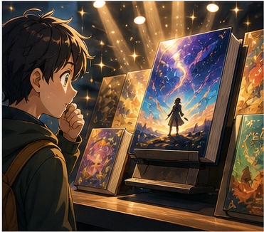

**Ví dụ:**

* **It attracts your attention from the very start.**
  — Nó thu hút sự chú ý của bạn ngay từ đầu.

* **The cover attracts attention.**
  — Bìa sách thu hút sự chú ý.

---

## 4.12. **detective story** /dɪˈtek.tɪv ˌstɔː.ri/

**Nghĩa:** truyện trinh thám

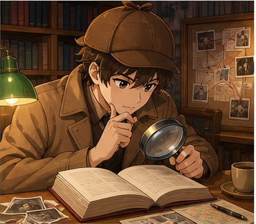

**Ví dụ:**

* **I enjoy reading detective stories.**
  — Tôi thích đọc truyện trinh thám.

* **Detective stories often have surprising endings.**
  — Truyện trinh thám thường có những cái kết bất ngờ.

---

## 4.13. **science fiction** /ˌsaɪəns ˈfɪk.ʃən/

**Nghĩa:** khoa học viễn tưởng

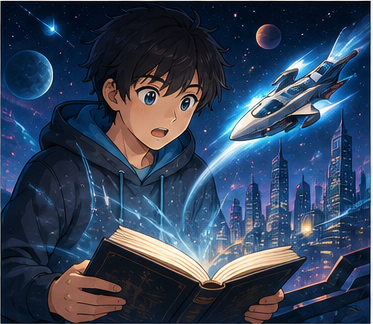

**Ví dụ:**

* **I like science fiction books.**
  — Tôi thích sách khoa học viễn tưởng.

* **Science fiction books are popular with young people.**
  — Sách khoa học viễn tưởng phổ biến với giới trẻ.

---

## 4.14. **magazine** /ˌmæɡ.əˈziːn/

**Nghĩa:** tạp chí

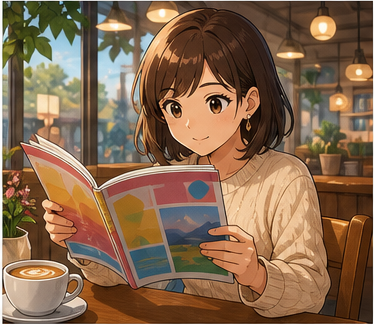

**Ví dụ:**

* **I read this magazine every month.**
  — Tôi đọc tạp chí này mỗi tháng.

* **Is that the latest issue of the magazine?**
  — Đó có phải số mới nhất của tạp chí không?

---

## 4.15. **issue** /ˈɪʃ.uː/

**Nghĩa trong bài:** số phát hành của báo hoặc tạp chí

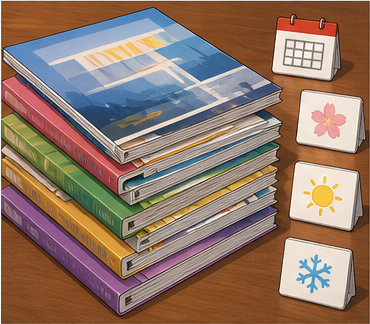

**Ví dụ:**

* **This is the latest issue.**
  — Đây là số mới nhất.

* **Have you read this month's issue?**
  — Bạn đã đọc số tháng này chưa?

---

## 4.16. **article** /ˈɑː.tɪ.kəl/

**Nghĩa:** bài báo, bài viết

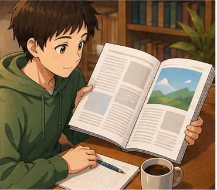

**Ví dụ:**

* **Did you see that interesting article?**
  — Bạn có xem bài viết thú vị đó không?

* **I read an article about the environment.**
  — Tôi đọc một bài viết về môi trường.

---

## 4.17. **subscribe** /səbˈskraɪb/

**Nghĩa:** đăng ký theo dõi, đăng ký nhận báo/tạp chí

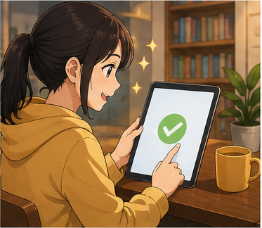

**Ví dụ:**

* **How much does it cost to subscribe?**
  — Đăng ký thì mất bao nhiêu tiền?

* **I want to subscribe to this magazine.**
  — Tôi muốn đăng ký tạp chí này.

> Dùng **subscribe to + something**.

---

## 4.18. **subscriber** /səbˈskraɪ.bər/

**Nghĩa:** người đăng ký

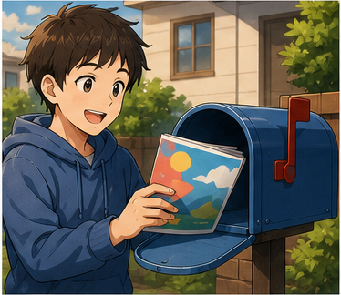

**Ví dụ:**

* **I've been a subscriber for three years.**
  — Tôi đã là người đăng ký trong ba năm.

* **The magazine has many subscribers.**
  — Tạp chí có nhiều người đăng ký.

---

## 4.19. **latest** /ˈleɪ.tɪst/

**Nghĩa:** mới nhất

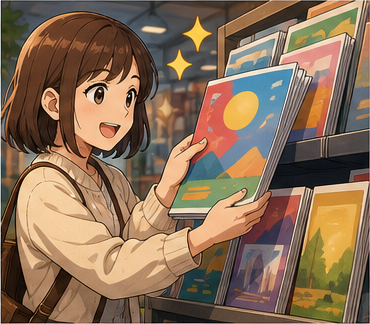

**Ví dụ:**

* **Is that the latest issue?**
  — Đó có phải số mới nhất không?

* **Have you read his latest novel?**
  — Bạn đã đọc cuốn tiểu thuyết mới nhất của ông ấy chưa?

---

## 4.20. **beginning** /bɪˈɡɪn.ɪŋ/

**Nghĩa:** phần đầu, phần mở đầu

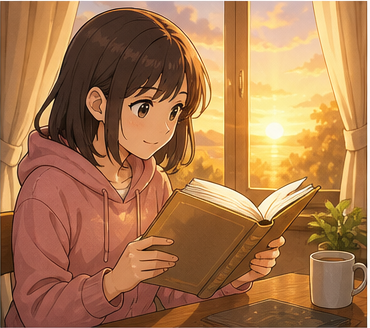

**Ví dụ:**

* **It has a very interesting beginning.**
  — Nó có phần mở đầu rất thú vị.

* **I liked the beginning of the story.**
  — Tôi thích phần đầu của câu chuyện.

---

## 4.21. **ending** /ˈen.dɪŋ/

**Nghĩa:** phần kết, kết thúc

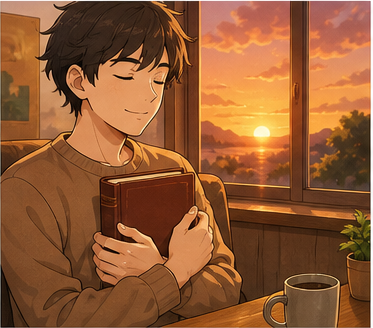

**Ví dụ:**

* **The ending surprised me.**
  — Phần kết làm tôi bất ngờ.

* **I didn't like the ending.**
  — Tôi không thích phần kết.

---

## 4.22. **popular with**

**Nghĩa:** phổ biến với, được yêu thích bởi

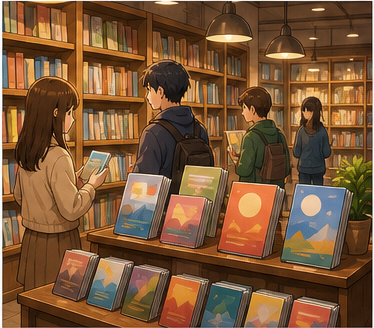

**Ví dụ:**

* **Science fiction books are popular with young people.**
  — Sách khoa học viễn tưởng phổ biến với giới trẻ.

* **This author is popular with teenagers.**
  — Tác giả này được thanh thiếu niên yêu thích.

---

## 4.23. **comment** /ˈkɒm.ent/

**Nghĩa:** bình luận, nhận xét

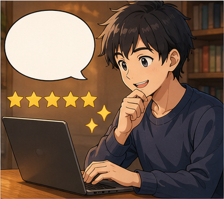

**Ví dụ:**

* **Can you comment on the book?**
  — Bạn có thể nhận xét về cuốn sách không?

* **I read some comments about the novel.**
  — Tôi đọc một số bình luận về cuốn tiểu thuyết.

---

# 5. Bảng tổng hợp từ vựng

| Từ / cụm từ           | IPA                | Nghĩa tiếng Việt    | Ví dụ ngắn               |
| --------------------- | ------------------ | ------------------- | ------------------------ |
| **book**              | /bʊk/              | sách                | read a book              |
| **novel**             | /ˈnɒv.əl/          | tiểu thuyết         | finish a novel           |
| **story**             | /ˈstɔː.ri/         | câu chuyện          | a moving story           |
| **plot**              | /plɒt/             | cốt truyện          | an interesting plot      |
| **twists and turns**  | —                  | tình tiết bất ngờ   | full of twists and turns |
| **character**         | /ˈkær.ək.tər/      | nhân vật            | favorite character       |
| **main character**    | —                  | nhân vật chính      | the main character       |
| **readable**          | /ˈriː.də.bəl/      | dễ đọc              | very readable            |
| **moving**            | /ˈmuː.vɪŋ/         | cảm động            | a moving story           |
| **masterpiece**       | /ˈmɑː.stə.piːs/    | kiệt tác            | a masterpiece            |
| **attract attention** | —                  | thu hút sự chú ý    | attract your attention   |
| **detective story**   | —                  | truyện trinh thám   | read detective stories   |
| **science fiction**   | /ˌsaɪəns ˈfɪk.ʃən/ | khoa học viễn tưởng | science fiction books    |
| **magazine**          | /ˌmæɡ.əˈziːn/      | tạp chí             | read a magazine          |
| **issue**             | /ˈɪʃ.uː/           | số phát hành        | latest issue             |
| **article**           | /ˈɑː.tɪ.kəl/       | bài viết            | read an article          |
| **subscribe**         | /səbˈskraɪb/       | đăng ký             | subscribe to a magazine  |
| **subscriber**        | /səbˈskraɪ.bər/    | người đăng ký       | be a subscriber          |
| **latest**            | /ˈleɪ.tɪst/        | mới nhất            | latest novel             |
| **beginning**         | /bɪˈɡɪn.ɪŋ/        | phần mở đầu         | interesting beginning    |
| **ending**            | /ˈen.dɪŋ/          | phần kết            | surprising ending        |
| **popular with**      | —                  | phổ biến với        | popular with teenagers   |
| **comment**           | /ˈkɒm.ent/         | bình luận           | comment on a book        |

---

# 6. Mẫu câu giao tiếp — Useful Structures

## 6.1. Hỏi người khác có thích đọc sách không

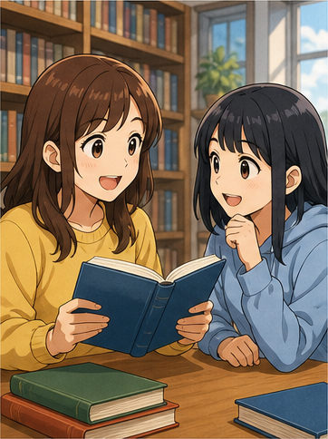

### **Do you like reading books?**

— Bạn có thích đọc sách không?

### Cấu trúc

`Do you like + V-ing?`

Ví dụ:

* **Do you like reading novels?**
* **Do you like reading magazines?**
* **Do you like reading science fiction?**

Trả lời:

* **Yes, I do.**
* **Yes, I love reading.**
* **Sometimes.**
* **Not really.**

---

## 6.2. Nói mình vừa đọc xong một cuốn sách

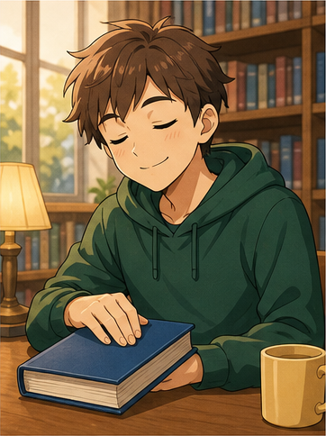

### **I've just finished + noun.**

* **I've just finished a novel.**
* **I've just finished this book.**
* **I've just finished the latest issue.**

`I've just finished...`
= Tôi vừa mới hoàn thành / đọc xong...

---

## 6.3. Hỏi ý kiến về sách

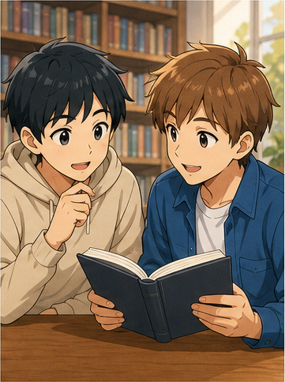

### **What do you think of + noun?**

* **What do you think of the novel?**
* **What do you think of the story?**
* **What do you think of the main character?**

Cách khác:

### **How did you like it?**

— Bạn thấy nó thế nào?

---

## 6.4. Đưa ra nhận xét đơn giản

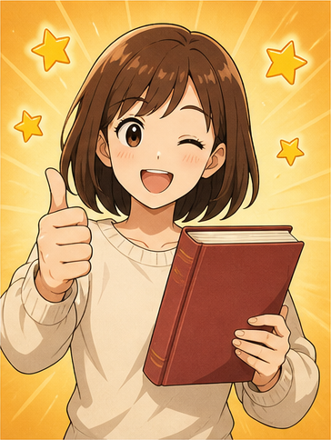

### **It's + adjective.**

* **It's interesting.**
* **It's readable.**
* **It's exciting.**
* **It's moving.**
* **It's simple.**
* **It's funny.**
* **It's boring.**

Ví dụ:

**It's not a masterpiece, but it's very readable.**

— Nó không phải kiệt tác, nhưng rất dễ đọc.

---

## 6.5. Nói một câu chuyện cảm động

### **It's a moving story.**

— Đó là một câu chuyện cảm động.

Cách khác:

* **The story was very moving.**
* **The ending was really emotional.**
* **It made me feel sad.**

---

## 6.6. Nói một cuốn sách khiến mình suy nghĩ

### **I couldn't stop thinking about it.**

— Tôi không thể ngừng nghĩ về nó.

Cấu trúc:

`couldn't stop + V-ing`

Ví dụ:

* **I couldn't stop reading it.**
* **I couldn't stop thinking about the ending.**

---

## 6.7. Hỏi phần yêu thích nhất

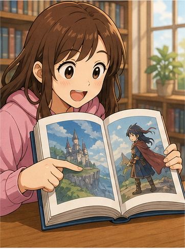

### **What do you like best about it?**

— Bạn thích điều gì nhất ở nó?

Trả lời:

* **The plot.**
* **The characters.**
* **The ending.**
* **The writing style.**
* **The main character.**

---

## 6.8. Nói về cốt truyện

### **The plot is + adjective.**

* **The plot is interesting.**
* **The plot is exciting.**
* **The plot is simple.**

### **It's full of twists and turns.**

— Nó có đầy những tình tiết bất ngờ.

---

## 6.9. Nói về nhân vật

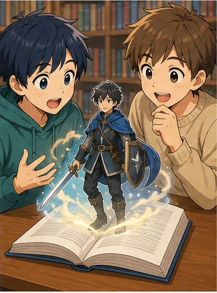

### **I like the main character because + reason.**

* **I like the main character because she's smart.**
* **I like him because he's funny.**
* **I like her because she's brave.**

---

## 6.10. Nói về sở thích đọc

### **I enjoy + V-ing.**

* **I enjoy reading detective stories.**
* **I enjoy reading novels.**
* **I enjoy reading before bed.**

### Cấu trúc

`enjoy + V-ing`

Không dùng:

❌ `enjoy to read`

---

## 6.11. Hỏi loại sách yêu thích

### **What kind of books do you like?**

— Bạn thích loại sách nào?

Trả lời:

* **I like detective stories.**
* **I like science fiction.**
* **I like romance novels.**
* **I like history books.**

---

## 6.12. Nói về một bài báo

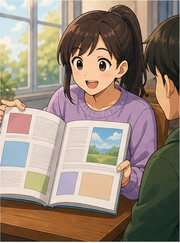

### **Did you see that article about + topic?**

* **Did you see that article about the environment?**
* **Did you read that article about technology?**

Cách khác:

* **I read an interesting article about science.**

---

## 6.13. Hỏi số mới nhất của tạp chí

### **Is that the latest issue of + magazine?**

— Đó có phải số mới nhất của tạp chí ... không?

Ví dụ:

* **Is that the latest issue of this magazine?**

---

## 6.14. Nói mình là người đăng ký

### **I've been a subscriber for + thời gian.**

* **I've been a subscriber for three years.**
* **I've been a subscriber for six months.**

---

## 6.15. Hỏi giá đăng ký

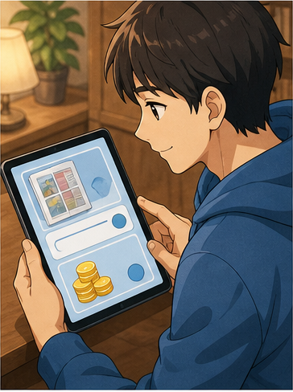

### **How much does it cost to subscribe?**

— Đăng ký mất bao nhiêu tiền?

Cách khác:

* **How much is the subscription?**
* **Is it expensive to subscribe?**

---

## 6.16. Nói một thứ phổ biến với một nhóm người

### **Something + is popular with + people.**

* **Science fiction books are popular with young people.**
* **This magazine is popular with students.**

---

## 6.17. Nói phần mở đầu thu hút

### **It attracts your attention from the very start.**

— Nó thu hút sự chú ý ngay từ đầu.

Cách đơn giản hơn:

* **The beginning is very interesting.**
* **It caught my attention immediately.**

---

## 6.18. Giới thiệu sách cho người khác

### **You should read it.**

— Bạn nên đọc nó.

### **I think you'd like it.**

— Tôi nghĩ bạn sẽ thích nó.

### **I highly recommend it.**

— Tôi rất khuyên bạn đọc nó.

Với A1–A2, có thể dùng đơn giản:

**You should try it.**

---

# 7. Các thể loại và nội dung đọc phổ biến

| Thể loại            | Tiếng Anh              | Ví dụ                          |
| ------------------- | ---------------------- | ------------------------------ |
| Tiểu thuyết         | **novel**              | I'm reading a novel.           |
| Truyện trinh thám   | **detective story**    | I like detective stories.      |
| Khoa học viễn tưởng | **science fiction**    | I enjoy science fiction.       |
| Lãng mạn            | **romance**            | She likes romance novels.      |
| Kỳ ảo               | **fantasy**            | Fantasy books are popular.     |
| Kinh dị             | **horror**             | I don't usually read horror.   |
| Lịch sử             | **history**            | I like history books.          |
| Tiểu sử             | **biography**          | I'm reading a biography.       |
| Truyện tranh        | **comic / comic book** | I read comic books.            |
| Tạp chí             | **magazine**           | I read this magazine monthly.  |
| Bài báo             | **article**            | I read an article online.      |
| Tin tức             | **news**               | I read the news every morning. |

### Sơ đồ

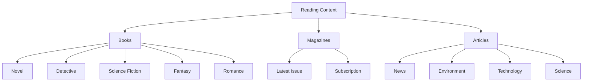

---

# 8. Phân biệt **book**, **novel**, **story** và **article**

## **book**

= sách nói chung.

**I'm reading a book.**

---

## **novel**

= một tác phẩm hư cấu dài dưới dạng sách.

**I'm reading a detective novel.**

---

## **story**

= câu chuyện; có thể là nội dung của sách hoặc truyện ngắn.

**It's a moving story.**

---

## **article**

= bài viết trên báo, tạp chí hoặc website.

**I read an interesting article about the environment.**

### Bảng so sánh

| Từ          | Nghĩa              | Ví dụ                |
| ----------- | ------------------ | -------------------- |
| **book**    | sách nói chung     | I'm reading a book.  |
| **novel**   | tiểu thuyết        | It's a great novel.  |
| **story**   | câu chuyện         | It's a moving story. |
| **article** | bài báo / bài viết | I read an article.   |

---

# 9. Phát âm trọng tâm

## 9.1. **novel**

**novel**
/ˈnɒv.əl/

Trọng âm:

**NOV**-el

---

## 9.2. **character**

**character**
/ˈkær.ək.tər/

Trọng âm:

**CHAR**-ac-ter

---

## 9.3. **magazine**

**magazine**
/ˌmæɡ.əˈziːn/

Trọng âm chính:

mag-a-**ZINE**

---

## 9.4. **article**

**article**
/ˈɑː.tɪ.kəl/

Trọng âm:

**AR**-ti-cle

---

## 9.5. **subscribe**

**subscribe**
/səbˈskraɪb/

Trọng âm:

sub-**SCRIBE**

---

## 9.6. **science fiction**

**science fiction**
/ˌsaɪəns ˈfɪk.ʃən/

Luyện theo cụm:

`SCI-ence FIC-tion`

---

## 9.7. **readable**

**readable**
/ˈriː.də.bəl/

Trọng âm:

**READ**-a-ble

---

## 9.8. Nối âm trong hội thoại

### **Do you like reading books?**

Luyện theo cụm:

`Do-you-like-reading-books?`

### **What do you think of it?**

Luyện:

`What-do-you-think-of-it?`

### **What do you like best about it?**

Luyện:

`What-do-you-like-best-about-it?`

### **I've just finished a novel.**

Luyện:

`I've-just-finished-a-novel.`

---

# 10. Hội thoại thực tế — Real-Life Conversation

## Hội thoại chính — Nói về một cuốn tiểu thuyết

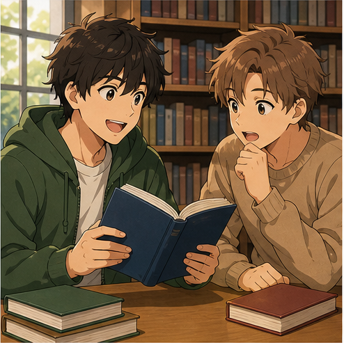

**Mai:** Do you like reading books?
**Hugo:** Yes, I do. I've just finished a novel.
**Mai:** What do you think of it?
**Hugo:** I like it. It has a very interesting beginning.
**Mai:** What do you like best about it?
**Hugo:** The plot, I guess. It's full of twists and turns.
**Mai:** What about the characters?
**Hugo:** I really like the main character. She's smart and brave.
**Mai:** Would you recommend it?
**Hugo:** Yes. It's very readable.

### Nội dung giao tiếp

```text
Hỏi sở thích đọc
      ↓
Giới thiệu cuốn sách
      ↓
Hỏi ý kiến
      ↓
Nhận xét cốt truyện
      ↓
Nói về nhân vật
      ↓
Đề xuất / giới thiệu
```

---

## Hội thoại 2 — Một câu chuyện cảm động

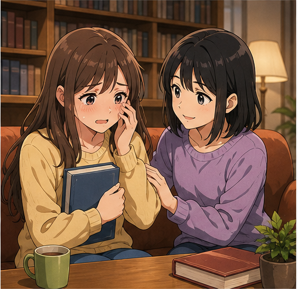

**Linh:** What are you reading?
**Nam:** It's a novel about a family.
**Linh:** Is it good?
**Nam:** Yes. It's a very simple story, but it's really moving.
**Linh:** What do you like about it?
**Nam:** The characters feel very real.
**Linh:** Is the ending sad?
**Nam:** A little. I couldn't stop thinking about it afterward.
**Linh:** That sounds interesting.
**Nam:** You should read it.

---

## Hội thoại 3 — Nói về tạp chí

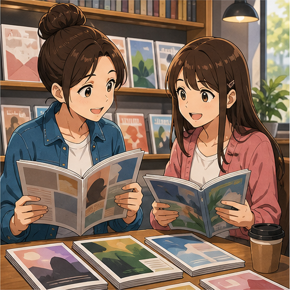

**Alex:** Is that the latest issue of the magazine?
**Mai:** Yes, it is. It has some really good articles.
**Alex:** Do you read it often?
**Mai:** Yes. I've been a subscriber for three years.
**Alex:** Really? I didn't know that.
**Mai:** I really enjoy it.
**Alex:** How much does it cost to subscribe?
**Mai:** I'm not exactly sure, but it's not expensive.
**Alex:** Maybe I'll subscribe too.
**Mai:** I think you'd like it.

---

## Hội thoại 4 — Nói về một bài viết

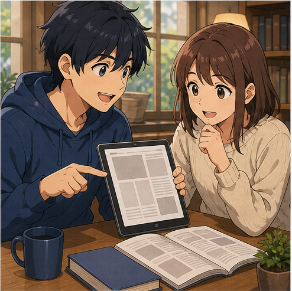

**Nam:** Did you see that interesting article about the environment?
**Linh:** No. Where did you read it?
**Nam:** In a science magazine.
**Linh:** What was it about?
**Nam:** It was about plastic waste in the ocean.
**Linh:** Was it easy to understand?
**Nam:** Yes. It was short and very readable.
**Linh:** Can you send it to me?
**Nam:** Sure. I'll send you the link.
**Linh:** Thanks.

---

## Hội thoại 5 — Nói về thể loại yêu thích

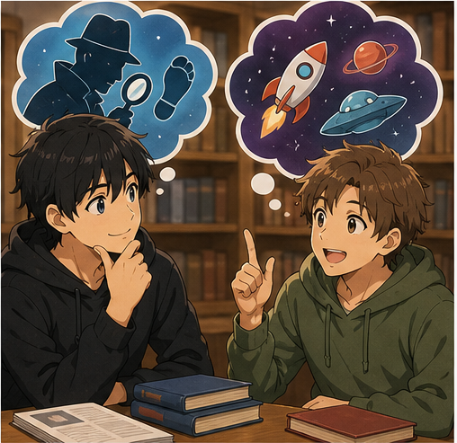

**Hugo:** What kind of books do you like?
**Mai:** I enjoy reading detective stories.
**Hugo:** Why do you like them?
**Mai:** I love the mystery and the twists and turns.
**Hugo:** Do you like science fiction too?
**Mai:** Sometimes. What about you?
**Hugo:** I really like science fiction.
**Mai:** Why?
**Hugo:** I like stories about the future and new technology.
**Mai:** That sounds interesting.

---

# 11. Natural Expressions — Cách nói tự nhiên

| Cụm từ                                  | Nghĩa                            | Khi dùng          |
| --------------------------------------- | -------------------------------- | ----------------- |
| **Do you like reading books?**          | Bạn có thích đọc sách không?     | Hỏi sở thích      |
| **What are you reading?**               | Bạn đang đọc gì?                 | Bắt đầu hội thoại |
| **I've just finished this book.**       | Tôi vừa đọc xong cuốn này.       | Nói trải nghiệm   |
| **What do you think of it?**            | Bạn thấy nó thế nào?             | Hỏi ý kiến        |
| **It's really good.**                   | Nó thực sự hay.                  | Nhận xét          |
| **It's very readable.**                 | Nó rất dễ đọc.                   | Nhận xét          |
| **It's a moving story.**                | Đó là câu chuyện cảm động.       | Nhận xét          |
| **It's a bit boring.**                  | Nó hơi chán.                     | Nhận xét          |
| **The plot is interesting.**            | Cốt truyện thú vị.               | Nói về cốt truyện |
| **It's full of twists and turns.**      | Nó có nhiều tình tiết bất ngờ.   | Nói cốt truyện    |
| **I like the main character.**          | Tôi thích nhân vật chính.        | Nói nhân vật      |
| **She's really smart.**                 | Cô ấy rất thông minh.            | Mô tả nhân vật    |
| **What do you like best about it?**     | Bạn thích nhất điều gì?          | Hỏi chi tiết      |
| **I couldn't stop reading it.**         | Tôi không thể ngừng đọc.         | Khen sách         |
| **I couldn't stop thinking about it.**  | Tôi cứ nghĩ mãi về nó.           | Nói ấn tượng      |
| **I enjoy reading detective stories.**  | Tôi thích đọc truyện trinh thám. | Nói sở thích      |
| **I'm really into science fiction.**    | Tôi rất mê khoa học viễn tưởng.  | Nói sở thích      |
| **Have you read it?**                   | Bạn đã đọc nó chưa?              | Hỏi trải nghiệm   |
| **You should read it.**                 | Bạn nên đọc nó.                  | Gợi ý             |
| **I think you'd like it.**              | Tôi nghĩ bạn sẽ thích nó.        | Giới thiệu        |
| **Would you recommend it?**             | Bạn có giới thiệu nó không?      | Xin đánh giá      |
| **Is that the latest issue?**           | Đó là số mới nhất à?             | Tạp chí           |
| **I read it every month.**              | Tôi đọc nó mỗi tháng.            | Thói quen         |
| **I'm a subscriber.**                   | Tôi là người đăng ký.            | Tạp chí           |
| **How much does it cost to subscribe?** | Đăng ký mất bao nhiêu?           | Hỏi giá           |
| **Did you read that article?**          | Bạn đọc bài đó chưa?             | Bài viết          |
| **What was it about?**                  | Nó nói về gì?                    | Hỏi nội dung      |
| **That sounds interesting.**            | Nghe thú vị đấy.                 | Phản hồi          |
| **It's worth reading.**                 | Nó đáng đọc.                     | Giới thiệu        |

---

# 12. Lỗi thường gặp — Common Mistakes

## Lỗi 1: Dùng sai sau **enjoy**

❌ **I enjoy to read novels.**

✅ **I enjoy reading novels.**

### Cấu trúc

`enjoy + V-ing`

---

## Lỗi 2: Nhầm **book** và **novel**

**book** có nghĩa rộng hơn.

✅ **This is a history book.**

**novel** thường là tiểu thuyết hư cấu.

✅ **This is a detective novel.**

---

## Lỗi 3: Dùng sai **read**

Hiện tại:

✅ **I read books every day.**

Quá khứ:

✅ **I read that book yesterday.**

Hai dạng đều viết là **read**, nhưng phát âm khác:

* hiện tại: /riːd/
* quá khứ: /red/

---

## Lỗi 4: Quên **of** trong câu hỏi

❌ **What do you think the novel?**

✅ **What do you think of the novel?**

### Cấu trúc

`What do you think of + noun?`

---

## Lỗi 5: Dùng sai **interested** và **interesting**

Nếu mô tả sách:

✅ **The book is interesting.**

Nếu mô tả cảm xúc của người:

✅ **I'm interested in the book.**

---

## Lỗi 6: Nhầm **story** và **history**

### **story**

= câu chuyện.

**It's a moving story.**

### **history**

= lịch sử.

**I'm reading a book about Japanese history.**

---

## Lỗi 7: Dùng sai **popular**

❌ **Science fiction is popular for young people.**

Tự nhiên hơn:

✅ **Science fiction is popular with young people.**

---

## Lỗi 8: Dùng sai **subscribe**

❌ **I subscribe this magazine.**

✅ **I subscribe to this magazine.**

### Cấu trúc

`subscribe to + something`

---

## Lỗi 9: Nhầm **subscribe** và **subscriber**

### Động từ

**subscribe**

✅ **I subscribe to this magazine.**

### Danh từ chỉ người

**subscriber**

✅ **I'm a subscriber.**

---

## Lỗi 10: Dùng sai **latest**

❌ **the most latest issue**

✅ **the latest issue**

**latest** đã mang nghĩa “mới nhất”.

---

## Lỗi 11: Trả lời quá ngắn

**A:** What do you think of the book?
**B:** Good.

Có thể hiểu nhưng hội thoại dễ bị dừng.

Tự nhiên hơn:

✅ **It's really good. I especially like the plot.**

---

## Lỗi 12: Dùng câu quá phức tạp khi chưa cần thiết

Thay vì cố nói:

❌ Một câu dài chứa quá nhiều ý.

Có thể chia nhỏ:

✅ **It's a simple story. The characters are interesting. I really like the ending.**

---

## Lỗi 13: Nhầm **character** với tính cách

Trong bài này:

**character**
= nhân vật trong truyện.

**My favorite character is Anna.**

Trong ngữ cảnh khác, **character** cũng có thể liên quan đến tính cách, nhưng người học A1–A2 nên ưu tiên nghĩa “nhân vật” trong bài này.

---

## Lỗi 14: Dùng sai **twist and turn**

Khi nói chung về nhiều tình tiết:

✅ **The story is full of twists and turns.**

Cụm này thường dùng ở dạng số nhiều.

---

# 13. Luyện tập có hướng dẫn

## Bài 1 — Nối từ với nghĩa

1. novel
2. plot
3. character
4. magazine
5. article
6. subscribe

A. nhân vật
B. cốt truyện
C. đăng ký
D. tiểu thuyết
E. bài viết
F. tạp chí

<details>
<summary>Đáp án</summary>

1–D
2–B
3–A
4–F
5–E
6–C

</details>

---

## Bài 2 — Điền từ vào chỗ trống

Dùng:

`plot` · `novel` · `character` · `article` · `readable`

1. I've just finished a ________.
2. The ________ is full of twists and turns.
3. I really like the main ________.
4. Did you read that interesting ________?
5. The book is simple but very ________.

<details>
<summary>Đáp án</summary>

1. novel
2. plot
3. character
4. article
5. readable

</details>

---

## Bài 3 — Chọn câu đúng

### 1. Bạn muốn hỏi người khác có thích đọc sách không.

* A. Do you like read books?
* B. Do you like reading books?
* C. Are you like reading books?

**Đáp án:** B

---

### 2. Bạn muốn hỏi ý kiến về cuốn tiểu thuyết.

* A. What do you think of the novel?
* B. What do you think the novel?
* C. How do you think about novel?

**Đáp án:** A

---

### 3. Bạn muốn nói mình thích truyện trinh thám.

* A. I enjoy read detective stories.
* B. I enjoy to read detective stories.
* C. I enjoy reading detective stories.

**Đáp án:** C

---

### 4. Bạn muốn nói cốt truyện có nhiều tình tiết bất ngờ.

* A. The plot is full of twists and turns.
* B. The plot has full twist.
* C. The plot is twisting turn.

**Đáp án:** A

---

## Bài 4 — **interesting** hay **interested**

1. This book is very ________.
2. I'm really ________ in science fiction.
3. The article was ________.
4. Are you ________ in history books?

<details>
<summary>Đáp án</summary>

1. interesting
2. interested
3. interesting
4. interested

</details>

---

## Bài 5 — **book**, **novel**, **article** hay **magazine**

1. I read an interesting ________ about the environment.
2. She reads this fashion ________ every month.
3. I've just finished a detective ________.
4. This ________ teaches you how to cook.

<details>
<summary>Đáp án gợi ý</summary>

1. article
2. magazine
3. novel
4. book

</details>

---

## Bài 6 — Hoàn thành hội thoại

**A:** Do you like ________ books?
**B:** Yes. I read almost every day.
**A:** What kind of books do you like?
**B:** I enjoy reading detective ________.
**A:** What do you like best about them?
**B:** The ________. They're usually full of twists and turns.
**A:** Who's your favorite ________?
**B:** I don't have one, but I like clever detectives.

<details>
<summary>Đáp án</summary>

1. reading
2. stories
3. plots / plot
4. character

</details>

---

## Bài 7 — Sắp xếp hội thoại

Sắp xếp các câu:

A. **The plot. It's full of twists and turns.**
B. **What do you like best about it?**
C. **I've just finished a detective novel.**
D. **What are you reading?**

<details>
<summary>Đáp án</summary>

D → C → B → A

</details>

---

# 14. Speaking Challenge — Thử thách nói

## Nhiệm vụ 1 — Đọc mẫu câu

Đọc các câu sau thành tiếng:

* **Do you like reading books?**
* **I've just finished a novel.**
* **What do you think of it?**
* **It's very readable.**
* **It's a moving story.**
* **What do you like best about it?**
* **The plot is full of twists and turns.**
* **I like the main character.**
* **I enjoy reading detective stories.**
* **Science fiction books are popular with young people.**
* **Did you read that article?**
* **Is that the latest issue?**
* **How much does it cost to subscribe?**

Đọc mỗi câu hai lần:

* lần 1 chậm và rõ;
* lần 2 với tốc độ hội thoại tự nhiên.

---

## Nhiệm vụ 2 — Nói về thói quen đọc sách

Nói ít nhất **5 câu** về bản thân.

Có thể trả lời:

1. Bạn có thích đọc sách không?
2. Bạn thường đọc loại sách nào?
3. Bạn đọc sách bao lâu một lần?
4. Cuốn sách gần đây nhất bạn đọc là gì?
5. Bạn thích cốt truyện hay nhân vật hơn?
6. Bạn có đọc tạp chí hoặc bài viết trực tuyến không?

Ví dụ:

> **I enjoy reading books. I usually read science fiction and detective stories. I like books with interesting plots and clever characters. I also read articles online. I usually read before going to bed.**

---

## Nhiệm vụ 3 — Giới thiệu một cuốn sách

Chọn một cuốn sách bạn đã đọc.

Phải sử dụng ít nhất:

* **I've just finished...**
* **The story is...**
* **The plot is...**
* **My favorite character is...**
* **I like it because...**
* **I would recommend it.**

---

## Nhiệm vụ 4 — Hội thoại 8 lượt

Tạo một hội thoại có ít nhất:

* 1 câu hỏi về sở thích đọc;
* 1 thể loại sách;
* 1 nhận xét về cốt truyện;
* 1 câu nói về nhân vật;
* 1 tính từ mô tả sách;
* 1 câu hỏi ý kiến;
* 1 lời giới thiệu;
* 1 câu kết thúc.

---

## Nhiệm vụ 5 — Ghi âm

Ghi âm **45–60 giây**, sau đó kiểm tra:

* [ ] Tôi có thể hỏi người khác có thích đọc sách không.
* [ ] Tôi có thể nói loại sách mình thích.
* [ ] Tôi dùng đúng **enjoy + V-ing**.
* [ ] Tôi hiểu **plot**.
* [ ] Tôi hiểu **character**.
* [ ] Tôi có thể dùng **twists and turns**.
* [ ] Tôi có thể nhận xét một cuốn sách.
* [ ] Tôi có thể hỏi **What do you think of it?**
* [ ] Tôi có thể nói về tạp chí hoặc bài viết.
* [ ] Tôi có thể duy trì hội thoại ít nhất 45 giây.

---

# 15. Practice Mission — Nhiệm vụ thực tế

Trong hôm nay, hãy tạo một cuộc hội thoại theo công thức:

> **Reading habit → Book → Opinion → Favorite part → Recommendation → Response**

Ví dụ:

> **Do you like reading books?**
> ↓
> **Yes. I've just finished a detective novel.**
> ↓
> **What do you think of it?**
> ↓
> **It's very readable.**
> ↓
> **What do you like best about it?**
> ↓
> **The plot. It's full of twists and turns.**
> ↓
> **Would you recommend it?**
> ↓
> **Definitely. I think you'd like it.**

Sau đó viết hoặc nói một đoạn hội thoại **8–10 lượt** cho một trong các tình huống:

* nói về cuốn sách vừa đọc;
* giới thiệu cuốn sách yêu thích;
* nói về nhân vật yêu thích;
* nói về cốt truyện;
* giới thiệu truyện trinh thám;
* nói về khoa học viễn tưởng;
* nói về một bài báo thú vị;
* hỏi về tạp chí;
* hỏi giá đăng ký tạp chí;
* giới thiệu nội dung đáng đọc cho bạn bè.

---

# 16. Tự đánh giá cuối bài

Đánh dấu khi bạn có thể thực hiện mà không nhìn bài:

* [ ] Tôi có thể hỏi **Do you like reading books?**
* [ ] Tôi có thể nói về thói quen đọc sách.
* [ ] Tôi có thể nói **I've just finished a novel.**
* [ ] Tôi có thể hỏi **What do you think of it?**
* [ ] Tôi hiểu **novel**.
* [ ] Tôi hiểu **plot**.
* [ ] Tôi hiểu **character**.
* [ ] Tôi hiểu **main character**.
* [ ] Tôi có thể dùng **twists and turns**.
* [ ] Tôi có thể nói **It's very readable.**
* [ ] Tôi có thể nói **It's a moving story.**
* [ ] Tôi có thể dùng **I couldn't stop thinking about it.**
* [ ] Tôi dùng đúng **enjoy + V-ing**.
* [ ] Tôi có thể nói về detective stories.
* [ ] Tôi có thể nói về science fiction.
* [ ] Tôi biết **magazine** là gì.
* [ ] Tôi biết **issue** là gì.
* [ ] Tôi biết **article** là gì.
* [ ] Tôi có thể dùng **subscribe to**.
* [ ] Tôi có thể hỏi **How much does it cost to subscribe?**
* [ ] Tôi có thể duy trì hội thoại ít nhất 45 giây.

---

# 17. Câu hỏi mở cuối bài

**Imagine that you have just finished a book that you really enjoyed. A friend asks you whether they should read it. How would you describe the story, the plot, the main character and your favorite part without giving away the ending?**

*Hãy tưởng tượng bạn vừa đọc xong một cuốn sách mà bạn rất thích. Một người bạn hỏi liệu họ có nên đọc cuốn sách đó không. Bạn sẽ mô tả câu chuyện, cốt truyện, nhân vật chính và phần mình yêu thích như thế nào mà không tiết lộ phần kết?*

---

# 18. Ghi chú dành cho giảng viên

* **Module:** 03 — Travel Ready / Tiếng Anh cho những chuyến đi
* **Chủ điểm:** Books, Magazines & Reading
* **Thời lượng video:** 8–12 phút
* **Luyện nói:** 5–10 phút

### Trọng tâm từ vựng

* book
* novel
* story
* plot
* twists and turns
* character
* main character
* readable
* moving
* masterpiece
* attract attention
* detective story
* science fiction
* magazine
* issue
* article
* subscribe
* subscriber
* latest
* beginning
* ending
* popular with
* comment

### Trọng tâm cấu trúc

* **Do you like reading books?**
* **I've just finished a novel.**
* **What do you think of the novel?**
* **What do you think of it?**
* **It's not a masterpiece, but it's very readable.**
* **It's a moving story.**
* **It's a very simple story.**
* **I couldn't stop thinking about it.**
* **It attracts your attention.**
* **What do you like best about it?**
* **I enjoy reading detective stories.**
* **The plot is full of twists and turns.**
* **I like the main character.**
* **Did you see that interesting article?**
* **Science fiction books are popular with young people.**
* **Is that the latest issue?**
* **I've been a subscriber for three years.**
* **How much does it cost to subscribe?**
* **I think you'd like it.**
* **You should read it.**

### Trọng tâm phát âm

* **novel**
* **character**
* **magazine**
* **article**
* **subscribe**
* **subscriber**
* **science fiction**
* **readable**
* **masterpiece**
* **latest**

### Lưu ý ngôn ngữ

* Sau **enjoy** dùng **V-ing**:

  * **I enjoy reading detective stories.**
  * Không dùng: `I enjoy to read...`

* Dùng:

  * **What do you think of the book?**
  * **What do you think of it?**

* **book** là từ chung cho sách.

* **novel** thường chỉ tiểu thuyết hư cấu.

* **story** là câu chuyện.

* **plot** là cấu trúc các sự kiện trong câu chuyện.

* **character** là nhân vật.

* **main character** là nhân vật chính.

* **twists and turns** dùng để mô tả một câu chuyện có nhiều thay đổi và tình tiết bất ngờ.

* **moving** khi nói về nội dung:

  * **a moving story**
  * = một câu chuyện cảm động.

* **readable**:

  * dễ đọc;
  * nội dung đủ hấp dẫn để người đọc tiếp tục.

* **interesting** mô tả sự vật:

  * **The book is interesting.**

* **interested** mô tả cảm xúc của người:

  * **I'm interested in the book.**

* Dùng:

  * **popular with young people**
  * không ưu tiên `popular for young people` trong ý nghĩa này.

* Dùng:

  * **subscribe to a magazine**
  * **subscribe to a channel**
  * **subscribe to a service**

* **subscriber** là người đã đăng ký.

* **issue** trong bài này là một số phát hành của báo hoặc tạp chí.

* **latest issue** = số mới nhất.

* **article** = bài viết trên báo, tạp chí hoặc website.

### Hoạt động gợi ý — Reading Habits Survey

Chia lớp thành cặp.

Mỗi người hỏi bạn cùng cặp:

> **Do you like reading books?**

> **How often do you read?**

> **What kind of books do you like?**

> **Do you enjoy reading detective stories?**

> **Do you like science fiction?**

> **What was the last book you read?**

> **What do you usually read online?**

> **Do you read magazines?**

Sau đó giới thiệu bạn cùng cặp bằng 4–5 câu.

Ví dụ:

> **Mai enjoys reading books. She usually reads detective stories and science fiction. She likes interesting plots and smart characters. She also reads articles online and sometimes reads magazines.**

---

### Role-play mẫu — Giới thiệu một cuốn sách

**Người A nhận:**

> Bạn vừa đọc xong một cuốn tiểu thuyết rất thú vị.

**Người B nhận:**

> Bạn đang tìm một cuốn sách mới để đọc.

Người A phải sử dụng ít nhất:

* **I've just finished a novel.**
* **It's very readable.**
* **The plot is interesting.**
* **It's full of twists and turns.**
* **I like the main character.**
* **I think you'd like it.**

Người B phải sử dụng ít nhất:

* **What do you think of it?**
* **What do you like best about it?**
* **What's the story about?**
* **Is the main character interesting?**
* **Would you recommend it?**

---

### Role-play mẫu — Nói về tạp chí

**Người A nhận:**

> Bạn thường xuyên đọc một tạp chí và đã đăng ký từ lâu.

**Người B nhận:**

> Bạn nhìn thấy tạp chí và đang cân nhắc đăng ký.

Người A phải sử dụng ít nhất:

* **This is the latest issue.**
* **It has some really good articles.**
* **I've been a subscriber for three years.**
* **It's not expensive.**
* **I think you'd like it.**

Người B phải sử dụng ít nhất:

* **Is that the latest issue?**
* **Do you read it often?**
* **What kind of articles does it have?**
* **How much does it cost to subscribe?**
* **Maybe I'll subscribe too.**

---

### Role-play mẫu — Nói về một bài viết

**Người A nhận:**

> Bạn vừa đọc một bài viết thú vị về môi trường.

**Người B nhận:**

> Bạn chưa đọc bài viết và muốn biết nội dung.

Người A phải sử dụng ít nhất:

* **I read an interesting article.**
* **It was about the environment.**
* **It was easy to understand.**
* **It was very readable.**
* **I'll send you the link.**

Người B phải sử dụng ít nhất:

* **What was it about?**
* **Where did you read it?**
* **Was it interesting?**
* **Was it easy to understand?**
* **Can you send it to me?**

---

### Role-play mẫu — Nói về thể loại yêu thích

**Người A nhận:**

> Bạn thích truyện trinh thám.

**Người B nhận:**

> Bạn thích khoa học viễn tưởng.

Hai người phải sử dụng ít nhất:

* **What kind of books do you like?**
* **I enjoy reading...**
* **What do you like best about them?**
* **I like the plot.**
* **It's full of twists and turns.**
* **What about you?**
* **I'm really into...**
* **That sounds interesting.**

Kết thúc bằng:

> **Maybe we can recommend a book to each other.**

---
