# LESSON 16 — QUA CỬA KHẨU VÀ KIỂM TRA NHẬP CẢNH

> **Module 03 — Travel Ready / Tiếng Anh cho những chuyến đi**
> **Chủ đề:** Immigration & Customs — Nhập cảnh, hộ chiếu, khai báo hải quan và hành lý
> **Trình độ gợi ý:** A1–A2
> **Thời lượng:** 8–12 phút học bài + 5–10 phút luyện nói

---

## 1. Tình huống thực tế

Khi đi du lịch quốc tế, bạn thường phải đi qua khu vực **immigration** và đôi khi là **customs** trước khi chính thức nhập cảnh.

Bạn có thể cần:

* xuất trình hộ chiếu;
* đưa thẻ nhập cảnh;
* đưa mẫu khai nhập cảnh;
* trả lời mục đích chuyến đi;
* nói mình đi du lịch hay đi công tác;
* cho biết sẽ ở lại bao lâu;
* cho biết nơi lưu trú;
* xuất trình vé khứ hồi;
* trả lời câu hỏi về hành lý;
* khai báo hàng hóa;
* nói mình không có gì cần khai báo;
* giải thích những món đồ mang theo;
* trả lời câu hỏi của nhân viên nhập cảnh;
* trả lời câu hỏi của nhân viên hải quan;
* cho phép kiểm tra hành lý.

Bạn cần biết cách nói những câu như:

* **May I have your passport, please?**
* **Here's my passport.**
* **Here's my arrival card.**
* **What's the purpose of your visit?**
* **I'm here for sightseeing.**
* **I'm here on vacation.**
* **I'm here on business.**
* **I'll be here for two weeks.**
* **Where will you be staying?**
* **I'm staying at a hotel.**
* **Do you have a return ticket?**
* **Yes. Here it is.**
* **Do you have anything to declare?**
* **No, I don't.**
* **I have some gifts for my friends.**
* **Please show me your customs declaration.**
* **Let me examine your luggage.**

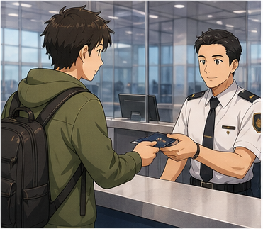

---

## 2. Mục tiêu bài học

Sau bài học, người học có thể:

1. Hiểu sự khác nhau cơ bản giữa **immigration** và **customs**.
2. Xuất trình hộ chiếu khi được yêu cầu.
3. Hiểu và sử dụng **arrival card**.
4. Hiểu và sử dụng **immigration form**.
5. Trả lời câu hỏi về mục đích chuyến đi.
6. Nói mình đi du lịch hay đi công tác.
7. Nói thời gian dự định lưu trú.
8. Nói nơi mình sẽ ở.
9. Trả lời câu hỏi về vé khứ hồi.
10. Hiểu **customs declaration**.
11. Trả lời câu hỏi **Do you have anything to declare?**
12. Khai báo một số đồ vật đơn giản.
13. Nói về hành lý.
14. Hiểu yêu cầu kiểm tra hành lý.
15. Dùng **Here you are** và **Here it is** tự nhiên.
16. Trả lời ngắn gọn nhưng đầy đủ trước nhân viên nhập cảnh.
17. Dùng các cách nói lịch sự tại cửa khẩu.
18. Duy trì một đoạn hội thoại 6–8 lượt tại khu vực nhập cảnh hoặc hải quan.

---

## 3. Sơ đồ giao tiếp

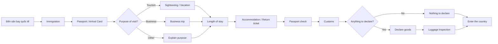

### Mẫu đơn giản

`May I have your passport, please?`
→ `Here you are.`
→ `What's the purpose of your visit?`
→ `I'm here for sightseeing.`
→ `How long will you stay?`
→ `I'll be here for two weeks.`
→ `Do you have anything to declare?`
→ `No, I don't.`

---

# 4. Từ vựng trọng tâm — Core Vocabulary

## 4.1. **immigration** /ˌɪm.ɪˈɡreɪ.ʃən/

**Nghĩa:** thủ tục nhập cảnh; cơ quan kiểm soát nhập cảnh

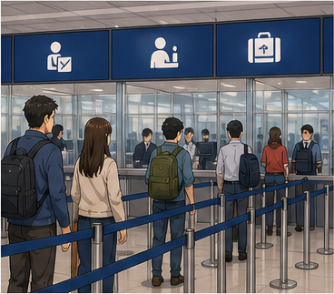

**Ví dụ:**

* **We need to go through immigration first.**
  — Chúng ta cần làm thủ tục nhập cảnh trước.

* **The immigration officer checked my passport.**
  — Nhân viên nhập cảnh đã kiểm tra hộ chiếu của tôi.

---

## 4.2. **immigration officer** /ˌɪm.ɪˈɡreɪ.ʃən ˈɒf.ɪ.sər/

**Nghĩa:** nhân viên nhập cảnh

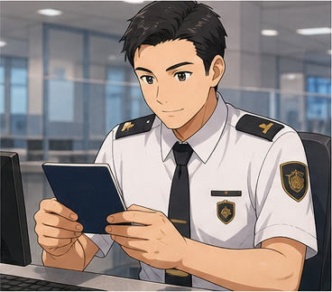

**Ví dụ:**

* **The immigration officer asked me several questions.**
  — Nhân viên nhập cảnh hỏi tôi một số câu.

* **Please answer the officer clearly.**
  — Hãy trả lời nhân viên một cách rõ ràng.

---

## 4.3. **passport** /ˈpɑːs.pɔːt/

**Nghĩa:** hộ chiếu

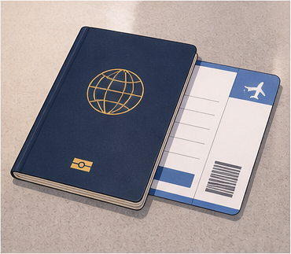

**Ví dụ:**

* **May I have your passport, please?**
  — Tôi có thể xem hộ chiếu của bạn được không?

* **Here's my passport.**
  — Đây là hộ chiếu của tôi.

---

## 4.4. **arrival card** /əˈraɪ.vəl kɑːd/

**Nghĩa:** thẻ nhập cảnh

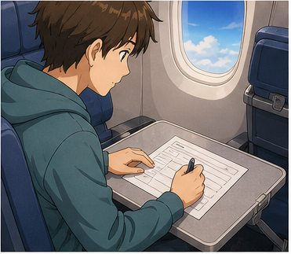

**Ví dụ:**

* **Please complete your arrival card.**
  — Vui lòng điền thẻ nhập cảnh.

* **Here's my passport and arrival card.**
  — Đây là hộ chiếu và thẻ nhập cảnh của tôi.

> Một số quốc gia đã chuyển sang khai báo nhập cảnh điện tử nên không phải nơi nào cũng sử dụng thẻ giấy.

---

## 4.5. **immigration form** /ˌɪm.ɪˈɡreɪ.ʃən fɔːm/

**Nghĩa:** mẫu khai nhập cảnh

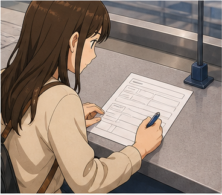

**Ví dụ:**

* **Here's my immigration form.**
  — Đây là mẫu khai nhập cảnh của tôi.

* **Please complete the immigration form.**
  — Vui lòng điền mẫu khai nhập cảnh.

---

## 4.6. **purpose of your visit** /ˈpɜː.pəs əv jɔː ˈvɪz.ɪt/

**Nghĩa:** mục đích chuyến đi của bạn

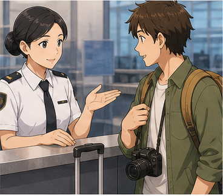

**Ví dụ:**

* **What's the purpose of your visit?**
  — Mục đích chuyến đi của bạn là gì?

* **The purpose of my visit is tourism.**
  — Mục đích chuyến đi của tôi là du lịch.

---

## 4.7. **sightseeing** /ˈsaɪtˌsiː.ɪŋ/

**Nghĩa:** tham quan, ngắm cảnh


**Ví dụ:**

* **I'm here for sightseeing.**
  — Tôi đến đây để tham quan.

* **We're planning to do some sightseeing.**
  — Chúng tôi dự định đi tham quan.

---

## 4.8. **vacation** /vəˈkeɪ.ʃən/

**Nghĩa:** kỳ nghỉ


**Ví dụ:**

* **I'm here on vacation.**
  — Tôi đến đây để nghỉ dưỡng / du lịch.

* **I'm taking a two-week vacation.**
  — Tôi đang có một kỳ nghỉ hai tuần.

---

## 4.9. **on business** /ɒn ˈbɪz.nəs/

**Nghĩa:** đi công tác, vì công việc


**Ví dụ:**

* **I'm here on business.**
  — Tôi đến đây vì công việc.

* **Are you here on business or for pleasure?**
  — Bạn đến đây vì công việc hay du lịch?

---

## 4.10. **length of stay**

**Nghĩa:** thời gian lưu trú

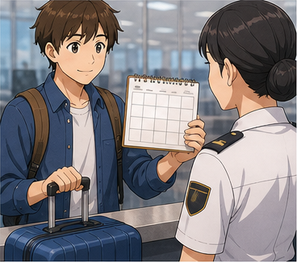

**Ví dụ:**

* **How long will you be staying?**
  — Bạn sẽ ở lại bao lâu?

* **I'll be staying for two weeks.**
  — Tôi sẽ ở lại trong hai tuần.

---

## 4.11. **return ticket** /rɪˈtɜːn ˌtɪk.ɪt/

**Nghĩa:** vé khứ hồi / vé quay về

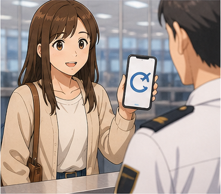

**Ví dụ:**

* **Do you have a return ticket?**
  — Bạn có vé khứ hồi không?

* **My return ticket is inside my bag.**
  — Vé khứ hồi của tôi ở trong túi.

---

## 4.12. **accommodation** /əˌkɒm.əˈdeɪ.ʃən/

**Nghĩa:** nơi lưu trú, chỗ ở

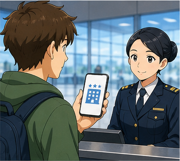

**Ví dụ:**

* **Where is your accommodation?**
  — Nơi lưu trú của bạn ở đâu?

* **My accommodation is in the city center.**
  — Chỗ ở của tôi nằm ở trung tâm thành phố.

---

## 4.13. **customs** /ˈkʌs.təmz/

**Nghĩa:** hải quan

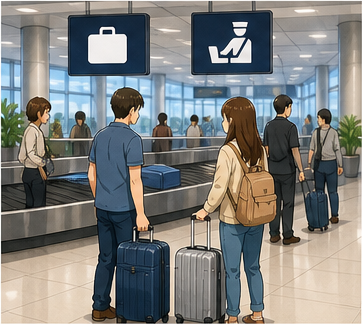

**Ví dụ:**

* **We have to go through customs.**
  — Chúng tôi phải qua hải quan.

* **The customs officer checked my luggage.**
  — Nhân viên hải quan đã kiểm tra hành lý của tôi.

---

## 4.14. **customs officer** /ˈkʌs.təmz ˈɒf.ɪ.sər/

**Nghĩa:** nhân viên hải quan

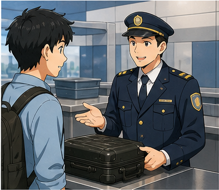

**Ví dụ:**

* **The customs officer asked me to open my suitcase.**
  — Nhân viên hải quan yêu cầu tôi mở vali.

---

## 4.15. **customs declaration** /ˈkʌs.təmz ˌdek.ləˈreɪ.ʃən/

**Nghĩa:** tờ khai hải quan

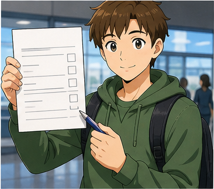

**Ví dụ:**

* **Please show me your customs declaration.**
  — Vui lòng cho tôi xem tờ khai hải quan.

* **I've completed the customs declaration.**
  — Tôi đã hoàn thành tờ khai hải quan.

---

## 4.16. **declare** /dɪˈkleər/

**Nghĩa:** khai báo


**Ví dụ:**

* **Do you have anything to declare?**
  — Bạn có gì cần khai báo không?

* **I have some gifts to declare.**
  — Tôi có một số quà tặng cần khai báo.

---

## 4.17. **oral declaration** /ˈɔː.rəl ˌdek.ləˈreɪ.ʃən/

**Nghĩa:** khai báo bằng lời nói

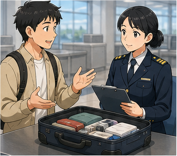

**Ví dụ:**

* **May I make an oral declaration?**
  — Tôi có thể khai báo bằng lời được không?

* **The officer allowed me to make an oral declaration.**
  — Nhân viên cho phép tôi khai báo bằng lời.

---

## 4.18. **luggage** /ˈlʌɡ.ɪdʒ/

**Nghĩa:** hành lý


**Ví dụ:**

* **Is this all your luggage?**
  — Đây có phải toàn bộ hành lý của bạn không?

* **Please open your luggage.**
  — Vui lòng mở hành lý của bạn.

> **luggage** thường là danh từ không đếm được.

Không nói:

❌ **two luggages**

Nên nói:

✅ **two bags**
✅ **two pieces of luggage**

---

## 4.19. **examine** /ɪɡˈzæm.ɪn/

**Nghĩa:** kiểm tra kỹ

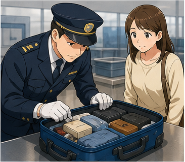

**Ví dụ:**

* **Let me examine your luggage.**
  — Để tôi kiểm tra hành lý của bạn.

* **The officer examined my suitcase.**
  — Nhân viên đã kiểm tra vali của tôi.

---

## 4.20. **tour group** /ˈtʊə ɡruːp/

**Nghĩa:** đoàn du lịch


**Ví dụ:**

* **I'm traveling with a tour group.**
  — Tôi đang đi cùng một đoàn du lịch.

* **There are twenty members in our tour group.**
  — Đoàn du lịch của chúng tôi có 20 thành viên.

---

## 4.21. **member** /ˈmem.bər/

**Nghĩa:** thành viên

**Ví dụ:**

* **I'm a member of this tour group.**
  — Tôi là thành viên của đoàn du lịch này.

---

## 4.22. **travel agency** /ˈtræv.əl ˌeɪ.dʒən.si/

**Nghĩa:** công ty / đại lý du lịch


**Ví dụ:**

* **The trip was arranged by a travel agency.**
  — Chuyến đi được một công ty du lịch tổ chức.

* **A local travel agency arranged our hotel.**
  — Một công ty du lịch địa phương đã đặt khách sạn cho chúng tôi.

---

## 4.23. **Here you are**

**Nghĩa:** đây ạ / của bạn đây

Dùng khi đưa thứ gì đó cho người khác.

**Ví dụ:**

**Officer:** May I see your passport?
**Passenger:** **Here you are.**

---

# 5. Bảng tổng hợp từ vựng

| Từ / cụm từ             | IPA               | Nghĩa tiếng Việt    | Ví dụ ngắn               |
| ----------------------- | ----------------- | ------------------- | ------------------------ |
| **immigration**         | /ˌɪm.ɪˈɡreɪ.ʃən/  | nhập cảnh           | go through immigration   |
| **immigration officer** | —                 | nhân viên nhập cảnh | ask the officer          |
| **passport**            | /ˈpɑːs.pɔːt/      | hộ chiếu            | show your passport       |
| **arrival card**        | —                 | thẻ nhập cảnh       | complete an arrival card |
| **immigration form**    | —                 | mẫu khai nhập cảnh  | fill in the form         |
| **purpose of visit**    | —                 | mục đích chuyến đi  | purpose of your visit    |
| **sightseeing**         | /ˈsaɪtˌsiː.ɪŋ/    | tham quan           | here for sightseeing     |
| **vacation**            | /vəˈkeɪ.ʃən/      | kỳ nghỉ             | on vacation              |
| **on business**         | —                 | đi công tác         | here on business         |
| **length of stay**      | —                 | thời gian lưu trú   | two-week stay            |
| **return ticket**       | —                 | vé khứ hồi          | show a return ticket     |
| **accommodation**       | /əˌkɒm.əˈdeɪ.ʃən/ | chỗ ở               | hotel accommodation      |
| **customs**             | /ˈkʌs.təmz/       | hải quan            | go through customs       |
| **customs officer**     | —                 | nhân viên hải quan  | customs officer          |
| **customs declaration** | —                 | tờ khai hải quan    | customs declaration form |
| **declare**             | /dɪˈkleər/        | khai báo            | declare goods            |
| **oral declaration**    | —                 | khai báo bằng lời   | make an oral declaration |
| **luggage**             | /ˈlʌɡ.ɪdʒ/        | hành lý             | examine luggage          |
| **examine**             | /ɪɡˈzæm.ɪn/       | kiểm tra kỹ         | examine your bag         |
| **tour group**          | —                 | đoàn du lịch        | travel with a tour group |
| **member**              | /ˈmem.bər/        | thành viên          | group member             |
| **travel agency**       | —                 | công ty du lịch     | local travel agency      |
| **Here you are**        | —                 | đây ạ               | Here you are.            |

---

# 6. Mẫu câu giao tiếp — Useful Structures

## 6.1. Yêu cầu xem hộ chiếu

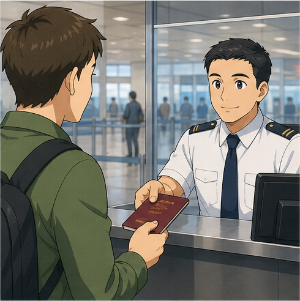

### **May I have your passport, please?**

— Tôi có thể xem hộ chiếu của bạn được không?

Cách khác:

* **May I see your passport, please?**
* **Passport, please.**
* **Could I see your passport?**

### Phản hồi

* **Here you are.**
* **Certainly. Here you are.**
* **Of course.**

---

## 6.2. Đưa hộ chiếu và giấy tờ

### **Here's my passport.**

— Đây là hộ chiếu của tôi.

Ví dụ:

* **Here's my arrival card.**
* **Here's my immigration form.**
* **Here's my customs declaration.**

Nếu đang trực tiếp đưa đồ vật cho người khác:

### **Here you are.**

— Đây ạ.

---

## 6.3. Hỏi mục đích chuyến đi

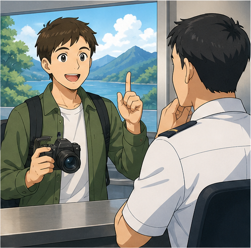

### **What's the purpose of your visit?**

— Mục đích chuyến đi của bạn là gì?

Cách trả lời:

* **I'm here for sightseeing.**
* **I'm here for tourism.**
* **I'm here on vacation.**
* **I'm here on business.**
* **I'm visiting friends.**
* **I'm visiting my family.**

---

## 6.4. Business or pleasure?

### **Are you here on business or for pleasure?**

— Bạn đến đây vì công việc hay du lịch?

Có thể trả lời:

* **For pleasure.**
* **I'm on vacation.**
* **I'm here on business.**
* **I'm here for a conference.**

> Trong ngữ cảnh này, **for pleasure** nghĩa là đi vì mục đích cá nhân, nghỉ dưỡng hoặc du lịch, đối lập với đi công tác.

---

## 6.5. Nói mình đến để tham quan

### **I'm here to + V.**

Ví dụ:

* **I'm here to sightsee.**
* **I'm here to visit some friends.**
* **I'm here to attend a conference.**
* **I'm here to study.**

Tự nhiên hơn trong nhiều tình huống du lịch:

* **I'm here for sightseeing.**
* **I'm here on vacation.**

---

## 6.6. Hỏi thời gian lưu trú

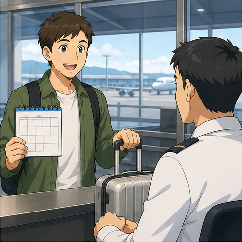

### **How long will you be staying?**

— Bạn sẽ ở lại bao lâu?

Cách khác:

* **How long will you stay?**
* **How long are you staying?**

### Trả lời

* **I'll be here for two weeks.**
* **I'm staying for seven days.**
* **I'll be staying for ten days.**

### Cấu trúc

`for + khoảng thời gian`

Ví dụ:

* **for three days**
* **for one week**
* **for two weeks**
* **for a month**

---

## 6.7. Hỏi nơi lưu trú

### **Where will you be staying?**

— Bạn sẽ ở đâu?

Trả lời:

* **I'm staying at the Hilton Hotel.**
* **I'm staying with a friend.**
* **I'm staying with my family.**
* **I've booked a hotel in the city center.**

---

## 6.8. Hỏi vé khứ hồi

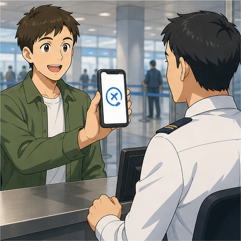

### **Do you have a return ticket?**

— Bạn có vé khứ hồi không?

Trả lời:

* **Yes, I do.**
* **Yes. Here it is.**
* **Yes. My return flight is next Friday.**

---

## 6.9. Hỏi về đoàn du lịch

### **Are you traveling alone or with a group?**

— Bạn đi một mình hay cùng đoàn?

Trả lời:

* **I'm traveling alone.**
* **I'm traveling with my family.**
* **I'm traveling with a tour group.**

---

## 6.10. Hỏi có gì cần khai báo không

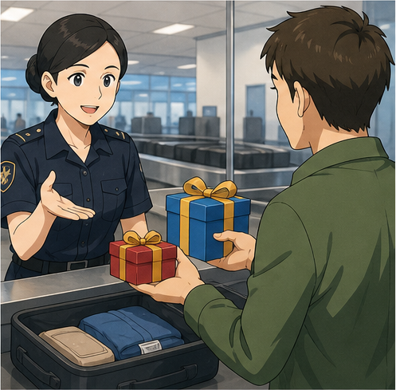

### **Do you have anything to declare?**

— Bạn có gì cần khai báo không?

Nếu không:

* **No, I don't.**
* **No, nothing.**
* **I have nothing to declare.**

Nếu có:

* **Yes, I do.**
* **I have some gifts to declare.**
* **I have two electronic devices to declare.**

---

## 6.11. Yêu cầu tờ khai hải quan

### **Please show me your customs declaration.**

— Vui lòng cho tôi xem tờ khai hải quan.

Phản hồi:

* **Here you are.**
* **Certainly.**
* **I've completed it already.**

---

## 6.12. Khai báo bằng lời

### **May I make an oral declaration?**

— Tôi có thể khai báo bằng lời được không?

Nếu được hỏi:

### **What would you like to declare?**

— Bạn muốn khai báo gì?

Trả lời:

* **I have two electronic devices.**
* **They're gifts for my friends.**
* **I have some food in my luggage.**

---

## 6.13. Nói đồ vật là quà tặng

### **They're gifts for my friends.**

— Chúng là quà cho bạn bè của tôi.

Cấu trúc:

`something + be + a gift / gifts for + someone`

Ví dụ:

* **This is a gift for my sister.**
* **These are gifts for my friends.**

---

## 6.14. Kiểm tra hành lý

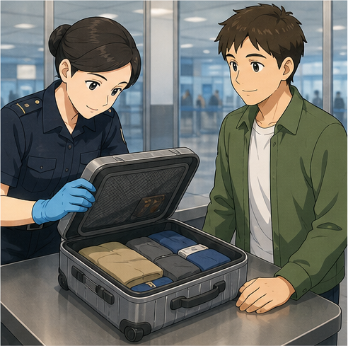

### **Let me examine your luggage.**

— Để tôi kiểm tra hành lý của bạn.

Cách khác thường gặp:

* **Please open your suitcase.**
* **May I inspect your bag?**
* **Is this your luggage?**

Phản hồi:

* **Sure.**
* **Of course.**
* **Certainly.**

---

## 6.15. Hỏi đồ vật thuộc về ai

### **Is this your bag?**

— Đây có phải túi của bạn không?

* **Yes, it is.**
* **No, it isn't.**

### **Is this all your luggage?**

— Đây có phải toàn bộ hành lý của bạn không?

* **Yes, it is.**
* **No. I have one more suitcase.**

---

## 6.16. Nói về lịch trình

### **I'm staying until + thời điểm.**

* **I'm staying until Friday.**
* **I'm staying until August 20.**

Hoặc:

### **My return flight is on + ngày.**

* **My return flight is on Monday.**

---

## 6.17. Nói về địa chỉ lưu trú

### **I'll be staying at + địa điểm.**

* **I'll be staying at a hotel.**
* **I'll be staying at my friend's house.**

Có thể được hỏi:

### **What's the address?**

— Địa chỉ là gì?

---

## 6.18. Xin nhắc lại câu hỏi

Trong môi trường sân bay, người nói có thể nói khá nhanh.

Nếu không nghe rõ:

### **Sorry, could you repeat that, please?**

— Xin lỗi, bạn có thể nhắc lại được không?

Hoặc:

* **Sorry?**
* **Could you say that again, please?**
* **Could you speak a little more slowly, please?**

---

## 6.19. Xin thời gian lấy giấy tờ

### **Just a moment, please.**

— Xin chờ một chút.

Ví dụ:

**Officer:** Do you have your hotel booking?
**Passenger:** **Yes. Just a moment, please.**

---

## 6.20. Kết thúc thủ tục

Nhân viên có thể nói:

* **Everything is fine.**
* **You're all set.**
* **You may proceed.**
* **Welcome to the United States.**
* **Have a nice stay.**

Bạn có thể trả lời:

* **Thank you.**
* **Thanks very much.**
* **Have a nice day.**

---

# 7. Immigration và Customs khác nhau như thế nào?

| Khu vực         | Chức năng chính              | Câu hỏi thường gặp                                  |
| --------------- | ---------------------------- | --------------------------------------------------- |
| **Immigration** | Kiểm tra người nhập cảnh     | Passport? Purpose of visit? How long will you stay? |
| **Customs**     | Kiểm tra hàng hóa và hành lý | Anything to declare? What's in your luggage?        |

### Immigration

Thường tập trung vào:

* hộ chiếu;
* visa nếu cần;
* mục đích chuyến đi;
* thời gian lưu trú;
* nơi lưu trú;
* vé khứ hồi;
* kế hoạch chuyến đi.

### Customs

Thường tập trung vào:

* hàng hóa;
* thực phẩm;
* tiền mặt;
* quà tặng;
* hàng hóa phải khai báo;
* hành lý.

### Sơ đồ

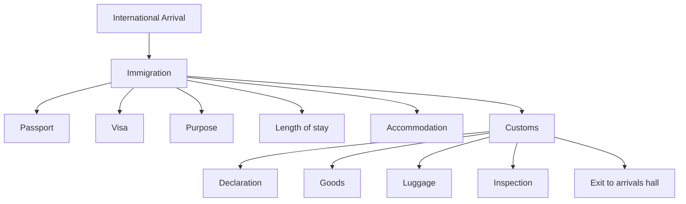

---

# 8. Phân biệt **travel**, **trip**, **tour** và **journey**

## **travel**

Nói chung về việc đi lại hoặc du lịch.

**I love traveling.**

---

## **trip**

Một chuyến đi cụ thể.

**I'm on a business trip.**

---

## **tour**

Một chuyến tham quan có lịch trình hoặc đoàn tổ chức.

**I'm traveling with a tour group.**

---

## **journey**

Hành trình từ nơi này đến nơi khác, nhấn mạnh quá trình di chuyển.

**It was a long journey.**

### Bảng so sánh

| Từ          | Nghĩa                 | Ví dụ           |
| ----------- | --------------------- | --------------- |
| **travel**  | việc đi lại nói chung | I love travel.  |
| **trip**    | một chuyến đi         | a business trip |
| **tour**    | chuyến tham quan      | a city tour     |
| **journey** | hành trình            | a long journey  |

---

# 9. Phát âm trọng tâm

## 9.1. **immigration**

**immigration**
/ˌɪm.ɪˈɡreɪ.ʃən/

Trọng âm:

immi-**GRA**-tion

---

## 9.2. **passport**

**passport**
/ˈpɑːs.pɔːt/

Trọng âm:

**PASS**-port

---

## 9.3. **arrival**

**arrival**
/əˈraɪ.vəl/

Trọng âm:

a-**RI**-val

---

## 9.4. **purpose**

**purpose**
/ˈpɜː.pəs/

Trọng âm:

**PUR**-pose

---

## 9.5. **sightseeing**

**sightseeing**
/ˈsaɪtˌsiː.ɪŋ/

Nhấn mạnh phần:

**SIGHT**-seeing

---

## 9.6. **customs**

**customs**
/ˈkʌs.təmz/

Trọng âm:

**CUS**-toms

---

## 9.7. **declaration**

**declaration**
/ˌdek.ləˈreɪ.ʃən/

Trọng âm:

de-cla-**RA**-tion

---

## 9.8. **luggage**

**luggage**
/ˈlʌɡ.ɪdʒ/

Trọng âm:

**LUG**-gage

---

## 9.9. Nối âm trong hội thoại

### **May I have your passport, please?**

Luyện theo cụm:

`May-I-have-your-passport-please?`

### **What's the purpose of your visit?**

Luyện:

`What's-the-purpose-of-your-visit?`

### **Do you have anything to declare?**

Luyện:

`Do-you-have-anything-to-declare?`

### **How long will you be staying?**

Luyện:

`How-long-will-you-be-staying?`

---

# 10. Hội thoại thực tế — Real-Life Conversation

## Hội thoại chính — Kiểm tra nhập cảnh

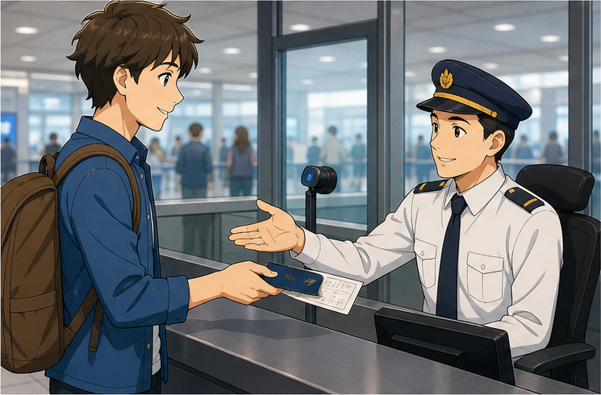

**Officer:** Good afternoon. May I have your passport and arrival card, please?
**Mai:** Certainly. Here you are.
**Officer:** Thank you. What's the purpose of your visit?
**Mai:** I'm here on vacation.
**Officer:** How long will you be staying?
**Mai:** I'll be here for two weeks.
**Officer:** Where will you be staying?
**Mai:** At a hotel in Los Angeles.
**Officer:** Do you have a return ticket?
**Mai:** Yes. Here it is.
**Officer:** Thank you. Everything looks fine. Enjoy your stay.
**Mai:** Thank you very much.

### Nội dung giao tiếp

```text
Chào hỏi
    ↓
Đưa hộ chiếu
    ↓
Nói mục đích chuyến đi
    ↓
Nói thời gian lưu trú
    ↓
Nói nơi ở
    ↓
Đưa vé khứ hồi
    ↓
Xác nhận nhập cảnh
```

---

## Hội thoại 2 — Du lịch theo đoàn


**Officer:** Are you traveling alone?
**Nam:** No. I'm traveling with a tour group.
**Officer:** How many people are in your group?
**Nam:** There are fifteen members.
**Officer:** Who arranged your trip?
**Nam:** A local travel agency.
**Officer:** How long are you staying?
**Nam:** We're staying for seven days.
**Officer:** Where are you staying?
**Nam:** At the Central Hotel.
**Officer:** All right. Thank you.
**Nam:** Thank you.

---

## Hội thoại 3 — Khai báo hải quan

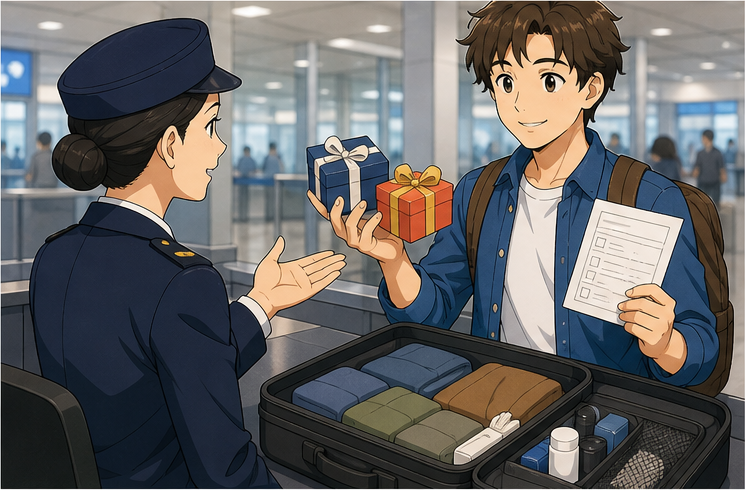

**Customs Officer:** Good afternoon. Do you have anything to declare?
**Alex:** Yes. I have two electronic devices.
**Customs Officer:** Are they for personal use?
**Alex:** No. They're gifts for my friends.
**Customs Officer:** Have you completed your customs declaration?
**Alex:** Yes. Here you are.
**Customs Officer:** Thank you. May I examine your luggage?
**Alex:** Of course.
**Customs Officer:** Please open this suitcase.
**Alex:** Sure.
**Customs Officer:** Thank you for your cooperation.
**Alex:** No problem.

---

## Hội thoại 4 — Không có gì cần khai báo

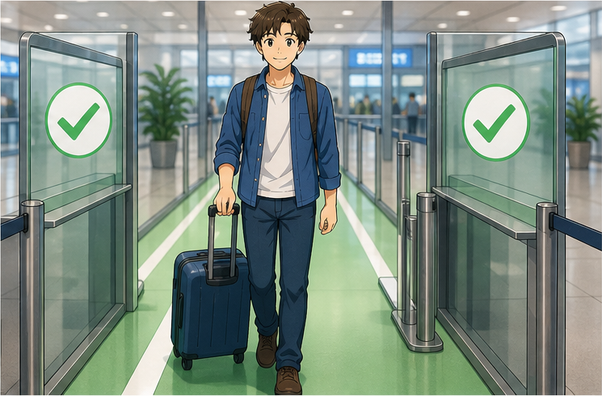

**Officer:** Do you have anything to declare?
**Mai:** No, I don't.
**Officer:** Are you carrying any food?
**Mai:** No.
**Officer:** Any gifts or commercial goods?
**Mai:** Just some clothes and personal items.
**Officer:** Is this all your luggage?
**Mai:** Yes, it is.
**Officer:** All right. You may proceed.
**Mai:** Thank you.

---

## Hội thoại 5 — Không nghe rõ câu hỏi

**Officer:** Where will you be staying?
**Linh:** Sorry, could you repeat that, please?
**Officer:** Where will you be staying during your visit?
**Linh:** I'll be staying at the Green Hotel.
**Officer:** How long will you stay there?
**Linh:** For five nights.
**Officer:** Do you have the hotel address?
**Linh:** Yes. Just a moment, please.
**Officer:** Thank you.
**Linh:** Here it is.

---

# 11. Natural Expressions — Cách nói tự nhiên

| Cụm từ                                | Nghĩa                              | Khi dùng      |
| ------------------------------------- | ---------------------------------- | ------------- |
| **May I have your passport, please?** | Cho tôi xem hộ chiếu nhé?          | Nhập cảnh     |
| **Here you are.**                     | Đây ạ.                             | Đưa giấy tờ   |
| **Here's my passport.**               | Đây là hộ chiếu của tôi.           | Đưa giấy tờ   |
| **What's the purpose of your visit?** | Mục đích chuyến đi là gì?          | Nhập cảnh     |
| **I'm here for sightseeing.**         | Tôi đến để tham quan.              | Mục đích      |
| **I'm here on vacation.**             | Tôi đến để du lịch/nghỉ dưỡng.     | Mục đích      |
| **I'm here on business.**             | Tôi đến vì công việc.              | Mục đích      |
| **For pleasure.**                     | Để du lịch/nghỉ ngơi.              | Trả lời ngắn  |
| **How long will you be staying?**     | Bạn sẽ ở bao lâu?                  | Thời gian     |
| **I'll be here for two weeks.**       | Tôi sẽ ở hai tuần.                 | Thời gian     |
| **Where will you be staying?**        | Bạn sẽ ở đâu?                      | Lưu trú       |
| **I'm staying at a hotel.**           | Tôi ở khách sạn.                   | Lưu trú       |
| **Do you have a return ticket?**      | Bạn có vé khứ hồi không?           | Chuyến đi     |
| **Here it is.**                       | Đây ạ.                             | Chỉ một vật   |
| **Do you have anything to declare?**  | Bạn có gì cần khai báo không?      | Hải quan      |
| **Nothing to declare.**               | Không có gì cần khai báo.          | Hải quan      |
| **I have something to declare.**      | Tôi có thứ cần khai báo.           | Hải quan      |
| **They're gifts for my friends.**     | Đây là quà cho bạn tôi.            | Khai báo      |
| **May I make an oral declaration?**   | Tôi có thể khai bằng lời không?    | Hải quan      |
| **Please open your suitcase.**        | Vui lòng mở vali.                  | Kiểm tra      |
| **Is this all your luggage?**         | Đây là toàn bộ hành lý phải không? | Hành lý       |
| **Just a moment, please.**            | Xin chờ một chút.                  | Tìm giấy tờ   |
| **Could you repeat that, please?**    | Bạn có thể nhắc lại không?         | Không nghe rõ |
| **You may proceed.**                  | Bạn có thể đi tiếp.                | Kết thúc      |
| **Enjoy your stay.**                  | Chúc bạn có kỳ nghỉ vui vẻ.        | Kết thúc      |

---

# 12. Lỗi thường gặp — Common Mistakes

## Lỗi 1: Trả lời mục đích chuyến đi quá dài

Không cần kể toàn bộ lịch trình.

△ **I'm coming because I have wanted to visit this country for many years and my friend recommended...**

Tự nhiên hơn:

✅ **I'm here on vacation.**

✅ **I'm here for sightseeing.**

✅ **I'm here on business.**

---

## Lỗi 2: Dùng **I go travel**

❌ **I go travel.**

✅ **I'm traveling.**

✅ **I'm here on vacation.**

✅ **I'm here for tourism.**

---

## Lỗi 3: Dùng sai **for**

❌ **I'll stay two weeks.**

Có thể hiểu nhưng trong bài nên luyện:

✅ **I'll stay for two weeks.**

✅ **I'll be here for two weeks.**

---

## Lỗi 4: Dùng **during two weeks**

❌ **I'll stay during two weeks.**

✅ **I'll stay for two weeks.**

**for + khoảng thời gian**

---

## Lỗi 5: Nhầm **immigration** và **customs**

**Immigration** kiểm tra chủ yếu về:

* người nhập cảnh;
* hộ chiếu;
* mục đích;
* thời gian lưu trú.

**Customs** kiểm tra chủ yếu về:

* hàng hóa;
* đồ vật;
* hành lý;
* khai báo.

---

## Lỗi 6: Dùng sai **luggage**

❌ **I have two luggages.**

✅ **I have two bags.**

✅ **I have two pieces of luggage.**

**luggage** thường là danh từ không đếm được.

---

## Lỗi 7: Nhầm **passport** và **visa**

### **passport**

= hộ chiếu xác nhận danh tính và quốc tịch.

### **visa**

= thị thực / giấy phép nhập cảnh theo quy định của quốc gia.

Không dùng hai từ này thay thế cho nhau.

---

## Lỗi 8: Trả lời **purpose of visit** bằng địa điểm

**Officer:** What's the purpose of your visit?

❌ **New York.**

Đây là địa điểm, không phải mục đích.

✅ **I'm here for sightseeing.**

---

## Lỗi 9: Trả lời sai câu hỏi **How long...?**

**Officer:** How long will you stay?

❌ **At a hotel.**

✅ **For ten days.**

Nếu hỏi:

**Where will you stay?**

→ **At a hotel.**

---

## Lỗi 10: Nhầm **Here you are** và **Here it is**

Cả hai đều có thể dùng khi đưa vật.

### **Here you are.**

Rất tự nhiên khi trực tiếp đưa đồ vật cho ai đó.

### **Here it is.**

Thường nhấn mạnh “nó đây”.

Ví dụ:

**Officer:** Do you have your return ticket?
**Passenger:** **Yes. Here it is.**

---

## Lỗi 11: Nói **I have nothing for declare**

❌ **I have nothing for declare.**

✅ **I have nothing to declare.**

✅ **Nothing to declare.**

---

## Lỗi 12: Nói **I don't have declare**

❌ **I don't have declare.**

✅ **I don't have anything to declare.**

---

## Lỗi 13: Không dùng câu lịch sự khi không nghe rõ

Không nên đoán câu hỏi.

Nên nói:

✅ **Sorry, could you repeat that, please?**

✅ **Could you speak a little more slowly, please?**

---

## Lỗi 14: Dịch trực tiếp “tôi đi chơi”

❌ **I'm here to play.**

Trong bối cảnh nhập cảnh nên nói:

✅ **I'm here on vacation.**

✅ **I'm here for sightseeing.**

✅ **I'm here for tourism.**

---

## Lỗi 15: Nhầm **tourist** và **tourism**

### **tourist**

= khách du lịch.

**I'm a tourist.**

### **tourism**

= hoạt động/ngành du lịch.

**I'm here for tourism.**

Trong hội thoại nhập cảnh, tự nhiên hơn:

**I'm here on vacation.**

---

# 13. Luyện tập có hướng dẫn

## Bài 1 — Nối từ với nghĩa

1. passport
2. arrival card
3. customs
4. luggage
5. declare
6. sightseeing

A. hành lý
B. tham quan
C. khai báo
D. hộ chiếu
E. hải quan
F. thẻ nhập cảnh

<details>
<summary>Đáp án</summary>

1–D
2–F
3–E
4–A
5–C
6–B

</details>

---

## Bài 2 — Điền từ vào chỗ trống

Dùng:

`passport` · `vacation` · `luggage` · `declare` · `weeks`

1. May I see your __________?
2. I'm here on __________.
3. I'll be here for two __________.
4. Do you have anything to __________?
5. Is this all your __________?

<details>
<summary>Đáp án</summary>

1. passport
2. vacation
3. weeks
4. declare
5. luggage

</details>

---

## Bài 3 — Chọn câu đúng

### 1. Bạn muốn nói mình đến để du lịch.

* A. I'm here on vacation.
* B. I'm here in vacation.
* C. I'm vacation here.

**Đáp án:** A

---

### 2. Bạn muốn nói sẽ ở hai tuần.

* A. I'll be here during two weeks.
* B. I'll be here for two weeks.
* C. I'll here for two weeks.

**Đáp án:** B

---

### 3. Nhân viên hỏi có gì cần khai báo không.

* A. Do you have something declaration?
* B. Do you have anything to declare?
* C. Do you declare anything have?

**Đáp án:** B

---

### 4. Bạn muốn đưa hộ chiếu.

* A. Here you are.
* B. There are you.
* C. Here are passport.

**Đáp án:** A

---

## Bài 4 — Immigration hay Customs?

Điền:

`immigration` hoặc `customs`

1. Passport control usually happens at __________.
2. Goods may be inspected at __________.
3. “What's the purpose of your visit?” is usually asked at __________.
4. “Do you have anything to declare?” is usually asked at __________.

<details>
<summary>Đáp án</summary>

1. immigration
2. customs
3. immigration
4. customs

</details>

---

## Bài 5 — Hoàn thành câu trả lời

### 1.

**Officer:** What's the purpose of your visit?
**Passenger:** I'm here __________.

Gợi ý:

* on vacation
* for sightseeing
* on business

### 2.

**Officer:** How long will you be staying?
**Passenger:** I'll be here __________.

Gợi ý:

* for five days
* for one week
* for two weeks

### 3.

**Officer:** Where will you be staying?
**Passenger:** I'm staying __________.

Gợi ý:

* at a hotel
* with my friend
* with my family

---

## Bài 6 — Hoàn thành hội thoại

**Officer:** May I see your __________, please?
**Passenger:** Certainly. Here you are.
**Officer:** What's the __________ of your visit?
**Passenger:** I'm here for sightseeing.
**Officer:** How long will you be __________?
**Passenger:** For ten days.
**Officer:** Do you have a __________ ticket?
**Passenger:** Yes. Here it is.

<details>
<summary>Đáp án</summary>

1. passport
2. purpose
3. staying
4. return

</details>

---

## Bài 7 — Khai báo hải quan

Điền:

`declare` · `gifts` · `luggage` · `customs declaration`

**Officer:** Do you have anything to __________?
**Passenger:** Yes. I have some __________ for my friends.
**Officer:** May I see your __________?
**Passenger:** Certainly. Here you are.
**Officer:** Thank you. Let me examine your __________.

<details>
<summary>Đáp án</summary>

1. declare
2. gifts
3. customs declaration
4. luggage

</details>

---

# 14. Speaking Challenge — Thử thách nói

## Nhiệm vụ 1 — Đọc mẫu câu

Đọc thành tiếng:

* **May I have your passport, please?**
* **Here you are.**
* **What's the purpose of your visit?**
* **I'm here for sightseeing.**
* **I'm here on vacation.**
* **I'll be here for two weeks.**
* **Where will you be staying?**
* **Do you have a return ticket?**
* **Do you have anything to declare?**
* **I have nothing to declare.**
* **Please open your suitcase.**
* **Could you repeat that, please?**

Đọc mỗi câu hai lần:

* lần 1 chậm và rõ;
* lần 2 theo tốc độ hội thoại tự nhiên.

---

## Nhiệm vụ 2 — Trả lời nhân viên nhập cảnh

Hãy tưởng tượng bạn đang nhập cảnh vào một quốc gia.

Trả lời:

1. What's the purpose of your visit?
2. How long will you be staying?
3. Where will you be staying?
4. Are you traveling alone?
5. Do you have a return ticket?
6. What places are you planning to visit?

Ví dụ:

> **I'm here on vacation. I'll be staying for seven days. I'm staying at a hotel in the city center. I'm traveling alone, and I have a return ticket. I'm planning to visit several museums and tourist attractions.**

---

## Nhiệm vụ 3 — Qua hải quan

Tình huống:

> Bạn mang theo một số quà cho bạn bè và nhân viên hải quan hỏi về hành lý.

Phải sử dụng ít nhất:

* **I have something to declare.**
* **They're gifts for my friends.**
* **Here's my customs declaration.**
* **This is my luggage.**
* **Of course.**

---

## Nhiệm vụ 4 — Hội thoại 8 lượt

Tạo một đoạn hội thoại có ít nhất:

* 1 câu yêu cầu hộ chiếu;
* 1 câu nói mục đích chuyến đi;
* 1 câu nói thời gian lưu trú;
* 1 câu nói nơi lưu trú;
* 1 câu về vé khứ hồi;
* 1 câu hỏi về khai báo;
* 1 câu trả lời về hành lý;
* 1 câu kết thúc lịch sự.

---

## Nhiệm vụ 5 — Ghi âm

Ghi âm **45–60 giây**, sau đó kiểm tra:

* [ ] Tôi có thể đưa hộ chiếu bằng câu **Here you are.**
* [ ] Tôi hiểu **purpose of your visit**.
* [ ] Tôi có thể nói mình đi du lịch.
* [ ] Tôi có thể nói mình đi công tác.
* [ ] Tôi có thể nói thời gian lưu trú.
* [ ] Tôi có thể nói nơi lưu trú.
* [ ] Tôi hiểu **return ticket**.
* [ ] Tôi phân biệt **immigration** và **customs**.
* [ ] Tôi hiểu **customs declaration**.
* [ ] Tôi có thể trả lời **Do you have anything to declare?**
* [ ] Tôi dùng đúng **luggage**.
* [ ] Tôi có thể xin người khác nhắc lại câu hỏi.
* [ ] Tôi có thể duy trì hội thoại ít nhất 45 giây.

---

# 15. Practice Mission — Nhiệm vụ thực tế

Trong hôm nay, hãy tạo một cuộc hội thoại theo công thức:

> **Document → Purpose → Length of stay → Accommodation → Customs → Confirmation**

Ví dụ:

> **May I see your passport, please?**
> ↓
> **Certainly. Here you are.**
> ↓
> **What's the purpose of your visit?**
> ↓
> **I'm here on vacation.**
> ↓
> **How long will you be staying?**
> ↓
> **For one week.**
> ↓
> **Do you have anything to declare?**
> ↓
> **No, I don't.**
> ↓
> **All right. Enjoy your stay.**

Sau đó viết hoặc nói một đoạn hội thoại **8–10 lượt** cho một trong các tình huống:

* nhập cảnh để đi du lịch;
* nhập cảnh để đi công tác;
* đi thăm bạn bè;
* đi du lịch theo đoàn;
* xuất trình vé khứ hồi;
* trả lời về khách sạn;
* khai báo một món quà;
* không có gì cần khai báo;
* được yêu cầu mở hành lý;
* không nghe rõ câu hỏi của nhân viên.

---

# 16. Tự đánh giá cuối bài

Đánh dấu khi bạn có thể thực hiện mà không nhìn bài:

* [ ] Tôi hiểu **immigration**.
* [ ] Tôi hiểu **customs**.
* [ ] Tôi có thể nói **Here's my passport.**
* [ ] Tôi có thể dùng **Here you are.**
* [ ] Tôi hiểu **arrival card**.
* [ ] Tôi hiểu **immigration form**.
* [ ] Tôi có thể trả lời **What's the purpose of your visit?**
* [ ] Tôi có thể nói **I'm here for sightseeing.**
* [ ] Tôi có thể nói **I'm here on vacation.**
* [ ] Tôi có thể nói **I'm here on business.**
* [ ] Tôi có thể trả lời **How long will you be staying?**
* [ ] Tôi có thể nói nơi lưu trú.
* [ ] Tôi hiểu **return ticket**.
* [ ] Tôi hiểu **customs declaration**.
* [ ] Tôi có thể trả lời **Do you have anything to declare?**
* [ ] Tôi biết cách nói **I have nothing to declare.**
* [ ] Tôi hiểu **luggage**.
* [ ] Tôi có thể nói về quà tặng trong hành lý.
* [ ] Tôi có thể xin nhân viên nhắc lại câu hỏi.
* [ ] Tôi có thể duy trì hội thoại nhập cảnh ít nhất 45 giây.

---

# 17. Câu hỏi mở cuối bài

**Imagine you have just arrived in another country for a two-week vacation. An immigration officer asks for your passport, the purpose of your visit, where you will stay, how long you will remain in the country and whether you have a return ticket. After that, a customs officer asks whether you have anything to declare. How would you answer all of these questions clearly and politely?**

*Hãy tưởng tượng bạn vừa đến một quốc gia khác để du lịch trong hai tuần. Nhân viên nhập cảnh yêu cầu hộ chiếu, hỏi mục đích chuyến đi, nơi lưu trú, thời gian bạn sẽ ở lại và bạn có vé khứ hồi hay không. Sau đó, nhân viên hải quan hỏi bạn có gì cần khai báo không. Bạn sẽ trả lời tất cả những câu hỏi này rõ ràng và lịch sự như thế nào?*

---

# 18. Ghi chú dành cho giảng viên

* **Module:** 03 — Travel Ready / Tiếng Anh cho những chuyến đi
* **Chủ điểm:** Immigration & Customs
* **Thời lượng video:** 8–12 phút
* **Luyện nói:** 5–10 phút

### Trọng tâm từ vựng

* immigration
* immigration officer
* passport
* arrival card
* immigration form
* purpose of visit
* sightseeing
* vacation
* on business
* length of stay
* accommodation
* return ticket
* customs
* customs officer
* customs declaration
* declare
* oral declaration
* luggage
* examine
* tour group
* member
* travel agency
* Here you are

### Trọng tâm cấu trúc

* **May I have your passport, please?**
* **May I see your passport?**
* **Here's my passport.**
* **Here you are.**
* **What's the purpose of your visit?**
* **I'm here for sightseeing.**
* **I'm here on vacation.**
* **I'm here on business.**
* **Are you here on business or for pleasure?**
* **How long will you be staying?**
* **I'll be here for two weeks.**
* **Where will you be staying?**
* **I'm staying at a hotel.**
* **Do you have a return ticket?**
* **Yes. Here it is.**
* **Are you traveling alone?**
* **I'm traveling with a tour group.**
* **Please show me your customs declaration.**
* **Do you have anything to declare?**
* **I have nothing to declare.**
* **I have something to declare.**
* **May I make an oral declaration?**
* **They're gifts for my friends.**
* **Let me examine your luggage.**
* **Please open your suitcase.**
* **Could you repeat that, please?**
* **Just a moment, please.**

### Trọng tâm phát âm

* **immigration**
* **passport**
* **arrival**
* **purpose**
* **sightseeing**
* **vacation**
* **customs**
* **declaration**
* **luggage**
* **accommodation**

### Lưu ý ngôn ngữ

* **immigration** và **customs** không phải cùng một thủ tục.

* **immigration** thường kiểm tra người nhập cảnh và giấy tờ.

* **customs** thường kiểm tra hàng hóa và hành lý.

* **luggage** thường là danh từ không đếm được.

* Không dùng:

  * ❌ **two luggages**

* Dùng:

  * ✅ **two bags**
  * ✅ **two pieces of luggage**

* Dùng **for + khoảng thời gian**:

  * **for three days**
  * **for one week**
  * **for two weeks**

* Với mục đích chuyến đi, các câu ngắn thường tốt hơn:

  * **I'm here on vacation.**
  * **I'm here for sightseeing.**
  * **I'm here on business.**

* **Here you are** thường dùng khi trực tiếp đưa giấy tờ hoặc đồ vật.

* **Here it is** thường dùng khi xác định một vật cụ thể:

  * **Do you have your return ticket?**
  * **Yes. Here it is.**

* **declare** = khai báo.

* **declaration** = lời khai / tờ khai.

* **customs declaration** = tờ khai hải quan.

* **arrival card** = thẻ nhập cảnh.

* **passport** = hộ chiếu.

* **visa** = thị thực.

* **return ticket** = vé quay về / vé khứ hồi.

* **accommodation** = nơi lưu trú.

* **sightseeing** = hoạt động tham quan.

* **tourist** = khách du lịch.

* **tourism** = du lịch với tư cách hoạt động/ngành.

* Khi không nghe rõ, khuyến khích người học nói:

  * **Could you repeat that, please?**
  * **Could you speak more slowly, please?**

* Không khuyến khích người học cố tạo câu dài tại quầy nhập cảnh.

* Mục tiêu ở trình độ A1–A2 là:

  * nghe đúng câu hỏi;
  * xác định thông tin được yêu cầu;
  * trả lời ngắn;
  * trả lời đúng sự thật;
  * dùng cách nói lịch sự;
  * chuẩn bị giấy tờ cần thiết.

### Hoạt động gợi ý — Immigration Interview

Chia lớp thành cặp.

Một người đóng vai **immigration officer**, người còn lại là **traveler**.

Nhân viên hỏi:

> **May I see your passport, please?**

> **What's the purpose of your visit?**

> **How long will you be staying?**

> **Where will you be staying?**

> **Are you traveling alone?**

> **Do you have a return ticket?**

Người đi du lịch phải trả lời bằng thông tin tự tạo.

Ví dụ:

> **I'm here on vacation. I'll be staying for ten days. I'm staying at a hotel near the city center. I'm traveling with my brother, and my return flight is next Sunday.**

---

### Role-play mẫu — Qua cửa nhập cảnh

**Người A nhận:**

> Bạn là nhân viên nhập cảnh. Bạn cần kiểm tra hộ chiếu và thông tin chuyến đi của người B.

Người A phải sử dụng ít nhất:

* **May I have your passport, please?**
* **What's the purpose of your visit?**
* **How long will you be staying?**
* **Where will you be staying?**
* **Do you have a return ticket?**
* **Enjoy your stay.**

**Người B nhận:**

> Bạn đến du lịch trong 10 ngày và ở tại một khách sạn.

Người B phải sử dụng ít nhất:

* **Here you are.**
* **I'm here on vacation.**
* **I'll be here for ten days.**
* **I'm staying at a hotel.**
* **Yes. Here it is.**
* **Thank you.**

---

### Role-play mẫu — Khai báo hải quan

**Người A nhận:**

> Bạn là nhân viên hải quan và cần hỏi người B về đồ vật trong hành lý.

Người A phải sử dụng ít nhất:

* **Do you have anything to declare?**
* **What would you like to declare?**
* **May I see your customs declaration?**
* **Is this all your luggage?**
* **Please open your suitcase.**

**Người B nhận:**

> Bạn có một số quà tặng cho bạn bè trong hành lý.

Người B phải sử dụng ít nhất:

* **Yes, I do.**
* **I have some gifts to declare.**
* **They're gifts for my friends.**
* **Here's my customs declaration.**
* **Of course.**

---

### Role-play mẫu — Không nghe rõ nhân viên

**Người A nhận:**

> Bạn là nhân viên nhập cảnh và nói một số câu hỏi về nơi lưu trú và thời gian chuyến đi.

**Người B nhận:**

> Bạn là khách du lịch. Bạn không nghe rõ một câu hỏi và cần lịch sự yêu cầu người A nhắc lại.

Người B phải sử dụng:

* **Sorry, could you repeat that, please?**
* **Could you speak a little more slowly, please?**
* **Just a moment, please.**
* **Here it is.**

---

### Role-play mẫu — Du lịch theo đoàn

**Người A nhận:**

> Bạn là nhân viên nhập cảnh và muốn biết người B đang đi với ai.

Hỏi:

* **Are you traveling alone?**
* **Are you traveling with a tour group?**
* **How many people are in your group?**
* **Who arranged the trip?**
* **How long are you staying?**

**Người B nhận:**

> Bạn đang đi cùng một đoàn 12 người do công ty du lịch tổ chức.

Trả lời:

* **I'm traveling with a tour group.**
* **There are twelve members in our group.**
* **A travel agency arranged the trip.**
* **We're staying for one week.**

---

### Mẫu hội thoại cuối bài

**Officer:** Good afternoon. May I see your passport and arrival card, please?
**Traveler:** Certainly. Here you are.
**Officer:** What's the purpose of your visit?
**Traveler:** I'm here for sightseeing.
**Officer:** How long will you be staying?
**Traveler:** I'll be here for two weeks.
**Officer:** Where will you be staying?
**Traveler:** At a hotel in the city center.
**Officer:** Do you have a return ticket?
**Traveler:** Yes. Here it is.
**Officer:** Thank you. Do you have anything to declare?
**Traveler:** No, I don't.
**Officer:** All right. You may proceed. Enjoy your stay.
**Traveler:** Thank you very much.

---
