# LESSON 17 — LÊN KẾ HOẠCH CHO MỘT CHUYẾN BAY

> **Module 03 — Travel Ready / Tiếng Anh cho những chuyến đi**
> **Chủ đề:** Booking a Plane Ticket — Tìm chuyến bay, lựa chọn lịch trình và đặt vé máy bay
> **Trình độ gợi ý:** A1–A2
> **Thời lượng:** 8–12 phút học bài + 5–10 phút luyện nói

---

## 1. Tình huống thực tế

Khi chuẩn bị cho một chuyến đi bằng máy bay, bạn có thể cần liên hệ với **travel agency — đại lý du lịch**, hãng hàng không hoặc quầy vé để:

* hỏi về chuyến bay;
* đặt vé máy bay;
* chọn vé một chiều hoặc khứ hồi;
* hỏi giờ khởi hành;
* chọn hãng hàng không;
* chọn hạng ghế;
* hỏi chuyến bay tiếp theo;
* hỏi chuyến bay có điểm dừng hay không;
* đặt vé trước;
* yêu cầu suất ăn đặc biệt;
* hỏi về vé giảm giá;
* xác nhận lại chuyến bay;
* hỏi phương thức thanh toán;
* lấy vé tại sân bay.

Bạn cần biết cách nói những câu như:

* **I'd like to book a ticket to New York.**
* **I'd like a return ticket, please.**
* **I'd like a ticket for economy class.**
* **Can I book a return ticket in advance?**
* **How about the next flight?**
* **Does this flight make any stopovers?**
* **Are there any special discount tickets?**
* **Which airline do you prefer?**
* **What's the departure time?**
* **I'd like to reconfirm my flight.**
* **Could I book a vegetarian meal?**
* **I'll pick up my ticket at the airport.**
* **Can I pay in cash?**


---

## 2. Mục tiêu bài học

Sau bài học, người học có thể:

1. Nói rằng mình muốn đặt vé máy bay.
2. Nói điểm đến mong muốn.
3. Phân biệt **single ticket** và **return ticket**.
4. Sử dụng cách nói tự nhiên **one-way ticket** và **round-trip ticket**.
5. Hỏi về chuyến bay có sẵn.
6. Hỏi giờ khởi hành.
7. Hỏi về chuyến bay tiếp theo.
8. Hỏi chuyến bay có điểm dừng hay không.
9. Chọn hãng hàng không.
10. Chọn hạng ghế.
11. Yêu cầu suất ăn chay.
12. Hỏi về vé giảm giá.
13. Đặt vé trước.
14. Xác nhận lại chuyến bay.
15. Nói tên và số hiệu chuyến bay.
16. Hỏi về giá vé.
17. Hỏi phương thức thanh toán.
18. Nói rằng mình sẽ lấy vé tại sân bay.
19. Duy trì hội thoại đặt vé từ 6–8 lượt.
20. Tự tạo một đoạn hội thoại đặt vé dựa trên chuyến đi cá nhân.

---

## 3. Sơ đồ giao tiếp

```mermaid
flowchart LR
    A[Cần đi máy bay] --> B[Liên hệ hãng bay / đại lý]
    B --> C[Cho biết điểm đến]
    C --> D[Chọn ngày bay]
    D --> E[Chọn loại vé]
    E --> F[Chọn hãng hàng không]
    F --> G[Chọn hạng ghế]
    G --> H[Kiểm tra giờ bay]
    H --> I[Kiểm tra điểm dừng]
    I --> J[Yêu cầu dịch vụ đặc biệt]
    J --> K[Kiểm tra giá / giảm giá]
    K --> L[Thanh toán]
    L --> M[Xác nhận đặt vé]
```

### Mẫu đơn giản

`I'd like to book a ticket to New York.`

→ `When would you like to travel?`

→ `Next Friday, please.`

→ `Would you like a single or return ticket?`

→ `A return ticket, please.`

→ `Which airline do you prefer?`

→ `Vietnam Airlines, please.`

→ `Let me check.`

---

# 4. Từ vựng trọng tâm — Core Vocabulary

## 4.1. **travel agency** /ˈtræv.əl ˌeɪ.dʒən.si/

**Nghĩa:** đại lý du lịch


**Ví dụ:**

* **I booked my ticket through a travel agency.**
  — Tôi đặt vé thông qua một đại lý du lịch.

* **Let's call the travel agency.**
  — Hãy gọi cho đại lý du lịch.

---

## 4.2. **reserve** /rɪˈzɜːv/

**Nghĩa:** đặt trước, giữ chỗ

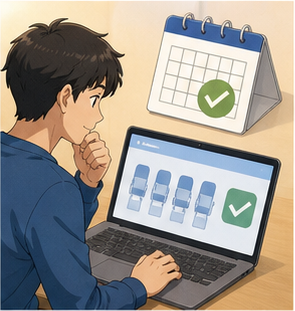

**Ví dụ:**

* **I'd like to reserve a seat.**
  — Tôi muốn đặt trước một chỗ ngồi.

* **Can I reserve a ticket in advance?**
  — Tôi có thể đặt vé trước không?

> Trong giao tiếp đặt vé, **book** thường được dùng tự nhiên hơn **reserve**:
>
> **I'd like to book a flight.**

---

## 4.3. **book** /bʊk/

**Nghĩa:** đặt vé, đặt chỗ

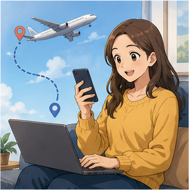

**Ví dụ:**

* **I'd like to book a ticket to New York.**
  — Tôi muốn đặt một vé đến New York.

* **Can I book a flight for tomorrow?**
  — Tôi có thể đặt chuyến bay cho ngày mai không?

---

## 4.4. **return ticket** /rɪˈtɜːn ˌtɪk.ɪt/

**Nghĩa:** vé khứ hồi

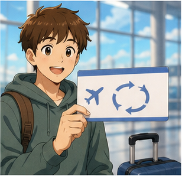

**Ví dụ:**

* **I'd like a return ticket, please.**
  — Tôi muốn một vé khứ hồi.

* **Can I book a return ticket in advance?**
  — Tôi có thể đặt vé khứ hồi trước không?

> **return ticket** phổ biến trong Anh-Anh.
>
> Trong Anh-Mỹ thường dùng:
>
> **round-trip ticket**

---

## 4.5. **single ticket** /ˈsɪŋ.ɡəl ˌtɪk.ɪt/

**Nghĩa:** vé một chiều

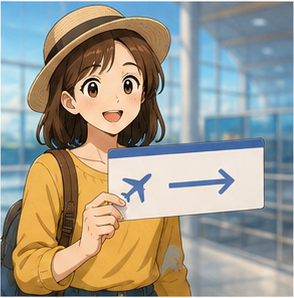

**Ví dụ:**

* **I'd like a single ticket to London.**
  — Tôi muốn một vé một chiều đến London.

* **A single ticket, please.**
  — Cho tôi một vé một chiều.

> Trong Anh-Mỹ, cách nói rất phổ biến là:
>
> **one-way ticket**

---

## 4.6. **airline** /ˈeə.laɪn/

**Nghĩa:** hãng hàng không


**Ví dụ:**

* **Which airline do you prefer?**
  — Bạn thích hãng hàng không nào?

* **I'm flying with Vietnam Airlines.**
  — Tôi bay với Vietnam Airlines.

---

## 4.7. **prefer** /prɪˈfɜːr/

**Nghĩa:** thích hơn, ưu tiên

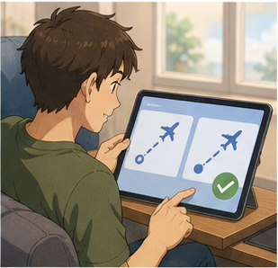

**Ví dụ:**

* **I prefer Vietnam Airlines.**
  — Tôi thích Vietnam Airlines hơn.

* **Which flight do you prefer?**
  — Bạn thích chuyến bay nào hơn?

### Cấu trúc

`prefer + noun`

**I prefer Vietnam Airlines.**

Hoặc:

`prefer A to B`

**I prefer morning flights to evening flights.**

---

## 4.8. **service** /ˈsɜː.vɪs/

**Nghĩa:** dịch vụ


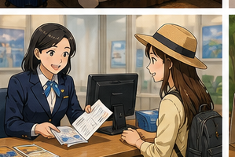
**Ví dụ:**

* **The airline provides good service.**
  — Hãng hàng không cung cấp dịch vụ tốt.

* **Is meal service included?**
  — Dịch vụ bữa ăn có được bao gồm không?

---

## 4.9. **check in** /ˌtʃek ˈɪn/

**Nghĩa:** làm thủ tục chuyến bay

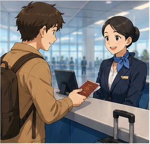

**Ví dụ:**

* **Where can I check in?**
  — Tôi có thể làm thủ tục ở đâu?

* **You should check in two hours before the flight.**
  — Bạn nên làm thủ tục trước chuyến bay hai giờ.

---

## 4.10. **in advance** /ɪn ədˈvɑːns/

**Nghĩa:** trước, từ trước


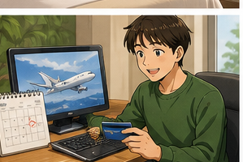
**Ví dụ:**

* **Can I book the ticket in advance?**
  — Tôi có thể đặt vé trước không?

* **It's cheaper if you book in advance.**
  — Sẽ rẻ hơn nếu bạn đặt trước.

---

## 4.11. **vegetarian meal** /ˌvedʒ.ɪˈteə.ri.ən miːl/

**Nghĩa:** suất ăn chay

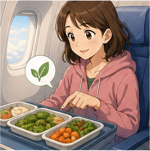

**Ví dụ:**

* **Could I book a vegetarian meal?**
  — Tôi có thể đặt một suất ăn chay không?

* **I'd like a vegetarian meal for the flight.**
  — Tôi muốn một suất ăn chay trên chuyến bay.

---

## 4.12. **discount** /ˈdɪs.kaʊnt/

**Nghĩa:** giảm giá


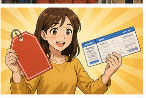
**Ví dụ:**

* **Are there any discount tickets?**
  — Có vé giảm giá nào không?

* **Do students get a discount?**
  — Sinh viên có được giảm giá không?

---

## 4.13. **reconfirm** /ˌriː.kənˈfɜːm/

**Nghĩa:** xác nhận lại

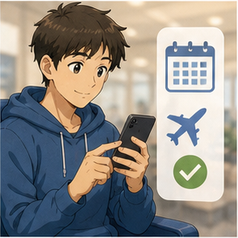

**Ví dụ:**

* **I'd like to reconfirm my flight.**
  — Tôi muốn xác nhận lại chuyến bay.

* **Could you reconfirm my booking?**
  — Bạn có thể xác nhận lại việc đặt chỗ của tôi không?

---

## 4.14. **pick up** /pɪk ʌp/

**Nghĩa:** đến lấy, nhận


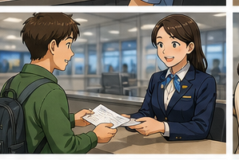
**Ví dụ:**

* **I'll pick up my ticket at the airport.**
  — Tôi sẽ lấy vé tại sân bay.

* **Where can I pick up my ticket?**
  — Tôi có thể lấy vé ở đâu?

---

## 4.15. **fare** /feər/

**Nghĩa:** giá vé

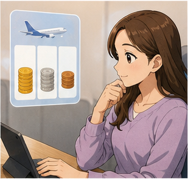

**Ví dụ:**

* **What's the fare to London?**
  — Giá vé đến London là bao nhiêu?

* **The fare includes one checked bag.**
  — Giá vé bao gồm một kiện hành lý ký gửi.

> Không nhầm:
>
> **fare** = giá vé
> **fair** = công bằng / hội chợ

---

## 4.16. **pay** /peɪ/

**Nghĩa:** thanh toán


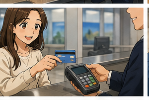
**Ví dụ:**

* **How would you like to pay?**
  — Bạn muốn thanh toán bằng cách nào?

* **Can I pay in cash?**
  — Tôi có thể thanh toán bằng tiền mặt không?

---

## 4.17. **cash** /kæʃ/

**Nghĩa:** tiền mặt


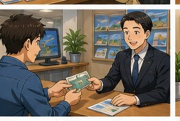
**Ví dụ:**

* **I'll pay in cash.**
  — Tôi sẽ thanh toán bằng tiền mặt.

* **Do you accept cash?**
  — Bạn có nhận tiền mặt không?

---

## 4.18. **check** /tʃek/

**Nghĩa trong bài:** séc thanh toán


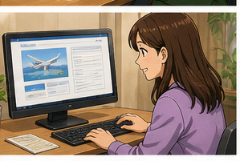
**Ví dụ:**

* **Will you pay by check or in cash?**
  — Bạn sẽ thanh toán bằng séc hay tiền mặt?

> Anh-Anh thường viết:
>
> **cheque**
>
> Anh-Mỹ:
>
> **check**

---

## 4.19. **flight** /flaɪt/

**Nghĩa:** chuyến bay


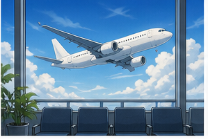
**Ví dụ:**

* **What time is your flight?**
  — Chuyến bay của bạn lúc mấy giờ?

* **Is there a flight tomorrow morning?**
  — Có chuyến bay nào vào sáng mai không?

---

## 4.20. **departure time** /dɪˈpɑː.tʃər taɪm/

**Nghĩa:** giờ khởi hành

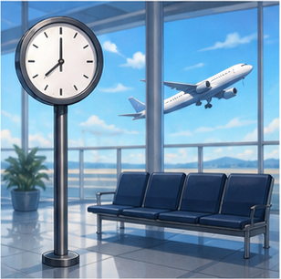

**Ví dụ:**

* **What's the departure time?**
  — Giờ khởi hành là mấy giờ?

* **The departure time is 7:30 a.m.**
  — Giờ khởi hành là 7 giờ 30 sáng.

---

## 4.21. **flight number** /flaɪt ˌnʌm.bər/

**Nghĩa:** số hiệu chuyến bay


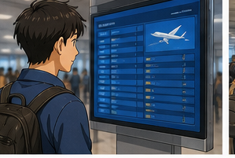
**Ví dụ:**

* **What's your flight number?**
  — Số hiệu chuyến bay của bạn là gì?

* **My flight number is VN215.**
  — Số hiệu chuyến bay của tôi là VN215.

---

## 4.22. **stopover** /ˈstɒpˌəʊ.vər/

**Nghĩa:** điểm dừng trung gian

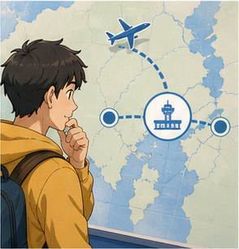

**Ví dụ:**

* **Does this flight make any stopovers?**
  — Chuyến bay này có dừng ở đâu giữa đường không?

* **There's one stopover in Singapore.**
  — Có một điểm dừng ở Singapore.

---

## 4.23. **economy class** /ɪˈkɒn.ə.mi klɑːs/

**Nghĩa:** hạng phổ thông

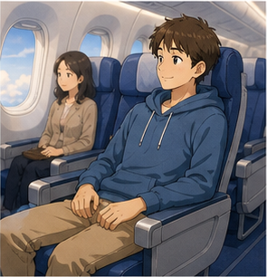

**Ví dụ:**

* **I'd like a ticket for economy class.**
  — Tôi muốn một vé hạng phổ thông.

* **Economy class is cheaper.**
  — Hạng phổ thông rẻ hơn.

---

## 4.24. **first class** /ˌfɜːst ˈklɑːs/

**Nghĩa:** hạng nhất


**Ví dụ:**

* **I'd like to travel first class.**
  — Tôi muốn đi hạng nhất.

* **First class is usually booked up.**
  — Hạng nhất thường hết chỗ.

---

## 4.25. **booked up** /ˌbʊkt ˈʌp/

**Nghĩa:** kín chỗ, hết chỗ


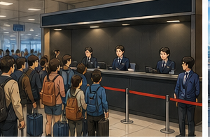
**Ví dụ:**

* **The flight is fully booked.**
  — Chuyến bay đã hết chỗ.

* **First class is booked up.**
  — Hạng nhất đã kín chỗ.

---

# 5. Bảng tổng hợp từ vựng

| Từ / cụm từ         | IPA                    | Nghĩa tiếng Việt   | Ví dụ ngắn               |
| ------------------- | ---------------------- | ------------------ | ------------------------ |
| **travel agency**   | /ˈtræv.əl ˌeɪ.dʒən.si/ | đại lý du lịch     | call a travel agency     |
| **reserve**         | /rɪˈzɜːv/              | đặt trước          | reserve a seat           |
| **book**            | /bʊk/                  | đặt vé             | book a flight            |
| **return ticket**   | —                      | vé khứ hồi         | a return ticket          |
| **single ticket**   | —                      | vé một chiều       | a single ticket          |
| **airline**         | /ˈeə.laɪn/             | hãng hàng không    | choose an airline        |
| **prefer**          | /prɪˈfɜːr/             | thích hơn          | I prefer this flight.    |
| **service**         | /ˈsɜː.vɪs/             | dịch vụ            | good service             |
| **check in**        | /ˌtʃek ˈɪn/            | làm thủ tục        | check in online          |
| **in advance**      | —                      | từ trước           | book in advance          |
| **vegetarian meal** | —                      | suất ăn chay       | book a vegetarian meal   |
| **discount**        | /ˈdɪs.kaʊnt/           | giảm giá           | student discount         |
| **reconfirm**       | /ˌriː.kənˈfɜːm/        | xác nhận lại       | reconfirm a flight       |
| **pick up**         | /pɪk ʌp/               | đến lấy            | pick up a ticket         |
| **fare**            | /feər/                 | giá vé             | air fare                 |
| **pay**             | /peɪ/                  | thanh toán         | pay by card              |
| **cash**            | /kæʃ/                  | tiền mặt           | pay in cash              |
| **flight**          | /flaɪt/                | chuyến bay         | book a flight            |
| **departure time**  | —                      | giờ khởi hành      | check departure time     |
| **flight number**   | —                      | số hiệu chuyến bay | flight number VN215      |
| **stopover**        | /ˈstɒpˌəʊ.vər/         | điểm dừng          | one stopover             |
| **economy class**   | —                      | hạng phổ thông     | economy-class ticket     |
| **first class**     | —                      | hạng nhất          | fly first class          |
| **booked up**       | —                      | hết chỗ            | The flight is booked up. |

---

# 6. Mẫu câu giao tiếp — Useful Structures

## 6.1. Nói rằng bạn muốn đặt vé


### **I'd like to book a ticket to + destination.**

* **I'd like to book a ticket to New York.**
* **I'd like to book a ticket to London.**
* **I'd like to book a ticket to Hanoi.**

### Cấu trúc

`I'd like to + V`

Đây là cách nói lịch sự và tự nhiên khi yêu cầu dịch vụ.

---

## 6.2. Đặt vé cho một ngày cụ thể

### **I'd like to book a ticket for + time/date.**

* **I'd like to book a ticket for tomorrow.**
* **I'd like to book a flight for next Friday.**
* **I'd like to travel next Thursday.**

---

## 6.3. Chọn vé một chiều hoặc khứ hồi

### **I'd like a return ticket, please.**

— Tôi muốn vé khứ hồi.

### **I'd like a single ticket, please.**

— Tôi muốn vé một chiều.

Cách nói Anh-Mỹ:

* **a round-trip ticket**
* **a one-way ticket**

---

## 6.4. Chọn hạng ghế

### **I'd like a ticket for economy class.**

— Tôi muốn vé hạng phổ thông.

Cách nói tự nhiên khác:

* **I'd like to fly economy.**
* **I'd like an economy-class ticket.**
* **I'd like to travel first class.**

---

## 6.5. Hỏi về chuyến bay có sẵn

### **Do you have any flights to + destination?**

* **Do you have any flights to New York tomorrow?**
* **Do you have any flights to London on Friday?**

Cách khác:

### **Are there any flights to London on Friday?**

---

## 6.6. Hỏi chuyến bay tiếp theo

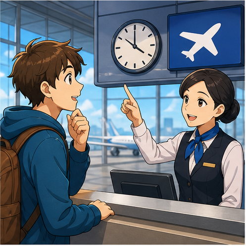

### **How about the next flight?**

— Chuyến bay tiếp theo thì sao?

Cách khác:

* **When is the next flight?**
* **Is there a later flight?**
* **Is there an earlier flight?**

---

## 6.7. Hỏi giờ khởi hành

### **What's the departure time?**

— Giờ khởi hành là mấy giờ?

Cách tự nhiên khác:

* **What time does the flight leave?**
* **What time is the flight?**
* **When does the flight depart?**

---

## 6.8. Hỏi về điểm dừng

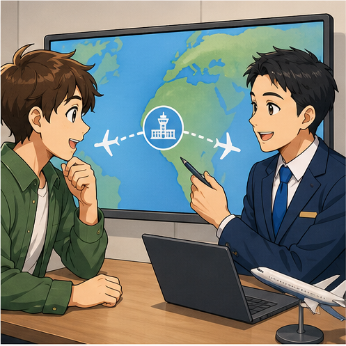

### **Does this flight make any stopovers?**

— Chuyến bay này có điểm dừng trung gian không?

Cách tự nhiên khác:

* **Is this a direct flight?**
* **Does the flight have any stops?**

Nếu bay thẳng:

**It's a direct flight.**

---

## 6.9. Hỏi hãng hàng không

### **Which airline do you want to take?**

— Bạn muốn đi hãng hàng không nào?

Cách khác:

### **Which airline do you prefer?**

Ví dụ:

**I prefer Vietnam Airlines.**

---

## 6.10. Nói về lựa chọn

### **I would prefer + noun.**

* **I would prefer Vietnam Airlines.**
* **I would prefer a morning flight.**
* **I would prefer economy class.**

Cách ngắn hơn:

**I prefer Vietnam Airlines.**

---

## 6.11. Yêu cầu suất ăn đặc biệt

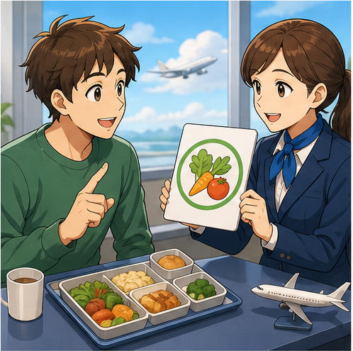

### **Could I book a vegetarian meal for the flight?**

— Tôi có thể đặt suất ăn chay cho chuyến bay không?

Cách khác:

* **Could I request a vegetarian meal?**
* **Do you have vegetarian meals?**
* **I'd like a vegetarian meal, please.**

---

## 6.12. Hỏi về giảm giá

### **Are there any special discount tickets?**

— Có vé giảm giá đặc biệt nào không?

Cách tự nhiên hơn:

* **Are there any discounted fares available?**
* **Do you have any special fares?**
* **Is there a student discount?**

---

## 6.13. Đặt trước

### **Can I book a return ticket in advance?**

— Tôi có thể đặt vé khứ hồi trước không?

### Cấu trúc

`book + something + in advance`

Ví dụ:

* **You should book your flight in advance.**
* **I booked the ticket two weeks in advance.**

---

## 6.14. Xác nhận lại chuyến bay

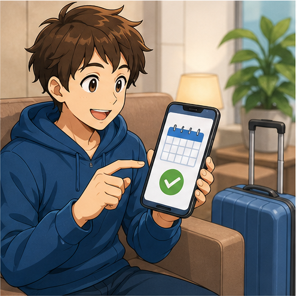

### **I'd like to reconfirm my flight.**

— Tôi muốn xác nhận lại chuyến bay.

Ví dụ:

**I'd like to reconfirm my flight at 5:00 p.m. tonight.**

Khi giao tiếp hiện đại, cũng rất thường dùng:

* **I'd like to confirm my booking.**
* **I'd like to check my reservation.**

---

## 6.15. Hỏi tên và số hiệu chuyến bay

### **What's your name and flight number?**

— Tên và số hiệu chuyến bay của bạn là gì?

Trả lời:

**My name is Hugo, and my flight number is VN215.**

---

## 6.16. Hỏi phương thức thanh toán

### **How would you like to pay?**

— Bạn muốn thanh toán bằng cách nào?

Có thể trả lời:

* **I'll pay in cash.**
* **I'll pay by card.**
* **Can I pay by credit card?**

Trong bài:

**Will you pay by check or in cash?**

---

## 6.17. Nói nơi lấy vé

### **I'll pick up my ticket at the airport.**

— Tôi sẽ lấy vé tại sân bay.

Cách hỏi:

**Where can I pick up my ticket?**

---

## 6.18. Hỏi giá vé

### **How much is the fare?**

— Giá vé bao nhiêu?

Cách tự nhiên khác:

* **How much is the ticket?**
* **What's the fare to New York?**
* **How much does the flight cost?**

---

## 6.19. Nói chuyến bay đã hết chỗ

### **The flight is booked up.**

— Chuyến bay đã hết chỗ.

Cách rất phổ biến:

### **The flight is fully booked.**

Ví dụ:

**First class is fully booked.**

---

## 6.20. Nhờ nhân viên kiểm tra

### **Could you check, please?**

— Bạn có thể kiểm tra giúp tôi không?

Nhân viên thường nói:

### **Let me check.**

— Để tôi kiểm tra.

Hoặc:

**Just a moment, please.**

---

# 7. Các bước đặt vé máy bay

| Bước               | Tiếng Anh                | Ví dụ                           |
| ------------------ | ------------------------ | ------------------------------- |
| Chọn điểm đến      | **choose a destination** | I'd like to go to London.       |
| Chọn ngày          | **choose a travel date** | I'm leaving next Friday.        |
| Chọn loại vé       | **single / return**      | A return ticket, please.        |
| Chọn chuyến        | **choose a flight**      | How about the next flight?      |
| Chọn hãng          | **choose an airline**    | I prefer Vietnam Airlines.      |
| Chọn hạng          | **choose a class**       | Economy class, please.          |
| Kiểm tra giờ       | **check departure time** | What time does it leave?        |
| Kiểm tra điểm dừng | **check stopovers**      | Is it a direct flight?          |
| Chọn suất ăn       | **request a meal**       | A vegetarian meal, please.      |
| Kiểm tra giá       | **check the fare**       | How much is the fare?           |
| Thanh toán         | **make payment**         | I'll pay by card.               |
| Xác nhận           | **confirm the booking**  | I'd like to confirm my booking. |

### Sơ đồ

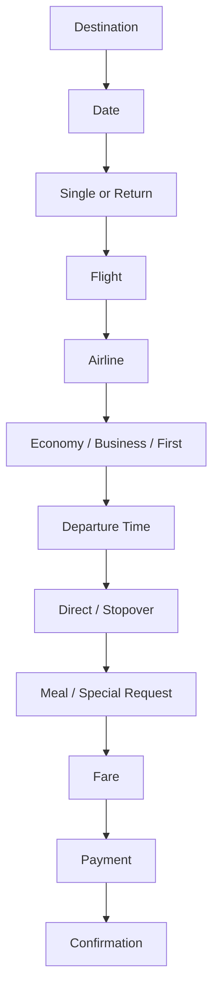

---

# 8. Phân biệt **single**, **return**, **one-way** và **round-trip**

## **single ticket**

= vé một chiều.

**I'd like a single ticket to London.**

Phổ biến trong Anh-Anh.

---

## **one-way ticket**

= vé một chiều.

**I'd like a one-way ticket to London.**

Rất phổ biến trong Anh-Mỹ.

---

## **return ticket**

= vé đi và về.

**I'd like a return ticket to New York.**

Phổ biến trong Anh-Anh.

---

## **round-trip ticket**

= vé khứ hồi.

**I'd like a round-trip ticket to New York.**

Phổ biến trong Anh-Mỹ.

### Bảng so sánh

| Anh-Anh           | Anh-Mỹ                | Nghĩa        |
| ----------------- | --------------------- | ------------ |
| **single ticket** | **one-way ticket**    | vé một chiều |
| **return ticket** | **round-trip ticket** | vé khứ hồi   |

---

# 9. Phát âm trọng tâm

## 9.1. **airline**

**airline**

/ˈeə.laɪn/

Trọng âm:

**AIR**-line

---

## 9.2. **reserve**

**reserve**

/rɪˈzɜːv/

Trọng âm:

re-**SERVE**

---

## 9.3. **return**

**return**

/rɪˈtɜːn/

Trọng âm:

re-**TURN**

---

## 9.4. **prefer**

**prefer**

/prɪˈfɜːr/

Trọng âm:

pre-**FER**

---

## 9.5. **vegetarian**

**vegetarian**

/ˌvedʒ.ɪˈteə.ri.ən/

Trọng âm chính:

ve-ge-**TAR**-i-an

---

## 9.6. **discount**

Danh từ:

**discount**

/ˈdɪs.kaʊnt/

Trọng âm:

**DIS**-count

---

## 9.7. **reconfirm**

**reconfirm**

/ˌriː.kənˈfɜːm/

Trọng âm chính:

re-con-**FIRM**

---

## 9.8. **departure**

**departure**

/dɪˈpɑː.tʃər/

Trọng âm:

de-**PAR**-ture

---

## 9.9. **stopover**

**stopover**

/ˈstɒpˌəʊ.vər/

Trọng âm:

**STOP**-over

---

## 9.10. Nối âm trong hội thoại

### **I'd like to book a ticket.**

Luyện:

`I'd-like-to-book-a-ticket.`

### **Which airline do you prefer?**

Luyện:

`Which-airline-do-you-prefer?`

### **Does this flight make any stopovers?**

Luyện theo cụm:

`Does-this-flight / make-any-stopovers?`

### **I'd like to reconfirm my flight.**

Luyện:

`I'd-like-to-reconfirm-my-flight.`

---

# 10. Hội thoại thực tế — Real-Life Conversation

## Hội thoại chính — Đặt vé khứ hồi

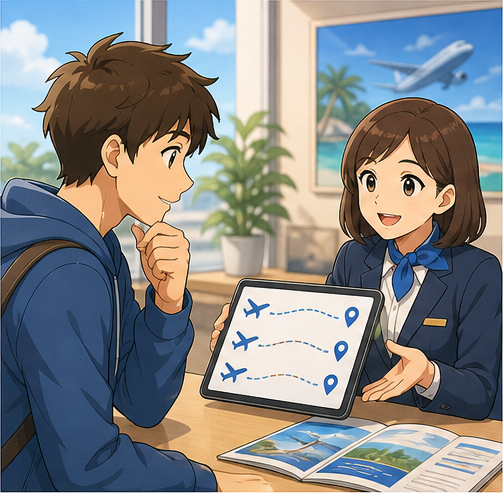

**Agent:** Hello. AIC Travel Agency. How may I help you?

**Hugo:** Hello. I'd like to book two return tickets to New York, please.

**Agent:** Certainly. When would you like to travel?

**Hugo:** Next Thursday.

**Agent:** We have flights with Vietnam Airlines and another international airline. Which one do you prefer?

**Hugo:** I'd prefer Vietnam Airlines.

**Agent:** All right. Let me check. May I have your name, please?

**Hugo:** Sure. My name is Hugo, and the second passenger is Hua.

**Agent:** Thank you. Would you like economy class?

**Hugo:** Yes, please. Also, could I request two vegetarian meals for the flight?

**Agent:** Of course.

**Hugo:** Great. What's the departure time?

**Agent:** The flight leaves at 9:30 a.m.

**Hugo:** That works for me.

### Nội dung giao tiếp

```text
Chào hỏi
   ↓
Nói nhu cầu đặt vé
   ↓
Cho biết điểm đến
   ↓
Chọn ngày
   ↓
Chọn hãng bay
   ↓
Cung cấp tên
   ↓
Chọn hạng ghế
   ↓
Yêu cầu dịch vụ
   ↓
Kiểm tra giờ bay
   ↓
Xác nhận
```

---

## Hội thoại 2 — Vé một chiều đến London

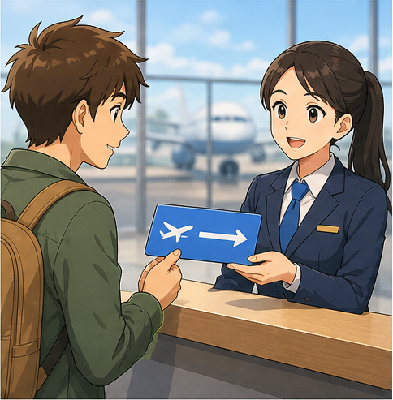

**Agent:** Where would you like to go?

**Mai:** I'm going to London.

**Agent:** When are you leaving?

**Mai:** I'd like to leave on Friday.

**Agent:** Would you like a return ticket?

**Mai:** No, thank you. I'd like a single ticket.

**Agent:** Economy class?

**Mai:** Actually, I'd like to travel first class.

**Agent:** Let me check. I'm sorry, first class is fully booked.

**Mai:** What about business class?

**Agent:** Yes, we still have seats available.

**Mai:** That sounds good.

---

## Hội thoại 3 — Hỏi chuyến bay tiếp theo

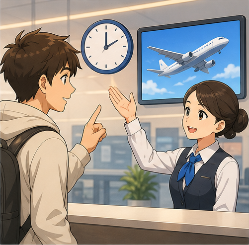

**Passenger:** Do you have any flights to Singapore this afternoon?

**Agent:** Yes. There's one at 2:20 p.m. and another at 5:40 p.m.

**Passenger:** How about the 2:20 flight?

**Agent:** It has one stopover.

**Passenger:** Does the later flight have any stopovers?

**Agent:** No. The 5:40 flight is direct.

**Passenger:** I'll take the direct flight.

**Agent:** Certainly. Economy class?

**Passenger:** Yes, please.

**Agent:** Let me check availability.

---

## Hội thoại 4 — Hỏi giảm giá và thanh toán

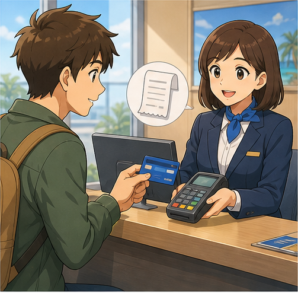

**Passenger:** How much is the return fare?

**Agent:** It's $420.

**Passenger:** Are there any special discount fares?

**Agent:** We currently have a promotional fare for $380.

**Passenger:** Great. I'd like that one.

**Agent:** Certainly. How would you like to pay?

**Passenger:** Can I pay by card?

**Agent:** Yes, of course.

**Passenger:** Great. Thank you.

**Agent:** You're welcome.

---

## Hội thoại 5 — Xác nhận lại chuyến bay

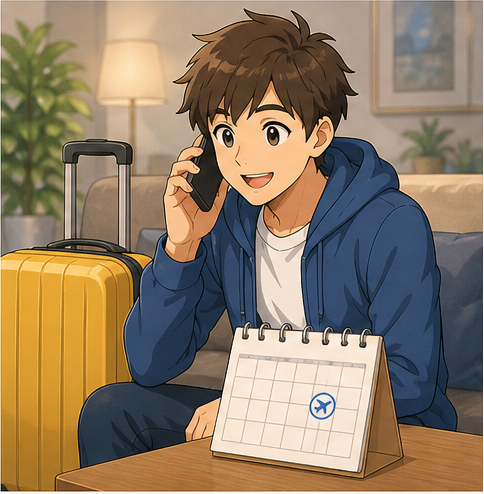

**Agent:** Good afternoon. How may I help you?

**Passenger:** I'd like to reconfirm my flight for tonight.

**Agent:** Certainly. What's your name and flight number?

**Passenger:** My name is Alex Nguyen. The flight number is VN215.

**Agent:** Just a moment, please.

**Passenger:** Sure.

**Agent:** Your flight is confirmed. Departure is at 5:00 p.m.

**Passenger:** Great. What time should I check in?

**Agent:** Please arrive at least two hours before departure.

**Passenger:** Thank you very much.

---

# 11. Natural Expressions — Cách nói tự nhiên

| Cụm từ                                 | Nghĩa                                  | Khi dùng       |
| -------------------------------------- | -------------------------------------- | -------------- |
| **I'd like to book a flight.**         | Tôi muốn đặt chuyến bay.               | Mở đầu đặt vé  |
| **I'd like a return ticket.**          | Tôi muốn vé khứ hồi.                   | Chọn loại vé   |
| **A one-way ticket, please.**          | Cho tôi vé một chiều.                  | Chọn loại vé   |
| **When is the next flight?**           | Chuyến tiếp theo lúc nào?              | Hỏi lịch       |
| **What time does it leave?**           | Nó khởi hành lúc mấy giờ?              | Hỏi giờ        |
| **Is it a direct flight?**             | Đây có phải chuyến bay thẳng không?    | Hỏi hành trình |
| **Does it have any stopovers?**        | Có điểm dừng nào không?                | Hỏi hành trình |
| **Which airline do you prefer?**       | Bạn thích hãng nào?                    | Chọn hãng      |
| **I prefer Vietnam Airlines.**         | Tôi thích Vietnam Airlines hơn.        | Trả lời        |
| **Economy class, please.**             | Hạng phổ thông.                        | Chọn hạng      |
| **I'd like to fly first class.**       | Tôi muốn bay hạng nhất.                | Chọn hạng      |
| **Let me check.**                      | Để tôi kiểm tra.                       | Nhân viên      |
| **Just a moment, please.**             | Xin chờ một chút.                      | Nhân viên      |
| **Could I request a vegetarian meal?** | Tôi có thể yêu cầu suất ăn chay không? | Dịch vụ        |
| **Are there any discounted fares?**    | Có giá vé giảm nào không?              | Hỏi giá        |
| **How much is the fare?**              | Giá vé bao nhiêu?                      | Hỏi giá        |
| **How would you like to pay?**         | Bạn muốn thanh toán thế nào?           | Thanh toán     |
| **I'll pay by card.**                  | Tôi sẽ trả bằng thẻ.                   | Thanh toán     |
| **I'll pay in cash.**                  | Tôi sẽ trả tiền mặt.                   | Thanh toán     |
| **I'd like to confirm my booking.**    | Tôi muốn xác nhận đặt chỗ.             | Xác nhận       |
| **What's your flight number?**         | Số hiệu chuyến bay là gì?              | Xác nhận       |
| **I'll pick it up at the airport.**    | Tôi sẽ lấy nó tại sân bay.             | Nhận vé        |
| **That works for me.**                 | Lịch đó phù hợp với tôi.               | Đồng ý         |
| **That sounds good.**                  | Nghe ổn đấy.                           | Đồng ý         |
| **Is there an earlier flight?**        | Có chuyến sớm hơn không?               | Đổi lịch       |
| **Is there a later flight?**           | Có chuyến muộn hơn không?              | Đổi lịch       |
| **The flight is fully booked.**        | Chuyến bay hết chỗ.                    | Không còn vé   |

---

# 12. Lỗi thường gặp — Common Mistakes

## Lỗi 1: Dùng **fair** thay vì **fare**

❌ **What's the fair?**

✅ **What's the fare?**

**fare** = giá vé.

**fair** = công bằng / hội chợ.

---

## Lỗi 2: Nói **book ticket** thiếu mạo từ

❌ **I want to book ticket.**

✅ **I want to book a ticket.**

Tự nhiên và lịch sự hơn:

✅ **I'd like to book a ticket.**

---

## Lỗi 3: Nói **I want...** trong tình huống dịch vụ

Không sai ngữ pháp:

**I want a ticket.**

Nhưng lịch sự hơn:

✅ **I'd like a ticket, please.**

✅ **I'd like to book a flight.**

---

## Lỗi 4: Nhầm **single ticket** với **one ticket**

**single ticket** không có nghĩa là “một chiếc vé”.

Trong ngữ cảnh du lịch:

**single ticket** = vé một chiều.

Nếu muốn nói hai vé một chiều:

**Two single tickets, please.**

---

## Lỗi 5: Nhầm **return ticket**

**return ticket** không chỉ là “vé quay về”.

Nó thường bao gồm:

```text
Chuyến đi
   +
Chuyến về
   =
Return ticket
```

Anh-Mỹ thường gọi:

**round-trip ticket**

---

## Lỗi 6: Nói **I prefer to Vietnam Airlines**

❌ **I prefer to Vietnam Airlines.**

✅ **I prefer Vietnam Airlines.**

Nếu so sánh:

✅ **I prefer Vietnam Airlines to Airline B.**

---

## Lỗi 7: Dùng sai sau **would like**

❌ **I'd like book a flight.**

✅ **I'd like to book a flight.**

### Cấu trúc

`would like to + V`

---

## Lỗi 8: Nói **flight time** khi muốn hỏi giờ khởi hành

Có thể hiểu, nhưng rõ hơn:

✅ **What's the departure time?**

Hoặc tự nhiên:

✅ **What time does the flight leave?**

---

## Lỗi 9: Nhầm **flight** và **airline**

### **flight**

= một chuyến bay cụ thể.

**My flight leaves at 8 a.m.**

### **airline**

= hãng hàng không.

**I usually fly with Vietnam Airlines.**

---

## Lỗi 10: Nhầm **direct flight** và **non-stop flight**

Ở trình độ A1–A2 có thể hiểu đơn giản:

**direct flight** = chuyến bay trực tiếp.

Tuy nhiên trong ngành hàng không:

* **non-stop flight**: không dừng giữa đường;
* **direct flight**: có thể dừng nhưng không đổi số hiệu chuyến bay.

Trong giao tiếp cơ bản, câu rõ nhất là:

✅ **Does this flight have any stops?**

---

## Lỗi 11: Nói **vegetable meal**

❌ **I'd like a vegetable meal.**

Nếu muốn nói suất ăn dành cho người ăn chay:

✅ **I'd like a vegetarian meal.**

---

## Lỗi 12: Nhầm **check** và **check in**

### **check**

= kiểm tra.

**Let me check the flight.**

### **check in**

= làm thủ tục chuyến bay.

**You need to check in before the flight.**

---

## Lỗi 13: Dùng **pay by cash**

❌ **I'll pay by cash.**

✅ **I'll pay in cash.**

Nhưng:

✅ **I'll pay by card.**

✅ **I'll pay by check.**

### Ghi nhớ

`pay in cash`

`pay by card`

---

## Lỗi 14: Nói **take my ticket**

Nếu muốn nói “đến lấy vé”:

✅ **I'll pick up my ticket at the airport.**

---

## Lỗi 15: Dùng **reconfirm** trong mọi tình huống

**reconfirm** đúng nhưng ngày nay **confirm** thường tự nhiên và phổ biến hơn:

✅ **I'd like to confirm my booking.**

✅ **I'd like to check my reservation.**

---

## Lỗi 16: Dùng câu quá dài

Thay vì:

❌ **I want to know if maybe there is another flight that goes later because this one is not very good for me.**

Hãy nói:

✅ **Is there a later flight?**

Câu ngắn giúp hội thoại rõ và tự nhiên hơn.

---

# 13. Luyện tập có hướng dẫn

## Bài 1 — Nối từ với nghĩa

1. airline
2. return ticket
3. fare
4. stopover
5. reconfirm
6. vegetarian meal

A. suất ăn chay
B. hãng hàng không
C. giá vé
D. xác nhận lại
E. vé khứ hồi
F. điểm dừng trung gian

<details>
<summary>Đáp án</summary>

1–B
2–E
3–C
4–F
5–D
6–A

</details>

---

## Bài 2 — Điền từ vào chỗ trống

Dùng:

`airline` · `fare` · `return` · `departure` · `stopover`

1. I'd like a ______ ticket to London.
2. Which ______ do you prefer?
3. What's the ______ time?
4. How much is the ______?
5. Does this flight have a ______?

<details>
<summary>Đáp án</summary>

1. return
2. airline
3. departure
4. fare
5. stopover

</details>

---

## Bài 3 — Chọn câu đúng

### 1. Bạn muốn đặt một vé.

* A. I'd like book a ticket.
* B. I'd like to book a ticket.
* C. I'd like booking a ticket.

**Đáp án:** B

---

### 2. Bạn muốn hỏi chuyến bay thẳng.

* A. Is this a direct flight?
* B. Is this direct a flight?
* C. This flight is direct?

**Đáp án:** A

---

### 3. Bạn muốn thanh toán bằng tiền mặt.

* A. I'll pay by cash.
* B. I'll pay on cash.
* C. I'll pay in cash.

**Đáp án:** C

---

### 4. Bạn muốn hỏi giá vé.

* A. What's the fare?
* B. What's the fair?
* C. How fare is it?

**Đáp án:** A

---

## Bài 4 — **single** hay **return**

1. Tôi chỉ đi London, chưa có kế hoạch quay lại.
   → A ______ ticket.

2. Tôi đi New York thứ Hai và quay lại thứ Sáu.
   → A ______ ticket.

3. Tôi muốn vé một chiều đến Bangkok.
   → A ______ ticket.

4. Tôi muốn cả chuyến đi và chuyến về.
   → A ______ ticket.

<details>
<summary>Đáp án</summary>

1. single
2. return
3. single
4. return

</details>

---

## Bài 5 — Hoàn thành hội thoại

**Agent:** Good morning. How may I help you?

**Passenger:** I'd like to ______ a ticket to Singapore.

**Agent:** Certainly. Would you like a single or ______ ticket?

**Passenger:** A return ticket, please.

**Agent:** Which ______ do you prefer?

**Passenger:** Vietnam Airlines.

**Agent:** Let me ______.

**Passenger:** Sure.

**Agent:** We have a flight at 8:30 a.m.

**Passenger:** What's the ______?

**Agent:** The return fare is $320.

<details>
<summary>Đáp án gợi ý</summary>

1. book
2. return
3. airline
4. check
5. fare

</details>

---

## Bài 6 — Chọn câu tự nhiên hơn

### 1.

A. **I want ticket London.**
B. **I'd like a ticket to London.**

**Đáp án:** B

### 2.

A. **What is departure time?**
B. **What's the departure time?**

**Đáp án:** B

### 3.

A. **Pay by cash.**
B. **I'll pay in cash.**

**Đáp án:** B

### 4.

A. **Does the flight have any stopovers?**
B. **Does flight stopping something?**

**Đáp án:** A

---

## Bài 7 — Sắp xếp hội thoại

Sắp xếp:

A. **Vietnam Airlines, please.**

B. **I'd like to book a return ticket to New York.**

C. **How may I help you?**

D. **Which airline do you prefer?**

E. **Certainly. When would you like to travel?**

F. **Next Friday.**

<details>
<summary>Đáp án</summary>

C → B → E → F → D → A

</details>

---

# 14. Speaking Challenge — Thử thách nói

## Nhiệm vụ 1 — Đọc mẫu câu

Đọc thành tiếng:

* **I'd like to book a ticket to New York.**
* **I'd like a return ticket, please.**
* **I'd like to fly economy class.**
* **Which airline do you prefer?**
* **How about the next flight?**
* **What's the departure time?**
* **Does this flight have any stopovers?**
* **Could I request a vegetarian meal?**
* **Are there any discount fares?**
* **I'd like to confirm my booking.**
* **How would you like to pay?**
* **I'll pay by card.**

Đọc mỗi câu hai lần:

* lần 1 chậm và rõ;
* lần 2 với tốc độ hội thoại tự nhiên.

---

## Nhiệm vụ 2 — Lên kế hoạch chuyến bay của bạn

Hãy tưởng tượng bạn muốn đi du lịch.

Trả lời:

1. Where would you like to go?
2. When would you like to leave?
3. When would you like to return?
4. Which airline do you prefer?
5. Would you like economy or first class?
6. Do you need a special meal?
7. Do you want a direct flight?
8. How would you like to pay?

### Ví dụ

> **I'd like to travel to Tokyo next month. I'd like a return ticket. I prefer a direct flight because it's more convenient. I'd like to fly economy class. I don't need a special meal, and I'd like to pay by card.**

---

## Nhiệm vụ 3 — Tạo 5 câu hỏi

Tạo ít nhất 5 câu hỏi mà bạn có thể hỏi nhân viên đại lý.

Ví dụ:

1. **Are there any flights on Friday?**
2. **What's the departure time?**
3. **Is it a direct flight?**
4. **How much is the fare?**
5. **Are there any discounts?**

Thử tạo thêm câu hỏi về:

* hãng hàng không;
* hành lý;
* suất ăn;
* giờ đến;
* hạng ghế.

---

## Nhiệm vụ 4 — Hội thoại 8 lượt

Tạo hội thoại có ít nhất:

* 1 câu nói về điểm đến;
* 1 ngày khởi hành;
* 1 loại vé;
* 1 hãng hàng không;
* 1 hạng ghế;
* 1 câu hỏi giờ bay;
* 1 câu hỏi về giá;
* 1 câu xác nhận.

---

## Nhiệm vụ 5 — Thay đổi thông tin cá nhân

Dùng hội thoại:

> **I'd like to book a return ticket to New York for next Friday.**

Thay đổi:

* New York → một thành phố bạn muốn đến;
* Friday → ngày bạn muốn đi;
* return → single nếu cần;
* Vietnam Airlines → hãng bạn muốn chọn;
* economy → hạng ghế bạn muốn.

---

## Nhiệm vụ 6 — Ghi âm

Ghi âm từ **45–60 giây**, sau đó kiểm tra:

* [ ] Tôi nói rõ điểm đến.
* [ ] Tôi nói được ngày khởi hành.
* [ ] Tôi phân biệt **single** và **return**.
* [ ] Tôi dùng được **I'd like to...**
* [ ] Tôi hỏi được giờ bay.
* [ ] Tôi hỏi được giá vé.
* [ ] Tôi hỏi được chuyến bay có điểm dừng không.
* [ ] Tôi nói được hãng hàng không mình thích.
* [ ] Tôi nói được hạng ghế.
* [ ] Tôi duy trì hội thoại ít nhất 45 giây.

---

# 15. Practice Mission — Nhiệm vụ thực tế

Trong hôm nay, hãy tạo một cuộc hội thoại theo công thức:

> **Destination → Date → Ticket → Flight → Airline → Class → Fare → Confirm**

Ví dụ:

> **I'd like to book a flight to London.**

> ↓

> **When would you like to travel?**

> ↓

> **Next Friday.**

> ↓

> **Would you like a single or return ticket?**

> ↓

> **A return ticket, please.**

> ↓

> **Which airline do you prefer?**

> ↓

> **Vietnam Airlines.**

> ↓

> **Economy class?**

> ↓

> **Yes, please. How much is the fare?**

> ↓

> **It's $420.**

> ↓

> **That works for me. I'd like to book it.**

Sau đó viết hoặc nói một đoạn hội thoại **8–10 lượt** cho một trong các tình huống:

* đặt vé một chiều;
* đặt vé khứ hồi;
* tìm chuyến bay ngày mai;
* hỏi chuyến bay tiếp theo;
* tìm chuyến bay thẳng;
* đổi từ economy sang first class;
* hỏi vé giảm giá;
* yêu cầu suất ăn chay;
* xác nhận lại chuyến bay;
* hỏi phương thức thanh toán;
* lấy vé tại sân bay.

---

# 16. Tự đánh giá cuối bài

Đánh dấu khi bạn có thể thực hiện mà không nhìn bài:

* [ ] Tôi hiểu **travel agency**.
* [ ] Tôi hiểu **airline**.
* [ ] Tôi có thể nói **I'd like to book a flight.**
* [ ] Tôi có thể nói điểm đến.
* [ ] Tôi phân biệt **single ticket** và **return ticket**.
* [ ] Tôi hiểu **one-way ticket**.
* [ ] Tôi hiểu **round-trip ticket**.
* [ ] Tôi có thể hỏi **Which airline do you prefer?**
* [ ] Tôi có thể nói **I prefer...**
* [ ] Tôi có thể hỏi **What's the departure time?**
* [ ] Tôi có thể hỏi về chuyến bay tiếp theo.
* [ ] Tôi có thể hỏi về **stopover**.
* [ ] Tôi có thể hỏi chuyến bay có phải chuyến thẳng không.
* [ ] Tôi hiểu **economy class**.
* [ ] Tôi hiểu **first class**.
* [ ] Tôi có thể yêu cầu **vegetarian meal**.
* [ ] Tôi có thể hỏi về **discount**.
* [ ] Tôi hiểu **fare**.
* [ ] Tôi không nhầm **fare** với **fair**.
* [ ] Tôi có thể nói **I'll pay in cash.**
* [ ] Tôi có thể nói **I'll pay by card.**
* [ ] Tôi hiểu **reconfirm**.
* [ ] Tôi có thể nói số hiệu chuyến bay.
* [ ] Tôi có thể nói **I'll pick up my ticket at the airport.**
* [ ] Tôi có thể duy trì hội thoại ít nhất 45 giây.

---

# 17. Câu hỏi mở cuối bài

**Imagine you are planning a trip abroad next month. You need a return ticket, prefer a direct flight, want an economy-class seat and need a vegetarian meal. How would you speak to a travel agent, compare the available flights, ask about the fare and finally confirm your booking?**

*Hãy tưởng tượng bạn đang lên kế hoạch đi nước ngoài vào tháng tới. Bạn cần vé khứ hồi, muốn chuyến bay thẳng, chọn hạng phổ thông và cần suất ăn chay. Bạn sẽ nói chuyện với nhân viên đại lý như thế nào để so sánh các chuyến bay, hỏi giá vé và cuối cùng xác nhận đặt chỗ?*

---

# 18. Ghi chú dành cho giảng viên

* **Module:** 03 — Travel Ready / Tiếng Anh cho những chuyến đi
* **Chủ điểm:** Booking a Plane Ticket / Lên kế hoạch và đặt vé máy bay
* **Thời lượng video:** 8–12 phút
* **Luyện nói:** 5–10 phút

### Trọng tâm từ vựng

* travel agency
* reserve
* book
* return ticket
* single ticket
* one-way ticket
* round-trip ticket
* airline
* prefer
* service
* check in
* in advance
* vegetarian meal
* discount
* reconfirm
* pick up
* fare
* pay
* cash
* flight
* flight number
* departure time
* stopover
* economy class
* first class
* booked up

### Trọng tâm cấu trúc

* **I'd like to book a ticket to ...**
* **I'd like a return ticket, please.**
* **I'd like a single ticket.**
* **I'd like to fly economy class.**
* **Can I book a ticket in advance?**
* **Do you have any flights to ...?**
* **How about the next flight?**
* **When is the next flight?**
* **What's the departure time?**
* **What time does the flight leave?**
* **Does this flight make any stopovers?**
* **Is this a direct flight?**
* **Which airline do you prefer?**
* **I prefer ...**
* **Could I request a vegetarian meal?**
* **Are there any discount fares?**
* **How much is the fare?**
* **I'd like to reconfirm my flight.**
* **What's your name and flight number?**
* **How would you like to pay?**
* **I'll pay in cash.**
* **I'll pay by card.**
* **I'll pick up my ticket at the airport.**
* **Let me check.**
* **Just a moment, please.**
* **That works for me.**
* **The flight is fully booked.**

### Trọng tâm phát âm

* **airline**
* **reserve**
* **return**
* **prefer**
* **vegetarian**
* **discount**
* **reconfirm**
* **departure**
* **stopover**
* **economy**
* **flight**

### Lưu ý ngôn ngữ

* **book a flight / book a ticket** tự nhiên hơn khi nói về việc đặt vé.

* Dùng:

  * **I'd like to book...**
  * thay vì chỉ nói:
  * **I want...**

  trong tình huống dịch vụ lịch sự.

* **single ticket** = vé một chiều trong Anh-Anh.

* **one-way ticket** = vé một chiều, phổ biến trong Anh-Mỹ.

* **return ticket** = vé khứ hồi trong Anh-Anh.

* **round-trip ticket** = vé khứ hồi trong Anh-Mỹ.

* **airline** = hãng hàng không.

* **flight** = chuyến bay cụ thể.

* **fare** = giá vé.

* Không nhầm:

  * **fare** = giá vé;
  * **fair** = công bằng / hội chợ.

* Dùng:

  * **pay in cash**
  * **pay by card**
  * **pay by check**

* **check in** = làm thủ tục chuyến bay.

* **check** = kiểm tra.

* **stopover** = điểm dừng trung gian.

* **direct flight** dùng phổ biến trong giao tiếp để hỏi chuyến bay trực tiếp.

* Khi cần hỏi rõ có dừng giữa đường hay không, dùng:

  **Does this flight have any stops?**

* **vegetarian meal** = suất ăn chay.

* **booked up / fully booked** = hết chỗ.

* **reconfirm** có trong bài và hoàn toàn đúng, nhưng trong giao tiếp hiện đại có thể ưu tiên:

  **I'd like to confirm my booking.**

* Với người học A1–A2, nên ưu tiên câu ngắn:

  * **When is the next flight?**
  * **How much is the fare?**
  * **Is it a direct flight?**
  * **Economy class, please.**
  * **That works for me.**

### Hoạt động gợi ý — Find the Best Flight

Chia lớp thành cặp.

**Người A:** khách hàng.

**Người B:** nhân viên đại lý.

Người B chuẩn bị ba chuyến bay giả định:

| Flight   |  Time | Type       | Fare |
| -------- | ----: | ---------- | ---: |
| Flight A | 08:00 | Direct     | $450 |
| Flight B | 11:30 | 1 stopover | $320 |
| Flight C | 17:45 | Direct     | $390 |

Người A phải hỏi:

> **What time does the flight leave?**

> **Is it a direct flight?**

> **Does it have any stopovers?**

> **How much is the fare?**

> **Are there any discounts?**

Sau đó chọn một chuyến:

> **I'll take Flight C.**

> **That works for me.**

---

### Role-play mẫu — Đặt vé khứ hồi

**Người A nhận:**

> Bạn muốn đi Tokyo vào thứ Sáu và quay về vào thứ Hai.

Người A phải sử dụng ít nhất:

* **I'd like to book a flight to Tokyo.**
* **I'd like a return ticket.**
* **What time does the flight leave?**
* **Is it a direct flight?**
* **How much is the fare?**

**Người B nhận:**

> Bạn là nhân viên đại lý và có hai chuyến bay.

Người B phải sử dụng ít nhất:

* **When would you like to travel?**
* **Which airline do you prefer?**
* **Let me check.**
* **We have two flights available.**
* **How would you like to pay?**

---

### Role-play mẫu — Chuyến bay hết chỗ

**Người A nhận:**

> Bạn muốn đi chuyến lúc 10:00 sáng và muốn hạng nhất.

**Người B nhận:**

> Chuyến 10:00 đã hết hạng nhất nhưng vẫn còn economy. Có một chuyến khác lúc 13:30 còn first class.

Người B phải sử dụng:

* **I'm sorry.**
* **First class is fully booked.**
* **We still have economy seats available.**
* **There is another flight at 1:30 p.m.**
* **Would you like that flight instead?**

Người A nên dùng:

* **How about the next flight?**
* **What time does it leave?**
* **I'd prefer first class.**
* **That sounds good.**
* **I'll take it.**

---

### Role-play mẫu — Suất ăn và dịch vụ đặc biệt

**Người A nhận:**

> Bạn đã chọn chuyến bay nhưng cần suất ăn chay.

Người A phải sử dụng:

* **Could I request a vegetarian meal?**
* **Is the meal included?**
* **Do I need to book it in advance?**

Người B phải sử dụng:

* **Yes, of course.**
* **I'll add that to your booking.**
* **There is no extra charge.**
* **Your vegetarian meal is confirmed.**

---

### Role-play mẫu — Xác nhận chuyến bay

**Người A nhận:**

> Bạn đã đặt vé và muốn xác nhận chuyến bay tối nay.

Người A phải sử dụng:

* **I'd like to confirm my booking.**
* **My name is ...**
* **My flight number is ...**
* **What's the departure time?**
* **What time should I check in?**

Người B phải sử dụng:

* **May I have your name and flight number?**
* **Just a moment, please.**
* **Your flight is confirmed.**
* **The departure time is ...**
* **Please arrive two hours before departure.**

Kết thúc bằng:

> **Great. Thank you for your help.**

> **You're welcome. Have a pleasant flight.**
