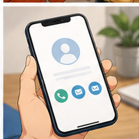
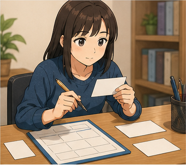
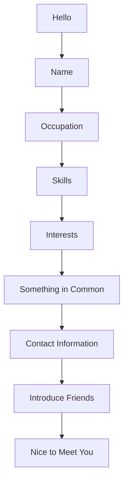

# LESSON 18 — LÀM QUEN VÀ GIỚI THIỆU BẢN THÂN

> **Module 04 — Around Town / Giao tiếp trong thành phố**
> **Chủ đề:** Introduction — Làm quen, giới thiệu bản thân và giới thiệu người khác
> **Trình độ gợi ý:** A1–A2
> **Thời lượng:** 8–12 phút học bài + 5–10 phút luyện nói

---

## 1. Tình huống thực tế

Khi gặp một người mới ở trường học, nơi làm việc, một sự kiện hoặc trong một nhóm bạn, bạn thường cần:

* chào hỏi;
* nói tên của mình;
* hỏi tên người đối diện;
* hỏi cách đánh vần tên hoặc họ;
* nói nghề nghiệp;
* nói một vài thông tin cơ bản;
* nói sở thích hoặc khả năng;
* giới thiệu một người với người khác;
* miêu tả tính cách của bạn bè;
* hỏi hoặc nhắc lại số điện thoại;
* thể hiện sự vui mừng khi được làm quen.

Bạn cần biết cách nói những câu như:

* **Allow me to introduce myself.**
* **My name is Alex.**
* **I'm a director.**
* **May I have your name, please?**
* **How do you spell your last name?**
* **I'd like you to meet my friend.**
* **May I introduce Ling to you?**
* **I don't think you've met.**
* **It's my pleasure.**
* **I'm glad to meet you.**
* **He's very friendly and humorous.**
* **I'm interested in music.**
* **I'm good at maths.**
* **I can't remember your telephone number.**


---

## 2. Mục tiêu bài học

Sau bài học, người học có thể:

1. Giới thiệu tên của mình.
2. Hỏi tên người khác một cách lịch sự.
3. Hỏi cách đánh vần họ hoặc tên.
4. Nói nghề nghiệp của mình.
5. Nói về khả năng bằng **good at**.
6. Nói về sở thích bằng **interested in**.
7. Sử dụng **Me too** để thể hiện sự giống nhau.
8. Sử dụng **the same** để nói hai thông tin giống nhau.
9. Miêu tả tính cách bằng **friendly** và **humorous**.
10. Hỏi hoặc nhắc lại số điện thoại.
11. Giới thiệu một người với người khác.
12. Sử dụng **I'd like you to meet ...**
13. Sử dụng **May I introduce ... to you?**
14. Sử dụng **I don't think you've met.**
15. Phản hồi tự nhiên khi được giới thiệu.
16. Sử dụng **It's my pleasure.**
17. Sử dụng **I'm glad to meet you.**
18. Duy trì hội thoại làm quen ít nhất 6–8 lượt.
19. Giới thiệu một người bạn hoặc đồng nghiệp.
20. Tự tạo đoạn giới thiệu bản thân dựa trên thông tin cá nhân.

---

## 3. Sơ đồ giao tiếp

```mermaid
flowchart LR
    A[Gặp người mới] --> B[Chào hỏi]
    B --> C[Giới thiệu bản thân]
    C --> D[Hỏi tên]
    D --> E[Trao đổi nghề nghiệp]
    E --> F[Nói sở thích / khả năng]
    F --> G[Trao đổi thông tin liên hệ]
    G --> H[Giới thiệu người khác]
    H --> I[Phản hồi lịch sự]
    I --> J[Tiếp tục hội thoại]
```



### Mẫu đơn giản

`Hi. My name is Alex.`

→ `Hi, Alex. I'm Mai.`

→ `Nice to meet you.`

→ `Nice to meet you, too.`

→ `What do you do?`

→ `I'm a manager.`

→ `Really? I'm a manager, too.`

→ `That's interesting.`

---

# 4. Từ vựng trọng tâm — Core Vocabulary

## 4.1. **introduce** /ˌɪn.trəˈdjuːs/

**Nghĩa:** giới thiệu


**Ví dụ:**

* **Let me introduce myself.**
  — Để tôi tự giới thiệu.

* **May I introduce my friend to you?**
  — Tôi có thể giới thiệu bạn tôi với bạn không?

### Cấu trúc

`introduce + someone`

`introduce + someone + to + someone`

**I introduced Mai to my colleagues.**

---

## 4.2. **myself** /maɪˈself/

**Nghĩa:** bản thân tôi, chính tôi


Trong bài:

**Allow me to introduce myself.**

— Cho phép tôi tự giới thiệu.

Không nói:

❌ **introduce me** khi muốn nói "tự giới thiệu".

Nên dùng:

✅ **introduce myself**

---

## 4.3. **yourself** /jɔːˈself/

**Nghĩa:** bản thân bạn


**Ví dụ:**

* **Please introduce yourself.**
  — Hãy giới thiệu bản thân.

* **Can you tell me something about yourself?**
  — Bạn có thể kể cho tôi một chút về bản thân không?

---

## 4.4. **manager** /ˈmæn.ɪ.dʒər/

**Nghĩa:** quản lý


**Ví dụ:**

* **I'm a manager.**
  — Tôi là quản lý.

* **She's the sales manager.**
  — Cô ấy là quản lý bán hàng.

---

## 4.5. **director** /dəˈrek.tər/

**Nghĩa:** giám đốc


**Ví dụ:**

* **I'm a director.**
  — Tôi là giám đốc.

* **He's the company director.**
  — Anh ấy là giám đốc công ty.

---

## 4.6. **pleasure** /ˈpleʒ.ər/

**Nghĩa:** niềm vui, sự hân hạnh


**Ví dụ:**

* **It's my pleasure.**
  — Đó là niềm vui của tôi / Tôi rất hân hạnh.

* **It's a pleasure to meet you.**
  — Rất hân hạnh được gặp bạn.

---

## 4.7. **friendly** /ˈfrend.li/

**Nghĩa:** thân thiện


**Ví dụ:**

* **She's very friendly.**
  — Cô ấy rất thân thiện.

* **My new colleague is friendly.**
  — Đồng nghiệp mới của tôi rất thân thiện.

---

## 4.8. **humorous** /ˈhjuː.mər.əs/

**Nghĩa:** hài hước


**Ví dụ:**

* **He's very friendly and humorous.**
  — Anh ấy rất thân thiện và hài hước.

* **She's a humorous person.**
  — Cô ấy là một người hài hước.

Trong giao tiếp hằng ngày, **funny** cũng thường được dùng:

**He's really funny.**

---

## 4.9. **remember** /rɪˈmem.bər/

**Nghĩa:** nhớ


**Ví dụ:**

* **I remember your name.**
  — Tôi nhớ tên bạn.

* **I can't remember your telephone number.**
  — Tôi không thể nhớ số điện thoại của bạn.

---

## 4.10. **telephone number** /ˈtel.ɪ.fəʊn ˌnʌm.bər/

**Nghĩa:** số điện thoại



Cách nói hiện đại phổ biến hơn:

**phone number**

**Ví dụ:**

* **What's your phone number?**
  — Số điện thoại của bạn là gì?

* **I can't remember your telephone number.**
  — Tôi không nhớ số điện thoại của bạn.

---

## 4.11. **last name** /ˈlɑːst neɪm/

**Nghĩa:** họ



**Ví dụ:**

* **What's your last name?**
  — Họ của bạn là gì?

* **How do you spell your last name?**
  — Bạn đánh vần họ của mình như thế nào?

### Ghi nhớ

**first name** = tên

**last name** = họ

Trong một số biểu mẫu:

**surname** = họ

---

## 4.12. **good at**

**Nghĩa:** giỏi về, làm tốt việc gì


**Ví dụ:**

* **I'm good at maths.**
  — Tôi giỏi toán.

* **She's good at English.**
  — Cô ấy giỏi tiếng Anh.

### Cấu trúc

`be good at + noun`

**I'm good at maths.**

Hoặc:

`be good at + V-ing`

**I'm good at cooking.**

---

## 4.13. **maths / math**

**Nghĩa:** môn toán


* **maths** — phổ biến trong Anh-Anh.
* **math** — phổ biến trong Anh-Mỹ.

**Ví dụ:**

**I'm good at maths.**

**I'm good at math.**

Cả hai đều đúng tùy biến thể tiếng Anh.

---

## 4.14. **interested in**

**Nghĩa:** quan tâm đến, hứng thú với


**Ví dụ:**

* **I'm interested in music.**
  — Tôi quan tâm đến âm nhạc.

* **She's interested in photography.**
  — Cô ấy thích nhiếp ảnh.

### Cấu trúc

`be interested in + noun`

`be interested in + V-ing`

Ví dụ:

**I'm interested in learning English.**

---

## 4.15. **really** /ˈrɪə.li/

**Nghĩa:** thật sự; thật à?


Trong hội thoại, **Really?** thường dùng để thể hiện sự ngạc nhiên hoặc quan tâm.

**A:** I'm a director.

**B:** Really?

— Thật à?

Ví dụ khác:

**That's really interesting.**

— Điều đó thật sự thú vị.

---

## 4.16. **Me too.**

**Nghĩa:** Tôi cũng vậy.


**A:** I'm interested in music.

**B:** Me too.

**A:** I'm good at maths.

**B:** Me too.

---

## 4.17. **the same**

**Nghĩa:** giống nhau, giống vậy


**Ví dụ:**

* **We have the same last name.**
  — Chúng tôi có cùng họ.

* **We like the same music.**
  — Chúng tôi thích cùng loại nhạc.

* **Mine is the same.**
  — Của tôi cũng giống vậy.

---

## 4.18. **meet** /miːt/

**Nghĩa:** gặp, làm quen


**Ví dụ:**

* **Nice to meet you.**
  — Rất vui được gặp bạn.

* **I'd like you to meet my friend.**
  — Tôi muốn giới thiệu bạn với bạn của tôi.

---

## 4.19. **colleague** /ˈkɒl.iːɡ/

**Nghĩa:** đồng nghiệp


Trong đoạn hội thoại của bài:

**This is my colleague, Amit.**

— Đây là đồng nghiệp của tôi, Amit.

---

## 4.20. **something** /ˈsʌm.θɪŋ/

**Nghĩa:** điều gì đó, một cái gì đó


**Ví dụ:**

* **Tell me something about yourself.**
  — Hãy kể cho tôi điều gì đó về bạn.

* **Can I ask you something?**
  — Tôi có thể hỏi bạn một điều không?

---

# 5. Bảng tổng hợp từ vựng

| Từ / cụm từ          | IPA             | Nghĩa tiếng Việt | Ví dụ ngắn                |
| -------------------- | --------------- | ---------------- | ------------------------- |
| **introduce**        | /ˌɪn.trəˈdjuːs/ | giới thiệu       | introduce myself          |
| **myself**           | /maɪˈself/      | bản thân tôi     | introduce myself          |
| **yourself**         | /jɔːˈself/      | bản thân bạn     | introduce yourself        |
| **manager**          | /ˈmæn.ɪ.dʒər/   | quản lý          | I'm a manager.            |
| **director**         | /dəˈrek.tər/    | giám đốc         | I'm a director.           |
| **pleasure**         | /ˈpleʒ.ər/      | sự hân hạnh      | It's my pleasure.         |
| **friendly**         | /ˈfrend.li/     | thân thiện       | very friendly             |
| **humorous**         | /ˈhjuː.mər.əs/  | hài hước         | friendly and humorous     |
| **remember**         | /rɪˈmem.bər/    | nhớ              | remember your name        |
| **telephone number** | —               | số điện thoại    | telephone number          |
| **phone number**     | —               | số điện thoại    | What's your phone number? |
| **last name**        | —               | họ               | spell your last name      |
| **good at**          | —               | giỏi về          | good at maths             |
| **maths / math**     | /mæθs/, /mæθ/   | môn toán         | good at maths             |
| **interested in**    | —               | hứng thú với     | interested in music       |
| **really**           | /ˈrɪə.li/       | thật sự / thật à | Really?                   |
| **Me too.**          | —               | Tôi cũng vậy.    | Me too.                   |
| **the same**         | —               | giống nhau       | the same name             |
| **meet**             | /miːt/          | gặp, làm quen    | Nice to meet you.         |
| **colleague**        | /ˈkɒl.iːɡ/      | đồng nghiệp      | my colleague              |
| **something**        | /ˈsʌm.θɪŋ/      | điều gì đó       | tell me something         |

---

# 6. Mẫu câu giao tiếp — Useful Structures

## 6.1. Tự giới thiệu

### **Allow me to introduce myself.**

— Cho phép tôi tự giới thiệu.

Đây là cách nói khá lịch sự và trang trọng.

Trong giao tiếp thông thường, có thể nói tự nhiên hơn:

* **Let me introduce myself.**
* **Hi, I'm Alex.**
* **My name is Alex.**

---

## 6.2. Giới thiệu tên

### **My name is + name.**

**My name is Hugo.**

Hoặc ngắn và tự nhiên:

### **I'm + name.**

**I'm Hugo.**

---

## 6.3. Hỏi tên lịch sự

### **May I have your name, please?**

— Tôi có thể biết tên bạn được không?


Cách thông dụng khác:

* **What's your name?**
* **Could I have your name, please?**
* **And your name is?**

---

## 6.4. Hỏi tên một người khác

### **What's your friend's name?**

— Bạn của bạn tên gì?

Ví dụ:

**What's your sister's name?**

**What's your colleague's name?**

---

## 6.5. Hỏi cách đánh vần họ

### **How do you spell your last name?**

— Bạn đánh vần họ của mình như thế nào?

Ví dụ:

**A:** How do you spell your last name?

**B:** N-G-U-Y-E-N.

Cấu trúc:

`How do you spell + word/name?`

---

## 6.6. Nói nghề nghiệp

### **I'm a + occupation.**

* **I'm a director.**
* **I'm a manager.**
* **I'm a teacher.**
* **I'm a student.**
* **I'm an engineer.**

Không quên **a/an** khi nói nghề nghiệp số ít.

---

## 6.7. Nói mình giỏi một việc

### **I'm good at + noun/V-ing.**

* **I'm good at maths.**
* **I'm good at English.**
* **I'm good at drawing.**
* **I'm good at cooking.**

---

## 6.8. Nói sở thích

### **I'm interested in + noun/V-ing.**

* **I'm interested in music.**
* **I'm interested in technology.**
* **I'm interested in learning English.**
* **I'm interested in travelling.**

---

## 6.9. Nói "Tôi cũng vậy"

### **Me too.**

**A:** I'm interested in music.

**B:** Me too.

Hoặc:

**A:** I'm good at maths.

**B:** Me too.

---

## 6.10. Miêu tả tính cách

### **He's very friendly and humorous.**

— Anh ấy rất thân thiện và hài hước.

Cấu trúc:

`Subject + be + adjective`

Ví dụ:

* **She's friendly.**
* **He's humorous.**
* **They're very friendly.**

---

## 6.11. Không nhớ thông tin

### **I can't remember + information.**

Trong bài:

**I can't remember your telephone number.**

Ví dụ khác:

* **I can't remember his name.**
* **I can't remember her last name.**
* **I can't remember your phone number.**

---

## 6.12. Giới thiệu một người

### **I'd like you to meet + person.**


Ví dụ:

**I'd like you to meet my friend, Mai.**

— Tôi muốn giới thiệu bạn với Mai, bạn của tôi.

**I'd like you to meet my colleague, Amit.**

---

## 6.13. Khi hai người chưa biết nhau

### **I don't think you've met.**

— Tôi nghĩ hai người chưa gặp nhau.

Ví dụ:

**I don't think you've met. Mai, this is Alex.**

Đây là câu rất tự nhiên khi bắt đầu giới thiệu hai người.

---

## 6.14. Giới thiệu lịch sự

### **May I introduce + person + to you?**

Trong bài:

**May I introduce Ling to you?**

— Tôi có thể giới thiệu Ling với bạn được không?

Cách khác:

**May I introduce my colleague to you?**

---

## 6.15. Giới thiệu hai người

### **This is ... and this is ...**

Ví dụ:

**This is Mai, and this is Alex.**

Hoặc:

**Mai, this is Alex. Alex, this is Mai.**

Đây là một trong những cách đơn giản và tự nhiên nhất.

---

## 6.16. Thể hiện sự vui mừng khi gặp

### **It's lovely to meet you.**

— Thật vui được gặp bạn.

### **I'm glad to meet you.**

— Tôi rất vui được gặp bạn.

### **Nice to meet you.**

— Rất vui được gặp bạn.

Phản hồi:

* **Nice to meet you, too.**
* **Glad to meet you, too.**
* **Me too.**

---

## 6.17. Nói "Tôi rất hân hạnh"

### **It's my pleasure.**

— Tôi rất hân hạnh.

Cũng có thể nói:

**The pleasure is mine.**

---

# 7. Quy trình làm quen với một người mới

| Bước              | Tiếng Anh                    | Ví dụ                     |
| ----------------- | ---------------------------- | ------------------------- |
| Chào hỏi          | **greet someone**            | Hi.                       |
| Tự giới thiệu     | **introduce yourself**       | I'm Alex.                 |
| Hỏi tên           | **ask someone's name**       | What's your name?         |
| Hỏi nghề nghiệp   | **ask about work**           | What do you do?           |
| Nói khả năng      | **talk about skills**        | I'm good at maths.        |
| Nói sở thích      | **talk about interests**     | I'm interested in music.  |
| Phản hồi          | **show interest**            | Really?                   |
| Tìm điểm chung    | **find something in common** | Me too.                   |
| Trao đổi liên hệ  | **exchange contact details** | What's your phone number? |
| Giới thiệu bạn bè | **introduce another person** | I'd like you to meet Mai. |
| Kết thúc lịch sự  | **respond politely**         | Nice to meet you.         |

### Sơ đồ



---

# 8. Phân biệt các cách giới thiệu

## **I'm Alex.**

Cách ngắn gọn và tự nhiên.

**Hi, I'm Alex.**

Thích hợp trong hầu hết tình huống đời thường.

---

## **My name is Alex.**

Rõ ràng hơn một chút.

**Hello. My name is Alex Nguyen.**

Thường phù hợp khi giới thiệu chính thức hơn.

---

## **Let me introduce myself.**

Dùng khi muốn bắt đầu một phần giới thiệu tương đối đầy đủ.

**Let me introduce myself. My name is Alex Nguyen.**

---

## **Allow me to introduce myself.**

Trang trọng hơn.

Có thể dùng trong:

* buổi họp;
* sự kiện;
* bài phát biểu;
* môi trường kinh doanh.

---

## Bảng so sánh

| Cách nói                          | Mức độ          | Tình huống          |
| --------------------------------- | --------------- | ------------------- |
| **Hi, I'm Alex.**                 | tự nhiên        | đời thường          |
| **My name is Alex.**              | trung tính      | hầu hết tình huống  |
| **Let me introduce myself.**      | lịch sự         | học tập, công việc  |
| **Allow me to introduce myself.** | khá trang trọng | sự kiện, kinh doanh |

---

# 9. Phát âm trọng tâm

## 9.1. **introduce**

**introduce**

/ˌɪn.trəˈdjuːs/

Trọng âm:

intro-**DUCE**

---

## 9.2. **manager**

**manager**

/ˈmæn.ɪ.dʒər/

Trọng âm:

**MAN**-a-ger

---

## 9.3. **director**

**director**

/dəˈrek.tər/

Trọng âm:

di-**REC**-tor

---

## 9.4. **pleasure**

**pleasure**

/ˈpleʒ.ər/

Trọng âm:

**PLEA**-sure

Chú ý âm:

`/ʒ/`

giống âm giữa trong từ **vision**.

---

## 9.5. **humorous**

**humorous**

/ˈhjuː.mər.əs/

Trọng âm:

**HU**-mor-ous

---

## 9.6. **friendly**

**friendly**

/ˈfrend.li/

Trọng âm:

**FRIEND**-ly

---

## 9.7. **remember**

**remember**

/rɪˈmem.bər/

Trọng âm:

re-**MEM**-ber

---

## 9.8. **interested**

**interested**

/ˈɪn.trəs.tɪd/

Trọng âm:

**IN**-ter-est-ed

---

## 9.9. **colleague**

**colleague**

/ˈkɒl.iːɡ/

Trọng âm:

**COL**-league

---

## 9.10. Nối âm trong hội thoại

### **Allow me to introduce myself.**

Luyện theo cụm:

`Allow-me / to-introduce-myself.`

### **May I have your name, please?**

Luyện:

`May-I-have-your-name-please?`

### **I'd like you to meet my friend.**

Luyện:

`I'd-like-you-to-meet-my-friend.`

### **I don't think you've met.**

Luyện:

`I-don't-think-you've-met.`

### **How do you spell your last name?**

Luyện:

`How-do-you-spell-your-last-name?`

---

# 10. Hội thoại thực tế — Real-Life Conversation

## Hội thoại chính — Gặp một người mới


**Alex:** Hi. Allow me to introduce myself. I'm Alex.

**Mai:** Hi, Alex. I'm Mai. Nice to meet you.

**Alex:** Nice to meet you, too. What do you do?

**Mai:** I'm a manager.

**Alex:** Really? I'm a manager, too.

**Mai:** That's interesting.

**Alex:** What are you interested in?

**Mai:** I'm interested in music and travelling.

**Alex:** Me too. I'm also interested in music.

**Mai:** Great. I think we have something in common.

### Nội dung giao tiếp

```text
Chào hỏi
   ↓
Giới thiệu tên
   ↓
Hỏi nghề nghiệp
   ↓
Phản hồi "Really?"
   ↓
Tìm điểm chung
   ↓
Nói sở thích
   ↓
"Me too"
   ↓
Tiếp tục hội thoại
```

---

## Hội thoại 2 — Hỏi tên và cách đánh vần


**A:** May I have your name, please?

**B:** Sure. My name is Nguyen Minh Anh.

**A:** How do you spell your last name?

**B:** N-G-U-Y-E-N.

**A:** Thank you.

**B:** You're welcome.

**A:** And what's your phone number?

**B:** It's 0912-345-678.

**A:** Sorry, could you say that again?

**B:** Of course.

---

## Hội thoại 3 — Giới thiệu bạn với đồng nghiệp


**Mai:** Alex, I'd like you to meet my friend, Linh.

**Alex:** Hi, Linh. Nice to meet you.

**Linh:** Nice to meet you, too.

**Mai:** Linh is very friendly and humorous.

**Alex:** Really? What do you do, Linh?

**Linh:** I'm a designer.

**Alex:** That's interesting. I'm interested in design, too.

**Linh:** Great.

---

## Hội thoại 4 — Giới thiệu hai người trong tình huống trang trọng


**A:** This is my friend Leisel. She's from South Africa. Leisel, this is my colleague, Amit.

**Leisel:** Oh, hello. It's lovely to meet you.

**Amit:** Me too.

---

**B:** Who's that?

**A:** That's Amit. Let me introduce you. Amit, this is my sister, Leisel.

**Amit:** Hi, Leisel. I'm glad to meet you.

**Leisel:** Glad to meet you, too.

---

## Hội thoại 5 — Hai người chưa từng gặp nhau


**Mai:** Alex, I don't think you've met my colleague, David.

**Alex:** No, I haven't had the pleasure.

**Mai:** David, this is Alex. Alex, this is David.

**David:** It's a pleasure to meet you.

**Alex:** Nice to meet you, too.

**Mai:** David is our new manager.

**Alex:** Really? Welcome to the team.

**David:** Thank you.

---

# 11. Natural Expressions — Cách nói tự nhiên

| Cụm từ                               | Nghĩa                             | Khi dùng          |
| ------------------------------------ | --------------------------------- | ----------------- |
| **Hi, I'm ...**                      | Xin chào, tôi là...               | Tự giới thiệu     |
| **My name is ...**                   | Tên tôi là...                     | Giới thiệu tên    |
| **Let me introduce myself.**         | Để tôi tự giới thiệu.             | Mở đầu            |
| **Allow me to introduce myself.**    | Cho phép tôi tự giới thiệu.       | Trang trọng       |
| **May I have your name, please?**    | Tôi có thể biết tên bạn không?    | Hỏi tên           |
| **What's your friend's name?**       | Bạn của bạn tên gì?               | Hỏi người khác    |
| **How do you spell your last name?** | Bạn đánh vần họ thế nào?          | Kiểm tra tên      |
| **I'm a manager.**                   | Tôi là quản lý.                   | Nghề nghiệp       |
| **I'm good at maths.**               | Tôi giỏi toán.                    | Khả năng          |
| **I'm interested in music.**         | Tôi thích/quan tâm âm nhạc.       | Sở thích          |
| **Really?**                          | Thật à?                           | Thể hiện quan tâm |
| **Me too.**                          | Tôi cũng vậy.                     | Điểm chung        |
| **We have the same ...**             | Chúng ta có cùng...               | Điểm chung        |
| **He's very friendly.**              | Anh ấy rất thân thiện.            | Miêu tả           |
| **He's very humorous.**              | Anh ấy rất hài hước.              | Miêu tả           |
| **I can't remember ...**             | Tôi không nhớ...                  | Quên thông tin    |
| **I'd like you to meet ...**         | Tôi muốn giới thiệu bạn với...    | Giới thiệu        |
| **I don't think you've met.**        | Tôi nghĩ hai người chưa gặp nhau. | Giới thiệu        |
| **May I introduce ... to you?**      | Tôi có thể giới thiệu... không?   | Lịch sự           |
| **This is my friend ...**            | Đây là bạn tôi...                 | Giới thiệu        |
| **This is my colleague ...**         | Đây là đồng nghiệp tôi...         | Công việc         |
| **Nice to meet you.**                | Rất vui được gặp bạn.             | Phản hồi          |
| **It's lovely to meet you.**         | Thật vui được gặp bạn.            | Thân thiện        |
| **I'm glad to meet you.**            | Tôi rất vui được gặp bạn.         | Phản hồi          |
| **It's my pleasure.**                | Tôi rất hân hạnh.                 | Lịch sự           |
| **Nice to meet you, too.**           | Tôi cũng rất vui được gặp bạn.    | Phản hồi          |

---

# 12. Lỗi thường gặp — Common Mistakes

## Lỗi 1: Nói **introduce me** khi tự giới thiệu

❌ **Let me introduce me.**

✅ **Let me introduce myself.**

Khi chủ thể và người được giới thiệu là cùng một người, dùng:

`myself`

---

## Lỗi 2: Nói **I am manager**

❌ **I'm manager.**

✅ **I'm a manager.**

Nghề nghiệp số ít thường cần **a/an**.

---

## Lỗi 3: Dùng sai với **good at**

❌ **I'm good in maths.**

✅ **I'm good at maths.**

### Cấu trúc

`be good at + noun/V-ing`

---

## Lỗi 4: Dùng sai với **interested**

❌ **I'm interested music.**

✅ **I'm interested in music.**

### Cấu trúc

`be interested in + noun/V-ing`

---

## Lỗi 5: Nói **I very friendly**

❌ **I very friendly.**

✅ **I'm very friendly.**

Tính từ cần động từ **be**.

---

## Lỗi 6: Nhầm **funny** và **humorous**

**humorous** = có tính hài hước.

**funny** = hài hước, gây cười.

Ở trình độ cơ bản, cả hai có thể dùng để mô tả một người:

**He's humorous.**

**He's funny.**

Trong hội thoại hằng ngày, **funny** thường phổ biến hơn.

---

## Lỗi 7: Quên **to** trong cấu trúc giới thiệu

❌ **May I introduce Ling you?**

✅ **May I introduce Ling to you?**

### Cấu trúc

`introduce A to B`

---

## Lỗi 8: Nói **Nice meet you**

❌ **Nice meet you.**

✅ **Nice to meet you.**

---

## Lỗi 9: Trả lời **Me too** trong mọi trường hợp

**Me too** phù hợp khi đồng ý với câu khẳng định:

**A:** I'm interested in music.

**B:** Me too.

Nhưng không dùng máy móc cho mọi câu.

Ví dụ:

**A:** Nice to meet you.

Tự nhiên hơn:

✅ **Nice to meet you, too.**

---

## Lỗi 10: Nhầm **last name** với **first name**

**first name** = tên.

**last name** = họ.

Ví dụ:

**Alex Nguyen**

* first name: Alex
* last name: Nguyen

---

## Lỗi 11: Hỏi số điện thoại quá trực tiếp

Không sai:

**Your phone number?**

Nhưng tự nhiên hơn:

✅ **What's your phone number?**

Hoặc lịch sự:

✅ **May I have your phone number?**

---

## Lỗi 12: Giới thiệu hai người bằng câu quá phức tạp

Không cần nói một câu dài.

Chỉ cần:

✅ **Mai, this is Alex. Alex, this is Mai.**

Hoặc:

✅ **I'd like you to meet Alex.**

Câu ngắn thường tự nhiên hơn khi mới học.

---

# 13. Luyện tập có hướng dẫn

## Bài 1 — Nối từ với nghĩa

1. manager
2. director
3. friendly
4. humorous
5. last name
6. colleague
7. pleasure
8. remember

A. đồng nghiệp
B. thân thiện
C. quản lý
D. giám đốc
E. nhớ
F. họ
G. hài hước
H. sự hân hạnh

<details>
<summary>Đáp án</summary>

1–C
2–D
3–B
4–G
5–F
6–A
7–H
8–E

</details>

---

## Bài 2 — Điền từ vào chỗ trống

Dùng:

`friendly` · `manager` · `interested` · `remember` · `introduce`

1. Let me ______ myself.
2. I'm a ______.
3. I'm ______ in music.
4. He's very ______.
5. I can't ______ your phone number.

<details>
<summary>Đáp án</summary>

1. introduce
2. manager
3. interested
4. friendly
5. remember

</details>

---

## Bài 3 — Chọn câu đúng

### 1. Bạn muốn tự giới thiệu.

* A. Let me introduce me.
* B. Let me introduce myself.
* C. Let myself introduce.

**Đáp án:** B

---

### 2. Bạn muốn nói mình giỏi toán.

* A. I'm good at maths.
* B. I'm good in maths.
* C. I'm good maths.

**Đáp án:** A

---

### 3. Bạn muốn nói mình quan tâm đến âm nhạc.

* A. I'm interested music.
* B. I'm interesting in music.
* C. I'm interested in music.

**Đáp án:** C

---

### 4. Bạn muốn giới thiệu Ling.

* A. May I introduce Ling to you?
* B. May I introduce to you Ling?
* C. May I introduce Ling you?

**Đáp án:** A

---

## Bài 4 — Hoàn thành hội thoại

**A:** Hi. Let me ______ myself. I'm Alex.

**B:** Hi, Alex. I'm Mai.

**A:** Nice to ______ you.

**B:** Nice to meet you, too.

**A:** What do you do?

**B:** I'm a ______.

**A:** Really? I'm a manager, too.

**B:** What are you interested ______?

**A:** I'm interested in music.

**B:** Me ______!

<details>
<summary>Đáp án</summary>

1. introduce
2. meet
3. manager
4. in
5. too

</details>

---

## Bài 5 — Viết câu hoàn chỉnh

### 1.

`I / good / maths`

→ ______________________________

### 2.

`I / interested / music`

→ ______________________________

### 3.

`he / friendly / humorous`

→ ______________________________

### 4.

`how / spell / last name`

→ ______________________________

### 5.

`I'd like / you / meet / friend`

→ ______________________________

<details>
<summary>Đáp án gợi ý</summary>

1. **I'm good at maths.**
2. **I'm interested in music.**
3. **He's friendly and humorous.**
4. **How do you spell your last name?**
5. **I'd like you to meet my friend.**

</details>

---

## Bài 6 — Chọn câu tự nhiên hơn

### 1.

A. **I'm manager.**

B. **I'm a manager.**

**Đáp án:** B

### 2.

A. **Nice meet you.**

B. **Nice to meet you.**

**Đáp án:** B

### 3.

A. **I'm interested music.**

B. **I'm interested in music.**

**Đáp án:** B

### 4.

A. **May I introduce Ling to you?**

B. **May I introduce Ling you?**

**Đáp án:** A

---

# 14. Speaking Challenge — Thử thách nói

## Nhiệm vụ 1 — Đọc mẫu câu

Đọc thành tiếng:

* **Allow me to introduce myself.**
* **May I have your name, please?**
* **I'm a manager.**
* **I'm good at maths.**
* **I'm interested in music.**
* **How do you spell your last name?**
* **I'd like you to meet my friend.**
* **Nice to meet you.**

---

## Nhiệm vụ 2 — Giới thiệu bản thân trong 30 giây

Sử dụng công thức:

> **Name → Occupation → Skill → Interest**

Ví dụ:

> **Hi. My name is Alex. I'm a student. I'm good at maths, and I'm interested in technology and music. Nice to meet you.**

---

## Nhiệm vụ 3 — Giới thiệu trong 60 giây

Thêm:

* quê quán;
* nghề nghiệp;
* khả năng;
* sở thích;
* tính cách.

Công thức:

```text
Greeting
   ↓
Name
   ↓
Where you are from
   ↓
Occupation
   ↓
Skills
   ↓
Interests
   ↓
Personality
   ↓
Closing
```

Ví dụ:

> **Hi. My name is Alex Nguyen. I'm from Vietnam. I'm a student. I'm good at maths and computers. I'm interested in technology, music and travelling. I'm friendly and a little humorous. It's nice to meet you.**

---

## Nhiệm vụ 4 — Giới thiệu một người bạn

Nói ít nhất 5 câu:

> **This is my friend, Mai. She's a student. She's very friendly and humorous. She's good at English and she's interested in music. I'd like you to meet her.**

---

## Nhiệm vụ 5 — Role-play

**Người A:** bạn vừa đến một sự kiện và chưa biết ai.

**Người B:** bạn đã quen một số người.

Người A phải sử dụng ít nhất:

* **May I have your name, please?**
* **What do you do?**
* **What are you interested in?**
* **Nice to meet you.**

Người B phải sử dụng ít nhất:

* **I'm ...**
* **I'm a ...**
* **I'm interested in ...**
* **I'd like you to meet ...**

---

# 15. Practice Mission — Nhiệm vụ thực tế

Trong hôm nay, hãy tạo một cuộc hội thoại theo công thức:

> **Greeting → Name → Occupation → Skill → Interest → Common Ground → Introduce Friend → Closing**

Hội thoại phải có ít nhất **8 lượt**.

Sử dụng tối thiểu:

* 5 từ vựng mới;
* 3 mẫu câu của bài;
* 1 câu sử dụng **Me too**;
* 1 câu giới thiệu người khác.

### Ví dụ nhiệm vụ

**A:** Hi. I'm Alex. What's your name?

**B:** I'm Mai. Nice to meet you.

**A:** Nice to meet you, too. What do you do?

**B:** I'm a designer. I'm interested in photography.

**A:** Really? Me too.

**B:** Great. I'd like you to meet my friend, Linh.

**A:** Hi, Linh. Nice to meet you.

**Linh:** Nice to meet you, too.

Sau đó ghi âm trong khoảng **45–60 giây**.

Nghe lại và tìm:

* 1 lỗi phát âm;
* 1 lỗi từ vựng;
* 1 lỗi ngữ pháp;
* 1 chỗ có thể nói tự nhiên hơn.

---

# 16. Tự đánh giá cuối bài

Đánh dấu khi bạn có thể thực hiện mà không nhìn bài:

* [ ] Tôi có thể tự giới thiệu bằng tiếng Anh.
* [ ] Tôi biết sử dụng **introduce myself**.
* [ ] Tôi có thể hỏi tên một cách lịch sự.
* [ ] Tôi có thể hỏi cách đánh vần họ.
* [ ] Tôi có thể nói nghề nghiệp.
* [ ] Tôi biết dùng **a/an** trước nghề nghiệp.
* [ ] Tôi có thể sử dụng **good at**.
* [ ] Tôi có thể sử dụng **interested in**.
* [ ] Tôi biết cách dùng **Really?**
* [ ] Tôi biết cách dùng **Me too.**
* [ ] Tôi hiểu **the same**.
* [ ] Tôi có thể miêu tả một người là **friendly**.
* [ ] Tôi hiểu **humorous**.
* [ ] Tôi có thể hỏi số điện thoại.
* [ ] Tôi có thể sử dụng **I'd like you to meet ...**
* [ ] Tôi có thể sử dụng **I don't think you've met.**
* [ ] Tôi có thể sử dụng **May I introduce ... to you?**
* [ ] Tôi có thể phản hồi bằng **Nice to meet you, too.**
* [ ] Tôi có thể giới thiệu một người bạn.
* [ ] Tôi có thể duy trì hội thoại làm quen ít nhất 6–8 lượt.

---

# 17. Câu hỏi mở cuối bài

**Imagine you arrive at a new school, workplace or event. You meet someone for the first time and later introduce that person to one of your friends. How would you introduce yourself, ask about their name and job, find something you have in common, and introduce your friend?**

*Hãy tưởng tượng bạn đến một trường học, nơi làm việc hoặc sự kiện mới. Bạn gặp một người lần đầu và sau đó giới thiệu người đó với một người bạn của mình. Bạn sẽ tự giới thiệu, hỏi tên và nghề nghiệp, tìm một điểm chung và giới thiệu bạn mình như thế nào?*

---

# 18. Ghi chú dành cho giảng viên

* **Module:** 04 — Around Town / Giao tiếp trong thành phố
* **Chủ điểm:** Introduction / Làm quen và giới thiệu bản thân
* **Thời lượng video:** 8–12 phút
* **Luyện nói:** 5–10 phút
* **Trình độ:** A1–A2

### Trọng tâm từ vựng

* introduce
* myself
* yourself
* manager
* director
* pleasure
* friendly
* humorous
* remember
* telephone number
* phone number
* last name
* good at
* maths / math
* interested in
* really
* Me too
* the same
* meet
* colleague
* something

### Trọng tâm cấu trúc

* **Allow me to introduce myself.**
* **Let me introduce myself.**
* **I'm ...**
* **My name is ...**
* **May I have your name, please?**
* **What's your friend's name?**
* **How do you spell your last name?**
* **I'm a manager.**
* **I'm a director.**
* **I'm good at ...**
* **I'm interested in ...**
* **Really?**
* **Me too.**
* **We have the same ...**
* **He's very friendly and humorous.**
* **I can't remember your telephone number.**
* **I'd like you to meet ...**
* **I don't think you've met.**
* **May I introduce ... to you?**
* **This is my friend ...**
* **This is my colleague ...**
* **It's my pleasure.**
* **It's lovely to meet you.**
* **I'm glad to meet you.**
* **Nice to meet you, too.**

### Trọng tâm phát âm

* **introduce**
* **manager**
* **director**
* **pleasure**
* **humorous**
* **friendly**
* **remember**
* **interested**
* **colleague**
* **myself**

### Lưu ý ngôn ngữ

* Dùng:

  **introduce myself**

  thay vì:

  **introduce me**

  khi người nói tự giới thiệu.

* Sau **good** trong cấu trúc nói về khả năng, dùng:

  `good at`

  **I'm good at maths.**

* Sau **interested**, dùng:

  `interested in`

  **I'm interested in music.**

* Khi nói nghề nghiệp số ít:

  **I'm a manager.**

  **I'm a director.**

* **maths** phổ biến trong Anh-Anh.

* **math** phổ biến trong Anh-Mỹ.

* **telephone number** đúng, nhưng trong hội thoại hiện đại **phone number** thường tự nhiên hơn.

* **humorous** đúng và phù hợp với nội dung bài; trong giao tiếp hằng ngày **funny** thường được sử dụng nhiều hơn khi muốn nói một người hài hước.

* **Nice to meet you.** là mẫu cơ bản nên ưu tiên cho người học A1–A2.

* **Allow me to introduce myself.** khá trang trọng.

  Trong hội thoại đời thường có thể ưu tiên:

  **Let me introduce myself.**

  hoặc đơn giản:

  **Hi, I'm ...**

* Khi giới thiệu hai người, mẫu rất dễ nhớ:

  > **Mai, this is Alex. Alex, this is Mai.**

* Với người học A1–A2 nên ưu tiên câu ngắn:

  * **What's your name?**
  * **What do you do?**
  * **Really?**
  * **Me too.**
  * **Nice to meet you.**
  * **This is my friend, Mai.**

---

### Hoạt động gợi ý — Find Something in Common

Chia lớp thành từng cặp.

Mỗi người nhận một thẻ thông tin:

| Person | Job      | Good at   | Interested in |
| ------ | -------- | --------- | ------------- |
| Alex   | student  | maths     | music         |
| Mai    | manager  | English   | music         |
| David  | director | computers | travelling    |
| Linh   | designer | drawing   | photography   |

Hai người phải hỏi nhau để tìm ít nhất **một điểm chung**.

Các câu bắt buộc:

> **What's your name?**

> **What do you do?**

> **What are you good at?**

> **What are you interested in?**

Khi tìm thấy điểm chung:

> **Really? Me too!**

Hoặc:

> **We like the same thing.**

---

### Role-play mẫu — Gặp đồng nghiệp mới

**Người A nhận:**

> Bạn là nhân viên mới trong công ty.

Người A phải sử dụng:

* **Let me introduce myself.**
* **My name is ...**
* **I'm a ...**
* **I'm interested in ...**
* **Nice to meet you.**

**Người B nhận:**

> Bạn đã làm ở công ty và đang làm quen với nhân viên mới.

Người B phải sử dụng:

* **May I have your name, please?**
* **What do you do?**
* **Really?**
* **I'd like you to meet my colleague.**

---

### Role-play mẫu — Giới thiệu hai người

**Người A nhận:**

> Alex và Mai chưa từng gặp nhau. Bạn biết cả hai người.

Người A phải sử dụng:

* **I don't think you've met.**
* **Alex, this is Mai.**
* **Mai, this is Alex.**

**Alex sử dụng:**

* **Nice to meet you.**

**Mai sử dụng:**

* **Nice to meet you, too.**

Sau đó tiếp tục thêm ít nhất 4 lượt hội thoại.

---

### Role-play mẫu — Quên số điện thoại

**Người A nhận:**

> Bạn đã từng gặp Mai nhưng không nhớ số điện thoại.

Người A phải sử dụng:

* **I can't remember your phone number.**
* **Could you tell me again?**
* **Thank you.**

Người B:

* đọc số điện thoại;
* đọc lại chậm hơn khi được yêu cầu;
* kết thúc bằng một câu lịch sự.

---

### Role-play mẫu — Giới thiệu bạn tại một sự kiện

**Người A nhận:**

> Bạn đi dự một sự kiện cùng người bạn tên Linh. Bạn gặp đồng nghiệp Amit.

Người A phải nói:

> **Amit, I'd like you to meet my friend, Linh.**

Hoặc:

> **Amit, this is my friend Linh. Linh, this is my colleague Amit.**

Người B và C phản hồi:

> **It's lovely to meet you.**

> **Nice to meet you, too.**

Sau đó mỗi người hỏi thêm:

* nghề nghiệp;
* sở thích;
* khả năng;

và cố gắng tìm một điểm chung bằng:

> **Really?**

> **Me too.**

> **We have the same interest.**
