# LESSON 19 — THỂ THAO VÀ HOẠT ĐỘNG VẬN ĐỘNG

> **Module 04 — Around Town / Giao tiếp trong thành phố**
> **Chủ đề:** Doing Sport — Nói về thể thao, luyện tập và hoạt động vận động
> **Trình độ gợi ý:** A1–A2
> **Thời lượng:** 8–12 phút học bài + 5–10 phút luyện nói

---

## 1. Tình huống thực tế

Trong cuộc sống hằng ngày, bạn có thể nói chuyện với bạn bè, đồng nghiệp hoặc người quen về:

* môn thể thao yêu thích;
* hoạt động thể chất thường làm;
* chạy bộ;
* bơi lội;
* bóng đá;
* bóng rổ;
* cầu lông;
* bóng chuyền;
* boxing;
* yoga;
* đi xe đạp;
* tập gym;
* tần suất luyện tập;
* cách giữ cơ thể khỏe mạnh;
* khởi động và giãn cơ;
* tăng cường thể lực;
* thành tích thể thao;
* lý do lựa chọn một hoạt động vận động.

Bạn cần biết cách nói những câu như:

* **What kind of exercise do you like best?**
* **Which sport do you like playing?**
* **What sport do you like most?**
* **Do you like to go running?**
* **What do you do for exercise?**
* **I'm good at swimming.**
* **I like boxing best.**
* **He goes to the gym every day.**
* **You should work out to keep healthy.**
* **We should stretch before workouts.**
* **Sport makes the body strong.**
* **I use my bicycle as exercise.**
* **It helps me keep fit.**

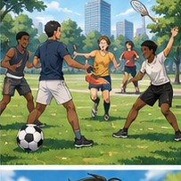

---

## 2. Mục tiêu bài học

Sau bài học, người học có thể:

1. Gọi tên một số môn thể thao phổ biến.
2. Nói môn thể thao mình yêu thích.
3. Hỏi người khác thích môn thể thao nào.
4. Hỏi người khác thường tập gì.
5. Sử dụng **exercise** để nói về việc vận động.
6. Sử dụng **work out** để nói về tập luyện.
7. Sử dụng **go running / jogging**.
8. Sử dụng **go to the gym**.
9. Sử dụng **be good at + V-ing**.
10. Nói về hoạt động giúp giữ dáng bằng **keep fit**.
11. Nói về việc giữ sức khỏe bằng **keep healthy**.
12. Nói về việc tăng cường sức mạnh bằng **build up physical strength**.
13. Biết cách dùng **stretch before workouts**.
14. Nói về thành tích thể thao bằng **win a silver medal**.
15. Giải thích lý do mình chọn một hoạt động vận động.
16. Nói về lợi ích của sức khỏe tốt.
17. Nói đồng ý hoặc không thích một môn thể thao.
18. Duy trì hội thoại về thể thao ít nhất 6–8 lượt.
19. Tự mô tả thói quen vận động của bản thân.
20. Tạo một hội thoại mới về thể thao và sức khỏe.

---

## 3. Sơ đồ giao tiếp

```mermaid
flowchart LR
    A[Nói về thể thao] --> B[Hỏi môn yêu thích]
    B --> C[Nói môn mình thích]
    C --> D[Hỏi cách luyện tập]
    D --> E[Nói tần suất]
    E --> F[Nói khả năng]
    F --> G[Nói lợi ích sức khỏe]
    G --> H[Nói cách giữ dáng]
    H --> I[Đưa lời khuyên]
    I --> J[Tiếp tục hội thoại]
```

### Mẫu đơn giản

`What sport do you like most?`

→ `I like swimming best.`

→ `How often do you swim?`

→ `Three times a week.`

→ `Are you good at swimming?`

→ `Yes, I'm pretty good at it.`

→ `Why do you like it?`

→ `Because it helps me keep fit.`

---

# 4. Từ vựng trọng tâm — Core Vocabulary

## 4.1. **sport** /spɔːt/

**Nghĩa:** thể thao

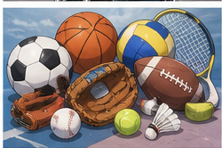

**Ví dụ:**

* **Sport makes the body strong.**
  — Thể thao giúp cơ thể khỏe mạnh.

* **What sport do you like most?**
  — Bạn thích môn thể thao nào nhất?

### Phân biệt

**sport** có thể nói về thể thao nói chung.

**a sport** = một môn thể thao.

**Football is a popular sport.**

---

## 4.2. **exercise** /ˈek.sə.saɪz/

**Nghĩa:** bài tập; hoạt động thể chất; tập luyện


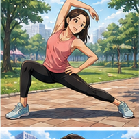
**Ví dụ:**

* **What do you do for exercise?**
  — Bạn làm gì để vận động?

* **Exercise is good for your health.**
  — Tập thể dục tốt cho sức khỏe.

---

## 4.3. **physical training**

**Nghĩa:** luyện tập thể chất


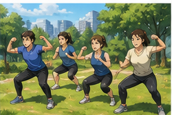
Trong bài:

**I've been taking part in physical training.**

— Tôi đã tham gia luyện tập thể chất.

### Cụm từ

`take part in + activity`

= tham gia một hoạt động.

---

## 4.4. **fighting** /ˈfaɪ.tɪŋ/

**Nghĩa:** đánh nhau, chiến đấu


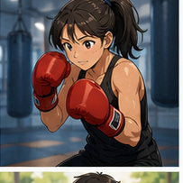
Trong đoạn hội thoại về boxing:

**I don't like fighting.**

— Tôi không thích đánh nhau.

Người nói sau đó giải thích:

**Boxing isn't fighting. It's sport.**

— Boxing không đơn giản là đánh nhau. Đó là một môn thể thao.

---

## 4.5. **skill** /skɪl/

**Nghĩa:** kỹ năng

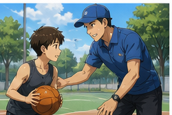

**Ví dụ:**

* **Boxing needs skills.**
  — Boxing cần kỹ năng.

* **Swimming is an important skill.**
  — Bơi là một kỹ năng quan trọng.

---

## 4.6. **boxing** /ˈbɒk.sɪŋ/

**Nghĩa:** quyền Anh, boxing


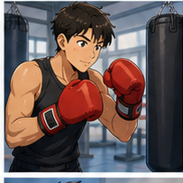
**Ví dụ:**

* **I like boxing best.**
  — Tôi thích boxing nhất.

* **Boxing needs strength and skill.**
  — Boxing cần sức mạnh và kỹ năng.

---

## 4.7. **basketball** /ˈbɑː.skɪt.bɔːl/

**Nghĩa:** bóng rổ

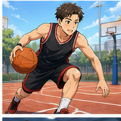

**Ví dụ:**

* **I play basketball after school.**
  — Tôi chơi bóng rổ sau giờ học.

* **Do you like basketball?**
  — Bạn có thích bóng rổ không?

---

## 4.8. **football** /ˈfʊt.bɔːl/

**Nghĩa:** bóng đá


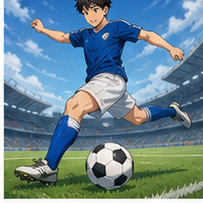
**Ví dụ:**

* **I play football every weekend.**
  — Tôi chơi bóng đá mỗi cuối tuần.

* **Football is my favorite sport.**
  — Bóng đá là môn thể thao yêu thích của tôi.

---

## 4.9. **badminton** /ˈbæd.mɪn.tən/

**Nghĩa:** cầu lông

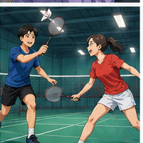

**Ví dụ:**

* **I play badminton with my friends.**
  — Tôi chơi cầu lông với bạn bè.

* **Are you good at badminton?**
  — Bạn có giỏi cầu lông không?

---

## 4.10. **volleyball** /ˈvɒl.i.bɔːl/

**Nghĩa:** bóng chuyền


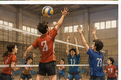
**Ví dụ:**

* **She plays volleyball at school.**
  — Cô ấy chơi bóng chuyền ở trường.

* **We play volleyball on Sundays.**
  — Chúng tôi chơi bóng chuyền vào Chủ nhật.

---

## 4.11. **jogging** /ˈdʒɒɡ.ɪŋ/

**Nghĩa:** chạy bộ nhẹ

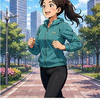

**Ví dụ:**

* **I go jogging every morning.**
  — Tôi chạy bộ mỗi sáng.

* **Jogging helps me keep fit.**
  — Chạy bộ giúp tôi giữ dáng.

### Cấu trúc

`go + V-ing`

* go jogging
* go running
* go swimming

---

## 4.12. **running** /ˈrʌn.ɪŋ/

**Nghĩa:** chạy bộ


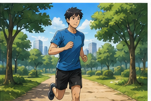
Trong bài:

**Do you like to go running?**

— Bạn có thích chạy bộ không?

Có thể nói:

**I go running three times a week.**

---

## 4.13. **swimming** /ˈswɪm.ɪŋ/

**Nghĩa:** bơi lội

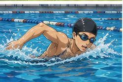

**Ví dụ:**

* **I'm good at swimming.**
  — Tôi giỏi bơi.

* **I go swimming every weekend.**
  — Tôi đi bơi mỗi cuối tuần.

---

## 4.14. **yoga** /ˈjəʊ.ɡə/

**Nghĩa:** yoga


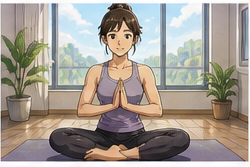
**Ví dụ:**

* **I do yoga in the morning.**
  — Tôi tập yoga vào buổi sáng.

* **Yoga helps me relax.**
  — Yoga giúp tôi thư giãn.

### Chú ý

Thường dùng:

✅ **do yoga**

Không dùng:

❌ **play yoga**

---

## 4.15. **bicycle / bike**

**Nghĩa:** xe đạp

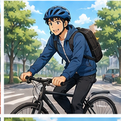

Trong bài:

**I go to work by bicycle.**

— Tôi đi làm bằng xe đạp.

Người nói giải thích:

**I use it as exercise.**

— Tôi xem việc đó như một hình thức tập luyện.

---

## 4.16. **motorbike** /ˈməʊ.tə.baɪk/

**Nghĩa:** xe máy


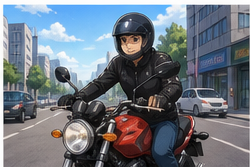
**Ví dụ:**

* **I usually go to work by motorbike.**
  — Tôi thường đi làm bằng xe máy.

* **Do you ride a motorbike?**
  — Bạn có đi xe máy không?

---

## 4.17. **gym** /dʒɪm/

**Nghĩa:** phòng gym, phòng tập thể hình

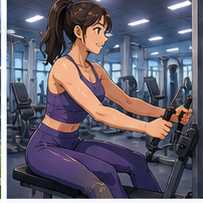

Trong bài:

**He goes to the gym every day.**

— Anh ấy đi tập gym mỗi ngày.

### Cấu trúc

`go to the gym`

---

## 4.18. **work out**

**Nghĩa:** tập thể dục, tập luyện


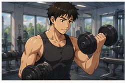
**Ví dụ:**

* **You should work out to keep healthy.**
  — Bạn nên tập luyện để giữ sức khỏe.

* **I work out three times a week.**
  — Tôi tập ba lần mỗi tuần.

### Danh từ

**workout** = buổi tập

**I had a good workout today.**

---

## 4.19. **stretch** /stretʃ/

**Nghĩa:** giãn cơ

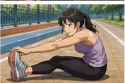

Trong bài:

**We should stretch before workouts.**

— Chúng ta nên giãn cơ trước khi tập.

---

## 4.20. **health** /helθ/

**Nghĩa:** sức khỏe


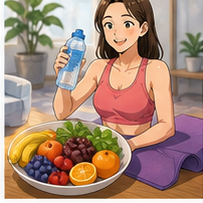
**Ví dụ:**

* **Good health is very important.**
  — Sức khỏe tốt rất quan trọng.

* **Exercise is good for your health.**
  — Tập luyện tốt cho sức khỏe.

Trong bài:

**We can never do any work well without good health.**

— Chúng ta khó có thể làm tốt công việc nếu không có sức khỏe tốt.

---

## 4.21. **healthy** /ˈhel.θi/

**Nghĩa:** khỏe mạnh, có lợi cho sức khỏe


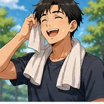
**Ví dụ:**

* **You should work out to keep healthy.**
  — Bạn nên tập luyện để duy trì sức khỏe.

* **Exercise keeps us healthy.**
  — Tập thể dục giúp chúng ta khỏe mạnh.

---

## 4.22. **keep fit**

**Nghĩa:** giữ dáng, giữ thể lực tốt

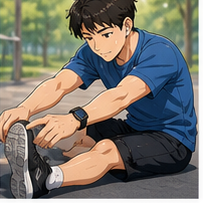

Trong bài:

**It helps me keep fit.**

— Nó giúp tôi duy trì thể lực.

Ví dụ:

**I cycle to work to keep fit.**

---

## 4.23. **build up**

**Nghĩa:** xây dựng, tăng cường dần


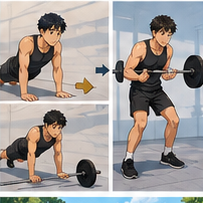
Trong bài:

**To build up our physical strength is very important.**

— Việc tăng cường sức mạnh thể chất rất quan trọng.

Ví dụ:

**Exercise helps build up your strength.**

---

## 4.24. **physical strength**

**Nghĩa:** sức mạnh thể chất, thể lực


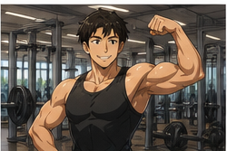
**Ví dụ:**

* **Swimming can build up physical strength.**
  — Bơi có thể giúp tăng cường thể lực.

* **Physical strength is important in many sports.**
  — Thể lực quan trọng trong nhiều môn thể thao.

---

## 4.25. **medal** /ˈmed.əl/

**Nghĩa:** huy chương

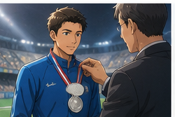

Trong bài:

**Last time she won the silver medal.**

— Lần trước cô ấy đã giành huy chương bạc.

### Các loại huy chương

* **gold medal** — huy chương vàng
* **silver medal** — huy chương bạc
* **bronze medal** — huy chương đồng

---

## 4.26. **win** /wɪn/

**Nghĩa:** chiến thắng, giành được


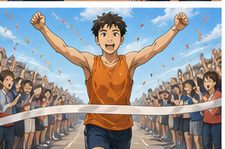
### Quá khứ

`win → won`

Ví dụ:

**She won a silver medal.**

— Cô ấy đã giành huy chương bạc.

---

# 5. Bảng tổng hợp từ vựng

| Từ / cụm từ           | IPA              | Nghĩa tiếng Việt      | Ví dụ ngắn                     |
| --------------------- | ---------------- | --------------------- | ------------------------------ |
| **sport**             | /spɔːt/          | thể thao              | play a sport                   |
| **exercise**          | /ˈek.sə.saɪz/    | tập thể dục           | do some exercise               |
| **physical training** | —                | luyện tập thể chất    | take part in physical training |
| **fighting**          | /ˈfaɪ.tɪŋ/       | đánh nhau             | I don't like fighting.         |
| **skill**             | /skɪl/           | kỹ năng               | sports skills                  |
| **boxing**            | /ˈbɒk.sɪŋ/       | quyền Anh             | like boxing                    |
| **basketball**        | /ˈbɑː.skɪt.bɔːl/ | bóng rổ               | play basketball                |
| **football**          | /ˈfʊt.bɔːl/      | bóng đá               | play football                  |
| **badminton**         | /ˈbæd.mɪn.tən/   | cầu lông              | play badminton                 |
| **volleyball**        | /ˈvɒl.i.bɔːl/    | bóng chuyền           | play volleyball                |
| **jogging**           | /ˈdʒɒɡ.ɪŋ/       | chạy bộ nhẹ           | go jogging                     |
| **running**           | /ˈrʌn.ɪŋ/        | chạy bộ               | go running                     |
| **swimming**          | /ˈswɪm.ɪŋ/       | bơi lội               | go swimming                    |
| **yoga**              | /ˈjəʊ.ɡə/        | yoga                  | do yoga                        |
| **bicycle**           | /ˈbaɪ.sɪ.kəl/    | xe đạp                | by bicycle                     |
| **motorbike**         | /ˈməʊ.tə.baɪk/   | xe máy                | by motorbike                   |
| **gym**               | /dʒɪm/           | phòng gym             | go to the gym                  |
| **work out**          | —                | tập luyện             | work out every day             |
| **workout**           | /ˈwɜː.kaʊt/      | buổi tập              | before a workout               |
| **stretch**           | /stretʃ/         | giãn cơ               | stretch before exercise        |
| **health**            | /helθ/           | sức khỏe              | good health                    |
| **healthy**           | /ˈhel.θi/        | khỏe mạnh             | keep healthy                   |
| **keep fit**          | —                | giữ dáng, giữ thể lực | exercise to keep fit           |
| **build up**          | —                | tăng cường            | build up strength              |
| **physical strength** | —                | sức mạnh thể chất     | build physical strength        |
| **medal**             | /ˈmed.əl/        | huy chương            | silver medal                   |
| **win / won**         | /wɪn/, /wʌn/     | thắng / đã thắng      | won a medal                    |

---

# 6. Mẫu câu giao tiếp — Useful Structures

## 6.1. Hỏi loại hình vận động yêu thích

### **What kind of exercise do you like best?**

— Bạn thích loại hình vận động nào nhất?

Có thể trả lời:

* **I like swimming best.**
* **I like jogging best.**
* **I like yoga best.**

---

## 6.2. Hỏi môn thể thao yêu thích

### **What sport do you like most?**

— Bạn thích môn thể thao nào nhất?

Trong hội thoại:

**What sport do you like most?**

**I like boxing best.**

### Cách khác

**What's your favorite sport?**

---

## 6.3. Hỏi môn thể thao người khác thích chơi

### **Which sport do you like playing?**

— Bạn thích chơi môn thể thao nào?

Ví dụ:

**I like playing football.**

**I like playing badminton.**

---

## 6.4. Hỏi người khác có thích chạy không

### **Do you like to go running?**

— Bạn có thích chạy bộ không?

Cách rất tự nhiên khác:

**Do you like running?**

Trả lời:

* **Yes, I do.**
* **Yes. I run every morning.**
* **No, I don't. I prefer swimming.**

---

## 6.5. Hỏi cách người khác tập luyện

### **What do you do for exercise?**

— Bạn thường làm gì để vận động?

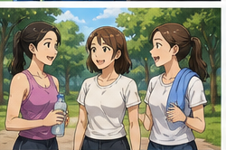

Ví dụ trả lời:

* **I go jogging.**
* **I go swimming.**
* **I work out at the gym.**
* **I cycle to work.**
* **I do yoga.**

---

## 6.6. Nói mình giỏi một môn

### **I'm good at + V-ing.**

Trong bài:

**I'm good at swimming.**

Ví dụ:

* **I'm good at running.**
* **I'm good at boxing.**
* **I'm good at playing football.**

---

## 6.7. Nói môn mình thích nhất

### **I like + sport + best.**

**I like boxing best.**

**I like swimming best.**

Cách tự nhiên khác:

**My favorite sport is swimming.**

---

## 6.8. Nói mình không thích

### **I don't like + noun/V-ing.**

Trong hội thoại:

**I don't like fighting.**

Ví dụ:

* **I don't like running.**
* **I don't like boxing.**
* **I don't like going to the gym.**

Mạnh hơn:

### **I hate + noun/V-ing.**

**I hate running.**

`hate` mạnh hơn `don't like`.

---

## 6.9. Nói hoạt động cần kỹ năng

### **It needs skill.**

Hoặc:

### **It requires skill.**

Trong bài:

**Boxing isn't fighting. It's sport. It needs skills.**

Cách tự nhiên:

**Boxing requires skill.**

---

## 6.10. Nói về lợi ích của thể thao

### **Sport makes the body strong.**

— Thể thao giúp cơ thể khỏe mạnh.

Cách tự nhiên khác:

* **Sport makes us stronger.**
* **Exercise makes your body stronger.**
* **Exercise is good for your health.**

---

## 6.11. Nói về sức khỏe

### **We can never do any work well without good health.**

— Chúng ta khó có thể làm việc tốt nếu không có sức khỏe tốt.

Cách đơn giản hơn ở A1–A2:

**Good health is very important.**

Hoặc:

**We need good health to work well.**

---

## 6.12. Nói về việc đi gym

### **He goes to the gym every day.**

— Anh ấy đi gym mỗi ngày.

Cấu trúc:

`go to the gym`

Ví dụ:

* **I go to the gym three times a week.**
* **She goes to the gym after work.**

---

## 6.13. Đưa lời khuyên tập luyện

### **You should work out to keep healthy.**

— Bạn nên tập luyện để giữ sức khỏe.

Cấu trúc:

`should + V`

Ví dụ:

* **You should exercise regularly.**
* **You should go jogging.**
* **You should stretch first.**

---

## 6.14. Nói về giãn cơ

### **We should stretch before workouts.**

— Chúng ta nên giãn cơ trước khi tập.

Ví dụ:

**Always stretch before exercise.**

---

## 6.15. Nói về tăng cường thể lực

### **Building up our physical strength is very important.**

— Việc tăng cường thể lực rất quan trọng.

Có thể nói đơn giản:

**Exercise helps build up physical strength.**

---

## 6.16. Nói về thành tích

### **She won a silver medal.**

— Cô ấy đã giành huy chương bạc.

Cấu trúc:

`win + medal/prize/game`

Ví dụ:

* **He won a gold medal.**
* **Our team won the game.**
* **She won first prize.**

---

## 6.17. Nói cách đi làm

Trong bài:

### **Do you go to work by car?**

— Bạn có đi làm bằng ô tô không?

Trả lời:

**No. I go to work by bicycle.**

### Cấu trúc

`go + somewhere + by + transport`

* by car
* by bus
* by bicycle
* by motorbike

---

## 6.18. Hỏi về khoảng cách

### **Isn't it far from your home to the office?**

— Từ nhà bạn đến văn phòng không xa sao?

Cách đơn giản:

**Is your office far from your home?**

---

## 6.19. Dùng một hoạt động như bài tập

### **I use it as exercise.**

— Tôi sử dụng nó như một hình thức vận động.

Trong hội thoại:

**I go to work by bicycle. I use it as exercise.**

---

## 6.20. Nói điều gì giúp giữ dáng

### **It helps me keep fit.**

— Nó giúp tôi duy trì thể lực.

Cấu trúc:

`help + someone + V`

Ví dụ:

* **Running helps me keep fit.**
* **Swimming helps me stay healthy.**
* **Cycling helps me exercise every day.**

---

# 7. Cách dùng động từ với các môn thể thao

Một lỗi rất thường gặp là dùng cùng một động từ cho tất cả môn thể thao.

## **play + sport**

Dùng với nhiều môn thể thao có bóng hoặc thi đấu theo trò chơi:

* play football
* play basketball
* play badminton
* play volleyball

---

## **go + V-ing**

Dùng với nhiều hoạt động:

* go running
* go jogging
* go swimming
* go cycling

---

## **do + activity**

Dùng với một số loại luyện tập:

* do yoga
* do exercise
* do physical training

---

## Bảng tổng hợp

| Động từ      | Hoạt động         |
| ------------ | ----------------- |
| **play**     | football          |
| **play**     | basketball        |
| **play**     | badminton         |
| **play**     | volleyball        |
| **go**       | running           |
| **go**       | jogging           |
| **go**       | swimming          |
| **go**       | cycling           |
| **do**       | yoga              |
| **do**       | exercise          |
| **do**       | physical training |
| **work out** | at the gym        |

### Sơ đồ

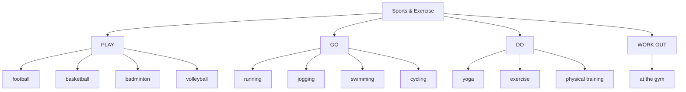

---

# 8. Phân biệt **exercise**, **work out**, **workout** và **sport**

## **sport**

= môn thể thao hoặc hoạt động thể thao.

**Football is my favorite sport.**

---

## **exercise**

= vận động hoặc bài tập thể chất nói chung.

**I exercise every morning.**

**Exercise is good for your health.**

---

## **work out**

= động từ, tập luyện.

**I work out at the gym.**

---

## **workout**

= danh từ, buổi tập.

**I had a good workout.**

---

## Bảng so sánh

| Từ           | Loại              | Ví dụ                          |
| ------------ | ----------------- | ------------------------------ |
| **sport**    | danh từ           | My favorite sport is swimming. |
| **exercise** | danh từ / động từ | Exercise is important.         |
| **work out** | động từ           | I work out every day.          |
| **workout**  | danh từ           | It was a hard workout.         |

---

# 9. Phát âm trọng tâm

## 9.1. **sport**

/spɔːt/

Luyện:

**SPORT**

---

## 9.2. **exercise**

/ˈek.sə.saɪz/

Trọng âm:

**EX**-er-cise

---

## 9.3. **basketball**

/ˈbɑː.skɪt.bɔːl/

Trọng âm:

**BAS**-ket-ball

---

## 9.4. **badminton**

/ˈbæd.mɪn.tən/

Trọng âm:

**BAD**-min-ton

Không đọc thành:

❌ `bad-min-TON`

---

## 9.5. **jogging**

/ˈdʒɒɡ.ɪŋ/

Trọng âm:

**JOG**-ging

---

## 9.6. **swimming**

/ˈswɪm.ɪŋ/

Trọng âm:

**SWIM**-ming

---

## 9.7. **volleyball**

/ˈvɒl.i.bɔːl/

Trọng âm:

**VOL**-ley-ball

---

## 9.8. **physical**

/ˈfɪz.ɪ.kəl/

Trọng âm:

**PHYS**-i-cal

---

## 9.9. **health**

/helθ/

Chú ý âm cuối:

`/θ/`

Đặt đầu lưỡi nhẹ giữa hai hàm răng.

---

## 9.10. **healthy**

/ˈhel.θi/

Trọng âm:

**HEAL**-thy

---

## 9.11. Nối âm trong hội thoại

### **What kind of exercise do you like best?**

Luyện theo cụm:

`What-kind-of-exercise / do-you-like-best?`

### **What do you do for exercise?**

`What-do-you-do / for-exercise?`

### **I'm good at swimming.**

`I'm-good-at-swimming.`

### **You should work out to keep healthy.**

`You-should-work-out / to-keep-healthy.`

### **It helps me keep fit.**

`It-helps-me-keep-fit.`

---

# 10. Hội thoại thực tế — Real-Life Conversation

## Hội thoại 1 — Boxing

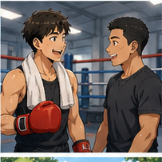

**A:** Hugo, what sport do you like most?

**Hugo:** I like boxing best.

**A:** Do you like it, too?

**B:** No, I hate it. I don't like fighting.

**Hugo:** Boxing isn't just fighting. It's a sport. It needs skill.

**B:** I understand, but I still prefer swimming.

**Hugo:** Are you good at swimming?

**B:** Yes. I'm pretty good at it.

### Nội dung giao tiếp

```text
Hỏi môn yêu thích
   ↓
Nói môn yêu thích
   ↓
Hỏi người kia có thích không
   ↓
Không đồng ý
   ↓
Giải thích lý do
   ↓
Nêu môn khác
   ↓
Hỏi khả năng
   ↓
Tiếp tục hội thoại
```

---

## Hội thoại 2 — Đi xe đạp để tập thể dục


**A:** Hugo, do you go to work by car?

**Hugo:** No. I go to work by bicycle.

**A:** Why not by car? Isn't your office far from your home?

**Hugo:** A little, but I use cycling as exercise.

**A:** Really?

**Hugo:** Yes. It helps me keep fit.

**A:** That's a good idea. How long does it take?

**Hugo:** About thirty minutes.

---

## Hội thoại 3 — Nói về gym


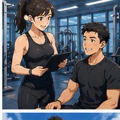
**Mai:** What do you do for exercise?

**Alex:** I go to the gym.

**Mai:** How often do you go?

**Alex:** About three times a week.

**Mai:** What do you usually do there?

**Alex:** I work out for about an hour.

**Mai:** Do you stretch before your workout?

**Alex:** Yes. I always stretch first.

**Mai:** That's good.

---

## Hội thoại 4 — Chạy bộ và bơi


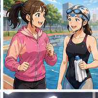
**A:** What kind of exercise do you like best?

**B:** I like swimming best.

**A:** Are you good at swimming?

**B:** Yes. I've been swimming for several years.

**A:** Do you like running, too?

**B:** A little. I go jogging on weekends.

**A:** Why do you exercise?

**B:** Because I want to keep fit and stay healthy.

---

## Hội thoại 5 — Thành tích thể thao


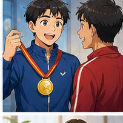
**A:** Does your sister play sports?

**B:** Yes. She plays badminton.

**A:** Is she good at it?

**B:** Very good. She competes in tournaments.

**A:** Really?

**B:** Yes. Last time she won a silver medal.

**A:** That's great!

**B:** Thanks. She trains almost every day.

---

# 11. Natural Expressions — Cách nói tự nhiên

| Cụm từ                                      | Nghĩa                                 | Khi dùng          |
| ------------------------------------------- | ------------------------------------- | ----------------- |
| **What's your favorite sport?**             | Môn thể thao yêu thích của bạn là gì? | Hỏi sở thích      |
| **What sport do you like most?**            | Bạn thích môn nào nhất?               | Hỏi sở thích      |
| **What kind of exercise do you like best?** | Bạn thích kiểu vận động nào nhất?     | Hỏi tập luyện     |
| **What do you do for exercise?**            | Bạn làm gì để vận động?               | Hỏi thói quen     |
| **Do you like running?**                    | Bạn thích chạy không?                 | Hỏi sở thích      |
| **I like boxing best.**                     | Tôi thích boxing nhất.                | Trả lời           |
| **I'm good at swimming.**                   | Tôi giỏi bơi.                         | Khả năng          |
| **I don't like fighting.**                  | Tôi không thích đánh nhau.            | Không thích       |
| **I hate it.**                              | Tôi rất ghét nó.                      | Không thích mạnh  |
| **I go jogging.**                           | Tôi chạy bộ.                          | Thói quen         |
| **I go swimming.**                          | Tôi đi bơi.                           | Hoạt động         |
| **I play badminton.**                       | Tôi chơi cầu lông.                    | Thể thao          |
| **I do yoga.**                              | Tôi tập yoga.                         | Vận động          |
| **I go to the gym.**                        | Tôi đi gym.                           | Tập luyện         |
| **I work out three times a week.**          | Tôi tập ba lần một tuần.              | Tần suất          |
| **You should work out.**                    | Bạn nên tập luyện.                    | Lời khuyên        |
| **You should stretch first.**               | Bạn nên giãn cơ trước.                | Lời khuyên        |
| **It helps me keep fit.**                   | Nó giúp tôi giữ thể lực.              | Lợi ích           |
| **It keeps me healthy.**                    | Nó giúp tôi khỏe mạnh.                | Lợi ích           |
| **It's good for your health.**              | Nó tốt cho sức khỏe.                  | Lợi ích           |
| **It builds up strength.**                  | Nó giúp tăng sức mạnh.                | Lợi ích           |
| **She won a silver medal.**                 | Cô ấy giành huy chương bạc.           | Thành tích        |
| **Really?**                                 | Thật à?                               | Thể hiện quan tâm |
| **That's a good idea.**                     | Ý hay đấy.                            | Phản hồi          |

---

# 12. Lỗi thường gặp — Common Mistakes

## Lỗi 1: Dùng **play** với mọi môn thể thao

❌ **I play swimming.**

✅ **I go swimming.**

❌ **I play jogging.**

✅ **I go jogging.**

Nhưng:

✅ **I play football.**

✅ **I play badminton.**

---

## Lỗi 2: Nói **play yoga**

❌ **I play yoga.**

✅ **I do yoga.**

---

## Lỗi 3: Nhầm **work out** và **workout**

### Động từ

✅ **I work out every day.**

### Danh từ

✅ **I had a good workout.**

Không viết:

❌ **I workout every day.**

khi muốn dùng động từ.

---

## Lỗi 4: Dùng sai **good at**

❌ **I'm good in swimming.**

✅ **I'm good at swimming.**

### Cấu trúc

`be good at + noun/V-ing`

---

## Lỗi 5: Nói **I like best boxing**

❌ **I like best boxing.**

✅ **I like boxing best.**

Hoặc:

✅ **Boxing is my favorite sport.**

---

## Lỗi 6: Nhầm **health** và **healthy**

### **health**

= danh từ: sức khỏe

**Exercise is good for your health.**

### **healthy**

= tính từ: khỏe mạnh

**Exercise keeps you healthy.**

---

## Lỗi 7: Nói **keep health**

❌ **I exercise to keep health.**

✅ **I exercise to keep healthy.**

Hoặc:

✅ **I exercise to stay healthy.**

---

## Lỗi 8: Nói **keep fitness** khi muốn nói giữ dáng

Ở trình độ cơ bản:

✅ **keep fit**

**Running helps me keep fit.**

---

## Lỗi 9: Dùng sai với **gym**

❌ **I go gym every day.**

✅ **I go to the gym every day.**

---

## Lỗi 10: Nói **by bicycle to work** sai trật tự

Tự nhiên:

✅ **I go to work by bicycle.**

Cũng có thể nói:

✅ **I cycle to work.**

---

## Lỗi 11: Nói **win a game yesterday** nhưng không đổi động từ

❌ **She win a medal last time.**

✅ **She won a medal last time.**

### Ghi nhớ

`win → won`

---

## Lỗi 12: Nhầm **medal** và **metal**

**medal** = huy chương.

**metal** = kim loại.

✅ **silver medal**

❌ **silver metal** khi muốn nói "huy chương bạc".

---

## Lỗi 13: Dùng **sport** khi cần số nhiều

Khi nói nhiều môn:

✅ **I like sports.**

Khi hỏi một môn:

✅ **What's your favorite sport?**

---

## Lỗi 14: Dùng câu quá dài khi nói về thói quen

Thay vì:

❌ **I usually every morning before I go to work I try to do some running because I think it is very healthy for me.**

Nên nói:

✅ **I go running every morning. It helps me stay healthy.**

---

# 13. Luyện tập có hướng dẫn

## Bài 1 — Nối từ với nghĩa

1. jogging
2. gym
3. stretch
4. health
5. medal
6. skill
7. boxing
8. keep fit

A. kỹ năng
B. chạy bộ nhẹ
C. giữ thể lực
D. sức khỏe
E. huy chương
F. phòng tập
G. giãn cơ
H. quyền Anh

<details>
<summary>Đáp án</summary>

1–B
2–F
3–G
4–D
5–E
6–A
7–H
8–C

</details>

---

## Bài 2 — Điền từ vào chỗ trống

Dùng:

`swimming` · `gym` · `fit` · `stretch` · `medal`

1. I'm good at ______.
2. He goes to the ______ every day.
3. Running helps me keep ______.
4. We should ______ before workouts.
5. She won a silver ______.

<details>
<summary>Đáp án</summary>

1. swimming
2. gym
3. fit
4. stretch
5. medal

</details>

---

## Bài 3 — Chọn **play**, **go** hoặc **do**

1. ______ football
2. ______ swimming
3. ______ yoga
4. ______ jogging
5. ______ badminton
6. ______ basketball
7. ______ running
8. ______ exercise

<details>
<summary>Đáp án</summary>

1. play football
2. go swimming
3. do yoga
4. go jogging
5. play badminton
6. play basketball
7. go running
8. do exercise

</details>

---

## Bài 4 — Chọn câu đúng

### 1. Bạn giỏi bơi.

* A. I'm good in swimming.
* B. I'm good at swimming.
* C. I'm well at swimming.

**Đáp án:** B

---

### 2. Bạn tập yoga.

* A. I play yoga.
* B. I go yoga.
* C. I do yoga.

**Đáp án:** C

---

### 3. Bạn đi gym mỗi ngày.

* A. I go to the gym every day.
* B. I go gym every day.
* C. I play gym every day.

**Đáp án:** A

---

### 4. Chạy giúp bạn giữ dáng.

* A. Running helps me keep fit.
* B. Running helps me keep health.
* C. Running makes me fitness.

**Đáp án:** A

---

## Bài 5 — Hoàn thành hội thoại

**A:** What sport do you like ______?

**B:** I like swimming best.

**A:** Are you good ______ swimming?

**B:** Yes.

**A:** What do you do ______ exercise?

**B:** I go swimming three times a week.

**A:** Why do you exercise?

**B:** It helps me keep ______.

<details>
<summary>Đáp án</summary>

1. most
2. at
3. for
4. fit

</details>

---

## Bài 6 — Viết câu hoàn chỉnh

### 1.

`I / good / swimming`

→ ___________________________

### 2.

`he / gym / every day`

→ ___________________________

### 3.

`we / should / stretch / workout`

→ ___________________________

### 4.

`running / help / keep fit`

→ ___________________________

### 5.

`she / win / silver medal`

→ ___________________________

<details>
<summary>Đáp án gợi ý</summary>

1. **I'm good at swimming.**
2. **He goes to the gym every day.**
3. **We should stretch before workouts.**
4. **Running helps me keep fit.**
5. **She won a silver medal.**

</details>

---

# 14. Speaking Challenge — Thử thách nói

## Nhiệm vụ 1 — Đọc mẫu câu

Đọc thành tiếng:

* **What sport do you like most?**
* **What do you do for exercise?**
* **Do you like running?**
* **I'm good at swimming.**
* **I go to the gym three times a week.**
* **We should stretch before workouts.**
* **It helps me keep fit.**
* **Exercise is good for your health.**

---

## Nhiệm vụ 2 — Nói về môn thể thao yêu thích

Sử dụng:

> **Sport → How often → Why**

Ví dụ:

> **My favorite sport is swimming. I go swimming three times a week. I like it because it helps me keep fit and stay healthy.**

---

## Nhiệm vụ 3 — Nói về thói quen vận động trong 45–60 giây

Sử dụng công thức:

```text
Favorite Activity
   ↓
How Often
   ↓
Where
   ↓
Who With
   ↓
Why
   ↓
Health Benefit
```

Ví dụ:

> **I like jogging. I go jogging four times a week. I usually run in the park near my home. Sometimes I run with my friends. I like jogging because it helps me relax and keep fit. I think exercise is very important for good health.**

---

## Nhiệm vụ 4 — Tạo 5 câu hỏi

Tạo ít nhất 5 câu hỏi về thể thao.

Ví dụ:

1. **What's your favorite sport?**
2. **What do you do for exercise?**
3. **How often do you work out?**
4. **Do you go to the gym?**
5. **Are you good at swimming?**

---

## Nhiệm vụ 5 — Ghi âm và tự sửa lỗi

Ghi âm một đoạn nói **45–60 giây**.

Nghe lại và xác định:

* 1 lỗi phát âm;
* 1 lỗi từ vựng;
* 1 lỗi ngữ pháp;
* 1 chỗ nói chưa tự nhiên.

Sau đó ghi âm lại lần thứ hai.

---

# 15. Practice Mission — Nhiệm vụ thực tế

Trong hôm nay, hãy tạo một cuộc hội thoại ít nhất **8 lượt** theo công thức:

> **Favorite Sport → Exercise → Frequency → Skill → Health → Advice**

Sử dụng ít nhất:

* 5 từ vựng mới;
* 3 mẫu câu của bài;
* 1 câu với **good at**;
* 1 câu với **keep fit / stay healthy**;
* 1 câu hỏi về thói quen luyện tập.

### Ví dụ

**A:** What sport do you like most?

**B:** I like badminton best.

**A:** How often do you play?

**B:** About three times a week.

**A:** Are you good at badminton?

**B:** I'm pretty good at it. What do you do for exercise?

**A:** I go jogging every morning.

**B:** That's great. Jogging helps you keep fit.

---

# 16. Tự đánh giá cuối bài

Đánh dấu khi bạn có thể thực hiện mà không nhìn bài:

* [ ] Tôi biết từ **sport**.
* [ ] Tôi biết từ **exercise**.
* [ ] Tôi có thể gọi tên ít nhất 8 môn thể thao.
* [ ] Tôi biết dùng **play football**.
* [ ] Tôi biết dùng **play badminton**.
* [ ] Tôi biết dùng **go swimming**.
* [ ] Tôi biết dùng **go jogging**.
* [ ] Tôi biết dùng **do yoga**.
* [ ] Tôi biết dùng **go to the gym**.
* [ ] Tôi có thể hỏi **What sport do you like most?**
* [ ] Tôi có thể hỏi **What do you do for exercise?**
* [ ] Tôi có thể sử dụng **I'm good at swimming.**
* [ ] Tôi có thể nói tần suất luyện tập.
* [ ] Tôi hiểu **work out**.
* [ ] Tôi phân biệt **work out** và **workout**.
* [ ] Tôi hiểu **stretch**.
* [ ] Tôi có thể sử dụng **keep fit**.
* [ ] Tôi phân biệt **health** và **healthy**.
* [ ] Tôi biết **silver medal** là huy chương bạc.
* [ ] Tôi có thể duy trì hội thoại về thể thao 6–8 lượt.

---

# 17. Câu hỏi mở cuối bài

**Imagine a new friend asks you about your exercise habits. What sport or physical activity do you enjoy, how often do you do it, where do you exercise, and how does it help your health?**

*Hãy tưởng tượng một người bạn mới hỏi về thói quen vận động của bạn. Bạn thích môn thể thao hoặc hoạt động nào, bạn tập bao nhiêu lần, tập ở đâu và hoạt động đó giúp ích cho sức khỏe của bạn như thế nào?*

---

# 18. Ghi chú dành cho giảng viên

* **Module:** 04 — Around Town / Giao tiếp trong thành phố
* **Chủ điểm:** Doing Sport / Thể thao và hoạt động vận động
* **Thời lượng video:** 8–12 phút
* **Luyện nói:** 5–10 phút
* **Trình độ:** A1–A2

### Trọng tâm từ vựng

* sport
* exercise
* physical training
* fighting
* skill
* boxing
* basketball
* football
* badminton
* jogging
* swimming
* volleyball
* yoga
* bicycle
* motorbike
* gym
* work out
* workout
* stretch
* health
* healthy
* build up
* physical strength
* keep fit
* medal
* silver medal
* win / won

### Trọng tâm cấu trúc

* **What kind of exercise do you like best?**
* **What sport do you like most?**
* **Which sport do you like playing?**
* **Do you like to go running?**
* **What do you do for exercise?**
* **I'm good at swimming.**
* **I like boxing best.**
* **I don't like fighting.**
* **He goes to the gym every day.**
* **You should work out to keep healthy.**
* **We should stretch before workouts.**
* **Sport makes the body strong.**
* **Exercise is good for your health.**
* **It helps me keep fit.**
* **I go to work by bicycle.**
* **I use it as exercise.**
* **She won a silver medal.**
* **Building up physical strength is very important.**

### Trọng tâm phát âm

* sport
* exercise
* basketball
* badminton
* jogging
* swimming
* volleyball
* physical
* health
* healthy
* strength
* medal

### Lưu ý ngôn ngữ

* Với nhiều môn thể thao có bóng, dùng:

  **play**

  * play football
  * play basketball
  * play badminton
  * play volleyball

* Với nhiều hoạt động kết thúc bằng **-ing**, dùng:

  **go**

  * go running
  * go jogging
  * go swimming
  * go cycling

* Với yoga:

  **do yoga**

* Dùng:

  **go to the gym**

  thay vì:

  **go gym**

* Dùng:

  **be good at + V-ing**

  **I'm good at swimming.**

* Phân biệt:

  **work out** = động từ

  **workout** = danh từ

* Phân biệt:

  **health** = sức khỏe, danh từ.

  **healthy** = khỏe mạnh, tính từ.

* Dùng:

  **keep fit**

  **stay healthy**

  để nói mục tiêu luyện tập.

* **silver medal** = huy chương bạc.

* Không nhầm:

  **medal** = huy chương.

  **metal** = kim loại.

* **I hate it** mạnh hơn **I don't like it**.

* Câu trong bài:

  **We can never do any work well without good health.**

  có thể giữ để học theo video, nhưng với người học A1–A2 nên ưu tiên câu đơn giản hơn:

  **Good health is very important.**

  hoặc:

  **We need good health to work well.**

* Câu:

  **To build up our physical strength is very important.**

  có thể diễn đạt tự nhiên hơn:

  **Building up our physical strength is very important.**

### Hoạt động gợi ý — Find Your Sports Partner

Chia lớp thành cặp hoặc nhóm nhỏ.

Mỗi người nhận một bảng thông tin:

| Person | Favorite Sport | Frequency     | Skill     | Goal           |
| ------ | -------------- | ------------- | --------- | -------------- |
| Alex   | swimming       | 3× / week     | good      | keep fit       |
| Mai    | badminton      | 2× / week     | very good | have fun       |
| Linh   | jogging        | every morning | beginner  | stay healthy   |
| David  | boxing         | 4× / week     | good      | build strength |

Người học phải hỏi:

> **What's your favorite sport?**

> **How often do you exercise?**

> **Are you good at it?**

> **Why do you do it?**

Sau đó tìm một người có thói quen hoặc sở thích gần giống mình.

---

### Role-play mẫu — Hỏi về môn thể thao yêu thích

**Người A nhận:**

> Bạn thích swimming và đi bơi ba lần một tuần.

Người A phải sử dụng:

* **I like swimming best.**
* **I'm good at swimming.**
* **I go swimming three times a week.**
* **It helps me keep fit.**

**Người B phải hỏi:**

* **What sport do you like most?**
* **Are you good at it?**
* **How often do you do it?**
* **Why do you like it?**

---

### Role-play mẫu — Đi gym

**Người A nhận:**

> Bạn mới bắt đầu tập gym.

Người A hỏi:

* **How often should I work out?**
* **Should I stretch first?**
* **What exercise should I do?**

**Người B trả lời bằng:**

* **You should stretch before workouts.**
* **You should exercise regularly.**
* **Start slowly.**
* **Don't train too hard at first.**

---

### Role-play mẫu — Đi xe đạp đi làm

**Người A nhận:**

> Bạn đi làm bằng xe đạp vì muốn vận động.

Người A phải nói:

* **I go to work by bicycle.**
* **I use it as exercise.**
* **It helps me keep fit.**

Người B phải hỏi:

* **Why don't you go by car?**
* **Isn't your office far from your home?**
* **How long does it take?**

---

### Role-play mẫu — Thành tích thể thao

**Người A nhận:**

> Em gái bạn chơi badminton và vừa giành huy chương bạc.

Người A phải sử dụng:

* **She's good at badminton.**
* **She trains regularly.**
* **She won a silver medal.**

Người B phản hồi:

* **Really?**
* **That's great!**
* **How often does she train?**
* **Does she compete often?**

Kết thúc bằng một câu hỏi mở để người học tự nói về hoạt động vận động của mình:

> **What do you do to keep fit and stay healthy?**
