# LESSON 20 — KHÁM PHÁ MỘT ĐIỂM DU LỊCH

> **Module 04 — Around Town / Giao tiếp trong thành phố**
> **Chủ đề:** Sightseeing — Hỏi thông tin, tham quan và khám phá điểm du lịch
> **Trình độ gợi ý:** A1–A2
> **Thời lượng:** 8–12 phút học bài + 5–10 phút luyện nói

---

## 1. Tình huống thực tế

Khi đi du lịch tại một thành phố mới, bạn có thể cần:

* hỏi tuyến tham quan phù hợp;
* tìm địa điểm đẹp;
* hỏi về danh lam thắng cảnh;
* thuê hướng dẫn viên;
* hỏi phí hướng dẫn viên;
* hỏi giá vé;
* kiểm tra thời hạn của vé hoặc thẻ tham quan;
* kiểm tra bảo hiểm du lịch;
* hỏi nơi có thể chụp ảnh;
* hỏi nhà vệ sinh;
* hỏi lối ra gần nhất;
* hỏi về cảnh đẹp xung quanh;
* nói cảm nhận về địa điểm vừa tham quan;
* nói một thành phố nổi tiếng vì điều gì;
* miêu tả phong cảnh;
* nói về kiến thức học được trong chuyến đi;
* hỏi kế hoạch tham quan trong ngày.

Bạn cần biết cách nói những câu như:

* **Could you tell me the best sightseeing route to take?**
* **Are there any beauty spots around here?**
* **Are there any nice landscapes around here?**
* **How much is the fare?**
* **How much is the guide fee per day?**
* **Can I take a picture here?**
* **Is there a toilet around here?**
* **Excuse me, where is the nearest exit?**
* **Hanoi is famous for Hoan Kiem Lake.**
* **The scenery is splendid.**
* **We've enjoyed it very much.**
* **What's the plan for today?**
* **Let me act as your tour guide.**

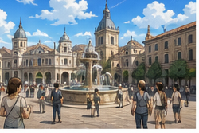

---

## 2. Mục tiêu bài học

Sau bài học, người học có thể:

1. Hiểu từ **sightseeing**.
2. Hỏi tuyến tham quan phù hợp.
3. Hỏi về các điểm đẹp gần đó.
4. Hỏi về phong cảnh và cảnh quan.
5. Hiểu và sử dụng **beauty spot**.
6. Hiểu và sử dụng **landscape**.
7. Hiểu và sử dụng **scenery**.
8. Nói một địa điểm nổi tiếng vì điều gì.
9. Hỏi giá vé hoặc giá di chuyển.
10. Hỏi phí hướng dẫn viên.
11. Kiểm tra thời hạn của vé hoặc giấy tờ.
12. Hỏi về bảo hiểm du lịch.
13. Hỏi xem có được phép chụp ảnh không.
14. Hỏi vị trí nhà vệ sinh.
15. Hỏi lối ra gần nhất.
16. Miêu tả phong cảnh bằng **splendid**.
17. Nói cảm nhận sau chuyến tham quan.
18. Nói về kiến thức thu được sau chuyến đi.
19. Hỏi và trả lời về kế hoạch tham quan trong ngày.
20. Duy trì hội thoại du lịch ít nhất 6–8 lượt.

---

## 3. Sơ đồ giao tiếp

```mermaid
flowchart LR
    A[Đến điểm du lịch] --> B[Hỏi thông tin]
    B --> C[Chọn tuyến tham quan]
    C --> D[Hỏi địa điểm nổi bật]
    D --> E[Kiểm tra vé / phí]
    E --> F[Thuê hoặc hỏi tour guide]
    F --> G[Hỏi tiện ích]
    G --> H[Chụp ảnh / tìm lối ra]
    H --> I[Tham quan]
    I --> J[Nói cảm nhận]
```

### Mẫu đơn giản

`Excuse me. Could you tell me the best sightseeing route to take?`

→ `Sure. You can start at the museum and then walk to the lake.`

→ `Are there any beauty spots around there?`

→ `Yes. The lake and the old bridge are very popular.`

→ `Can I take pictures there?`

→ `Yes, you can.`

→ `How much is the entrance fee?`

→ `It's $10 per person.`

---

# 4. Từ vựng trọng tâm — Core Vocabulary

## 4.1. **sightseeing** /ˈsaɪtˌsiː.ɪŋ/

**Nghĩa:** tham quan, ngắm cảnh

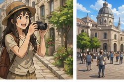

**Ví dụ:**

* **We went sightseeing in Hanoi.**
  — Chúng tôi đã đi tham quan ở Hà Nội.

* **What's the best sightseeing route?**
  — Tuyến tham quan tốt nhất là gì?

### Cụm từ

* **go sightseeing**
* **sightseeing tour**
* **sightseeing route**

---

## 4.2. **impression** /ɪmˈpreʃ.ən/

**Nghĩa:** ấn tượng


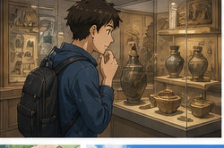
**Ví dụ:**

* **What's your impression of Hanoi?**
  — Ấn tượng của bạn về Hà Nội là gì?

* **My first impression was very good.**
  — Ấn tượng đầu tiên của tôi rất tốt.

---

## 4.3. **knowledge** /ˈnɒl.ɪdʒ/

**Nghĩa:** kiến thức


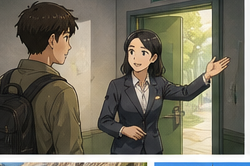
Trong bài:

**Each place you go gives you extra knowledge.**

— Mỗi nơi bạn đến đều cho bạn thêm kiến thức.

Ví dụ:

**Travelling gives us knowledge about other cultures.**

---

## 4.4. **guide** /ɡaɪd/

**Nghĩa:** hướng dẫn viên; hướng dẫn

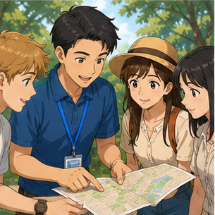

**Ví dụ:**

* **Our guide showed us around the city.**
  — Hướng dẫn viên đưa chúng tôi đi tham quan thành phố.

* **How much is the guide fee per day?**
  — Phí hướng dẫn viên mỗi ngày là bao nhiêu?

### Cụm phổ biến

**tour guide** = hướng dẫn viên du lịch

---

## 4.5. **introduce** /ˌɪn.trəˈdjuːs/

**Nghĩa trong bài:** giới thiệu


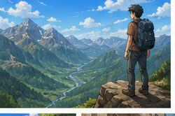
Trong bài:

**Let me introduce you to some famous places.**

— Để tôi giới thiệu cho bạn một số địa điểm nổi tiếng.

### Cấu trúc

`introduce someone to something/someone`

---

## 4.6. **spot** /spɒt/

**Nghĩa:** địa điểm, chỗ


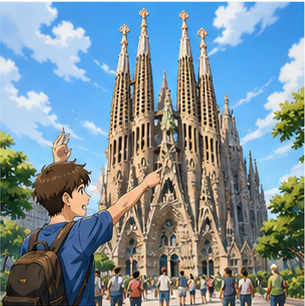
**Ví dụ:**

* **This is a popular tourist spot.**
  — Đây là một điểm du lịch nổi tiếng.

* **Are there any beauty spots around here?**
  — Có địa điểm đẹp nào quanh đây không?

---

## 4.7. **beauty spot**

**Nghĩa:** địa điểm có cảnh đẹp, thắng cảnh


Trong bài:

**Are there any beauty spots around here?**

— Có thắng cảnh nào quanh đây không?

---

## 4.8. **landscape** /ˈlænd.skeɪp/

**Nghĩa:** cảnh quan, phong cảnh


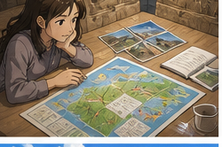
**Ví dụ:**

* **The mountain landscape is beautiful.**
  — Cảnh quan núi rất đẹp.

* **Are there any nice landscapes around here?**
  — Có cảnh quan đẹp nào quanh đây không?

---

## 4.9. **scenery** /ˈsiː.nər.i/

**Nghĩa:** phong cảnh

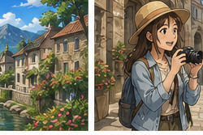

Trong bài:

**The scenery is splendid.**

— Phong cảnh rất tuyệt đẹp.

### Chú ý

**scenery** thường là danh từ không đếm được.

✅ **beautiful scenery**

Không dùng:

❌ **a scenery**

---

## 4.10. **splendid** /ˈsplen.dɪd/

**Nghĩa:** tuyệt vời, tráng lệ


**Ví dụ:**

* **The scenery is splendid.**
  — Phong cảnh thật tuyệt đẹp.

* **We had a splendid time.**
  — Chúng tôi đã có khoảng thời gian tuyệt vời.

---

## 4.11. **route** /ruːt/ hoặc /raʊt/

**Nghĩa:** tuyến đường, lộ trình

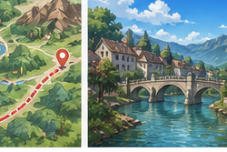

**Ví dụ:**

* **What's the best route to the museum?**
  — Tuyến đường tốt nhất đến bảo tàng là gì?

* **Could you tell me the best sightseeing route to take?**
  — Bạn có thể chỉ cho tôi tuyến tham quan tốt nhất không?

---

## 4.12. **valid** /ˈvæl.ɪd/

**Nghĩa:** còn hiệu lực, hợp lệ


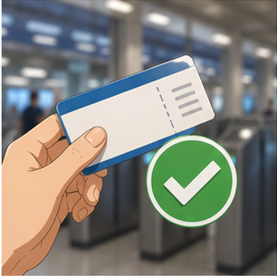
Trong bài:

**Is it valid for the two full weeks?**

— Nó có hiệu lực trong trọn hai tuần không?

Ví dụ:

* **Is this ticket valid for one day?**
* **The pass is valid until Friday.**

---

## 4.13. **travel insurance**

**Nghĩa:** bảo hiểm du lịch


Trong bài:

**Is our travel insurance all right?**

— Bảo hiểm du lịch của chúng ta có ổn không?

Cách hỏi rõ hơn:

**Is our travel insurance valid?**

---

## 4.14. **fare** /feər/

**Nghĩa:** giá vé, cước phí


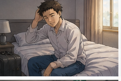
**Ví dụ:**

* **How much is the fare?**
  — Giá vé là bao nhiêu?

* **The bus fare is $3.**
  — Giá vé xe buýt là 3 đô.

### Không nhầm

**fare** = giá vé

**fair** = công bằng / hội chợ

---

## 4.15. **fee** /fiː/

**Nghĩa:** phí


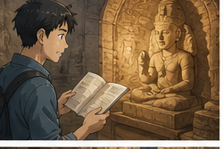
Trong bài:

**How much is the guide fee per day?**

— Phí hướng dẫn viên mỗi ngày là bao nhiêu?

Ví dụ:

* **What's the entrance fee?**
  — Phí vào cửa là bao nhiêu?

* **There is no extra fee.**
  — Không có phí bổ sung.

---

## 4.16. **tour guide**

**Nghĩa:** hướng dẫn viên du lịch


**Ví dụ:**

* **Let me act as your tour guide.**
  — Để tôi làm hướng dẫn viên cho bạn.

* **Our tour guide speaks English.**
  — Hướng dẫn viên của chúng tôi nói tiếng Anh.

---

## 4.17. **take a picture**

**Nghĩa:** chụp ảnh

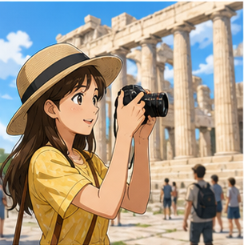

Trong bài:

**Can I take a picture here?**

— Tôi có thể chụp ảnh ở đây không?

Cách khác:

**Can I take photos here?**

---

## 4.18. **toilet** /ˈtɔɪ.lət/

**Nghĩa:** nhà vệ sinh


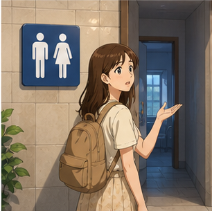
Trong bài:

**Is there a toilet around here?**

— Có nhà vệ sinh nào gần đây không?

Cách khác:

* **Where is the toilet?**
* **Where is the restroom?** — phổ biến ở Mỹ

---

## 4.19. **exit** /ˈek.sɪt/

**Nghĩa:** lối ra

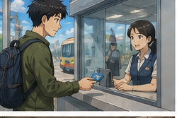

Trong bài:

**Excuse me, where is the nearest exit?**

— Xin lỗi, lối ra gần nhất ở đâu?

Đối nghĩa:

**entrance** = lối vào

---

## 4.20. **nearest** /ˈnɪə.rɪst/

**Nghĩa:** gần nhất


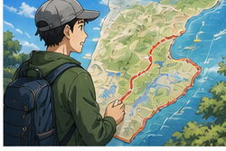
**Ví dụ:**

* **Where is the nearest exit?**
* **Where is the nearest toilet?**
* **Where is the nearest bus stop?**

---

## 4.21. **famous for**

**Nghĩa:** nổi tiếng vì


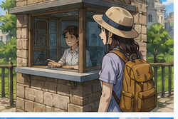
Trong bài:

**Hanoi is famous for Hoan Kiem Lake.**

— Hà Nội nổi tiếng với Hồ Hoàn Kiếm.

### Cấu trúc

`place/person + be famous for + noun`

Ví dụ:

**Hoi An is famous for its ancient town.**

---

## 4.22. **enjoy** /ɪnˈdʒɔɪ/

**Nghĩa:** tận hưởng, thích


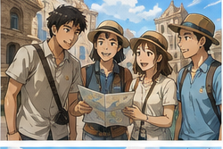
Trong bài:

**We've enjoyed it very much.**

— Chúng tôi đã rất thích chuyến tham quan.

Ví dụ:

* **I enjoyed the tour.**
* **Did you enjoy the trip?**

---

## 4.23. **history** /ˈhɪs.tər.i/

**Nghĩa:** lịch sử


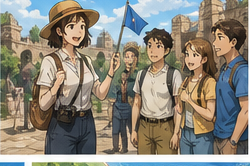
Trong bài:

**Hanoi is like something from a history textbook.**

— Hà Nội giống như một điều gì đó bước ra từ sách giáo khoa lịch sử.

---

## 4.24. **plan** /plæn/

**Nghĩa:** kế hoạch


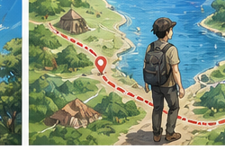
Trong bài:

**What's the plan for today?**

— Kế hoạch hôm nay là gì?

Ví dụ:

**Our plan is to visit three museums.**

---

## 4.25. **time difference**

**Nghĩa:** chênh lệch múi giờ


Trong bài:

**I haven't completely gotten over the time difference yet.**

— Tôi vẫn chưa hoàn toàn thích nghi với chênh lệch múi giờ.

---

## 4.26. **get over**

**Nghĩa trong bài:** vượt qua, thích nghi sau một trạng thái khó chịu


Ví dụ:

**I haven't gotten over the time difference yet.**

— Tôi vẫn chưa hết mệt vì lệch múi giờ.

---

# 5. Bảng tổng hợp từ vựng

| Từ / cụm từ          | IPA             | Nghĩa tiếng Việt     | Ví dụ ngắn                   |
| -------------------- | --------------- | -------------------- | ---------------------------- |
| **sightseeing**      | /ˈsaɪtˌsiː.ɪŋ/  | tham quan            | go sightseeing               |
| **impression**       | /ɪmˈpreʃ.ən/    | ấn tượng             | first impression             |
| **knowledge**        | /ˈnɒl.ɪdʒ/      | kiến thức            | gain knowledge               |
| **guide**            | /ɡaɪd/          | hướng dẫn viên       | tour guide                   |
| **introduce**        | /ˌɪn.trəˈdjuːs/ | giới thiệu           | introduce a place            |
| **spot**             | /spɒt/          | địa điểm             | tourist spot                 |
| **beauty spot**      | —               | thắng cảnh           | a beauty spot                |
| **landscape**        | /ˈlænd.skeɪp/   | cảnh quan            | beautiful landscape          |
| **scenery**          | /ˈsiː.nər.i/    | phong cảnh           | splendid scenery             |
| **splendid**         | /ˈsplen.dɪd/    | tuyệt đẹp            | splendid view                |
| **route**            | /ruːt/          | tuyến đường          | sightseeing route            |
| **valid**            | /ˈvæl.ɪd/       | có hiệu lực          | ticket is valid              |
| **travel insurance** | —               | bảo hiểm du lịch     | travel insurance             |
| **fare**             | /feər/          | giá vé               | bus fare                     |
| **fee**              | /fiː/           | phí                  | entrance fee                 |
| **tour guide**       | —               | hướng dẫn viên       | hire a tour guide            |
| **take a picture**   | —               | chụp ảnh             | take a picture here          |
| **toilet**           | /ˈtɔɪ.lət/      | nhà vệ sinh          | nearest toilet               |
| **exit**             | /ˈek.sɪt/       | lối ra               | nearest exit                 |
| **nearest**          | /ˈnɪə.rɪst/     | gần nhất             | nearest station              |
| **famous for**       | —               | nổi tiếng vì         | famous for the lake          |
| **enjoy**            | /ɪnˈdʒɔɪ/       | tận hưởng            | enjoy the tour               |
| **history**          | /ˈhɪs.tər.i/    | lịch sử              | history textbook             |
| **plan**             | /plæn/          | kế hoạch             | plan for today               |
| **time difference**  | —               | chênh lệch múi giờ   | get over the time difference |
| **get over**         | —               | vượt qua, thích nghi | get over jet lag             |

---

# 6. Mẫu câu giao tiếp — Useful Structures

## 6.1. Hỏi tuyến tham quan

### **Could you tell me the best sightseeing route to take?**

— Bạn có thể cho tôi biết tuyến tham quan tốt nhất không?

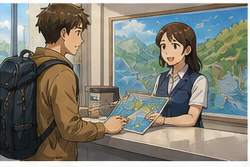

Cách đơn giản hơn:

* **What's the best sightseeing route?**
* **Which route should I take?**
* **Where should I start?**

---

## 6.2. Hỏi về thắng cảnh gần đó

### **Are there any beauty spots around here?**

— Có thắng cảnh nào quanh đây không?

Cách phổ biến hơn trong hội thoại:

* **Are there any nice places to visit around here?**
* **Are there any tourist attractions nearby?**

---

## 6.3. Hỏi về cảnh quan

### **Are there any nice landscapes around here?**

— Quanh đây có cảnh quan đẹp nào không?

Có thể hỏi tự nhiên hơn:

**Are there any places with nice views around here?**

---

## 6.4. Hỏi thời hạn sử dụng

### **Is it valid for the full two weeks?**

— Nó có hiệu lực trong trọn hai tuần không?

Ví dụ:

* **Is this ticket valid all day?**
* **Is this pass valid for three days?**
* **How long is it valid for?**

---

## 6.5. Hỏi về bảo hiểm du lịch

### **Is our travel insurance all right?**

Có thể nói rõ hơn:

### **Is our travel insurance valid?**

Hoặc:

### **Does our travel insurance cover this trip?**

---

## 6.6. Hỏi giá vé

### **How much is the fare?**

— Giá vé là bao nhiêu?

Ví dụ:

* **How much is the bus fare?**
* **How much is the train fare?**

Khi hỏi phí vào cửa, nên dùng:

### **How much is the entrance fee?**

---

## 6.7. Hỏi phí hướng dẫn viên

### **How much is the guide fee per day?**

— Phí hướng dẫn viên mỗi ngày là bao nhiêu?

Cách khác:

**How much does a tour guide cost per day?**

---

## 6.8. Xin phép chụp ảnh

### **Can I take a picture here?**

— Tôi có thể chụp ảnh ở đây không?

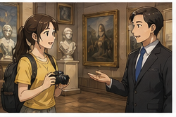

Cách khác:

* **Can I take photos here?**
* **Is photography allowed here?**

Trả lời:

* **Yes, you can.**
* **Sure.**
* **I'm sorry, photography isn't allowed here.**

---

## 6.9. Hỏi nhà vệ sinh

### **Is there a toilet around here?**

— Có nhà vệ sinh nào quanh đây không?

Tự nhiên hơn:

* **Is there a toilet nearby?**
* **Where is the nearest toilet?**
* **Excuse me, where is the restroom?**

---

## 6.10. Hỏi lối ra

### **Excuse me, where is the nearest exit?**

— Xin lỗi, lối ra gần nhất ở đâu?

Cấu trúc:

`Where is the nearest + place?`

Ví dụ:

* **Where is the nearest bus stop?**
* **Where is the nearest station?**
* **Where is the nearest café?**

---

## 6.11. Nói một nơi nổi tiếng vì điều gì

### **Hanoi is famous for Hoan Kiem Lake.**

— Hà Nội nổi tiếng với Hồ Hoàn Kiếm.

### Cấu trúc

`be famous for + noun`

Ví dụ:

* **Hoi An is famous for its ancient town.**
* **Paris is famous for the Eiffel Tower.**
* **Japan is famous for its food and culture.**

---

## 6.12. Miêu tả phong cảnh

### **The scenery is splendid.**

— Phong cảnh tuyệt đẹp.

Cách khác:

* **The scenery is beautiful.**
* **The view is amazing.**
* **The landscape is wonderful.**

---

## 6.13. Nói mình rất thích chuyến tham quan

### **We've enjoyed it very much.**

— Chúng tôi đã rất thích nơi này / chuyến tham quan này.

Cách đơn giản:

**We really enjoyed it.**

---

## 6.14. Hỏi cảm nhận

### **Tell me your impression and feelings after one day in Hanoi.**

Cách tự nhiên hơn:

### **What do you think of Hanoi after your first day here?**

Hoặc:

### **What's your impression of Hanoi?**

---

## 6.15. Nói cảm nhận về thành phố

### **The city is beautiful.**

— Thành phố rất đẹp.

Ví dụ:

* **The city is amazing.**
* **It's very interesting.**
* **I really like the old streets.**

---

## 6.16. Nói về trải nghiệm lịch sử

Trong bài:

### **Hanoi is like something from a history textbook.**

— Hà Nội giống như một điều bước ra từ sách giáo khoa lịch sử.

Cách tự nhiên khác:

**Walking around Hanoi feels like walking through history.**

---

## 6.17. Nói chuyến đi mang lại kiến thức

### **Each place you visit gives you extra knowledge.**

— Mỗi nơi bạn đến đều mang lại thêm kiến thức.

Cách đơn giản:

**You can learn something new at every place you visit.**

---

## 6.18. Đề nghị làm hướng dẫn viên

### **Let me act as your tour guide.**

— Để tôi làm hướng dẫn viên cho bạn.

Sau đó:

### **Let me introduce you to some famous places.**

— Để tôi giới thiệu cho bạn một số địa điểm nổi tiếng.

---

## 6.19. Hỏi về giấc ngủ sau chuyến đi

### **Did you sleep well last night?**

— Tối qua bạn ngủ ngon không?

Trả lời:

* **Yes, I did.**
* **Not really.**
* **I'm still tired from the flight.**

---

## 6.20. Nói chưa quen chênh lệch múi giờ

### **I haven't completely gotten over the time difference yet.**

— Tôi vẫn chưa hoàn toàn quen với chênh lệch múi giờ.

Cách giao tiếp hiện đại rất phổ biến:

**I'm still getting over the jet lag.**

---

## 6.21. Hỏi kế hoạch trong ngày

### **What's the plan for today?**

— Kế hoạch hôm nay là gì?

Ví dụ:

**We're going to visit the old town and the museum.**

---

## 6.22. Đề xuất lịch tham quan

### **I'd love for you to enjoy a full day in Hanoi.**

— Tôi rất muốn bạn tận hưởng một ngày trọn vẹn ở Hà Nội.

Đơn giản hơn:

**I'd like to show you around Hanoi today.**

---

## 6.23. Hỏi ý kiến về một kế hoạch

### **What do you think about that idea?**

— Bạn nghĩ sao về ý tưởng đó?

Phản hồi:

* **Sounds great.**
* **That sounds good.**
* **I'd love to.**
* **That's a good idea.**

---

# 7. Quy trình tham quan một điểm du lịch

| Bước               | Tiếng Anh               | Ví dụ                              |
| ------------------ | ----------------------- | ---------------------------------- |
| Hỏi thông tin      | **ask for information** | Could you help me?                 |
| Chọn tuyến         | **choose a route**      | What's the best route?             |
| Tìm thắng cảnh     | **find attractions**    | Are there any beauty spots nearby? |
| Kiểm tra giá       | **check the fee**       | How much is the entrance fee?      |
| Hỏi hướng dẫn viên | **ask about a guide**   | How much is the guide fee?         |
| Kiểm tra vé        | **check validity**      | How long is this ticket valid?     |
| Hỏi tiện ích       | **find facilities**     | Where is the toilet?               |
| Xin chụp ảnh       | **ask permission**      | Can I take pictures here?          |
| Tìm lối ra         | **find the exit**       | Where is the nearest exit?         |
| Tham quan          | **go sightseeing**      | Let's start the tour.              |
| Nói cảm nhận       | **share impressions**   | The scenery is splendid.           |

### Sơ đồ

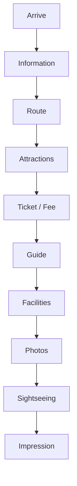

---

# 8. Phân biệt **fare**, **fee**, **ticket price** và **entrance fee**

## **fare**

Thường là giá đi lại bằng phương tiện giao thông.

* bus fare
* train fare
* taxi fare

**How much is the fare?**

---

## **fee**

Khoản phí cho một dịch vụ.

* guide fee
* booking fee
* service fee

**How much is the guide fee?**

---

## **ticket price**

Giá vé nói chung.

**What's the ticket price?**

---

## **entrance fee**

Phí vào cửa.

**How much is the entrance fee?**

---

## Bảng so sánh

| Cụm              | Nghĩa       | Ví dụ               |
| ---------------- | ----------- | ------------------- |
| **fare**         | giá đi lại  | bus fare            |
| **fee**          | phí dịch vụ | guide fee           |
| **ticket price** | giá vé      | museum ticket price |
| **entrance fee** | phí vào cửa | museum entrance fee |

---

# 9. Phân biệt **landscape**, **scenery**, **view** và **spot**

## **landscape**

Cảnh quan của một khu vực rộng.

**The mountain landscape is beautiful.**

---

## **scenery**

Phong cảnh nói chung.

**The scenery here is splendid.**

Không đếm được.

---

## **view**

Cảnh nhìn thấy từ một vị trí cụ thể.

**The view from the tower is amazing.**

---

## **spot**

Một địa điểm cụ thể.

**This is a popular tourist spot.**

---

## Bảng so sánh

| Từ            | Ý chính               | Ví dụ              |
| ------------- | --------------------- | ------------------ |
| **landscape** | cảnh quan khu vực     | mountain landscape |
| **scenery**   | phong cảnh nói chung  | beautiful scenery  |
| **view**      | cảnh nhìn từ một điểm | sea view           |
| **spot**      | một địa điểm          | tourist spot       |

---

# 10. Phát âm trọng tâm

## 10.1. **sightseeing**

/ˈsaɪtˌsiː.ɪŋ/

Trọng âm chính:

**SIGHT**-seeing

---

## 10.2. **impression**

/ɪmˈpreʃ.ən/

Trọng âm:

im-**PRES**-sion

---

## 10.3. **knowledge**

/ˈnɒl.ɪdʒ/

Trọng âm:

**KNOWL**-edge

Chữ **k** đầu không được phát âm.

---

## 10.4. **guide**

/ɡaɪd/

Chú ý:

`guide`

được phát âm gần như:

`gाइड`

không đọc chữ **u** riêng.

---

## 10.5. **landscape**

/ˈlænd.skeɪp/

Trọng âm:

**LAND**-scape

---

## 10.6. **scenery**

/ˈsiː.nər.i/

Trọng âm:

**SCE**-ner-y

---

## 10.7. **splendid**

/ˈsplen.dɪd/

Trọng âm:

**SPLEN**-did

---

## 10.8. **valid**

/ˈvæl.ɪd/

Trọng âm:

**VAL**-id

---

## 10.9. **insurance**

/ɪnˈʃɔː.rəns/

Trọng âm:

in-**SUR**-ance

---

## 10.10. **exit**

/ˈek.sɪt/

Trọng âm:

**EX**-it

---

## 10.11. Nối âm trong hội thoại

### **Could you tell me the best sightseeing route to take?**

Luyện:

`Could-you-tell-me / the-best-sightseeing-route-to-take?`

### **Are there any beauty spots around here?**

Luyện:

`Are-there-any / beauty-spots-around-here?`

### **Can I take a picture here?**

Luyện:

`Can-I-take-a-picture-here?`

### **Where is the nearest exit?**

Luyện:

`Where-is-the-nearest-exit?`

### **The scenery is splendid.**

Luyện:

`The-scenery-is-splendid.`

---

# 11. Hội thoại thực tế — Real-Life Conversation

## Hội thoại 1 — Hỏi tuyến tham quan

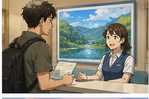

**Tourist:** Excuse me. Could you tell me the best sightseeing route to take?

**Staff:** Sure. You can start at the museum and then walk to the old town.

**Tourist:** Are there any beauty spots around there?

**Staff:** Yes. There's a lake and a beautiful old bridge.

**Tourist:** That sounds good. How long does the route take?

**Staff:** About three hours.

**Tourist:** Great. Can I get a map?

**Staff:** Of course. Here you are.

### Nội dung giao tiếp

```text
Chào / xin phép
   ↓
Hỏi tuyến tham quan
   ↓
Hỏi địa điểm đẹp
   ↓
Hỏi thời lượng
   ↓
Xin bản đồ
   ↓
Bắt đầu tham quan
```

---

## Hội thoại 2 — Hỏi vé và hướng dẫn viên


**Tourist:** How much is the entrance fee?

**Staff:** It's $15 per person.

**Tourist:** Is the ticket valid all day?

**Staff:** Yes. You can leave and come back once.

**Tourist:** Great. Do you have tour guides?

**Staff:** Yes, we do.

**Tourist:** How much is the guide fee?

**Staff:** It's $40 for a two-hour tour.

**Tourist:** That sounds good.

---

## Hội thoại 3 — Hỏi chụp ảnh và nhà vệ sinh


**Visitor:** Excuse me. Can I take pictures here?

**Staff:** Yes, but please don't use flash.

**Visitor:** Sure. Is there a toilet around here?

**Staff:** Yes. Go straight and turn left.

**Visitor:** Thank you. And where is the nearest exit?

**Staff:** It's next to the gift shop.

**Visitor:** Thanks for your help.

**Staff:** You're welcome.

---

## Hội thoại 4 — Nói về Hà Nội


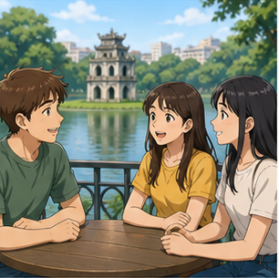
**Guide:** Tell me your impression after one day in Hanoi.

**Visitor:** The city is beautiful.

**Guide:** What did you like most?

**Visitor:** I really liked Hoan Kiem Lake.

**Guide:** Yes. Hanoi is famous for Hoan Kiem Lake and its old streets.

**Visitor:** The scenery is splendid.

**Guide:** I'm glad you like it.

**Visitor:** We've enjoyed it very much.

---

## Hội thoại 5 — Lên kế hoạch cho ngày tham quan


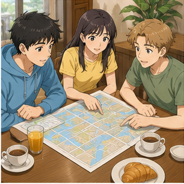
**Guide:** Did you sleep well last night?

**Visitor:** Not really. I'm still getting over the time difference.

**Guide:** I understand. What's the plan for today?

**Visitor:** I'm not sure yet.

**Guide:** I'd like to show you around the city.

**Visitor:** What places are we going to visit?

**Guide:** The old town, a museum and the lake.

**Visitor:** Sounds great.

---

## Hội thoại 6 — Giới thiệu các địa điểm nổi tiếng


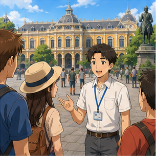
**A:** What do you think of the city so far?

**B:** It's beautiful. I feel like I'm learning something everywhere I go.

**A:** That's right. Each place gives you more knowledge about the city's history.

**B:** I'd love to learn more.

**A:** Let me act as your tour guide today.

**B:** Really? That's great.

**A:** I'll introduce you to some famous places.

**B:** Perfect. Where do we start?

---

# 12. Natural Expressions — Cách nói tự nhiên

| Cụm từ                                        | Nghĩa                              | Khi dùng     |
| --------------------------------------------- | ---------------------------------- | ------------ |
| **Could you tell me ...?**                    | Bạn có thể cho tôi biết...?        | Hỏi lịch sự  |
| **What's the best sightseeing route?**        | Tuyến tham quan tốt nhất là gì?    | Hỏi lộ trình |
| **Where should I start?**                     | Tôi nên bắt đầu ở đâu?             | Hỏi lộ trình |
| **Are there any beauty spots nearby?**        | Có thắng cảnh nào gần đây không?   | Tìm địa điểm |
| **Are there any tourist attractions nearby?** | Có điểm du lịch nào gần đây không? | Tìm địa điểm |
| **How much is the fare?**                     | Giá vé/cước bao nhiêu?             | Giao thông   |
| **How much is the entrance fee?**             | Phí vào cửa bao nhiêu?             | Mua vé       |
| **How much is the guide fee?**                | Phí hướng dẫn viên bao nhiêu?      | Thuê guide   |
| **Is this ticket valid all day?**             | Vé có hiệu lực cả ngày không?      | Kiểm tra vé  |
| **Can I take pictures here?**                 | Tôi có thể chụp ảnh ở đây không?   | Xin phép     |
| **Is photography allowed?**                   | Có được phép chụp ảnh không?       | Xin phép     |
| **Where is the nearest toilet?**              | Nhà vệ sinh gần nhất ở đâu?        | Tiện ích     |
| **Where is the nearest exit?**                | Lối ra gần nhất ở đâu?             | Chỉ đường    |
| **It's famous for ...**                       | Nó nổi tiếng vì...                 | Giới thiệu   |
| **The scenery is splendid.**                  | Phong cảnh tuyệt đẹp.              | Cảm nhận     |
| **The view is amazing.**                      | Cảnh tuyệt vời.                    | Cảm nhận     |
| **We really enjoyed it.**                     | Chúng tôi rất thích.               | Cảm nhận     |
| **What's your impression?**                   | Ấn tượng của bạn thế nào?          | Hỏi cảm nhận |
| **What's the plan for today?**                | Kế hoạch hôm nay là gì?            | Lịch trình   |
| **Let me show you around.**                   | Để tôi đưa bạn đi tham quan.       | Đề nghị      |
| **Sounds great.**                             | Nghe tuyệt đấy.                    | Đồng ý       |
| **That's a good idea.**                       | Ý hay đấy.                         | Đồng ý       |
| **Where do we start?**                        | Chúng ta bắt đầu ở đâu?            | Bắt đầu tour |

---

# 13. Lỗi thường gặp — Common Mistakes

## Lỗi 1: Nhầm **fare** và **fair**

❌ **How much is the fair?**

✅ **How much is the fare?**

**fare** = giá vé/cước phí.

**fair** = công bằng / hội chợ.

---

## Lỗi 2: Dùng **a scenery**

❌ **This is a beautiful scenery.**

✅ **The scenery is beautiful.**

Hoặc:

✅ **This is a beautiful view.**

**scenery** thường không đếm được.

---

## Lỗi 3: Nhầm **landscape** và **view**

**landscape** = cảnh quan rộng.

**view** = cảnh nhìn từ một vị trí.

Ví dụ:

**The mountain landscape is beautiful.**

**The view from my hotel is beautiful.**

---

## Lỗi 4: Nói **famous of**

❌ **Hanoi is famous of Hoan Kiem Lake.**

✅ **Hanoi is famous for Hoan Kiem Lake.**

### Cấu trúc

`be famous for + noun`

---

## Lỗi 5: Dùng **make a picture**

❌ **Can I make a picture here?**

✅ **Can I take a picture here?**

### Cụm đúng

`take a picture`

`take a photo`

---

## Lỗi 6: Quên **is** khi hỏi vị trí

❌ **Where the nearest exit?**

✅ **Where is the nearest exit?**

---

## Lỗi 7: Nói **near toilet**

❌ **Where is the near toilet?**

✅ **Where is the nearest toilet?**

Hoặc:

✅ **Is there a toilet nearby?**

---

## Lỗi 8: Nhầm **fee** và **fare**

Khi nói về hướng dẫn viên:

✅ **guide fee**

Khi nói về giá xe buýt:

✅ **bus fare**

---

## Lỗi 9: Nói **How much the entrance fee is?**

Câu hỏi trực tiếp:

❌ **How much the entrance fee is?**

✅ **How much is the entrance fee?**

Nhưng trong câu gián tiếp:

✅ **Could you tell me how much the entrance fee is?**

---

## Lỗi 10: Nói **I very enjoy it**

❌ **I very enjoy it.**

✅ **I really enjoy it.**

Hoặc ở quá khứ:

✅ **I really enjoyed it.**

---

## Lỗi 11: Nói **I'm enjoy the tour**

❌ **I'm enjoy the tour.**

✅ **I'm enjoying the tour.**

Hoặc:

✅ **I enjoy sightseeing.**

---

## Lỗi 12: Nhầm **guide** và **tour**

**guide** = người hướng dẫn / sự hướng dẫn.

**tour** = chuyến tham quan.

**Our guide took us on a city tour.**

---

## Lỗi 13: Dùng **knowledge** như danh từ đếm được

❌ **I got many knowledges.**

✅ **I gained a lot of knowledge.**

**knowledge** là danh từ không đếm được.

---

## Lỗi 14: Dịch trực tiếp "cảnh đẹp"

Không phải lúc nào cũng cần:

**beautiful landscape**

Trong hội thoại tự nhiên có thể nói:

✅ **a beautiful view**

✅ **beautiful scenery**

✅ **a nice place**

---

## Lỗi 15: Hỏi quá dài

Thay vì:

❌ **Could you please tell me if maybe somewhere near this place there is a toilet that I can use?**

Nói:

✅ **Is there a toilet nearby?**

Câu ngắn giúp giao tiếp rõ và tự nhiên hơn.

---

# 14. Luyện tập có hướng dẫn

## Bài 1 — Nối từ với nghĩa

1. sightseeing
2. landscape
3. scenery
4. guide
5. exit
6. fare
7. fee
8. impression

A. lối ra
B. phong cảnh
C. giá vé
D. hướng dẫn viên
E. ấn tượng
F. tham quan
G. phí
H. cảnh quan

<details>
<summary>Đáp án</summary>

1–F
2–H
3–B
4–D
5–A
6–C
7–G
8–E

</details>

---

## Bài 2 — Điền từ vào chỗ trống

Dùng:

`route` · `scenery` · `exit` · `guide` · `fare`

1. Could you tell me the best sightseeing ______?
2. The ______ is splendid.
3. Where is the nearest ______?
4. How much is the ______?
5. How much is the ______ fee per day?

<details>
<summary>Đáp án</summary>

1. route
2. scenery
3. exit
4. fare
5. guide

</details>

---

## Bài 3 — Chọn **fare** hoặc **fee**

1. bus ______
2. entrance ______
3. train ______
4. guide ______
5. service ______
6. taxi ______

<details>
<summary>Đáp án</summary>

1. fare
2. fee
3. fare
4. fee
5. fee
6. fare

</details>

---

## Bài 4 — Chọn câu đúng

### 1. Bạn muốn hỏi lối ra gần nhất.

* A. Where nearest exit?
* B. Where is nearest exit?
* C. Where is the nearest exit?

**Đáp án:** C

---

### 2. Bạn muốn hỏi có được chụp ảnh không.

* A. Can I take a picture here?
* B. Can I make a picture here?
* C. Can I do a picture here?

**Đáp án:** A

---

### 3. Bạn nói Hà Nội nổi tiếng với Hồ Hoàn Kiếm.

* A. Hanoi is famous of Hoan Kiem Lake.
* B. Hanoi is famous for Hoan Kiem Lake.
* C. Hanoi famous for Hoan Kiem Lake.

**Đáp án:** B

---

### 4. Bạn hỏi phí vào cửa.

* A. How much is the entrance fee?
* B. How many is the entrance fee?
* C. How much the entrance fee?

**Đáp án:** A

---

## Bài 5 — Hoàn thành hội thoại

**Tourist:** Excuse me. Could you tell me the best sightseeing ______?

**Staff:** Sure. Start at the museum.

**Tourist:** Are there any beauty ______ nearby?

**Staff:** Yes. There's a beautiful lake.

**Tourist:** How much is the entrance ______?

**Staff:** It's $10.

**Tourist:** Can I take ______ here?

**Staff:** Yes, you can.

**Tourist:** Where is the nearest ______?

**Staff:** It's beside the café.

<details>
<summary>Đáp án</summary>

1. route
2. spots
3. fee
4. pictures / photos
5. exit

</details>

---

## Bài 6 — Viết câu hoàn chỉnh

### 1.

`Hanoi / famous / Hoan Kiem Lake`

→ ______________________________

### 2.

`scenery / splendid`

→ ______________________________

### 3.

`where / nearest / exit`

→ ______________________________

### 4.

`can / take / picture / here`

→ ______________________________

### 5.

`how much / guide fee / day`

→ ______________________________

<details>
<summary>Đáp án gợi ý</summary>

1. **Hanoi is famous for Hoan Kiem Lake.**
2. **The scenery is splendid.**
3. **Where is the nearest exit?**
4. **Can I take a picture here?**
5. **How much is the guide fee per day?**

</details>

---

# 15. Speaking Challenge — Thử thách nói

## Nhiệm vụ 1 — Đọc mẫu câu

Đọc thành tiếng:

* **Could you tell me the best sightseeing route to take?**
* **Are there any beauty spots around here?**
* **How much is the entrance fee?**
* **Can I take a picture here?**
* **Where is the nearest exit?**
* **The scenery is splendid.**
* **Hanoi is famous for Hoan Kiem Lake.**
* **We've enjoyed it very much.**

---

## Nhiệm vụ 2 — Đóng vai khách du lịch

Bạn vừa đến một điểm tham quan.

Hãy hỏi ít nhất 5 câu:

1. **What's the best sightseeing route?**
2. **How much is the entrance fee?**
3. **Can I take pictures here?**
4. **Where is the nearest toilet?**
5. **Where is the nearest exit?**

---

## Nhiệm vụ 3 — Miêu tả một điểm du lịch trong 45–60 giây

Sử dụng công thức:

```text
Place
   ↓
Location
   ↓
Famous For
   ↓
Scenery
   ↓
Things To Do
   ↓
Your Impression
```

Ví dụ:

> **Hoan Kiem Lake is in the center of Hanoi. It is one of the city's most famous tourist spots. The scenery around the lake is beautiful. Visitors can walk around the lake, take pictures and visit nearby attractions. I really enjoy the atmosphere there.**

---

## Nhiệm vụ 4 — Nói về chuyến tham quan gần đây

Sử dụng:

* nơi đã đi;
* đã đi với ai;
* đã nhìn thấy gì;
* phong cảnh thế nào;
* học được điều gì;
* cảm nhận của bạn.

Ví dụ:

> **I went sightseeing in Hanoi with my friends. We visited Hoan Kiem Lake and the old streets. The scenery was beautiful, and we took many pictures. I learned more about the history of the city. We really enjoyed the trip.**

---

## Nhiệm vụ 5 — Ghi âm và tự sửa lỗi

Ghi âm **45–60 giây**.

Sau đó nghe lại và tìm:

* 1 lỗi phát âm;
* 1 lỗi dùng **fare / fee**;
* 1 lỗi ngữ pháp;
* 1 chỗ có thể dùng câu ngắn và tự nhiên hơn.

---

# 16. Practice Mission — Nhiệm vụ thực tế

Trong hôm nay, hãy tạo một hội thoại ít nhất **8 lượt** theo công thức:

> **Information → Route → Attraction → Ticket → Photos → Facilities → Impression**

Sử dụng ít nhất:

* 5 từ vựng mới;
* 3 mẫu câu của bài;
* 1 câu với **Could you tell me ...?**
* 1 câu hỏi về **fee / fare**;
* 1 câu xin phép chụp ảnh;
* 1 câu nói cảm nhận về phong cảnh.

### Ví dụ

**Tourist:** Excuse me. Could you tell me the best sightseeing route?

**Staff:** Sure. Start at the museum and then walk to the lake.

**Tourist:** How much is the entrance fee?

**Staff:** It's $8.

**Tourist:** Can I take pictures inside?

**Staff:** Yes, but please don't use flash.

**Tourist:** Great. The scenery around here is beautiful.

**Staff:** I'm glad you like it.

---

# 17. Tự đánh giá cuối bài

Đánh dấu khi bạn có thể thực hiện mà không nhìn bài:

* [ ] Tôi hiểu **sightseeing**.
* [ ] Tôi hiểu **tour guide**.
* [ ] Tôi hiểu **beauty spot**.
* [ ] Tôi phân biệt **landscape**, **scenery** và **view**.
* [ ] Tôi có thể hỏi tuyến tham quan.
* [ ] Tôi có thể hỏi điểm du lịch gần đó.
* [ ] Tôi hiểu **valid**.
* [ ] Tôi có thể hỏi thời hạn của vé.
* [ ] Tôi hiểu **travel insurance**.
* [ ] Tôi phân biệt **fare** và **fee**.
* [ ] Tôi có thể hỏi giá vé.
* [ ] Tôi có thể hỏi phí hướng dẫn viên.
* [ ] Tôi có thể xin phép chụp ảnh.
* [ ] Tôi có thể hỏi nhà vệ sinh.
* [ ] Tôi có thể hỏi lối ra gần nhất.
* [ ] Tôi biết cấu trúc **be famous for**.
* [ ] Tôi có thể miêu tả phong cảnh.
* [ ] Tôi có thể hỏi cảm nhận của người khác.
* [ ] Tôi có thể nói kế hoạch tham quan trong ngày.
* [ ] Tôi có thể duy trì hội thoại du lịch 6–8 lượt.

---

# 18. Câu hỏi mở cuối bài

**Imagine you are visiting a famous tourist attraction in a city you have never been to before. How would you ask about the best sightseeing route, the entrance fee, places to take photos, nearby facilities and then describe your impression after the visit?**

*Hãy tưởng tượng bạn đang đến một điểm du lịch nổi tiếng trong một thành phố mà bạn chưa từng tới. Bạn sẽ hỏi về tuyến tham quan tốt nhất, phí vào cửa, nơi chụp ảnh, các tiện ích gần đó và sau đó miêu tả cảm nhận của mình như thế nào?*

---

# 19. Ghi chú dành cho giảng viên

* **Module:** 04 — Around Town / Giao tiếp trong thành phố
* **Chủ điểm:** Sightseeing / Khám phá một điểm du lịch
* **Thời lượng video:** 8–12 phút
* **Luyện nói:** 5–10 phút
* **Trình độ:** A1–A2

### Trọng tâm từ vựng

* sightseeing
* impression
* knowledge
* guide
* tour guide
* introduce
* spot
* beauty spot
* landscape
* scenery
* splendid
* route
* valid
* travel insurance
* fare
* fee
* take a picture
* toilet
* exit
* nearest
* famous for
* enjoy
* history
* plan
* time difference
* get over

### Trọng tâm cấu trúc

* **Could you tell me the best sightseeing route to take?**
* **Are there any beauty spots around here?**
* **Are there any nice landscapes around here?**
* **Is it valid for the full two weeks?**
* **Is our travel insurance valid?**
* **How much is the fare?**
* **How much is the guide fee per day?**
* **Can I take a picture here?**
* **Is there a toilet around here?**
* **Where is the nearest exit?**
* **Hanoi is famous for Hoan Kiem Lake.**
* **The scenery is splendid.**
* **We've enjoyed it very much.**
* **What's your impression of Hanoi?**
* **Let me act as your tour guide.**
* **Let me introduce you to some famous places.**
* **What's the plan for today?**
* **What do you think about that idea?**
* **Sounds great.**

### Trọng tâm phát âm

* sightseeing
* impression
* knowledge
* guide
* introduce
* landscape
* scenery
* splendid
* route
* valid
* insurance
* fare
* exit
* famous

### Lưu ý ngôn ngữ

* Dạng chưa chuẩn:

  **How much is the fair?**

  Nội dung đúng theo ngữ cảnh là:

  **How much is the fare?**

* Phân biệt:

  **fare** = giá vé/cước giao thông.

  **fee** = phí dịch vụ hoặc phí vào cửa.

* **scenery** là danh từ không đếm được.

  Dùng:

  **beautiful scenery**

  Không dùng:

  **a beautiful scenery**

* Với một cảnh nhìn từ vị trí cụ thể, ưu tiên:

  **view**

  **The view is amazing.**

* Dùng:

  **be famous for**

  **Hanoi is famous for Hoan Kiem Lake.**

* Dạng chưa chuẩn **Juan Kiem Lake**; trong bài chuẩn hóa thành:

  **Hoan Kiem Lake**

* Dùng:

  **take a picture / take a photo**

  thay vì:

  **make a picture**

* **beauty spot** đúng và xuất hiện trong bài, tuy nhiên trong giao tiếp hiện đại, người học A1–A2 cũng nên biết:

  **tourist attraction**

  **nice place to visit**

* Câu:

  **Tell me your impression and feeling after one day in Hanoi.**

  có thể diễn đạt tự nhiên hơn bằng:

  **What's your impression of Hanoi after your first day here?**

* Câu:

  **Each place you go gives you extra knowledge.**

  có thể đơn giản hóa thành:

  **You can learn something new at every place you visit.**

* Câu:

  **I haven't completely gotten over the time difference yet.**

  đúng về ý nghĩa; trong ngữ cảnh du lịch hiện đại, có thể dạy thêm:

  **I'm still getting over the jet lag.**

* Với A1–A2, nên ưu tiên câu ngắn:

  * **Where should I start?**
  * **How much is the ticket?**
  * **Can I take photos here?**
  * **Where is the toilet?**
  * **Where is the exit?**
  * **The view is beautiful.**
  * **I really enjoyed it.**

---

### Hoạt động gợi ý — Plan a Sightseeing Day

Chia lớp thành cặp.

**Người A:** khách du lịch.

**Người B:** nhân viên trung tâm thông tin du lịch.

Người B có bảng:

| Attraction | Entrance Fee | Time Needed | Photos       | Highlight    |
| ---------- | -----------: | ----------: | ------------ | ------------ |
| Museum     |          $10 |     2 hours | Yes          | History      |
| Old Temple |           $5 |      1 hour | Outside only | Architecture |
| City Tower |          $12 |      1 hour | Yes          | City view    |
| Lake       |         Free |   1–2 hours | Yes          | Scenery      |

Người A phải hỏi:

> **Which place should I visit first?**

> **How much is the entrance fee?**

> **How long does it take?**

> **Can I take pictures there?**

> **What is it famous for?**

Sau đó tạo một lịch tham quan trong ngày.

---

### Role-play mẫu — Tourist Information Desk

**Người A nhận:**

> Bạn vừa đến một thành phố mới và muốn tham quan trong 4 giờ.

Người A phải sử dụng:

* **Could you tell me the best sightseeing route?**
* **Are there any tourist attractions nearby?**
* **How much is the entrance fee?**
* **Can I take pictures there?**

**Người B phải sử dụng:**

* **Sure.**
* **You can start at ...**
* **It's famous for ...**
* **The entrance fee is ...**
* **It takes about ...**

---

### Role-play mẫu — Bên trong bảo tàng

**Người A nhận:**

> Bạn đang ở bảo tàng và cần tìm nhà vệ sinh, lối ra và muốn chụp ảnh.

Người A phải hỏi:

* **Can I take pictures here?**
* **Where is the nearest toilet?**
* **Where is the nearest exit?**

Người B phải trả lời bằng chỉ đường ngắn:

* **Go straight.**
* **Turn left.**
* **It's next to the café.**
* **It's on your right.**

---

### Role-play mẫu — Thuê hướng dẫn viên

**Người A nhận:**

> Bạn muốn thuê hướng dẫn viên trong một ngày.

Người A phải hỏi:

* **Do you have a tour guide available?**
* **How much is the guide fee per day?**
* **What places will we visit?**
* **How long is the tour?**

Người B phải cung cấp:

* giá;
* thời gian;
* ba điểm tham quan;
* nơi bắt đầu.

---

### Role-play mẫu — Chia sẻ cảm nhận sau chuyến đi

**Người A hỏi:**

* **What's your impression of the city?**
* **Which place did you like best?**
* **What did you learn?**
* **Would you like to come back?**

**Người B phải sử dụng:**

* **The city is beautiful.**
* **The scenery is splendid.**
* **I really enjoyed ...**
* **I learned a lot about ...**
* **I'd love to come back.**

Kết thúc bài bằng câu hỏi:

> **If you had one full day to show a foreign friend around your city, where would you take them and why?**
