# LESSON 21 — TÌM VÀ MƯỢN TÀI LIỆU

> **Module 04 — Around Town / Giao tiếp trong thành phố**
> **Chủ đề:** The Library — Tìm sách, mượn sách và làm thẻ thư viện
> **Trình độ gợi ý:** A1–A2
> **Thời lượng:** 8–12 phút học bài + 5–10 phút luyện nói

---

## 1. Tình huống thực tế — Real-Life Situation

Khi đến thư viện, bạn có thể cần:

* hỏi cách tìm một cuốn sách;
* tìm sách theo **title** hoặc **author**;
* tra cứu sách trong **catalog**;
* hỏi sách nằm ở kệ nào;
* hỏi một cuốn sách có sẵn hay không;
* mượn một hoặc nhiều cuốn sách;
* hỏi được mượn tối đa bao nhiêu cuốn;
* hỏi ngày phải trả sách;
* nói rằng mình chưa đọc xong;
* xử lý trường hợp sách quá hạn;
* hỏi liệu có phải trả tiền phạt không;
* nhờ thủ thư giới thiệu một cuốn sách khác;
* tìm sách theo chủ đề như geography, computers, music hoặc natural science;
* đăng ký thẻ thư viện;
* cung cấp giấy tờ tùy thân;
* điền đơn đăng ký.

Người học cần biết cách sử dụng những câu ngắn và tự nhiên như:

* **Can I borrow these books?**
* **Could you tell me how to find the book?**
* **How many books can I borrow at a time?**
* **When is the book due?**
* **I haven't finished the book yet.**
* **The book is overdue.**
* **Will I have to pay a fine?**
* **I couldn't find this book on the shelves.**
* **Where can I apply for a library card?**
* **Could you recommend another book?**

---

## 2. Mục tiêu bài học — Learning Outcomes

Sau bài học, người học có thể:

1. Hiểu và sử dụng từ **borrow**.
2. Hiểu cách dùng **library**, **library card** và **catalog**.
3. Tìm sách theo **title** hoặc **author**.
4. Hỏi một cuốn sách nằm ở đâu.
5. Hỏi một cuốn sách có sẵn hay không.
6. Hỏi mượn một hoặc nhiều cuốn sách.
7. Hỏi số lượng sách tối đa có thể mượn.
8. Hỏi ngày phải trả sách.
9. Hiểu sự khác nhau giữa **due**, **due date** và **overdue**.
10. Nói rằng mình chưa đọc xong sách.
11. Hỏi về tiền phạt khi trả sách muộn.
12. Nhờ thủ thư giới thiệu sách.
13. Hỏi tìm sách theo chủ đề.
14. Đăng ký thẻ thư viện.
15. Hiểu yêu cầu cung cấp ID và điền form.
16. Duy trì một cuộc hội thoại tại thư viện ít nhất 6–8 lượt.

---

## 3. Sơ đồ giao tiếp

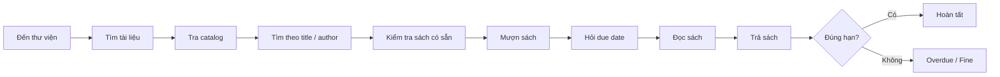

### Mẫu giao tiếp đơn giản

**You:** Excuse me. Could you help me find this book?

**Librarian:** Sure. What's the title?

**You:** *The Great Gatsby.*

**Librarian:** Let me check the catalog.

**You:** Is it available?

**Librarian:** Yes. It's on the second floor.

**You:** Great. Can I borrow it?

**Librarian:** Of course.

---

# 4. Từ vựng trọng tâm — Core Vocabulary

## 4.1. **library** /ˈlaɪ.brər.i/

**Nghĩa:** thư viện


**Ví dụ:**

* **I'm going to the library.**
  — Tôi đang đi đến thư viện.

* **This library has thousands of books.**
  — Thư viện này có hàng nghìn cuốn sách.

---

## 4.2. **borrow** /ˈbɒr.əʊ/

**Nghĩa:** mượn


**Ví dụ trong bài:**

**Can I borrow these books?**

— Tôi có thể mượn những cuốn sách này không?

### Cấu trúc

`borrow + something`

Ví dụ:

* **borrow a book**
* **borrow three books**
* **borrow a dictionary**

### Chú ý

**borrow** = mượn từ người khác.

**lend** = cho người khác mượn.

```text
I borrow a book from the library.
The library lends the book to me.
```

---

## 4.3. **book** /bʊk/

**Nghĩa:** sách


**Ví dụ:**

* **Can I borrow this book?**
* **I'm looking for a book on computers.**

---

## 4.4. **shelf / shelves**

**shelf** /ʃelf/ = kệ


**shelves** /ʃelvz/ = các kệ

Trong bài:

**I couldn't find this book on the shelves.**

— Tôi không thể tìm thấy cuốn sách này trên các kệ.

### Cụm phổ biến

* **bookshelf** — giá sách
* **on the shelf** — trên kệ
* **on the shelves** — trên các kệ

---

## 4.5. **catalog** /ˈkæt.əl.ɒɡ/

**Nghĩa:** danh mục, hệ thống tra cứu tài liệu


**Ví dụ:**

**Let me check the catalog.**

— Để tôi kiểm tra danh mục.

Có thể tìm sách bằng:

* title;
* author;
* subject;
* keyword.

---

## 4.6. **title** /ˈtaɪ.təl/

**Nghĩa:** tên sách, tiêu đề


Trong hội thoại:

**What's the title?**

— Tên cuốn sách là gì?

Ví dụ:

**The title is *The Great Gatsby*.**

---

## 4.7. **author** /ˈɔː.θər/

**Nghĩa:** tác giả


Ví dụ:

**Who's the author?**

— Tác giả là ai?

**You can search by title or author.**

— Bạn có thể tìm theo tên sách hoặc tác giả.

---

## 4.8. **library card**

**Nghĩa:** thẻ thư viện


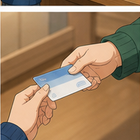
Trong bài:

**Where can I apply for a library card?**

— Tôi có thể đăng ký thẻ thư viện ở đâu?

Ví dụ:

**Do I need a library card to borrow books?**

— Tôi có cần thẻ thư viện để mượn sách không?

---

## 4.9. **apply for**

**Nghĩa:** đăng ký, nộp đơn xin


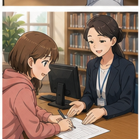
### Cấu trúc

`apply for + noun`

Ví dụ:

* **apply for a library card**
* **apply for membership**

Trong bài:

**Could I apply for a library card here?**

— Tôi có thể đăng ký thẻ thư viện ở đây không?

---

## 4.10. **due** /djuː/

**Nghĩa trong thư viện:** đến hạn phải trả


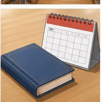
Trong bài:

**When is the book due?**

— Khi nào cuốn sách phải được trả?

Ví dụ:

**The book is due next Friday.**

— Cuốn sách phải được trả vào thứ Sáu tuần sau.

---

## 4.11. **due date**

**Nghĩa:** ngày đến hạn, ngày phải trả


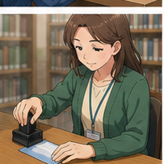
Ví dụ:

**What's the due date?**

— Ngày phải trả sách là ngày nào?

**The due date is August 20.**

---

## 4.12. **overdue** /ˌəʊ.vəˈdjuː/

**Nghĩa:** quá hạn


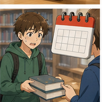
Trong bài:

**The book is overdue.**

— Cuốn sách đã quá hạn.

Ví dụ:

**This book is three days overdue.**

— Cuốn sách này đã quá hạn ba ngày.

---

## 4.13. **fine** /faɪn/

**Nghĩa trong ngữ cảnh này:** tiền phạt


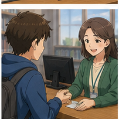
Ví dụ:

**Will I have to pay a fine?**

— Tôi có phải trả tiền phạt không?

**There's a fine for overdue books.**

— Có tiền phạt đối với sách trả quá hạn.

### Chú ý

**fine** còn có nghĩa là:

> ổn, tốt

Ví dụ:

**I'm fine.**

Nhưng trong thư viện:

> **a fine** = một khoản tiền phạt.

---

## 4.14. **recommend** /ˌrek.əˈmend/

**Nghĩa:** giới thiệu, đề xuất


Trong bài:

**Could you recommend another one?**

— Bạn có thể giới thiệu cho tôi một cuốn khác không?

### Cấu trúc

`recommend + noun`

**Could you recommend a novel?**

Hoặc:

`recommend something to someone`

**She recommended this book to me.**

---

## 4.15. **available** /əˈveɪ.lə.bəl/

**Nghĩa:** có sẵn


Ví dụ:

**Is *Gone with the Wind* available?**

— *Cuốn theo chiều gió* có sẵn không?

**That book isn't available at the moment.**

— Cuốn đó hiện tại không có sẵn.

---

## 4.16. **novel** /ˈnɒv.əl/

**Nghĩa:** tiểu thuyết


Trong hội thoại:

**I'd like to borrow a novel, please.**

— Tôi muốn mượn một cuốn tiểu thuyết.

---

## 4.17. **fairy tale**

**Nghĩa:** truyện cổ tích


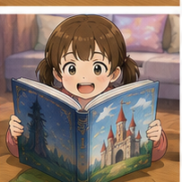
Ví dụ:

**I'm looking for a fairy tale for children.**

— Tôi đang tìm một truyện cổ tích cho trẻ em.

---

## 4.18. **geography** /dʒiˈɒɡ.rə.fi/

**Nghĩa:** địa lý


Trong bài:

**I'd like to find a book on geography.**

— Tôi muốn tìm một cuốn sách về địa lý.

---

## 4.19. **natural science**

**Nghĩa:** khoa học tự nhiên


Ví dụ:

**Could I borrow some books on natural science?**

— Tôi có thể mượn một số sách về khoa học tự nhiên không?

---

## 4.20. **ID**

**Nghĩa:** giấy tờ tùy thân


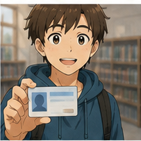
Trong hội thoại làm thẻ:

**Could I see some ID?**

— Tôi có thể xem giấy tờ tùy thân của bạn không?

---

## 4.21. **form** /fɔːm/

**Nghĩa:** mẫu đơn


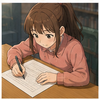
Trong bài:

**Please fill out this form.**

— Vui lòng điền vào mẫu đơn này.

### Cụm từ

**fill out a form** = điền đơn

---

# 5. Bảng tổng hợp từ vựng

| English             | IPA            | Nghĩa tiếng Việt  | Example            |
| ------------------- | -------------- | ----------------- | ------------------ |
| **library**         | /ˈlaɪ.brər.i/  | thư viện          | go to the library  |
| **borrow**          | /ˈbɒr.əʊ/      | mượn              | borrow a book      |
| **book**            | /bʊk/          | sách              | read a book        |
| **shelf**           | /ʃelf/         | kệ                | on the shelf       |
| **shelves**         | /ʃelvz/        | các kệ            | on the shelves     |
| **catalog**         | /ˈkæt.əl.ɒɡ/   | danh mục          | check the catalog  |
| **title**           | /ˈtaɪ.təl/     | tên sách          | book title         |
| **author**          | /ˈɔː.θər/      | tác giả           | search by author   |
| **library card**    | —              | thẻ thư viện      | get a library card |
| **apply for**       | —              | đăng ký           | apply for a card   |
| **due**             | /djuː/         | đến hạn           | When is it due?    |
| **due date**        | —              | ngày phải trả     | check the due date |
| **overdue**         | /ˌəʊ.vəˈdjuː/  | quá hạn           | overdue book       |
| **fine**            | /faɪn/         | tiền phạt         | pay a fine         |
| **recommend**       | /ˌrek.əˈmend/  | giới thiệu        | recommend a book   |
| **available**       | /əˈveɪ.lə.bəl/ | có sẵn            | Is it available?   |
| **novel**           | /ˈnɒv.əl/      | tiểu thuyết       | borrow a novel     |
| **fairy tale**      | —              | truyện cổ tích    | read a fairy tale  |
| **geography**       | /dʒiˈɒɡ.rə.fi/ | địa lý            | geography book     |
| **natural science** | —              | khoa học tự nhiên | science books      |
| **ID**              | —              | giấy tờ tùy thân  | show some ID       |
| **form**            | /fɔːm/         | mẫu đơn           | fill out a form    |

---

# 6. Mẫu câu giao tiếp — Useful Patterns

## 6.1. Hỏi mượn sách


### **Can I borrow these books?**

— Tôi có thể mượn những cuốn sách này không?

Cách lịch sự hơn:

**Could I borrow these books?**

Ví dụ:

* **Can I borrow this book?**
* **Could I borrow three books?**
* **Can I borrow this dictionary?**

---

## 6.2. Nhờ giúp tìm sách


### **Could you tell me how to find the book?**

— Bạn có thể chỉ cho tôi cách tìm cuốn sách này không?

Tự nhiên hơn trong tình huống cụ thể:

* **Could you help me find this book?**
* **Can you help me find this book?**
* **Do you know where I can find this book?**

---

## 6.3. Hỏi số sách được mượn


### **How many books can I borrow at a time?**

— Tôi có thể mượn bao nhiêu cuốn sách một lần?

### Cấu trúc

`How many + plural noun + can I + verb?`

Ví dụ:

**How many books can I take home?**

---

## 6.4. Hỏi ngày phải trả sách


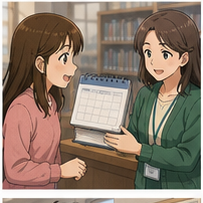
### **When is the book due?**

— Khi nào cuốn sách phải được trả?

Cách khác:

* **When do I need to return this book?**
* **What's the due date?**
* **When is this book due back?**

---

## 6.5. Nói chưa đọc xong


### **I haven't finished the book yet.**

— Tôi vẫn chưa đọc xong cuốn sách.

### Cấu trúc

`haven't + past participle + yet`

Ví dụ:

* **I haven't finished it yet.**
* **I haven't read the last chapter yet.**

---

## 6.6. Nói sách đã quá hạn


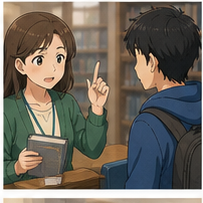
### **The book is overdue.**

— Cuốn sách đã quá hạn.

Ví dụ:

**I'm sorry. This book is overdue.**

---

## 6.7. Hỏi về tiền phạt


Trong bài có câu:

**Am I to be fined?**

Câu này có thể hiểu được nhưng khá trang trọng.

Trong giao tiếp hiện đại, tự nhiên hơn:

### **Will I have to pay a fine?**

— Tôi có phải trả tiền phạt không?

Hoặc:

**Is there a fine for returning it late?**

— Có tiền phạt nếu trả sách muộn không?

---

## 6.8. Nói không tìm thấy sách trên kệ


### **I couldn't find this book on the shelves.**

— Tôi không tìm thấy cuốn sách này trên các kệ.

Có thể nói:

**I checked the shelves, but I couldn't find it.**

---

## 6.9. Hỏi làm thẻ thư viện


### **Excuse me. Where can I apply for a library card?**

— Xin lỗi, tôi có thể đăng ký thẻ thư viện ở đâu?

Cách khác:

**Could I apply for a library card here?**

---

## 6.10. Tìm sách theo chủ đề


### **I'd like to find a book on geography.**

— Tôi muốn tìm một cuốn sách về địa lý.

Cấu trúc:

`a book on + subject`

Ví dụ:

* **a book on computers**
* **a book on geography**
* **a book on music**
* **a book on natural science**

---

## 6.11. Nhờ giới thiệu sách


### **Could you recommend another one?**

— Bạn có thể giới thiệu một cuốn khác không?

Ví dụ:

**Could you recommend a good novel?**

**Can you recommend something similar?**

---

## 6.12. Hỏi sách có sẵn không


### **Is *Gone with the Wind* available?**

— *Gone with the Wind* có sẵn không?

Trả lời:

**I'm sorry. That book isn't available at the moment.**

Hoặc:

**Yes. We have one copy available.**

---

## 6.13. Hỏi tên sách


### **What's the title?**

— Tên sách là gì?

Trả lời:

**It's *Gone with the Wind*.**

---

## 6.14. Yêu cầu giấy tờ tùy thân


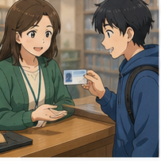
### **Could I see some ID?**

— Tôi có thể xem giấy tờ tùy thân của bạn không?

Trả lời:

**Sure. Here you are.**

---

## 6.15. Yêu cầu điền đơn


### **Please fill out this form.**

— Vui lòng điền vào mẫu đơn này.

Trả lời:

**Okay. No problem.**

---

# 7. Quy trình tìm và mượn sách

| Bước                | Tiếng Anh                  | Ví dụ                      |
| ------------------- | -------------------------- | -------------------------- |
| Xác định sách       | **choose a book**          | I'm looking for a novel.   |
| Tra cứu             | **check the catalog**      | Let me check the catalog.  |
| Tìm theo tên        | **search by title**        | What's the title?          |
| Tìm theo tác giả    | **search by author**       | Who's the author?          |
| Tìm trên kệ         | **find the shelf**         | Which shelf is it on?      |
| Kiểm tra tình trạng | **check availability**     | Is it available?           |
| Mượn sách           | **borrow the book**        | Can I borrow this?         |
| Kiểm tra ngày trả   | **check the due date**     | When is it due?            |
| Trả sách            | **return the book**        | I'd like to return this.   |
| Xử lý quá hạn       | **handle an overdue book** | Will I have to pay a fine? |

### Sơ đồ

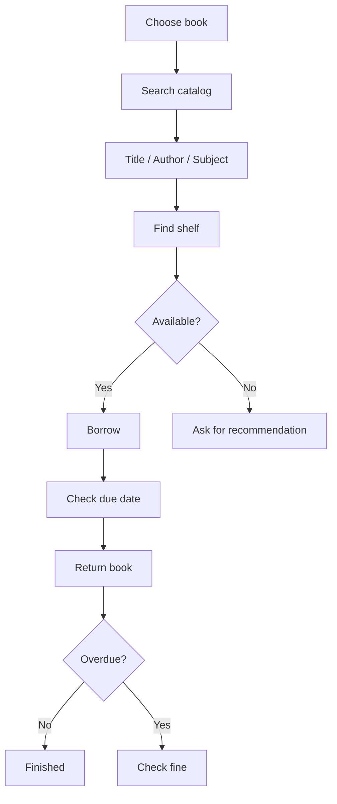

---

# 8. Phân biệt **borrow**, **lend** và **return**

## **borrow**

Bạn nhận thứ gì đó từ người khác để sử dụng tạm thời.

**I borrowed a book from the library.**

---

## **lend**

Bạn đưa thứ gì đó cho người khác sử dụng tạm thời.

**The library lends books to students.**

---

## **return**

Trả lại thứ đã mượn.

**I need to return this book tomorrow.**

---

## Bảng so sánh

| Từ         | Ý nghĩa  | Ví dụ               |
| ---------- | -------- | ------------------- |
| **borrow** | mượn     | borrow a book       |
| **lend**   | cho mượn | lend someone a book |
| **return** | trả lại  | return a book       |

---

# 9. Phân biệt **due**, **due date** và **overdue**

## **due**

Đến hạn phải trả.

**The book is due tomorrow.**

---

## **due date**

Ngày cụ thể phải trả.

**The due date is Friday.**

---

## **overdue**

Đã vượt quá thời hạn.

**The book is overdue.**

### Dòng thời gian

```text
Borrow book
    ↓
Due date
    ↓
Return on time → OK

hoặc

Due date
    ↓
Không trả
    ↓
Overdue
    ↓
Possible fine
```

---

# 10. Phát âm trọng tâm

## 10.1. **borrow**

/ˈbɒr.əʊ/

Trọng âm:

**BOR**-row

---

## 10.2. **library**

/ˈlaɪ.brər.i/

Trọng âm:

**LI**-brary

Khi nói nhanh, từ này thường không được đọc tách từng chữ quá rõ.

---

## 10.3. **catalog**

/ˈkæt.əl.ɒɡ/

Trọng âm:

**CAT**-a-log

---

## 10.4. **author**

/ˈɔː.θər/

Chú ý âm:

`th` → /θ/

Không đọc thành âm **t**.

---

## 10.5. **due**

/djuː/

Gần giống:

`dew`

---

## 10.6. **overdue**

/ˌəʊ.vəˈdjuː/

Trọng âm chính nằm ở:

over-**DUE**

---

## 10.7. **recommend**

/ˌrek.əˈmend/

Trọng âm:

re-com-**MEND**

---

## 10.8. **geography**

/dʒiˈɒɡ.rə.fi/

Trọng âm:

ge-**OG**-ra-phy

---

## 10.9. Nối âm trong hội thoại

### **Can I borrow these books?**

Luyện:

`Can-I / borrow-these-books?`

### **When is the book due?**

Luyện:

`When-is-the-book-due?`

### **Could you recommend another one?**

Luyện:

`Could-you-recommend-another-one?`

### **I haven't finished the book yet.**

Luyện:

`I-haven't-finished-the-book-yet.`

---

# 11. Hội thoại thực tế — Real-Life Conversation

## Hội thoại 1 — Tìm một cuốn sách


**Student:** Excuse me. Could you help me find a book?

**Librarian:** Sure. What's the title?

**Student:** *The Great Gatsby.*

**Librarian:** Let me check the catalog.

**Student:** Is it available?

**Librarian:** Yes. It's on the second floor.

**Student:** Which shelf is it on?

**Librarian:** Shelf 24, in the literature section.

**Student:** Great. Thank you.

---

## Hội thoại 2 — Mượn sách


**Student:** Can I borrow these books?

**Librarian:** Sure. Do you have a library card?

**Student:** Yes. Here it is.

**Librarian:** Thank you.

**Student:** How many books can I borrow at a time?

**Librarian:** You can borrow five books.

**Student:** When are they due?

**Librarian:** Two weeks from today.

**Student:** Great. Thank you.

---

## Hội thoại 3 — Không tìm thấy sách


**Student:** Excuse me. Could you help me?

**Librarian:** Of course.

**Student:** I couldn't find this book on the shelves.

**Librarian:** What's the title?

**Student:** *Gone with the Wind.*

**Librarian:** Let me check.

**Student:** Is it available?

**Librarian:** I'm sorry. It isn't available at the moment.

---

## Hội thoại 4 — Nhờ giới thiệu sách khác


Nội dung này bám sát tình huống mẫu trong bài.

**Librarian:** Hello. How may I help you?

**Reader:** I'd like to borrow a novel, please.

**Librarian:** What's the title?

**Reader:** Is *Gone with the Wind* available?

**Librarian:** I'm sorry. That book isn't available at the moment.

**Reader:** Could you recommend another one?

**Librarian:** I think you would enjoy *The Great Gatsby.*

**Reader:** Okay. I'll borrow that.

**Reader:** When is it due back?

**Librarian:** It's due two weeks from today.

**Reader:** Great. Thank you.

---

## Hội thoại 5 — Đăng ký thẻ thư viện


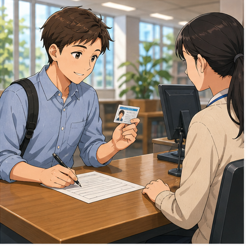
Trong bài có tình huống:

* đăng ký library card;
* xuất trình ID;
* phí £5 mỗi năm;
* điền form.

### Hội thoại hoàn chỉnh

**Reader:** Excuse me. Could I apply for a library card here?

**Librarian:** Yes, of course. Could I see some ID?

**Reader:** Sure. Here you are.

**Librarian:** Thank you. It costs five pounds per year.

**Reader:** That's fine.

**Librarian:** If you'd like to apply, please fill out this form.

**Reader:** Okay. Thank you.

**Librarian:** No problem.

---

## Hội thoại 6 — Sách quá hạn


**Reader:** Excuse me. I think this book is overdue.

**Librarian:** Let me check your account.

**Reader:** I haven't finished the book yet.

**Librarian:** It was due three days ago.

**Reader:** Will I have to pay a fine?

**Librarian:** Yes, there's a small late fee.

**Reader:** Can I renew the book?

**Librarian:** Let me check.

---

# 12. Natural Expressions — Cách nói tự nhiên

| Cụm từ                                   | Nghĩa                                   | Khi dùng      |
| ---------------------------------------- | --------------------------------------- | ------------- |
| **Can I borrow this book?**              | Tôi có thể mượn sách này không?         | Mượn sách     |
| **Could I borrow these books?**          | Tôi có thể mượn những sách này không?   | Lịch sự hơn   |
| **Could you help me find this book?**    | Bạn có thể giúp tôi tìm sách này không? | Tìm sách      |
| **What's the title?**                    | Tên sách là gì?                         | Tra cứu       |
| **Who's the author?**                    | Tác giả là ai?                          | Tra cứu       |
| **Let me check the catalog.**            | Để tôi kiểm tra danh mục.               | Thủ thư       |
| **Is it available?**                     | Nó có sẵn không?                        | Kiểm tra sách |
| **It's not available at the moment.**    | Hiện tại sách không có sẵn.             | Báo hết sách  |
| **Which shelf is it on?**                | Nó nằm ở kệ nào?                        | Tìm vị trí    |
| **How many books can I borrow?**         | Tôi có thể mượn bao nhiêu cuốn?         | Quy định      |
| **When is it due?**                      | Khi nào phải trả?                       | Ngày trả      |
| **When is it due back?**                 | Khi nào phải trả lại?                   | Ngày trả      |
| **I haven't finished it yet.**           | Tôi vẫn chưa đọc xong.                  | Nói tiến độ   |
| **The book is overdue.**                 | Sách đã quá hạn.                        | Trả muộn      |
| **Will I have to pay a fine?**           | Tôi có phải trả tiền phạt không?        | Quá hạn       |
| **Could you recommend another one?**     | Bạn giới thiệu cuốn khác được không?    | Chọn sách     |
| **I'd like to borrow a novel.**          | Tôi muốn mượn một tiểu thuyết.          | Yêu cầu       |
| **I'm looking for a book on computers.** | Tôi đang tìm sách về máy tính.          | Tìm chủ đề    |
| **Could I apply for a library card?**    | Tôi có thể đăng ký thẻ không?           | Làm thẻ       |
| **Could I see some ID?**                 | Tôi có thể xem giấy tờ tùy thân không?  | Xác minh      |
| **Please fill out this form.**           | Vui lòng điền mẫu đơn này.              | Đăng ký       |
| **Sure. Here you are.**                  | Được. Đây ạ.                            | Đưa đồ        |
| **Just a moment, please.**               | Vui lòng chờ một chút.                  | Thủ thư       |
| **No problem.**                          | Không vấn đề gì.                        | Phản hồi      |
| **Thank you for your help.**             | Cảm ơn bạn đã giúp đỡ.                  | Kết thúc      |

---

# 13. Lỗi thường gặp — Common Mistakes

## Lỗi 1: Nhầm **borrow** và **lend**

❌ **Can you borrow me this book?**

✅ **Can you lend me this book?**

Hoặc khi nói với thư viện:

✅ **Can I borrow this book?**

---

## Lỗi 2: Nói **borrow a book to the library**

❌ **I borrowed a book to the library.**

✅ **I borrowed a book from the library.**

### Cấu trúc

`borrow something from someone/somewhere`

---

## Lỗi 3: Nhầm **due** với **do**

❌ **When is the book do?**

✅ **When is the book due?**

**due** /djuː/ = đến hạn.

---

## Lỗi 4: Nhầm **due** và **overdue**

**The book is due tomorrow.**

→ Ngày mai mới đến hạn.

**The book is overdue.**

→ Sách đã quá hạn.

---

## Lỗi 5: Nói **When I must return this book?**

❌ **When I must return this book?**

✅ **When must I return this book?**

Tự nhiên hơn:

✅ **When do I need to return this book?**

---

## Lỗi 6: Dùng **many book**

❌ **How many book can I borrow?**

✅ **How many books can I borrow?**

Sau **how many** dùng danh từ số nhiều.

---

## Lỗi 7: Nhầm **book shelf** với **bookshelf**

Danh từ:

✅ **bookshelf**

Nhưng có thể nói:

✅ **The book is on the shelf.**

---

## Lỗi 8: Nói **in the shelf**

❌ **The book is in the shelf.**

✅ **The book is on the shelf.**

---

## Lỗi 9: Nói **recommend me a book**

Trong giao tiếp đôi khi có thể nghe thấy, nhưng cấu trúc an toàn cho người học:

✅ **Could you recommend a book?**

✅ **Could you recommend a book to me?**

---

## Lỗi 10: Nhầm **library** và **bookstore**

**library** = thư viện, thường mượn sách.

**bookstore / bookshop** = hiệu sách, mua sách.

---

## Lỗi 11: Quên **for** trong **apply for**

❌ **I want to apply a library card.**

✅ **I want to apply for a library card.**

---

## Lỗi 12: Nói **make a library card**

Trong tình huống đăng ký:

✅ **apply for a library card**

Hoặc:

✅ **get a library card**

---

## Lỗi 13: Dịch trực tiếp "Tôi chưa đọc xong"

❌ **I don't finish the book yet.**

✅ **I haven't finished the book yet.**

---

## Lỗi 14: Hỏi quá dài

Thay vì:

❌ **Could you please tell me if you know where maybe I could find this particular book somewhere in the library?**

Nói:

✅ **Could you help me find this book?**

Câu ngắn dễ nghe và tự nhiên hơn.

---

# 14. Luyện tập có hướng dẫn

## Bài 1 — Nối từ với nghĩa

1. borrow
2. overdue
3. catalog
4. shelf
5. fine
6. author
7. due date
8. library card

A. tiền phạt
B. ngày phải trả
C. tác giả
D. thẻ thư viện
E. mượn
F. quá hạn
G. kệ
H. danh mục tra cứu

<details>
<summary>Đáp án</summary>

1–E
2–F
3–H
4–G
5–A
6–C
7–B
8–D

</details>

---

## Bài 2 — Điền từ

Dùng:

`borrow` · `catalog` · `due` · `shelves` · `fine`

1. Can I ______ this book?
2. Let me check the ______.
3. When is this book ______?
4. I couldn't find it on the ______.
5. Will I have to pay a ______?

<details>
<summary>Đáp án</summary>

1. borrow
2. catalog
3. due
4. shelves
5. fine

</details>

---

## Bài 3 — Chọn **due** hoặc **overdue**

1. The book is ______ tomorrow.
2. This book was due yesterday. It's ______ now.
3. When is the book ______?
4. Your library book is five days ______.

<details>
<summary>Đáp án</summary>

1. due
2. overdue
3. due
4. overdue

</details>

---

## Bài 4 — Chọn câu đúng

### 1. Bạn muốn mượn sách.

A. Can I lend this book?
B. Can I borrow this book?
C. Can I take borrow this book?

**Đáp án:** B

---

### 2. Bạn muốn hỏi ngày phải trả.

A. When is the book due?
B. When the book is due?
C. When book due?

**Đáp án:** A

---

### 3. Bạn không tìm thấy sách.

A. I couldn't find this book on the shelves.
B. I couldn't find this book in the shelves.
C. I couldn't found this book on the shelf.

**Đáp án:** A

---

### 4. Bạn muốn làm thẻ thư viện.

A. Where can I apply a library card?
B. Where can I apply for a library card?
C. Where can I apply to library card?

**Đáp án:** B

---

### 5. Bạn muốn nhờ giới thiệu sách khác.

A. Could you recommend another one?
B. Could you recommendation another one?
C. Could you recommended another one?

**Đáp án:** A

---

## Bài 5 — Hoàn thành hội thoại

**Student:** Excuse me. Could you help me ______ this book?

**Librarian:** Sure. What's the ______?

**Student:** *The Great Gatsby.*

**Librarian:** Let me check the ______.

**Student:** Is it ______?

**Librarian:** Yes.

**Student:** Great. Can I ______ it?

**Librarian:** Of course.

<details>
<summary>Đáp án</summary>

1. find
2. title
3. catalog
4. available
5. borrow

</details>

---

## Bài 6 — Viết câu hoàn chỉnh

### 1.

`can / borrow / these books`

→ _______________________________

### 2.

`when / book / due`

→ _______________________________

### 3.

`could / help / find / book`

→ _______________________________

### 4.

`book / overdue`

→ _______________________________

### 5.

`apply for / library card`

→ _______________________________

<details>
<summary>Đáp án gợi ý</summary>

1. **Can I borrow these books?**
2. **When is the book due?**
3. **Could you help me find this book?**
4. **The book is overdue.**
5. **I'd like to apply for a library card.**

</details>

---

# 15. Speaking Challenge

## Challenge 1 — Thay đổi thông tin

Nói lại hội thoại sau:

**A:** Excuse me. Could you help me find this book?

**B:** Sure. What's the title?

**A:** *The Great Gatsby.*

**B:** Let me check the catalog.

Sau đó thay:

* tên sách;
* tác giả;
* chủ đề;
* vị trí kệ.

---

## Challenge 2 — Tạo 5 câu hỏi

Tạo năm câu hỏi có thể sử dụng tại thư viện.

Gợi ý chủ đề:

1. vị trí sách;
2. số lượng sách được mượn;
3. ngày trả;
4. thẻ thư viện;
5. sách cùng chủ đề.

Ví dụ:

**How many books can I borrow at a time?**

---

## Challenge 3 — Role-play 60 giây

### Vai A — Reader

Bạn muốn:

* tìm một cuốn tiểu thuyết;
* nhưng sách không có sẵn;
* nhờ giới thiệu sách khác;
* mượn sách;
* hỏi ngày phải trả.

### Vai B — Librarian

Bạn cần:

* hỏi title;
* kiểm tra catalog;
* thông báo không có sách;
* giới thiệu sách khác;
* cung cấp due date.

---

## Challenge 4 — Đăng ký thẻ thư viện

Hãy tạo hội thoại ít nhất 8 lượt sử dụng:

* **library card**
* **ID**
* **five pounds per year**
* **fill out this form**
* **borrow books**

---

# 16. Practice Mission

Trong hôm nay, hãy viết hoặc nói một đoạn hội thoại **8–10 lượt** cho tình huống:

> **Bạn đến thư viện để tìm và mượn một cuốn sách nhưng cuốn sách đó hiện không có sẵn.**

Đoạn hội thoại phải sử dụng ít nhất:

* **5 từ vựng mới**;
* **3 mẫu câu của bài**;
* **1 câu hỏi về due date**;
* **1 câu nhờ recommend một cuốn sách khác**.

### Những từ nên cố gắng sử dụng

`borrow` · `catalog` · `title` · `author` · `available` · `recommend` · `due` · `library card`

---

# 17. Checklist hoàn thành

Sau bài học, hãy tự kiểm tra:

* [ ] Tôi biết cách hỏi mượn sách.
* [ ] Tôi biết cách nhờ thủ thư tìm sách.
* [ ] Tôi hiểu **title** và **author**.
* [ ] Tôi biết **catalog** dùng để làm gì.
* [ ] Tôi biết hỏi sách có **available** hay không.
* [ ] Tôi biết hỏi **When is the book due?**
* [ ] Tôi phân biệt được **due** và **overdue**.
* [ ] Tôi biết hỏi về **fine**.
* [ ] Tôi biết nhờ thủ thư **recommend** sách.
* [ ] Tôi biết đăng ký **library card**.
* [ ] Tôi có thể duy trì hội thoại ít nhất 8 lượt.

---

# 18. Câu hỏi cuối bài

Hãy tưởng tượng bạn đang ở một thư viện nước ngoài.

Bạn muốn tìm một cuốn sách yêu thích nhưng không biết nó nằm ở đâu.

**Bạn sẽ bắt đầu cuộc hội thoại với thủ thư như thế nào?**

Hãy trả lời bằng **3–5 câu tiếng Anh**.

---

# Instructor Notes

* **Module:** 04 — Around Town / Giao tiếp trong thành phố
* **Lesson:** 21 — Tìm và mượn tài liệu
* **Topic:** The Library
* **Trình độ:** A1–A2
* **Thời lượng gợi ý:** 8–12 phút video chính + 5–10 phút luyện nói.
* Tập trung vào tình huống thực tế hơn là học từ riêng lẻ.
* Cho người học luyện theo chuỗi:

```text
Find book
    ↓
Check catalog
    ↓
Ask availability
    ↓
Borrow
    ↓
Check due date
    ↓
Return
```

* Nhấn mạnh ba nhóm dễ nhầm:

```text
borrow ↔ lend

due ↔ overdue

library ↔ bookstore
```

* Khi dạy phần hội thoại, ưu tiên các câu ngắn:

```text
Could you help me find this book?

Is it available?

Can I borrow it?

When is it due?

Could you recommend another one?
```

* Không yêu cầu người học sử dụng câu quá phức tạp ở trình độ A1–A2.
* Có thể chia lớp thành cặp:

  * Student A = **Reader**
  * Student B = **Librarian**
* Kết thúc bài bằng một role-play 45–60 giây và câu hỏi mở để người học trả lời trong Q&A hoặc worksheet.
