# LESSON 22 — GỬI THƯ VÀ BƯU KIỆN

> **Module 04 — Around Town / Giao tiếp trong thành phố**
> **Chủ đề:** The Post Office — Gửi thư, bưu thiếp và bưu kiện
> **Trình độ gợi ý:** A1–A2
> **Thời lượng:** 8–12 phút học bài + 5–10 phút luyện nói

---

## 1. Tình huống thực tế — Real-Life Situation

Khi đến **bưu điện — post office**, bạn có thể cần:

* mua tem;
* mua phong bì;
* gửi thư;
* gửi bưu thiếp;
* gửi một bưu kiện;
* hỏi chi phí gửi thư;
* hỏi giá gửi bưu kiện;
* cân bưu kiện;
* hỏi bưu kiện có quá cân hay không;
* hỏi trọng lượng tối đa được phép;
* chọn gửi bằng đường hàng không;
* chọn gửi bằng đường biển;
* hỏi mất bao lâu để thư hoặc bưu kiện đến nơi;
* gửi thư bảo đảm;
* mua bảo hiểm cho bưu kiện;
* hỏi phí bảo hiểm;
* nhờ nhân viên đóng gói bưu kiện;
* nhận một bưu kiện;
* hỏi nên sử dụng loại tem nào;
* hỏi sự khác nhau giữa các mức giá vận chuyển;
* gửi quà cho người thân hoặc bạn bè ở nước ngoài.

Người học cần biết cách sử dụng những câu ngắn và tự nhiên như:

* **I'd like to mail this letter to Vietnam.**
* **I'd like to send this parcel to Canada.**
* **How much is the postage?**
* **What is the postage cost for a letter to Los Angeles?**
* **Is the parcel overweight?**
* **What's the maximum weight allowed?**
* **Could you please pack this for me?**
* **How long will it take to get there by air mail?**
* **Which stamp should I put on?**
* **I'd like to pick up my parcel.**
* **How different are the rates?**
* **I'd like to send it by air mail.**

---

## 2. Mục tiêu bài học — Learning Outcomes

Sau bài học, người học có thể:

1. Hiểu và sử dụng từ **post office**.
2. Phân biệt **letter**, **postcard**, **parcel** và **package**.
3. Hiểu cách dùng **send** và **mail**.
4. Mua **stamp** và **envelope** tại bưu điện.
5. Hỏi chi phí bưu chính bằng từ **postage**.
6. Hỏi giá gửi thư hoặc bưu kiện.
7. Hỏi trọng lượng của bưu kiện.
8. Hiểu và sử dụng **weight**, **maximum weight** và **overweight**.
9. Chọn gửi bằng **air mail** hoặc **sea mail**.
10. Hỏi thời gian vận chuyển.
11. Hiểu khái niệm **registered letter**.
12. Hiểu **insurance** và **insurance fee**.
13. Nhờ nhân viên đóng gói bưu kiện.
14. Hỏi nên dùng loại tem nào.
15. Đến bưu điện nhận một bưu kiện.
16. Hỏi sự khác nhau giữa các mức giá vận chuyển.
17. Duy trì một cuộc hội thoại tại bưu điện ít nhất 6–8 lượt.
18. Tự tạo một hội thoại gửi thư hoặc bưu kiện ra nước ngoài.

---

## 3. Sơ đồ giao tiếp

```mermaid
flowchart LR
    A[Đến bưu điện] --> B[Chọn dịch vụ]
    B --> C[Thư / Bưu thiếp / Bưu kiện]
    C --> D[Cân và kiểm tra kích thước]
    D --> E[Chọn cách gửi]
    E --> F[Air mail / Sea mail]
    F --> G[Kiểm tra postage]
    G --> H[Thanh toán]
    H --> I[Gửi bưu phẩm]
    I --> J[Chờ giao đến nơi]
```

### Mẫu giao tiếp đơn giản

**You:** Excuse me. I'd like to send this parcel to Canada.

**Clerk:** Sure. Let me weigh it.

**You:** How much is the postage?

**Clerk:** It's fifteen dollars by air mail.

**You:** How long will it take?

**Clerk:** About ten days.

**You:** Okay. I'll send it by air mail.

**Clerk:** No problem.

---

# 4. Từ vựng trọng tâm — Core Vocabulary

## 4.1. **post office** /ˈpəʊst ˌɒf.ɪs/

**Nghĩa:** bưu điện

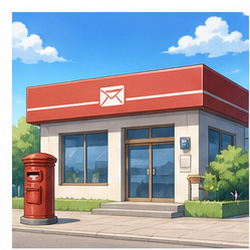

**Ví dụ:**

* **I'm going to the post office.**
  — Tôi đang đi đến bưu điện.

* **Is there a post office near here?**
  — Có bưu điện nào gần đây không?

---

## 4.2. **postcard** /ˈpəʊst.kɑːd/

**Nghĩa:** bưu thiếp

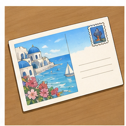

**Ví dụ:**

* **I'd like to send this postcard to Japan.**
* **I bought a postcard for my friend.**

---

## 4.3. **send** /send/

**Nghĩa:** gửi

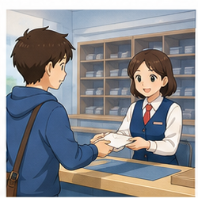

### Cấu trúc

`send + something + to + place/person`

Ví dụ:

* **send a letter to Vietnam**
* **send a parcel to Canada**
* **send a postcard to my friend**

**Ví dụ hoàn chỉnh:**

**I'd like to send this parcel to Canada.**

— Tôi muốn gửi bưu kiện này đến Canada.

---

## 4.4. **mail** /meɪl/

**Nghĩa:** gửi qua bưu điện; thư từ

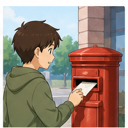

Trong video:

**I'd like to mail this letter to Vietnam.**

— Tôi muốn gửi lá thư này đến Việt Nam.

### So sánh

`send a letter`

và

`mail a letter`

đều có thể dùng.

Tuy nhiên:

* **send** rộng hơn;
* **mail** thường liên quan trực tiếp đến dịch vụ bưu chính.

---

## 4.5. **letter** /ˈlet.ər/

**Nghĩa:** thư

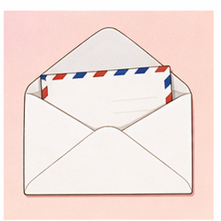

**Ví dụ:**

* **I'd like to send this letter.**
* **I need to mail a letter to my friend.**

---

## 4.6. **envelope** /ˈen.və.ləʊp/

**Nghĩa:** phong bì

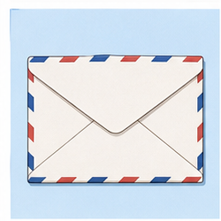

Trong video:

**I'd like a stamp and an envelope.**

— Tôi muốn mua một con tem và một phong bì.

**Ví dụ:**

**Do you have any large envelopes?**

— Bạn có phong bì lớn không?

---

## 4.7. **stamp** /stæmp/

**Nghĩa:** tem thư


Trong video:

**I'd like to have four stamps.**

Tự nhiên hơn:

**I'd like four stamps, please.**

— Tôi muốn mua bốn con tem.

### Cụm từ

* **buy a stamp**
* **put a stamp on an envelope**
* **postage stamp**

---

## 4.8. **postage** /ˈpəʊ.stɪdʒ/

**Nghĩa:** cước bưu chính, phí gửi thư/bưu kiện

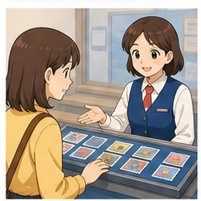

Trong video:

**What is the postage cost for a letter to Los Angeles?**

— Chi phí gửi một lá thư đến Los Angeles là bao nhiêu?

Cách ngắn hơn:

**How much is the postage?**

— Phí gửi là bao nhiêu?

---

## 4.9. **parcel** /ˈpɑː.səl/

**Nghĩa:** bưu kiện

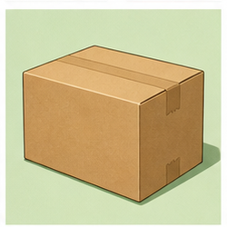

Trong video:

**I want to send this small parcel to Canada.**

— Tôi muốn gửi bưu kiện nhỏ này đến Canada.

### Cụm từ

* **small parcel**
* **send a parcel**
* **receive a parcel**
* **pick up a parcel**

---

## 4.10. **package** /ˈpæk.ɪdʒ/

**Nghĩa:** gói hàng, kiện hàng

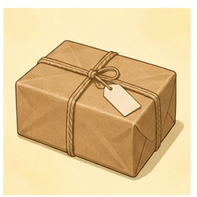

**Package** và **parcel** có nghĩa khá gần nhau.

Ví dụ:

**I'd like to send this package overseas.**

— Tôi muốn gửi kiện hàng này ra nước ngoài.

---

## 4.11. **pick up** /pɪk ʌp/

**Nghĩa:** đến nhận, lấy

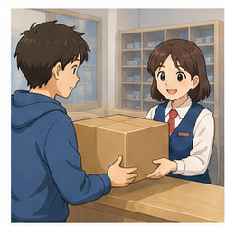

Trong video:

**I'd like to pick up my parcel.**

— Tôi muốn đến nhận bưu kiện của mình.

### Cấu trúc

`pick up + something`

Ví dụ:

* **pick up a parcel**
* **pick up a package**
* **pick up my mail**

---

## 4.12. **weight** /weɪt/

**Nghĩa:** trọng lượng

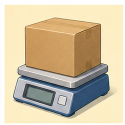

Ví dụ:

**What's the weight of the parcel?**

— Bưu kiện nặng bao nhiêu?

---

## 4.13. **maximum weight**

**Nghĩa:** trọng lượng tối đa

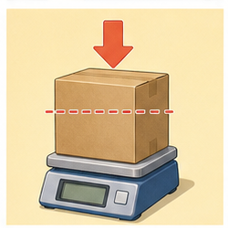

Trong video:

**What's the maximum weight allowed?**

— Trọng lượng tối đa được phép là bao nhiêu?

### Cấu trúc

`maximum + noun`

Ví dụ:

* **maximum weight**
* **maximum size**
* **maximum amount**

---

## 4.14. **overweight** /ˌəʊ.vəˈweɪt/

**Nghĩa trong bài:** quá trọng lượng cho phép

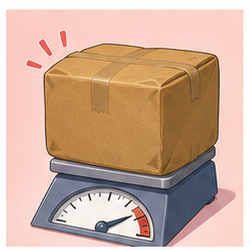

Trong video:

**Is the letter overweight?**

— Lá thư có vượt quá trọng lượng cho phép không?

Thường gặp hơn với bưu kiện:

**Is this parcel overweight?**

---

## 4.15. **air mail / airmail**

**Nghĩa:** thư/bưu phẩm gửi bằng đường hàng không

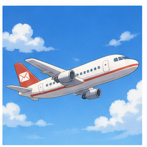

Trong video:

**I'd like to send this letter by air mail.**

— Tôi muốn gửi lá thư này bằng đường hàng không.

**How long will it take to get to Hanoi by air mail?**

— Gửi bằng đường hàng không đến Hà Nội mất bao lâu?

---

## 4.16. **sea mail**

**Nghĩa:** thư/bưu phẩm gửi bằng đường biển

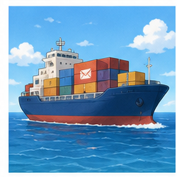

Ví dụ:

**Is sea mail cheaper?**

— Gửi đường biển có rẻ hơn không?

**How long does sea mail take?**

— Gửi đường biển mất bao lâu?

---

## 4.17. **rate** /reɪt/

**Nghĩa trong bưu điện:** mức giá, cước phí

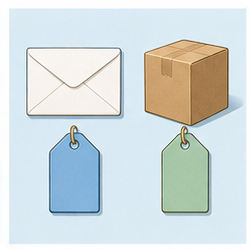

Trong hội thoại:

**How different are the rates?**

— Các mức giá khác nhau thế nào?

Ví dụ:

**What's the air-mail rate?**

— Giá gửi bằng đường hàng không là bao nhiêu?

---

## 4.18. **registered letter**

**Nghĩa:** thư bảo đảm

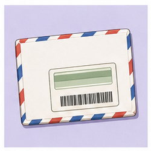

Thư bảo đảm thường được sử dụng khi người gửi muốn có bằng chứng gửi hoặc khả năng theo dõi tốt hơn thư thông thường.

Ví dụ:

**I'd like to send this as a registered letter.**

— Tôi muốn gửi lá thư này dưới dạng thư bảo đảm.

---

## 4.19. **insurance** /ɪnˈʃʊə.rəns/

**Nghĩa:** bảo hiểm


Ví dụ:

**I'd like to insure this parcel.**

— Tôi muốn mua bảo hiểm cho bưu kiện này.

---

## 4.20. **insurance fee**

**Nghĩa:** phí bảo hiểm

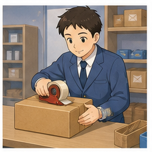

Ví dụ:

**How much is the insurance fee?**

— Phí bảo hiểm là bao nhiêu?

---

## 4.21. **pack** /pæk/

**Nghĩa:** đóng gói

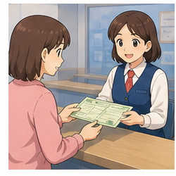

Trong video:

**Could you please pack this for me?**

— Bạn có thể đóng gói cái này giúp tôi được không?

### Cụm từ

* **pack a parcel**
* **pack a gift**
* **pack something carefully**

---

## 4.22. **money order**

**Nghĩa:** phiếu chuyển tiền / lệnh chuyển tiền qua bưu điện

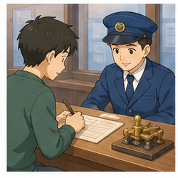

Ví dụ:

**Can I get a money order here?**

— Tôi có thể mua phiếu chuyển tiền ở đây không?

---

## 4.23. **telegram** /ˈtel.ɪ.ɡræm/

**Nghĩa:** điện tín


Đây là từ xuất hiện trong nội dung video nhưng ngày nay **telegram** là một dịch vụ bưu chính truyền thống ít được sử dụng hơn.

---

# 5. Bảng tổng hợp từ vựng

| English               | IPA             | Nghĩa tiếng Việt   | Example                  |
| --------------------- | --------------- | ------------------ | ------------------------ |
| **post office**       | /ˈpəʊst ˌɒf.ɪs/ | bưu điện           | go to the post office    |
| **postcard**          | /ˈpəʊst.kɑːd/   | bưu thiếp          | send a postcard          |
| **send**              | /send/          | gửi                | send a letter            |
| **mail**              | /meɪl/          | gửi qua bưu điện   | mail a letter            |
| **letter**            | /ˈlet.ər/       | thư                | write a letter           |
| **envelope**          | /ˈen.və.ləʊp/   | phong bì           | buy an envelope          |
| **stamp**             | /stæmp/         | tem                | buy a stamp              |
| **postage**           | /ˈpəʊ.stɪdʒ/    | cước bưu chính     | pay postage              |
| **parcel**            | /ˈpɑː.səl/      | bưu kiện           | send a parcel            |
| **package**           | /ˈpæk.ɪdʒ/      | kiện hàng          | mail a package           |
| **pick up**           | /pɪk ʌp/        | đến nhận           | pick up a parcel         |
| **weight**            | /weɪt/          | trọng lượng        | check the weight         |
| **maximum weight**    | —               | trọng lượng tối đa | maximum weight allowed   |
| **overweight**        | /ˌəʊ.vəˈweɪt/   | quá trọng lượng    | overweight parcel        |
| **air mail**          | —               | đường hàng không   | send by air mail         |
| **sea mail**          | —               | đường biển         | send by sea mail         |
| **rate**              | /reɪt/          | mức giá            | postal rate              |
| **registered letter** | —               | thư bảo đảm        | send a registered letter |
| **insurance**         | /ɪnˈʃʊə.rəns/   | bảo hiểm           | parcel insurance         |
| **insurance fee**     | —               | phí bảo hiểm       | pay an insurance fee     |
| **pack**              | /pæk/           | đóng gói           | pack a parcel            |
| **money order**       | —               | phiếu chuyển tiền  | get a money order        |
| **telegram**          | /ˈtel.ɪ.ɡræm/   | điện tín           | send a telegram          |

---

# 6. Mẫu câu giao tiếp — Useful Patterns

## 6.1. Nói muốn gửi thư

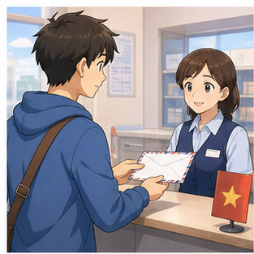

### **I'd like to mail this letter to Vietnam.**

— Tôi muốn gửi lá thư này đến Việt Nam.

### Cấu trúc

`I'd like to + verb`

Ví dụ:

* **I'd like to mail this letter.**
* **I'd like to send this parcel.**
* **I'd like to buy some stamps.**
* **I'd like to pick up my package.**

---

## 6.2. Nói muốn gửi bưu kiện

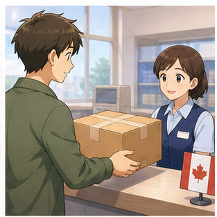

### **I'd like to send this parcel to Canada.**

— Tôi muốn gửi bưu kiện này đến Canada.

Cách khác:

**I want to send this small parcel to Canada.**

Ở bưu điện, **I'd like to...** thường nghe lịch sự và tự nhiên hơn **I want to...**.

---

## 6.3. Mua tem

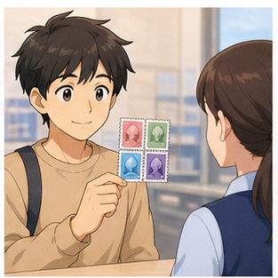

Trong video:

**I'd like to have four stamps.**

Tự nhiên hơn:

### **I'd like four stamps, please.**

— Tôi muốn mua bốn con tem.

Hoặc:

**Can I have four stamps, please?**

---

## 6.4. Mua tem và phong bì

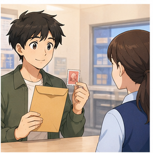

### **I'd like a stamp and an envelope.**

— Tôi muốn mua một con tem và một phong bì.

Có thể hỏi:

**Do you have any large envelopes?**

---

## 6.5. Hỏi phí gửi


### **How much is the postage?**

— Phí gửi là bao nhiêu?

Hoặc:

**What is the postage cost for a letter to Los Angeles?**

— Phí gửi thư đến Los Angeles là bao nhiêu?

### Cấu trúc

`How much is the postage to + place?`

Ví dụ:

**How much is the postage to Japan?**

---

## 6.6. Hỏi bưu kiện có quá cân không

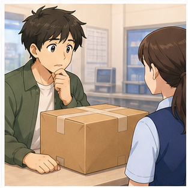

### **Is this parcel overweight?**

— Bưu kiện này có quá trọng lượng cho phép không?

Cách khác:

**Is it over the weight limit?**

---

## 6.7. Hỏi trọng lượng tối đa

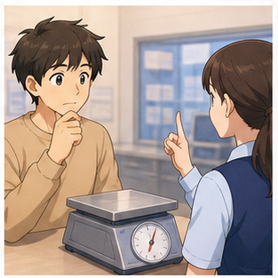

### **What's the maximum weight allowed?**

— Trọng lượng tối đa được phép là bao nhiêu?

Hoặc:

**What's the weight limit?**

— Giới hạn trọng lượng là bao nhiêu?

---

## 6.8. Nhờ đóng gói


### **Could you please pack this for me?**

— Bạn có thể đóng gói cái này giúp tôi được không?

Cách đơn giản hơn:

**Can you pack this for me, please?**

---

## 6.9. Hỏi thời gian vận chuyển

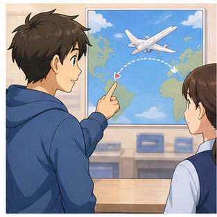

### **How long will it take to get to Hanoi by air mail?**

— Gửi bằng đường hàng không đến Hà Nội mất bao lâu?

### Cấu trúc

`How long will it take to get to + place?`

Ví dụ:

* **How long will it take to get to Canada?**
* **How long will it take by air mail?**
* **How long does sea mail take?**

---

## 6.10. Hỏi nên dùng tem nào


### **Which stamp should I put on?**

— Tôi nên dán loại tem nào?

Tự nhiên hơn khi có phong bì trước mặt:

**Which stamp should I put on this envelope?**

---

## 6.11. Chọn gửi bằng đường hàng không


### **I'd like to send this letter by air mail.**

— Tôi muốn gửi lá thư này bằng đường hàng không.

### Cấu trúc

`send + something + by + transport/service`

Ví dụ:

* **send it by air mail**
* **send it by sea mail**

---

## 6.12. Hỏi sự khác nhau về giá

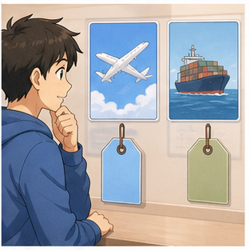

### **How different are the rates?**

— Các mức giá khác nhau thế nào?

Tự nhiên hơn khi so sánh hai lựa chọn:

**What's the difference in price?**

Hoặc:

**How much is it by air mail and by sea mail?**

---

## 6.13. Hỏi đường hàng không hay đường biển


### **Would you like to send it by air mail or by sea mail?**

— Bạn muốn gửi bằng đường hàng không hay đường biển?

Trả lời:

**By air mail, please.**

Hoặc:

**I'll send it by sea mail.**

---

## 6.14. Nhận bưu kiện

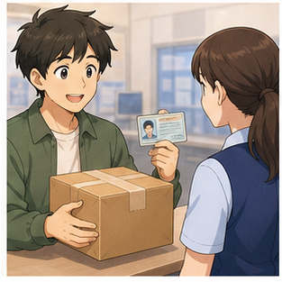

### **I'd like to pick up my parcel.**

— Tôi muốn nhận bưu kiện của mình.

Nhân viên có thể hỏi:

**Do you have your ID?**

— Bạn có giấy tờ tùy thân không?

---

## 6.15. Gửi thư bảo đảm

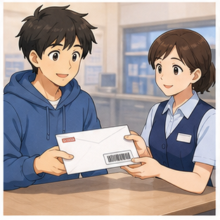

### **I'd like to send this as a registered letter.**

— Tôi muốn gửi thư này dưới dạng thư bảo đảm.

Có thể hỏi:

**How much does registered mail cost?**

---

## 6.16. Mua bảo hiểm bưu kiện

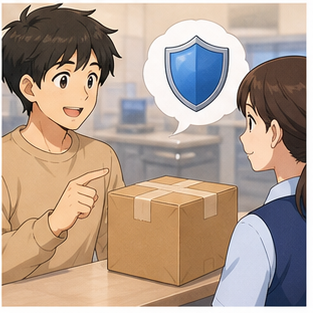

### **I'd like to insure this parcel.**

— Tôi muốn mua bảo hiểm cho bưu kiện này.

Hỏi thêm:

**How much is the insurance fee?**

---

# 7. Quy trình gửi thư và bưu kiện

| Bước              | Tiếng Anh                  | Ví dụ                       |
| ----------------- | -------------------------- | --------------------------- |
| Chuẩn bị đồ gửi   | **prepare the item**       | I need to send this gift.   |
| Đóng gói          | **pack the parcel**        | Could you pack this for me? |
| Ghi địa chỉ       | **write the address**      | Is this address correct?    |
| Cân               | **weigh the parcel**       | Let me weigh it.            |
| Kiểm tra giới hạn | **check the weight limit** | Is it overweight?           |
| Chọn dịch vụ      | **choose a service**       | Air mail or sea mail?       |
| Hỏi giá           | **check the postage**      | How much is the postage?    |
| Chọn bảo hiểm     | **add insurance**          | I'd like to insure it.      |
| Thanh toán        | **pay the postage**        | How much is it altogether?  |
| Gửi               | **send the parcel**        | I'd like to send this.      |

### Sơ đồ

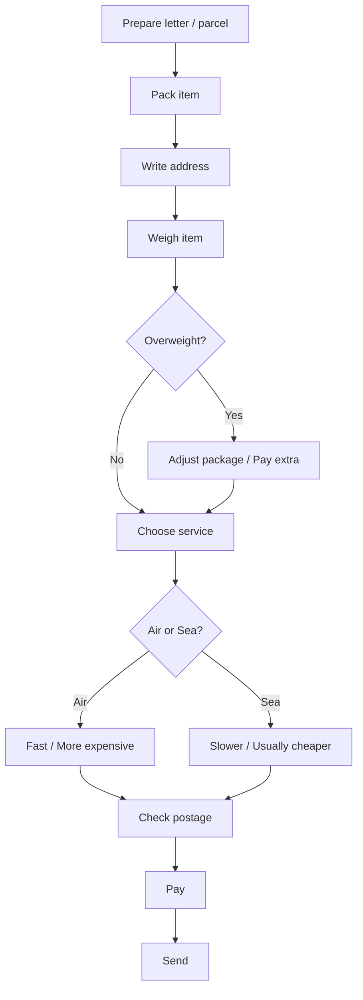

---

# 8. Phân biệt **letter**, **postcard**, **parcel** và **package**

## **letter**

Thư viết trên giấy, thường đặt trong phong bì.

**I'd like to send this letter.**

---

## **postcard**

Bưu thiếp, thường không cần phong bì.

**I sent a postcard from London.**

---

## **parcel**

Một gói hoặc kiện đồ được gửi qua bưu điện.

**I'd like to send this parcel to Canada.**

---

## **package**

Kiện hàng hoặc gói hàng.

**I received a package yesterday.**

---

## Bảng so sánh

| Từ           | Nghĩa     | Ví dụ             |
| ------------ | --------- | ----------------- |
| **letter**   | thư       | send a letter     |
| **postcard** | bưu thiếp | send a postcard   |
| **parcel**   | bưu kiện  | mail a parcel     |
| **package**  | kiện hàng | receive a package |

---

# 9. Phân biệt **send**, **mail** và **post**

## **send**

Từ chung nhất, nghĩa là gửi.

**I need to send this parcel.**

Có thể dùng cho:

* thư;
* bưu kiện;
* email;
* tin nhắn;
* file.

---

## **mail**

Gửi qua hệ thống bưu điện.

**I'd like to mail this letter.**

Phổ biến trong tiếng Anh-Mỹ.

---

## **post**

Cũng có thể mang nghĩa gửi qua bưu điện.

**I'd like to post this letter.**

Phổ biến trong tiếng Anh-Anh.

---

## Bảng so sánh

| Từ       | Cách dùng                        |
| -------- | -------------------------------- |
| **send** | từ chung, dùng cho nhiều loại    |
| **mail** | gửi qua bưu điện, phổ biến ở Mỹ  |
| **post** | gửi qua bưu điện, phổ biến ở Anh |

Ví dụ:

```text
I want to send this letter.
I want to mail this letter.
I want to post this letter.
```

Cả ba đều có thể đúng tùy ngữ cảnh.

---

# 10. Phân biệt **air mail** và **sea mail**

## **air mail**

Gửi bằng đường hàng không.

Ưu điểm:

* nhanh hơn.

Nhược điểm:

* thường đắt hơn.

Ví dụ:

**I'd like to send it by air mail.**

---

## **sea mail**

Gửi bằng đường biển.

Ưu điểm:

* có thể rẻ hơn.

Nhược điểm:

* thường mất nhiều thời gian hơn.

Ví dụ:

**How long does sea mail take?**

---

## Sơ đồ lựa chọn

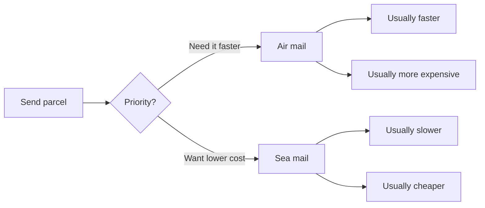

---

# 11. Phát âm trọng tâm

## 11.1. **post office**

/ˈpəʊst ˌɒf.ɪs/

Trọng âm chính:

**POST** office

---

## 11.2. **postcard**

/ˈpəʊst.kɑːd/

Trọng âm:

**POST**-card

---

## 11.3. **letter**

/ˈlet.ər/

Trọng âm:

**LET**-ter

---

## 11.4. **envelope**

/ˈen.və.ləʊp/

Trọng âm:

**EN**-ve-lope

---

## 11.5. **postage**

/ˈpəʊ.stɪdʒ/

Trọng âm:

**POST**-age

Chú ý cuối từ:

`-age` → /ɪdʒ/

---

## 11.6. **parcel**

/ˈpɑː.səl/

Trọng âm:

**PAR**-cel

---

## 11.7. **maximum**

/ˈmæk.sɪ.məm/

Trọng âm:

**MAX**-i-mum

---

## 11.8. **insurance**

/ɪnˈʃʊə.rəns/

Trọng âm:

in-**SUR**-ance

---

## 11.9. **registered**

/ˈredʒ.ɪ.stəd/

Trọng âm:

**REG**-is-tered

---

## 11.10. Nối âm trong hội thoại

### **I'd like to send this parcel.**

Luyện:

`I'd-like-to / send-this-parcel.`

### **How much is the postage?**

Luyện:

`How-much-is-the-postage?`

### **How long will it take?**

Luyện:

`How-long-will-it-take?`

### **Could you please pack this for me?**

Luyện:

`Could-you-please / pack-this-for-me?`

### **I'd like to pick up my parcel.**

Luyện:

`I'd-like-to / pick-up-my-parcel.`

---

# 12. Hội thoại thực tế — Real-Life Conversation

## Hội thoại 1 — Mua tem và phong bì

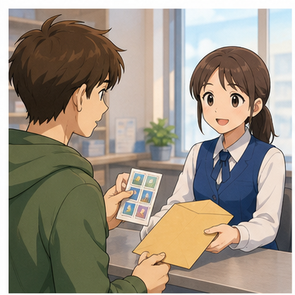

**Customer:** Excuse me. I'd like four stamps, please.

**Clerk:** Sure. Anything else?

**Customer:** Yes. I'd also like an envelope.

**Clerk:** What size do you need?

**Customer:** A small one, please.

**Clerk:** Here you are.

**Customer:** How much is it altogether?

**Clerk:** Five dollars.

**Customer:** Thank you.

---

## Hội thoại 2 — Gửi thư ra nước ngoài

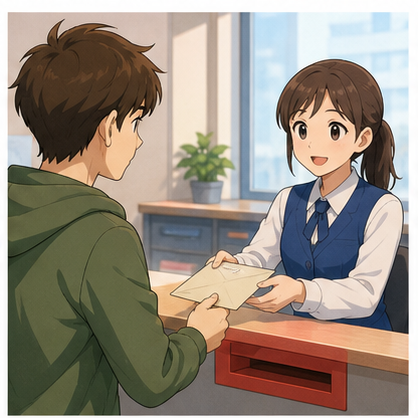

**Customer:** Hi. I'd like to mail this letter to Vietnam.

**Clerk:** Sure. Let me weigh it.

**Customer:** Is it overweight?

**Clerk:** No. The weight is fine.

**Customer:** How much is the postage?

**Clerk:** It's three dollars.

**Customer:** Which stamp should I put on?

**Clerk:** This one.

**Customer:** Great. Thank you.

---

## Hội thoại 3 — Gửi bưu kiện đến Canada

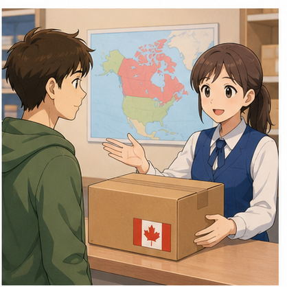

Nội dung dựa trên hội thoại trong video.

**Customer:** Excuse me. Can you help me?

**Clerk:** Sure. What do you need?

**Customer:** I need to send this small parcel to Canada.

**Clerk:** Would you like to send it by air mail or by sea mail?

**Customer:** What's the difference in price?

**Clerk:** Your parcel weighs 200 grams. It's fifteen dollars by air and seven dollars by sea.

**Customer:** How long does it take by air mail?

**Clerk:** About ten days.

**Customer:** Okay. I'll send it by air mail.

**Clerk:** No problem.

---

## Hội thoại 4 — Hỏi thời gian gửi


**Customer:** I'd like to send this parcel to Hanoi.

**Clerk:** By air mail or by sea mail?

**Customer:** How long will it take by air mail?

**Clerk:** About five days.

**Customer:** And by sea mail?

**Clerk:** About three weeks.

**Customer:** I'll use air mail, please.

**Clerk:** Okay.

---

## Hội thoại 5 — Nhờ đóng gói


**Customer:** Excuse me. Could you please pack this for me?

**Clerk:** Sure. What are you sending?

**Customer:** It's a small gift for my mother.

**Clerk:** Is there anything fragile inside?

**Customer:** No.

**Clerk:** Okay. I'll put it in this box.

**Customer:** Thank you. I'd like to send it to Vietnam.

**Clerk:** No problem. Let me weigh it first.

---

## Hội thoại 6 — Hỏi giới hạn trọng lượng

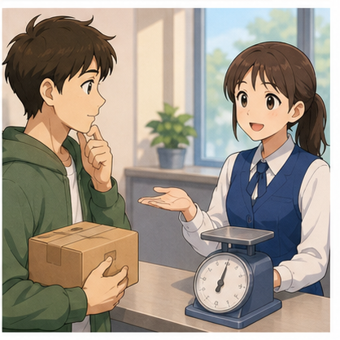

**Customer:** Excuse me. What's the maximum weight allowed?

**Clerk:** For this service, it's two kilograms.

**Customer:** My parcel is 2.3 kilograms.

**Clerk:** Then it's overweight for this service.

**Customer:** Is there another option?

**Clerk:** Yes. You can use our standard parcel service.

**Customer:** How much will that cost?

**Clerk:** Let me check.

---

## Hội thoại 7 — Gửi thư bảo đảm

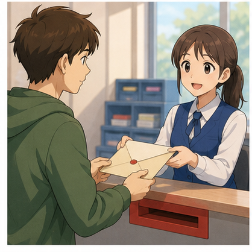

**Customer:** I'd like to send this letter.

**Clerk:** Regular mail or registered mail?

**Customer:** What's the difference?

**Clerk:** Registered mail gives you proof that the letter was sent.

**Customer:** Okay. I'd like to send it as a registered letter.

**Clerk:** No problem.

**Customer:** How much is it?

**Clerk:** It's eight dollars.

---

## Hội thoại 8 — Nhận bưu kiện

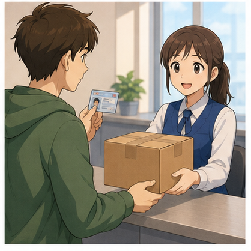

**Customer:** Hello. I'd like to pick up my parcel.

**Clerk:** Sure. Do you have your ID?

**Customer:** Yes. Here you are.

**Clerk:** Thank you. Just a moment, please.

**Customer:** Sure.

**Clerk:** Here is your parcel.

**Customer:** Great. Thank you very much.

**Clerk:** You're welcome.

---

# 13. Natural Expressions — Cách nói tự nhiên

| Cụm từ                                        | Nghĩa                                | Khi dùng          |
| --------------------------------------------- | ------------------------------------ | ----------------- |
| **I'd like to send this parcel.**             | Tôi muốn gửi bưu kiện này.           | Gửi hàng          |
| **I'd like to mail this letter.**             | Tôi muốn gửi lá thư này.             | Gửi thư           |
| **I'd like four stamps, please.**             | Tôi muốn bốn con tem.                | Mua tem           |
| **I'd like a stamp and an envelope.**         | Tôi muốn một tem và một phong bì.    | Mua vật dụng      |
| **How much is the postage?**                  | Phí gửi là bao nhiêu?                | Hỏi giá           |
| **How much will it cost?**                    | Nó sẽ tốn bao nhiêu?                 | Hỏi giá           |
| **How long will it take?**                    | Mất bao lâu?                         | Hỏi thời gian     |
| **Is this parcel overweight?**                | Bưu kiện này có quá cân không?       | Kiểm tra cân nặng |
| **What's the maximum weight allowed?**        | Trọng lượng tối đa là bao nhiêu?     | Hỏi quy định      |
| **What's the weight limit?**                  | Giới hạn trọng lượng là bao nhiêu?   | Hỏi quy định      |
| **Could you please pack this for me?**        | Bạn đóng gói giúp tôi được không?    | Nhờ hỗ trợ        |
| **Which stamp should I put on?**              | Tôi nên dán tem nào?                 | Gửi thư           |
| **I'd like to send it by air mail.**          | Tôi muốn gửi đường hàng không.       | Chọn dịch vụ      |
| **How long does sea mail take?**              | Gửi đường biển mất bao lâu?          | So sánh           |
| **What's the difference in price?**           | Giá khác nhau thế nào?               | So sánh           |
| **I'd like to pick up my parcel.**            | Tôi muốn nhận bưu kiện.              | Nhận hàng         |
| **I'd like to insure this parcel.**           | Tôi muốn mua bảo hiểm cho kiện hàng. | Bảo hiểm          |
| **How much is the insurance fee?**            | Phí bảo hiểm bao nhiêu?              | Hỏi giá           |
| **I'd like to send this as registered mail.** | Tôi muốn gửi thư bảo đảm.            | Gửi quan trọng    |
| **Just a moment, please.**                    | Vui lòng chờ một chút.               | Nhân viên         |
| **Let me weigh it.**                          | Để tôi cân nó.                       | Nhân viên         |
| **Let me check.**                             | Để tôi kiểm tra.                     | Nhân viên         |
| **That works for me.**                        | Phương án đó ổn với tôi.             | Chọn dịch vụ      |
| **By air mail, please.**                      | Gửi đường hàng không nhé.            | Trả lời           |
| **That's fine.**                              | Như vậy được.                        | Đồng ý            |
| **Thank you for your help.**                  | Cảm ơn bạn đã giúp.                  | Kết thúc          |

---

# 14. Lỗi thường gặp — Common Mistakes

## Lỗi 1: Dùng **send to Canada this parcel**

❌ **I want to send to Canada this parcel.**

✅ **I want to send this parcel to Canada.**

### Cấu trúc

`send + something + to + destination`

---

## Lỗi 2: Quên **to** trước địa điểm

❌ **I'd like to send this parcel Canada.**

✅ **I'd like to send this parcel to Canada.**

---

## Lỗi 3: Nhầm **postage** với **post office**

❌ **How much is the post office?**

Nếu muốn hỏi phí gửi:

✅ **How much is the postage?**

**post office** = bưu điện
**postage** = phí bưu chính

---

## Lỗi 4: Nói **How much does it takes?**

❌ **How much does it takes?**

Nếu hỏi giá:

✅ **How much does it cost?**

Nếu hỏi thời gian:

✅ **How long does it take?**

---

## Lỗi 5: Nhầm **how much** và **how long**

Hỏi giá:

✅ **How much does it cost?**

Hỏi thời gian:

✅ **How long does it take?**

---

## Lỗi 6: Nói **How long it takes?**

❌ **How long it takes?**

✅ **How long does it take?**

Hoặc:

✅ **How long will it take?**

---

## Lỗi 7: Quên **by** khi nói phương thức gửi

❌ **I'd like to send it air mail.**

✅ **I'd like to send it by air mail.**

---

## Lỗi 8: Nói **with air mail**

❌ **I'll send it with air mail.**

✅ **I'll send it by air mail.**

---

## Lỗi 9: Nhầm **weight** và **weigh**

**weight** = danh từ: trọng lượng

**weigh** = động từ: cân / nặng

Ví dụ:

**The weight is 500 grams.**

**The parcel weighs 500 grams.**

**Let me weigh the parcel.**

---

## Lỗi 10: Nói **What is the maximum weigh?**

❌ **What is the maximum weigh?**

✅ **What is the maximum weight?**

---

## Lỗi 11: Nói **This parcel is over weight**

Trong ngữ cảnh tính từ:

✅ **This parcel is overweight.**

Hoặc:

✅ **This parcel is over the weight limit.**

---

## Lỗi 12: Dùng **pick my parcel**

❌ **I'd like to pick my parcel.**

✅ **I'd like to pick up my parcel.**

**pick up** là cụm động từ.

---

## Lỗi 13: Dùng **send by airplane**

Người nghe vẫn có thể hiểu nhưng ở bưu điện tự nhiên hơn:

✅ **send by air mail**

Hoặc:

✅ **send by air**

---

## Lỗi 14: Nói quá dài

Thay vì:

❌ **I would like to know if perhaps you could tell me approximately how many days this package will require before arriving in Canada.**

Nói:

✅ **How long will it take to get to Canada?**

Câu ngắn dễ nghe hơn và phù hợp A1–A2.

---

## Lỗi 15: Dùng **I want** trong mọi tình huống

**I want to send this parcel.** không sai.

Nhưng trong giao tiếp dịch vụ, tự nhiên và lịch sự hơn:

✅ **I'd like to send this parcel.**

---

## Lỗi 16: Hiểu sai transcript **by email**

Trong đoạn hội thoại của video, hệ thống nhận dạng có thể ghi:

❌ **by email**

Nhưng ngữ cảnh đang so sánh:

```text
air mail
vs.
sea mail
```

Vì vậy ý đúng phải liên quan đến phương thức vận chuyển bưu chính, không phải email.

---

# 15. Luyện tập có hướng dẫn

## Bài 1 — Nối từ với nghĩa

1. postage
2. parcel
3. envelope
4. stamp
5. overweight
6. air mail
7. registered letter
8. pick up

A. thư bảo đảm
B. bưu kiện
C. nhận / lấy
D. phong bì
E. quá trọng lượng
F. tem
G. phí bưu chính
H. gửi bằng đường hàng không

<details>
<summary>Đáp án</summary>

1–G
2–B
3–D
4–F
5–E
6–H
7–A
8–C

</details>

---

## Bài 2 — Điền từ

Dùng:

`parcel` · `postage` · `stamp` · `air mail` · `weight`

1. I'd like to send this ______ to Canada.
2. How much is the ______?
3. Which ______ should I put on?
4. I'd like to send it by ______.
5. What's the maximum ______ allowed?

<details>
<summary>Đáp án</summary>

1. parcel
2. postage
3. stamp
4. air mail
5. weight

</details>

---

## Bài 3 — Chọn **how much** hoặc **how long**

1. ______ is the postage?
2. ______ will it take to get to Hanoi?
3. ______ does air mail cost?
4. ______ does sea mail take?
5. ______ is the insurance fee?

<details>
<summary>Đáp án</summary>

1. How much
2. How long
3. How much
4. How long
5. How much

</details>

---

## Bài 4 — Chọn câu đúng

### 1. Bạn muốn gửi một bưu kiện đến Canada.

A. I want send this parcel Canada.
B. I'd like to send this parcel to Canada.
C. I'd like sending this parcel Canada.

**Đáp án:** B

---

### 2. Bạn muốn hỏi giá gửi.

A. How much is the postage?
B. How many is the postage?
C. How long is the postage?

**Đáp án:** A

---

### 3. Bạn muốn hỏi thời gian giao.

A. How much will it take?
B. How long will it take?
C. How many time will it take?

**Đáp án:** B

---

### 4. Bạn muốn gửi bằng đường hàng không.

A. I'd like to send it with air mail.
B. I'd like to send it in air mail.
C. I'd like to send it by air mail.

**Đáp án:** C

---

### 5. Bạn muốn nhận bưu kiện.

A. I'd like to pick my parcel.
B. I'd like to pick up my parcel.
C. I'd like pick up my parcel.

**Đáp án:** B

---

## Bài 5 — Hoàn thành hội thoại

**Customer:** Excuse me. I'd like to ______ this parcel to Canada.

**Clerk:** Sure. Let me ______ it.

**Customer:** How much is the ______?

**Clerk:** Fifteen dollars by air mail.

**Customer:** How ______ will it take?

**Clerk:** About ten days.

**Customer:** Okay. I'll send it by ______ mail.

<details>
<summary>Đáp án</summary>

1. send
2. weigh
3. postage
4. long
5. air

</details>

---

## Bài 6 — Viết câu hoàn chỉnh

### 1.

`like / send / parcel / Canada`

→ ______________________________

### 2.

`how much / postage`

→ ______________________________

### 3.

`how long / take`

→ ______________________________

### 4.

`maximum weight / allowed`

→ ______________________________

### 5.

`please / pack / for me`

→ ______________________________

<details>
<summary>Đáp án gợi ý</summary>

1. **I'd like to send this parcel to Canada.**
2. **How much is the postage?**
3. **How long will it take?**
4. **What's the maximum weight allowed?**
5. **Could you please pack this for me?**

</details>

---

## Bài 7 — Chọn **weight** hoặc **weigh**

1. Let me ______ the parcel.
2. What's the maximum ______?
3. This package ______ two kilograms.
4. The ______ is 500 grams.

<details>
<summary>Đáp án</summary>

1. weigh
2. weight
3. weighs
4. weight

</details>

---

## Bài 8 — Sắp xếp hội thoại

Sắp xếp các câu sau thành một hội thoại hợp lý:

A. **How much is the postage?**
B. **I'd like to send this parcel to Japan.**
C. **By air mail, please.**
D. **Would you like to send it by air or by sea?**
E. **It's twelve dollars.**

<details>
<summary>Đáp án</summary>

1. B
2. D
3. C
4. A
5. E

</details>

---

# 16. Speaking Challenge

## Challenge 1 — Thay đổi thông tin

Nói lại hội thoại:

**A:** I'd like to send this parcel to Canada.

**B:** Would you like to send it by air mail or by sea mail?

**A:** How much is it by air mail?

**B:** It's fifteen dollars.

Sau đó thay:

* Canada → Japan;
* Canada → Vietnam;
* parcel → letter;
* $15 → $10;
* air mail → sea mail.

---

## Challenge 2 — Tạo 5 câu hỏi

Tạo năm câu hỏi có thể sử dụng tại bưu điện.

Gợi ý:

1. chi phí;
2. thời gian vận chuyển;
3. trọng lượng;
4. loại tem;
5. phương thức gửi.

Ví dụ:

**How long will it take to get to Canada?**

---

## Challenge 3 — Role-play 60 giây

### Vai A — Customer

Bạn muốn:

* gửi một món quà đến Canada;
* nhờ nhân viên đóng gói;
* hỏi giá;
* hỏi gửi đường hàng không mất bao lâu;
* hỏi đường biển mất bao lâu;
* chọn một phương án.

### Vai B — Postal Clerk

Bạn cần:

* hỏi nơi gửi đến;
* cân bưu kiện;
* đưa ra hai lựa chọn;
* cung cấp giá;
* cung cấp thời gian vận chuyển;
* xác nhận lựa chọn của khách.

---

## Challenge 4 — Gửi bưu kiện quá cân

### Vai A

Bưu kiện của bạn nặng **2.5 kg**.

Bạn cần hỏi:

* maximum weight;
* bưu kiện có overweight không;
* có dịch vụ khác không;
* giá dịch vụ mới.

### Vai B

Giới hạn dịch vụ đầu tiên là **2 kg**.

Bạn cần:

* thông báo kiện hàng quá cân;
* giới thiệu dịch vụ khác;
* đưa ra mức giá;
* hỏi khách có muốn sử dụng dịch vụ đó không.

---

## Challenge 5 — Gửi thư bảo đảm

Hãy tạo hội thoại ít nhất 8 lượt sử dụng:

* **letter**
* **registered mail**
* **postage**
* **How much does it cost?**
* **How long will it take?**
* **stamp**

---

# 17. Practice Mission

Trong hôm nay, hãy viết hoặc nói một đoạn hội thoại **8–10 lượt** cho tình huống:

> **Bạn đến bưu điện để gửi một món quà nhỏ cho người thân ở nước ngoài.**

Đoạn hội thoại phải sử dụng ít nhất:

* **5 từ vựng mới**;
* **3 mẫu câu trong bài**;
* **1 câu hỏi về postage**;
* **1 câu hỏi về delivery time**;
* **1 câu lựa chọn air mail hoặc sea mail**.

### Những từ nên cố gắng sử dụng

`parcel` · `send` · `postage` · `weight` · `air mail` · `sea mail` · `pack` · `stamp` · `insurance`

Ví dụ phần mở đầu:

**Customer:** Excuse me. I'd like to send this parcel to Canada.

**Clerk:** Sure. Let me weigh it first.

---

# 18. Checklist hoàn thành

Sau bài học, hãy tự kiểm tra:

* [ ] Tôi biết cách nói muốn gửi một lá thư.
* [ ] Tôi biết cách nói muốn gửi một bưu kiện.
* [ ] Tôi phân biệt được **letter**, **postcard** và **parcel**.
* [ ] Tôi biết **stamp** và **envelope** là gì.
* [ ] Tôi hiểu **postage** là phí gửi.
* [ ] Tôi biết hỏi **How much is the postage?**
* [ ] Tôi biết hỏi **How long will it take?**
* [ ] Tôi hiểu **weight** và **overweight**.
* [ ] Tôi biết hỏi **What's the maximum weight allowed?**
* [ ] Tôi biết cách nói **by air mail**.
* [ ] Tôi biết cách nói **by sea mail**.
* [ ] Tôi biết nhờ nhân viên đóng gói.
* [ ] Tôi biết hỏi nên sử dụng tem nào.
* [ ] Tôi biết cách nói muốn nhận bưu kiện.
* [ ] Tôi hiểu **registered letter**.
* [ ] Tôi hiểu **insurance fee**.
* [ ] Tôi có thể duy trì hội thoại ít nhất 8 lượt.

---

# 19. Câu hỏi cuối bài

Hãy tưởng tượng bạn đang ở một bưu điện tại nước ngoài.

Bạn có một bưu kiện nhỏ muốn gửi về Việt Nam nhưng chưa biết nên gửi bằng đường hàng không hay đường biển.

**Bạn sẽ bắt đầu cuộc hội thoại với nhân viên bưu điện như thế nào?**

Hãy trả lời bằng **3–5 câu tiếng Anh**.

Gợi ý:

```text
Excuse me.
I'd like to send this parcel to Vietnam.
How much is it by air mail?
How long will it take?
```

---

# Instructor Notes

* **Module:** 04 — Around Town / Giao tiếp trong thành phố
* **Lesson:** 22 — Gửi thư và bưu kiện
* **Topic:** The Post Office
* **Trình độ:** A1–A2
* **Thời lượng gợi ý:** 8–12 phút video chính + 5–10 phút luyện nói.
* Bài học dựa trên nhóm từ và mẫu câu xuất hiện trong video **Post Office — Vocabulary for Communication**.
* Một số từ trong transcript tự động có lỗi nhận dạng và cần chuẩn hóa khi sản xuất bài giảng:

```text
"Max it. Wait."
→ maximum weight

"Insure fee"
→ insurance fee

"Register stirred letter"
→ registered letter

"by email"
→ air mail / sea mail theo ngữ cảnh hội thoại
```

* Tập trung vào chuỗi giao tiếp thực tế:

```text
Prepare item
    ↓
Pack
    ↓
Write address
    ↓
Weigh
    ↓
Choose air / sea
    ↓
Ask postage
    ↓
Ask delivery time
    ↓
Pay
    ↓
Send
```

* Nhấn mạnh các nhóm dễ nhầm:

```text
send ↔ mail ↔ post

weight ↔ weigh

how much ↔ how long

air mail ↔ sea mail

letter ↔ parcel ↔ package
```

* Khi luyện **how much** và **how long**, có thể đặt hai câu cạnh nhau:

```text
How much does it cost?
→ hỏi giá

How long does it take?
→ hỏi thời gian
```

* Với người học A1–A2, ưu tiên các câu ngắn:

```text
I'd like to send this parcel.

How much is the postage?

How long will it take?

Is it overweight?

By air mail, please.

Could you pack this for me?
```

* Không yêu cầu người học ghi nhớ toàn bộ thuật ngữ dịch vụ bưu chính trong một lần.
* Có thể chia từ vựng thành ba nhóm:

```text
THỨ CẦN GỬI
letter
postcard
parcel
package

CHI PHÍ / QUY ĐỊNH
postage
rate
weight
maximum weight
insurance fee

DỊCH VỤ
air mail
sea mail
registered mail
insurance
```

* Có thể chia lớp thành cặp:

  * Student A = **Customer**
  * Student B = **Postal Clerk**

* Với role-play, nên cho người học một thông tin cụ thể:

```text
Destination: Canada
Weight: 500 g

Air mail:
$15
10 days

Sea mail:
$7
4 weeks
```

Sau đó yêu cầu người học tự hỏi:

```text
How much is it by air mail?

How much is it by sea mail?

How long will it take by air mail?

How long will it take by sea mail?
```

* Kết thúc bài bằng role-play 45–60 giây trong đó người học phải tự quyết định:

```text
Air mail
    vs.
Sea mail
```

và giải thích lựa chọn bằng một câu đơn giản:

```text
I'll send it by air mail because it's faster.
```

hoặc:

```text
I'll send it by sea mail because it's cheaper.
```
