# LESSON 23 — DỪNG XE ĐỂ TIẾP NHIÊN LIỆU

> **Module 04 — Around Town / Giao tiếp trong thành phố**
> **Chủ đề:** The Gas Station — Đổ xăng, kiểm tra dầu và xử lý khi xe hết nhiên liệu
> **Trình độ gợi ý:** A1–A2
> **Thời lượng:** 8–12 phút học bài + 5–10 phút luyện nói

---

## 1. Tình huống thực tế — Real-Life Situation

Khi đến **gas station / petrol station**, bạn có thể cần:

* nói loại nhiên liệu mình muốn;
* yêu cầu đổ đầy bình;
* yêu cầu chỉ đổ thêm một lượng nhiên liệu nhất định;
* hỏi loại xăng đang có;
* hỏi giá nhiên liệu;
* nói rằng xe đã hết xăng;
* hỏi trong bình còn bao nhiêu xăng;
* nhờ nhân viên kiểm tra dầu động cơ;
* hỏi loại dầu động cơ đang có;
* nói rằng mức dầu đang thấp;
* kiểm tra áp suất lốp;
* sử dụng đồng hồ đo áp suất;
* hỏi vị trí cửa hàng phụ kiện;
* thanh toán bằng tiền mặt hoặc thẻ;
* nhờ trợ giúp khi xe không khởi động;
* hỏi xem xe có vấn đề gì;
* nhờ kéo xe đến trạm xăng gần nhất.

Người học cần biết cách sử dụng những câu ngắn và tự nhiên như:

* **Fill it up, please.**
* **Could you fill the tank up, please?**
* **What kind of petrol do you have?**
* **I'd like unleaded, please.**
* **How much petrol is left in the tank?**
* **My car has run out of gas.**
* **Could you check the oil, please?**
* **What type of oil would you recommend?**
* **Could you check the tire pressure?**
* **How much is it?**
* **Could you help me? My car won't start.**
* **Could you tow me to the nearest gas station?**

---

## 2. Mục tiêu bài học — Learning Outcomes

Sau bài học, người học có thể:

1. Hiểu và sử dụng **gas station** và **petrol station**.
2. Phân biệt **gas**, **petrol** và **fuel** trong giao tiếp cơ bản.
3. Hiểu từ **tank** và cụm **fuel tank / petrol tank**.
4. Yêu cầu nhân viên đổ đầy bình.
5. Yêu cầu chỉ đổ thêm nhiên liệu.
6. Hỏi loại nhiên liệu có sẵn.
7. Hiểu và sử dụng **unleaded petrol**.
8. Hỏi lượng nhiên liệu còn lại trong bình.
9. Nói rằng xe đã hết nhiên liệu.
10. Hiểu cụm **run out of gas**.
11. Nhờ nhân viên kiểm tra dầu động cơ.
12. Hiểu từ **engine oil**.
13. Nói rằng mức dầu đang thấp.
14. Nhờ kiểm tra áp suất lốp.
15. Hiểu **tire pressure** và **gauge**.
16. Nhờ trợ giúp khi xe không khởi động.
17. Hỏi xem xe có vấn đề nghiêm trọng hay không.
18. Nhờ kéo xe đến trạm xăng gần nhất.
19. Hỏi tổng số tiền cần thanh toán.
20. Duy trì một cuộc hội thoại tại trạm xăng ít nhất 6–8 lượt.

---

## 3. Sơ đồ giao tiếp

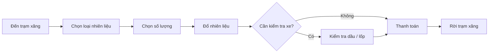

### Mẫu giao tiếp đơn giản

**Driver:** Hi. Could you fill the tank up, please?

**Attendant:** Sure. What kind of petrol would you like?

**Driver:** Unleaded, please.

**Attendant:** No problem. Would you like me to check the oil?

**Driver:** Yes, please.

**Attendant:** Your oil is a little low.

**Driver:** Okay. Please top it up.

**Attendant:** Sure.

---

# 4. Từ vựng trọng tâm — Core Vocabulary

## 4.1. **gas station**

**Nghĩa:** trạm xăng

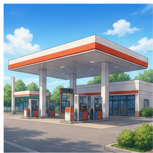

Trong tiếng Anh Mỹ:

**gas station**

Trong tiếng Anh Anh:

**petrol station**

### Ví dụ

* **There's a gas station near here.**
  — Có một trạm xăng gần đây.

* **We need to stop at a petrol station.**
  — Chúng ta cần dừng ở một trạm xăng.

---

## 4.2. **petrol** /ˈpet.rəl/

**Nghĩa:** xăng

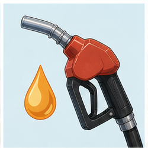

Thường gặp trong tiếng Anh Anh.

### Ví dụ

* **I need some petrol.**
* **The price of petrol is increasing.**

### Chú ý

Trong tiếng Anh Mỹ thường dùng:

**gas / gasoline**

Ví dụ:

**My car has run out of gas.**

---

## 4.3. **gas** /ɡæs/

**Nghĩa trong bài:** xăng, nhiên liệu ô tô

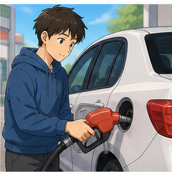

### Ví dụ

* **I need gas.**
* **We've run out of gas.**
* **Where's the nearest gas station?**

Không nên hiểu **gas** trong câu này theo nghĩa "khí".

---

## 4.4. **fuel** /ˈfjuː.əl/

**Nghĩa:** nhiên liệu

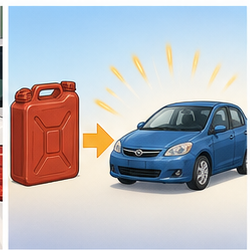

Đây là từ chung hơn.

```text
fuel
├── petrol / gasoline
├── diesel
└── other fuels
```

### Ví dụ

**We're running low on fuel.**

— Chúng ta sắp hết nhiên liệu.

---

## 4.5. **tank** /tæŋk/

**Nghĩa:** bình chứa

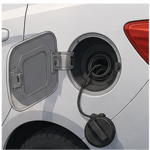

Trong bài thường là:

**fuel tank**

hoặc:

**petrol tank**

### Ví dụ

**How much petrol is there in the tank?**

— Trong bình còn bao nhiêu xăng?

---

## 4.6. **fill up**

**Nghĩa:** đổ đầy

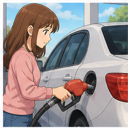

### Cấu trúc

`fill + something + up`

Ví dụ:

* **fill the tank up**
* **fill the car up**
* **fill it up**

### Câu rất phổ biến

**Fill it up, please.**

— Làm ơn đổ đầy bình.

---

## 4.7. **top up**

**Nghĩa:** đổ thêm cho đầy hoặc gần đầy

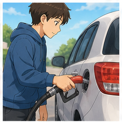

Khác với **fill up**, **top up** thường nhấn mạnh việc bổ sung thêm.

### Ví dụ

**Could you top up the petrol, please?**

— Bạn có thể đổ thêm xăng giúp tôi không?

---

## 4.8. **unleaded petrol**

**Nghĩa:** xăng không chì

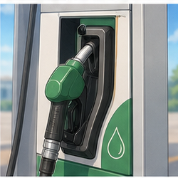

### Ví dụ

**I'd like unleaded, please.**

— Tôi muốn đổ xăng không chì.

Trong giao tiếp thực tế, bạn cũng có thể gặp:

* **regular**
* **premium**
* **diesel**

---

## 4.9. **diesel** /ˈdiː.zəl/

**Nghĩa:** dầu diesel

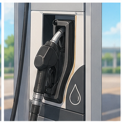

### Ví dụ

**Does this car take petrol or diesel?**

— Chiếc xe này dùng xăng hay diesel?

---

## 4.10. **engine oil**

**Nghĩa:** dầu động cơ, dầu máy

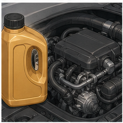

Trong transcript:

**Would you like me to check your oil?**

— Bạn có muốn tôi kiểm tra dầu máy không?

---

## 4.11. **oil**

/ɔɪl/

**Nghĩa trong bài:** dầu động cơ

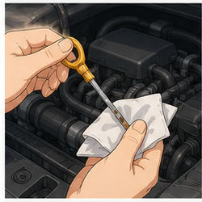

### Ví dụ

* **Do you need any oil?**
* **Could you check the oil?**
* **Your oil is a little low.**

---

## 4.12. **low on oil**

**Nghĩa:** mức dầu thấp, thiếu dầu

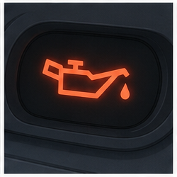

Trong transcript có:

**You're one quart low on oil.**

Người học A1–A2 có thể dùng câu đơn giản hơn:

**Your oil is a little low.**

— Mức dầu của bạn hơi thấp.

---

## 4.13. **tire pressure / tyre pressure**

**Nghĩa:** áp suất lốp

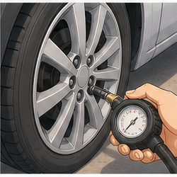

Tiếng Anh Mỹ:

**tire**

Tiếng Anh Anh:

**tyre**

### Ví dụ

**Could you check the tire pressure?**

— Bạn có thể kiểm tra áp suất lốp không?

---

## 4.14. **gauge** /ɡeɪdʒ/

**Nghĩa:** đồng hồ đo

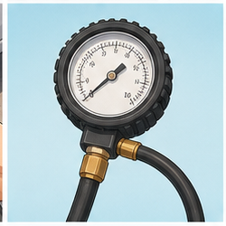

Ví dụ:

**Use the gauge to check the tire pressure.**

— Sử dụng đồng hồ để kiểm tra áp suất lốp.

---

## 4.15. **meter** /ˈmiː.tər/

**Nghĩa:** đồng hồ đo

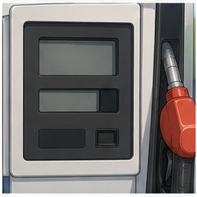

Tại cây xăng, meter có thể hiển thị:

* số lít;
* số gallon;
* giá mỗi đơn vị;
* tổng số tiền.

---

## 4.16. **indicator light**

**Nghĩa:** đèn báo

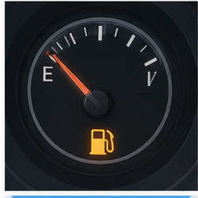

Ví dụ:

**The fuel indicator light is on.**

— Đèn báo nhiên liệu đang sáng.

---

## 4.17. **attendant**

/əˈten.dənt/

**Nghĩa:** nhân viên phục vụ tại trạm xăng

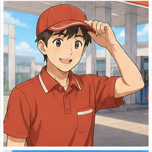

Transcript dùng:

**serviceman**

Trong giao tiếp hiện đại, có thể dùng tự nhiên hơn:

**gas station attendant**

hoặc:

**station attendant**

---

## 4.18. **accessory shop**

**Nghĩa:** cửa hàng phụ kiện

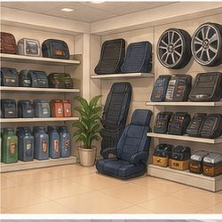

Có thể bán:

* engine oil;
* windshield washer fluid;
* car accessories;
* snacks;
* drinks.

---

## 4.19. **run out of**

**Nghĩa:** dùng hết, hết

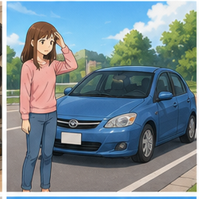

### Cấu trúc

`run out of + noun`

Ví dụ:

* **run out of gas**
* **run out of petrol**
* **run out of fuel**

### Trong bài

**My car has run out of gas.**

— Xe của tôi đã hết xăng.

---

## 4.20. **start**

**Nghĩa trong bài:** khởi động

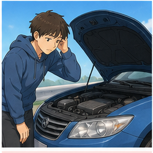

### Ví dụ

**I can't start my car.**

— Tôi không thể khởi động xe.

Tự nhiên hơn:

**My car won't start.**

— Xe của tôi không khởi động được.

---

## 4.21. **tow**

/təʊ/

**Nghĩa:** kéo xe

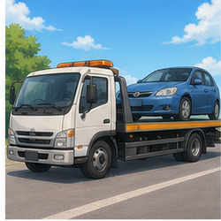

### Ví dụ

**Could you tow me to the nearest gas station?**

— Bạn có thể kéo xe tôi đến trạm xăng gần nhất không?

---

## 4.22. **nearest**

/ˈnɪə.rɪst/

**Nghĩa:** gần nhất

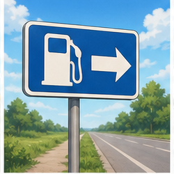

### Ví dụ

**Where's the nearest gas station?**

— Trạm xăng gần nhất ở đâu?

---

## 4.23. **cash**

/kæʃ/

**Nghĩa:** tiền mặt

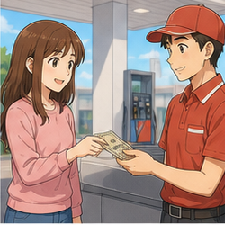

### Ví dụ

**Can I pay in cash?**

— Tôi có thể trả bằng tiền mặt không?

---

## 4.24. **price**

/praɪs/

**Nghĩa:** giá

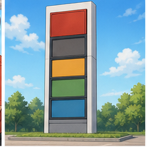

Trong transcript:

**The price of petrol is increasing.**

— Giá xăng đang tăng.

---

# 5. Bảng tổng hợp từ vựng

| English             | IPA          | Nghĩa tiếng Việt  | Example                |
| ------------------- | ------------ | ----------------- | ---------------------- |
| **gas station**     | —            | trạm xăng         | stop at a gas station  |
| **petrol station**  | —            | trạm xăng         | nearest petrol station |
| **petrol**          | /ˈpet.rəl/   | xăng              | buy petrol             |
| **gas**             | /ɡæs/        | xăng              | run out of gas         |
| **fuel**            | /ˈfjuː.əl/   | nhiên liệu        | fuel tank              |
| **tank**            | /tæŋk/       | bình chứa         | fill the tank          |
| **fill up**         | —            | đổ đầy            | fill it up             |
| **top up**          | —            | đổ thêm           | top up the petrol      |
| **unleaded**        | /ʌnˈled.ɪd/  | không chì         | unleaded petrol        |
| **diesel**          | /ˈdiː.zəl/   | dầu diesel        | diesel fuel            |
| **engine oil**      | —            | dầu động cơ       | check the engine oil   |
| **tire pressure**   | —            | áp suất lốp       | check tire pressure    |
| **gauge**           | /ɡeɪdʒ/      | đồng hồ đo        | pressure gauge         |
| **meter**           | /ˈmiː.tər/   | đồng hồ đo        | check the meter        |
| **indicator light** | —            | đèn báo           | fuel indicator light   |
| **attendant**       | /əˈten.dənt/ | nhân viên phục vụ | station attendant      |
| **run out of**      | —            | hết               | run out of gas         |
| **start**           | /stɑːt/      | khởi động         | start the car          |
| **tow**             | /təʊ/        | kéo xe            | tow the car            |
| **nearest**         | /ˈnɪə.rɪst/  | gần nhất          | nearest station        |
| **cash**            | /kæʃ/        | tiền mặt          | pay in cash            |
| **price**           | /praɪs/      | giá               | petrol price           |

---

# 6. Mẫu câu giao tiếp — Useful Patterns

## 6.1. Yêu cầu đổ đầy bình

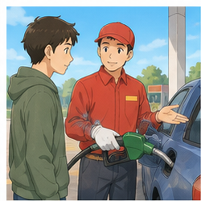

### **Fill it up, please.**

— Làm ơn đổ đầy bình.

Đây là một trong những cách ngắn và tự nhiên nhất.

Có thể nói đầy đủ hơn:

**Could you fill the tank up, please?**

Hoặc:

**Please fill the car up with petrol.**

---

## 6.2. Nói loại nhiên liệu mình muốn

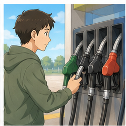

### **I'd like unleaded, please.**

— Tôi muốn xăng không chì.

Có thể thay bằng:

* **Regular, please.**
* **Premium, please.**
* **Diesel, please.**

---

## 6.3. Hỏi loại xăng

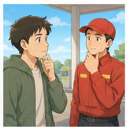

### **What kind of petrol do you have?**

— Bạn có những loại xăng nào?

Cách khác:

**What types of fuel do you have?**

---

## 6.4. Hỏi loại dầu động cơ

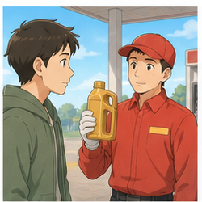

### **What sort of oil do you have?**

— Bạn có những loại dầu nào?

Hoặc:

**What type of engine oil do you have?**

---

## 6.5. Hỏi lượng xăng trong bình

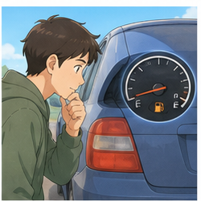

### **How much petrol is there in the tank?**

— Trong bình có bao nhiêu xăng?

Tự nhiên hơn khi nói về xe của mình:

**How much fuel is left in the tank?**

— Trong bình còn bao nhiêu nhiên liệu?

---

## 6.6. Nói xe đã hết xăng

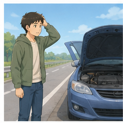

### **My car has run out of gas.**

— Xe của tôi đã hết xăng.

Cách khác:

**I've run out of petrol.**

**We're out of fuel.**

---

## 6.7. Nói xe sắp hết xăng

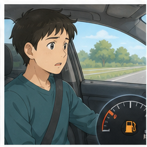

### **We're running low on gas.**

— Chúng ta sắp hết xăng.

Phân biệt:

```text
running low on gas
= vẫn còn một ít

run out of gas
= đã hết hoàn toàn
```

---

## 6.8. Yêu cầu đổ thêm nhiên liệu

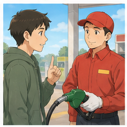

### **Could you top it up, please?**

— Bạn có thể đổ thêm cho đầy giúp tôi không?

Trong transcript:

**Top up the petrol, please.**

---

## 6.9. Nhờ kiểm tra dầu

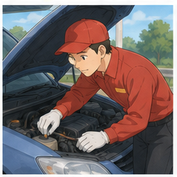

### **Could you check the oil, please?**

— Bạn có thể kiểm tra dầu máy giúp tôi không?

Nhân viên có thể hỏi:

**Would you like me to check your oil?**

— Bạn có muốn tôi kiểm tra dầu không?

---

## 6.10. Nói mức dầu thấp

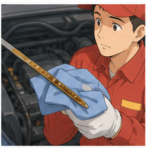

### **Your oil is a little low.**

— Mức dầu của bạn hơi thấp.

Cách cụ thể hơn trong transcript:

**You're one quart low on oil.**

Với trình độ A1–A2, nên ưu tiên:

**Your oil is low.**

---

## 6.11. Nhờ kiểm tra áp suất lốp

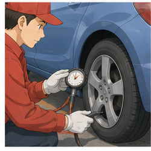

### **Could you check the tire pressure?**

— Bạn có thể kiểm tra áp suất lốp giúp tôi không?

Hoặc:

**Could you check my tires, please?**

---

## 6.12. Nhờ trợ giúp khi xe không khởi động

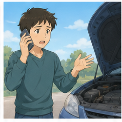

### **Excuse me. My car won't start. Could you help me?**

— Xin lỗi. Xe của tôi không khởi động được. Bạn có thể giúp tôi không?

Trong transcript:

**I can't start my car. Could you possibly help me?**

Cả hai đều đúng.

---

## 6.13. Hỏi xe có vấn đề gì

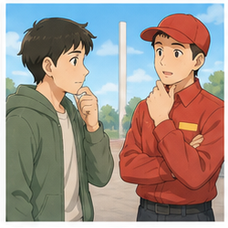

### **Is there anything wrong with my car?**

— Xe của tôi có vấn đề gì không?

Hoặc:

**What's wrong with my car?**

— Xe của tôi bị sao vậy?

---

## 6.14. Nói vấn đề không nghiêm trọng

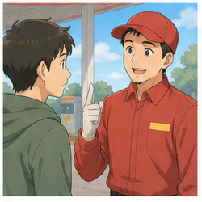

### **It's nothing serious.**

— Không có gì nghiêm trọng.

Ví dụ:

**It's nothing serious. You've just run out of gas.**

— Không có vấn đề gì nghiêm trọng. Bạn chỉ hết xăng thôi.

---

## 6.15. Nhờ kéo xe

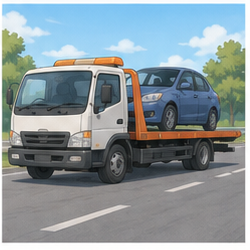

### **Could you tow me to the nearest gas station?**

— Bạn có thể kéo xe tôi đến trạm xăng gần nhất không?

Cách khác:

**Could you help me get to the nearest gas station?**

---

## 6.16. Hỏi trạm xăng gần nhất

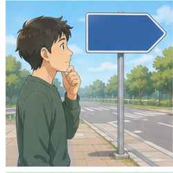

### **Where's the nearest gas station?**

— Trạm xăng gần nhất ở đâu?

Cấu trúc:

`Where's the nearest + place?`

Ví dụ:

* **Where's the nearest garage?**
* **Where's the nearest service station?**

---

## 6.17. Hỏi giá

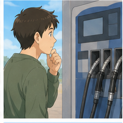

### **How much is it?**

— Hết bao nhiêu tiền?

Hoặc:

**How much do I owe you?**

— Tôi cần trả bạn bao nhiêu?

---

## 6.18. Hỏi phương thức thanh toán

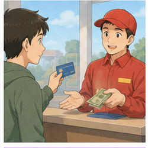

### **Can I pay by card?**

— Tôi có thể thanh toán bằng thẻ không?

### **Can I pay in cash?**

— Tôi có thể trả bằng tiền mặt không?

---

# 7. Quy trình dừng xe và tiếp nhiên liệu

| Bước             | Tiếng Anh                 | Ví dụ                            |
| ---------------- | ------------------------- | -------------------------------- |
| Tìm trạm xăng    | **find a gas station**    | Where's the nearest gas station? |
| Dừng xe          | **pull into the station** | Let's stop here.                 |
| Chọn loại xăng   | **choose the fuel**       | Unleaded, please.                |
| Chọn lượng xăng  | **choose the amount**     | Fill it up, please.              |
| Đổ nhiên liệu    | **fill the tank**         | Could you fill the tank?         |
| Kiểm tra dầu     | **check the oil**         | Could you check the oil?         |
| Kiểm tra lốp     | **check tire pressure**   | Could you check my tires?        |
| Kiểm tra đồng hồ | **check the meter**       | How much is it?                  |
| Thanh toán       | **pay**                   | Can I pay by card?               |
| Rời trạm         | **leave the station**     | Thank you.                       |

### Sơ đồ

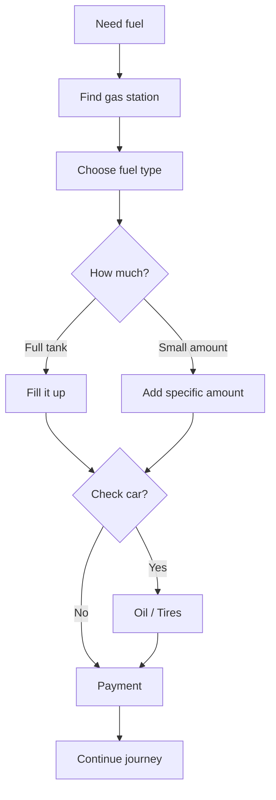

---

# 8. Phân biệt **gas**, **petrol** và **fuel**

## **gas**

Thường dùng trong tiếng Anh Mỹ để chỉ xăng.

**I need some gas.**

---

## **petrol**

Thường dùng trong tiếng Anh Anh.

**I need some petrol.**

---

## **fuel**

Từ chung chỉ nhiên liệu.

**The car needs more fuel.**

---

## Bảng so sánh

| Từ         | Nghĩa      | Cách dùng              |
| ---------- | ---------- | ---------------------- |
| **gas**    | xăng       | phổ biến trong Anh-Mỹ  |
| **petrol** | xăng       | phổ biến trong Anh-Anh |
| **fuel**   | nhiên liệu | từ chung               |

Ví dụ:

```text
US English:
gas station
gas

British English:
petrol station
petrol

General:
fuel
fuel tank
```

---

# 9. Phân biệt **fill up**, **top up** và **run out of**

## **fill up**

Đổ đầy.

**Fill the tank up, please.**

---

## **top up**

Đổ thêm cho đầy hoặc gần đầy.

**Could you top it up?**

---

## **run out of**

Hết hoàn toàn.

**We've run out of gas.**

### Dòng trạng thái

```text
Full tank
    ↓
Use fuel
    ↓
Half tank
    ↓
Running low on fuel
    ↓
Almost empty
    ↓
Run out of gas
```

---

# 10. Phát âm trọng tâm

## 10.1. **petrol**

/ˈpet.rəl/

Trọng âm:

**PET**-rol

---

## 10.2. **gas station**

/ˈɡæs ˌsteɪ.ʃən/

Trọng âm chính:

**GAS** station

---

## 10.3. **fuel**

/ˈfjuː.əl/

Thường có hai âm tiết:

`FU-el`

---

## 10.4. **tank**

/tæŋk/

Chú ý âm cuối:

`/ŋk/`

---

## 10.5. **oil**

/ɔɪl/

Không đọc thành:

`ol`

---

## 10.6. **gauge**

/ɡeɪdʒ/

Đọc gần giống:

`gage`

Không đọc theo cách viết từng chữ.

---

## 10.7. **tire**

/ˈtaɪər/

Tiếng Anh Anh viết:

**tyre**

---

## 10.8. **tow**

/təʊ/

Gần giống:

`toe`

---

## 10.9. **unleaded**

/ʌnˈled.ɪd/

Trọng âm:

un-**LEAD**-ed

---

## 10.10. Nối âm trong hội thoại

### **Fill it up, please.**

Luyện:

`Fill-it-up / please.`

### **My car has run out of gas.**

Luyện:

`My-car-has-run-out-of-gas.`

### **Could you check the oil?**

Luyện:

`Could-you-check-the-oil?`

### **Where's the nearest gas station?**

Luyện:

`Where's-the-nearest-gas-station?`

---

# 11. Hội thoại thực tế — Real-Life Conversation

## Hội thoại 1 — Đổ đầy bình

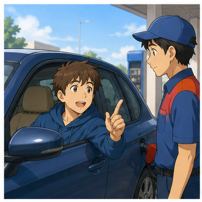

**Attendant:** Hello. How can I help you?

**Driver:** Could you fill the tank up, please?

**Attendant:** Sure. What kind of petrol would you like?

**Driver:** Unleaded, please.

**Attendant:** No problem.

**Driver:** How much is it?

**Attendant:** It's forty pounds.

**Driver:** Can I pay by card?

**Attendant:** Of course.

---

## Hội thoại 2 — Kiểm tra dầu

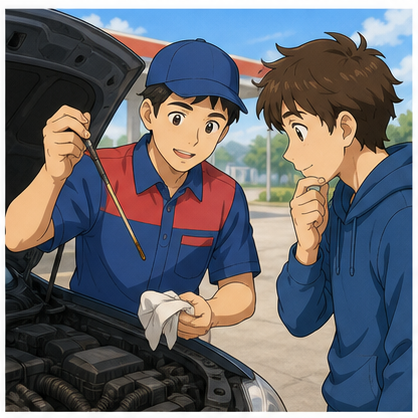

**Attendant:** Would you like me to check your oil?

**Driver:** Yes, please.

**Attendant:** Just a moment.

**Driver:** Sure.

**Attendant:** Your oil is a little low.

**Driver:** What type of oil do you recommend?

**Attendant:** This one should be fine.

**Driver:** Okay. Please top it up.

**Attendant:** No problem.

---

## Hội thoại 3 — Xe hết xăng

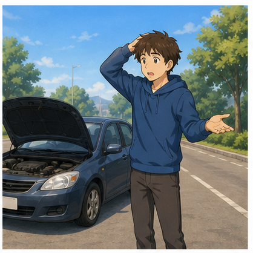

**Driver:** Excuse me. My car won't start. Could you help me?

**Man:** Sure. Let me see what I can do.

**Driver:** Thank you. Is there anything wrong with my car?

**Man:** It's nothing serious. You've just run out of gas.

**Driver:** Oh, thank goodness.

**Driver:** Where's the nearest gas station?

**Man:** It's about two kilometers from here.

**Driver:** Could you help me get there?

**Man:** Sure. No problem.

---

## Hội thoại 4 — Nhờ kéo xe

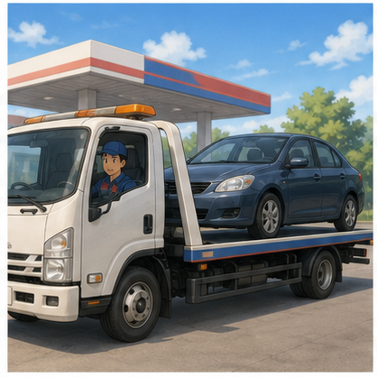

**Driver:** Excuse me. Could you possibly help me?

**Driver 2:** Sure. What's wrong?

**Driver:** My car has run out of gas.

**Driver 2:** I see.

**Driver:** Could you tow me to the nearest petrol station?

**Driver 2:** Sure. It's not far from here.

**Driver:** Thank you so much.

**Driver 2:** No problem.

---

## Hội thoại 5 — Kiểm tra lốp

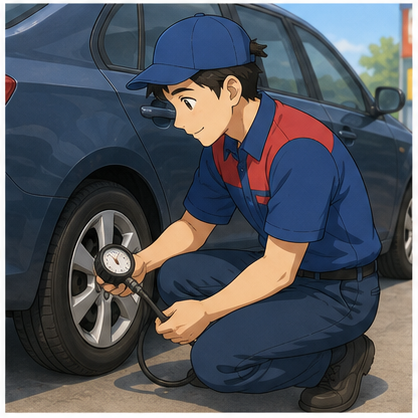

**Driver:** Excuse me. Could you check my tire pressure?

**Attendant:** Sure.

**Driver:** I think one tire is a little low.

**Attendant:** Let me check it with the gauge.

**Driver:** Is everything okay?

**Attendant:** The front-left tire needs a little more air.

**Driver:** Could you fill it, please?

**Attendant:** Of course.

---

## Hội thoại 6 — Đổ một lượng xăng nhất định

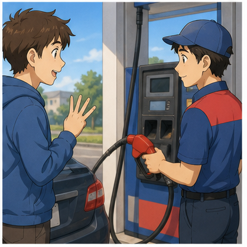

**Attendant:** Hi. What can I get for you?

**Driver:** Twenty dollars of regular, please.

**Attendant:** Sure.

**Driver:** Could you also check the oil?

**Attendant:** No problem.

**Driver:** Is the oil level okay?

**Attendant:** Yes. Everything looks fine.

**Driver:** Great. How much altogether?

**Attendant:** Twenty dollars.

**Driver:** Thanks.

---

# 12. Natural Expressions — Cách nói tự nhiên

| Cụm từ                                 | Nghĩa                                         | Khi dùng        |
| -------------------------------------- | --------------------------------------------- | --------------- |
| **Fill it up, please.**                | Làm ơn đổ đầy bình.                           | Đổ xăng         |
| **Could you fill the tank up?**        | Bạn có thể đổ đầy bình không?                 | Đổ xăng         |
| **Unleaded, please.**                  | Xăng không chì nhé.                           | Chọn nhiên liệu |
| **What kind of petrol do you have?**   | Bạn có loại xăng nào?                         | Hỏi nhiên liệu  |
| **Twenty dollars, please.**            | Cho tôi 20 đô tiền xăng.                      | Chọn số tiền    |
| **Could you top it up?**               | Bạn có thể đổ thêm cho đầy không?             | Thêm nhiên liệu |
| **How much fuel is left?**             | Còn bao nhiêu nhiên liệu?                     | Kiểm tra bình   |
| **We're running low on gas.**          | Chúng ta sắp hết xăng.                        | Cảnh báo        |
| **We've run out of gas.**              | Chúng ta đã hết xăng.                         | Hết nhiên liệu  |
| **Could you check the oil?**           | Bạn kiểm tra dầu giúp tôi được không?         | Bảo dưỡng       |
| **Your oil is a little low.**          | Mức dầu hơi thấp.                             | Kiểm tra dầu    |
| **What type of oil do you recommend?** | Bạn đề xuất loại dầu nào?                     | Chọn dầu        |
| **Could you check my tire pressure?**  | Bạn kiểm tra áp suất lốp giúp tôi được không? | Kiểm tra lốp    |
| **My car won't start.**                | Xe tôi không khởi động được.                  | Sự cố           |
| **Could you help me?**                 | Bạn có thể giúp tôi không?                    | Nhờ giúp        |
| **What's wrong with my car?**          | Xe tôi bị sao vậy?                            | Hỏi sự cố       |
| **It's nothing serious.**              | Không có gì nghiêm trọng.                     | Trấn an         |
| **Where's the nearest gas station?**   | Trạm xăng gần nhất ở đâu?                     | Hỏi đường       |
| **Could you tow my car?**              | Bạn có thể kéo xe tôi không?                  | Sự cố           |
| **How much is it?**                    | Hết bao nhiêu tiền?                           | Thanh toán      |
| **Can I pay by card?**                 | Tôi có thể trả bằng thẻ không?                | Thanh toán      |
| **Can I pay in cash?**                 | Tôi có thể trả tiền mặt không?                | Thanh toán      |
| **Just a moment, please.**             | Vui lòng chờ một chút.                        | Nhân viên       |
| **Sure, no problem.**                  | Được, không vấn đề gì.                        | Phản hồi        |
| **Thank you so much.**                 | Cảm ơn bạn rất nhiều.                         | Kết thúc        |

---

# 13. Lỗi thường gặp — Common Mistakes

## Lỗi 1: Nhầm **gas station** với **gas**

❌ **I'm going to the gas.**

✅ **I'm going to the gas station.**

---

## Lỗi 2: Dùng **petrol station** nhưng nói **gas** không nhất quán

Không phải lỗi ngữ pháp, nhưng người mới học nên biết hai hệ:

```text
American English:
gas
gas station

British English:
petrol
petrol station
```

---

## Lỗi 3: Nói **fill full my car**

❌ **Please fill full my car.**

✅ **Please fill the tank up.**

✅ **Fill it up, please.**

---

## Lỗi 4: Nói **full up the car**

❌ **Full up the car, please.**

✅ **Fill up the car, please.**

Ở đây cần động từ:

**fill**

không phải tính từ:

**full**

---

## Lỗi 5: Nhầm **fill** và **full**

**fill** = động từ

**full** = tính từ

Ví dụ:

**Please fill the tank.**

**The tank is full.**

---

## Lỗi 6: Nói **My car run out of gas**

❌ **My car run out of gas.**

✅ **My car has run out of gas.**

Hoặc:

✅ **I ran out of gas.**

---

## Lỗi 7: Dùng sai thì với **run out**

Khi xe đã hết xăng và hiện tại vẫn hết:

✅ **We've run out of gas.**

Kể lại chuyện trong quá khứ:

✅ **We ran out of gas yesterday.**

---

## Lỗi 8: Nói **My car can't start itself**

Không cần phức tạp như vậy.

✅ **My car won't start.**

Đây là cách nói rất tự nhiên.

---

## Lỗi 9: Nói **check oil for me**

Có thể hiểu được nhưng nên dùng:

✅ **Could you check the oil, please?**

Hoặc:

✅ **Could you check my oil?**

---

## Lỗi 10: Nhầm **oil** với **petrol**

**petrol / gas**

→ nhiên liệu giúp động cơ vận hành.

**engine oil**

→ dầu bôi trơn động cơ.

Không phải cùng một thứ.

---

## Lỗi 11: Nói **How many petrol?**

❌ **How many petrol do I need?**

**petrol** là danh từ không đếm được.

✅ **How much petrol do I need?**

---

## Lỗi 12: Dùng **many gas**

❌ **How many gas is left?**

✅ **How much gas is left?**

---

## Lỗi 13: Nói **Where is near gas station?**

❌ **Where is near gas station?**

✅ **Where's the nearest gas station?**

---

## Lỗi 14: Dùng câu quá dài

Thay vì:

❌ **Could you possibly tell me if maybe you can put some petrol into my car because I think it doesn't have enough fuel?**

Nói:

✅ **Could you fill the tank up, please?**

Câu ngắn dễ nghe và tự nhiên hơn.

---

# 14. Luyện tập có hướng dẫn

## Bài 1 — Nối từ với nghĩa

1. petrol
2. tank
3. engine oil
4. gauge
5. tire pressure
6. attendant
7. tow
8. fuel

A. kéo xe
B. dầu động cơ
C. nhiên liệu
D. bình chứa
E. áp suất lốp
F. xăng
G. nhân viên phục vụ
H. đồng hồ đo

<details>
<summary>Đáp án</summary>

1–F
2–D
3–B
4–H
5–E
6–G
7–A
8–C

</details>

---

## Bài 2 — Điền từ

Dùng:

`tank` · `gas` · `oil` · `station` · `fill`

1. Could you ______ the tank up?
2. My car has run out of ______.
3. Could you check the ______?
4. Where's the nearest gas ______?
5. How much fuel is there in the ______?

<details>
<summary>Đáp án</summary>

1. fill
2. gas
3. oil
4. station
5. tank

</details>

---

## Bài 3 — Chọn **fill up**, **top up** hoặc **run out of**

1. Could you ______ the tank, please?
2. We have completely ______ gas.
3. The tank is almost full. Could you just ______ it?
4. I always ______ before a long trip.

<details>
<summary>Đáp án gợi ý</summary>

1. fill up
2. run out of
3. top up
4. fill up

</details>

---

## Bài 4 — Chọn câu đúng

### 1. Bạn muốn đổ đầy bình.

A. Full it, please.
B. Fill it up, please.
C. Make it full petrol.

**Đáp án:** B

---

### 2. Xe đã hết xăng.

A. My car has run out of gas.
B. My car has out gas.
C. My car finished gas.

**Đáp án:** A

---

### 3. Bạn muốn kiểm tra dầu.

A. Could you check the oil?
B. Could you see oil me?
C. Could you look my petrol oil?

**Đáp án:** A

---

### 4. Bạn muốn tìm trạm xăng gần nhất.

A. Where gas station nearest?
B. Where is gas near?
C. Where's the nearest gas station?

**Đáp án:** C

---

### 5. Xe không khởi động.

A. My car doesn't opening.
B. My car won't start.
C. My car cannot beginning.

**Đáp án:** B

---

## Bài 5 — Hoàn thành hội thoại

**Attendant:** Hello. How can I help you?

**Driver:** Could you ______ the tank up, please?

**Attendant:** Sure. What kind of ______ would you like?

**Driver:** Unleaded, please.

**Attendant:** Would you like me to check your ______?

**Driver:** Yes, please.

**Attendant:** Your oil is a little ______.

**Driver:** Okay. Could you top it ______?

<details>
<summary>Đáp án</summary>

1. fill
2. petrol / fuel
3. oil
4. low
5. up

</details>

---

## Bài 6 — Viết câu hoàn chỉnh

### 1.

`fill / tank / please`

→ ______________________________________

### 2.

`car / run out / gas`

→ ______________________________________

### 3.

`check / oil / could you`

→ ______________________________________

### 4.

`nearest / gas station / where`

→ ______________________________________

### 5.

`car / not start`

→ ______________________________________

<details>
<summary>Đáp án gợi ý</summary>

1. **Could you fill the tank up, please?**
2. **My car has run out of gas.**
3. **Could you check the oil?**
4. **Where's the nearest gas station?**
5. **My car won't start.**

</details>

---

# 15. Speaking Challenge

## Challenge 1 — Thay đổi thông tin

Nói lại hội thoại:

**Attendant:** What kind of fuel would you like?

**Driver:** Unleaded, please.

**Attendant:** How much?

**Driver:** Fill it up, please.

Sau đó thay đổi:

* loại nhiên liệu;
* số tiền;
* lượng nhiên liệu;
* phương thức thanh toán.

Ví dụ:

**Twenty dollars of regular, please.**

---

## Challenge 2 — Tạo 5 câu hỏi

Tạo năm câu hỏi có thể sử dụng tại trạm xăng.

Gợi ý:

1. loại nhiên liệu;
2. giá nhiên liệu;
3. dầu động cơ;
4. áp suất lốp;
5. thanh toán.

Ví dụ:

**Could you check the oil, please?**

---

## Challenge 3 — Role-play 60 giây

### Vai A — Driver

Bạn:

* sắp hết xăng;
* đến trạm xăng;
* muốn đổ đầy bình;
* muốn dùng unleaded;
* muốn kiểm tra dầu;
* muốn kiểm tra áp suất lốp;
* muốn thanh toán bằng thẻ.

### Vai B — Attendant

Bạn cần:

* hỏi loại nhiên liệu;
* hỏi lượng nhiên liệu;
* đổ xăng;
* hỏi có muốn kiểm tra dầu không;
* báo mức dầu;
* kiểm tra lốp;
* thông báo tổng số tiền.

---

## Challenge 4 — Xe hết xăng giữa đường

Tạo hội thoại ít nhất 8 lượt sử dụng:

* **run out of gas**
* **car won't start**
* **could you help me**
* **nearest gas station**
* **tow**
* **nothing serious**

---

# 16. Practice Mission

Trong hôm nay, hãy viết hoặc nói một đoạn hội thoại **8–10 lượt** cho tình huống:

> **Bạn đang lái xe thì nhận ra xe gần hết xăng. Bạn dừng ở một trạm xăng, đổ nhiên liệu và nhờ nhân viên kiểm tra dầu động cơ.**

Đoạn hội thoại phải sử dụng ít nhất:

* **5 từ vựng mới**;
* **3 mẫu câu của bài**;
* **1 câu yêu cầu đổ xăng**;
* **1 câu hỏi về dầu động cơ**;
* **1 câu hỏi về thanh toán**.

### Những từ nên cố gắng sử dụng

`gas station` · `petrol` · `fuel` · `tank` · `fill up` · `engine oil` · `tire pressure` · `unleaded`

Ví dụ bắt đầu:

**Attendant:** Hello. How can I help you?

**Driver:** Hi. Could you fill the tank up, please?

---

# 17. Checklist hoàn thành

Sau bài học, hãy tự kiểm tra:

* [ ] Tôi hiểu **gas station** và **petrol station**.
* [ ] Tôi phân biệt được **gas**, **petrol** và **fuel**.
* [ ] Tôi biết **tank** nghĩa là gì.
* [ ] Tôi biết nói **Fill it up, please.**
* [ ] Tôi biết yêu cầu loại nhiên liệu mình muốn.
* [ ] Tôi hiểu **unleaded petrol**.
* [ ] Tôi biết sử dụng **top up**.
* [ ] Tôi biết nói **My car has run out of gas.**
* [ ] Tôi phân biệt **running low on gas** và **run out of gas**.
* [ ] Tôi biết nhờ kiểm tra **engine oil**.
* [ ] Tôi biết nhờ kiểm tra **tire pressure**.
* [ ] Tôi biết nói **My car won't start.**
* [ ] Tôi biết hỏi trạm xăng gần nhất.
* [ ] Tôi biết nhờ kéo xe khi cần.
* [ ] Tôi biết hỏi tổng số tiền.
* [ ] Tôi có thể duy trì hội thoại ít nhất 8 lượt.

---

# 18. Câu hỏi cuối bài

Hãy tưởng tượng bạn đang lái xe ở một quốc gia nói tiếng Anh.

Đèn báo nhiên liệu bật sáng và bạn vừa nhìn thấy một trạm xăng.

**Bạn sẽ nói gì với nhân viên tại trạm xăng?**

Hãy trả lời bằng **3–5 câu tiếng Anh**.

Gợi ý:

* loại nhiên liệu bạn muốn;
* lượng nhiên liệu;
* kiểm tra dầu;
* thanh toán.

---

# Instructor Notes

* **Module:** 04 — Around Town / Giao tiếp trong thành phố
* **Lesson:** 23 — Dừng xe để tiếp nhiên liệu
* **Topic:** The Gas Station
* **Trình độ:** A1–A2
* **Thời lượng gợi ý:** 8–12 phút video chính + 5–10 phút luyện nói.
* Tập trung vào giao tiếp thực tế thay vì yêu cầu người học ghi nhớ tất cả thuật ngữ kỹ thuật về ô tô.
* Có thể giới thiệu song song hai hệ từ vựng:

```text
American English
gas
gas station
tire

British English
petrol
petrol station
tyre
```

* Cho người học luyện theo chuỗi:

```text
Need fuel
    ↓
Find gas station
    ↓
Choose fuel
    ↓
Fill tank
    ↓
Check oil / tires
    ↓
Pay
    ↓
Continue journey
```

* Nhấn mạnh ba nhóm dễ nhầm:

```text
gas ↔ petrol ↔ fuel

fill ↔ full

running low ↔ run out
```

* Các từ trong video như **leaded petrol**, **serviceman** hoặc một số cách diễn đạt cũ có thể giới thiệu để người học nhận diện, nhưng khi luyện nói nên ưu tiên:

```text
unleaded petrol
gas station attendant
Fill it up, please.
Could you check the oil?
Could you check the tire pressure?
```

* Transcript có câu nghe giống:

```text
Can you fill my bag up with unlimited, please?
```

Không nên đưa nguyên câu này vào bài học. Câu hợp lý theo ngữ cảnh là:

```text
Can you fill my tank up with unleaded, please?
```

Tự nhiên và ngắn hơn:

```text
Fill it up with unleaded, please.
```

* Transcript có:

```text
You've just simply ran out of gas.
```

Khi dạy ngữ pháp nên chuẩn hóa thành:

```text
You've just run out of gas.
```

Hoặc đơn giản:

```text
You've run out of gas.
```

* Với người học A1–A2, ưu tiên năm câu cốt lõi:

```text
Fill it up, please.

I'd like unleaded, please.

Could you check the oil?

My car has run out of gas.

Where's the nearest gas station?
```

* Có thể chia lớp thành cặp:

  * Student A = **Driver**
  * Student B = **Gas Station Attendant**

* Role-play nâng cao có thể thêm tình huống:

```text
Car won't start
    ↓
Ask for help
    ↓
Check the problem
    ↓
Run out of gas
    ↓
Find nearest gas station
    ↓
Tow / get fuel
```

* Không yêu cầu người học nhớ đơn vị kỹ thuật như **quart**, PSI hoặc thông số dầu động cơ ở bài A1–A2. Mục tiêu chính là có thể yêu cầu trợ giúp bằng tiếng Anh.
* Kết thúc bài bằng role-play 45–60 giây và câu hỏi mở để người học trả lời trong Q&A hoặc worksheet.
