# LESSON 24 — TRAO ĐỔI VỚI DƯỢC SĨ

> **Module 04 — Around Town / Giao tiếp trong thành phố**
> **Chủ đề:** The Pharmacy — Mô tả triệu chứng, hỏi thuốc, sử dụng đơn thuốc và hỏi cách dùng thuốc
> **Trình độ gợi ý:** A1–A2
> **Thời lượng:** 8–12 phút học bài + 5–10 phút luyện nói

---

## 1. Tình huống thực tế — Real-Life Situation

Khi đến **pharmacy** — nhà thuốc, bạn có thể cần:

* nói rằng mình bị đau đầu;
* nói rằng mình bị cảm nặng;
* nói rằng mình bị đau họng;
* hỏi dược sĩ có thuốc gì phù hợp không;
* đưa đơn thuốc;
* nhờ dược sĩ chuẩn bị thuốc theo đơn;
* hỏi cách sử dụng thuốc;
* hỏi mỗi lần cần dùng bao nhiêu;
* hỏi dùng thuốc bao nhiêu lần trong ngày;
* hỏi nên uống thuốc trước hay sau khi ăn;
* hỏi liệu có cần uống thuốc cùng thức ăn không;
* hỏi liệu thuốc có tác dụng phụ không;
* hiểu hướng dẫn **oral administration**;
* hiểu hướng dẫn **external use**;
* hỏi mua thêm một sản phẩm thông thường như tissues;
* hiểu những hướng dẫn cơ bản trên nhãn thuốc.

Người học cần biết cách sử dụng những câu ngắn và tự nhiên như:

* **I've got a terrible headache.**
* **I've got a bad cold.**
* **I've got a sore throat.**
* **Can you give me something for it?**
* **Can you fill this prescription for me?**
* **Does it have any side effects?**
* **How often should I take it?**
* **Should I take it with food?**
* **This medicine will relieve your pain.**
* **Take it before going to bed.**
* **This is for oral administration.**
* **Could I get some tissues as well?**

> **Lưu ý an toàn:** Các câu về liều lượng trong bài này được sử dụng để học **tiếng Anh giao tiếp**, không phải hướng dẫn sử dụng thuốc thực tế. Khi dùng thuốc, luôn làm theo nhãn thuốc, đơn của bác sĩ hoặc hướng dẫn trực tiếp từ dược sĩ.

---

## 2. Mục tiêu bài học — Learning Outcomes

Sau bài học, người học có thể:

1. Hiểu và sử dụng từ **pharmacy**.
2. Phân biệt **pharmacy** và **pharmacist**.
3. Hiểu từ **prescription**.
4. Sử dụng từ **medicine** trong hội thoại cơ bản.
5. Hiểu các từ **tablet**, **aspirin** và **dose**.
6. Mô tả các triệu chứng đơn giản như **headache**, **sore throat** và **bad cold**.
7. Hỏi dược sĩ một sản phẩm phù hợp cho triệu chứng thông thường.
8. Nhờ dược sĩ chuẩn bị thuốc theo đơn.
9. Hỏi cách dùng thuốc.
10. Hiểu **take with food** và **take before eating**.
11. Hiểu **take before going to bed**.
12. Hiểu **oral administration** và **external use**.
13. Hỏi thuốc có tác dụng phụ hay không.
14. Hiểu từ **side effect**.
15. Hiểu cấu trúc **relieve your pain**.
16. Hỏi mua thêm một sản phẩm khác tại nhà thuốc.
17. Mô tả thời gian đã có triệu chứng.
18. Duy trì một cuộc hội thoại tại nhà thuốc ít nhất 6–8 lượt.

---

## 3. Sơ đồ giao tiếp

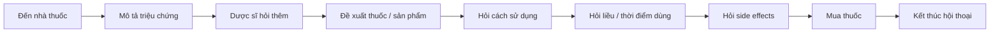

### Mẫu giao tiếp đơn giản

**Customer:** Hello. Can you help me?

**Pharmacist:** Of course. What's the problem?

**Customer:** I've got a terrible headache.

**Pharmacist:** How long have you had it?

**Customer:** For about two hours.

**Pharmacist:** Let me see what we have.

**Customer:** How should I take the medicine?

**Pharmacist:** Please follow the instructions on the label.

**Customer:** Does it have any side effects?

**Pharmacist:** Let me explain them to you.

---

# 4. Từ vựng trọng tâm — Core Vocabulary

## 4.1. **pharmacy** /ˈfɑː.mə.si/

**Nghĩa:** nhà thuốc, hiệu thuốc

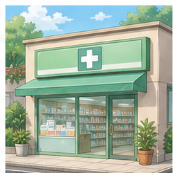

**Ví dụ:**

* **I'm going to the pharmacy.**
  — Tôi đang đi đến nhà thuốc.

* **Is there a pharmacy near here?**
  — Có nhà thuốc nào gần đây không?

### Chú ý

Trong Anh-Anh, bạn cũng có thể gặp:

**chemist's**

Ví dụ:

**I'm going to the chemist's.**

---

## 4.2. **pharmacist** /ˈfɑː.mə.sɪst/

**Nghĩa:** dược sĩ


**Ví dụ:**

* **Could I speak to the pharmacist?**
* **The pharmacist explained how to use the medicine.**

**Phân biệt:**

```text
pharmacy = nhà thuốc
pharmacist = dược sĩ
```

---

## 4.3. **prescription** /prɪˈskrɪp.ʃən/

**Nghĩa:** đơn thuốc

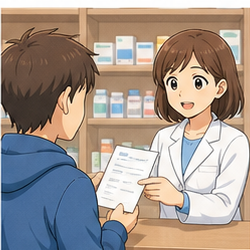

Trong video:

**I'm going to write you a prescription.**

— Tôi sẽ kê đơn thuốc cho bạn.

Tại nhà thuốc:

**Can you fill this prescription for me?**

— Bạn có thể lấy/chuẩn bị thuốc theo đơn này cho tôi không?

### Cụm phổ biến

* **write a prescription** — kê đơn thuốc;
* **get a prescription** — nhận đơn thuốc;
* **fill a prescription** — chuẩn bị/cấp thuốc theo đơn;
* **prescription medicine** — thuốc kê đơn.

---

## 4.4. **medicine** /ˈmed.ɪ.sən/

**Nghĩa:** thuốc

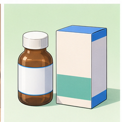

Trong video:

**This medicine will relieve your pain.**

— Thuốc này sẽ giúp giảm đau.

Ví dụ:

**How should I take this medicine?**

— Tôi nên dùng thuốc này như thế nào?

---

## 4.5. **aspirin** /ˈæs.pər.ɪn/

**Nghĩa:** aspirin

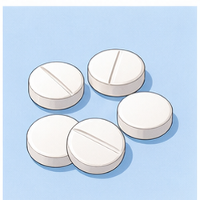

Ví dụ:

**Do you have any aspirin?**

— Bạn có aspirin không?

> Aspirin là tên một loại thuốc cụ thể. Việc có phù hợp với một người hay không phụ thuộc vào nhiều yếu tố, vì vậy không nên tự xem ví dụ ngôn ngữ này là khuyến nghị sử dụng thuốc.

---

## 4.6. **tablet** /ˈtæb.lət/

**Nghĩa:** viên thuốc dạng nén

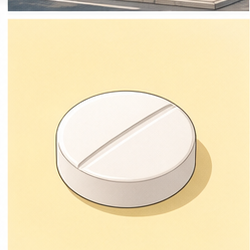

Trong hội thoại:

**Let's try these tablets.**

— Hãy thử những viên thuốc này.

Ví dụ:

**How many tablets should I take?**

— Tôi nên dùng bao nhiêu viên?

---

## 4.7. **dose** /dəʊs/

**Nghĩa:** liều thuốc, lượng thuốc dùng trong một lần

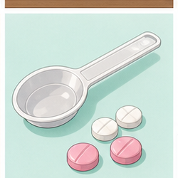

Ví dụ:

**What's the recommended dose?**

— Liều được khuyến nghị là bao nhiêu?

### Chú ý

**dose** thường nói về **lượng thuốc**.

Ví dụ:

```text
one dose
two doses
the correct dose
```

Không tự xác định liều thuốc dựa trên ví dụ học tiếng Anh.

---

## 4.8. **headache** /ˈhed.eɪk/

**Nghĩa:** đau đầu

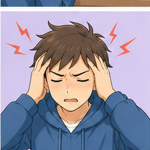

Trong video:

**I've got a terrible headache.**

— Tôi bị đau đầu rất nhiều.

### Cấu trúc

`I've got + symptom`

Ví dụ:

* **I've got a headache.**
* **I've got a terrible headache.**

---

## 4.9. **sore throat** /ˌsɔː ˈθrəʊt/

**Nghĩa:** đau họng

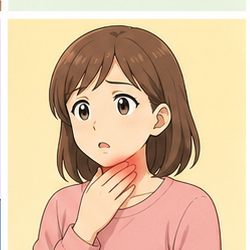

Ví dụ:

**I've got a sore throat.**

— Tôi bị đau họng.

Có thể hỏi:

**Do you have anything for a sore throat?**

— Bạn có sản phẩm gì cho đau họng không?

---

## 4.10. **bad cold**

**Nghĩa:** cảm nặng, cảm khá nghiêm trọng

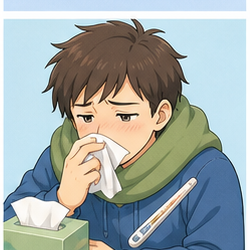

Trong video:

**I've got a bad cold and a headache.**

— Tôi bị cảm nặng và đau đầu.

### Chú ý

Không nói:

❌ **I have a strong cold.**

Tự nhiên hơn:

✅ **I have a bad cold.**

---

## 4.11. **fever** /ˈfiː.vər/

**Nghĩa:** sốt

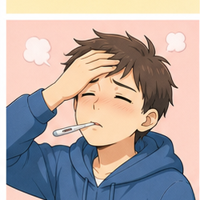

Trong video có cụm:

**keep the fever down**

— giúp hạ/kiểm soát cơn sốt.

Ví dụ:

**I've got a fever.**

— Tôi bị sốt.

---

## 4.12. **relieve** /rɪˈliːv/

**Nghĩa:** làm giảm, làm dịu

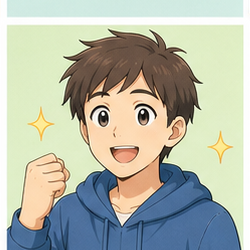

Trong video:

**This medicine will relieve your pain.**

— Thuốc này sẽ giúp giảm đau.

### Cụm phổ biến

* **relieve pain**
* **relieve symptoms**
* **relieve a headache**

---

## 4.13. **pain** /peɪn/

**Nghĩa:** cơn đau

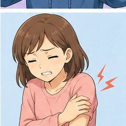

Ví dụ:

**This medicine may help relieve the pain.**

— Thuốc này có thể giúp giảm đau.

### Phân biệt

```text
pain = cơn đau nói chung
headache = đau đầu
sore throat = đau họng
```

---

## 4.14. **side effect**

**Nghĩa:** tác dụng phụ

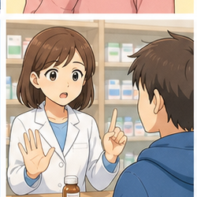

Trong video:

**Does it have any side effects?**

— Thuốc này có tác dụng phụ nào không?

Số nhiều:

**side effects**

Ví dụ:

**Are there any common side effects?**

— Có tác dụng phụ thường gặp nào không?

---

## 4.15. **external use**

**Nghĩa:** dùng ngoài, sử dụng bên ngoài cơ thể

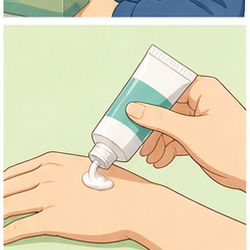

Cụm thường thấy:

**For external use only.**

— Chỉ dùng ngoài.

### Chú ý

Nếu nhãn ghi:

**For external use only**

thì không được hiểu là thuốc dùng để uống.

---

## 4.16. **oral administration**

**Nghĩa:** sử dụng qua đường uống

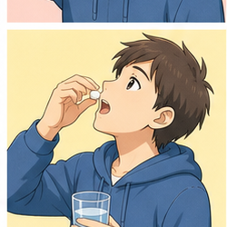

Trong video:

**This is for oral administration.**

— Thuốc này dùng qua đường uống.

### Hiểu đơn giản

```text
oral = liên quan đến miệng
oral administration = sử dụng thuốc qua đường miệng
```

Trong giao tiếp thông thường, bạn cũng có thể nghe:

**Take this by mouth.**

---

## 4.17. **sleeping pill**

**Nghĩa:** thuốc hỗ trợ ngủ / thuốc ngủ

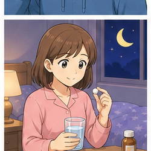

Ví dụ ngôn ngữ:

**This is a sleeping pill.**

Không nên tự sử dụng thuốc ngủ nếu chưa hiểu rõ hướng dẫn và nguy cơ của thuốc.

---

## 4.18. **vaccine** /ˈvæk.siːn/

**Nghĩa:** vắc-xin

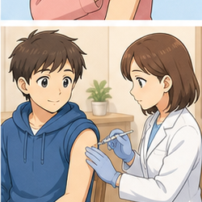

Ví dụ:

**Do you provide vaccines here?**

— Ở đây có cung cấp dịch vụ tiêm vắc-xin không?

Quy định và dịch vụ của nhà thuốc khác nhau tùy quốc gia.

---

## 4.19. **take with food**

**Nghĩa:** dùng thuốc cùng thức ăn / trong bữa ăn hoặc sau khi có thức ăn theo hướng dẫn

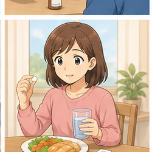

Trong video:

**This medicine should be taken with food.**

— Thuốc này nên được dùng cùng thức ăn.

Có thể hỏi:

**Should I take it with food?**

---

## 4.20. **take before eating**

**Nghĩa:** dùng trước khi ăn

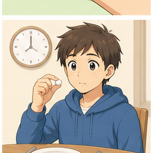

Trong video:

**Take before eating.**

— Dùng trước khi ăn.

Có thể hỏi lại:

**Should I take this before eating?**

---

## 4.21. **take before going to bed**

**Nghĩa:** dùng trước khi đi ngủ


Trong video:

**Take before going to bed.**

— Dùng trước khi đi ngủ.

Cách ngắn hơn:

**Take it before bed.**

---

## 4.22. **tissues**

**Nghĩa:** khăn giấy

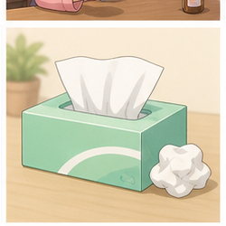

Trong video:

**Could I get some tissues as well?**

— Tôi có thể lấy thêm một ít khăn giấy được không?

### Cụm hữu ích

**as well** = cũng, thêm nữa

---

# 5. Bảng tổng hợp từ vựng

| English                 | IPA             | Nghĩa tiếng Việt    | Example                 |
| ----------------------- | --------------- | ------------------- | ----------------------- |
| **pharmacy**            | /ˈfɑː.mə.si/    | nhà thuốc           | go to the pharmacy      |
| **pharmacist**          | /ˈfɑː.mə.sɪst/  | dược sĩ             | ask the pharmacist      |
| **prescription**        | /prɪˈskrɪp.ʃən/ | đơn thuốc           | fill a prescription     |
| **medicine**            | /ˈmed.ɪ.sən/    | thuốc               | take medicine           |
| **aspirin**             | /ˈæs.pər.ɪn/    | aspirin             | aspirin tablets         |
| **tablet**              | /ˈtæb.lət/      | viên thuốc          | take a tablet           |
| **dose**                | /dəʊs/          | liều thuốc          | recommended dose        |
| **headache**            | /ˈhed.eɪk/      | đau đầu             | have a headache         |
| **sore throat**         | /ˌsɔː ˈθrəʊt/   | đau họng            | have a sore throat      |
| **bad cold**            | —               | cảm nặng            | have a bad cold         |
| **fever**               | /ˈfiː.vər/      | sốt                 | have a fever            |
| **pain**                | /peɪn/          | cơn đau             | relieve pain            |
| **relieve**             | /rɪˈliːv/       | làm giảm            | relieve symptoms        |
| **side effect**         | —               | tác dụng phụ        | side effects            |
| **external use**        | —               | dùng ngoài          | for external use        |
| **oral administration** | —               | dùng qua đường uống | for oral administration |
| **sleeping pill**       | —               | thuốc ngủ           | sleeping pill           |
| **vaccine**             | /ˈvæk.siːn/     | vắc-xin             | get a vaccine           |
| **with food**           | —               | cùng thức ăn        | take with food          |
| **before eating**       | —               | trước khi ăn        | take before eating      |
| **tissues**             | /ˈtɪʃ.uːz/      | khăn giấy           | some tissues            |

---

# 6. Mẫu câu giao tiếp — Useful Patterns

## 6.1. Mô tả đau đầu

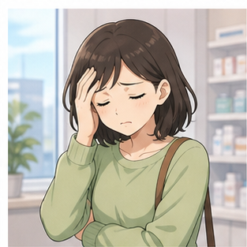

### **I've got a terrible headache.**

— Tôi bị đau đầu rất nhiều.

### Cấu trúc

`I've got + symptom`

Ví dụ:

* **I've got a headache.**
* **I've got a sore throat.**
* **I've got a bad cold.**
* **I've got a fever.**

Ở tiếng Anh-Mỹ, cũng rất phổ biến:

**I have a terrible headache.**

---

## 6.2. Hỏi dược sĩ có thứ gì phù hợp không

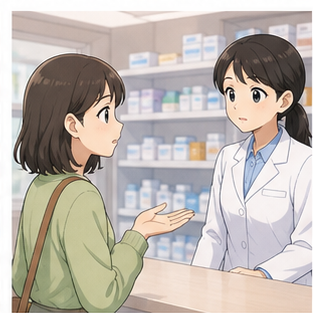

### **Can you give me something for it?**

— Bạn có thể cho tôi thứ gì đó phù hợp với tình trạng này không?

Trong ngữ cảnh:

**I've got a bad cold and a headache. Can you give me something for it?**

Cách khác:

* **Do you have anything for a sore throat?**
* **Is there anything you can recommend?**

---

## 6.3. Hỏi triệu chứng kéo dài bao lâu

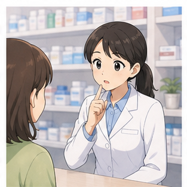

### **How long have you had that for?**

— Bạn bị tình trạng đó bao lâu rồi?

Câu ngắn hơn:

**How long have you had it?**

Trả lời:

**Only for two or three hours.**

Hoặc:

**Since this morning.**

---

## 6.4. Đưa đơn thuốc

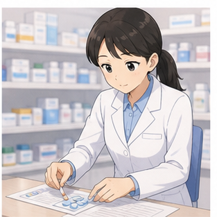

### **Can you fill this prescription for me?**

— Bạn có thể chuẩn bị/cấp thuốc theo đơn này cho tôi không?

Cách khác trong video:

**Can you prepare this prescription?**

Trong thực tế, **fill a prescription** là cách nói rất phổ biến.

---

## 6.5. Hỏi về tác dụng phụ


### **Does it have any side effects?**

— Thuốc này có tác dụng phụ nào không?

Cách khác:

* **Are there any side effects?**
* **Are there any common side effects?**
* **Is there anything I should watch out for?**

Ở trình độ A1–A2, ưu tiên:

**Does it have any side effects?**

---

## 6.6. Hỏi cách sử dụng

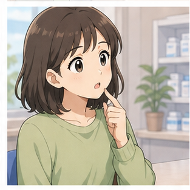

### **How should I take this medicine?**

— Tôi nên dùng thuốc này như thế nào?

Câu này đặc biệt hữu ích vì không cần tự đoán cách dùng.

Có thể hỏi thêm:

* **How often should I take it?**
* **Should I take it with food?**
* **Should I take it before eating?**
* **Should I take it in the morning?**

---

## 6.7. Nói thuốc giúp giảm đau

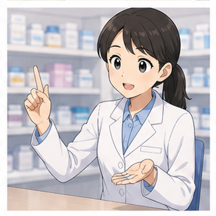

### **This medicine will relieve your pain.**

— Thuốc này sẽ giúp giảm đau.

**relieve + noun**

Ví dụ:

* **relieve pain**
* **relieve symptoms**
* **relieve discomfort**

---

## 6.8. Hướng dẫn dùng cùng thức ăn


### **This medicine should be taken with food.**

— Thuốc này nên được dùng cùng thức ăn.

Câu chủ động đơn giản hơn:

**Take this medicine with food.**

Người mua có thể xác nhận:

**Should I take it with food?**

---

## 6.9. Hướng dẫn trước khi ăn

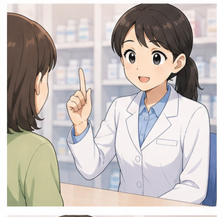

### **Take before eating.**

— Dùng trước khi ăn.

Cách đầy đủ:

**Take this medicine before eating.**

---

## 6.10. Hướng dẫn trước khi đi ngủ

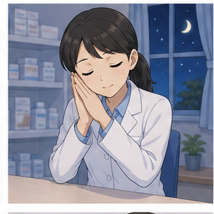

### **Take before going to bed.**

— Dùng trước khi đi ngủ.

Cách tự nhiên khác:

**Take it before bed.**

---

## 6.11. Nói thuốc dùng qua đường uống

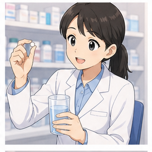

### **This is for oral administration.**

— Thuốc này dùng qua đường uống.

Cụm này tương đối trang trọng và thường xuất hiện trên nhãn/hướng dẫn.

Trong hội thoại:

**Do I take this by mouth?**

— Tôi dùng thuốc này bằng đường uống phải không?

---

## 6.12. Nói thuốc chỉ dùng ngoài

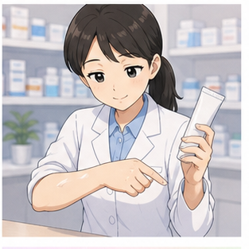

### **For external use only.**

— Chỉ dùng ngoài.

Người học cần nhận diện câu này trên bao bì.

```text
oral administration → dùng qua đường uống

external use → dùng ngoài
```

---

## 6.13. Hỏi mua thêm sản phẩm khác


### **Could I get some tissues as well?**

— Tôi có thể lấy thêm một ít khăn giấy được không?

### Cấu trúc

`Could I get + product + as well?`

Ví dụ:

* **Could I get some tissues as well?**
* **Could I get a bottle of water as well?**

---

## 6.14. Hỏi còn cần gì nữa không

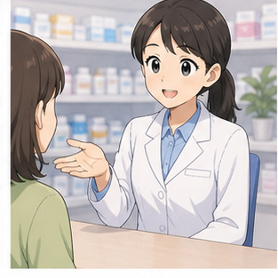

### **Anything else?**

— Bạn còn cần gì nữa không?

Trả lời:

**No, that's it. Thank you.**

— Không, vậy là đủ rồi. Cảm ơn.

---

## 6.15. Chúc người bệnh mau khỏe

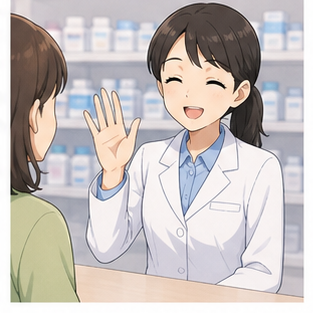

### **Get better soon.**

— Chúc bạn mau khỏe.

Cách phổ biến khác:

**I hope you feel better soon.**

---

# 7. Quy trình giao tiếp tại nhà thuốc

| Bước             | Tiếng Anh                   | Ví dụ                             |
| ---------------- | --------------------------- | --------------------------------- |
| Chào hỏi         | **ask for help**            | Can you help me?                  |
| Mô tả vấn đề     | **describe symptoms**       | I've got a headache.              |
| Nói thời gian    | **say how long**            | Since this morning.               |
| Hỏi sản phẩm     | **ask for something**       | Do you have anything for it?      |
| Đưa đơn          | **show a prescription**     | Can you fill this prescription?   |
| Hỏi cách dùng    | **ask how to take it**      | How should I take it?             |
| Hỏi thời điểm    | **ask when to take it**     | Should I take it with food?       |
| Hỏi tác dụng phụ | **ask about side effects**  | Does it have any side effects?    |
| Mua thêm         | **ask for another product** | Could I get some tissues as well? |
| Kết thúc         | **thank the pharmacist**    | Thank you very much.              |

### Sơ đồ

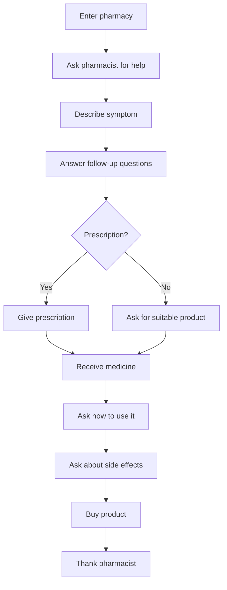

---

# 8. Phân biệt **pharmacy**, **pharmacist** và **prescription**

## **pharmacy**

Địa điểm bán hoặc cấp phát thuốc.

**I'm going to the pharmacy.**

---

## **pharmacist**

Người có chuyên môn làm việc với thuốc tại nhà thuốc.

**Can I speak to the pharmacist?**

---

## **prescription**

Đơn thuốc do người có thẩm quyền kê theo quy định.

**I have a prescription from my doctor.**

---

## Bảng so sánh

| Từ               | Nghĩa     | Ví dụ               |
| ---------------- | --------- | ------------------- |
| **pharmacy**     | nhà thuốc | go to the pharmacy  |
| **pharmacist**   | dược sĩ   | ask the pharmacist  |
| **prescription** | đơn thuốc | fill a prescription |

---

# 9. Phân biệt **tablet**, **pill**, **medicine** và **dose**

## **medicine**

Khái niệm rộng: thuốc.

**This medicine may help relieve your symptoms.**

---

## **tablet**

Một dạng bào chế dạng viên nén.

**Take the tablets as directed.**

---

## **pill**

Cách nói phổ thông cho một viên thuốc.

**sleeping pill**

Không phải mọi loại medicine đều là pill.

---

## **dose**

Lượng thuốc được dùng tại một thời điểm hoặc theo hướng dẫn.

**Follow the recommended dose.**

### Sơ đồ

```text
medicine
   ↓
có nhiều dạng
   ↓
tablet / capsule / liquid / cream / ...

dose
   ↓
lượng sử dụng theo hướng dẫn
```

---

# 10. Phân biệt **oral administration** và **external use**

## **oral administration**

Dùng qua đường miệng.

Ví dụ trên nhãn:

**For oral administration.**

---

## **external use**

Dùng ngoài cơ thể.

Ví dụ:

**For external use only.**

---

## Bảng so sánh

| Cụm                     | Nghĩa                  |
| ----------------------- | ---------------------- |
| **oral administration** | sử dụng qua đường uống |
| **external use**        | sử dụng ngoài cơ thể   |

### Ghi nhớ

```text
ORAL
↓
mouth
↓
by mouth

EXTERNAL
↓
outside
↓
not for swallowing
```

---

# 11. Phát âm trọng tâm

## 11.1. **pharmacy**

/ˈfɑː.mə.si/

Trọng âm:

**PHAR**-ma-cy

---

## 11.2. **pharmacist**

/ˈfɑː.mə.sɪst/

Trọng âm:

**PHAR**-ma-cist

---

## 11.3. **prescription**

/prɪˈskrɪp.ʃən/

Trọng âm:

pre-**SCRIP**-tion

Chú ý:

Không đọc giống từ **description**.

---

## 11.4. **medicine**

/ˈmed.ɪ.sən/

Trọng âm:

**MED**-i-cine

Trong hội thoại nhanh, âm giữa thường khá nhẹ.

---

## 11.5. **tablet**

/ˈtæb.lət/

Trọng âm:

**TAB**-let

---

## 11.6. **headache**

/ˈhed.eɪk/

Trọng âm:

**HEAD**-ache

Chú ý:

**ache** → /eɪk/

Không đọc giống từ **each**.

---

## 11.7. **sore throat**

/ˌsɔː ˈθrəʊt/

Chú ý âm:

`th` → /θ/

Đưa nhẹ đầu lưỡi giữa hai hàm răng.

---

## 11.8. **relieve**

/rɪˈliːv/

Trọng âm:

re-**LIEVE**

---

## 11.9. **side effect**

Trọng âm tự nhiên:

**SIDE** ef-**FECT**

---

## 11.10. **vaccine**

/ˈvæk.siːn/

Anh-Anh thường:

**VAC**-cine

Bạn cũng có thể nghe biến thể phát âm khác tùy vùng.

---

## 11.11. Nối âm trong hội thoại

### **I've got a terrible headache.**

Luyện:

`I've-got-a / terrible-headache.`

### **Can you give me something for it?**

Luyện:

`Can-you-give-me / something-for-it?`

### **Does it have any side effects?**

Luyện:

`Does-it-have-any / side-effects?`

### **Could I get some tissues as well?**

Luyện:

`Could-I-get-some / tissues-as-well?`

### **How long have you had it?**

Luyện:

`How-long-have-you-had-it?`

---

# 12. Hội thoại thực tế — Real-Life Conversation

## Hội thoại 1 — Đau đầu

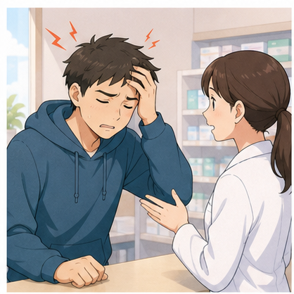

Hội thoại này dựa trên tình huống trong video.

**Customer:** Hello.

**Pharmacist:** Hello. How can I help you?

**Customer:** I've got a terrible headache.

**Pharmacist:** How long have you had that for?

**Customer:** Only for two or three hours.

**Pharmacist:** Okay. Let me see what might be suitable.

**Customer:** How should I take it?

**Pharmacist:** Please follow the instructions on the label.

**Customer:** Does it have any side effects?

**Pharmacist:** Let me explain the important information.

**Customer:** Thank you so much.

**Pharmacist:** Get better soon.

> Trong video gốc có một ví dụ về số viên và khoảng cách giữa các lần dùng. Không nên lấy liều lượng trong hội thoại học tiếng Anh làm hướng dẫn sử dụng thuốc thực tế.

---

## Hội thoại 2 — Bị cảm và đau đầu


Hội thoại dựa sát đoạn hội thoại thứ hai trong video.

**Customer:** Hello. I wonder if you can help me.

**Pharmacist:** Of course. What's the problem?

**Customer:** I've got a bad cold and a headache. Can you give me something for it?

**Pharmacist:** Let me ask you a few questions first.

**Customer:** Sure.

**Pharmacist:** How long have you had these symptoms?

**Customer:** Since yesterday.

**Pharmacist:** Okay. Let me check what may be suitable for you.

**Customer:** Thank you. Could I get some tissues as well?

**Pharmacist:** Sure. Anything else?

**Customer:** No, that's it. Thank you very much.

**Pharmacist:** You're welcome.

---

## Hội thoại 3 — Đưa đơn thuốc

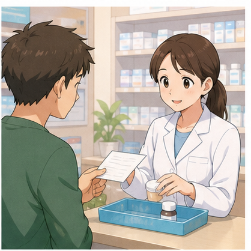

**Customer:** Hello. Can you fill this prescription for me?

**Pharmacist:** Certainly. Let me have a look.

**Customer:** Sure. Here you are.

**Pharmacist:** Thank you. Just a moment, please.

**Customer:** No problem.

**Pharmacist:** Here is your medicine.

**Customer:** How should I take it?

**Pharmacist:** Please follow these instructions carefully.

**Customer:** Should I take it with food?

**Pharmacist:** Let me check the instructions for you.

**Customer:** Thank you.

---

## Hội thoại 4 — Hỏi về tác dụng phụ

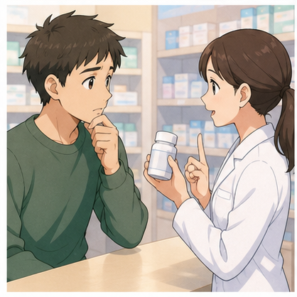

**Customer:** Excuse me. I have a question about this medicine.

**Pharmacist:** Sure. What would you like to know?

**Customer:** Does it have any side effects?

**Pharmacist:** There can be some side effects. Let me explain them.

**Customer:** Is there anything I should watch out for?

**Pharmacist:** Yes. Please read the label carefully, and I'll explain the important points.

**Customer:** Okay.

**Pharmacist:** If you have a serious or unexpected reaction, seek medical advice.

**Customer:** Thank you for letting me know.

---

## Hội thoại 5 — Đau họng


**Customer:** Hello. Could you help me?

**Pharmacist:** Sure. What's the problem?

**Customer:** I've got a sore throat.

**Pharmacist:** How long have you had it?

**Customer:** Since this morning.

**Pharmacist:** Do you have any other symptoms?

**Customer:** I also have a slight headache.

**Pharmacist:** Okay. Let me see what options may be suitable.

**Customer:** Thank you. How should I use it?

**Pharmacist:** Follow the instructions on the package.

---

## Hội thoại 6 — Hỏi hướng dẫn sử dụng


**Customer:** Excuse me. How should I take this medicine?

**Pharmacist:** Let me check the instructions.

**Customer:** Should I take it with food?

**Pharmacist:** Yes, according to these instructions.

**Customer:** Should I take it in the morning?

**Pharmacist:** Follow the timing written here.

**Customer:** Is it for oral administration?

**Pharmacist:** Yes.

**Customer:** Okay. Thank you.

---

# 13. Natural Expressions — Cách nói tự nhiên

| Cụm từ                                      | Nghĩa                                     | Khi dùng          |
| ------------------------------------------- | ----------------------------------------- | ----------------- |
| **How can I help you?**                     | Tôi có thể giúp gì cho bạn?               | Dược sĩ           |
| **I've got a headache.**                    | Tôi bị đau đầu.                           | Mô tả triệu chứng |
| **I've got a sore throat.**                 | Tôi bị đau họng.                          | Mô tả triệu chứng |
| **I've got a bad cold.**                    | Tôi bị cảm nặng.                          | Mô tả triệu chứng |
| **How long have you had it?**               | Bạn bị bao lâu rồi?                       | Hỏi thêm          |
| **Since this morning.**                     | Từ sáng nay.                              | Trả lời           |
| **Can you give me something for it?**       | Có gì phù hợp cho tình trạng này không?   | Hỏi sản phẩm      |
| **Do you have anything for a sore throat?** | Có sản phẩm gì cho đau họng không?        | Hỏi sản phẩm      |
| **Can you fill this prescription for me?**  | Có thể chuẩn bị thuốc theo đơn này không? | Đơn thuốc         |
| **Here you are.**                           | Đây ạ.                                    | Đưa đơn/đồ        |
| **Just a moment, please.**                  | Vui lòng chờ một chút.                    | Dược sĩ           |
| **How should I take it?**                   | Tôi nên dùng nó thế nào?                  | Hỏi cách dùng     |
| **How often should I take it?**             | Tôi nên dùng bao lâu/mấy lần một lần?     | Hỏi tần suất      |
| **Should I take it with food?**             | Tôi có nên dùng cùng thức ăn không?       | Hỏi thời điểm     |
| **Should I take it before eating?**         | Tôi có nên dùng trước khi ăn không?       | Hỏi thời điểm     |
| **Does it have any side effects?**          | Nó có tác dụng phụ nào không?             | Hỏi an toàn       |
| **This medicine will relieve your pain.**   | Thuốc này sẽ giúp giảm đau.               | Giải thích        |
| **For external use only.**                  | Chỉ dùng ngoài.                           | Nhãn thuốc        |
| **For oral administration.**                | Dùng qua đường uống.                      | Hướng dẫn         |
| **Could I get some tissues as well?**       | Tôi lấy thêm khăn giấy được không?        | Mua thêm          |
| **Anything else?**                          | Bạn còn cần gì không?                     | Thanh toán        |
| **No, that's it.**                          | Không, vậy là đủ rồi.                     | Kết thúc mua      |
| **Thank you very much.**                    | Cảm ơn rất nhiều.                         | Kết thúc          |
| **Get better soon.**                        | Chúc mau khỏe.                            | Dược sĩ           |
| **I hope you feel better soon.**            | Mong bạn sớm khỏe hơn.                    | Lời chúc          |

---

# 14. Lỗi thường gặp — Common Mistakes

## Lỗi 1: Nhầm **pharmacy** và **pharmacist**

❌ **I asked the pharmacy about the medicine.**

Nếu muốn nói hỏi một người:

✅ **I asked the pharmacist about the medicine.**

```text
pharmacy = địa điểm
pharmacist = người
```

---

## Lỗi 2: Nói **I have headache**

❌ **I have headache.**

✅ **I have a headache.**

Hoặc:

✅ **I've got a headache.**

**headache** là danh từ đếm được trong cấu trúc này nên cần **a**.

---

## Lỗi 3: Nói **I am headache**

❌ **I am headache.**

✅ **I have a headache.**

✅ **I've got a headache.**

Không dùng **be + headache**.

---

## Lỗi 4: Dịch "tôi bị cảm" thành **I have cold**

❌ **I have cold.**

✅ **I have a cold.**

✅ **I've got a bad cold.**

---

## Lỗi 5: Nhầm **sore throat** với **hurt throat**

❌ **I have a hurt throat.**

Tự nhiên hơn:

✅ **I have a sore throat.**

✅ **I've got a sore throat.**

---

## Lỗi 6: Quên **any** trong câu hỏi về tác dụng phụ

Không sai hoàn toàn:

**Does it have side effects?**

Nhưng tự nhiên hơn:

✅ **Does it have any side effects?**

---

## Lỗi 7: Nói **effect side**

❌ **effect side**

✅ **side effect**

Số nhiều:

✅ **side effects**

---

## Lỗi 8: Nhầm **receipt** và **prescription**

**receipt** = hóa đơn

**prescription** = đơn thuốc

Ví dụ:

✅ **I have a prescription from my doctor.**

---

## Lỗi 9: Nói **make this prescription**

❌ **Can you make this prescription?**

Tự nhiên hơn tại nhà thuốc:

✅ **Can you fill this prescription for me?**

---

## Lỗi 10: Nhầm **medicine** và **medical**

**medicine** = thuốc

**medical** = thuộc về y tế

❌ **Can I take this medical?**

✅ **Can I take this medicine?**

---

## Lỗi 11: Hỏi **How to take this medicine?**

Câu này có thể xuất hiện như tiêu đề, nhưng trong hội thoại nên có chủ ngữ và trợ động từ:

❌ **How to take this medicine?**

✅ **How should I take this medicine?**

---

## Lỗi 12: Nhầm **with food** thành **with foods**

Thông thường:

✅ **Take it with food.**

Không cần dùng:

❌ **Take it with foods.**

---

## Lỗi 13: Nói **before sleep**

Có thể hiểu được, nhưng tự nhiên hơn:

✅ **before going to bed**

Hoặc:

✅ **before bed**

---

## Lỗi 14: Dùng **very headache**

❌ **I have a very headache.**

✅ **I have a bad headache.**

✅ **I have a terrible headache.**

---

## Lỗi 15: Cố tự đưa ra liều lượng khi không chắc

Trong giao tiếp tại nhà thuốc, thay vì đoán:

❌ **I think I should take three tablets.**

Nên hỏi:

✅ **How many should I take?**

✅ **How often should I take it?**

Và làm theo hướng dẫn chuyên môn.

---

# 15. Luyện tập có hướng dẫn

## Bài 1 — Nối từ với nghĩa

1. prescription
2. pharmacist
3. headache
4. sore throat
5. tablet
6. dose
7. side effect
8. external use

A. đau họng
B. dược sĩ
C. đơn thuốc
D. dùng ngoài
E. tác dụng phụ
F. đau đầu
G. viên thuốc
H. liều thuốc

<details>
<summary>Đáp án</summary>

1–C
2–B
3–F
4–A
5–G
6–H
7–E
8–D

</details>

---

## Bài 2 — Điền từ

Dùng:

`prescription` · `headache` · `pharmacist` · `side effects` · `medicine`

1. I've got a terrible ________.
2. Can you fill this ________ for me?
3. How should I take this ________?
4. Does it have any ________?
5. Could I speak to the ________?

<details>
<summary>Đáp án</summary>

1. headache
2. prescription
3. medicine
4. side effects
5. pharmacist

</details>

---

## Bài 3 — Chọn **pharmacy**, **pharmacist** hoặc **prescription**

1. I'm going to the ________.
2. Can I speak to the ________?
3. My doctor gave me a ________.
4. The ________ explained how to use the medicine.
5. Is there a ________ near here?

<details>
<summary>Đáp án</summary>

1. pharmacy
2. pharmacist
3. prescription
4. pharmacist
5. pharmacy

</details>

---

## Bài 4 — Chọn câu đúng

### 1. Bạn bị đau đầu.

A. I am headache.
B. I have headache.
C. I've got a headache.

**Đáp án:** C

---

### 2. Bạn muốn hỏi dược sĩ về tác dụng phụ.

A. Does it have any side effects?
B. Does it have any side affects?
C. It has side effect?

**Đáp án:** A

---

### 3. Bạn muốn nhờ dược sĩ lấy thuốc theo đơn.

A. Can you fill this prescription for me?
B. Can you fill this receipt for me?
C. Can you prescription this for me?

**Đáp án:** A

---

### 4. Bạn muốn hỏi cách dùng thuốc.

A. How I take this medicine?
B. How should I take this medicine?
C. How should take medicine?

**Đáp án:** B

---

### 5. Bạn muốn mua thêm khăn giấy.

A. Could I get some tissues as well?
B. Could I get any tissue also too?
C. Could I taking tissues?

**Đáp án:** A

---

## Bài 5 — Hoàn thành hội thoại

**Customer:** Hello. Can you ________ me?

**Pharmacist:** Sure. What's the problem?

**Customer:** I've got a terrible ________.

**Pharmacist:** How long have you ________ it?

**Customer:** Since this morning.

**Pharmacist:** Okay. Let me check.

**Customer:** Does the medicine have any ________?

**Pharmacist:** Let me explain them.

**Customer:** Thank you. How should I ________ it?

<details>
<summary>Đáp án</summary>

1. help
2. headache
3. had
4. side effects
5. take

</details>

---

## Bài 6 — Hoàn thành câu từ từ khóa

### 1.

`got / headache`

→ ______________________________

### 2.

`fill / prescription / for me`

→ ______________________________

### 3.

`side effects`

→ ______________________________

### 4.

`how / take / medicine`

→ ______________________________

### 5.

`tissues / as well`

→ ______________________________

<details>
<summary>Đáp án gợi ý</summary>

1. **I've got a headache.**
2. **Can you fill this prescription for me?**
3. **Does it have any side effects?**
4. **How should I take this medicine?**
5. **Could I get some tissues as well?**

</details>

---

## Bài 7 — **with food** hay **before eating**

Chọn cụm phù hợp để hoàn thành ví dụ ngôn ngữ.

1. The label says to take it ________.
2. Should I take this medicine ________?
3. It says "take ________."
4. Does this need to be taken ________?

Các đáp án có thể là:

* **with food**
* **before eating**

> Đây là bài luyện đọc hướng dẫn bằng tiếng Anh. Người học không nên áp dụng các câu ví dụ này cho thuốc thực tế nếu chưa kiểm tra đúng nhãn hoặc hướng dẫn chuyên môn.

---

## Bài 8 — Sắp xếp hội thoại

Sắp xếp các câu sau:

A. **How long have you had it?**
B. **I've got a sore throat.**
C. **Hello. How can I help you?**
D. **Since this morning.**
E. **Let me see what may be suitable.**

<details>
<summary>Đáp án</summary>

C → B → A → D → E

</details>

---

# 16. Speaking Challenge

## Challenge 1 — Thay đổi triệu chứng

Nói lại hội thoại:

**A:** Hello. How can I help you?

**B:** I've got a terrible headache.

**A:** How long have you had it?

**B:** Since this morning.

Sau đó thay **headache** bằng:

* **a sore throat**;
* **a bad cold**;
* **a fever**.

---

## Challenge 2 — Tạo 5 câu hỏi

Tạo năm câu hỏi có thể sử dụng tại nhà thuốc.

Gợi ý:

1. hỏi sản phẩm cho một triệu chứng;
2. hỏi cách dùng;
3. hỏi tác dụng phụ;
4. hỏi dùng thuốc cùng thức ăn hay không;
5. hỏi về đơn thuốc.

Ví dụ:

**Does it have any side effects?**

---

## Challenge 3 — Role-play 60 giây

### Vai A — Customer

Bạn:

* bị đau họng;
* bị từ sáng nay;
* muốn hỏi dược sĩ có sản phẩm phù hợp không;
* muốn hỏi cách sử dụng;
* muốn hỏi về tác dụng phụ.

### Vai B — Pharmacist

Bạn cần:

* hỏi vấn đề là gì;
* hỏi triệu chứng kéo dài bao lâu;
* hỏi thêm thông tin cần thiết;
* hướng dẫn người mua đọc và tuân theo nhãn;
* trả lời câu hỏi về cách dùng;
* giải thích thông tin an toàn cơ bản.

---

## Challenge 4 — Đưa đơn thuốc

Tạo hội thoại ít nhất 8 lượt sử dụng:

* **prescription**
* **fill this prescription**
* **medicine**
* **How should I take it?**
* **side effects**
* **with food**

---

## Challenge 5 — Mua thêm sản phẩm

Bắt đầu:

**Customer:** I've got a bad cold and a headache.

Sau đó phải sử dụng:

* **Can you give me something for it?**
* **Could I get some tissues as well?**
* **Anything else?**
* **No, that's it.**
* **Thank you very much.**

---

# 17. Practice Mission

Trong hôm nay, hãy viết hoặc nói một đoạn hội thoại **8–10 lượt** cho tình huống:

> **Bạn đến một nhà thuốc ở nước ngoài vì bị đau đầu và đau họng. Bạn muốn mô tả triệu chứng, hỏi dược sĩ về sản phẩm phù hợp và hỏi cách sử dụng.**

Đoạn hội thoại phải sử dụng ít nhất:

* **5 từ vựng mới**;
* **3 mẫu câu của bài**;
* **1 câu mô tả triệu chứng**;
* **1 câu hỏi về cách sử dụng**;
* **1 câu hỏi về side effects**.

### Những từ nên cố gắng sử dụng

`pharmacy` · `pharmacist` · `medicine` · `headache` · `sore throat` · `tablet` · `prescription` · `side effects`

### Những mẫu câu nên sử dụng

```text
I've got a ...

Can you give me something for it?

How should I take it?

Should I take it with food?

Does it have any side effects?
```

---

# 18. Checklist hoàn thành

Sau bài học, hãy tự kiểm tra:

* [ ] Tôi hiểu **pharmacy** là gì.
* [ ] Tôi phân biệt được **pharmacy** và **pharmacist**.
* [ ] Tôi hiểu **prescription**.
* [ ] Tôi biết nói **I've got a headache.**
* [ ] Tôi biết nói **I've got a sore throat.**
* [ ] Tôi biết nói **I've got a bad cold.**
* [ ] Tôi biết hỏi **Can you give me something for it?**
* [ ] Tôi biết hỏi **Can you fill this prescription for me?**
* [ ] Tôi hiểu **tablet** và **dose**.
* [ ] Tôi biết hỏi **How should I take it?**
* [ ] Tôi biết hỏi **Should I take it with food?**
* [ ] Tôi hiểu **oral administration**.
* [ ] Tôi hiểu **external use**.
* [ ] Tôi biết hỏi **Does it have any side effects?**
* [ ] Tôi biết sử dụng **Could I get some tissues as well?**
* [ ] Tôi có thể duy trì hội thoại tại nhà thuốc ít nhất 8 lượt.

---

# 19. Câu hỏi cuối bài

Hãy tưởng tượng bạn đang đi du lịch ở một quốc gia nói tiếng Anh.

Từ sáng bạn bị đau họng và đau đầu nên quyết định đến một nhà thuốc.

**Bạn sẽ bắt đầu cuộc hội thoại với dược sĩ như thế nào?**

Hãy trả lời bằng **3–5 câu tiếng Anh**.

Ví dụ về thông tin bạn có thể đề cập:

```text
symptom
↓
how long
↓
ask for help
↓
ask how to use the product
```

---

# Instructor Notes

* **Module:** 04 — Around Town / Giao tiếp trong thành phố
* **Lesson:** 24 — Trao đổi với dược sĩ
* **Topic:** The Pharmacy
* **Trình độ:** A1–A2
* **Nguồn nội dung chính:** Video 3 — Pharmacy / Vocabulary for Communication
* **Thời lượng gợi ý:** 8–12 phút video chính + 5–10 phút luyện nói.

Tập trung vào tình huống thực tế hơn là học các tên thuốc riêng lẻ.

Cho người học luyện theo chuỗi:

```text
Enter pharmacy
    ↓
Describe symptom
    ↓
Answer follow-up questions
    ↓
Ask for a suitable product
    ↓
Ask how to use it
    ↓
Ask about side effects
    ↓
Buy product
```

Nhấn mạnh các nhóm dễ nhầm:

```text
pharmacy ↔ pharmacist

prescription ↔ receipt

medicine ↔ medical

tablet ↔ medicine

oral administration ↔ external use
```

Khi dạy phần hội thoại, ưu tiên các câu ngắn:

```text
I've got a headache.

I've got a sore throat.

Can you give me something for it?

How should I take it?

Should I take it with food?

Does it have any side effects?
```

Không yêu cầu người học A1–A2 sử dụng những thuật ngữ y khoa phức tạp.

Ưu tiên khả năng:

1. mô tả triệu chứng đơn giản;
2. hiểu câu hỏi của dược sĩ;
3. hỏi lại khi chưa hiểu;
4. xác nhận cách sử dụng;
5. hỏi về thông tin an toàn.

Có thể chia lớp thành cặp:

* Student A = **Customer / Patient**
* Student B = **Pharmacist**

Cho học viên đổi các triệu chứng:

```text
headache
sore throat
bad cold
fever
```

và luyện cùng một cấu trúc:

```text
I've got a ________.

How long have you had it?

Since ________.

Can you give me something for it?
```

Khi sử dụng các câu về **dose**, giáo viên cần nhấn mạnh rằng đây là bài học tiếng Anh, không phải bài hướng dẫn tự dùng thuốc.

Không nên yêu cầu học viên ghi nhớ một liều cụ thể từ video.

Thay vào đó, luyện các câu hỏi an toàn:

```text
How should I take it?

How often should I take it?

Should I take it with food?

Does it have any side effects?

Could you explain the instructions, please?
```

Nếu triệu chứng được mô tả là nghiêm trọng, kéo dài hoặc ngoài phạm vi xử lý thông thường tại nhà thuốc, nội dung role-play nên chuyển sang:

```text
You should see a doctor.

You should seek medical advice.
```

Kết thúc bài bằng một role-play khoảng **45–60 giây** và câu hỏi mở để người học trả lời trong Q&A hoặc worksheet.
