# LESSON 25 — ĐÁM CƯỚI VÀ HÔN NHÂN

> **Module 04 — Everyday Communication / Giao tiếp đời sống**
>
> **Chủ đề:** Weddings — Đám cưới, tình trạng hôn nhân và các mối quan hệ
>
> **Trình độ gợi ý:** A1–A2
>
> **Thời lượng:** 8–12 phút học bài + 5–10 phút luyện nói

---

## 1. Tình huống thực tế — Real-Life Situation

Trong cuộc sống, bạn có thể cần nói về:

* một đám cưới sắp diễn ra;
* mời bạn bè đến dự đám cưới;
* hỏi một người đã kết hôn hay chưa;
* hỏi một người đã đính hôn hay chưa;
* giới thiệu chồng hoặc vợ;
* nói về một cặp đôi;
* nói về cuộc sống hôn nhân;
* nói về tuần trăng mật;
* nói về nhẫn cưới;
* hỏi về anh rể, em rể hoặc anh/em trai của vợ/chồng;
* nói về người độc thân;
* nói về một người lãng mạn;
* nói về tình yêu và sự chung thủy;
* chúc mừng một người vừa kết hôn;
* nói về kế hoạch tổ chức đám cưới;
* nói rằng mình chưa nghĩ đến chuyện kết hôn.

Người học cần biết sử dụng những câu ngắn và tự nhiên như:

* **I'd love to invite you to my sister's wedding.**
* **Are you engaged?**
* **Are you married?**
* **He is single.**
* **They have been married for two years.**
* **My wedding will be held next month.**
* **They will have their honeymoon in Paris.**
* **What a happy couple!**
* **I haven't thought about marriage yet.**
* **Let's get married.**

---

## 2. Mục tiêu bài học — Learning Outcomes

Sau bài học, người học có thể:

1. Hiểu và sử dụng từ **wedding**.
2. Phân biệt **wedding** và **marriage**.
3. Hiểu các trạng thái **single**, **engaged** và **married**.
4. Hỏi người khác đã kết hôn hay chưa.
5. Hỏi người khác đã đính hôn hay chưa.
6. Nói một người đang độc thân.
7. Nói về **husband** và **wife**.
8. Hiểu và sử dụng **brother-in-law**.
9. Mời ai đó đến dự đám cưới.
10. Nói về **wedding party**.
11. Nói về **wedding ring**.
12. Nói về **honeymoon**.
13. Mô tả một **couple**.
14. Sử dụng tính từ **faithful**, **gentle** và **romantic**.
15. Nói một đám cưới sẽ được tổ chức khi nào.
16. Sử dụng cấu trúc **have been married for...**.
17. Nói rằng mình chưa nghĩ đến chuyện kết hôn.
18. Duy trì một cuộc hội thoại về đám cưới hoặc hôn nhân ít nhất 6–8 lượt.

---

## 3. Sơ đồ giao tiếp

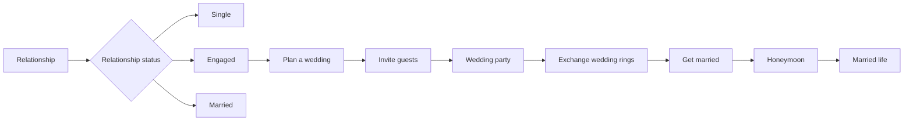

### Mẫu giao tiếp đơn giản

**A:** Are you married?

**B:** Yes. I've been married for two years.

**A:** Really? Congratulations!

**B:** Thank you.

**A:** Did you have a big wedding?

**B:** Yes. We invited our family and friends.

**A:** Where did you go for your honeymoon?

**B:** We went to Paris.

---

# 4. Từ vựng trọng tâm — Core Vocabulary

## 4.1. **wedding** /ˈwed.ɪŋ/

**Nghĩa:** đám cưới, lễ cưới

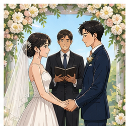

Ví dụ:

* **My wedding will be held next month.**

  — Đám cưới của tôi sẽ được tổ chức vào tháng tới.

* **I'd love to invite you to my sister's wedding.**

  — Tôi rất muốn mời bạn đến dự đám cưới của chị/em gái tôi.

### Cụm phổ biến

* **wedding ceremony** — lễ cưới
* **wedding party** — tiệc cưới / đoàn người tham dự lễ cưới tùy ngữ cảnh
* **wedding ring** — nhẫn cưới
* **wedding day** — ngày cưới

---

## 4.2. **marriage** /ˈmær.ɪdʒ/

**Nghĩa:** hôn nhân

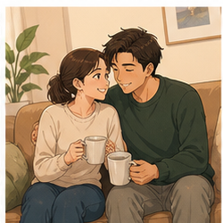

Trong bài:

**I haven't thought about marriage yet.**

— Tôi vẫn chưa nghĩ đến chuyện kết hôn.

### Phân biệt

**wedding** = sự kiện, lễ cưới.

**marriage** = mối quan hệ hôn nhân.

```text
Wedding
= the ceremony / event

Marriage
= the relationship after getting married
```

---

## 4.3. **married** /ˈmær.id/

**Nghĩa:** đã kết hôn

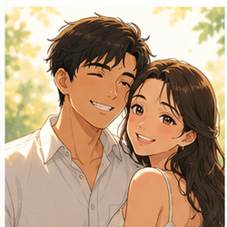

Ví dụ:

* **Are you married?**

  — Bạn đã kết hôn chưa?

* **Audrey and I have been married for two years.**

  — Audrey và tôi đã kết hôn được hai năm.

### Cấu trúc

`be married`

Ví dụ:

**She is married.**

### Thời gian hôn nhân

`have/has been married for + khoảng thời gian`

Ví dụ:

**They have been married for ten years.**

---

## 4.4. **single** /ˈsɪŋ.ɡəl/

**Nghĩa:** độc thân

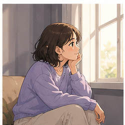

Trong bài:

**He is single.**

— Anh ấy độc thân.

Ví dụ:

**Are you single or married?**

— Bạn độc thân hay đã kết hôn?

---

## 4.5. **engaged** /ɪnˈɡeɪdʒd/

**Nghĩa:** đã đính hôn

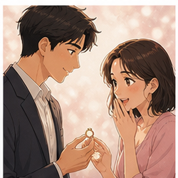

Trong bài:

**Are you engaged?**

— Bạn đã đính hôn chưa?

Ví dụ:

**They got engaged last year.**

— Họ đã đính hôn năm ngoái.

### Chuỗi trạng thái thường gặp

```text
Single
  ↓
Dating
  ↓
Engaged
  ↓
Married
```

---

## 4.6. **couple** /ˈkʌp.əl/

**Nghĩa:** cặp đôi

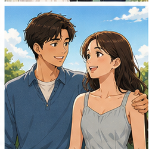

Trong bài:

**What a happy couple!**

— Thật là một cặp đôi hạnh phúc!

Ví dụ:

**They are a lovely couple.**

— Họ là một cặp đôi đáng yêu.

---

## 4.7. **husband** /ˈhʌz.bənd/

**Nghĩa:** chồng

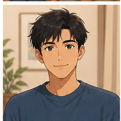

Trong bài:

**My husband is less than two years older than me.**

— Chồng tôi lớn hơn tôi chưa đến hai tuổi.

Ví dụ:

**My husband works in IT.**

— Chồng tôi làm việc trong ngành CNTT.

---

## 4.8. **wife** /waɪf/

**Nghĩa:** vợ

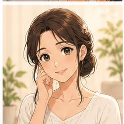

Trong bài:

**My wife is a teacher.**

— Vợ tôi là giáo viên.

### Số nhiều

**wife → wives**

Ví dụ:

**Their wives are friends.**

---

## 4.9. **brother-in-law** /ˈbrʌð.ər.ɪn.lɔː/

**Nghĩa:** anh/em rể hoặc anh/em trai của vợ/chồng

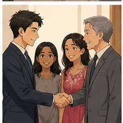

Trong bài:

**What does your brother-in-law do?**

— Anh/em rể của bạn làm nghề gì?

Trả lời:

**He's a freelance ad designer.**

— Anh ấy là nhà thiết kế quảng cáo tự do.

---

## 4.10. **invite** /ɪnˈvaɪt/

**Nghĩa:** mời

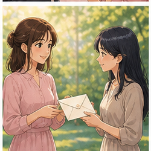

Trong bài:

**I'd love to invite you to my sister's wedding next week.**

— Tôi rất muốn mời bạn đến dự đám cưới của chị/em gái tôi vào tuần tới.

### Cấu trúc

`invite + someone + to + event`

Ví dụ:

* **invite you to my wedding**
* **invite our friends to the party**
* **invite her to dinner**

---

## 4.11. **wedding party**

**Nghĩa:** tiệc cưới; nhóm người tham gia nghi lễ cưới tùy ngữ cảnh

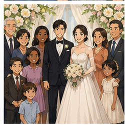

Ví dụ:

**The wedding party starts at six.**

— Tiệc cưới bắt đầu lúc sáu giờ.

---

## 4.12. **wedding ring**

**Nghĩa:** nhẫn cưới

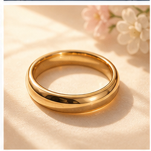

Ví dụ:

**She's wearing a wedding ring.**

— Cô ấy đang đeo nhẫn cưới.

**They exchanged wedding rings.**

— Họ trao nhẫn cưới cho nhau.

---

## 4.13. **diamond** /ˈdaɪə.mənd/

**Nghĩa:** kim cương

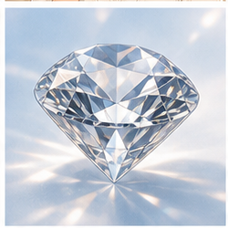

Ví dụ:

**She has a diamond ring.**

— Cô ấy có một chiếc nhẫn kim cương.

### Cụm thường gặp

* **diamond ring**
* **diamond necklace**
* **diamond earrings**

---

## 4.14. **honeymoon** /ˈhʌn.i.muːn/

**Nghĩa:** tuần trăng mật

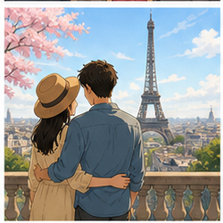

Trong bài:

**They will have a honeymoon in Paris.**

Tự nhiên hơn:

**They will go on their honeymoon in Paris.**

— Họ sẽ đi hưởng tuần trăng mật ở Paris.

### Cụm phổ biến

* **go on a honeymoon**
* **go on their honeymoon**
* **honeymoon destination**

---

## 4.15. **get married**

**Nghĩa:** kết hôn, cưới nhau

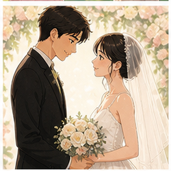

Trong bài:

**Let's get married.**

— Chúng ta kết hôn nhé.

Ví dụ:

**They want to get married next year.**

— Họ muốn kết hôn vào năm sau.

### Phân biệt

**be married** = đang ở trạng thái đã kết hôn.

**get married** = hành động bước vào hôn nhân.

```text
They got married in 2024.
→ Họ cưới nhau vào năm 2024.

They are married.
→ Họ đã kết hôn.
```

---

## 4.16. **married life**

**Nghĩa:** cuộc sống hôn nhân

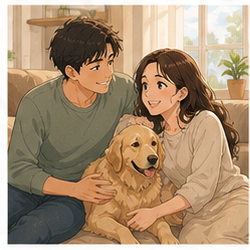

Trong bài:

**Their married life is very happy.**

— Cuộc sống hôn nhân của họ rất hạnh phúc.

Ví dụ:

**How is married life?**

— Cuộc sống hôn nhân thế nào?

---

## 4.17. **faithful** /ˈfeɪθ.fəl/

**Nghĩa:** chung thủy

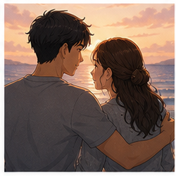

Trong bài:

**He is faithful.**

— Anh ấy chung thủy.

Ví dụ:

**They are faithful to each other.**

— Họ chung thủy với nhau.

---

## 4.18. **romantic** /rəʊˈmæn.tɪk/

**Nghĩa:** lãng mạn

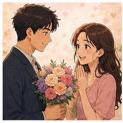

Trong bài:

**He is a romantic man.**

— Anh ấy là một người đàn ông lãng mạn.

Ví dụ:

**That was very romantic.**

— Điều đó thật lãng mạn.

---

## 4.19. **gentle** /ˈdʒen.təl/

**Nghĩa:** dịu dàng, nhẹ nhàng

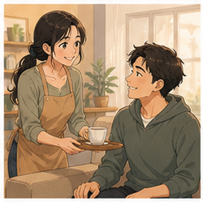

Ví dụ:

**He is kind and gentle.**

— Anh ấy tốt bụng và dịu dàng.

---

## 4.20. **respect** /rɪˈspekt/

**Nghĩa:** tôn trọng

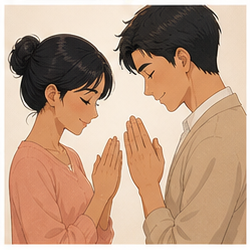

Ví dụ:

**They respect each other.**

— Họ tôn trọng nhau.

### Cấu trúc

`respect + someone`

**I respect my parents.**

---

## 4.21. **praise** /preɪz/

**Nghĩa:** khen ngợi

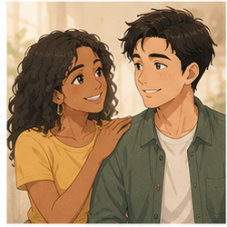

Ví dụ:

**Everyone praised the beautiful wedding.**

— Mọi người đều khen đám cưới đẹp.

---

# 5. Bảng tổng hợp từ vựng

| English            | IPA               | Nghĩa tiếng Việt                    | Example              |
| ------------------ | ----------------- | ----------------------------------- | -------------------- |
| **wedding**        | /ˈwed.ɪŋ/         | đám cưới                            | attend a wedding     |
| **marriage**       | /ˈmær.ɪdʒ/        | hôn nhân                            | think about marriage |
| **married**        | /ˈmær.id/         | đã kết hôn                          | be married           |
| **single**         | /ˈsɪŋ.ɡəl/        | độc thân                            | be single            |
| **engaged**        | /ɪnˈɡeɪdʒd/       | đã đính hôn                         | be engaged           |
| **couple**         | /ˈkʌp.əl/         | cặp đôi                             | a happy couple       |
| **husband**        | /ˈhʌz.bənd/       | chồng                               | my husband           |
| **wife**           | /waɪf/            | vợ                                  | my wife              |
| **brother-in-law** | /ˈbrʌð.ər.ɪn.lɔː/ | anh/em rể; anh/em trai của vợ/chồng | my brother-in-law    |
| **invite**         | /ɪnˈvaɪt/         | mời                                 | invite someone       |
| **wedding party**  | —                 | tiệc cưới                           | wedding party        |
| **wedding ring**   | —                 | nhẫn cưới                           | wear a wedding ring  |
| **diamond**        | /ˈdaɪə.mənd/      | kim cương                           | diamond ring         |
| **honeymoon**      | /ˈhʌn.i.muːn/     | tuần trăng mật                      | go on a honeymoon    |
| **get married**    | —                 | kết hôn                             | get married          |
| **married life**   | —                 | cuộc sống hôn nhân                  | happy married life   |
| **faithful**       | /ˈfeɪθ.fəl/       | chung thủy                          | be faithful          |
| **romantic**       | /rəʊˈmæn.tɪk/     | lãng mạn                            | romantic man         |
| **gentle**         | /ˈdʒen.təl/       | dịu dàng                            | kind and gentle      |
| **respect**        | /rɪˈspekt/        | tôn trọng                           | respect each other   |
| **praise**         | /preɪz/           | khen ngợi                           | praise someone       |

---

# 6. Mẫu câu giao tiếp — Useful Patterns

## 6.1. Mời ai đó đến dự đám cưới

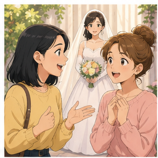

### **I'd love to invite you to my sister's wedding.**

— Tôi rất muốn mời bạn đến dự đám cưới của chị/em gái tôi.

### Cấu trúc

`invite + someone + to + event`

Ví dụ:

* **I'd like to invite you to my wedding.**
* **We invited our friends to the wedding.**
* **Can I invite Tom to the party?**

---

## 6.2. Hỏi tình trạng hôn nhân

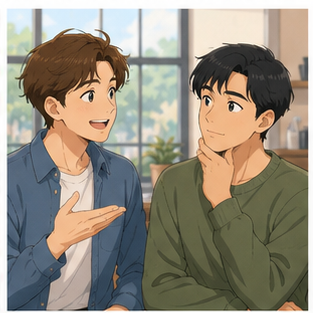

### **Are you married?**

— Bạn đã kết hôn chưa?

Trả lời:

**Yes, I am.**

Hoặc:

**No, I'm single.**

---

## 6.3. Hỏi đã đính hôn chưa

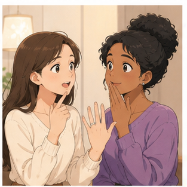

### **Are you engaged?**

— Bạn đã đính hôn chưa?

Trả lời:

**Yes. We got engaged last month.**

Hoặc:

**No, we're not.**

---

## 6.4. Nói đã kết hôn được bao lâu

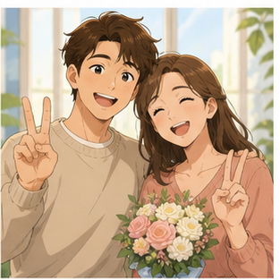

### **We've been married for two years.**

— Chúng tôi đã kết hôn được hai năm.

### Cấu trúc

`have/has been married for + duration`

Ví dụ:

* **They've been married for five years.**
* **She has been married for ten years.**
* **We've been married for six months.**

---

## 6.5. Nói một người đang độc thân

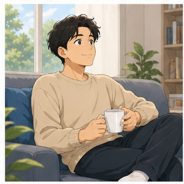

### **He is single.**

— Anh ấy đang độc thân.

Ví dụ:

**She's single at the moment.**

---

## 6.6. Nói một đám cưới sẽ được tổ chức

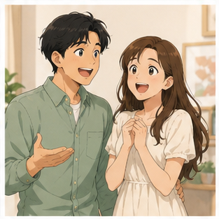

### **My wedding will be held next month.**

— Đám cưới của tôi sẽ được tổ chức vào tháng tới.

### Cấu trúc

`will be held + time/place`

Ví dụ:

**The wedding will be held in Hanoi.**

**The ceremony will be held on Saturday.**

---

## 6.7. Nói về tuần trăng mật

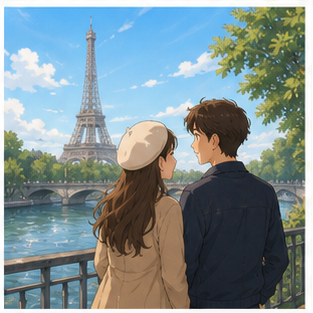

Trong video:

**They will have a honeymoon in Paris.**

Cách tự nhiên hơn:

### **They will go on their honeymoon in Paris.**

— Họ sẽ đi hưởng tuần trăng mật ở Paris.

Ví dụ:

**We're going to Japan for our honeymoon.**

---

## 6.8. Khen một cặp đôi

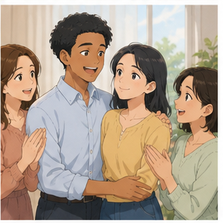

### **What a happy couple!**

— Thật là một cặp đôi hạnh phúc!

Cấu trúc:

`What a/an + adjective + noun!`

Ví dụ:

* **What a beautiful wedding!**
* **What a lovely couple!**
* **What a romantic story!**

---

## 6.9. Nói ai đó yêu một người rất nhiều


### **She loves you so much.**

— Cô ấy yêu bạn rất nhiều.

Ví dụ:

**He loves his wife very much.**

---

## 6.10. Nói về người lãng mạn

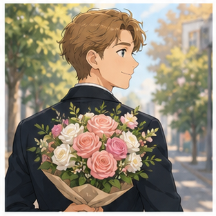

### **He is a romantic man.**

— Anh ấy là một người đàn ông lãng mạn.

Tự nhiên hơn trong nhiều tình huống:

**He's very romantic.**

---

## 6.11. Nói về tuổi của vợ/chồng

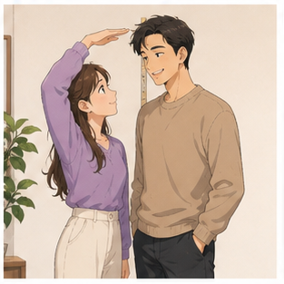

### **My husband is less than two years older than me.**

— Chồng tôi lớn hơn tôi chưa đến hai tuổi.

### Cấu trúc

`X years older than + someone`

Ví dụ:

**My wife is three years older than me.**

### Trái nghĩa

`younger than`

**He's two years younger than his wife.**

---

## 6.12. Nói chưa nghĩ đến chuyện kết hôn

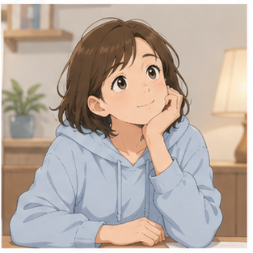

### **I haven't thought about marriage yet.**

— Tôi vẫn chưa nghĩ đến chuyện kết hôn.

### Cấu trúc

`haven't/hasn't + past participle + yet`

Ví dụ:

**We haven't decided on a wedding date yet.**

---

## 6.13. Hỏi nghề nghiệp của người thân

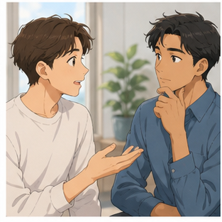

### **What does your brother-in-law do?**

— Anh/em rể của bạn làm nghề gì?

Trả lời:

**He's a freelance ad designer.**

### Cấu trúc

`What does + person + do?`

= Người đó làm nghề gì?

---

# 7. Các giai đoạn từ độc thân đến hôn nhân

| Giai đoạn          | Tiếng Anh          | Ví dụ                           |
| ------------------ | ------------------ | ------------------------------- |
| Độc thân           | **single**         | He's single.                    |
| Hẹn hò             | **dating**         | They're dating.                 |
| Đính hôn           | **engaged**        | They're engaged.                |
| Chuẩn bị cưới      | **plan a wedding** | They're planning their wedding. |
| Kết hôn            | **get married**    | They're getting married.        |
| Đã kết hôn         | **married**        | They're married.                |
| Tuần trăng mật     | **honeymoon**      | They're on their honeymoon.     |
| Cuộc sống hôn nhân | **married life**   | They have a happy married life. |

### Sơ đồ

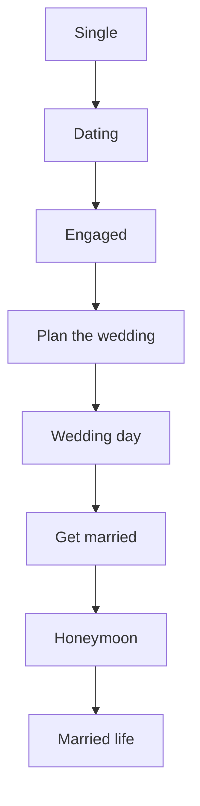

---

# 8. Phân biệt **wedding**, **marriage** và **married**

## **wedding**

Một sự kiện hoặc lễ cưới.

**We went to their wedding.**

— Chúng tôi đã đến dự đám cưới của họ.

---

## **marriage**

Hôn nhân hoặc mối quan hệ vợ chồng.

**They have a happy marriage.**

— Họ có một cuộc hôn nhân hạnh phúc.

---

## **married**

Tính từ chỉ trạng thái đã kết hôn.

**They are married.**

— Họ đã kết hôn.

---

## Bảng so sánh

| Từ              | Loại từ   | Ý nghĩa    | Ví dụ                 |
| --------------- | --------- | ---------- | --------------------- |
| **wedding**     | noun      | đám cưới   | attend a wedding      |
| **marriage**    | noun      | hôn nhân   | a happy marriage      |
| **married**     | adjective | đã kết hôn | be married            |
| **marry**       | verb      | cưới       | marry someone         |
| **get married** | phrase    | kết hôn    | get married next year |

---

# 9. Phân biệt **marry**, **get married** và **be married**

## **marry someone**

Cưới một người.

**She married Tom.**

Không dùng:

❌ **She married with Tom.**

---

## **get married**

Hành động kết hôn.

**They got married last year.**

---

## **be married**

Trạng thái đã kết hôn.

**They are married.**

---

### Dòng thời gian

```text
Single
   ↓
Meet someone
   ↓
Date
   ↓
Get engaged
   ↓
Get married
   ↓
Be married
```

---

# 10. Phát âm trọng tâm

## 10.1. **wedding**

/ˈwed.ɪŋ/

Trọng âm:

**WED**-ding

Không đọc:

`weeding`

---

## 10.2. **married**

/ˈmær.id/

Trọng âm:

**MAR**-ried

Lưu ý:

Không đọc thành ba âm tiết.

---

## 10.3. **marriage**

/ˈmær.ɪdʒ/

Trọng âm:

**MAR**-riage

---

## 10.4. **engaged**

/ɪnˈɡeɪdʒd/

Trọng âm:

en-**GAGED**

Âm cuối:

`/dʒd/`

---

## 10.5. **couple**

/ˈkʌp.əl/

Trọng âm:

**COU**-ple

Âm đầu gần:

`cup`

---

## 10.6. **faithful**

/ˈfeɪθ.fəl/

Chú ý âm:

`th` → /θ/

---

## 10.7. **honeymoon**

/ˈhʌn.i.muːn/

Trọng âm:

**HON**-ey-moon

---

## 10.8. **romantic**

/rəʊˈmæn.tɪk/

Trọng âm:

ro-**MAN**-tic

---

## 10.9. Nối âm trong hội thoại

### **Are you engaged?**

Luyện:

`Are-you-engaged?`

### **Are you married yet?**

Luyện:

`Are-you-married-yet?`

### **We've been married for two years.**

Luyện:

`We've-been-married-for-two-years.`

### **I'd love to invite you to my wedding.**

Luyện:

`I'd-love-to-invite-you-to-my-wedding.`

---

# 11. Hội thoại thực tế — Real-Life Conversation

## Hội thoại 1 — Mời bạn đến dự đám cưới

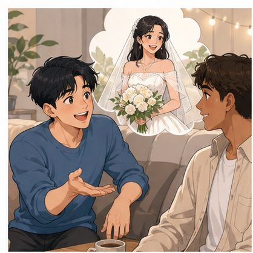

**Priya:** Hugo, I'd love to invite you to my sister's wedding next week.

**Hugo:** That's great news!

**Priya:** I hope you can come.

**Hugo:** Of course. I'd love to experience a typical Indian wedding.

**Priya:** Great! My whole family will be there.

**Hugo:** What does your brother-in-law do?

**Priya:** He's a freelance ad designer.

**Hugo:** Nice. I'm looking forward to meeting everyone.

---

## Hội thoại 2 — Gặp lại một người bạn đã lâu không gặp

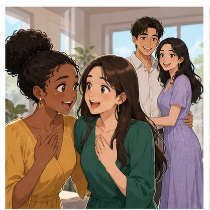

**Alex:** Hey! I haven't seen you for years. How are you?

**Ben:** I'm fine, thanks. And you?

**Alex:** I'm good. Are you and Audrey married yet?

**Ben:** Yes. Audrey and I have been married for two years.

**Alex:** Really? Congratulations!

**Ben:** Thanks. We also have a little daughter now.

**Alex:** Wow! That's lovely.

**Ben:** Yes, we're very happy.

---

## Hội thoại 3 — Hỏi về đính hôn

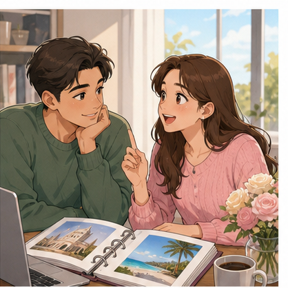

**A:** Are you engaged?

**B:** Yes, I am.

**A:** Congratulations! When is the wedding?

**B:** Our wedding will be held next month.

**A:** That's exciting. Where will it be?

**B:** At a hotel near the city center.

**A:** Are you going on a honeymoon?

**B:** Yes. We're going to Paris.

---

## Hội thoại 4 — Nói về tình trạng hôn nhân

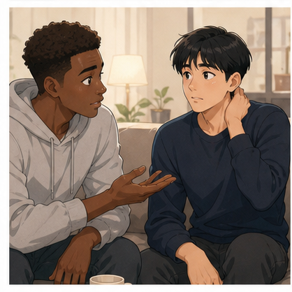

**A:** Is your brother married?

**B:** No. He's single.

**A:** Really?

**B:** Yes. He hasn't thought about marriage yet.

**A:** Is he dating anyone?

**B:** Not at the moment.

**A:** I see.

---

## Hội thoại 5 — Nói về cuộc sống hôn nhân

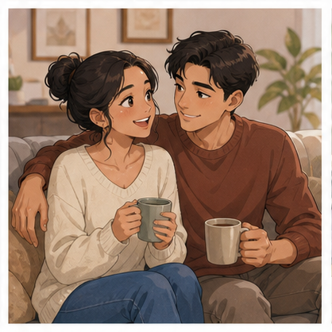

**A:** How is married life?

**B:** It's great. We're very happy.

**A:** How long have you been married?

**B:** We've been married for three years.

**A:** That's wonderful.

**B:** Thank you.

**A:** Your husband seems very romantic.

**B:** He is. He's also very kind and gentle.

---

## Hội thoại 6 — Chuẩn bị cho đám cưới

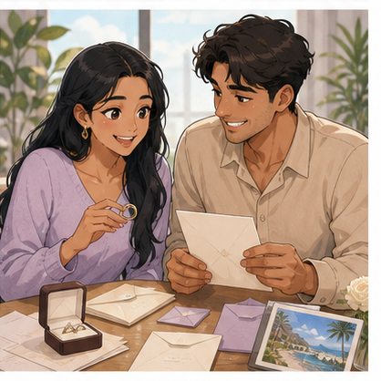

**A:** When are you getting married?

**B:** Next month.

**A:** Have you bought the wedding rings yet?

**B:** Yes. We bought them last week.

**A:** Have you invited everyone?

**B:** Almost. We still need to invite a few friends.

**A:** Where are you going for your honeymoon?

**B:** We're planning to go to Japan.

---

# 12. Natural Expressions — Cách nói tự nhiên

| Cụm từ                                    | Nghĩa                           | Khi dùng       |
| ----------------------------------------- | ------------------------------- | -------------- |
| **Are you married?**                      | Bạn đã kết hôn chưa?            | Hỏi tình trạng |
| **Are you engaged?**                      | Bạn đã đính hôn chưa?           | Hỏi tình trạng |
| **I'm single.**                           | Tôi độc thân.                   | Trả lời        |
| **We're engaged.**                        | Chúng tôi đã đính hôn.          | Trả lời        |
| **We're getting married.**                | Chúng tôi sắp kết hôn.          | Thông báo      |
| **We've been married for two years.**     | Chúng tôi đã cưới được hai năm. | Nói thời gian  |
| **Congratulations!**                      | Chúc mừng!                      | Chúc mừng      |
| **That's great news!**                    | Tin tuyệt quá!                  | Phản hồi       |
| **That's lovely.**                        | Thật tuyệt / đáng yêu.          | Phản hồi       |
| **What a happy couple!**                  | Thật là một cặp đôi hạnh phúc!  | Khen           |
| **I'd love to invite you.**               | Tôi rất muốn mời bạn.           | Mời            |
| **I'd love to come.**                     | Tôi rất muốn đến.               | Nhận lời       |
| **When is the wedding?**                  | Đám cưới khi nào?               | Hỏi lịch       |
| **Where will it be held?**                | Nó sẽ được tổ chức ở đâu?       | Hỏi địa điểm   |
| **We're going on our honeymoon.**         | Chúng tôi sẽ đi tuần trăng mật. | Sau cưới       |
| **How is married life?**                  | Cuộc sống hôn nhân thế nào?     | Trò chuyện     |
| **How long have you been married?**       | Bạn kết hôn được bao lâu rồi?   | Hỏi thời gian  |
| **He's very romantic.**                   | Anh ấy rất lãng mạn.            | Miêu tả        |
| **They make a lovely couple.**            | Họ là một cặp rất đẹp đôi.      | Khen           |
| **I haven't thought about marriage yet.** | Tôi chưa nghĩ đến hôn nhân.     | Quan điểm      |
| **I'm happy for you.**                    | Tôi rất vui cho bạn.            | Chúc mừng      |

---

# 13. Lỗi thường gặp — Common Mistakes

## Lỗi 1: Nhầm **wedding** và **marriage**

❌ **Their wedding is very happy.**

Nếu nói về cuộc sống hôn nhân:

✅ **Their marriage is very happy.**

Nếu nói về đám cưới:

✅ **Their wedding was beautiful.**

---

## Lỗi 2: Nói **married with**

❌ **She is married with John.**

✅ **She is married to John.**

### Cấu trúc

`be married to + person`

---

## Lỗi 3: Nói **marry with someone**

❌ **She married with John.**

✅ **She married John.**

Hoặc:

✅ **She got married to John.**

---

## Lỗi 4: Nhầm **marry** và **married**

❌ **They are marry.**

✅ **They are married.**

---

## Lỗi 5: Nói **They married for two years**

❌ **They married for two years.**

✅ **They have been married for two years.**

Khi nói trạng thái kéo dài đến hiện tại:

`have/has been married for + duration`

---

## Lỗi 6: Nhầm **for** và **since**

**for** + khoảng thời gian:

✅ **We've been married for three years.**

**since** + thời điểm bắt đầu:

✅ **We've been married since 2023.**

---

## Lỗi 7: Nói **make a wedding**

❌ **They will make a wedding next month.**

✅ **They will have a wedding next month.**

Hoặc:

✅ **They're getting married next month.**

---

## Lỗi 8: Dùng **have honeymoon** thiếu tự nhiên

Có thể hiểu:

**They will have a honeymoon in Paris.**

Tự nhiên hơn:

✅ **They will go on their honeymoon in Paris.**

✅ **They will spend their honeymoon in Paris.**

---

## Lỗi 9: Nói **go honeymoon**

❌ **We're going honeymoon next week.**

✅ **We're going on our honeymoon next week.**

---

## Lỗi 10: Nhầm **single** với **alone**

**single** = chưa kết hôn / không có người yêu tùy ngữ cảnh.

**alone** = ở một mình.

Ví dụ:

**He's single.**

→ Anh ấy độc thân.

**He's alone at home.**

→ Anh ấy đang ở nhà một mình.

---

## Lỗi 11: Hỏi nghề bằng **What is he do?**

❌ **What is your brother-in-law do?**

✅ **What does your brother-in-law do?**

---

## Lỗi 12: Dùng **Me and Audrey**

Trong giao tiếp đời thường có thể nghe:

**Me and Audrey have been married...**

Nhưng cấu trúc chuẩn hơn:

✅ **Audrey and I have been married for two years.**

---

## Lỗi 13: Nói **I don't think about marriage yet**

Nếu muốn nói "Tôi vẫn chưa nghĩ đến chuyện kết hôn":

✅ **I haven't thought about marriage yet.**

---

## Lỗi 14: Nhầm **engaged** với **married**

**engaged**

→ đã đính hôn nhưng chưa cưới.

**married**

→ đã kết hôn.

```text
Engaged
   ↓
Wedding
   ↓
Married
```

---

# 14. Luyện tập có hướng dẫn

## Bài 1 — Nối từ với nghĩa

1. wedding
2. married
3. single
4. engaged
5. honeymoon
6. couple
7. wedding ring
8. brother-in-law

A. tuần trăng mật
B. độc thân
C. đám cưới
D. đã đính hôn
E. cặp đôi
F. nhẫn cưới
G. đã kết hôn
H. anh/em rể hoặc anh/em trai của vợ/chồng

<details>
<summary>Đáp án</summary>

1–C
2–G
3–B
4–D
5–A
6–E
7–F
8–H

</details>

---

## Bài 2 — Điền từ

Dùng:

`married` · `single` · `wedding` · `honeymoon` · `engaged`

1. Are you ______?
2. My ______ will be held next month.
3. He's not married. He's ______.
4. They are going to Paris for their ______.
5. They aren't married yet, but they're ______.

<details>
<summary>Đáp án</summary>

1. married
2. wedding
3. single
4. honeymoon
5. engaged

</details>

---

## Bài 3 — Chọn **wedding**, **marriage** hoặc **married**

1. Their ______ was held in London.
2. They have a happy ______.
3. They have been ______ for five years.
4. We're going to a ______ this weekend.
5. He hasn't thought about ______ yet.

<details>
<summary>Đáp án</summary>

1. wedding
2. marriage
3. married
4. wedding
5. marriage

</details>

---

## Bài 4 — Chọn câu đúng

### 1. Bạn muốn hỏi người khác đã kết hôn chưa.

A. Are you marry?
B. Are you married?
C. Do you married?

**Đáp án:** B

---

### 2. Họ kết hôn được hai năm.

A. They are married for two years.
B. They have married for two years.
C. They have been married for two years.

**Đáp án:** C

---

### 3. Bạn muốn nói họ sắp kết hôn.

A. They are getting married.
B. They are getting marriage.
C. They are marrying with.

**Đáp án:** A

---

### 4. Bạn muốn hỏi về anh rể của ai đó.

A. What does your brother-in-law do?
B. What your brother-in-law does?
C. What is your brother-in-law do?

**Đáp án:** A

---

### 5. Bạn muốn nói họ đi tuần trăng mật ở Paris.

A. They are going honeymoon in Paris.
B. They are going on their honeymoon in Paris.
C. They are honeymoon to Paris.

**Đáp án:** B

---

## Bài 5 — Hoàn thành hội thoại

**A:** Are you and Emma ______ yet?

**B:** Yes. We've been ______ for two years.

**A:** Congratulations! Did you have a big ______?

**B:** Yes. We invited about 100 people.

**A:** Where did you go for your ______?

**B:** We went to Italy.

**A:** What a happy ______!

<details>
<summary>Đáp án</summary>

1. married
2. married
3. wedding
4. honeymoon
5. couple

</details>

---

## Bài 6 — Viết câu hoàn chỉnh

### 1.

`are / you / engaged`

→ ______________________________

### 2.

`we / married / two years`

→ ______________________________

### 3.

`wedding / held / next month`

→ ______________________________

### 4.

`invite / you / my wedding`

→ ______________________________

### 5.

`haven't / thought / marriage / yet`

→ ______________________________

<details>
<summary>Đáp án gợi ý</summary>

1. **Are you engaged?**
2. **We've been married for two years.**
3. **My wedding will be held next month.**
4. **I'd like to invite you to my wedding.**
5. **I haven't thought about marriage yet.**

</details>

---

# 15. Speaking Challenge

## Challenge 1 — Thay đổi thông tin

Nói lại đoạn hội thoại:

**A:** Are you married?

**B:** Yes. I've been married for two years.

**A:** When did you get married?

**B:** We got married in 2024.

**A:** Where did you go for your honeymoon?

**B:** We went to Paris.

Sau đó thay đổi:

* số năm kết hôn;
* năm cưới;
* địa điểm cưới;
* địa điểm tuần trăng mật.

---

## Challenge 2 — Tạo 5 câu hỏi

Tạo năm câu hỏi về đám cưới hoặc hôn nhân.

Gợi ý:

1. tình trạng hôn nhân;
2. thời gian kết hôn;
3. ngày cưới;
4. địa điểm cưới;
5. tuần trăng mật.

Ví dụ:

**How long have you been married?**

---

## Challenge 3 — Role-play 60 giây

### Vai A — Người sắp kết hôn

Bạn cần:

* nói rằng mình đã đính hôn;
* nói đám cưới vào tháng tới;
* mời bạn đến dự;
* nói về nhẫn cưới;
* nói nơi sẽ đi tuần trăng mật.

### Vai B — Người bạn

Bạn cần:

* chúc mừng;
* hỏi ngày cưới;
* hỏi nơi tổ chức;
* nhận lời mời;
* hỏi về tuần trăng mật.

---

## Challenge 4 — Gặp lại bạn cũ

Tạo một hội thoại ít nhất 8 lượt sử dụng:

* **I haven't seen you for years.**
* **Are you married yet?**
* **We've been married for...**
* **husband / wife**
* **daughter / son**
* **That's lovely.**

---

# 16. Practice Mission

Trong hôm nay, hãy viết hoặc nói một đoạn hội thoại **8–10 lượt** cho tình huống:

> **Bạn gặp lại một người bạn sau nhiều năm và phát hiện người đó đã kết hôn.**

Đoạn hội thoại phải sử dụng ít nhất:

* **5 từ vựng mới**;
* **3 mẫu câu của bài**;
* **1 câu hỏi về tình trạng hôn nhân**;
* **1 câu hỏi về thời gian kết hôn**;
* **1 câu hỏi về đám cưới hoặc tuần trăng mật**.

### Những từ nên cố gắng sử dụng

`married` · `single` · `engaged` · `wedding` · `couple` · `husband` · `wife` · `honeymoon` · `romantic` · `marriage`

---

# 17. Checklist hoàn thành

Sau bài học, hãy tự kiểm tra:

* [ ] Tôi hiểu **wedding** nghĩa là gì.
* [ ] Tôi phân biệt được **wedding** và **marriage**.
* [ ] Tôi phân biệt được **single**, **engaged** và **married**.
* [ ] Tôi biết hỏi **Are you married?**
* [ ] Tôi biết hỏi **Are you engaged?**
* [ ] Tôi biết sử dụng **get married**.
* [ ] Tôi biết sử dụng **have been married for...**
* [ ] Tôi biết **husband** và **wife**.
* [ ] Tôi hiểu **brother-in-law**.
* [ ] Tôi biết cách mời ai đó đến dự đám cưới.
* [ ] Tôi biết nói về **wedding ring**.
* [ ] Tôi biết nói về **honeymoon**.
* [ ] Tôi có thể nói **I haven't thought about marriage yet.**
* [ ] Tôi có thể duy trì hội thoại ít nhất 8 lượt.

---

# 18. Câu hỏi cuối bài

Hãy tưởng tượng một người bạn nói với bạn:

> **"I'm getting married next month!"**

Bạn sẽ phản hồi và tiếp tục cuộc hội thoại như thế nào?

Hãy trả lời bằng **3–5 câu tiếng Anh**.

Ví dụ các ý có thể hỏi:

* chúc mừng;
* ngày cưới;
* địa điểm cưới;
* tuần trăng mật;
* lời mời dự đám cưới.

---

# Instructor Notes

* **Module:** 04 — Everyday Communication / Giao tiếp đời sống
* **Lesson:** 25 — Đám cưới và hôn nhân
* **Topic:** Weddings
* **Nguồn nội dung:** Video 4 — Weddings, Vocabulary for Communication
* **Trình độ:** A1–A2
* **Thời lượng gợi ý:** 8–12 phút video chính + 5–10 phút luyện nói.

Tập trung vào ba nhóm kiến thức chính:

```text
Relationship status
     ↓
single → engaged → married
```

```text
Wedding
   ↓
invite guests
   ↓
wedding party
   ↓
wedding rings
   ↓
get married
   ↓
honeymoon
```

```text
wedding
   ↕
marriage
   ↕
married
```

Nhấn mạnh các cấu trúc trong video:

```text
Are you engaged?

Are you married?

He is single.

We've been married for two years.

My wedding will be held next month.

I'd love to invite you to my sister's wedding.

They will go on their honeymoon in Paris.

What a happy couple!

I haven't thought about marriage yet.
```

Khi dạy, cần đặc biệt sửa các lỗi:

```text
married with John
        ↓
married to John
```

```text
marry with John
        ↓
marry John
```

```text
They married for two years.
        ↓
They have been married for two years.
```

```text
go honeymoon
        ↓
go on a honeymoon
```

Ưu tiên câu ngắn, dễ sử dụng ở trình độ A1–A2.

Có thể chia lớp thành cặp:

* Student A = **người sắp kết hôn / người đã kết hôn**
* Student B = **bạn bè / khách được mời**

Kết thúc bài bằng role-play 45–60 giây:

```text
Meet an old friend
      ↓
Ask relationship status
      ↓
Learn they are married
      ↓
Ask about wedding
      ↓
Ask about honeymoon
      ↓
Congratulate them
```

Không yêu cầu người học kể chi tiết về đời sống cá nhân thật. Có thể sử dụng nhân vật giả định khi luyện nói.
