# Flutter & Dart — The Complete Guide: Study Handbook

> **Course:** Flutter & Dart — The Complete Guide (Maximilian Schwarzmüller)  
> **Sections:** 15 | **Lessons:** 312 | **Projects:** 7  
> **Level:** Beginner → Intermediate/Advanced

---

## Table of Contents

- [How to Use This Handbook](#how-to-use-this-handbook)
- [Section 01 — Introduction](#section-01--introduction)
- [Section 02 — Flutter & Dart Basics I: Getting a Solid Foundation](#section-02--flutter--dart-basics-i-getting-a-solid-foundation)
- [Section 03 — Flutter & Dart Basics II: Fundamentals Deep Dive](#section-03--flutter--dart-basics-ii-fundamentals-deep-dive)
- [Section 04 — Debugging Flutter Apps](#section-04--debugging-flutter-apps)
- [Section 05 — Adding Interactivity, More Widgets & Theming](#section-05--adding-interactivity-more-widgets--theming)
- [Section 06 — Building Responsive & Adaptive UIs](#section-06--building-responsive--adaptive-uis)
- [Section 07 — Flutter & Dart Internals](#section-07--flutter--dart-internals)
- [Section 08 — Multi-Screen Apps & Navigation](#section-08--multi-screen-apps--navigation)
- [Section 09 — State Management with Riverpod](#section-09--state-management-with-riverpod)
- [Section 10 — Animations](#section-10--animations)
- [Section 11 — Forms & User Input](#section-11--forms--user-input)
- [Section 12 — HTTP, Networking & Backend Communication](#section-12--http-networking--backend-communication)
- [Section 13 — Native Device Features, Camera, Maps & Local Storage](#section-13--native-device-features-camera-maps--local-storage)
- [Section 14 — Firebase, Authentication & Push Notifications](#section-14--firebase-authentication--push-notifications)
- [Section 15 — Course Roundup & Bonus](#section-15--course-roundup--bonus)
- [Appendix A — Dart Language Reference](#appendix-a--dart-language-reference)
- [Appendix B — Flutter Widget Cheat Sheet](#appendix-b--flutter-widget-cheat-sheet)
- [Appendix C — Essential CLI Commands](#appendix-c--essential-cli-commands)
- [Appendix D — Common Packages Reference](#appendix-d--common-packages-reference)

---

## How to Use This Handbook

This handbook is designed to accompany the video course — not replace it. Here is the recommended workflow:

1. **Before watching a section:** Read the Overview and Learning Objectives.
2. **While watching:** Refer to Key Concepts and Code Examples.
3. **After watching:** Complete Practice Tasks and answer Review Questions.
4. **For long-term retention:** Revisit Section Summaries and Common Mistakes.

Use the checklists below each section to track your progress.

---

## Section 01 — Introduction

### Overview

This section orients you to the course, explains what Flutter and Dart are, and guides you through setting up your development environment. No coding project is built here — the goal is to get your machine ready and understand the big picture before writing any code.

### Learning Objectives

- [ ] Explain the difference between Flutter and Dart
- [ ] Describe what cross-platform development means and its trade-offs
- [ ] Set up the Flutter SDK, Android Studio, and a code editor
- [ ] Create and run a new Flutter project
- [ ] Identify the role of Material Design in Flutter apps

### Lessons Covered

| # | Lesson Title |
|---|---|
| 001 | Welcome to the Course |
| 002 | What is Flutter? |
| 003 | Flutter vs Dart (Framework vs Language) |
| 004 | Cross-Platform Development |
| 005 | Platform Restrictions |
| 006 | Setup Overview |
| 007 | Windows Setup |
| 008 | macOS Setup |
| 009 | Creating a New Flutter Project |
| 010 | Code Editor Setup |
| 011 | Running Your First App |
| 012 | Course Resources & Community |

### Key Concepts

#### Flutter vs Dart

| Term | What It Is |
|---|---|
| **Dart** | The programming language you write code in |
| **Flutter** | The UI framework and toolkit built on top of Dart |

Think of it this way: Dart is the language (like JavaScript), and Flutter is the framework (like React). You write Dart code to use Flutter's features.

#### Cross-Platform Development

Flutter compiles a **single codebase** to multiple targets:

```
One Dart codebase
     ├── Android
     ├── iOS
     ├── Web
     ├── Windows
     ├── macOS
     └── Linux
```

**Trade-off:** You cannot use 100% native platform APIs without bridge code, but Flutter gives you very high performance by compiling to native ARM code (not running in a WebView).

#### Platform Restrictions

- **iOS builds:** Require a Mac running Xcode
- **Android builds:** Work on Windows, macOS, and Linux
- **Web builds:** Work on any OS

#### Material Design

Material Design is Google's visual design system. Flutter includes a full `material` library, which gives you:
- Standardized spacing and colours
- Pre-built widgets (buttons, cards, dialogs, app bars)
- Consistent look across platforms (or platform-adaptive if needed)

### Important Code Examples

```dart
// main.dart — the entry point of every Flutter app
import 'package:flutter/material.dart';

void main() {
  runApp(const MyApp());
}

class MyApp extends StatelessWidget {
  const MyApp({super.key});

  @override
  Widget build(BuildContext context) {
    return MaterialApp(
      title: 'My First App',
      home: Scaffold(
        appBar: AppBar(title: const Text('Hello Flutter')),
        body: const Center(child: Text('Welcome!')),
      ),
    );
  }
}
```

**Key lines explained:**
- `main()` — every Dart program starts here
- `runApp()` — hands Flutter the root widget to render
- `MaterialApp` — sets up Material Design and routing
- `Scaffold` — provides the basic page structure (app bar, body, FAB, drawer)

### Diagrams

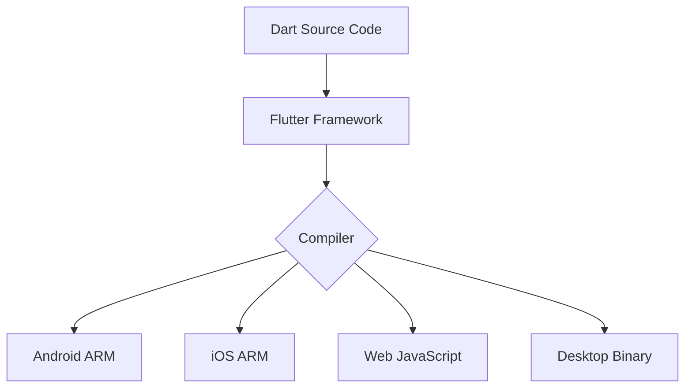

### Common Mistakes

- **Confusing Flutter and Dart** — remember Dart is the language, Flutter is the framework
- **Skipping `flutter doctor`** — always run it after setup to confirm there are no missing dependencies
- **Missing Xcode for iOS** — if you are on Windows, you simply cannot build iOS apps locally

### Practice Tasks

- [ ] Install Flutter SDK and verify with `flutter doctor`
- [ ] Create a new project with `flutter create my_first_app`
- [ ] Run the default counter app on an emulator
- [ ] Change the `title` property in `MaterialApp` and hot-reload

### Review Questions

1. What is the difference between Flutter and Dart?
2. Why can you not build iOS apps on Windows?
3. What does `runApp()` do?
4. What widget provides the basic page structure with an app bar and a body?

### Section Summary

Flutter is a cross-platform UI framework that uses Dart as its language. One codebase runs on Android, iOS, Web, and Desktop. You set up Android Studio for the emulator and SDK, then write code in VS Code or another editor. Every Flutter app starts with `main()` calling `runApp()`, which starts the widget tree with `MaterialApp` at the root.

---

## Section 02 — Flutter & Dart Basics I: Getting a Solid Foundation

**Project Built: Roll Dice App**

### Overview

This section introduces the core ideas you need to write any Flutter app: functions, widgets, classes, state, and how Dart compiles to native code. By the end you will have built an interactive dice roller app.

### Learning Objectives

- [ ] Explain how Dart code becomes a native app (JIT vs AOT compilation)
- [ ] Define and call functions with positional and named arguments
- [ ] Understand the widget tree and how widgets are composed
- [ ] Use `const` correctly to improve performance
- [ ] Distinguish between primitive types: `int`, `double`, `String`, `bool`
- [ ] Create a custom widget (class)
- [ ] Build a `StatefulWidget` and update the UI with `setState()`
- [ ] Display images and use random numbers

### Lessons Covered

| # | Lesson Title |
|---|---|
| 001 | From Dart to Machine Code |
| 002 | Programming Languages & Functions |
| 003 | Defining & Calling Functions |
| 004 | Importing Packages |
| 005 | How Flutter Apps Start |
| 006 | Understanding Widgets |
| 007 | Widget Structure & Widget Trees |
| 008 | Using First Widgets & Passing Values |
| 009 | Positional & Named Arguments |
| 010 | Combining Multiple Widgets |
| 011 | `const` Values & Immutability |
| 012 | Code Formatting |
| 013 | Value Types |
| 014 | Objects & Configuration |
| 015 | Generics & Lists |
| 016 | Gradient Colors & Styling |
| 017 | Custom Widgets — Why & How |
| 018 | Classes & Objects |
| 019 | Constructors & Initialization |
| 020 | Properties (Instance Variables) |
| 021 | Displaying Images |
| 022 | Buttons & Padding |
| 023 | Stateful Widgets |
| 024 | Random Number Generation |
| ... | (additional lessons) |

### Key Concepts

#### Dart Compilation

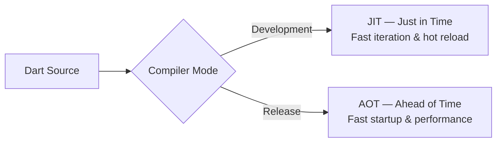

JIT enables **hot reload** during development. AOT produces the fast binary shipped to users.

#### Functions

```dart
// Basic function
void greet() {
  print('Hello, Flutter!');
}

// With return type
String getGreeting() {
  return 'Hello!';
}

// Arrow function (short-hand for single expression)
String getGreeting() => 'Hello!';

// Positional arguments
void add(int a, int b) {
  print(a + b);
}

// Named arguments (use {} and require name at call site)
void showMessage({required String text, int times = 1}) {
  for (var i = 0; i < times; i++) {
    print(text);
  }
}

// Call
showMessage(text: 'Hi', times: 3);
```

#### Widgets and the Widget Tree

Everything in Flutter is a widget. Widgets are **immutable configuration objects** that describe how the UI should look. Flutter reads this description and renders it.

```
MaterialApp
└── Scaffold
    ├── AppBar
    │   └── Text('Title')
    └── body: Column
        ├── Image.asset('dice.png')
        └── ElevatedButton(...)
```

```dart
// Widgets are composed (nested)
Scaffold(
  appBar: AppBar(title: const Text('Dice Roller')),
  body: Column(
    children: [
      Image.asset('assets/dice-1.png'),
      ElevatedButton(
        onPressed: rollDice,
        child: const Text('Roll Dice'),
      ),
    ],
  ),
)
```

#### `const` and Immutability

Use `const` when a widget's configuration will never change. This lets Flutter skip re-creating it during rebuilds — a performance win.

```dart
// Good: constant widget, Flutter can cache it
const Text('Hello')

// Bad: unnecessary new object every rebuild
Text('Hello')
```

**Rule of thumb:** Add `const` wherever the IDE tells you it is possible.

#### Value Types

| Type | Example | Notes |
|---|---|---|
| `int` | `42` | Whole numbers |
| `double` | `3.14` | Decimal numbers |
| `String` | `'Hello'` | Text, single or double quotes |
| `bool` | `true / false` | Boolean |
| `var` | `var x = 10` | Type inferred by Dart |
| `final` | `final name = 'Max'` | Assigned once, can't change |
| `const` | `const pi = 3.14` | Compile-time constant |

#### Classes and Objects

A class is a **blueprint**; an object is an **instance** of that blueprint.

```dart
class Dice {
  // Instance variable (property)
  int currentFace = 1;

  // Constructor
  Dice(this.currentFace);

  // Method
  void roll() {
    currentFace = Random().nextInt(6) + 1;
  }
}

// Create object
final myDice = Dice(1);
myDice.roll();
print(myDice.currentFace);
```

#### Custom Widgets

When your widget tree becomes large, extract parts into named classes. This improves readability and lets Flutter cache `const` instances.

```dart
class DiceImage extends StatelessWidget {
  const DiceImage({required this.face, super.key});

  final int face;

  @override
  Widget build(BuildContext context) {
    return Image.asset('assets/dice-$face.png');
  }
}
```

#### StatefulWidget

Use `StatefulWidget` when the widget needs to store data that changes and trigger a UI rebuild.

```dart
class DiceRoller extends StatefulWidget {
  const DiceRoller({super.key});

  @override
  State<DiceRoller> createState() => _DiceRollerState();
}

class _DiceRollerState extends State<DiceRoller> {
  int currentDiceFace = 1;

  void rollDice() {
    setState(() {
      currentDiceFace = Random().nextInt(6) + 1;
    });
  }

  @override
  Widget build(BuildContext context) {
    return Column(
      children: [
        Image.asset('assets/dice-$currentDiceFace.png'),
        ElevatedButton(
          onPressed: rollDice,
          child: const Text('Roll Dice'),
        ),
      ],
    );
  }
}
```

**How `setState()` works:**

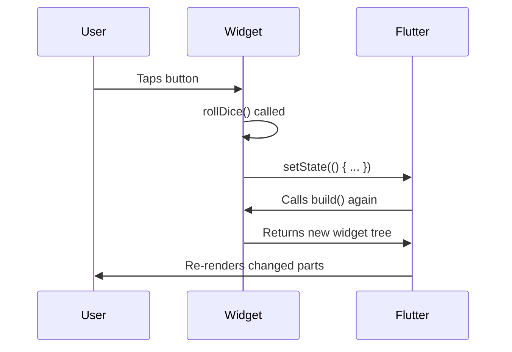

### Diagrams

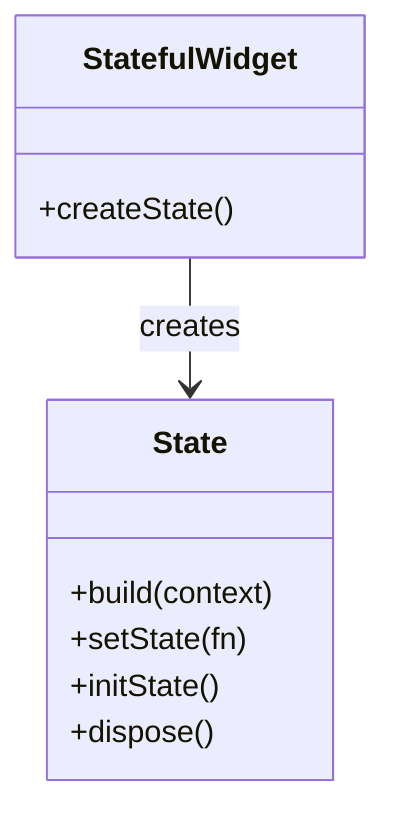

### Common Mistakes

| Mistake | Correct Approach |
|---|---|
| Forgetting `setState()` when changing data | Always wrap data mutations in `setState()` |
| Placing logic inside `build()` directly | Extract logic to methods |
| Not using `const` on unchanging widgets | Add `const` where possible |
| Using `int` when you need `double` | Be explicit: `1.0` is double, `1` is int |
| Not providing `key` to custom widgets | Add `super.key` to constructor |

### Practice Tasks

- [ ] Create a `StatefulWidget` with a counter
- [ ] Display a different image depending on a random number
- [ ] Add a `TextButton` alongside `ElevatedButton`
- [ ] Wrap a widget with `Padding` and experiment with values
- [ ] Create a class `Person` with a `name` property and a `greet()` method

### Review Questions

1. What is the difference between `final` and `const`?
2. When should you use `StatefulWidget` instead of `StatelessWidget`?
3. What does `setState()` do?
4. What is the purpose of a class constructor?
5. How do named arguments differ from positional arguments?

### Section Summary

Every Flutter app is a tree of widget objects. `StatelessWidget` is for static UI; `StatefulWidget` stores data that can change via `setState()`. Dart is strongly typed — use `int`, `double`, `String`, `bool`, or `var` with type inference. Classes are blueprints for objects. Use `const` wherever possible for performance. The Roll Dice app demonstrates all of these fundamentals working together.

---

## Section 03 — Flutter & Dart Basics II: Fundamentals Deep Dive

**Project Built: Quiz App**

### Overview

This section goes deeper into Dart language features and Flutter patterns needed to build multi-screen apps. You will learn conditional rendering, data models, callbacks, list manipulation, and how to use third-party packages.

### Learning Objectives

- [ ] Render widgets conditionally using `if/else` and ternary expressions
- [ ] Pass functions as values (callbacks) to child widgets
- [ ] Use `initState()` for setup logic in `StatefulWidget`
- [ ] Build and use maps as data containers
- [ ] Iterate over lists using `for` loops and `.map()`
- [ ] Use the `Expanded` widget for flexible layouts
- [ ] Add third-party packages (e.g., Google Fonts)
- [ ] Build a complete multi-screen quiz flow

### Lessons Covered

| # | Lesson Title |
|---|---|
| 001 | Building Custom Widgets |
| 002 | Icon Integration |
| 003 | Opacity / Transparency |
| 004 | Rendering Content Conditionally |
| 005 | Passing Functions as Values |
| 006 | `initState()` Method |
| 007 | StatefulWidget Lifecycle |
| 008 | Ternary Expressions |
| 009 | Comparison Operators |
| 010 | `if` Statements and Conditions |
| 011 | Using `if` in Lists |
| 012 | Data Models & Dummy Data |
| 013 | Custom Styled Buttons |
| 014 | Accessing List Elements & Object Properties |
| 015 | List Mapping & Spread Operator |
| 016 | Alignment, Margin, Padding |
| 017 | Mutating Values in Memory |
| 018 | Managing Index State |
| 019 | Third-Party Packages (Google Fonts) |
| 020 | Passing Data via Functions |
| 021 | Maps & `for` Loops |
| 022 | `for` Loops in Lists |
| 023 | Map Access & Type Casting |
| 024 | Combining Columns and Rows |
| 025 | `Expanded` Widget |
| 026 | Filtering & Analyzing Lists |
| 027 | `SingleChildScrollView` |
| 028 | Optional Dart Features |
| ... | (additional lessons) |

### Key Concepts

#### Conditional Rendering

**Pattern 1: Widget variable**
```dart
class _HomeState extends State<Home> {
  Widget activeScreen = const StartScreen();

  void switchScreen() {
    setState(() {
      activeScreen = const QuestionScreen();
    });
  }

  @override
  Widget build(BuildContext context) {
    return Scaffold(body: activeScreen);
  }
}
```

**Pattern 2: Ternary expression**
```dart
body: isStarted ? const QuestionScreen() : const StartScreen(),
```

**Pattern 3: `if` in a list of widgets**
```dart
Column(
  children: [
    const Text('Title'),
    if (showExtra) const Text('Extra content'),
  ],
)
```

#### Passing Functions as Callbacks

Children communicate with parents by calling a function the parent passed down:

```dart
// Parent
class _AppState extends State<App> {
  void handleAnswer(String answer) {
    // process answer
  }

  @override
  Widget build(BuildContext context) {
    return QuestionScreen(onAnswerSelected: handleAnswer);
  }
}

// Child
class QuestionScreen extends StatelessWidget {
  const QuestionScreen({required this.onAnswerSelected, super.key});

  final void Function(String answer) onAnswerSelected;

  @override
  Widget build(BuildContext context) {
    return ElevatedButton(
      onPressed: () => onAnswerSelected('Option A'),
      child: const Text('Option A'),
    );
  }
}
```

#### StatefulWidget Lifecycle

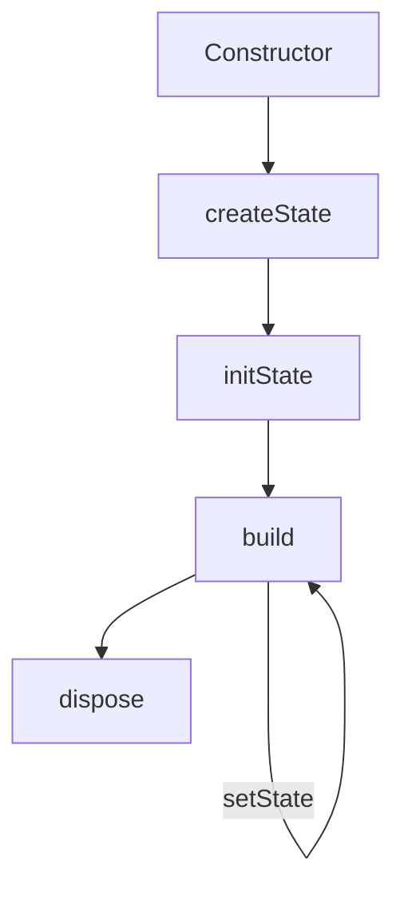

- `initState()` — called once when the widget is inserted into the tree. Use it for one-time setup.
- `build()` — called every time `setState()` is called. Keep it fast and pure.
- `dispose()` — called when the widget is removed. Clean up controllers, animations, streams here.

```dart
@override
void initState() {
  super.initState();
  // one-time initialization
  _controller = AnimationController(vsync: this);
}

@override
void dispose() {
  _controller.dispose(); // prevent memory leaks
  super.dispose();
}
```

#### Data Models

Create a class to represent a piece of data rather than using raw maps everywhere:

```dart
class QuizQuestion {
  const QuizQuestion(this.text, this.answers);

  final String text;
  final List<String> answers;

  List<String> getShuffledAnswers() {
    final shuffled = List.of(answers);
    shuffled.shuffle();
    return shuffled;
  }
}

// Usage
const questions = [
  QuizQuestion('What is Flutter?', [
    'A UI framework',    // correct answer first
    'A database',
    'A language',
    'A server',
  ]),
];
```

#### Maps and For Loops

```dart
// Map literal
final Map<String, dynamic> person = {
  'name': 'Alice',
  'age': 30,
};

// Access values
print(person['name']); // Alice

// Type cast when using dynamic
final name = person['name'] as String;

// For-in loop
for (final question in questions) {
  print(question.text);
}

// Traditional for loop
for (int i = 0; i < questions.length; i++) {
  print(questions[i].text);
}

// .map() — transforms each element
final texts = questions.map((q) => q.text).toList();
```

#### List Manipulation

```dart
final numbers = [3, 1, 4, 1, 5, 9];

// Filter: where()
final big = numbers.where((n) => n > 3).toList(); // [4, 5, 9]

// Transform: map()
final doubled = numbers.map((n) => n * 2).toList();

// Check: any() and every()
final hasNine = numbers.any((n) => n == 9); // true

// Spread operator: insert list into another list
final combined = [...numbers, ...big];

// Shuffle a copy without mutating original
final shuffled = List.of(numbers)..shuffle();
```

#### The `Expanded` Widget

Use `Expanded` inside a `Row` or `Column` to give a child all the remaining space:

```dart
Row(
  children: [
    const Icon(Icons.star),
    Expanded(             // takes up remaining width
      child: Text('A long label that fills available space'),
    ),
    const Icon(Icons.arrow_forward),
  ],
)
```

#### Third-Party Packages

Add a package to `pubspec.yaml`:
```yaml
dependencies:
  flutter:
    sdk: flutter
  google_fonts: ^6.1.0
```

Then run `flutter pub get` and import:
```dart
import 'package:google_fonts/google_fonts.dart';

Text(
  'Quiz',
  style: GoogleFonts.lato(fontSize: 24, color: Colors.white),
)
```

### Diagrams

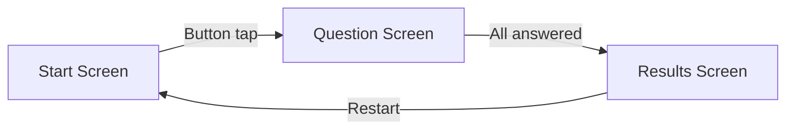

### Common Mistakes

| Mistake | Correct Approach |
|---|---|
| Forgetting `super.initState()` | Always call `super.initState()` first |
| Mutating a list without `setState()` | Wrap all mutations in `setState()` |
| Calling `.toList()` inside `build()` unnecessarily | Pre-compute heavy operations in `initState()` or memoize |
| Using `Object` type everywhere | Use specific types (`String`, `int`) or generics |
| Not shuffling a copy — mutating the original | Use `List.of(original)..shuffle()` |

### Practice Tasks

- [ ] Build a start screen with a button that switches to a question screen
- [ ] Create a `QuizQuestion` class with a `text` and a `List<String> answers`
- [ ] Render answer buttons dynamically from a list using `.map()` and the spread operator
- [ ] Display the quiz result after all questions are answered
- [ ] Add a restart button that resets the quiz state

### Review Questions

1. What are the three ways to conditionally render a widget?
2. Why do you need to use `super.initState()` when overriding `initState()`?
3. What is the spread operator (`...`) used for?
4. How does `.where()` differ from `.map()`?
5. What is the difference between a `Map` and a `List` in Dart?

### Section Summary

The Quiz App demonstrates multi-screen Flutter development. You manage screen transitions with state, pass callbacks from parent to child for communication, and build data models with classes. Dart collections — `List`, `Map` — and their iteration methods (`.map()`, `.where()`) are essential tools. The `Expanded` widget solves common flexible layout problems. Third-party packages extend Flutter's capabilities in seconds.

---

## Section 04 — Debugging Flutter Apps

### Overview

Short but important: this section teaches you how to read error messages, use Flutter DevTools, and test on real physical devices. Effective debugging is a core developer skill.

### Learning Objectives

- [ ] Read and interpret Flutter error messages and stack traces
- [ ] Use Flutter DevTools for widget inspection and performance profiling
- [ ] Run apps on a physical iOS or Android device
- [ ] Recognize the most common error patterns

### Lessons Covered

| # | Lesson Title |
|---|---|
| 001 | Understanding Error Messages |
| 002 | Debug Mode Operation |
| 003 | Flutter DevTools |
| 004 | Running on Real iOS/Android Devices |
| 005 | Debugging Strategies |
| 006 | Common Error Patterns |

### Key Concepts

#### Reading Error Messages

Flutter errors appear in the Debug Console. The most important part is the **first few lines** — that is where the actual error is described. The long stack trace below tells you where it happened.

Common errors:

| Error | Likely Cause |
|---|---|
| `RenderFlex overflowed` | A `Column`/`Row` child is too big — use `Expanded` or `SingleChildScrollView` |
| `Null check operator used on null value` | Accessing a nullable value without checking for null |
| `setState() called after dispose()` | Calling `setState()` in an async callback after widget was removed |
| `A non-null String must be provided` | Missing required named argument |
| `type 'int' is not a subtype of type 'String'` | Wrong type passed to a function |

#### Flutter DevTools

Open with `flutter pub global run devtools` or from the IDE.

Key tabs:
- **Widget Inspector** — visualize the widget tree, inspect properties
- **Performance** — find jank (frame drops) and expensive rebuilds
- **Memory** — track memory usage and detect leaks
- **Debugger** — step through code, set breakpoints
- **Logging** — view all `print()` output

#### Debug vs Release Mode

| Mode | Command | Notes |
|---|---|---|
| Debug | `flutter run` | Hot reload, dev tools, slow |
| Profile | `flutter run --profile` | Near-release speed, tools available |
| Release | `flutter run --release` | Full performance, no dev tools |

### Common Mistakes

- **Ignoring the first error line** — the stack trace is noise until you find the root cause at the top
- **Using `print()` in production** — use `debugPrint()` which respects Flutter's output limits
- **Testing only on emulator** — always test on a real device before shipping

### Practice Tasks

- [ ] Intentionally introduce a `RenderFlex overflow` error and fix it
- [ ] Open Flutter DevTools and inspect the widget tree of your Roll Dice or Quiz app
- [ ] Add a breakpoint in VS Code and step through `setState()`
- [ ] Run your app on a physical device

### Review Questions

1. What does a `RenderFlex overflowed` error mean and how do you fix it?
2. What is the difference between debug and release mode?
3. How do you open Flutter DevTools?

### Section Summary

Debugging is not optional — it is part of development. Flutter's error messages are verbose but descriptive. Read the top of the stack trace first. Use DevTools to inspect widgets and find performance problems. Always verify your app on a real device before publishing.

---

## Section 05 — Adding Interactivity, More Widgets & Theming

**Project Built: Expense Tracker App**

### Overview

This is one of the most feature-rich sections. You will add advanced user interaction (modals, date pickers, dropdowns), apply full theming including dark mode, handle input validation, and display a data chart.

### Learning Objectives

- [ ] Model data with classes that use `uuid` for unique IDs and `enum` for categories
- [ ] Display scrollable lists efficiently with `ListView.builder()`
- [ ] Show modal bottom sheets and full-screen modals
- [ ] Use `TextField` with `TextEditingController` for input
- [ ] Show and handle date pickers (async)
- [ ] Validate user input and show error dialogs
- [ ] Implement swipe-to-delete with undo (Dismissible + SnackBar)
- [ ] Apply a global theme using `ThemeData` and Material 3
- [ ] Support dark mode

### Lessons Covered

| # | Lesson Title |
|---|---|
| 001 | Expense Data Model & Unique IDs |
| 002 | Initializer Lists in Constructors |
| 003 | Enums |
| 004 | ListView for Long Lists |
| 005 | Lists Inside Lists |
| 006 | Card Widget for List Items |
| 007 | Icons and Date Formatting |
| 008 | AppBar with Title and Actions |
| 009 | Modal Sheets |
| 010 | BuildContext Understanding |
| 011 | TextField Widget |
| 012 | TextEditingController |
| 013 | Modal State Management |
| 014 | Closing Modals Programmatically |
| 015 | Date Picker Implementation |
| 016 | Working with Futures |
| 017 | Dropdown Buttons |
| 018 | AND/OR Operators |
| 019 | Input Validation & Error Dialogs |
| 020 | Saving New Items |
| 021 | Fullscreen Modals |
| 022 | Dismissible Widget |
| 023 | SnackBar Notifications |
| 024 | Material 3 Design |
| 025 | Theming |
| 026 | Dark Mode |
| 027 | Alternative Loops (for-in) |
| 028 | List Filtering |
| 029 | Chart Widgets |
| ... | (additional lessons) |

### Key Concepts

#### Enums

Enums define a fixed set of named values — great for categories:

```dart
enum Category { food, travel, leisure, work }

// Usage
final expense = Expense(
  title: 'Lunch',
  amount: 12.50,
  date: DateTime.now(),
  category: Category.food,
);

// Switch on enum
switch (expense.category) {
  case Category.food:
    return Icons.lunch_dining;
  case Category.travel:
    return Icons.flight_takeoff;
  default:
    return Icons.work;
}
```

#### Data Model with UUID

```dart
import 'package:uuid/uuid.dart';

const uuid = Uuid();

class Expense {
  Expense({
    required this.title,
    required this.amount,
    required this.date,
    required this.category,
  }) : id = uuid.v4(); // initializer list assigns id before constructor body

  final String id;
  final String title;
  final double amount;
  final DateTime date;
  final Category category;

  String get formattedDate => DateFormat.yMd().format(date); // intl package
}
```

#### ListView.builder

Use `ListView.builder` (not `ListView`) for long or dynamic lists — it builds items lazily:

```dart
ListView.builder(
  itemCount: expenses.length,
  itemBuilder: (ctx, index) {
    return ExpenseItem(expense: expenses[index]);
  },
)
```

#### Modal Bottom Sheet

```dart
void openAddExpenseOverlay() {
  showModalBottomSheet(
    isScrollControlled: true,  // full height
    context: context,
    builder: (ctx) => AddExpense(onAddExpense: addExpense),
  );
}
```

#### TextEditingController

```dart
class _AddExpenseState extends State<AddExpense> {
  final _titleController = TextEditingController();
  final _amountController = TextEditingController();

  @override
  void dispose() {
    _titleController.dispose(); // IMPORTANT: prevents memory leak
    _amountController.dispose();
    super.dispose();
  }

  void _submitExpenseData() {
    final enteredAmount = double.tryParse(_amountController.text);
    final amountIsInvalid = enteredAmount == null || enteredAmount <= 0;

    if (_titleController.text.trim().isEmpty || amountIsInvalid) {
      showDialog(
        context: context,
        builder: (ctx) => AlertDialog(
          title: const Text('Invalid input'),
          content: const Text('Please enter valid title and amount.'),
          actions: [
            TextButton(
              onPressed: () => Navigator.pop(ctx),
              child: const Text('Okay'),
            ),
          ],
        ),
      );
      return;
    }

    widget.onAddExpense(
      Expense(
        title: _titleController.text,
        amount: enteredAmount,
        date: _selectedDate!,
        category: _selectedCategory,
      ),
    );
    Navigator.pop(context); // close modal
  }
}
```

#### Date Picker (Async)

```dart
DateTime? _selectedDate;

void _presentDatePicker() async {
  final now = DateTime.now();
  final firstDate = DateTime(now.year - 1, now.month, now.day);

  final pickedDate = await showDatePicker(
    context: context,
    initialDate: now,
    firstDate: firstDate,
    lastDate: now,
  );

  // pickedDate is null if user cancels
  setState(() {
    _selectedDate = pickedDate;
  });
}
```

#### Dismissible (Swipe to Delete)

```dart
Dismissible(
  key: ValueKey(expense.id),
  onDismissed: (direction) => onRemoveExpense(expense),
  background: Container(
    color: Theme.of(context).colorScheme.error,
    child: const Icon(Icons.delete, color: Colors.white),
  ),
  child: ExpenseItem(expense: expense),
)
```

#### SnackBar with Undo

```dart
void removeExpense(Expense expense) {
  final index = _registeredExpenses.indexOf(expense);
  setState(() => _registeredExpenses.remove(expense));

  ScaffoldMessenger.of(context)
    ..clearSnackBars()
    ..showSnackBar(
      SnackBar(
        content: const Text('Expense deleted.'),
        duration: const Duration(seconds: 3),
        action: SnackBarAction(
          label: 'Undo',
          onPressed: () {
            setState(() => _registeredExpenses.insert(index, expense));
          },
        ),
      ),
    );
}
```

#### Theming with Material 3

```dart
MaterialApp(
  theme: ThemeData(
    useMaterial3: true,
    colorScheme: ColorScheme.fromSeed(
      seedColor: const Color.fromARGB(255, 96, 59, 181),
    ),
    appBarTheme: const AppBarTheme().copyWith(
      backgroundColor: ColorScheme.fromSeed(
        seedColor: const Color.fromARGB(255, 96, 59, 181),
      ).primaryContainer,
    ),
  ),
  darkTheme: ThemeData.dark().copyWith(
    colorScheme: ColorScheme.fromSeed(
      seedColor: const Color.fromARGB(255, 96, 59, 181),
      brightness: Brightness.dark,
    ),
  ),
  themeMode: ThemeMode.system, // follows device setting
)
```

**Using the theme in widgets:**
```dart
// Access colors from theme
Theme.of(context).colorScheme.primary

// Access text styles
Theme.of(context).textTheme.titleLarge
```

### Diagrams

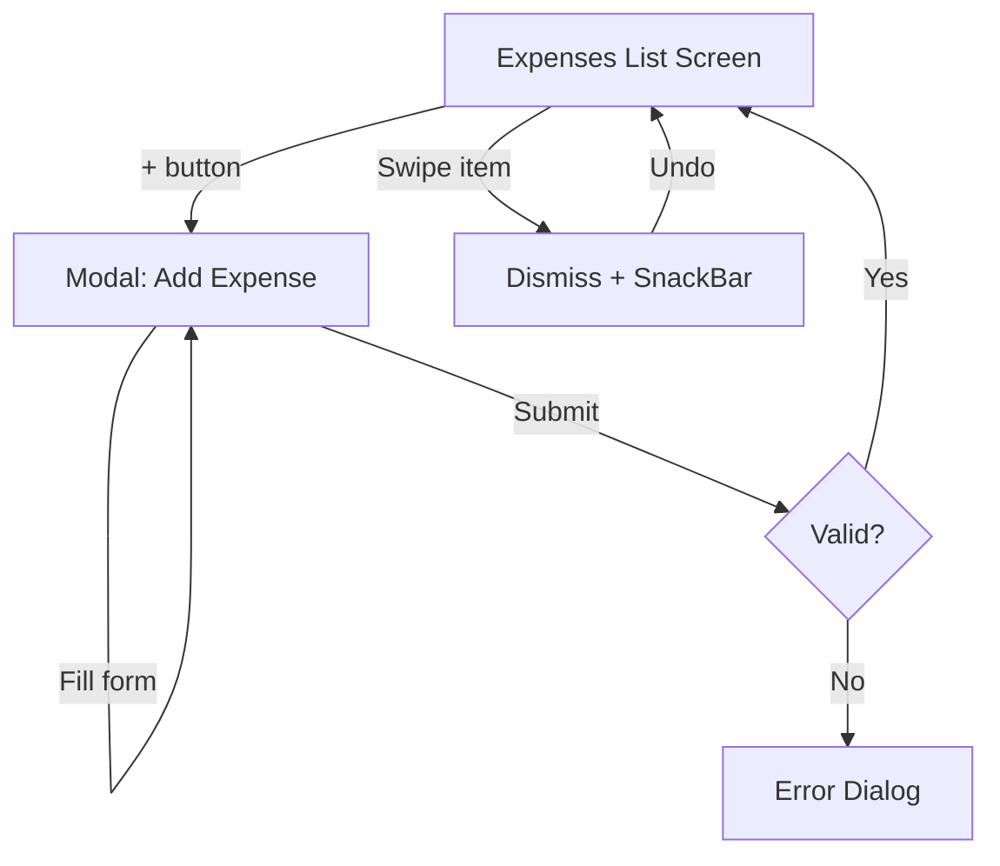

### Common Mistakes

| Mistake | Correct Approach |
|---|---|
| Not disposing `TextEditingController` | Always dispose in `dispose()` |
| Checking `mounted` before `setState` after async | Check `if (!mounted) return;` after `await` |
| Showing dialogs with a stale `context` | Pass `context` before the async gap or use `mounted` |
| Using `ListView` for a large list | Use `ListView.builder` for lazy rendering |
| Not providing a `ValueKey` to `Dismissible` | Always use a key unique to the item |

### Practice Tasks

- [ ] Build an `Expense` data model with an enum for category
- [ ] Display a list of expenses using `ListView.builder`
- [ ] Implement the "Add Expense" modal with title, amount, date picker, and category dropdown
- [ ] Add swipe-to-delete with an undo SnackBar
- [ ] Apply a custom `ThemeData` with `ColorScheme.fromSeed()`
- [ ] Toggle dark/light mode based on `ThemeMode.system`

### Review Questions

1. Why should you always dispose a `TextEditingController`?
2. What does `isScrollControlled: true` do in `showModalBottomSheet`?
3. How does `DateFormat.yMd()` format a `DateTime`?
4. What is the difference between `ThemeMode.light`, `.dark`, and `.system`?
5. Why is `ListView.builder` preferred over `ListView` for long lists?

### Section Summary

The Expense Tracker App is a fully featured application: data models with enums, lazy list rendering, modal forms with text input and date pickers, input validation with error dialogs, swipe-to-delete with undo, and a complete app-wide theme. These patterns appear in virtually every real Flutter app.

---

## Section 06 — Building Responsive & Adaptive UIs

### Overview

A good app works on phones, tablets, and landscape mode. This section covers detecting available screen space, adjusting layouts dynamically, and handling platform differences (Android vs iOS widget styles).

### Learning Objectives

- [ ] Explain responsiveness vs adaptivity in Flutter
- [ ] Lock or allow device orientation
- [ ] Use `LayoutBuilder` and `MediaQuery` for conditional layouts
- [ ] Use `SafeArea` to avoid notch/status bar overlap
- [ ] Handle soft keyboard overlapping content
- [ ] Build adaptive widgets that look native on iOS and Android

### Lessons Covered

| # | Lesson Title |
|---|---|
| 001 | Responsiveness vs Adaptivity |
| 002 | Locking Device Orientation |
| 003 | Dynamic UI Based on Available Space |
| 004 | Size Constraints |
| 005 | Handling Keyboard Overlays |
| 006 | SafeArea Widget |
| 007 | LayoutBuilder Widget |
| 008 | Adaptive Widget Patterns |
| 009 | Conditional Layouts |
| 010 | Platform Detection |

### Key Concepts

#### Responsiveness vs Adaptivity

| Term | Meaning | Example |
|---|---|---|
| **Responsive** | Layout adapts to screen size | Two-column layout on tablet, one-column on phone |
| **Adaptive** | Widgets match platform style | Use `CupertinoSwitch` on iOS, `Switch` on Android |

#### Locking Orientation

```dart
void main() async {
  WidgetsFlutterBinding.ensureInitialized();
  await SystemChrome.setPreferredOrientations([
    DeviceOrientation.portraitUp,
  ]);
  runApp(const MyApp());
}
```

#### MediaQuery

`MediaQuery` gives you screen dimensions, text scale, and accessibility settings:

```dart
final width = MediaQuery.of(context).size.width;
final height = MediaQuery.of(context).size.height;
final isLandscape = MediaQuery.of(context).orientation == Orientation.landscape;

// Conditional layout
if (isLandscape) {
  return Row(children: [leftPanel, rightPanel]);
} else {
  return Column(children: [topSection, bottomSection]);
}
```

#### LayoutBuilder

`LayoutBuilder` gives you the actual constraints of the parent widget — more reliable than `MediaQuery` when inside a nested widget:

```dart
LayoutBuilder(
  builder: (ctx, constraints) {
    if (constraints.maxWidth > 600) {
      return const TabletLayout();
    }
    return const PhoneLayout();
  },
)
```

#### SafeArea

Prevents content from being obscured by the device's status bar, notch, or home indicator:

```dart
Scaffold(
  body: SafeArea(
    child: Column(children: [...]),
  ),
)
```

#### Handling Soft Keyboard

When the keyboard appears it can push up the bottom of your screen. Solutions:

```dart
// Option 1: wrap body in SingleChildScrollView
body: SingleChildScrollView(child: myForm)

// Option 2: resize scaffold (default behavior)
resizeToAvoidBottomInset: true // default on Scaffold

// Option 3: use Scaffold's built-in bottom padding
Padding(
  padding: EdgeInsets.only(bottom: MediaQuery.of(context).viewInsets.bottom),
)
```

#### Adaptive Widgets

```dart
import 'dart:io';

Widget buildSwitch() {
  if (Platform.isIOS) {
    return CupertinoSwitch(value: isOn, onChanged: toggle);
  }
  return Switch(value: isOn, onChanged: toggle);
}
```

### Common Mistakes

| Mistake | Correct Approach |
|---|---|
| Hardcoding pixel sizes | Use fractions of `MediaQuery` width/height |
| Not using `SafeArea` | Wrap body in `SafeArea` to avoid notch overlap |
| Using `MediaQuery` inside a widget inside `LayoutBuilder` | Prefer `LayoutBuilder` constraints inside nested widgets |

### Practice Tasks

- [ ] Add a two-column layout to the Expense Tracker when the device is in landscape mode
- [ ] Wrap your app's body with `SafeArea`
- [ ] Use `MediaQuery` to show a different widget for screens wider than 600 px
- [ ] Test your app on an emulator in landscape orientation

### Review Questions

1. What is the difference between `LayoutBuilder` and `MediaQuery`?
2. What does `SafeArea` protect against?
3. How do you lock an app to portrait orientation?

### Section Summary

Responsive design in Flutter means reading available space and returning different widget trees. `LayoutBuilder` is the preferred tool when constraints come from a parent widget; `MediaQuery` is best for global dimensions. `SafeArea` should be a habit for every screen. Adaptive widgets use platform checks to show native-feeling controls.

---

## Section 07 — Flutter & Dart Internals

**Project: Flutter Internals Deep Dive**

### Overview

Understanding how Flutter works under the hood makes you a better developer. This section explains the three trees, when widgets rebuild, and how to use keys to prevent subtle bugs.

### Learning Objectives

- [ ] Explain the Widget tree, Element tree, and Render tree
- [ ] Describe when Flutter calls `build()` and why
- [ ] Use `const` and widget extraction to prevent unnecessary rebuilds
- [ ] Explain what a `Key` is and when you need one
- [ ] Choose correctly between `var`, `final`, and `const`

### Lessons Covered

| # | Lesson Title |
|---|---|
| 001 | Three Trees: Widget, Element, Render |
| 002 | How UI Gets Updated |
| 003 | Widget Rebuilding Optimization |
| 004 | Extracting Widgets |
| 005 | Keys — Widget Identification |
| 006 | When Keys Are Needed |
| 007 | Using Keys Properly |
| 008 | Variable Mutability |
| 009 | Immutability Concepts |

### Key Concepts

#### The Three Trees

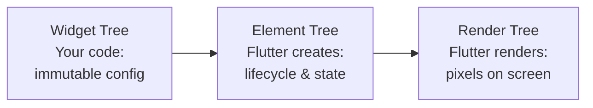

| Tree | What It Is | Who Creates It |
|---|---|---|
| **Widget tree** | Your Dart objects — immutable descriptions | You (the developer) |
| **Element tree** | A persistent handle between widget and render | Flutter framework |
| **Render tree** | The actual painted pixels | Flutter engine |

When you call `setState()`, Flutter rebuilds your widget tree starting from the `setState()` widget, compares it with the element tree (diffing), and only updates what changed in the render tree.

#### Widget Rebuilding

Every call to `setState()` triggers `build()` on the widget and all of its children. This is usually fine, but you can avoid unnecessary rebuilds:

**Extract heavy widgets:**
```dart
// Bad: MyHeavyWidget rebuilds every time _MyPageState rebuilds
class _MyPageState extends State<MyPage> {
  int counter = 0;
  @override
  Widget build(BuildContext context) {
    return Column(children: [
      MyHeavyWidget(),  // rebuilds even if it doesn't depend on counter
      Text('$counter'),
    ]);
  }
}

// Good: Extract to separate StatelessWidget
class _MyPageState extends State<MyPage> {
  int counter = 0;
  @override
  Widget build(BuildContext context) {
    return Column(children: [
      const MyHeavyWidget(), // const = Flutter skips rebuild check
      Text('$counter'),
    ]);
  }
}
```

#### Keys

Keys help Flutter identify widgets in a list or dynamic tree. Without keys, Flutter may mix up widget state when items are reordered or removed.

**When you need keys:**
- `ListView` with `StatefulWidget` items that can be reordered or removed
- `AnimatedList`

```dart
// Wrong: Flutter may preserve state of wrong item after reorder
ListView(
  children: items.map((item) => ItemWidget(data: item)).toList(),
)

// Correct: Flutter uses key to identify each item
ListView(
  children: items.map(
    (item) => ItemWidget(key: ValueKey(item.id), data: item),
  ).toList(),
)
```

**Key types:**

| Type | Use case |
|---|---|
| `ValueKey(value)` | Unique data value (id, string) |
| `ObjectKey(object)` | Reference to a specific object |
| `UniqueKey()` | New unique key every build (use sparingly) |
| `GlobalKey` | Access a widget's state from outside its subtree |

#### `var` vs `final` vs `const`

```dart
var name = 'Alice';       // Can be reassigned, type inferred
final name = 'Alice';     // Cannot be reassigned; set at runtime
const name = 'Alice';     // Cannot be reassigned; set at compile time

// const means the value is known at compile time
const pi = 3.14159;          // Fine: literal value
final now = DateTime.now();  // Fine: runtime value, can't use const
const now = DateTime.now();  // ERROR: DateTime.now() is not a constant
```

### Common Mistakes

| Mistake | Correct Approach |
|---|---|
| Not using keys in dynamic lists | Add `ValueKey(item.id)` to list items with state |
| Using `UniqueKey()` everywhere | Only use it when you want to force a full rebuild |
| Not using `const` on leaf widgets | Add `const` to widgets with no variable data |

### Practice Tasks

- [ ] Open Flutter DevTools and use the widget inspector to visualize the three trees
- [ ] Add a `const` constructor to a custom widget and verify the lint hint disappears
- [ ] Build a reorderable list and add `ValueKey` to prevent state mixing

### Review Questions

1. What is the role of the Element tree?
2. When does Flutter call `build()` on a widget?
3. Why does adding `const` to a widget improve performance?
4. What bug does a missing `Key` cause in a dynamic list?

### Section Summary

Flutter maintains three trees — Widget (your config), Element (Flutter's lifecycle), and Render (pixels). `setState()` triggers a diff from the widget tree down, and Flutter only updates what changed. Use `const` constructors and widget extraction to reduce rebuild scope. Keys tell Flutter how to match old and new widgets in dynamic lists, preventing state mixups.

---

## Section 08 — Multi-Screen Apps & Navigation

**Project Built: Meals App**

### Overview

Real apps have multiple screens. This section covers pushing and popping screens, passing data between screens, tab navigation, drawer navigation, and returning data when navigating back.

### Learning Objectives

- [ ] Navigate forward (push) and backward (pop) between screens
- [ ] Pass data to a target screen
- [ ] Return data from a screen when popping
- [ ] Implement tab navigation with `BottomNavigationBar`
- [ ] Implement a side drawer
- [ ] Use `GridView` for grid layouts
- [ ] Handle back navigation with `PopScope`
- [ ] Understand named routes (alternative pattern)

### Lessons Covered

| # | Lesson Title |
|---|---|
| 001 | GridView for Category Display |
| 002 | Widgets vs Screens |
| 003 | Category Screens & Meal Lists |
| 004 | Making Widgets Tappable (InkWell) |
| 005 | Cross-Screen Navigation |
| 006 | Passing Data to Target Screens |
| 007 | Stack Widget |
| 008 | Improving UI Components |
| 009 | Tab-Based Navigation |
| 010 | Navigation via Tabs |
| 011 | Passing Functions Through Widget Layers |
| 012 | App-Wide State Management |
| 013 | Side Drawer Navigation |
| 014 | Closing Drawers Programmatically |
| 015 | Filter Screens |
| 016 | Replacing Screens vs Pushing |
| 017 | PopScope (Back Navigation) |
| 018 | Returning Data When Leaving a Screen |
| 019 | Reading Returned Data |
| 020 | Applying Filters |
| 021 | Named Routes (Alternative) |
| ... | (additional lessons) |

### Key Concepts

#### The Navigator Stack

Think of navigation as a stack of cards:

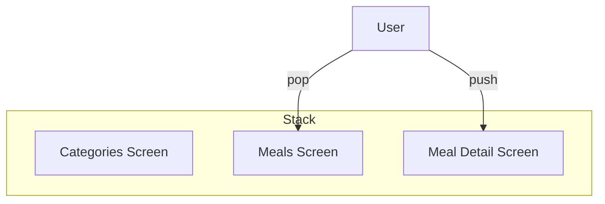

#### Pushing a New Screen

```dart
// Navigate forward
Navigator.of(context).push(
  MaterialPageRoute(
    builder: (ctx) => MealDetailsScreen(mealId: meal.id),
  ),
);
```

#### Popping a Screen

```dart
// Go back
Navigator.of(context).pop();

// Go back WITH data
Navigator.of(context).pop(true); // returns bool to caller
```

#### Passing Data to a Screen

```dart
// Define the target screen
class MealDetailsScreen extends StatelessWidget {
  const MealDetailsScreen({required this.meal, super.key});
  final Meal meal;

  @override
  Widget build(BuildContext context) {
    return Scaffold(
      appBar: AppBar(title: Text(meal.title)),
      body: Text(meal.description),
    );
  }
}

// Navigate and pass the data
Navigator.of(context).push(
  MaterialPageRoute(builder: (ctx) => MealDetailsScreen(meal: selectedMeal)),
);
```

#### Receiving Data When Popping

```dart
void selectCategory(BuildContext context) async {
  final result = await Navigator.of(context).push<bool>(
    MaterialPageRoute(builder: (ctx) => const FiltersScreen()),
  );

  if (result == null || !result) return;
  // use result
}
```

#### Tab Navigation

```dart
class TabsScreen extends StatefulWidget {
  const TabsScreen({super.key});

  @override
  State<TabsScreen> createState() => _TabsScreenState();
}

class _TabsScreenState extends State<TabsScreen> {
  int _selectedPageIndex = 0;

  void _selectPage(int index) {
    setState(() => _selectedPageIndex = index);
  }

  @override
  Widget build(BuildContext context) {
    Widget activePage = _selectedPageIndex == 0
        ? const CategoriesScreen()
        : const FavoritesScreen();

    return Scaffold(
      body: activePage,
      bottomNavigationBar: BottomNavigationBar(
        currentIndex: _selectedPageIndex,
        onTap: _selectPage,
        items: const [
          BottomNavigationBarItem(icon: Icon(Icons.set_meal), label: 'Categories'),
          BottomNavigationBarItem(icon: Icon(Icons.star), label: 'Favorites'),
        ],
      ),
    );
  }
}
```

#### Drawer Navigation

```dart
Scaffold(
  appBar: AppBar(title: const Text('Meals')),
  drawer: MainDrawer(onSelectScreen: _setScreen),
  body: ...,
)

// MainDrawer widget
class MainDrawer extends StatelessWidget {
  const MainDrawer({required this.onSelectScreen, super.key});
  final void Function(String identifier) onSelectScreen;

  @override
  Widget build(BuildContext context) {
    return Drawer(
      child: Column(
        children: [
          ListTile(
            leading: const Icon(Icons.filter_alt),
            title: const Text('Filters'),
            onTap: () => onSelectScreen('filters'),
          ),
        ],
      ),
    );
  }
}
```

#### GridView

```dart
GridView(
  gridDelegate: const SliverGridDelegateWithFixedCrossAxisCount(
    crossAxisCount: 2,
    childAspectRatio: 3 / 2,
    crossAxisSpacing: 20,
    mainAxisSpacing: 20,
  ),
  children: availableCategories.map((category) => CategoryGridItem(
    category: category,
    onSelectCategory: () => _selectCategory(context, category),
  )).toList(),
)
```

#### PopScope (Back Button Handling)

```dart
PopScope(
  canPop: false, // prevent default back navigation
  onPopInvoked: (didPop) {
    if (didPop) return;
    // Return custom data before popping
    Navigator.of(context).pop({'gluten_free': _glutenFreeFilterSet});
  },
  child: Scaffold(...),
)
```

### Diagrams

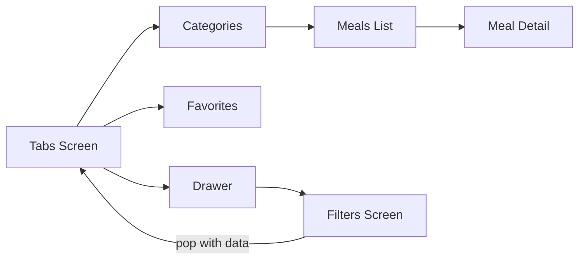

### Common Mistakes

| Mistake | Correct Approach |
|---|---|
| Using `Navigator.push` without `await` when expecting return data | Use `await Navigator.push()` when you need a result |
| Passing too much data through navigation arguments | Use a state management solution (Riverpod) for shared data |
| Accessing `context` after an async gap without checking `mounted` | Check `if (!mounted) return;` after `await` |

### Practice Tasks

- [ ] Create two screens and navigate between them with a button
- [ ] Pass a meal object to a detail screen and display its properties
- [ ] Build a `BottomNavigationBar` with two tabs
- [ ] Add a `Drawer` with two navigation options
- [ ] Implement a filter screen that returns filter selections on pop

### Review Questions

1. What is the difference between `push` and `pushReplacement`?
2. How do you pass data back to the previous screen when popping?
3. When would you use `Navigator.of(context).pop()` vs the device back button?
4. What is the purpose of `SliverGridDelegateWithFixedCrossAxisCount`?

### Section Summary

The Meals App demonstrates the three main navigation patterns: stack (push/pop), tabs (`BottomNavigationBar`), and drawer. Data flows forward via constructor arguments and backward via `pop()` return values. For complex multi-widget state, prop-drilling callbacks become unwieldy — that motivates the next section on Riverpod.

---

## Section 09 — State Management with Riverpod

### Overview

`setState()` works great for one widget's state. But when many unrelated widgets need the same data, passing it through layers of callbacks becomes a mess. Riverpod provides a clean, centralized solution.

### Learning Objectives

- [ ] Explain the problem with prop drilling
- [ ] Set up Riverpod in a Flutter app
- [ ] Create `Provider` and `StateNotifierProvider`
- [ ] Read providers in widgets with `ConsumerWidget` or `Consumer`
- [ ] Combine providers (dependent providers)
- [ ] Replace local `setState()` patterns with Riverpod providers

### Lessons Covered

| # | Lesson Title |
|---|---|
| 001 | Problems with `setState` at Scale |
| 002 | What is Riverpod |
| 003 | Installing Riverpod |
| 004 | Creating Providers |
| 005 | Using Providers in Widgets |
| 006 | StateNotifier for Complex State |
| 007 | Managing Favorites with Providers |
| 008 | Triggering Notifier Methods |
| 009 | Combining Providers |
| 010 | Swapping UI Based on Provider State |
| 011 | Riverpod vs Provider |
| ... | (additional lessons) |

### Key Concepts

#### The Problem: Prop Drilling

```
AppWidget (has favorites list)
  └── TabsScreen
      └── FavoritesScreen
          └── MealCard (needs favorites list)
                              ← needs to know if meal is favorite
```

Every intermediate widget must receive and forward the data, even if it doesn't use it.

#### Riverpod Architecture

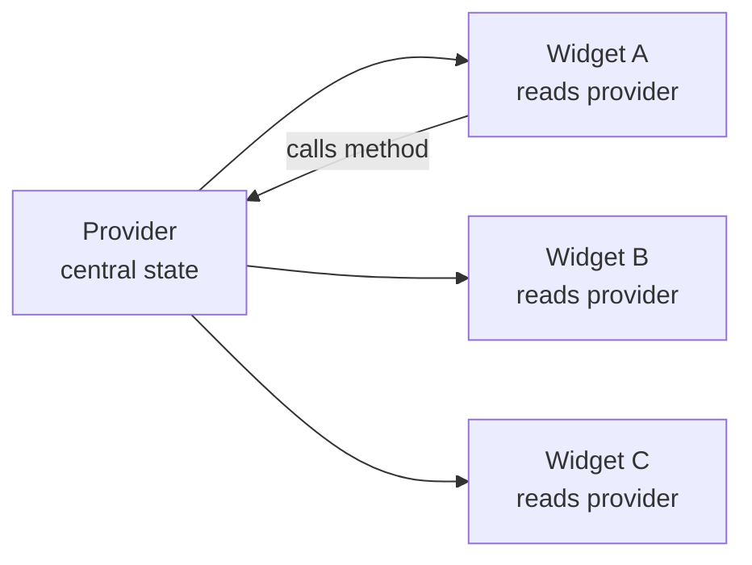

#### Setup

```yaml
# pubspec.yaml
dependencies:
  flutter_riverpod: ^2.4.0
```

```dart
// main.dart — wrap app in ProviderScope
import 'package:flutter_riverpod/flutter_riverpod.dart';

void main() {
  runApp(const ProviderScope(child: MyApp()));
}
```

#### Creating a Simple Provider

```dart
// A provider that exposes a list of meals (read-only)
final mealsProvider = Provider<List<Meal>>((ref) {
  return dummyMeals; // your data source
});
```

#### StateNotifier + StateNotifierProvider (Mutable State)

```dart
// 1. Define the notifier (business logic)
class FavoriteMealsNotifier extends StateNotifier<List<Meal>> {
  FavoriteMealsNotifier() : super([]);

  bool toggleMealFavoriteStatus(Meal meal) {
    final isFavorite = state.contains(meal);
    if (isFavorite) {
      state = state.where((m) => m.id != meal.id).toList();
      return false;
    } else {
      state = [...state, meal];
      return true;
    }
  }
}

// 2. Create the provider
final favoriteMealsProvider =
    StateNotifierProvider<FavoriteMealsNotifier, List<Meal>>(
  (ref) => FavoriteMealsNotifier(),
);
```

#### Using Providers in Widgets

**Option A: `ConsumerWidget` (preferred for full widget conversion)**
```dart
class FavoritesScreen extends ConsumerWidget {
  const FavoritesScreen({super.key});

  @override
  Widget build(BuildContext context, WidgetRef ref) {
    // watch() rebuilds this widget when the value changes
    final favorites = ref.watch(favoriteMealsProvider);

    if (favorites.isEmpty) {
      return const Center(child: Text('No favorites yet.'));
    }

    return MealsList(meals: favorites);
  }
}
```

**Option B: `Consumer` widget (for partial rebuilds inside a larger widget)**
```dart
Consumer(
  builder: (ctx, ref, child) {
    final favorites = ref.watch(favoriteMealsProvider);
    return Text('${favorites.length} favorites');
  },
)
```

#### Calling Notifier Methods

```dart
// In a widget:
ref.read(favoriteMealsProvider.notifier).toggleMealFavoriteStatus(meal);
//    ^-- use .read() when calling a method (no rebuild needed)
//    use .watch() when you need the state value
```

#### Combining Providers (Dependent Providers)

```dart
// A provider that filters meals based on filter settings
final filteredMealsProvider = Provider<List<Meal>>((ref) {
  final meals = ref.watch(mealsProvider);       // depends on mealsProvider
  final filters = ref.watch(filtersProvider);   // depends on filtersProvider

  return meals.where((meal) {
    if (filters[Filter.glutenFree]! && !meal.isGlutenFree) return false;
    if (filters[Filter.vegan]! && !meal.isVegan) return false;
    return true;
  }).toList();
});
```

### Diagrams

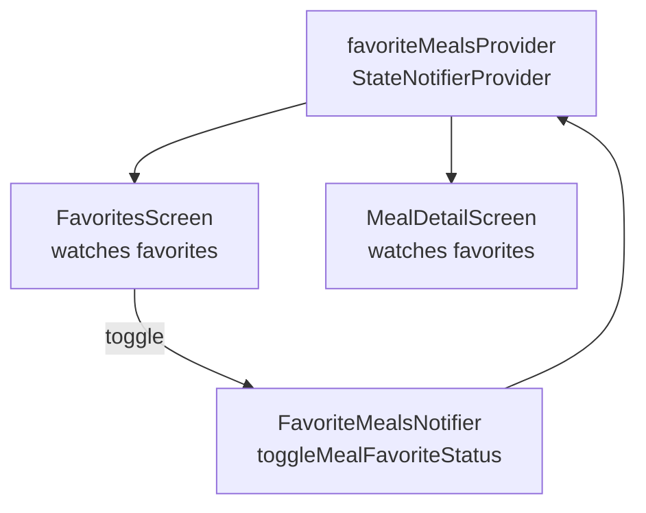

### Common Mistakes

| Mistake | Correct Approach |
|---|---|
| Using `.watch()` when calling a method | Use `.read()` in event handlers; `.watch()` only in `build()` |
| Forgetting `ProviderScope` in `main()` | Wrap your app in `ProviderScope` |
| Mutating state directly in `StateNotifier` | Always replace `state` with a new value — never mutate |
| Over-using providers for local widget state | Use `setState()` for state that is truly local to one widget |

### Practice Tasks

- [ ] Add Riverpod to the Meals App
- [ ] Move the favorites list from local state to a `StateNotifierProvider`
- [ ] Move the filters from a callback-heavy flow to a `StateNotifierProvider`
- [ ] Create a `filteredMealsProvider` that combines meals and filters

### Review Questions

1. What is the difference between `ref.watch()` and `ref.read()`?
2. Why must you never mutate `state` directly in a `StateNotifier`?
3. What does `ProviderScope` do?
4. When should you still use `setState()` even when using Riverpod?

### Section Summary

Riverpod centralizes state in providers that any widget can read without prop drilling. `Provider` is for computed/read-only values. `StateNotifierProvider` is for mutable state with logic. Use `ref.watch()` in `build()` to react to changes, and `ref.read()` in callbacks to call methods. Combined providers build derived state from multiple sources.

---

## Section 10 — Animations

### Overview

Animations make apps feel polished and responsive. Flutter provides two animation systems: implicit (easy, limited control) and explicit (full control, more code). You will also animate screen transitions.

### Learning Objectives

- [ ] Distinguish explicit and implicit animations
- [ ] Use `AnimationController` for full-control animations
- [ ] Use `AnimatedBuilder` to rebuild on animation tick
- [ ] Use implicit animated widgets (`AnimatedContainer`, `AnimatedOpacity`, etc.)
- [ ] Apply custom animation curves and durations
- [ ] Animate route/page transitions

### Lessons Covered

| # | Lesson Title |
|---|---|
| 001 | Why Animations Matter |
| 002 | Explicit vs Implicit Animations |
| 003 | AnimationController Setup |
| 004 | AnimatedBuilder |
| 005 | Duration, Curves, Repeat |
| 006 | Implicit Animations |
| 007 | Multi-Screen Transitions |
| 008 | Animation Curves & Timing |
| 009 | Hero Animations |

### Key Concepts

#### Explicit Animations — Full Control

Requires:
1. A `TickerProvider` (use `with SingleTickerProviderStateMixin`)
2. An `AnimationController` (drives the animation)
3. A `Tween` (maps controller value to usable range)
4. An `AnimatedBuilder` (rebuilds on each tick)

```dart
class _MyWidgetState extends State<MyWidget>
    with SingleTickerProviderStateMixin {
  late AnimationController _controller;
  late Animation<double> _animation;

  @override
  void initState() {
    super.initState();
    _controller = AnimationController(
      vsync: this,
      duration: const Duration(milliseconds: 300),
    );
    _animation = Tween<double>(begin: 0, end: 1).animate(
      CurvedAnimation(parent: _controller, curve: Curves.easeIn),
    );
    _controller.forward(); // start
  }

  @override
  void dispose() {
    _controller.dispose();
    super.dispose();
  }

  @override
  Widget build(BuildContext context) {
    return AnimatedBuilder(
      animation: _animation,
      builder: (context, child) {
        return Opacity(
          opacity: _animation.value,
          child: child,
        );
      },
      child: const Text('Hello'), // not rebuilt on every frame
    );
  }
}
```

#### Implicit Animations — Easy and Automatic

Flutter provides widgets that automatically animate between property changes:

```dart
// AnimatedContainer: animates size, color, padding, decoration
AnimatedContainer(
  duration: const Duration(milliseconds: 300),
  curve: Curves.easeInOut,
  width: isExpanded ? 200 : 100,
  height: isExpanded ? 200 : 100,
  color: isExpanded ? Colors.blue : Colors.red,
  child: ...,
)

// AnimatedOpacity: fades in/out
AnimatedOpacity(
  opacity: isVisible ? 1.0 : 0.0,
  duration: const Duration(milliseconds: 500),
  child: const Text('Fade me'),
)

// AnimatedSwitcher: animates between two different widgets
AnimatedSwitcher(
  duration: const Duration(milliseconds: 300),
  child: Text('$counter', key: ValueKey(counter)),
)
```

#### Common Curves

| Curve | Effect |
|---|---|
| `Curves.linear` | Constant speed |
| `Curves.easeIn` | Slow start, fast finish |
| `Curves.easeOut` | Fast start, slow finish |
| `Curves.easeInOut` | Slow start, fast middle, slow finish |
| `Curves.bounceOut` | Bounces at the end |
| `Curves.elasticOut` | Spring-like bounce |

#### Screen Transitions

```dart
Navigator.of(context).push(
  PageRouteBuilder(
    pageBuilder: (ctx, animation, secondaryAnimation) =>
        const DetailScreen(),
    transitionsBuilder: (ctx, animation, secondaryAnimation, child) {
      return SlideTransition(
        position: Tween<Offset>(
          begin: const Offset(1, 0), // starts from right
          end: Offset.zero,
        ).animate(animation),
        child: child,
      );
    },
  ),
);
```

#### Hero Animation (Shared Element)

```dart
// In source screen
Hero(
  tag: 'meal-${meal.id}', // must match destination tag
  child: Image.asset(meal.imageUrl),
)

// In destination screen
Hero(
  tag: 'meal-${meal.id}',
  child: Image.asset(meal.imageUrl),
)
// Flutter automatically animates the image between screens
```

### Diagrams

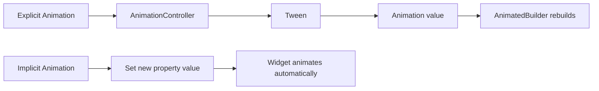

### Common Mistakes

| Mistake | Correct Approach |
|---|---|
| Not disposing `AnimationController` | Always dispose in `dispose()` |
| Animating inside `build()` directly | Use `AnimatedBuilder` or implicit widgets |
| Forgetting `key` on `AnimatedSwitcher` child | Add `ValueKey` to trigger the animation |

### Practice Tasks

- [ ] Add a fade-in animation to the Quiz App's start screen
- [ ] Use `AnimatedContainer` to expand/collapse a widget on button tap
- [ ] Create a custom page transition (slide from bottom)
- [ ] Add a `Hero` animation between a list item and a detail screen

### Review Questions

1. When should you use explicit animations vs implicit animations?
2. What does `vsync: this` do in an `AnimationController`?
3. Why must you pass a `key` to the child of `AnimatedSwitcher`?
4. What is a `Tween`?

### Section Summary

Animations in Flutter are divided into implicit (simple, auto-trigger on property change) and explicit (manual controller, more powerful). Use implicit widgets for most cases. Use `AnimationController` + `AnimatedBuilder` when you need precise timing or custom logic. Always dispose controllers. `Hero` widgets create elegant shared-element transitions with zero extra code.

---

## Section 11 — Forms & User Input

**Project Built: Shopping List App**

### Overview

This section covers the `Form` widget, which is Flutter's structured approach to collecting and validating user input. You will build a shopping list app where items are added through a validated form.

### Learning Objectives

- [ ] Use `Form` and `TextFormField` for structured input
- [ ] Apply validators to form fields
- [ ] Use `GlobalKey<FormState>` to control a form programmatically
- [ ] Extract and use form values on submission
- [ ] Use `DropdownButtonFormField` inside a form
- [ ] Reset and clear forms

### Lessons Covered

| # | Lesson Title |
|---|---|
| 001 | Building Data Models |
| 002 | Form Widget |
| 003 | TextFormField |
| 004 | Form-Aware Dropdown |
| 005 | Form Buttons |
| 006 | Validation Logic |
| 007 | GlobalKey for Form Access |
| 008 | Extracting Form Values |
| 009 | Passing Data Between Screens |
| 010 | Validation Error Messages |
| ... | (additional lessons) |

### Key Concepts

#### The Form Widget Pattern

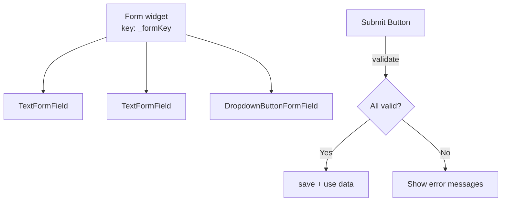

#### Complete Form Example

```dart
class NewItem extends StatefulWidget {
  const NewItem({super.key});

  @override
  State<NewItem> createState() => _NewItemState();
}

class _NewItemState extends State<NewItem> {
  final _formKey = GlobalKey<FormState>();
  var _enteredName = '';
  var _enteredQuantity = 1;
  var _selectedCategory = categories[Categories.vegetables]!;

  void _saveItem() {
    if (_formKey.currentState!.validate()) {
      _formKey.currentState!.save(); // triggers onSaved on each field
      Navigator.of(context).pop(Item(
        name: _enteredName,
        quantity: _enteredQuantity,
        category: _selectedCategory,
      ));
    }
  }

  @override
  Widget build(BuildContext context) {
    return Scaffold(
      appBar: AppBar(title: const Text('Add a new item')),
      body: Padding(
        padding: const EdgeInsets.all(12),
        child: Form(
          key: _formKey,
          child: Column(
            children: [
              TextFormField(
                maxLength: 50,
                decoration: const InputDecoration(label: Text('Name')),
                validator: (value) {
                  if (value == null ||
                      value.isEmpty ||
                      value.trim().length <= 1 ||
                      value.trim().length > 50) {
                    return 'Must be between 2 and 50 characters.';
                  }
                  return null; // null = valid
                },
                onSaved: (value) => _enteredName = value!,
              ),
              TextFormField(
                decoration: const InputDecoration(label: Text('Quantity')),
                keyboardType: TextInputType.number,
                initialValue: '1',
                validator: (value) {
                  if (value == null ||
                      value.isEmpty ||
                      int.tryParse(value) == null ||
                      int.tryParse(value)! <= 0) {
                    return 'Must be a valid, positive number.';
                  }
                  return null;
                },
                onSaved: (value) => _enteredQuantity = int.parse(value!),
              ),
              DropdownButtonFormField(
                value: _selectedCategory,
                items: [
                  for (final category in categories.entries)
                    DropdownMenuItem(
                      value: category.value,
                      child: Row(children: [
                        Container(
                          width: 16,
                          height: 16,
                          color: category.value.color,
                        ),
                        const SizedBox(width: 6),
                        Text(category.value.title),
                      ]),
                    ),
                ],
                onChanged: (value) => _selectedCategory = value!,
              ),
              Row(
                mainAxisAlignment: MainAxisAlignment.end,
                children: [
                  TextButton(
                    onPressed: () => _formKey.currentState!.reset(),
                    child: const Text('Reset'),
                  ),
                  ElevatedButton(
                    onPressed: _saveItem,
                    child: const Text('Add Item'),
                  ),
                ],
              ),
            ],
          ),
        ),
      ),
    );
  }
}
```

#### Validation Rules Reference

```dart
// Required field
validator: (value) => value == null || value.isEmpty ? 'Required' : null,

// Min/max length
validator: (value) {
  if (value!.length < 2) return 'Too short';
  if (value.length > 50) return 'Too long';
  return null;
},

// Numeric
validator: (value) {
  if (int.tryParse(value!) == null) return 'Enter a number';
  return null;
},

// Email pattern
validator: (value) {
  if (!value!.contains('@')) return 'Invalid email';
  return null;
},
```

### Common Mistakes

| Mistake | Correct Approach |
|---|---|
| Calling `.validate()` without a `GlobalKey` | Always provide `key: _formKey` to the `Form` |
| Forgetting `onSaved` on fields | Define `onSaved` to capture values when `save()` is called |
| Using `TextEditingController` with `Form` | Prefer `onSaved` with `Form`; use `TextEditingController` only with `TextField` |
| Returning a non-null string even for valid input | Return `null` (not empty string) for valid |

### Practice Tasks

- [ ] Build a form with name (String) and quantity (int) fields
- [ ] Add validators that show inline error messages
- [ ] Add a reset button that clears the form
- [ ] Navigate back with the submitted item data using `Navigator.pop(item)`

### Review Questions

1. What does returning `null` from a `validator` mean?
2. What does `_formKey.currentState!.save()` do?
3. What is the difference between `TextField` and `TextFormField`?
4. When is `validate()` called — real-time or on submit?

### Section Summary

The `Form` widget in Flutter groups related fields and provides a single point of validation and data extraction. Use `GlobalKey<FormState>` to access the form from outside. Each `TextFormField` has a `validator` that returns `null` for valid and a message string for invalid. Call `validate()` to trigger all validators, then `save()` to call all `onSaved` callbacks and collect the values.

---

## Section 12 — HTTP, Networking & Backend Communication

**Project: Extended Shopping List App**

### Overview

Most apps need a backend server. This section uses Firebase as a simple REST backend and covers sending GET, POST, and DELETE requests, handling async responses, loading states, and errors.

### Learning Objectives

- [ ] Explain why apps need a backend
- [ ] Send GET and POST HTTP requests using the `http` package
- [ ] Parse JSON responses into Dart objects
- [ ] Show loading, success, and error states in the UI
- [ ] Use `FutureBuilder` for async UI
- [ ] Handle errors from HTTP responses

### Lessons Covered

| # | Lesson Title |
|---|---|
| 001 | What is a Backend |
| 002 | Why Flutter Apps Need Backends |
| 003 | HTTP Protocol Basics |
| 004 | HTTP Methods |
| 005 | Setting Up Firebase Backend |
| 006 | `http` Package Integration |
| 007 | Sending POST Requests |
| 008 | Awaiting Responses |
| 009 | Fetching and Transforming Data |
| 010 | Avoiding Unnecessary Requests |
| 011 | Managing Loading State |
| 012 | Error Response Handling |
| 013 | Sending DELETE Requests |
| 014 | Handling Empty Data |
| 015 | FutureBuilder Widget |
| 016 | Async/Await Patterns |

### Key Concepts

#### HTTP Methods

| Method | Purpose | Example |
|---|---|---|
| `GET` | Read data | Fetch list of items |
| `POST` | Create new data | Add an item |
| `PUT` | Replace an item | Update an item fully |
| `PATCH` | Update part of an item | Update one field |
| `DELETE` | Remove data | Delete an item |

#### Setup

```yaml
# pubspec.yaml
dependencies:
  http: ^1.1.0
```

```dart
import 'package:http/http.dart' as http;
import 'dart:convert'; // for jsonDecode / jsonEncode
```

#### POST Request (Create)

```dart
Future<void> addItem(Item item) async {
  final url = Uri.https(
    'your-project.firebaseio.com',
    'shopping-list.json',
  );

  final response = await http.post(
    url,
    headers: {'Content-Type': 'application/json'},
    body: jsonEncode({
      'name': item.name,
      'quantity': item.quantity,
      'category': item.category.title,
    }),
  );

  // Firebase returns the new item's auto-generated id
  final Map<String, dynamic> resData = jsonDecode(response.body);
  final newId = resData['name'];
  // use newId to update local state
}
```

#### GET Request (Read)

```dart
Future<List<Item>> fetchItems() async {
  final url = Uri.https(
    'your-project.firebaseio.com',
    'shopping-list.json',
  );

  final response = await http.get(url);

  if (response.statusCode >= 400) {
    throw Exception('Failed to fetch items.');
  }

  if (response.body == 'null') {
    return []; // Firebase returns 'null' string when no data
  }

  final Map<String, dynamic> listData = jsonDecode(response.body);
  final List<Item> loadedItems = [];

  for (final item in listData.entries) {
    final category = categories.entries
        .firstWhere((c) => c.value.title == item.value['category'])
        .value;

    loadedItems.add(Item(
      id: item.key,
      name: item.value['name'],
      quantity: item.value['quantity'],
      category: category,
    ));
  }

  return loadedItems;
}
```

#### DELETE Request

```dart
Future<void> removeItem(Item item) async {
  final url = Uri.https(
    'your-project.firebaseio.com',
    'shopping-list/${item.id}.json',
  );
  await http.delete(url);
}
```

#### Managing Loading and Error State

```dart
class _ListState extends State<GroceryList> {
  List<Item> _groceryItems = [];
  var _isLoading = true;
  String? _error;

  @override
  void initState() {
    super.initState();
    _loadItems();
  }

  void _loadItems() async {
    try {
      final items = await fetchItems();
      setState(() {
        _groceryItems = items;
        _isLoading = false;
      });
    } catch (error) {
      setState(() {
        _error = 'Something went wrong. Please try again later.';
        _isLoading = false;
      });
    }
  }

  @override
  Widget build(BuildContext context) {
    if (_isLoading) {
      return const Center(child: CircularProgressIndicator());
    }
    if (_error != null) {
      return Center(child: Text(_error!));
    }
    if (_groceryItems.isEmpty) {
      return const Center(child: Text('No items yet.'));
    }
    return ListView.builder(...);
  }
}
```

#### FutureBuilder Alternative

```dart
FutureBuilder<List<Item>>(
  future: fetchItems(), // called once
  builder: (context, snapshot) {
    if (snapshot.connectionState == ConnectionState.waiting) {
      return const CircularProgressIndicator();
    }
    if (snapshot.hasError) {
      return Text('Error: ${snapshot.error}');
    }
    if (!snapshot.hasData || snapshot.data!.isEmpty) {
      return const Text('No items.');
    }
    return ListView.builder(
      itemCount: snapshot.data!.length,
      itemBuilder: (ctx, i) => ItemTile(item: snapshot.data![i]),
    );
  },
)
```

### Diagrams

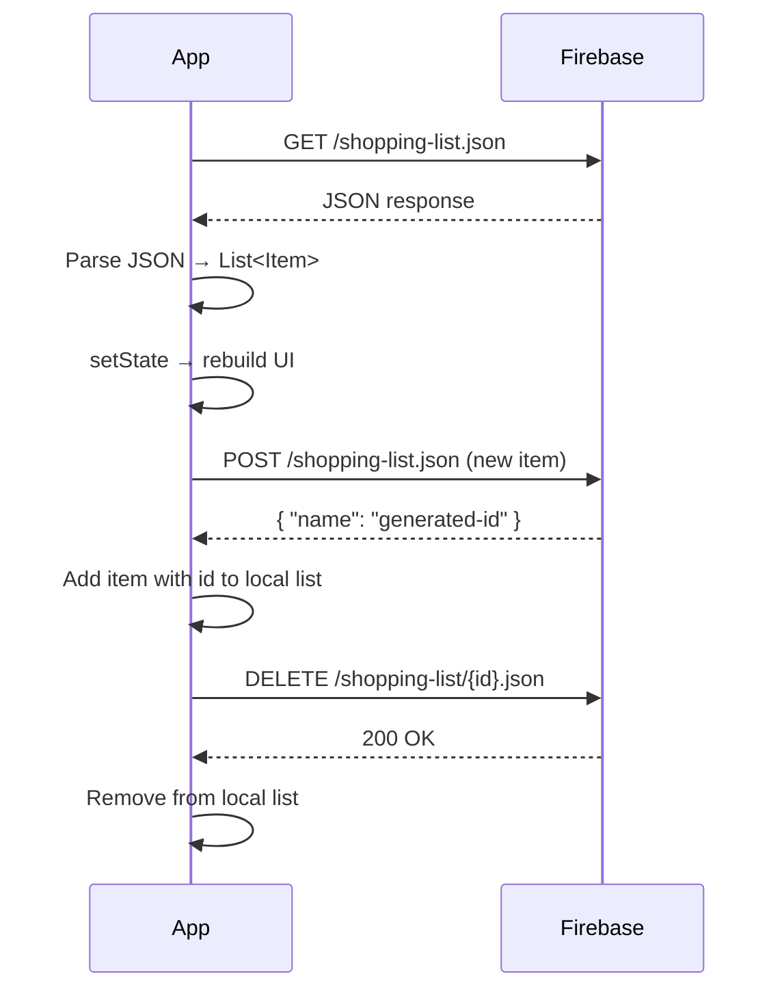

### Common Mistakes

| Mistake | Correct Approach |
|---|---|
| Not checking `response.statusCode` | Always check for 4xx/5xx status codes |
| Calling `fetchItems()` inside `build()` directly | Call in `initState()` or use `FutureBuilder` with a stored future |
| Using `FutureBuilder` with `future: fetchItems()` in build | Store the future in `initState()` to avoid refetch on every rebuild |
| Forgetting `'null'` check for Firebase empty collections | Firebase returns the string `'null'` not actual null |

### Practice Tasks

- [ ] Add Firebase Realtime Database to your Shopping List project
- [ ] Fetch items on app start and display them
- [ ] POST new items and get back the Firebase-generated id
- [ ] DELETE an item and sync local state
- [ ] Show a loading spinner and an error message

### Review Questions

1. What HTTP method creates a new resource? What method deletes one?
2. What does `jsonDecode()` return?
3. Why should you not call `fetchItems()` directly inside `build()`?
4. What does Firebase return when there are no items in a collection?

### Section Summary

HTTP requests in Flutter use the `http` package with `async/await`. Always check response status codes and handle errors with try/catch. Show loading, success, and error states for good UX. `FutureBuilder` provides a reactive way to handle async data in the widget tree. Firebase Realtime Database is a convenient REST backend for practice.

---

## Section 13 — Native Device Features, Camera, Maps & Local Storage

**Project Built: Favorite Places App**

### Overview

This is the most device-integrated section. You will access the camera, get GPS coordinates, display interactive maps, look up addresses, and persist data to a local SQLite database — all from Flutter.

### Learning Objectives

- [ ] Pick images from the camera and gallery
- [ ] Store images permanently on the device
- [ ] Get the current GPS location
- [ ] Display a Google Map with markers
- [ ] Let users pick a location on a map
- [ ] Convert coordinates to a human-readable address
- [ ] Store and retrieve data with SQLite

### Lessons Covered

| # | Lesson Title |
|---|---|
| 001 | Place Data Model |
| 002 | Places Screen UI |
| 003 | Add Place Screen |
| 004 | Riverpod Provider Setup |
| 005 | Adding Places |
| 006 | Place Details Screen |
| 007 | Image Picker Integration |
| 008 | Capturing Images from Camera |
| 009 | Storing Images on Device |
| 010 | Location Package Integration |
| 011 | Getting Current GPS Location |
| 012 | Google Maps API Setup |
| 013 | Google Geocoding API |
| 014 | Storing Location Data |
| 015 | Map Snapshot Preview |
| 016 | Using Picked Location |
| 017 | Google Maps Package Config |
| 018 | Map Screen with Markers |
| 019 | Handling Map Taps |
| 020 | SQLite Local Storage |
| 021 | Storing Images Locally |
| 022 | Storing Place Data in SQLite |
| 023 | Loading Data from Database |
| 024 | FutureBuilder for Async Loading |
| 025 | Permission Handling |
| ... | (additional lessons) |

### Key Concepts

#### Packages Used

```yaml
dependencies:
  image_picker: ^1.0.0       # Camera & gallery
  location: ^5.0.0           # GPS
  google_maps_flutter: ^2.5.0 # Map display
  geocoding: ^2.1.0          # Address lookup
  sqflite: ^2.3.0            # Local SQL database
  path_provider: ^2.1.0      # Device file paths
  path: ^1.8.0               # Safe path joining
```

#### Image Picker

```dart
import 'package:image_picker/image_picker.dart';
import 'dart:io';

class ImageInput extends StatefulWidget { ... }

class _ImageInputState extends State<ImageInput> {
  File? _selectedImage;

  void _takePicture() async {
    final imagePicker = ImagePicker();
    final pickedImage = await imagePicker.pickImage(
      source: ImageSource.camera,
      maxWidth: 600,
    );

    if (pickedImage == null) return;

    setState(() {
      _selectedImage = File(pickedImage.path);
    });

    widget.onPickImage(_selectedImage!);
  }
  // ...
}
```

#### Storing Images Permanently

`image_picker` returns a **temporary** path. To persist the image, copy it to your app's documents directory:

```dart
import 'package:path_provider/path_provider.dart';
import 'package:path/path.dart' as path;

Future<String> saveImagePermanently(File tempImage) async {
  final appDir = await getApplicationDocumentsDirectory();
  final filename = path.basename(tempImage.path);
  final savedImage = await tempImage.copy('${appDir.path}/$filename');
  return savedImage.path;
}
```

#### Getting GPS Location

```dart
import 'package:location/location.dart';

Future<LocationData?> getCurrentLocation() async {
  Location location = Location();

  bool serviceEnabled = await location.serviceEnabled();
  if (!serviceEnabled) {
    serviceEnabled = await location.requestService();
    if (!serviceEnabled) return null;
  }

  PermissionStatus permissionStatus = await location.hasPermission();
  if (permissionStatus == PermissionStatus.denied) {
    permissionStatus = await location.requestPermission();
    if (permissionStatus != PermissionStatus.granted) return null;
  }

  return location.getLocation();
}
```

#### Google Maps Static Snapshot (Preview)

Use the Maps Static API for a simple preview image (no interaction):

```dart
String get locationImage {
  final lat = location.latitude;
  final lng = location.longitude;
  return 'https://maps.googleapis.com/maps/api/staticmap?center=$lat,$lng&zoom=16&size=600x300&maptype=roadmap&markers=color:red%7Clabel:A%7C$lat,$lng&key=YOUR_API_KEY';
}

Image.network(locationImage)
```

#### Interactive Google Map

```dart
import 'package:google_maps_flutter/google_maps_flutter.dart';

GoogleMap(
  onTap: (position) {
    setState(() => _pickedLocation = position);
  },
  initialCameraPosition: CameraPosition(
    target: LatLng(37.422, -122.084),
    zoom: 16,
  ),
  markers: _pickedLocation == null
      ? {}
      : {
          Marker(
            markerId: const MarkerId('m1'),
            position: _pickedLocation!,
          ),
        },
)
```

#### Geocoding (Coordinates → Address)

```dart
import 'package:geocoding/geocoding.dart';

Future<String> getAddressFromCoordinates(double lat, double lng) async {
  final placemarks = await placemarkFromCoordinates(lat, lng);
  final place = placemarks.first;
  return '${place.street}, ${place.locality}, ${place.country}';
}
```

#### SQLite Local Database

```dart
import 'package:sqflite/sqflite.dart';
import 'package:path/path.dart' as path;
import 'package:path_provider/path_provider.dart';

class PlacesDatabase {
  static Future<Database> _getDatabase() async {
    final dbPath = await getDatabasesPath();
    return openDatabase(
      path.join(dbPath, 'places.db'),
      onCreate: (db, version) {
        return db.execute(
          'CREATE TABLE user_places(id TEXT PRIMARY KEY, title TEXT, image TEXT, lat REAL, lng REAL, address TEXT)',
        );
      },
      version: 1,
    );
  }

  static Future<void> insertPlace(Place place) async {
    final db = await _getDatabase();
    await db.insert(
      'user_places',
      {
        'id': place.id,
        'title': place.title,
        'image': place.image.path,
        'lat': place.location.latitude,
        'lng': place.location.longitude,
        'address': place.location.address,
      },
      conflictAlgorithm: ConflictAlgorithm.replace,
    );
  }

  static Future<List<Place>> fetchPlaces() async {
    final db = await _getDatabase();
    final rows = await db.query('user_places');
    return rows.map((row) => Place.fromMap(row)).toList();
  }
}
```

#### Platform Permissions

**Android** (`android/app/src/main/AndroidManifest.xml`):
```xml
<uses-permission android:name="android.permission.CAMERA" />
<uses-permission android:name="android.permission.ACCESS_FINE_LOCATION" />
<uses-permission android:name="android.permission.ACCESS_COARSE_LOCATION" />
```

**iOS** (`ios/Runner/Info.plist`):
```xml
<key>NSCameraUsageDescription</key>
<string>This app needs access to your camera.</string>
<key>NSLocationWhenInUseUsageDescription</key>
<string>This app needs your location to save place information.</string>
```

### Common Mistakes

| Mistake | Correct Approach |
|---|---|
| Using the temporary image path directly | Always copy the image to `getApplicationDocumentsDirectory()` |
| Forgetting platform permissions | Add entries to AndroidManifest.xml and Info.plist |
| Opening database multiple times | Use a singleton or static method |
| Not handling permission denial gracefully | Check permission status and show a message if denied |

### Practice Tasks

- [ ] Build a screen that lets the user take a photo and preview it
- [ ] Get the device's current location and display the coordinates
- [ ] Show a static map preview using the Google Maps Static API
- [ ] Display an interactive map and let the user pick a location
- [ ] Store place data in SQLite and load it on app start

### Review Questions

1. Why do you need to copy the image from the temporary path?
2. What is the difference between `getApplicationDocumentsDirectory()` and the temp directory?
3. What SQL statement creates a table?
4. How do you convert GPS coordinates to a human-readable address?

### Section Summary

The Favorite Places App integrates camera, GPS, maps, geocoding, and a local SQLite database. Each native feature requires a dedicated package and platform-specific permissions. Images must be copied to persistent storage. SQLite stores structured data locally — great for offline-first apps. Riverpod ties the state management together across multiple screens.

---

## Section 14 — Firebase, Authentication & Push Notifications

**Project Built: Chat Application**

### Overview

The Chat App uses the full Firebase suite: Authentication for user accounts, Cloud Firestore for real-time messages, Firebase Storage for profile images, and Firebase Cloud Messaging for push notifications. This is the most complete real-world project in the course.

### Learning Objectives

- [ ] Set up Firebase Authentication for sign-up and login
- [ ] Detect authentication state changes
- [ ] Upload images to Firebase Storage
- [ ] Store and read data in Cloud Firestore
- [ ] Listen to Firestore streams for real-time updates
- [ ] Use `StreamBuilder` to display live data
- [ ] Send and receive push notifications with FCM

### Lessons Covered

| # | Lesson Title |
|---|---|
| 001 | Firebase Authentication Setup |
| 002 | User Sign-Up Flow |
| 003 | User Login Flow |
| 004 | Authentication State Detection |
| 005 | Splash/Loading Screen |
| 006 | User Logout |
| 007 | Image Upload to Firebase Storage |
| 008 | Image Picker for Profile Photos |
| 009 | Managing Selected Images |
| 010 | Uploading to Cloud Storage |
| 011 | Loading Spinner During Upload |
| 012 | Firestore Database Setup |
| 013 | Sending Messages to Firestore |
| 014 | Storing Username Data |
| 015 | Chat Message & Input Widgets |
| 016 | Reading Data from Firestore |
| 017 | Firestore Streams |
| 018 | Displaying Messages as Stream |
| 019 | Styling Chat Bubbles |
| 020 | Push Notifications Setup |
| 021 | Requesting Notification Permissions |
| 022 | Getting Device Tokens |
| 023 | Testing Push Notifications |
| 024 | Notification Topics |
| 025 | Sending via Cloud Functions |
| ... | (additional lessons) |

### Key Concepts

#### Firebase Setup

```yaml
dependencies:
  firebase_core: ^2.24.0
  firebase_auth: ^4.16.0
  cloud_firestore: ^4.14.0
  firebase_storage: ^11.6.0
  firebase_messaging: ^14.7.0
```

```dart
// main.dart
void main() async {
  WidgetsFlutterBinding.ensureInitialized();
  await Firebase.initializeApp(
    options: DefaultFirebaseOptions.currentPlatform,
  );
  runApp(const App());
}
```

#### Authentication

```dart
import 'package:firebase_auth/firebase_auth.dart';

// Sign up
final userCredential = await FirebaseAuth.instance.createUserWithEmailAndPassword(
  email: _enteredEmail,
  password: _enteredPassword,
);

// Login
await FirebaseAuth.instance.signInWithEmailAndPassword(
  email: _enteredEmail,
  password: _enteredPassword,
);

// Sign out
await FirebaseAuth.instance.signOut();

// Current user
final user = FirebaseAuth.instance.currentUser;
```

#### Auth State Stream (Automatic Screen Switching)

```dart
StreamBuilder(
  stream: FirebaseAuth.instance.authStateChanges(),
  builder: (ctx, snapshot) {
    if (snapshot.connectionState == ConnectionState.waiting) {
      return const SplashScreen();
    }
    if (snapshot.hasData) {
      return const ChatScreen();
    }
    return const AuthScreen();
  },
)
```

#### Uploading Profile Image to Firebase Storage

```dart
final storageRef = FirebaseStorage.instance
    .ref()
    .child('user_images')
    .child('${userCredential.user!.uid}.jpg');

await storageRef.putFile(selectedImage);

final imageUrl = await storageRef.getDownloadURL();
```

#### Writing to Cloud Firestore

```dart
await FirebaseFirestore.instance.collection('chat').add({
  'text': enteredMessage,
  'createdAt': Timestamp.now(),
  'userId': FirebaseAuth.instance.currentUser!.uid,
  'username': userData['username'],
  'userImage': userData['image_url'],
});
```

#### Reading with a Stream (Real-Time)

```dart
StreamBuilder(
  stream: FirebaseFirestore.instance
      .collection('chat')
      .orderBy('createdAt', descending: true)
      .snapshots(),
  builder: (ctx, snapshot) {
    if (!snapshot.hasData) {
      return const Center(child: CircularProgressIndicator());
    }
    final chatDocs = snapshot.data!.docs;
    return ListView.builder(
      reverse: true,
      itemCount: chatDocs.length,
      itemBuilder: (ctx, i) => MessageBubble(
        message: chatDocs[i].data()['text'],
        isMe: chatDocs[i].data()['userId'] ==
            FirebaseAuth.instance.currentUser!.uid,
      ),
    );
  },
)
```

#### Push Notifications (FCM)

```dart
import 'package:firebase_messaging/firebase_messaging.dart';

// Setup messaging
final fcm = FirebaseMessaging.instance;

// Request permission (iOS requires explicit request)
await fcm.requestPermission();

// Get device token (for targeting specific device)
final token = await fcm.getToken();
print('FCM Token: $token');

// Subscribe to topic (for broadcast)
await fcm.subscribeToTopic('chat');

// Listen to foreground messages
FirebaseMessaging.onMessage.listen((message) {
  print('Received: ${message.notification?.title}');
});
```

**Handle background notifications in main.dart:**
```dart
// Must be a top-level function
@pragma('vm:entry-point')
Future<void> _firebaseMessagingBackgroundHandler(RemoteMessage message) async {
  await Firebase.initializeApp();
  print('Background message: ${message.messageId}');
}

void main() async {
  WidgetsFlutterBinding.ensureInitialized();
  await Firebase.initializeApp();
  FirebaseMessaging.onBackgroundMessage(_firebaseMessagingBackgroundHandler);
  runApp(const App());
}
```

#### Chat Bubble Styling

```dart
class MessageBubble extends StatelessWidget {
  const MessageBubble({
    required this.message,
    required this.isMe,
    super.key,
  });

  final String message;
  final bool isMe;

  @override
  Widget build(BuildContext context) {
    return Align(
      alignment: isMe ? Alignment.centerRight : Alignment.centerLeft,
      child: Container(
        margin: const EdgeInsets.symmetric(vertical: 4, horizontal: 12),
        padding: const EdgeInsets.symmetric(vertical: 10, horizontal: 14),
        decoration: BoxDecoration(
          color: isMe
              ? Theme.of(context).colorScheme.primary
              : Theme.of(context).colorScheme.secondary,
          borderRadius: BorderRadius.only(
            topLeft: const Radius.circular(12),
            topRight: const Radius.circular(12),
            bottomLeft: isMe ? const Radius.circular(12) : Radius.zero,
            bottomRight: isMe ? Radius.zero : const Radius.circular(12),
          ),
        ),
        child: Text(message, style: const TextStyle(color: Colors.white)),
      ),
    );
  }
}
```

### Diagrams

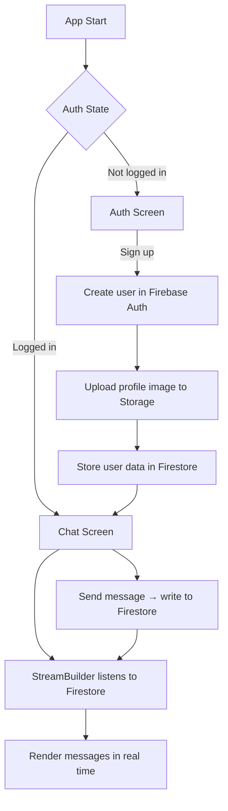

### Common Mistakes

| Mistake | Correct Approach |
|---|---|
| Not calling `Firebase.initializeApp()` | Always call it with `await` before `runApp()` |
| Reading auth state only once | Use `authStateChanges()` stream for reactive auth |
| Storing sensitive data in Firestore without rules | Set Firestore Security Rules to restrict access |
| Requesting notification permissions without checking | Check current permission status first |

### Practice Tasks

- [ ] Set up Firebase Auth with email/password sign-up and login
- [ ] Upload a profile image to Firebase Storage and save the URL to Firestore
- [ ] Send chat messages to a Firestore collection
- [ ] Use `StreamBuilder` to display messages in real time
- [ ] Subscribe to a FCM topic and receive a test notification

### Review Questions

1. What does `authStateChanges()` return and why is it useful?
2. What is the difference between Firestore `.get()` and `.snapshots()`?
3. What is an FCM device token and when is it used?
4. Why must background message handlers be top-level functions?

### Section Summary

The Chat App is the most complete project: Firebase Authentication manages user accounts, Firestore stores and streams messages in real time, Firebase Storage holds profile images, and FCM delivers push notifications. The `authStateChanges()` stream drives automatic screen routing based on login status. `StreamBuilder` makes real-time data simple — the UI auto-updates whenever Firestore data changes.

---

## Section 15 — Course Roundup & Bonus

### Overview

The final section wraps up the course, covers how to publish apps to the App Store and Google Play, and points to further learning resources.

### Lessons Covered

| # | Lesson Title |
|---|---|
| 001 | Course Update Information |
| 002 | Old Course Content Archive |
| 003 | Publishing iOS Apps |
| 004 | Publishing Android Apps |
| 005 | Course Summary & Next Steps |

### Publishing Checklist

**Android (Google Play)**
- [ ] Build signed APK or App Bundle: `flutter build appbundle`
- [ ] Create a keystore: `keytool -genkey -v -keystore ~/key.jks`
- [ ] Configure `key.properties` and `build.gradle`
- [ ] Create a Google Play Developer account
- [ ] Upload the `.aab` to Google Play Console
- [ ] Fill in store listing, screenshots, privacy policy

**iOS (App Store)**
- [ ] Build on macOS: `flutter build ios --release`
- [ ] Sign the app in Xcode with an Apple Developer account
- [ ] Archive and upload via Xcode or Transporter
- [ ] Create app in App Store Connect
- [ ] Submit for TestFlight or App Store review

### Recommended Next Steps

- Explore the official [Flutter documentation](https://docs.flutter.dev)
- Study the [Dart language tour](https://dart.dev/guides/language/language-tour)
- Try the `flutter_bloc` state management package as an alternative to Riverpod
- Explore advanced testing: widget tests, integration tests
- Learn about code generation (`freezed`, `json_serializable`)
- Try custom painting (`CustomPainter`)

---

## Appendix A — Dart Language Reference

### Variables

```dart
var name = 'Alice';         // inferred as String
String name = 'Alice';      // explicit type
final name = 'Alice';       // assigned once
const pi = 3.14159;         // compile-time constant
String? nullableName;       // can be null (null safety)
```

### Null Safety Operators

```dart
String? name;

// Null check
if (name != null) print(name.length);

// Null-aware access
print(name?.length);      // prints null if name is null

// Null coalescing
final len = name?.length ?? 0;  // 0 if name is null

// Force non-null (throws if null)
print(name!.length);
```

### Functions

```dart
// Named function
int add(int a, int b) => a + b;

// Anonymous function
final multiply = (int a, int b) => a * b;

// Higher-order function
void execute(Function action) => action();

// Optional positional parameter
void greet([String name = 'World']) => print('Hello $name');

// Named parameters
void greet({required String name, int times = 1}) { ... }
```

### Classes

```dart
class Animal {
  // Constructor with shorthand initialization
  Animal(this.name, this.age);

  final String name;
  int age;

  // Named constructor
  Animal.cat() : name = 'Cat', age = 0;

  // Getter
  String get info => '$name ($age years)';

  // Method
  void speak() => print('...');
}

// Inheritance
class Dog extends Animal {
  Dog(super.name, super.age);

  @override
  void speak() => print('Woof!');
}
```

### Collections

```dart
// List
final nums = [1, 2, 3];
nums.add(4);
nums.map((n) => n * 2).toList();
nums.where((n) => n > 2).toList();

// Map
final person = {'name': 'Alice', 'age': 30};
person['name'];          // 'Alice'
person.entries;          // Iterable of MapEntry

// Set
final unique = {1, 2, 3, 3}; // {1, 2, 3}
```

### Async

```dart
// Future
Future<String> fetchData() async {
  final result = await someAsyncOperation();
  return result;
}

// Try/catch with async
Future<void> load() async {
  try {
    final data = await fetchData();
    print(data);
  } catch (error) {
    print('Error: $error');
  }
}

// Stream
Stream<int> countStream() async* {
  for (int i = 1; i <= 5; i++) {
    await Future.delayed(const Duration(seconds: 1));
    yield i;
  }
}
```

---

## Appendix B — Flutter Widget Cheat Sheet

### Layout

| Widget | Purpose |
|---|---|
| `Column` | Vertical list of widgets |
| `Row` | Horizontal list of widgets |
| `Stack` | Overlay widgets on top of each other |
| `Container` | Box with styling (padding, color, decoration) |
| `Padding` | Add spacing around a widget |
| `SizedBox` | Fixed-size box or spacer |
| `Center` | Center its child |
| `Expanded` | Take remaining space in Row/Column |
| `Flexible` | Like Expanded but shares space proportionally |
| `Wrap` | Like Row but wraps to next line |
| `ListView` | Scrollable column |
| `GridView` | Scrollable grid |
| `SingleChildScrollView` | Make any widget scrollable |
| `SafeArea` | Avoid notch/status bar |

### Input

| Widget | Purpose |
|---|---|
| `TextField` | Free-form text input |
| `TextFormField` | Text input with validation (use inside `Form`) |
| `Form` | Groups form fields for validation |
| `Checkbox` | Boolean toggle |
| `Radio` | One-of-many selection |
| `Switch` | Toggle |
| `Slider` | Range picker |
| `DropdownButton` | Select from a list |
| `DropdownButtonFormField` | Dropdown inside a `Form` |

### Display

| Widget | Purpose |
|---|---|
| `Text` | Display a string |
| `Image.asset` | Image from app assets |
| `Image.network` | Image from URL |
| `Image.file` | Image from local file |
| `Icon` | Material icon |
| `Card` | Elevated container with rounded corners |
| `CircularProgressIndicator` | Loading spinner |
| `LinearProgressIndicator` | Progress bar |
| `Divider` | Horizontal line |

### Interaction

| Widget | Purpose |
|---|---|
| `ElevatedButton` | Raised button |
| `TextButton` | Flat text button |
| `IconButton` | Icon-only button |
| `FloatingActionButton` | Round floating action button |
| `GestureDetector` | Detect any gesture |
| `InkWell` | Tap with Material ripple |
| `Dismissible` | Swipe to dismiss |

### Navigation

| Widget / Method | Purpose |
|---|---|
| `Navigator.push()` | Navigate forward |
| `Navigator.pop()` | Navigate back |
| `Navigator.pushReplacement()` | Navigate and remove current screen |
| `BottomNavigationBar` | Tab bar at bottom |
| `TabBar` + `TabBarView` | Tab navigation inside screen |
| `Drawer` | Side menu |

### Async

| Widget | Purpose |
|---|---|
| `FutureBuilder` | Build UI from a `Future` |
| `StreamBuilder` | Build UI from a `Stream` |

---

## Appendix C — Essential CLI Commands

```bash
# Project setup
flutter create my_app                # Create new project
flutter create --org com.example my_app  # With org name

# Running
flutter run                          # Run on default device
flutter run -d chrome                # Run on Chrome (web)
flutter run -d emulator-5554        # Run on specific emulator
flutter run --release               # Run in release mode

# Dependencies
flutter pub get                      # Install packages from pubspec.yaml
flutter pub add package_name         # Add a package
flutter pub upgrade                  # Update packages

# Code quality
flutter analyze                      # Static analysis
dart format lib/                     # Format all files

# Building
flutter build apk                    # Android APK (debug)
flutter build apk --release         # Android APK (release)
flutter build appbundle              # Android App Bundle (for Play Store)
flutter build ios                    # iOS (requires macOS + Xcode)
flutter build web                    # Web

# Diagnostics
flutter doctor                       # Check environment setup
flutter doctor -v                    # Verbose output
flutter clean                        # Clear build cache
flutter devices                      # List connected devices
flutter emulators                    # List available emulators
flutter emulators --launch <name>   # Launch an emulator

# DevTools
flutter pub global activate devtools
flutter pub global run devtools
```

---

## Appendix D — Common Packages Reference

| Package | Purpose | Install |
|---|---|---|
| `http` | HTTP requests | `flutter pub add http` |
| `flutter_riverpod` | State management | `flutter pub add flutter_riverpod` |
| `google_fonts` | Google Fonts | `flutter pub add google_fonts` |
| `uuid` | Unique ID generation | `flutter pub add uuid` |
| `intl` | Date formatting, i18n | `flutter pub add intl` |
| `image_picker` | Camera & gallery | `flutter pub add image_picker` |
| `location` | GPS | `flutter pub add location` |
| `google_maps_flutter` | Maps | `flutter pub add google_maps_flutter` |
| `geocoding` | Address lookup | `flutter pub add geocoding` |
| `sqflite` | Local SQLite DB | `flutter pub add sqflite` |
| `path_provider` | Device file paths | `flutter pub add path_provider` |
| `path` | Path manipulation | `flutter pub add path` |
| `firebase_core` | Firebase base | `flutter pub add firebase_core` |
| `firebase_auth` | Firebase Auth | `flutter pub add firebase_auth` |
| `cloud_firestore` | Firestore DB | `flutter pub add cloud_firestore` |
| `firebase_storage` | File storage | `flutter pub add firebase_storage` |
| `firebase_messaging` | Push notifications | `flutter pub add firebase_messaging` |
| `shared_preferences` | Simple key-value storage | `flutter pub add shared_preferences` |
| `provider` | Simple state management | `flutter pub add provider` |
| `go_router` | Advanced routing | `flutter pub add go_router` |

---

## Quick Reference: Projects Built

| Project | Section | Key Skills |
|---|---|---|
| **Roll Dice App** | 02 | Widgets, `StatefulWidget`, `setState`, images, buttons |
| **Quiz App** | 03 | Conditional rendering, callbacks, data models, maps, lists |
| **Expense Tracker** | 05 | Forms, modals, date pickers, theming, `Dismissible`, `SnackBar` |
| **Meals App** | 08 | Multi-screen navigation, tabs, drawer, `GridView`, `PopScope` |
| **Meals App + Riverpod** | 09 | State management with providers |
| **Shopping List** | 11 | `Form` widget, validation, `TextFormField` |
| **Shopping List + HTTP** | 12 | REST API, Firebase, async state |
| **Favorite Places** | 13 | Camera, GPS, Google Maps, SQLite |
| **Chat App** | 14 | Firebase Auth, Firestore streams, Storage, FCM |

---

*End of Flutter & Dart — The Complete Guide: Study Handbook*  
*Generated from course materials. For the most up-to-date APIs, refer to the official Flutter documentation at docs.flutter.dev and the Dart documentation at dart.dev.*
