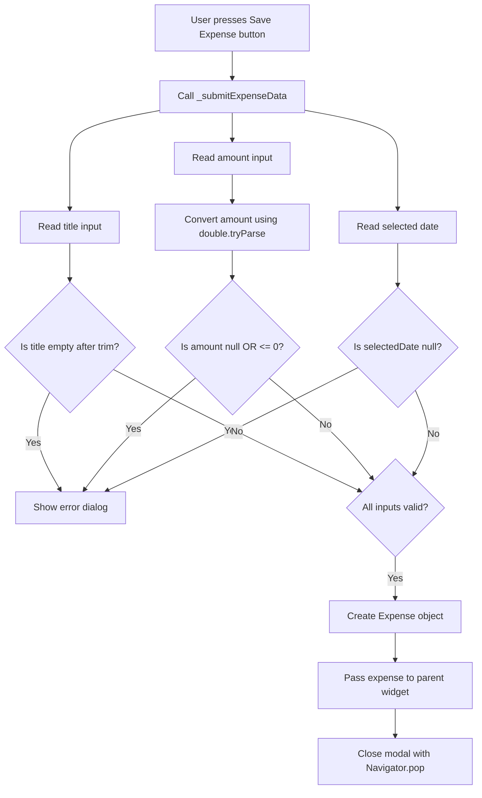

# Combining Conditions with AND and OR Operators

## Overview

This lesson explains how to combine multiple boolean conditions in Dart using the logical **AND** operator `&&` and the logical **OR** operator `||`.

In the example, these operators are used to validate user input before submitting a new expense. The form should only be submitted when all required fields are valid:

* The title must not be empty.
* The amount must be a valid number.
* The amount must be greater than zero.
* A date must be selected.
* The category does not need validation because it already has a default value.

---

## Why Validation Is Needed

When users submit a form, they might enter invalid data such as:

* An empty title
* A title that only contains spaces
* A non-numeric amount, such as `"Hello"`
* A negative amount
* An amount equal to zero
* No selected date

Before creating a new expense, the app must check whether the entered data is valid.

---

## Creating a Submit Method

Instead of placing all validation logic directly inside the button, we create a separate method inside the `NewExpense` state class.

This method can be named:

```dart
void _submitExpenseData() {}
```

The submit button can then trigger this method:

```dart
ElevatedButton(
  onPressed: _submitExpenseData,
  child: const Text('Save Expense'),
)
```

This keeps the code cleaner and easier to maintain.

---

## Validating the Title

The title input is stored in a text controller:

```dart
_titleController.text
```

Because the user might enter only spaces, we use `trim()` before checking whether the input is empty.

```dart
_titleController.text.trim().isEmpty
```

### Explanation

```dart
_titleController.text
```

Gets the text entered by the user.

```dart
trim()
```

Removes extra whitespace at the beginning and end of the string.

```dart
isEmpty
```

Checks whether the resulting string is empty.

So this condition returns `true` when the title is empty or only contains spaces.

---

## Validating the Amount

The amount input is also text, so it must be converted from a `String` to a number.

```dart
final enteredAmount = double.tryParse(_amountController.text);
```

### How `double.tryParse()` Works

`double.tryParse()` tries to convert a string into a `double`.

Example:

```dart
double.tryParse('12.99'); // returns 12.99
double.tryParse('Hello'); // returns null
```

If the input cannot be converted into a number, it returns `null`.

---

## Creating a Boolean for Invalid Amount

To make the validation logic easier to read, we create a boolean variable:

```dart
final amountIsInvalid = enteredAmount == null || enteredAmount <= 0;
```

This means the amount is invalid if:

1. `enteredAmount == null`

The user entered text that cannot be converted into a number.

2. `enteredAmount <= 0`

The user entered zero or a negative number.

Because we use the OR operator `||`, the entire expression becomes `true` if at least one condition is true.

---

## Logical OR Operator `||`

The OR operator returns `true` if at least one condition is true.

| Condition A | Condition B | `A || B` |
|---|---:|---:|
| `false` | `false` | `false` |
| `true` | `false` | `true` |
| `false` | `true` | `true` |
| `true` | `true` | `true` |

Example:

```dart
enteredAmount == null || enteredAmount <= 0
```

This means:

> The amount is invalid if it is not a number OR if it is less than or equal to zero.

---

## Logical AND Operator `&&`

The AND operator returns `true` only if both conditions are true.

| Condition A | Condition B | `A && B` |
| ----------- | ----------: | -------: |
| `false`     |     `false` |  `false` |
| `true`      |     `false` |  `false` |
| `false`     |      `true` |  `false` |
| `true`      |      `true` |   `true` |

Example:

```dart
enteredAmount != null && enteredAmount > 0
```

This means:

> The amount is valid only if it is not null AND it is greater than zero.

---

## Combining Multiple Validation Conditions

The form should show an error message if any required input is invalid.

```dart
if (_titleController.text.trim().isEmpty ||
    amountIsInvalid ||
    _selectedDate == null) {
  // Show error message
  return;
}
```

This condition uses the OR operator `||`.

The error message should appear if:

* The title is empty
* OR the amount is invalid
* OR no date has been selected

Only one invalid field is enough to stop the submission.

---

## Full Code Example

```dart
void _submitExpenseData() {
  final enteredAmount = double.tryParse(_amountController.text);

  final amountIsInvalid = enteredAmount == null || enteredAmount <= 0;

  if (_titleController.text.trim().isEmpty ||
      amountIsInvalid ||
      _selectedDate == null) {
    // Show error message
    showDialog(
      context: context,
      builder: (ctx) => AlertDialog(
        title: const Text('Invalid input'),
        content: const Text(
          'Please make sure a valid title, amount, date, and category was entered.',
        ),
        actions: [
          TextButton(
            onPressed: () {
              Navigator.pop(ctx);
            },
            child: const Text('Okay'),
          ),
        ],
      ),
    );

    return;
  }

  widget.onAddExpense(
    Expense(
      title: _titleController.text.trim(),
      amount: enteredAmount,
      date: _selectedDate!,
      category: _selectedCategory,
    ),
  );

  Navigator.pop(context);
}
```

---

## Validation Flow Diagram



---

## Validation Logic Diagram

```mermaid
flowchart LR
    A[Form Input] --> B[Title]
    A --> C[Amount]
    A --> D[Date]
    A --> E[Category]

    B --> B1[Check trim().isEmpty]
    C --> C1[Parse with double.tryParse]
    C1 --> C2[Check null or <= 0]
    D --> D1[Check selectedDate == null]
    E --> E1[No check needed because default value exists]

    B1 --> F{Any invalid field?}
    C2 --> F
    D1 --> F

    F -->|Yes| G[Show error dialog]
    F -->|No| H[Submit expense data]
```

---

## Why `return` Is Important

Inside the `if` statement, after showing the error dialog, we use:

```dart
return;
```

This stops the function from continuing.

Without `return`, the app might still try to create and submit an expense even though the input is invalid.

---

## Null Safety and `_selectedDate!`

After validation, Dart still sees `_selectedDate` as nullable.

However, because we already checked this condition:

```dart
_selectedDate == null
```

we know that the date is not null after the `if` block.

Therefore, we can use the null assertion operator:

```dart
date: _selectedDate!,
```

The `!` tells Dart:

> I am sure this value is not null here.

---

## Summary

In this lesson, we learned how to use logical operators to validate form input.

The OR operator `||` is useful when we want to detect whether at least one field is invalid.

The AND operator `&&` is useful when multiple conditions must all be true.

In the expense form, validation ensures that the user cannot submit incomplete or invalid data. The form only creates a new expense when the title, amount, and date are all valid.
