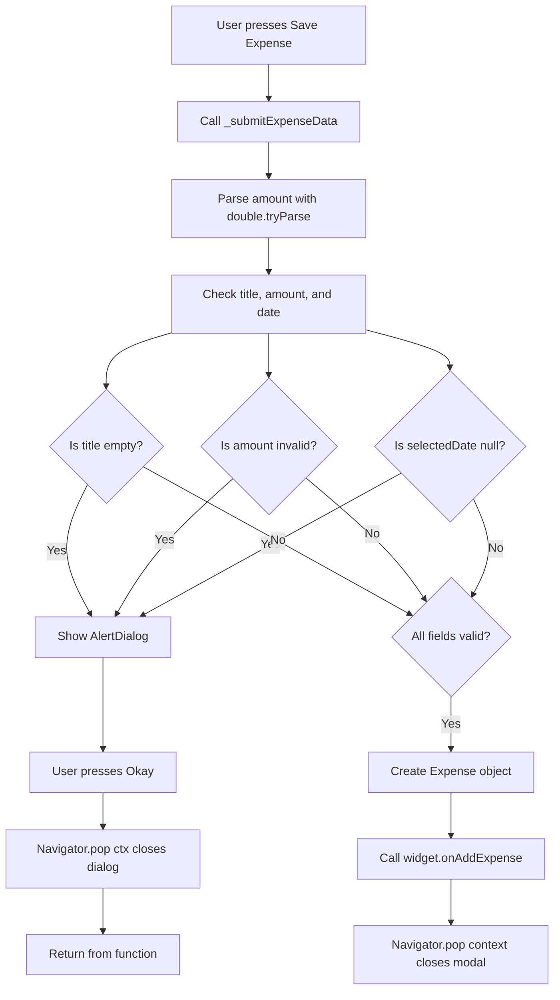
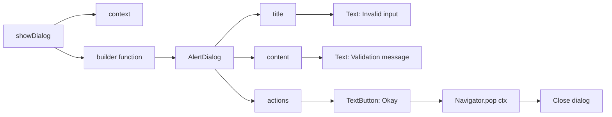

# Validating User Input and Showing an Error Dialog

## Overview

This lesson explains how to validate user input before submitting a new expense and how to show an error dialog when the input is invalid.

In this expense form, the user must enter a valid title, a valid amount, and select a date. If any of these values are missing or invalid, the app should not create a new `Expense` object. Instead, it should display an `AlertDialog` that tells the user what went wrong.

---

## Why Input Validation Matters

User input cannot always be trusted.

A user might submit the form with:

* An empty title
* A title that only contains spaces
* An empty amount
* A text value instead of a number
* A negative amount
* An amount equal to zero
* No selected date

If the app accepts this data, it may create invalid expense entries. Therefore, we validate the data before using it.

---

## Creating a Submit Method

Instead of writing validation logic directly inside the button, we create a separate method inside the `NewExpense` state class.

```dart
void _submitExpenseData() {
  // Validation and submission logic goes here
}
```

Then, the submit button can call this method:

```dart
ElevatedButton(
  onPressed: _submitExpenseData,
  child: const Text('Save Expense'),
)
```

This keeps the button code clean and makes the validation logic easier to read.

---

## Step 1: Parsing the Entered Amount

Text field values are always stored as strings.

The amount field may look like a number to the user, but internally it is still a `String`.

```dart
_amountController.text
```

To convert it into a number, we use `double.tryParse()`:

```dart
final enteredAmount = double.tryParse(_amountController.text);
```

`double.tryParse()` tries to convert the string into a `double`.

```dart
double.tryParse('12.99'); // returns 12.99
double.tryParse('Hello'); // returns null
double.tryParse('');      // returns null
```

If the conversion fails, it returns `null`.

---

## Step 2: Checking Whether the Amount Is Invalid

The amount is invalid if:

* It cannot be converted into a number
* It is less than or equal to zero

```dart
final amountIsInvalid = enteredAmount == null || enteredAmount <= 0;
```

This condition uses the logical OR operator `||`.

It means:

> The amount is invalid if `enteredAmount` is `null` OR if `enteredAmount` is less than or equal to zero.

---

## Step 3: Validating All Required Inputs

Now we combine all validation checks inside one `if` statement.

```dart
if (_titleController.text.trim().isEmpty ||
    amountIsInvalid ||
    _selectedDate == null) {
  // Show error dialog
  return;
}
```

The form is invalid if:

* The title is empty after trimming whitespace
* OR the amount is invalid
* OR no date has been selected

Because we use `||`, only one invalid condition is enough to stop the submission.

---

## Step 4: Showing an Error Dialog

Flutter provides the built-in `showDialog()` function for displaying popup dialogs.

```dart
showDialog(
  context: context,
  builder: (ctx) => AlertDialog(
    title: const Text('Invalid input'),
    content: const Text(
      'Please make sure a valid title, amount, date and category was entered.',
    ),
    actions: [
      TextButton(
        onPressed: () => Navigator.pop(ctx),
        child: const Text('Okay'),
      ),
    ],
  ),
);
```

---

## Understanding `showDialog`

The `showDialog()` function requires two important arguments:

| Argument  | Purpose                                                           |
| --------- | ----------------------------------------------------------------- |
| `context` | Tells Flutter where in the widget tree the dialog should be shown |
| `builder` | Returns the widget that should be displayed inside the dialog     |

The `builder` function receives a new context value:

```dart
builder: (ctx) => AlertDialog(...)
```

This `ctx` belongs to the dialog itself.

---

## Understanding `AlertDialog`

`AlertDialog` is a built-in Flutter widget designed for showing alert messages.

It commonly contains:

| Parameter | Purpose                            |
| --------- | ---------------------------------- |
| `title`   | The heading of the dialog          |
| `content` | The main message shown to the user |
| `actions` | Buttons the user can press         |

Example:

```dart
AlertDialog(
  title: const Text('Invalid input'),
  content: const Text(
    'Please make sure a valid title, amount, date and category was entered.',
  ),
  actions: [
    TextButton(
      onPressed: () => Navigator.pop(ctx),
      child: const Text('Okay'),
    ),
  ],
)
```

---

## Closing the Dialog

The dialog can be closed with:

```dart
Navigator.pop(ctx);
```

Here, `ctx` is the context provided by the dialog builder.

This closes only the dialog, not the entire expense modal.

```dart
TextButton(
  onPressed: () => Navigator.pop(ctx),
  child: const Text('Okay'),
)
```

When the user presses **Okay**, the error dialog disappears.

---

## Why `return` Is Needed

After showing the error dialog, we add:

```dart
return;
```

This stops the function immediately.

Without `return`, the function would continue and might still create a new `Expense` object even though the input is invalid.

```dart
if (_titleController.text.trim().isEmpty ||
    amountIsInvalid ||
    _selectedDate == null) {
  showDialog(...);
  return;
}
```

So the logic is:

> If the input is invalid, show the dialog and stop.
> If the input is valid, continue and create the expense.

---

## Full Code Example

```dart
void _submitExpenseData() {
  final enteredAmount = double.tryParse(_amountController.text);

  final amountIsInvalid = enteredAmount == null || enteredAmount <= 0;

  if (_titleController.text.trim().isEmpty ||
      amountIsInvalid ||
      _selectedDate == null) {
    showDialog(
      context: context,
      builder: (ctx) => AlertDialog(
        title: const Text('Invalid input'),
        content: const Text(
          'Please make sure a valid title, amount, date and category was entered.',
        ),
        actions: [
          TextButton(
            onPressed: () {
              Navigator.pop(ctx);
            },
            child: const Text('Okay'),
          ),
        ],
      ),
    );

    return;
  }

  widget.onAddExpense(
    Expense(
      title: _titleController.text.trim(),
      amount: enteredAmount,
      date: _selectedDate!,
      category: _selectedCategory,
    ),
  );

  Navigator.pop(context);
}
```

---

## Validation and Error Dialog Flow



---

## Dialog Structure Diagram



---

## Validation Logic Diagram

```mermaid
flowchart LR
    A[Expense Form Data] --> B[Title Input]
    A --> C[Amount Input]
    A --> D[Date Input]
    A --> E[Category Input]

    B --> B1[Check trim().isEmpty]
    C --> C1[double.tryParse]
    C1 --> C2[Check null OR <= 0]
    D --> D1[Check selectedDate == null]
    E --> E1[No validation needed because default category exists]

    B1 --> F{Any invalid input?}
    C2 --> F
    D1 --> F

    F -->|Yes| G[Show AlertDialog]
    G --> H[Return early]

    F -->|No| I[Create Expense]
    I --> J[Add expense to list]
    J --> K[Close modal]
```

---

## Important Detail: `context` vs `ctx`

There are two context values in this code.

```dart
showDialog(
  context: context,
  builder: (ctx) => AlertDialog(...),
);
```

The outer `context` belongs to the `NewExpense` widget.

The inner `ctx` belongs to the dialog created by `showDialog`.

When closing the dialog, we use:

```dart
Navigator.pop(ctx);
```

This ensures that only the dialog is closed.

Later, when the expense is successfully submitted, we use:

```dart
Navigator.pop(context);
```

This closes the modal bottom sheet.

---

## Key Takeaways

* Use `double.tryParse()` to safely convert string input into a number.
* Use `trim().isEmpty` to reject empty titles and titles with only spaces.
* Use `||` to combine invalid input checks.
* Use `showDialog()` to display an error message.
* Use `AlertDialog` for a standard Flutter alert popup.
* Use `Navigator.pop(ctx)` to close the dialog.
* Use `return` after showing the dialog to stop invalid data from being submitted.

---

## Summary

This lesson adds proper validation to the expense form.

When the user submits invalid data, the app displays an `AlertDialog` explaining that the input is invalid. The function then returns early, preventing the app from creating a bad `Expense` object.

If all input values are valid, the app continues, creates a new `Expense`, passes it to the parent widget, and closes the modal.
