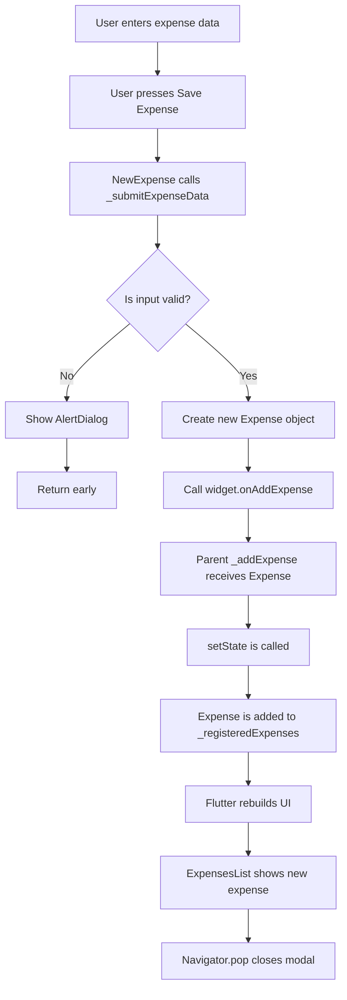
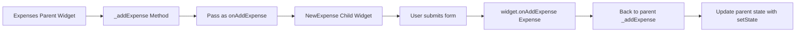
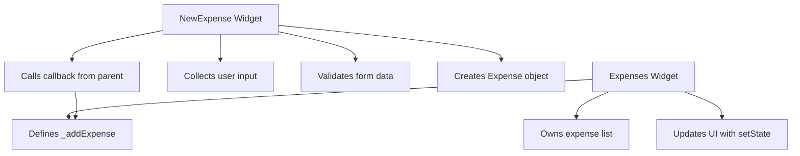

# Saving New Expenses

## Overview

This lesson explains how to save a newly created expense and add it to the list of expenses displayed on the screen.

The expense list is managed in the parent widget, `Expenses`. The input form is handled in the child widget, `NewExpense`. Since the child widget should not directly modify the parent's state, we pass a callback function from the parent to the child.

When the user submits valid expense data, the `NewExpense` widget calls this callback and sends the newly created `Expense` object back to the parent.

---

## Why a Callback Is Needed

The list of expenses lives inside the `Expenses` widget.

```dart
final List<Expense> _registeredExpenses = [
  // existing expenses
];
```

The `NewExpense` widget only collects input from the user. It does not own the expense list.

Therefore, the child widget needs a way to tell the parent:

> A new expense was created. Please add it to your list.

This is done by passing a function from the parent to the child.

---

## Step 1: Add a Method in the Parent Widget

Inside the `Expenses` state class, create a method named `_addExpense`.

```dart
void _addExpense(Expense expense) {
  setState(() {
    _registeredExpenses.add(expense);
  });
}
```

This method receives an `Expense` object and adds it to `_registeredExpenses`.

Because the list is used to render the UI, the change must happen inside `setState()`.

---

## Why `setState()` Is Required

Calling `.add()` updates the list in memory.

```dart
_registeredExpenses.add(expense);
```

However, Flutter will not automatically rebuild the UI unless it is notified.

That is why we wrap the change inside `setState()`:

```dart
setState(() {
  _registeredExpenses.add(expense);
});
```

This tells Flutter:

> The state has changed. Please rebuild the widget so the updated list appears on the screen.

---

## Step 2: Pass the Callback to `NewExpense`

The `NewExpense` widget is shown inside a modal bottom sheet.

```dart
void _openAddExpenseOverlay() {
  showModalBottomSheet(
    context: context,
    builder: (ctx) => NewExpense(
      onAddExpense: _addExpense,
    ),
  );
}
```

Here, `_addExpense` is passed as a value to the `NewExpense` widget.

Important detail:

```dart
onAddExpense: _addExpense
```

We do not write:

```dart
onAddExpense: _addExpense()
```

Because we do not want to execute the function immediately.

We only want to pass the function reference so that `NewExpense` can execute it later when the form is submitted.

---

## Step 3: Accept the Callback in `NewExpense`

Inside the `NewExpense` widget, add a required constructor parameter.

```dart
class NewExpense extends StatefulWidget {
  const NewExpense({
    super.key,
    required this.onAddExpense,
  });

  final void Function(Expense expense) onAddExpense;

  @override
  State<NewExpense> createState() {
    return _NewExpenseState();
  }
}
```

The callback type is:

```dart
void Function(Expense expense)
```

This means:

* The function returns nothing: `void`
* The function expects one argument: an `Expense`
* That `Expense` will be sent from the child widget to the parent widget

---

## Understanding the Callback Type

```dart
final void Function(Expense expense) onAddExpense;
```

This property stores a function.

That function must match this shape:

```dart
void someFunction(Expense expense) {
  // do something with expense
}
```

In this app, the function is `_addExpense`.

```dart
void _addExpense(Expense expense) {
  setState(() {
    _registeredExpenses.add(expense);
  });
}
```

So `_addExpense` can be passed into `NewExpense`.

---

## Step 4: Call the Callback After Validation

Inside `_submitExpenseData`, after all validation checks pass, create a new `Expense` object and pass it to the callback.

```dart
widget.onAddExpense(
  Expense(
    title: _titleController.text.trim(),
    amount: enteredAmount,
    date: _selectedDate!,
    category: _selectedCategory,
  ),
);
```

The `widget` property is provided by Flutter inside every `State` class.

It gives access to the connected widget class.

So inside `_NewExpenseState`, this:

```dart
widget.onAddExpense
```

refers to the `onAddExpense` property from the `NewExpense` widget.

---

## Why `widget` Is Needed

The callback is defined in the widget class:

```dart
class NewExpense extends StatefulWidget {
  final void Function(Expense expense) onAddExpense;
}
```

But `_submitExpenseData` is inside the state class:

```dart
class _NewExpenseState extends State<NewExpense> {
  void _submitExpenseData() {
    // here
  }
}
```

To access the widget's properties from the state class, use:

```dart
widget.onAddExpense
```

This is a common pattern in `StatefulWidget`.

---

## Step 5: Close the Modal After Saving

After the new expense is sent to the parent, close the modal bottom sheet.

```dart
Navigator.pop(context);
```

So the final part of `_submitExpenseData` looks like this:

```dart
widget.onAddExpense(
  Expense(
    title: _titleController.text.trim(),
    amount: enteredAmount,
    date: _selectedDate!,
    category: _selectedCategory,
  ),
);

Navigator.pop(context);
```

This gives the user a smooth experience:

1. They enter valid data.
2. They press save.
3. The expense is added to the list.
4. The modal closes automatically.

---

## Full Parent Widget Example

```dart
class _ExpensesState extends State<Expenses> {
  final List<Expense> _registeredExpenses = [
    // existing expenses
  ];

  void _addExpense(Expense expense) {
    setState(() {
      _registeredExpenses.add(expense);
    });
  }

  void _openAddExpenseOverlay() {
    showModalBottomSheet(
      context: context,
      builder: (ctx) => NewExpense(
        onAddExpense: _addExpense,
      ),
    );
  }

  @override
  Widget build(BuildContext context) {
    return Scaffold(
      body: ExpensesList(
        expenses: _registeredExpenses,
      ),
      floatingActionButton: FloatingActionButton(
        onPressed: _openAddExpenseOverlay,
        child: const Icon(Icons.add),
      ),
    );
  }
}
```

---

## Full `NewExpense` Widget Example

```dart
class NewExpense extends StatefulWidget {
  const NewExpense({
    super.key,
    required this.onAddExpense,
  });

  final void Function(Expense expense) onAddExpense;

  @override
  State<NewExpense> createState() {
    return _NewExpenseState();
  }
}
```

---

## Full Submit Method Example

```dart
void _submitExpenseData() {
  final enteredAmount = double.tryParse(_amountController.text);

  final amountIsInvalid = enteredAmount == null || enteredAmount <= 0;

  if (_titleController.text.trim().isEmpty ||
      amountIsInvalid ||
      _selectedDate == null) {
    showDialog(
      context: context,
      builder: (ctx) => AlertDialog(
        title: const Text('Invalid input'),
        content: const Text(
          'Please make sure a valid title, amount, date and category was entered.',
        ),
        actions: [
          TextButton(
            onPressed: () {
              Navigator.pop(ctx);
            },
            child: const Text('Okay'),
          ),
        ],
      ),
    );

    return;
  }

  widget.onAddExpense(
    Expense(
      title: _titleController.text.trim(),
      amount: enteredAmount,
      date: _selectedDate!,
      category: _selectedCategory,
    ),
  );

  Navigator.pop(context);
}
```

---

## Data Flow Diagram



---

## Parent-to-Child Callback Diagram



---

## Widget Responsibility Diagram



---

## Important Pattern: Lifting State Up

This lecture demonstrates the pattern known as **lifting state up**.

The child widget does not directly modify the data list. Instead, the parent owns the data, and the child sends information upward through a callback.

This keeps the app easier to manage because there is a single source of truth.

In this case:

| Widget         | Responsibility                                   |
| -------------- | ------------------------------------------------ |
| `Expenses`     | Owns and updates the expense list                |
| `NewExpense`   | Collects and validates user input                |
| `_addExpense`  | Adds a new expense to the parent state           |
| `onAddExpense` | Allows the child to send data back to the parent |

---

## Why the Modal Should Close After Saving

After a valid expense is submitted, the form is no longer needed.

That is why we call:

```dart
Navigator.pop(context);
```

This closes the modal bottom sheet and returns the user to the main expense list.

The user can immediately see the newly added expense.

---

## Key Takeaways

* The parent widget owns the expense list.
* The child widget should not directly modify the parent's list.
* A callback function allows the child to send data back to the parent.
* The callback type is `void Function(Expense expense)`.
* `setState()` is required to update the UI after adding the new expense.
* `widget.onAddExpense(...)` is used inside the state class to call the callback.
* `Navigator.pop(context)` closes the modal after the expense is saved.

---

## Summary

In this lesson, we connected the `NewExpense` form to the main expense list.

The parent widget defines an `_addExpense` method and passes it to the child widget as a callback. When the user submits valid data, the child creates a new `Expense` object and sends it back to the parent by calling `widget.onAddExpense`.

The parent then updates its state with `setState`, which rebuilds the UI and displays the newly added expense in the list.
