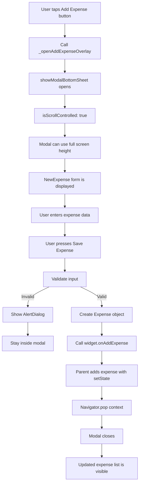
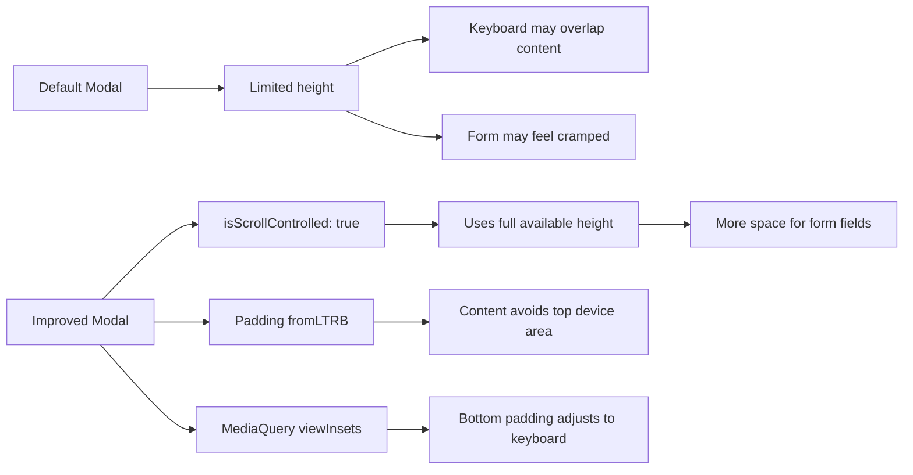
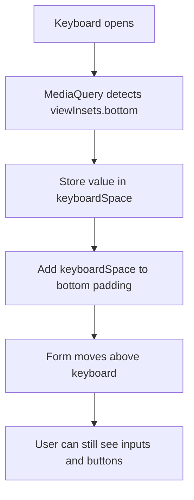

# Creating a Fullscreen Modal

## Overview

This lesson explains how to improve the expense form modal by making it use the full available screen height and closing it automatically after a valid expense is submitted.

By default, `showModalBottomSheet()` often opens as a partial-height sheet. This can feel cramped, especially when the keyboard is visible. To improve the user experience, we can enable fullscreen behavior with `isScrollControlled: true`.

We also adjust the form padding so that the content is not hidden behind device features such as a notch, camera cutout, or status bar.

---

## Why the Modal Needs Improvement

The default modal bottom sheet works, but it has some limitations:

* It may only take up part of the screen.
* The keyboard can cover form fields or buttons.
* On some devices, content can appear too close to the top edge.
* After saving an expense, the modal should close automatically.

To solve these issues, we update both the modal configuration and the form layout.

---

## Step 1: Close the Modal After Saving

After the user enters valid data and the new expense is added, the modal should close automatically.

Inside `_submitExpenseData`, after calling `widget.onAddExpense`, call:

```dart id="vj7x4h"
Navigator.pop(context);
```

Example:

```dart id="a3qj9m"
widget.onAddExpense(
  Expense(
    title: _titleController.text.trim(),
    amount: enteredAmount,
    date: _selectedDate!,
    category: _selectedCategory,
  ),
);

Navigator.pop(context);
```

This closes the modal bottom sheet after the expense has been saved.

---

## Why `Navigator.pop(context)` Works

The modal bottom sheet is placed on top of the current screen.

Calling:

```dart id="84s84t"
Navigator.pop(context);
```

removes the topmost route from the navigation stack.

In this case, the topmost route is the modal bottom sheet, so the modal closes and the user returns to the main expenses screen.

---

## Step 2: Enable Fullscreen Modal Height

Go to the place where the modal bottom sheet is opened.

Usually, this is inside the parent `Expenses` widget:

```dart id="yy8z7l"
void _openAddExpenseOverlay() {
  showModalBottomSheet(
    context: context,
    builder: (ctx) => NewExpense(
      onAddExpense: _addExpense,
    ),
  );
}
```

Add the `isScrollControlled` parameter:

```dart id="hpm5je"
void _openAddExpenseOverlay() {
  showModalBottomSheet(
    context: context,
    isScrollControlled: true,
    builder: (ctx) => NewExpense(
      onAddExpense: _addExpense,
    ),
  );
}
```

---

## What `isScrollControlled: true` Does

By default, a modal bottom sheet may only use a limited height.

```dart id="5ui8uj"
isScrollControlled: true
```

allows the modal to take up the full available height.

This is especially useful for forms because it gives the input fields more space and makes the layout easier to use on smaller screens.

---

## Step 3: Add Safe Top Padding

After enabling fullscreen height, the content may appear too close to the top of the screen.

On some devices, this can cause the form to be obscured by:

* The status bar
* A notch
* A camera cutout
* Other device UI features

To fix this, update the padding in `new_expense.dart`.

Instead of using:

```dart id="9zxznp"
padding: const EdgeInsets.all(16),
```

use:

```dart id="nuz6mt"
padding: const EdgeInsets.fromLTRB(16, 48, 16, 16),
```

---

## Understanding `EdgeInsets.fromLTRB`

`EdgeInsets.fromLTRB` lets you define different spacing values for each side.

```dart id="taop6q"
EdgeInsets.fromLTRB(left, top, right, bottom)
```

Example:

```dart id="tx720i"
padding: const EdgeInsets.fromLTRB(16, 48, 16, 16),
```

This means:

| Side   | Padding |
| ------ | ------: |
| Left   |    `16` |
| Top    |    `48` |
| Right  |    `16` |
| Bottom |    `16` |

The larger top padding helps keep the form content away from the top edge of the screen.

---

## Optional: Use `useSafeArea`

In newer Flutter versions, you can also use:

```dart id="w804fz"
useSafeArea: true
```

inside `showModalBottomSheet`.

Example:

```dart id="zweptj"
void _openAddExpenseOverlay() {
  showModalBottomSheet(
    context: context,
    isScrollControlled: true,
    useSafeArea: true,
    builder: (ctx) => NewExpense(
      onAddExpense: _addExpense,
    ),
  );
}
```

`useSafeArea: true` tells Flutter to avoid unsafe areas automatically.

This can be cleaner than manually adding a large top padding, depending on your Flutter version and layout needs.

---

## Optional: Handle Keyboard Space Dynamically

When the keyboard opens, it may cover the bottom part of the form.

To make the form keyboard-aware, read the keyboard height with:

```dart id="hki3s4"
final keyboardSpace = MediaQuery.of(context).viewInsets.bottom;
```

Then add that value to the bottom padding:

```dart id="139g4o"
padding: EdgeInsets.fromLTRB(16, 48, 16, keyboardSpace + 16),
```

This pushes the form content above the keyboard.

---

## Keyboard-Aware Layout Example

```dart id="r5pn6p"
@override
Widget build(BuildContext context) {
  final keyboardSpace = MediaQuery.of(context).viewInsets.bottom;

  return SingleChildScrollView(
    child: Padding(
      padding: EdgeInsets.fromLTRB(16, 48, 16, keyboardSpace + 16),
      child: Column(
        children: [
          // Form fields and buttons
        ],
      ),
    ),
  );
}
```

---

## Why `SingleChildScrollView` Helps

When the keyboard is open, the available screen height becomes smaller.

If the form has many fields, some content may still not fit.

Wrapping the form with `SingleChildScrollView` allows the user to scroll through the form when space is limited.

```dart id="lpc7qr"
return SingleChildScrollView(
  child: Padding(
    padding: EdgeInsets.fromLTRB(16, 48, 16, keyboardSpace + 16),
    child: Column(
      children: [
        // form content
      ],
    ),
  ),
);
```

This gives the modal a more reliable layout on different screen sizes.

---

## Full Modal Opening Example

```dart id="fzveku"
void _openAddExpenseOverlay() {
  showModalBottomSheet(
    context: context,
    isScrollControlled: true,
    useSafeArea: true,
    builder: (ctx) => NewExpense(
      onAddExpense: _addExpense,
    ),
  );
}
```

---

## Full Submit Method Ending

```dart id="3p733t"
widget.onAddExpense(
  Expense(
    title: _titleController.text.trim(),
    amount: enteredAmount,
    date: _selectedDate!,
    category: _selectedCategory,
  ),
);

Navigator.pop(context);
```

The first part adds the new expense.

The second part closes the modal bottom sheet.

---

## Full Keyboard-Aware Build Example

```dart id="an7x8n"
@override
Widget build(BuildContext context) {
  final keyboardSpace = MediaQuery.of(context).viewInsets.bottom;

  return SingleChildScrollView(
    child: Padding(
      padding: EdgeInsets.fromLTRB(16, 48, 16, keyboardSpace + 16),
      child: Column(
        children: [
          TextField(
            controller: _titleController,
            maxLength: 50,
            decoration: const InputDecoration(
              label: Text('Title'),
            ),
          ),

          TextField(
            controller: _amountController,
            keyboardType: TextInputType.number,
            decoration: const InputDecoration(
              prefixText: '\$ ',
              label: Text('Amount'),
            ),
          ),

          // Date picker, category dropdown, and buttons
        ],
      ),
    ),
  );
}
```

---

## Fullscreen Modal Flow Diagram



---

## Layout Improvement Diagram



---

## Keyboard-Aware Form Diagram



---

## Important Parameters

| Parameter                                  | Where It Is Used       | Purpose                                           |
| ------------------------------------------ | ---------------------- | ------------------------------------------------- |
| `isScrollControlled: true`                 | `showModalBottomSheet` | Allows the modal to use the full available height |
| `useSafeArea: true`                        | `showModalBottomSheet` | Avoids unsafe screen areas                        |
| `Navigator.pop(context)`                   | `_submitExpenseData`   | Closes the modal after saving                     |
| `EdgeInsets.fromLTRB`                      | `Padding`              | Sets custom padding for each side                 |
| `MediaQuery.of(context).viewInsets.bottom` | `build()`              | Gets the keyboard height                          |
| `SingleChildScrollView`                    | Around form content    | Allows scrolling when space is limited            |

---

## Key Takeaways

* Use `Navigator.pop(context)` after saving a valid expense to close the modal.
* Use `isScrollControlled: true` to let the modal bottom sheet use the full screen height.
* Add extra top padding to avoid status bars, notches, and camera cutouts.
* Use `EdgeInsets.fromLTRB` when different sides need different padding values.
* Use `MediaQuery.viewInsets.bottom` to detect keyboard space.
* Wrap the form with `SingleChildScrollView` to keep the form usable on small screens.

---

## Summary

This lesson improves the expense form modal.

After a valid expense is submitted, the modal closes automatically with `Navigator.pop(context)`. The modal is also made fullscreen by setting `isScrollControlled: true`, giving the form more space.

To avoid layout issues, the form uses custom padding, and it can optionally become keyboard-aware with `MediaQuery.viewInsets.bottom` and `SingleChildScrollView`.

These changes make the modal form easier to use, especially on small devices or when the keyboard is open.
