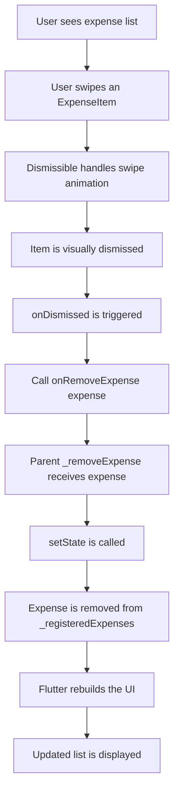
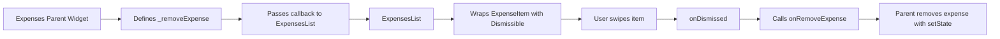
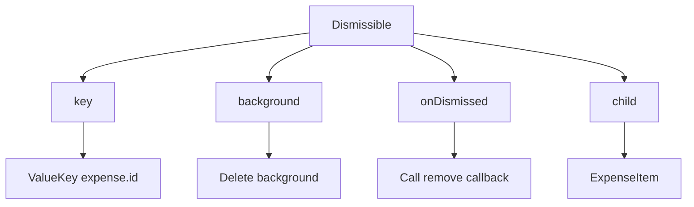
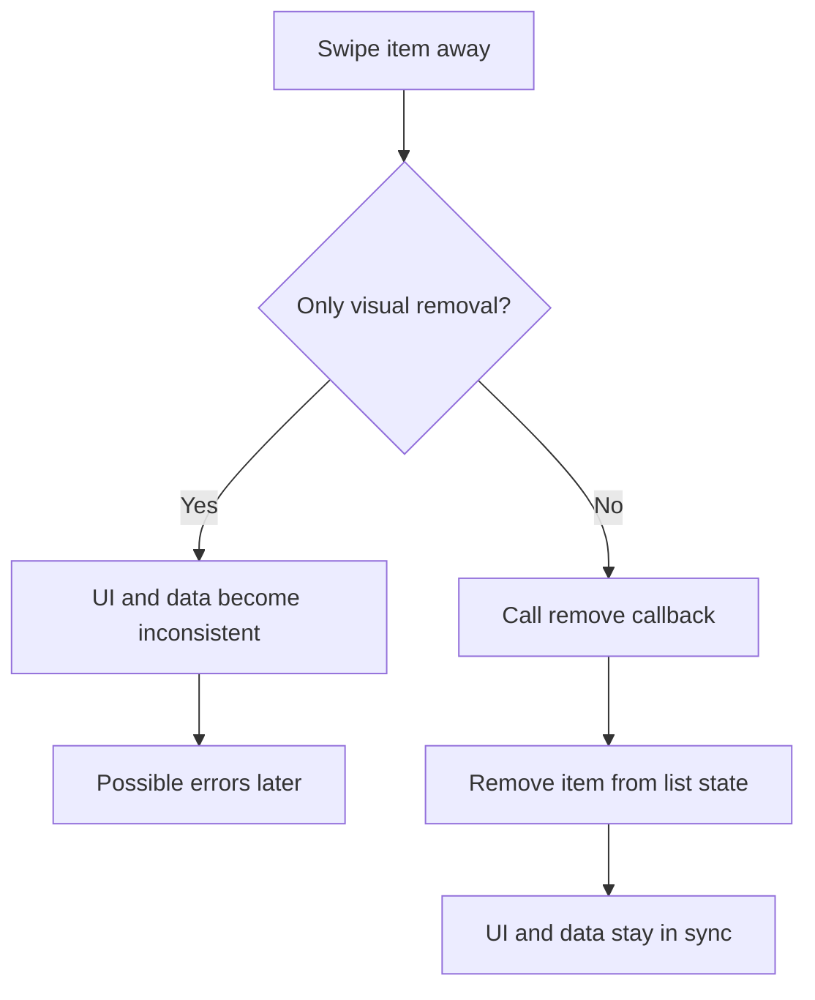

# Using the Dismissible Widget for Dismissing List Items

## Overview

This lesson explains how to make expense list items removable by swiping them away.

Flutter provides a built-in widget called `Dismissible`, which adds swipe-to-dismiss behavior to a widget. In this app, we wrap each `ExpenseItem` with `Dismissible` so the user can swipe an expense from the list and remove it.

However, swiping the widget away only removes it visually. To keep the UI and internal data in sync, we also need to remove the matching `Expense` object from the parent widget's list.

---

## Why We Need `Dismissible`

The app can already add new expenses.

Now we want users to also remove expenses.

A common mobile pattern is:

> Swipe a list item left or right to delete it.

Flutter makes this pattern easy with the `Dismissible` widget.

---

## Basic `Dismissible` Structure

Inside `expenses_list.dart`, wrap each `ExpenseItem` with `Dismissible`.

```dart id="v18n7d"
Dismissible(
  key: ValueKey(expense.id),
  child: ExpenseItem(expense),
)
```

The `child` is the widget that should become swipeable.

In this case, the child is:

```dart id="pbp32a"
ExpenseItem(expense)
```

---

## Why `key` Is Required

`Dismissible` requires a unique key.

```dart id="t87jqp"
key: ValueKey(expense.id),
```

A key helps Flutter identify which item is being dismissed.

This is important because list items can move, rebuild, or be removed. Without a unique key, Flutter may not know which widget belongs to which data item.

---

## Using `ValueKey`

A `ValueKey` creates a key from a unique value.

```dart id="vq5g21"
ValueKey(expense.id)
```

The best value to use is something unique and stable, such as the expense ID.

```dart id="0qj99d"
key: ValueKey(expense.id),
```

This is better than using the list index because indexes can change when items are removed or inserted.

---

## Step 1: Wrap Each Expense Item

In `expenses_list.dart`, update the `ListView.builder`.

```dart id="71u5up"
ListView.builder(
  itemCount: expenses.length,
  itemBuilder: (ctx, index) {
    final expense = expenses[index];

    return Dismissible(
      key: ValueKey(expense.id),
      child: ExpenseItem(expense),
    );
  },
)
```

Now each expense item can be swiped away visually.

However, the actual expense data is not removed yet.

---

## The Problem: Visual Removal Is Not Enough

After adding `Dismissible`, the item disappears from the screen when swiped.

But the item may still exist inside the `_registeredExpenses` list.

This can cause problems because the UI and the internal data are no longer in sync.

To fix this, we must remove the expense from the list when it is dismissed.

---

## Step 2: Add a Remove Method in the Parent Widget

The parent widget owns the expense list.

So the remove logic belongs in `expenses.dart`, inside the `Expenses` state class.

```dart id="e9wp8v"
void _removeExpense(Expense expense) {
  setState(() {
    _registeredExpenses.remove(expense);
  });
}
```

This method removes the selected expense from the list and tells Flutter to rebuild the UI.

---

## Why `setState()` Is Needed

The list update must happen inside `setState()`.

```dart id="7l6my6"
setState(() {
  _registeredExpenses.remove(expense);
});
```

This tells Flutter:

> The data changed. Please rebuild the UI.

Without `setState()`, the list might change internally, but the screen may not update correctly.

---

## Step 3: Pass the Remove Callback to `ExpensesList`

The `ExpensesList` widget displays the list items, but the parent owns the data.

So the parent passes `_removeExpense` down as a callback.

```dart id="d6x5r0"
ExpensesList(
  expenses: _registeredExpenses,
  onRemoveExpense: _removeExpense,
)
```

This allows the child widget to notify the parent when an expense should be removed.

---

## Step 4: Accept the Callback in `ExpensesList`

In `expenses_list.dart`, add a new property.

```dart id="twz7x9"
class ExpensesList extends StatelessWidget {
  const ExpensesList({
    super.key,
    required this.expenses,
    required this.onRemoveExpense,
  });

  final List<Expense> expenses;
  final void Function(Expense expense) onRemoveExpense;

  @override
  Widget build(BuildContext context) {
    // ...
  }
}
```

The callback type is:

```dart id="nork4z"
void Function(Expense expense)
```

This means the function:

* Returns nothing
* Receives one `Expense` object
* Removes that expense from the parent list

---

## Step 5: Use `onDismissed`

`Dismissible` provides an `onDismissed` parameter.

This callback runs after the user swipes the item away.

```dart id="aht5c4"
onDismissed: (direction) {
  onRemoveExpense(expense);
},
```

The `direction` tells us which direction the user swiped.

For this app, we do not need to use the direction. We only need to remove the expense.

---

## Full `ExpensesList` Example

```dart id="3a5d1z"
class ExpensesList extends StatelessWidget {
  const ExpensesList({
    super.key,
    required this.expenses,
    required this.onRemoveExpense,
  });

  final List<Expense> expenses;
  final void Function(Expense expense) onRemoveExpense;

  @override
  Widget build(BuildContext context) {
    return ListView.builder(
      itemCount: expenses.length,
      itemBuilder: (ctx, index) {
        final expense = expenses[index];

        return Dismissible(
          key: ValueKey(expense.id),
          onDismissed: (direction) {
            onRemoveExpense(expense);
          },
          child: ExpenseItem(expense),
        );
      },
    );
  }
}
```

---

## Step 6: Add a Background

The `background` parameter defines what appears behind the item while it is being swiped.

A common choice is a red background with a delete icon.

```dart id="sw9oel"
background: Container(
  color: Theme.of(context).colorScheme.error,
  child: const Icon(
    Icons.delete,
    color: Colors.white,
    size: 40,
  ),
),
```

This gives the user a visual hint that the item is being deleted.

---

## Improved `Dismissible` Example

```dart id="8vmvct"
Dismissible(
  key: ValueKey(expense.id),
  background: Container(
    color: Theme.of(context).colorScheme.error,
    child: const Icon(
      Icons.delete,
      color: Colors.white,
      size: 40,
    ),
  ),
  onDismissed: (direction) {
    onRemoveExpense(expense);
  },
  child: ExpenseItem(expense),
)
```

---

## Matching the Card Margin

If the `ExpenseItem` uses a `Card`, the background may extend wider than the card.

To align the background with the card, add a margin.

```dart id="7f509h"
background: Container(
  color: Theme.of(context).colorScheme.error,
  margin: EdgeInsets.symmetric(
    horizontal: Theme.of(context).cardTheme.margin!.horizontal,
  ),
  child: const Icon(
    Icons.delete,
    color: Colors.white,
    size: 40,
  ),
),
```

This makes the delete background visually match the list item spacing.

---

## Full Parent Widget Example

```dart id="ganinj"
class _ExpensesState extends State<Expenses> {
  final List<Expense> _registeredExpenses = [
    // existing expenses
  ];

  void _addExpense(Expense expense) {
    setState(() {
      _registeredExpenses.add(expense);
    });
  }

  void _removeExpense(Expense expense) {
    setState(() {
      _registeredExpenses.remove(expense);
    });
  }

  @override
  Widget build(BuildContext context) {
    return Scaffold(
      body: ExpensesList(
        expenses: _registeredExpenses,
        onRemoveExpense: _removeExpense,
      ),
    );
  }
}
```

---

## Full Dismissible List Example

```dart id="x343w1"
class ExpensesList extends StatelessWidget {
  const ExpensesList({
    super.key,
    required this.expenses,
    required this.onRemoveExpense,
  });

  final List<Expense> expenses;
  final void Function(Expense expense) onRemoveExpense;

  @override
  Widget build(BuildContext context) {
    return ListView.builder(
      itemCount: expenses.length,
      itemBuilder: (ctx, index) {
        final expense = expenses[index];

        return Dismissible(
          key: ValueKey(expense.id),
          background: Container(
            color: Theme.of(context).colorScheme.error,
            margin: EdgeInsets.symmetric(
              horizontal: Theme.of(context).cardTheme.margin!.horizontal,
            ),
            child: const Icon(
              Icons.delete,
              color: Colors.white,
              size: 40,
            ),
          ),
          onDismissed: (direction) {
            onRemoveExpense(expense);
          },
          child: ExpenseItem(expense),
        );
      },
    );
  }
}
```

---

## Swipe-to-Delete Flow Diagram



---

## Widget Communication Diagram



---

## Dismissible Structure Diagram



---

## Data Sync Diagram



---

## Important Parameters

| Parameter              | Purpose                                         |
| ---------------------- | ----------------------------------------------- |
| `key`                  | Gives each dismissible item a unique identity   |
| `ValueKey(expense.id)` | Creates a stable key from the expense ID        |
| `child`                | The widget that can be swiped away              |
| `onDismissed`          | Runs after the item has been dismissed          |
| `background`           | Shows a widget behind the item during the swipe |
| `direction`            | Provides information about the swipe direction  |

---

## Key Takeaways

* Use `Dismissible` to make list items swipeable.
* Every `Dismissible` needs a unique `key`.
* `ValueKey(expense.id)` is a good key because the expense ID is unique and stable.
* Swiping only removes the item visually unless you also update the data list.
* Use `onDismissed` to trigger removal logic.
* The parent widget should remove the expense because it owns the expense list.
* Use `setState()` when removing the expense so the UI updates correctly.
* A callback lets `ExpensesList` notify the parent that an item should be removed.

---

## Summary

This lesson adds swipe-to-delete behavior to the expense list.

Each `ExpenseItem` is wrapped with a `Dismissible` widget. The `Dismissible` needs a unique key so Flutter can correctly identify which item is being removed.

When the user swipes an item away, `onDismissed` calls the `onRemoveExpense` callback. This callback triggers the parent widget's `_removeExpense` method, which removes the expense from `_registeredExpenses` inside `setState`.

As a result, the item is removed both visually and internally, keeping the UI and app state synchronized.
