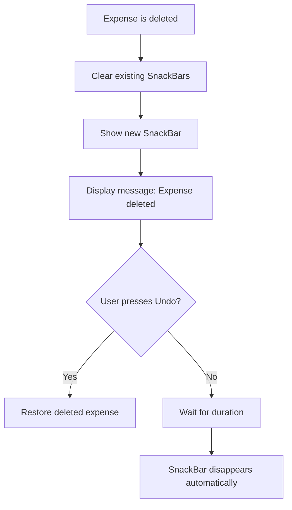
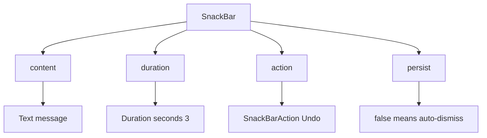
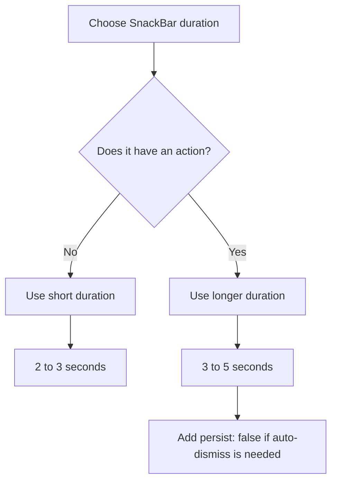

# SnackBar Durations

## Overview

This lesson explains how to control how long a `SnackBar` remains visible in Flutter.

A `SnackBar` is a short message shown at the bottom of the screen. It is commonly used to notify the user that something happened, such as an expense being deleted.

In this app, a `SnackBar` will be used after an expense is removed from the list. The message can also include an **Undo** action, allowing the user to restore the deleted expense.

---

## What Is a SnackBar?

A `SnackBar` is a temporary message displayed near the bottom of the screen.

It is useful for short feedback messages such as:

* `Expense deleted.`
* `Item removed.`
* `Saved successfully.`
* `Network error. Please try again.`

A `SnackBar` should be short, clear, and easy to understand.

---

## Basic SnackBar Example

```dart id="ow1ih7"
ScaffoldMessenger.of(context).showSnackBar(
  const SnackBar(
    content: Text('Expense deleted.'),
  ),
);
```

This shows a simple message at the bottom of the screen.

---

## Showing a SnackBar with Duration

The `duration` property controls how long the `SnackBar` stays visible.

```dart id="izv0xh"
ScaffoldMessenger.of(context).showSnackBar(
  const SnackBar(
    duration: Duration(seconds: 3),
    content: Text('Expense deleted.'),
  ),
);
```

In this example, the `SnackBar` stays visible for 3 seconds.

---

## Understanding `Duration`

The `duration` property expects a `Duration` object.

```dart id="ka6e2e"
Duration(seconds: 3)
```

`Duration` can be created with different named parameters.

```dart id="lsy258"
const Duration(seconds: 3);
const Duration(milliseconds: 1500);
const Duration(minutes: 1);
```

For `SnackBar`, seconds are usually the most practical unit.

---

## Default SnackBar Duration

If no custom duration is provided, Flutter uses a default duration.

```dart id="r71ru7"
SnackBar(
  content: Text('Expense deleted.'),
)
```

This is fine for many cases.

However, if the message includes an action button such as **Undo**, you may want to control the timing more carefully.

---

## SnackBar with an Undo Action

A `SnackBar` can include one action button.

```dart id="d77ww7"
ScaffoldMessenger.of(context).showSnackBar(
  SnackBar(
    duration: const Duration(seconds: 3),
    content: const Text('Expense deleted.'),
    action: SnackBarAction(
      label: 'Undo',
      onPressed: () {
        // Restore the deleted expense
      },
    ),
  ),
);
```

The action gives the user a chance to reverse the operation.

In this app, the **Undo** button can be used to add the deleted expense back to the list.

---

## Important Flutter Update: `persist: false`

In newer Flutter versions, a `SnackBar` with an action may stay visible instead of disappearing automatically.

To make sure it disappears after the configured duration, add:

```dart id="ltnfs9"
persist: false,
```

Example:

```dart id="2wxx2i"
ScaffoldMessenger.of(context).showSnackBar(
  SnackBar(
    duration: const Duration(seconds: 3),
    persist: false,
    content: const Text('Expense deleted.'),
    action: SnackBarAction(
      label: 'Undo',
      onPressed: () {
        // Restore the deleted expense
      },
    ),
  ),
);
```

This tells Flutter:

> Even though this SnackBar has an action, it should still auto-dismiss after its duration.

---

## Why Duration Matters

Snackbar timing affects user experience.

If the duration is too short, the user may not have enough time to read the message or press **Undo**.

If the duration is too long, the snackbar can feel annoying or get in the way.

A good rule of thumb:

| Snackbar Type            | Suggested Duration |
| ------------------------ | -----------------: |
| Simple message           |        2–3 seconds |
| Message with Undo action |        3–5 seconds |
| Important warning        |        4–6 seconds |

---

## Clearing Previous SnackBars

If the user deletes multiple expenses quickly, multiple snackbars may stack or appear one after another.

To avoid that, clear existing snackbars before showing a new one.

```dart id="bzq283"
ScaffoldMessenger.of(context).clearSnackBars();

ScaffoldMessenger.of(context).showSnackBar(
  SnackBar(
    duration: const Duration(seconds: 3),
    persist: false,
    content: const Text('Expense deleted.'),
    action: SnackBarAction(
      label: 'Undo',
      onPressed: () {
        // Restore the deleted expense
      },
    ),
  ),
);
```

This ensures that only the latest snackbar is shown.

---

## Full Example

```dart id="hxb8gs"
void _showExpenseDeletedMessage() {
  ScaffoldMessenger.of(context).clearSnackBars();

  ScaffoldMessenger.of(context).showSnackBar(
    SnackBar(
      duration: const Duration(seconds: 3),
      persist: false,
      content: const Text('Expense deleted.'),
      action: SnackBarAction(
        label: 'Undo',
        onPressed: () {
          // Restore the deleted expense
        },
      ),
    ),
  );
}
```

---

## SnackBar Flow Diagram



---

## SnackBar Structure Diagram



---

## Duration Decision Diagram



---

## Key Takeaways

* `SnackBar` is used for short feedback messages.
* The `duration` property controls how long it stays visible.
* `duration` expects a `Duration` object.
* A simple snackbar can use 2–3 seconds.
* A snackbar with an **Undo** action should usually stay visible a little longer.
* Use `clearSnackBars()` before showing a new snackbar to avoid stacking.
* In newer Flutter versions, use `persist: false` if a snackbar with an action should disappear automatically.

---

## Summary

This lesson introduces `SnackBar` duration control.

By setting the `duration` property, we can decide how long a snackbar remains visible. This is especially important when the snackbar includes an action button such as **Undo**.

For modern Flutter behavior, adding `persist: false` ensures that a snackbar with an action still disappears automatically after the specified duration.
