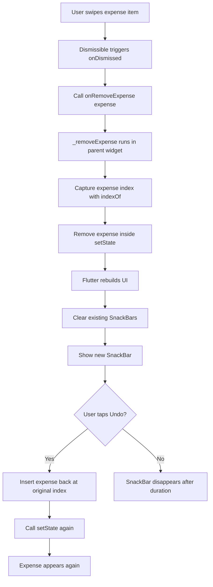
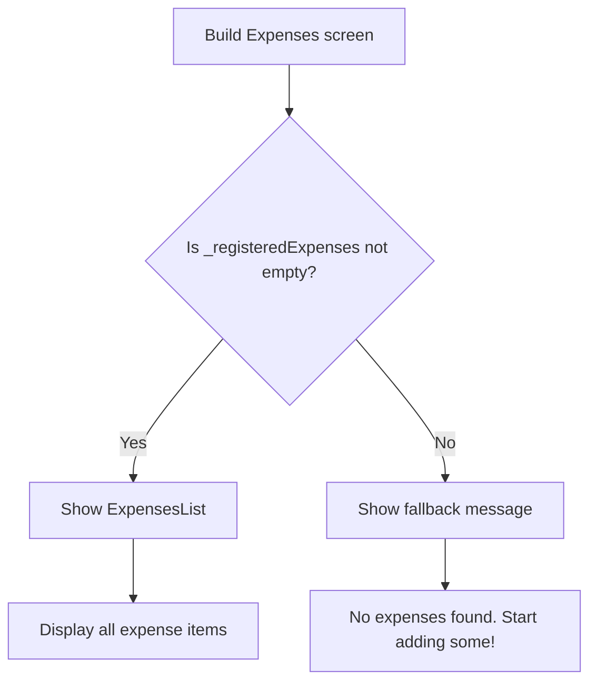
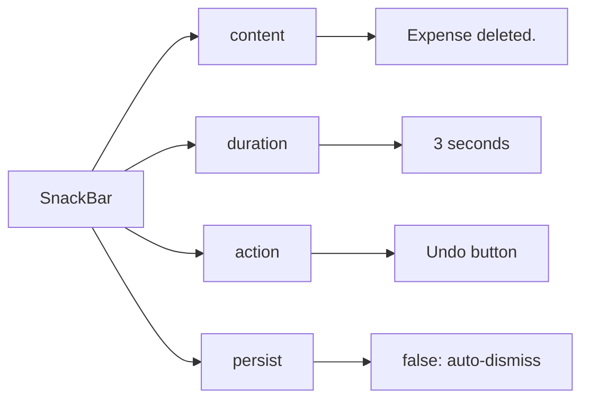
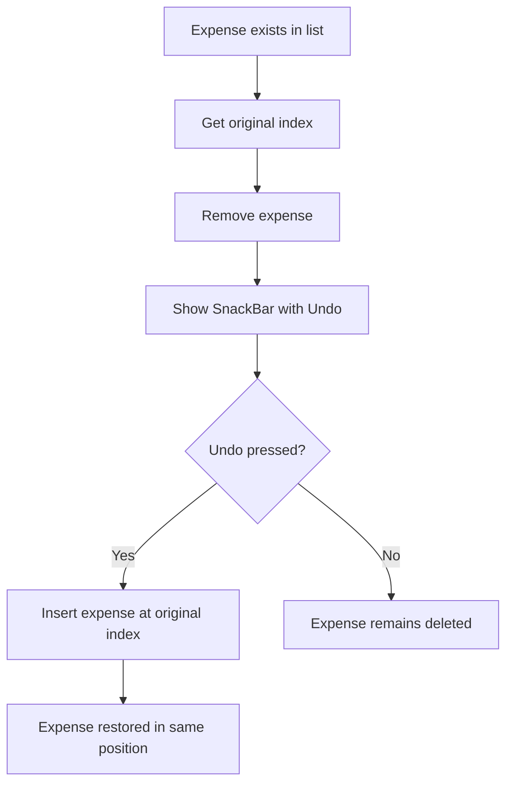

# Showing and Managing Snackbars

## Overview

This lesson explains how to show and manage `SnackBar` messages after deleting an expense.

When the user swipes an expense away, the app removes it from the list. To improve the user experience, we show a small message at the bottom of the screen saying that the expense was deleted.

The `SnackBar` also includes an **Undo** action, allowing the user to restore the deleted expense if it was removed accidentally.

This lesson also adds a fallback message when there are no expenses left in the list.

---

## What We Want to Add

After implementing swipe-to-delete with `Dismissible`, we add two improvements:

1. Show a fallback message when the expense list is empty.
2. Show a `SnackBar` after deleting an expense.
3. Add an **Undo** button to restore the deleted expense.
4. Clear old snackbars before showing a new one.

---

## Step 1: Show a Fallback Message When the List Is Empty

If there are no expenses, showing an empty list is not very helpful.

Instead, we can show a centered text message.

```dart
Widget mainContent = const Center(
  child: Text('No expenses found. Start adding some!'),
);
```

Then, if the list is not empty, we replace `mainContent` with the actual `ExpensesList`.

```dart
if (_registeredExpenses.isNotEmpty) {
  mainContent = ExpensesList(
    expenses: _registeredExpenses,
    onRemoveExpense: _removeExpense,
  );
}
```

Finally, we display `mainContent` in the UI.

```dart
body: Column(
  children: [
    Expanded(
      child: mainContent,
    ),
  ],
),
```

---

## Why Use `isNotEmpty`

Dart lists provide a useful property called `isNotEmpty`.

```dart
_registeredExpenses.isNotEmpty
```

This returns `true` if the list contains at least one item.

It is the opposite of:

```dart
_registeredExpenses.isEmpty
```

So the logic becomes:

```dart
if (_registeredExpenses.isNotEmpty) {
  // Show the list
} else {
  // Show fallback message
}
```

---

## Step 2: Capture the Deleted Expense Index

Before removing an expense, we need to remember where it was in the list.

This is important because if the user taps **Undo**, we want to restore the expense at its original position.

```dart
final expenseIndex = _registeredExpenses.indexOf(expense);
```

The `indexOf()` method returns the position of the expense in the list.

Example:

```dart
final index = _registeredExpenses.indexOf(expense);
```

If the expense was the first item, the index is `0`.

If it was the second item, the index is `1`.

---

## Step 3: Remove the Expense from State

After capturing the index, we remove the expense from the list.

```dart
setState(() {
  _registeredExpenses.remove(expense);
});
```

Because the UI depends on `_registeredExpenses`, we must update the list inside `setState()`.

This tells Flutter to rebuild the widget and show the updated list.

---

## Step 4: Show a SnackBar

To show a snackbar, use `ScaffoldMessenger`.

```dart
ScaffoldMessenger.of(context).showSnackBar(
  const SnackBar(
    content: Text('Expense deleted.'),
  ),
);
```

A `SnackBar` is a temporary message shown at the bottom of the screen.

It is useful for short feedback messages after user actions.

---

## Why Use `ScaffoldMessenger`

`ScaffoldMessenger` manages snackbars for a `Scaffold`.

```dart
ScaffoldMessenger.of(context)
```

This gives access to methods such as:

```dart
showSnackBar()
```

and:

```dart
clearSnackBars()
```

This is the standard way to show snackbars in modern Flutter apps.

---

## Step 5: Add a Duration

The snackbar should disappear automatically after a short time.

```dart
duration: const Duration(seconds: 3),
```

Example:

```dart
SnackBar(
  duration: const Duration(seconds: 3),
  content: const Text('Expense deleted.'),
)
```

This keeps the snackbar visible for three seconds.

---

## Step 6: Add an Undo Action

A snackbar can include one action button.

```dart
action: SnackBarAction(
  label: 'Undo',
  onPressed: () {
    // Restore expense
  },
),
```

The `label` is a plain string, not a widget.

```dart
label: 'Undo'
```

The `onPressed` function runs when the user taps the action.

---

## Step 7: Restore the Deleted Expense

To restore the expense, use `insert()` instead of `add()`.

```dart
_registeredExpenses.insert(expenseIndex, expense);
```

The `insert()` method adds an item at a specific position.

```dart
list.insert(index, item);
```

This lets us put the deleted expense back exactly where it was before.

Example:

```dart
setState(() {
  _registeredExpenses.insert(expenseIndex, expense);
});
```

---

## Step 8: Clear Existing SnackBars

If the user deletes multiple expenses quickly, multiple snackbars may queue up.

To avoid that, clear existing snackbars before showing a new one.

```dart
ScaffoldMessenger.of(context).clearSnackBars();
```

Then show the new snackbar.

```dart
ScaffoldMessenger.of(context).showSnackBar(...);
```

This ensures that only the latest snackbar is visible.

---

## Full Remove Expense Method

```dart
void _removeExpense(Expense expense) {
  final expenseIndex = _registeredExpenses.indexOf(expense);

  setState(() {
    _registeredExpenses.remove(expense);
  });

  ScaffoldMessenger.of(context).clearSnackBars();

  ScaffoldMessenger.of(context).showSnackBar(
    SnackBar(
      duration: const Duration(seconds: 3),
      persist: false,
      content: const Text('Expense deleted.'),
      action: SnackBarAction(
        label: 'Undo',
        onPressed: () {
          setState(() {
            _registeredExpenses.insert(expenseIndex, expense);
          });
        },
      ),
    ),
  );
}
```

---

## Note About `persist: false`

In newer Flutter versions, a `SnackBar` with an action may stay visible instead of disappearing automatically.

To make sure the snackbar disappears after the configured duration, add:

```dart
persist: false,
```

Example:

```dart
SnackBar(
  duration: const Duration(seconds: 3),
  persist: false,
  content: const Text('Expense deleted.'),
  action: SnackBarAction(
    label: 'Undo',
    onPressed: () {},
  ),
)
```

This makes the snackbar auto-dismiss after three seconds, even though it has an action.

---

## Full Main Content Example

```dart
@override
Widget build(BuildContext context) {
  Widget mainContent = const Center(
    child: Text('No expenses found. Start adding some!'),
  );

  if (_registeredExpenses.isNotEmpty) {
    mainContent = ExpensesList(
      expenses: _registeredExpenses,
      onRemoveExpense: _removeExpense,
    );
  }

  return Scaffold(
    appBar: AppBar(
      title: const Text('Flutter ExpenseTracker'),
      actions: [
        IconButton(
          onPressed: _openAddExpenseOverlay,
          icon: const Icon(Icons.add),
        ),
      ],
    ),
    body: Column(
      children: [
        Expanded(
          child: mainContent,
        ),
      ],
    ),
  );
}
```

---

## Full Flow Diagram



---

## Empty List Fallback Diagram



---

## Snackbar Structure Diagram



---

## Undo Restore Diagram



---

## Important Methods and Widgets

| API                             | Purpose                                                |
| ------------------------------- | ------------------------------------------------------ |
| `ScaffoldMessenger.of(context)` | Accesses the snackbar manager for the current scaffold |
| `showSnackBar()`                | Shows a snackbar on the screen                         |
| `clearSnackBars()`              | Removes currently visible or queued snackbars          |
| `SnackBar`                      | Displays a short message at the bottom                 |
| `SnackBarAction`                | Adds one action button to the snackbar                 |
| `Duration(seconds: 3)`          | Controls how long the snackbar stays visible           |
| `indexOf()`                     | Finds the original index of the deleted expense        |
| `insert()`                      | Restores the expense at a specific position            |
| `setState()`                    | Updates the UI after changing the list                 |

---

## Why `insert()` Is Better Than `add()`

If we used `add()`, the restored expense would always appear at the end of the list.

```dart
_registeredExpenses.add(expense);
```

But that would not restore the original order.

Instead, we use:

```dart
_registeredExpenses.insert(expenseIndex, expense);
```

This restores the expense at the same position it had before deletion.

---

## Why `clearSnackBars()` Is Useful

Without `clearSnackBars()`, deleting multiple expenses quickly can queue multiple snackbars.

That means the old snackbar may stay visible first, and the new one may only appear later.

By calling:

```dart
ScaffoldMessenger.of(context).clearSnackBars();
```

we immediately remove old snackbars and show the newest one.

This keeps the feedback clear and avoids confusing the user.

---

## Key Takeaways

* Show fallback content when the expense list is empty.
* Use `ScaffoldMessenger.of(context).showSnackBar()` to display a snackbar.
* Use `SnackBarAction` to add an **Undo** button.
* Capture the deleted expense index before removing it.
* Use `insert()` to restore the expense at its original position.
* Use `clearSnackBars()` before showing a new snackbar.
* Use `setState()` whenever the expense list changes.
* Add `persist: false` in newer Flutter versions if the snackbar should disappear automatically after its duration.

---

## Summary

This lesson improves the deletion experience in the expense tracker app.

When an expense is deleted, the app shows a snackbar message at the bottom of the screen. The snackbar includes an **Undo** action, allowing the user to restore the deleted expense at its original position.

The app also shows a fallback message when there are no expenses left. Finally, `clearSnackBars()` ensures that only the most recent snackbar is displayed when multiple expenses are deleted quickly.
