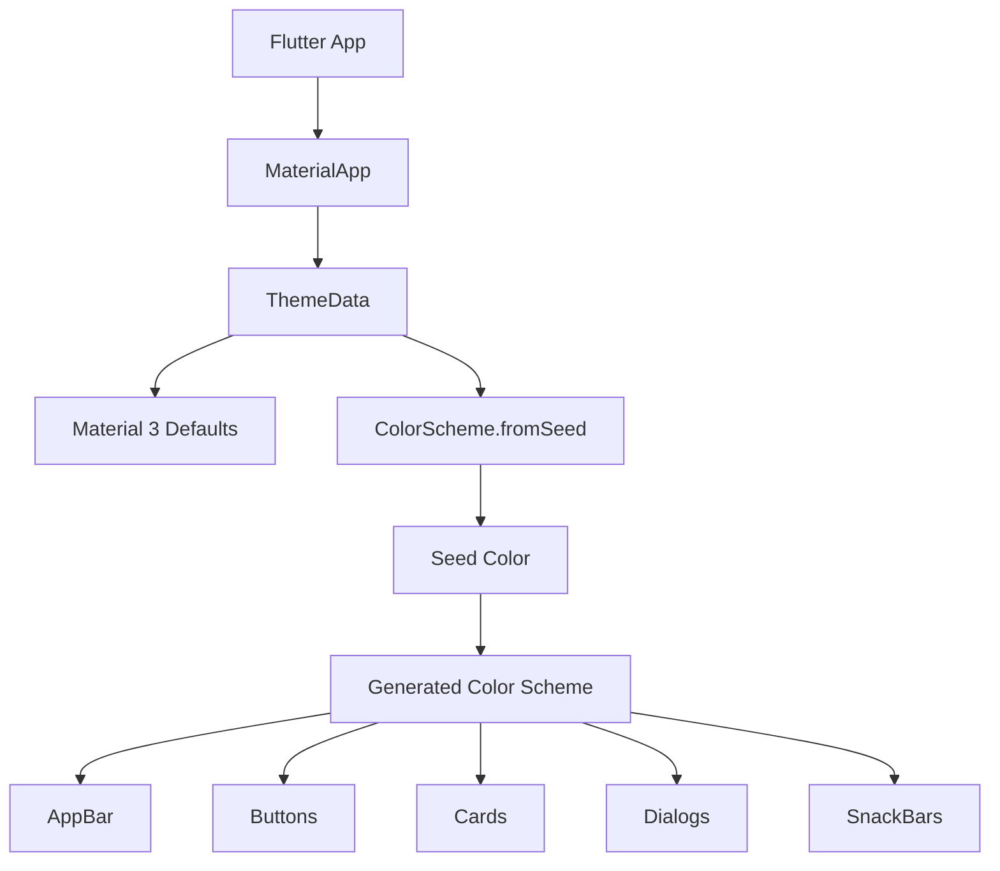
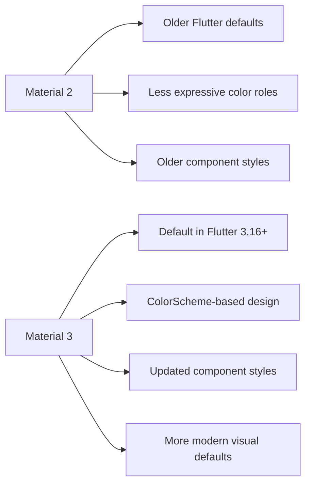
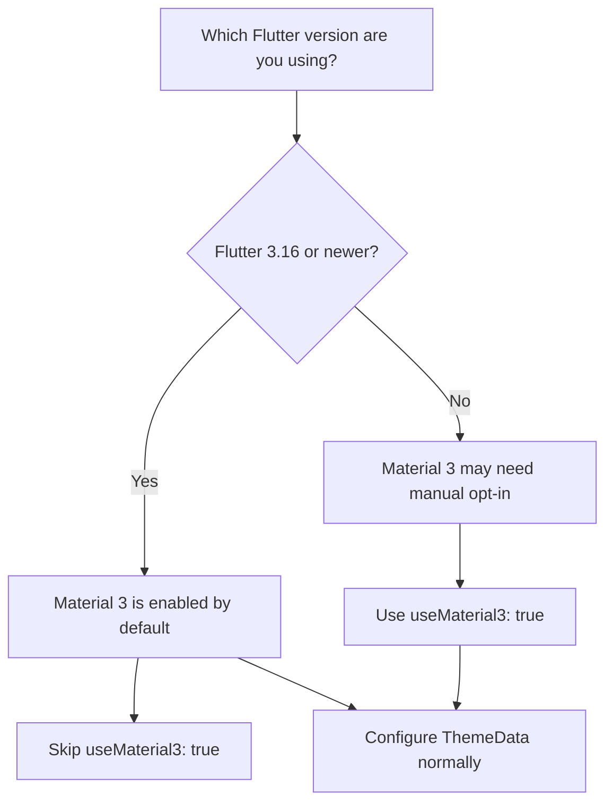

# Flutter and Material 3

## Overview

This lesson introduces **Material 3**, the latest version of Google's Material Design system, and explains how it affects Flutter apps.

Material 3 updates the visual style of many Flutter widgets, including colors, buttons, cards, app bars, dialogs, and floating action buttons.

In older Flutter versions, Material 3 had to be enabled manually with:

```dart id="x28b04"
useMaterial3: true
```

However, in Flutter 3.16 and newer, Material 3 is enabled by default. Therefore, in modern Flutter projects, you usually do not need to set `useMaterial3: true` manually.

---

## What Is Material Design?

Material Design is Google's design system for building consistent and polished user interfaces.

It defines guidelines for:

* Colors
* Typography
* Spacing
* Elevation
* Buttons
* Cards
* Dialogs
* App bars
* Navigation components
* User interaction patterns

Flutter's `material` library implements many of these design components as ready-to-use widgets.

---

## What Is Material 3?

Material 3, also known as **Material You**, is the newer version of Material Design.

Compared to Material 2, Material 3 introduces:

* Updated color roles
* More rounded components
* Improved typography
* Refined elevation behavior
* Updated button styles
* Updated card styles
* Updated app bar behavior
* More expressive and modern UI defaults

Flutter supports Material 3 through `ThemeData` and the Material widget library.

---

## Important Update: Material 3 Is Now Default

In older Flutter versions, you had to manually enable Material 3:

```dart id="xk6gqh"
ThemeData(
  useMaterial3: true,
)
```

But since Flutter 3.16, Material 3 is enabled by default.

So in a modern Flutter project, you can usually skip this:

```dart id="d4c4ce"
useMaterial3: true
```

The rest of the theming code still works normally.

---

## Modern Theme Example

In modern Flutter, you can define a Material 3-style theme like this:

```dart id="c424ve"
MaterialApp(
  theme: ThemeData(
    colorScheme: ColorScheme.fromSeed(
      seedColor: Colors.deepPurple,
    ),
  ),
  home: const Expenses(),
)
```

Because Material 3 is already the default, you do not need to add `useMaterial3: true`.

---

## Older Flutter Example

If you are using an older Flutter version, you may still see code like this:

```dart id="pymhpr"
MaterialApp(
  theme: ThemeData(
    useMaterial3: true,
    colorScheme: ColorScheme.fromSeed(
      seedColor: Colors.deepPurple,
    ),
  ),
  home: const Expenses(),
)
```

This was needed when Material 3 was still optional.

In current Flutter versions, this line is usually unnecessary:

```dart id="uaijhh"
useMaterial3: true
```

---

## Material 2 Fallback

If you specifically want to keep the older Material 2 look, Flutter still allows this for now:

```dart id="jjsjca"
ThemeData(
  useMaterial3: false,
)
```

However, Flutter's official migration guide notes that Material 2 support and the `useMaterial3` flag are expected to be removed eventually.

So this should be treated as a temporary migration option, not a long-term approach.

---

## Using `ColorScheme.fromSeed`

Material 3 works strongly with color schemes.

A common way to create a color scheme is:

```dart id="21o2qp"
colorScheme: ColorScheme.fromSeed(
  seedColor: Colors.deepPurple,
),
```

The seed color is used to generate a full color palette for the app.

For example, Flutter can derive roles such as:

* `primary`
* `secondary`
* `surface`
* `error`
* `onPrimary`
* `onSecondary`
* `onSurface`
* `onError`

This helps keep the app visually consistent.

---

## Example Theme for the Expense App

```dart id="07ndsa"
import 'package:flutter/material.dart';

import 'widgets/expenses.dart';

void main() {
  runApp(
    MaterialApp(
      theme: ThemeData(
        colorScheme: ColorScheme.fromSeed(
          seedColor: Colors.deepPurple,
        ),
      ),
      home: const Expenses(),
    ),
  );
}
```

This creates a modern Material 3-based theme using a purple seed color.

---

## What Changes Visually with Material 3?

When Material 3 is active, several widgets may look different compared to Material 2.

Examples include:

| Widget                 | Material 3 Change                        |
| ---------------------- | ---------------------------------------- |
| `AppBar`               | Updated color and elevation behavior     |
| `Card`                 | Softer shape and updated surface styling |
| `FloatingActionButton` | Updated size, shape, and color defaults  |
| `ElevatedButton`       | Updated button style and shape           |
| `TextButton`           | Updated typography and spacing           |
| `AlertDialog`          | Updated shape and layout                 |
| `SnackBar`             | Updated colors and behavior              |
| `ColorScheme`          | More role-based color structure          |

These changes can make the app look more modern, but older apps may visually change after upgrading Flutter.

---

## Material 3 Theme Flow



---

## Material 2 vs Material 3 Diagram



---

## Flutter Version Decision Diagram



---

## Common Course Note

In some course videos, you may see this code:

```dart id="t7mshb"
ThemeData(
  useMaterial3: true,
)
```

That was correct when the course was recorded.

Today, if you are using a recent Flutter version, you can skip that setting because Material 3 is already enabled by default.

The rest of the theme code from the lecture remains valid.

---

## Key Takeaways

* Material 3 is the latest Material Design system supported by Flutter.
* It updates the default look of many Material widgets.
* Older Flutter versions required `useMaterial3: true`.
* Flutter 3.16 and newer enable Material 3 by default.
* In modern Flutter apps, you usually do not need to write `useMaterial3: true`.
* `ColorScheme.fromSeed()` is a common way to create a consistent Material 3 color palette.
* Some apps may look different after upgrading from Material 2 to Material 3.
* `useMaterial3: false` can temporarily restore Material 2 behavior, but it should not be treated as a permanent solution.

---

## Summary

Material 3 gives Flutter apps a newer and more modern visual style.

In older Flutter versions, developers had to enable it manually by setting `useMaterial3: true` in `ThemeData`. In Flutter 3.16 and newer, Material 3 is already the default, so that setting can be skipped.

For the expense tracker app, you can continue configuring the theme with `ThemeData` and `ColorScheme.fromSeed`, while letting Flutter use Material 3 automatically.
