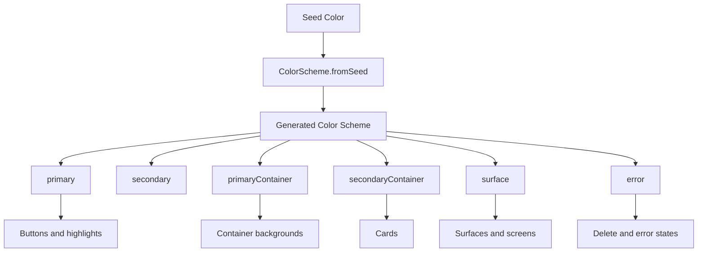
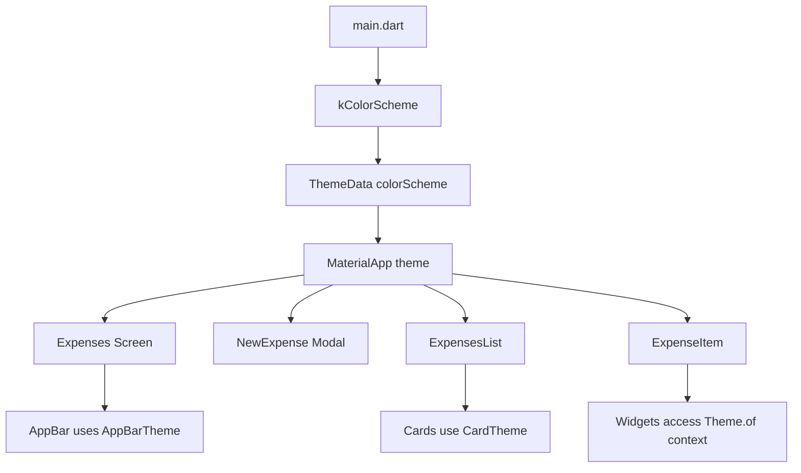
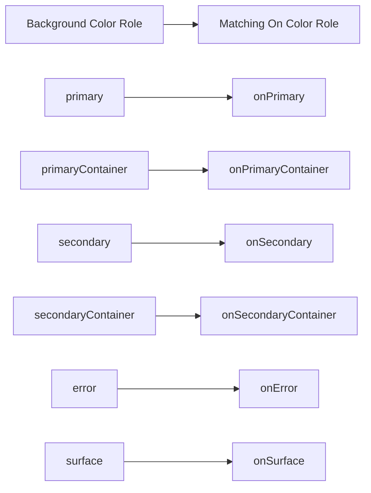
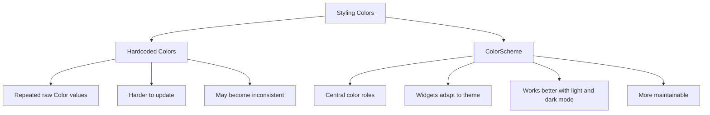

# Setting and Using a Color Scheme

## Overview

This lesson explains how to define and use a `ColorScheme` in a Flutter app.

Instead of hardcoding colors directly inside widgets, we define a central color scheme in `main.dart`. Flutter can then use that color scheme across the entire app.

This makes the app easier to style, easier to update, and more visually consistent.

---

## Why Use a Color Scheme?

Flutter's theming system offers many ways to customize colors.

You can set individual colors such as:

```dart
scaffoldBackgroundColor
```

or component-specific themes such as:

```dart
appBarTheme
elevatedButtonTheme
cardTheme
```

However, one of the best modern approaches is to define a central `ColorScheme`.

A `ColorScheme` gives your app a structured set of named color roles, such as:

* `primary`
* `secondary`
* `primaryContainer`
* `secondaryContainer`
* `surface`
* `error`
* `onPrimary`
* `onPrimaryContainer`
* `onSurface`
* `onError`

These roles can then be used by Flutter's built-in widgets and by your own widgets.

---

## Step 1: Create a Global Color Scheme

In `main.dart`, create a color scheme outside the `MaterialApp`.

```dart
final kColorScheme = ColorScheme.fromSeed(
  seedColor: const Color.fromARGB(255, 96, 59, 181),
);
```

The `k` prefix is a common Flutter convention for global constants or global-style variables.

It is not required, but you will often see names like:

```dart
kColorScheme
kDarkColorScheme
kDefaultPadding
```

in Flutter projects.

---

## Why Use `ColorScheme.fromSeed`?

Instead of manually choosing every color, `ColorScheme.fromSeed` creates a full color palette from one base color.

```dart
ColorScheme.fromSeed(
  seedColor: const Color.fromARGB(255, 96, 59, 181),
)
```

The seed color is the starting point.

Flutter then generates related color roles for the app.

This helps create a more harmonious design without manually picking every shade.

---

## Step 2: Assign the Color Scheme to the Theme

After creating `kColorScheme`, pass it to `ThemeData`.

```dart
MaterialApp(
  theme: ThemeData().copyWith(
    colorScheme: kColorScheme,
  ),
  home: const Expenses(),
)
```

Now the app's Material widgets can use this color scheme.

For example, buttons, cards, dialogs, and other components may automatically use colors derived from this scheme.

---

## Full Basic Example

```dart
import 'package:flutter/material.dart';

import 'widgets/expenses.dart';

final kColorScheme = ColorScheme.fromSeed(
  seedColor: const Color.fromARGB(255, 96, 59, 181),
);

void main() {
  runApp(
    MaterialApp(
      theme: ThemeData().copyWith(
        colorScheme: kColorScheme,
      ),
      home: const Expenses(),
    ),
  );
}
```

---

## Material 3 Note

In older Flutter versions, you may see this:

```dart
useMaterial3: true,
```

For example:

```dart
theme: ThemeData().copyWith(
  useMaterial3: true,
  colorScheme: kColorScheme,
),
```

In newer Flutter versions, Material 3 is enabled by default.

So in modern Flutter projects, you can usually skip:

```dart
useMaterial3: true
```

The rest of the theme configuration stays the same.

---

## Step 3: Use Theme Colors in Widgets

Inside any widget, you can access the active color scheme with:

```dart
Theme.of(context).colorScheme
```

Example:

```dart
final colorScheme = Theme.of(context).colorScheme;
```

Then you can use color roles like this:

```dart
colorScheme.primary
colorScheme.primaryContainer
colorScheme.onPrimaryContainer
colorScheme.error
```

---

## Example: Using ColorScheme in a Widget

```dart
Container(
  color: Theme.of(context).colorScheme.primaryContainer,
  child: Text(
    'Total',
    style: TextStyle(
      color: Theme.of(context).colorScheme.onPrimaryContainer,
    ),
  ),
)
```

Here, the container uses:

```dart
primaryContainer
```

and the text uses:

```dart
onPrimaryContainer
```

The `on...` color is designed to be readable on top of the matching background color.

---

## Important Pattern: Pair Colors Correctly

When using a background color from the color scheme, use the matching `on` color for text or icons.

| Background Color     | Text/Icon Color        |
| -------------------- | ---------------------- |
| `primary`            | `onPrimary`            |
| `primaryContainer`   | `onPrimaryContainer`   |
| `secondary`          | `onSecondary`          |
| `secondaryContainer` | `onSecondaryContainer` |
| `surface`            | `onSurface`            |
| `error`              | `onError`              |

Example:

```dart
Container(
  color: Theme.of(context).colorScheme.error,
  child: Text(
    'Delete',
    style: TextStyle(
      color: Theme.of(context).colorScheme.onError,
    ),
  ),
)
```

This improves contrast and accessibility.

---

## Step 4: Customize the AppBar Theme

After defining a color scheme, we can use it to customize specific parts of the theme.

For example, we can customize the `AppBar`.

```dart
theme: ThemeData().copyWith(
  colorScheme: kColorScheme,
  appBarTheme: const AppBarTheme().copyWith(
    backgroundColor: kColorScheme.onPrimaryContainer,
    foregroundColor: kColorScheme.primaryContainer,
  ),
),
```

This changes the default style of all `AppBar` widgets in the app.

---

## Why Use `AppBarTheme`?

Without a theme, you might style each `AppBar` manually.

```dart
AppBar(
  backgroundColor: Colors.deepPurple,
  foregroundColor: Colors.white,
)
```

But this becomes repetitive if the app has many screens.

With `appBarTheme`, you define the style once:

```dart
appBarTheme: const AppBarTheme().copyWith(
  backgroundColor: kColorScheme.onPrimaryContainer,
  foregroundColor: kColorScheme.primaryContainer,
),
```

Now all app bars can use the same global style.

---

## Full Theme Example with AppBarTheme

```dart
import 'package:flutter/material.dart';

import 'widgets/expenses.dart';

final kColorScheme = ColorScheme.fromSeed(
  seedColor: const Color.fromARGB(255, 96, 59, 181),
);

void main() {
  runApp(
    MaterialApp(
      theme: ThemeData().copyWith(
        colorScheme: kColorScheme,
        appBarTheme: const AppBarTheme().copyWith(
          backgroundColor: kColorScheme.onPrimaryContainer,
          foregroundColor: kColorScheme.primaryContainer,
        ),
      ),
      home: const Expenses(),
    ),
  );
}
```

---

## Understanding `backgroundColor` and `foregroundColor`

Inside `AppBarTheme`:

```dart
backgroundColor
```

controls the app bar's background color.

```dart
foregroundColor
```

controls the default color for text and icons inside the app bar.

Example:

```dart
appBarTheme: const AppBarTheme().copyWith(
  backgroundColor: kColorScheme.onPrimaryContainer,
  foregroundColor: kColorScheme.primaryContainer,
),
```

This means:

* The app bar background uses `onPrimaryContainer`.
* The title and icons use `primaryContainer`.

---

## Step 5: Customize the Card Theme

You can also use the color scheme for cards.

```dart
cardTheme: CardTheme(
  color: kColorScheme.secondaryContainer,
  margin: const EdgeInsets.symmetric(
    horizontal: 16,
    vertical: 8,
  ),
),
```

This changes the default card background color and margin.

---

## Full Theme Example with AppBar and Card Theme

```dart
import 'package:flutter/material.dart';

import 'widgets/expenses.dart';

final kColorScheme = ColorScheme.fromSeed(
  seedColor: const Color.fromARGB(255, 96, 59, 181),
);

void main() {
  runApp(
    MaterialApp(
      theme: ThemeData().copyWith(
        colorScheme: kColorScheme,
        appBarTheme: const AppBarTheme().copyWith(
          backgroundColor: kColorScheme.onPrimaryContainer,
          foregroundColor: kColorScheme.primaryContainer,
        ),
        cardTheme: CardTheme(
          color: kColorScheme.secondaryContainer,
          margin: const EdgeInsets.symmetric(
            horizontal: 16,
            vertical: 8,
          ),
        ),
      ),
      home: const Expenses(),
    ),
  );
}
```

---

## Step 6: Avoid Hardcoding Colors

Avoid writing raw colors directly inside widgets when those colors belong to the app design.

Avoid this:

```dart
Container(
  color: const Color.fromARGB(255, 96, 59, 181),
)
```

Prefer this:

```dart
Container(
  color: Theme.of(context).colorScheme.primary,
)
```

This makes the widget follow the active app theme.

If the theme changes later, the widget updates automatically.

---

## Example: Dismissible Background with Theme Color

In the expense app, the delete background can use the theme's error color.

```dart
background: Container(
  color: Theme.of(context).colorScheme.error,
  child: Icon(
    Icons.delete,
    color: Theme.of(context).colorScheme.onError,
  ),
),
```

This is better than manually choosing red and white.

The theme decides what the error color should be.

---

## Color Scheme Flow Diagram



---

## Theme Usage Diagram



---

## Color Pairing Diagram



---

## Manual Colors vs Color Scheme



---

## Important Color Roles

| Color Role           | Common Use                                       |
| -------------------- | ------------------------------------------------ |
| `primary`            | Main brand color, primary buttons, active states |
| `onPrimary`          | Text/icons shown on top of `primary`             |
| `primaryContainer`   | Softer primary-colored containers                |
| `onPrimaryContainer` | Text/icons shown on `primaryContainer`           |
| `secondary`          | Secondary accents                                |
| `secondaryContainer` | Softer secondary-colored containers, cards       |
| `surface`            | Default surfaces and backgrounds                 |
| `onSurface`          | Text/icons shown on surfaces                     |
| `error`              | Error states, delete backgrounds                 |
| `onError`            | Text/icons shown on error backgrounds            |

---

## Why `copyWith()` Is Useful Here

The `copyWith()` method lets us start with Flutter's default theme and override only selected settings.

```dart
ThemeData().copyWith(
  colorScheme: kColorScheme,
  appBarTheme: const AppBarTheme().copyWith(
    backgroundColor: kColorScheme.onPrimaryContainer,
    foregroundColor: kColorScheme.primaryContainer,
  ),
)
```

This is better than creating every part of the theme manually.

You keep the default Flutter styling, but customize the pieces that matter for your app.

---

## Key Takeaways

* `ColorScheme` is the recommended way to manage app colors.
* `ColorScheme.fromSeed` generates a full color palette from one base color.
* Define the color scheme once in `main.dart`.
* Assign the color scheme to `ThemeData`.
* Use `Theme.of(context).colorScheme` inside widgets.
* Prefer theme colors over hardcoded raw colors.
* Pair background colors with their matching `on...` colors.
* Use `AppBarTheme`, `CardTheme`, and other sub-themes to customize built-in widgets globally.
* `copyWith()` lets you override only selected parts of the default theme.

---

## Summary

This lesson shows how to define and use a central `ColorScheme` in Flutter.

A color scheme allows the app to use consistent colors across screens and widgets. Instead of hardcoding colors manually, we define a seed-based color scheme in `main.dart` and assign it to `ThemeData`.

Widgets can then access the active colors through `Theme.of(context).colorScheme`.

This creates a more maintainable design system and makes it easier to update the app's visual style later.
