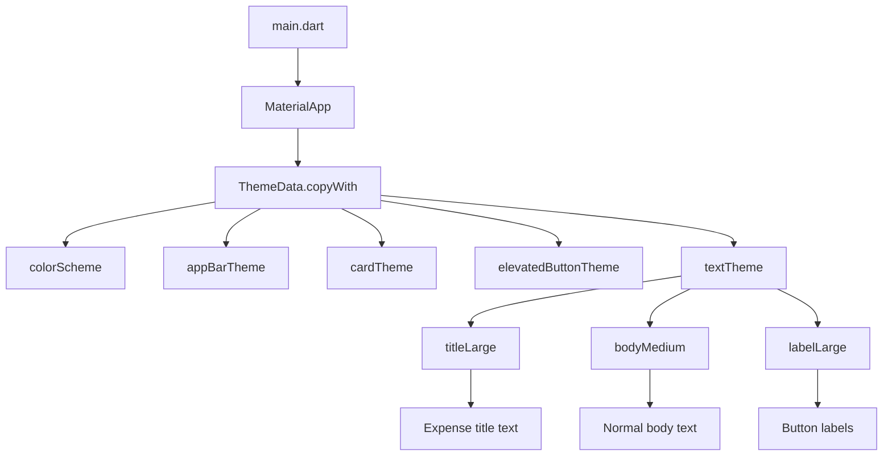
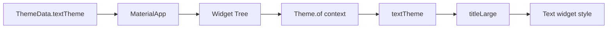
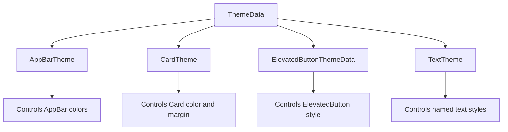
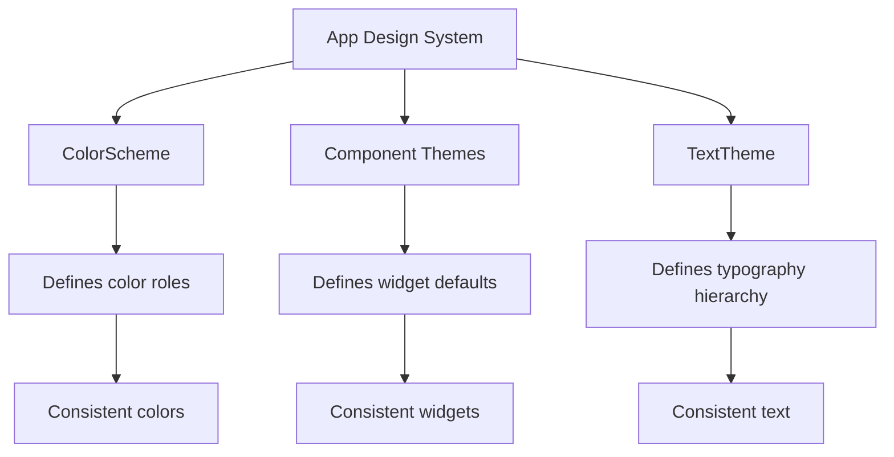
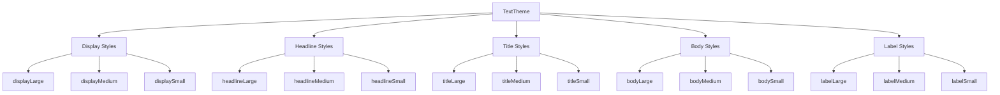

# Setting Text Themes

## Overview

This lesson explains how to customize the app's typography and component styling through Flutter's theming system.

After setting up a `ColorScheme`, we can continue improving the app's design by configuring:

* `CardTheme`
* `ElevatedButtonThemeData`
* `TextTheme`

The main focus of this lesson is `TextTheme`, which allows us to define app-wide text styles such as titles, body text, and labels.

Instead of manually styling every `Text` widget, we define text styles once in `ThemeData` and reuse them throughout the app.

---

## Why Text Themes Matter

Flutter apps often contain text in many places:

* App bar titles
* Expense item titles
* Button labels
* Dialog messages
* Snackbar messages
* Form labels
* Empty state messages

Without a text theme, you may end up writing repeated styles like this:

```dart id="v5j681"
Text(
  expense.title,
  style: const TextStyle(
    fontWeight: FontWeight.bold,
    fontSize: 16,
  ),
)
```

This works, but it becomes harder to maintain as the app grows.

A text theme lets you define the style once and reuse it.

---

## Step 1: Continue from the Color Scheme

Before setting text styles, we already have a global color scheme.

```dart id="f9o6pg"
final kColorScheme = ColorScheme.fromSeed(
  seedColor: const Color.fromARGB(255, 96, 59, 181),
);
```

This color scheme can also be used inside text styles.

For example, text can use:

```dart id="t3ltde"
kColorScheme.onSecondaryContainer
```

This keeps text colors connected to the app's central design system.

---

## Step 2: Customize the Card Theme

The expense items use Flutter's built-in `Card` widget.

Instead of styling each card manually, we can define a global card theme.

```dart id="8jnx2e"
cardTheme: CardTheme(
  color: kColorScheme.secondaryContainer,
  margin: const EdgeInsets.symmetric(
    horizontal: 16,
    vertical: 8,
  ),
),
```

This affects all `Card` widgets in the app.

---

## Why Customize `CardTheme`

The expense list items are displayed as cards.

A global `CardTheme` can control:

* Card background color
* Margin
* Elevation
* Shape
* Surface tint
* Shadow color

Example:

```dart id="yujgd3"
cardTheme: CardTheme(
  color: kColorScheme.secondaryContainer,
  margin: const EdgeInsets.symmetric(
    horizontal: 16,
    vertical: 8,
  ),
),
```

This gives all expense cards a consistent look.

---

## Note About `CardTheme` and `CardThemeData`

Depending on the Flutter version, you may see either `CardTheme` or `CardThemeData` used in examples.

For many course projects, this works:

```dart id="bndf4j"
cardTheme: CardTheme(
  color: kColorScheme.secondaryContainer,
  margin: const EdgeInsets.symmetric(
    horizontal: 16,
    vertical: 8,
  ),
),
```

In newer Flutter versions, you may also see:

```dart id="iozt88"
cardTheme: CardThemeData(
  color: kColorScheme.secondaryContainer,
  margin: const EdgeInsets.symmetric(
    horizontal: 16,
    vertical: 8,
  ),
),
```

Use the version accepted by your Flutter SDK.

---

## Step 3: Customize Elevated Buttons

The app also uses `ElevatedButton`, for example in the expense form.

We can customize all elevated buttons through `elevatedButtonTheme`.

```dart id="xluzlp"
elevatedButtonTheme: ElevatedButtonThemeData(
  style: ElevatedButton.styleFrom(
    backgroundColor: kColorScheme.primaryContainer,
  ),
),
```

This changes the default style of every `ElevatedButton` in the app.

---

## Why `ElevatedButton.styleFrom` Is Used

Some theme objects use `copyWith()`.

For elevated buttons, a common approach is to use:

```dart id="d9zc6l"
ElevatedButton.styleFrom(...)
```

This starts from Flutter's default elevated button styling and allows us to override selected properties.

Example:

```dart id="5o3l3t"
ElevatedButtonThemeData(
  style: ElevatedButton.styleFrom(
    backgroundColor: kColorScheme.primaryContainer,
    foregroundColor: kColorScheme.onPrimaryContainer,
  ),
)
```

This keeps the default button behavior while changing the colors.

---

## Step 4: Configure the Text Theme

The text theme is configured through the `textTheme` property of `ThemeData`.

```dart id="2l3ja7"
textTheme: ThemeData().textTheme.copyWith(
  titleLarge: TextStyle(
    fontWeight: FontWeight.bold,
    color: kColorScheme.onSecondaryContainer,
    fontSize: 16,
  ),
),
```

This overrides the `titleLarge` text style while preserving the rest of Flutter's default text theme.

---

## Why Use `ThemeData().textTheme.copyWith`

Instead of creating a full `TextTheme` from scratch, we start with Flutter's default text theme:

```dart id="wrn3sq"
ThemeData().textTheme
```

Then we override only the style we want to change:

```dart id="grwi8j"
.copyWith(
  titleLarge: TextStyle(...),
)
```

This is useful because we do not need to manually define every possible text style.

---

## Text Theme Style Slots

Flutter's `TextTheme` contains many predefined style slots.

Common examples include:

| Text Style      | Common Use                                            |
| --------------- | ----------------------------------------------------- |
| `displayLarge`  | Very large display text                               |
| `headlineLarge` | Large page headings                                   |
| `titleLarge`    | App bar titles, card titles, important section titles |
| `titleMedium`   | Medium-level titles                                   |
| `bodyLarge`     | Main body text                                        |
| `bodyMedium`    | Default body text                                     |
| `labelLarge`    | Button labels                                         |
| `labelSmall`    | Small labels or captions                              |

In this lesson, we mainly customize:

```dart id="j5dkh3"
titleLarge
```

because it is commonly used for important title text.

---

## Step 5: Use the Text Theme in Widgets

After defining the text theme globally, we can use it inside widgets with:

```dart id="q5ad4s"
Theme.of(context).textTheme.titleLarge
```

Example:

```dart id="b7yce1"
Text(
  expense.title,
  style: Theme.of(context).textTheme.titleLarge,
)
```

This applies the globally defined `titleLarge` style to the expense title.

---

## Full Theme Example

```dart id="ldu944"
import 'package:flutter/material.dart';

import 'widgets/expenses.dart';

final kColorScheme = ColorScheme.fromSeed(
  seedColor: const Color.fromARGB(255, 96, 59, 181),
);

void main() {
  runApp(
    MaterialApp(
      title: 'Expense Tracker',
      theme: ThemeData().copyWith(
        colorScheme: kColorScheme,

        appBarTheme: const AppBarTheme().copyWith(
          backgroundColor: kColorScheme.onPrimaryContainer,
          foregroundColor: kColorScheme.primaryContainer,
        ),

        cardTheme: CardTheme(
          color: kColorScheme.secondaryContainer,
          margin: const EdgeInsets.symmetric(
            horizontal: 16,
            vertical: 8,
          ),
        ),

        elevatedButtonTheme: ElevatedButtonThemeData(
          style: ElevatedButton.styleFrom(
            backgroundColor: kColorScheme.primaryContainer,
            foregroundColor: kColorScheme.onPrimaryContainer,
          ),
        ),

        textTheme: ThemeData().textTheme.copyWith(
          titleLarge: TextStyle(
            fontWeight: FontWeight.bold,
            color: kColorScheme.onSecondaryContainer,
            fontSize: 16,
          ),
        ),
      ),
      home: const Expenses(),
    ),
  );
}
```

---

## Material 3 Note

In older Flutter course code, you may see this:

```dart id="9bf8qx"
useMaterial3: true,
```

In modern Flutter versions, Material 3 is already enabled by default.

So you can usually skip this line:

```dart id="cwp3zk"
useMaterial3: true
```

The rest of the theme setup still works.

---

## Text Theme Usage Example in `ExpenseItem`

Suppose each expense item displays the expense title.

Instead of hardcoding a style:

```dart id="tjgz4a"
Text(
  expense.title,
  style: const TextStyle(
    fontWeight: FontWeight.bold,
    fontSize: 16,
  ),
)
```

Use the theme:

```dart id="aarbxm"
Text(
  expense.title,
  style: Theme.of(context).textTheme.titleLarge,
)
```

Now the text follows the global app typography.

---

## Why the AppBar Title May Not Change

You may expect this to change the app bar title:

```dart id="vj9oie"
textTheme: ThemeData().textTheme.copyWith(
  titleLarge: TextStyle(
    color: Colors.red,
  ),
),
```

However, the app bar may still not show red text.

That is because `AppBarTheme` can also define a `foregroundColor`.

```dart id="k7oe2c"
appBarTheme: const AppBarTheme().copyWith(
  foregroundColor: kColorScheme.primaryContainer,
),
```

The app bar's `foregroundColor` can override the text color used by the app bar title.

So if you set a text color in `titleLarge`, it may affect other `titleLarge` text in your app, but not necessarily the app bar title if the app bar has its own foreground color.

---

## Text Theme vs AppBar Theme

| Theme Setting                 | Affects                           |
| ----------------------------- | --------------------------------- |
| `textTheme.titleLarge`        | General title text across the app |
| `appBarTheme.foregroundColor` | App bar title and app bar icons   |
| `appBarTheme.backgroundColor` | App bar background                |
| `appBarTheme.titleTextStyle`  | App bar title text specifically   |

If you want to customize only the app bar title, use `appBarTheme`.

If you want to customize title text across the app, use `textTheme.titleLarge`.

---

## Example: AppBar-Specific Title Style

If needed, you can define the app bar title style directly:

```dart id="v2tdnd"
appBarTheme: AppBarTheme(
  backgroundColor: kColorScheme.onPrimaryContainer,
  foregroundColor: kColorScheme.primaryContainer,
  titleTextStyle: TextStyle(
    fontSize: 18,
    fontWeight: FontWeight.bold,
    color: kColorScheme.primaryContainer,
  ),
),
```

This targets the app bar title more directly than `textTheme.titleLarge`.

---

## Why Use Text Themes Instead of Manual Styles?

Using `TextTheme` gives your app a consistent typography system.

Instead of manually styling every text widget, you define named styles once.

This helps with:

* Consistency
* Maintainability
* Faster redesigns
* Better scaling across screens
* Better support for light and dark themes
* Cleaner widget code

---

## Theme Configuration Flow Diagram



---

## Text Theme Access Diagram



---

## Component Theme Diagram



---

## Styling Responsibility Diagram



---

## Text Theme Hierarchy Diagram



---

## Important APIs

| API                           | Purpose                                              |
| ----------------------------- | ---------------------------------------------------- |
| `ThemeData`                   | Defines global app styling                           |
| `ThemeData().copyWith()`      | Copies default theme and overrides selected values   |
| `ColorScheme.fromSeed()`      | Generates a color scheme from one seed color         |
| `CardTheme` / `CardThemeData` | Defines default styling for `Card` widgets           |
| `ElevatedButtonThemeData`     | Defines default styling for `ElevatedButton` widgets |
| `ElevatedButton.styleFrom()`  | Creates a button style from simple parameters        |
| `TextTheme`                   | Defines named text styles                            |
| `TextStyle`                   | Defines font size, weight, color, and more           |
| `Theme.of(context).textTheme` | Accesses text styles inside widgets                  |

---

## Key Takeaways

* Use `CardTheme` to style all cards globally.
* Use `ElevatedButtonThemeData` to style all elevated buttons globally.
* Use `TextTheme` to define reusable text styles.
* Use `ThemeData().textTheme.copyWith(...)` to preserve defaults and override selected styles.
* Use `Theme.of(context).textTheme.titleLarge` inside widgets.
* `AppBarTheme.foregroundColor` can override the color of app bar title text.
* Avoid manually repeating `TextStyle` objects across many widgets.
* A central theme keeps the app easier to maintain and redesign.

---

## Summary

This lesson expands the app theme by customizing cards, elevated buttons, and text styles.

The most important part is the `TextTheme`, which defines a set of named text styles for the app. By overriding styles like `titleLarge`, we can control how important title text looks across the application.

Inside widgets, we use `Theme.of(context).textTheme` to access these global styles.

This approach creates a consistent and maintainable typography system for the Flutter expense tracker app.
