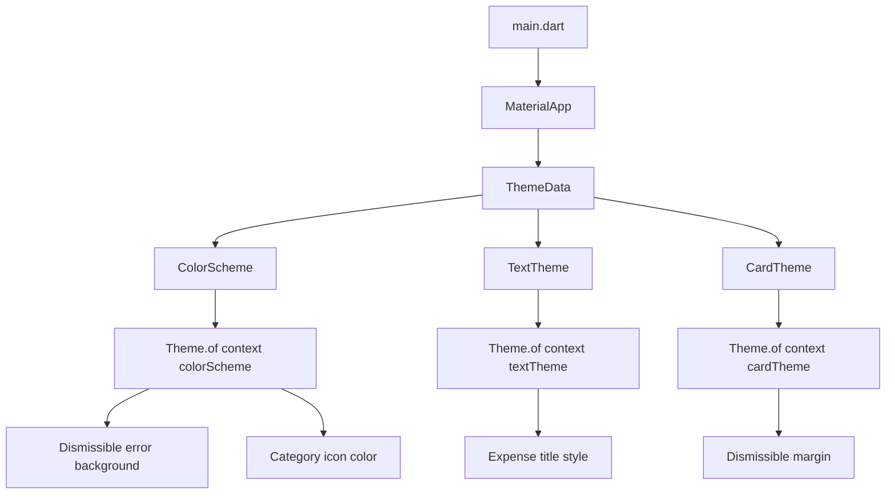
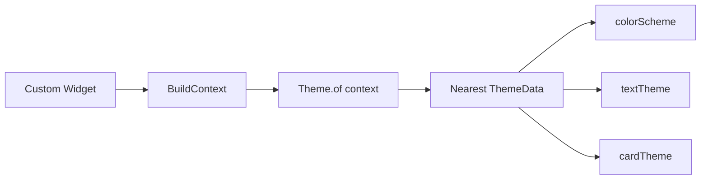
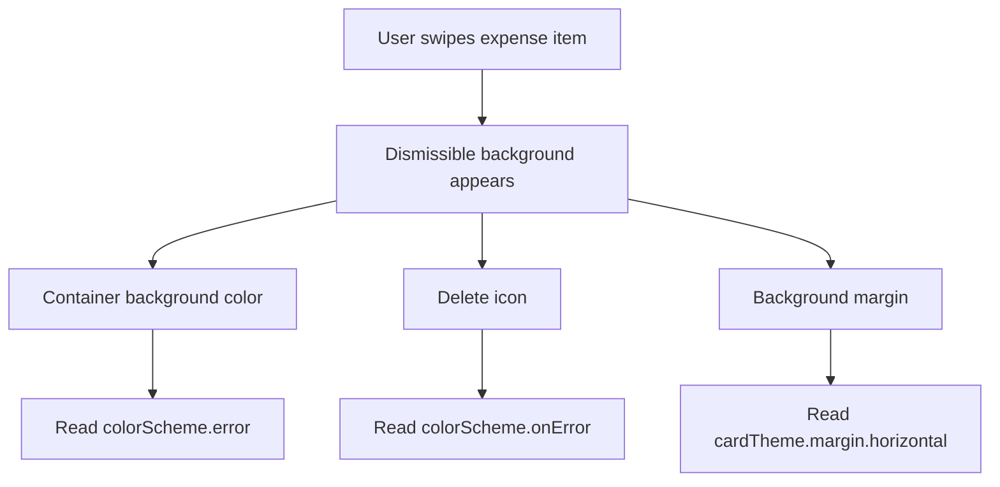
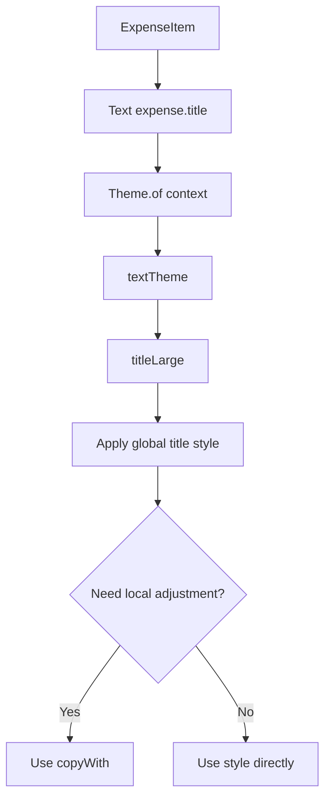
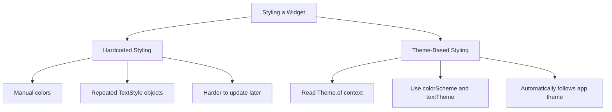

# Using Theme Data in Widgets

## Overview

This lesson explains how to use theme data inside Flutter widgets.

After defining a global theme in `main.dart`, custom widgets can read colors, text styles, and component settings from that theme by using:

```dart id="3lpm99"
Theme.of(context)
```

This allows widgets to follow the app's design system instead of hardcoding colors and text styles manually.

In this lecture, we apply theme data to:

* Expense item titles
* Dismissible delete backgrounds
* Card margins
* Theme-based color adjustments

---

## Why Use Theme Data Inside Widgets?

A global theme is useful because it gives the app one central place for design values.

However, custom widgets still need to access those values.

For example, instead of writing this:

```dart id="94ugx6"
Text(
  expense.title,
  style: const TextStyle(
    fontWeight: FontWeight.bold,
    fontSize: 16,
    color: Colors.red,
  ),
)
```

we can write this:

```dart id="dw0rhs"
Text(
  expense.title,
  style: Theme.of(context).textTheme.titleLarge,
)
```

Now the widget uses the app's global text theme.

If the theme changes later, this widget updates automatically.

---

## What `Theme.of(context)` Does

`Theme.of(context)` gives access to the nearest active `ThemeData` object in the widget tree.

```dart id="69023y"
Theme.of(context)
```

From there, you can access:

```dart id="lf3ouo"
Theme.of(context).colorScheme
Theme.of(context).textTheme
Theme.of(context).cardTheme
Theme.of(context).appBarTheme
```

This lets custom widgets use the same design settings as the rest of the app.

---

## Step 1: Use Text Theme in `ExpenseItem`

In `expense_item.dart`, the expense title can use the app's `titleLarge` text style.

```dart id="fhz3qu"
Text(
  expense.title,
  style: Theme.of(context).textTheme.titleLarge,
)
```

This applies the global text style defined in `main.dart`.

For example, if `titleLarge` was configured like this:

```dart id="wucc5h"
textTheme: ThemeData().textTheme.copyWith(
  titleLarge: TextStyle(
    fontWeight: FontWeight.bold,
    color: kColorScheme.onSecondaryContainer,
    fontSize: 16,
  ),
),
```

then `expense.title` will use that style.

---

## Example: Expense Title with Theme Style

```dart id="93bigq"
class ExpenseItem extends StatelessWidget {
  const ExpenseItem(this.expense, {super.key});

  final Expense expense;

  @override
  Widget build(BuildContext context) {
    return Card(
      child: Padding(
        padding: const EdgeInsets.symmetric(
          horizontal: 20,
          vertical: 16,
        ),
        child: Column(
          crossAxisAlignment: CrossAxisAlignment.start,
          children: [
            Text(
              expense.title,
              style: Theme.of(context).textTheme.titleLarge,
            ),
            const SizedBox(height: 4),
            Text(
              '\$${expense.amount.toStringAsFixed(2)}',
            ),
          ],
        ),
      ),
    );
  }
}
```

---

## Step 2: Align Column Children to the Start

The expense title should be aligned to the left side of the card.

Since the title is inside a `Column`, we can set:

```dart id="23rp9e"
crossAxisAlignment: CrossAxisAlignment.start,
```

For a `Column`, the cross axis is horizontal.

So this moves the children to the start of the horizontal axis.

```dart id="xxuj7o"
Column(
  crossAxisAlignment: CrossAxisAlignment.start,
  children: [
    Text(
      expense.title,
      style: Theme.of(context).textTheme.titleLarge,
    ),
    const SizedBox(height: 4),
    Text(
      '\$${expense.amount.toStringAsFixed(2)}',
    ),
  ],
)
```

---

## Step 3: Use Theme Color for Icons

The expense item also displays a category icon.

Instead of using a hardcoded icon color, we can use the active color scheme.

```dart id="ey5p4g"
Icon(
  categoryIcons[expense.category],
  color: Theme.of(context).colorScheme.primary,
)
```

This makes the icon color follow the app theme.

---

## Full `ExpenseItem` Example

```dart id="b1c5om"
class ExpenseItem extends StatelessWidget {
  const ExpenseItem(this.expense, {super.key});

  final Expense expense;

  @override
  Widget build(BuildContext context) {
    return Card(
      child: Padding(
        padding: const EdgeInsets.symmetric(
          horizontal: 20,
          vertical: 16,
        ),
        child: Column(
          crossAxisAlignment: CrossAxisAlignment.start,
          children: [
            Text(
              expense.title,
              style: Theme.of(context).textTheme.titleLarge,
            ),
            const SizedBox(height: 4),
            Row(
              children: [
                Text(
                  '\$${expense.amount.toStringAsFixed(2)}',
                ),
                const Spacer(),
                Row(
                  children: [
                    Icon(
                      categoryIcons[expense.category],
                      color: Theme.of(context).colorScheme.primary,
                    ),
                    const SizedBox(width: 8),
                    Text(expense.formattedDate),
                  ],
                ),
              ],
            ),
          ],
        ),
      ),
    );
  }
}
```

---

## Step 4: Add a Themed Background to `Dismissible`

In `expenses_list.dart`, the `Dismissible` widget can show a background when the user swipes an item away.

```dart id="7w1vhh"
background: Container(
  color: Theme.of(context).colorScheme.error,
)
```

This uses the theme's `error` color.

That is better than hardcoding a red color because the theme decides what the error color should be.

---

## Example: Dismissible Background

```dart id="buuo64"
Dismissible(
  key: ValueKey(expense.id),
  background: Container(
    color: Theme.of(context).colorScheme.error,
  ),
  onDismissed: (direction) {
    onRemoveExpense(expense);
  },
  child: ExpenseItem(expense),
)
```

Now, when the user swipes the item, the red error-colored background appears behind it.

---

## Step 5: Add a Delete Icon

The background can also contain an icon.

```dart id="tb7r07"
background: Container(
  color: Theme.of(context).colorScheme.error,
  child: Icon(
    Icons.delete,
    color: Theme.of(context).colorScheme.onError,
    size: 40,
  ),
)
```

The icon uses:

```dart id="213kin"
colorScheme.onError
```

because it is displayed on top of:

```dart id="4hgzj3"
colorScheme.error
```

This follows the Material color pairing pattern.

---

## Step 6: Match the Card Margin

The delete background should line up with the card.

A simple version would be:

```dart id="dyanyw"
margin: const EdgeInsets.symmetric(horizontal: 16),
```

But this repeats the same margin value that is already defined in the theme.

If the card margin changes later, we would also have to update this value manually.

Instead, we can read the card margin from the theme.

```dart id="7f2vba"
margin: EdgeInsets.symmetric(
  horizontal: Theme.of(context).cardTheme.margin!.horizontal,
),
```

The `!` is used because `margin` can technically be `null`.

In this app, we know it was configured in the theme, so we assert that it is not null.

---

## Dismissible with Themed Background and Margin

```dart id="ikznxr"
Dismissible(
  key: ValueKey(expense.id),
  background: Container(
    color: Theme.of(context).colorScheme.error,
    margin: EdgeInsets.symmetric(
      horizontal: Theme.of(context).cardTheme.margin!.horizontal,
    ),
    child: Icon(
      Icons.delete,
      color: Theme.of(context).colorScheme.onError,
      size: 40,
    ),
  ),
  onDismissed: (direction) {
    onRemoveExpense(expense);
  },
  child: ExpenseItem(expense),
)
```

---

## Step 7: Fine-Tune Theme Colors Locally

Using theme values does not mean you must use them exactly as they are.

You can still adjust them locally.

For example, older course code may use:

```dart id="haxpef"
Theme.of(context).colorScheme.error.withOpacity(0.75)
```

This makes the error color slightly transparent.

In newer Flutter versions, prefer:

```dart id="fgt46k"
Theme.of(context).colorScheme.error.withValues(alpha: 0.75)
```

This creates a similar effect while following the newer API recommendation.

---

## Example with Transparent Error Background

```dart id="khjoc9"
background: Container(
  color: Theme.of(context).colorScheme.error.withValues(alpha: 0.75),
  margin: EdgeInsets.symmetric(
    horizontal: Theme.of(context).cardTheme.margin!.horizontal,
  ),
  child: Icon(
    Icons.delete,
    color: Theme.of(context).colorScheme.onError,
    size: 40,
  ),
)
```

If your Flutter SDK does not support `withValues()` yet, use the course version:

```dart id="d70oja"
background: Container(
  color: Theme.of(context).colorScheme.error.withOpacity(0.75),
)
```

---

## Step 8: Fine-Tune Text Styles Locally

You can also start with a global text style and adjust it only inside one widget.

```dart id="wwor8x"
Text(
  expense.title,
  style: Theme.of(context).textTheme.titleLarge!.copyWith(
        fontSize: 18,
      ),
)
```

This means:

1. Start with the global `titleLarge` style.
2. Override only the `fontSize`.
3. Keep the rest of the global style.

---

## Why Use `copyWith()` on Text Styles?

This is useful when a widget should mostly follow the global style but needs a small local adjustment.

Example:

```dart id="ab4a04"
style: Theme.of(context).textTheme.titleLarge!.copyWith(
      color: Theme.of(context).colorScheme.primary,
    ),
```

This keeps the font weight and size from the theme but changes the color only for this specific widget.

---

## Full `ExpensesList` Example

```dart id="6wi2cl"
class ExpensesList extends StatelessWidget {
  const ExpensesList({
    super.key,
    required this.expenses,
    required this.onRemoveExpense,
  });

  final List<Expense> expenses;
  final void Function(Expense expense) onRemoveExpense;

  @override
  Widget build(BuildContext context) {
    return ListView.builder(
      itemCount: expenses.length,
      itemBuilder: (ctx, index) {
        final expense = expenses[index];

        return Dismissible(
          key: ValueKey(expense.id),
          background: Container(
            color: Theme.of(context).colorScheme.error.withValues(alpha: 0.75),
            margin: EdgeInsets.symmetric(
              horizontal: Theme.of(context).cardTheme.margin!.horizontal,
            ),
            child: Icon(
              Icons.delete,
              color: Theme.of(context).colorScheme.onError,
              size: 40,
            ),
          ),
          onDismissed: (direction) {
            onRemoveExpense(expense);
          },
          child: ExpenseItem(expense),
        );
      },
    );
  }
}
```

---

## Important Theme Access Patterns

| Theme Access                             | Purpose                                  |
| ---------------------------------------- | ---------------------------------------- |
| `Theme.of(context)`                      | Gets the active theme                    |
| `Theme.of(context).colorScheme`          | Gets theme colors                        |
| `Theme.of(context).textTheme`            | Gets theme text styles                   |
| `Theme.of(context).cardTheme`            | Gets card styling                        |
| `Theme.of(context).colorScheme.error`    | Gets error color                         |
| `Theme.of(context).colorScheme.onError`  | Gets readable color for error background |
| `Theme.of(context).textTheme.titleLarge` | Gets title text style                    |
| `copyWith()`                             | Locally modifies a theme value           |

---

## Color Pairing Pattern

When using a color scheme, pair background colors with their matching `on...` colors.

| Background Color     | Foreground Color       |
| -------------------- | ---------------------- |
| `primary`            | `onPrimary`            |
| `primaryContainer`   | `onPrimaryContainer`   |
| `secondary`          | `onSecondary`          |
| `secondaryContainer` | `onSecondaryContainer` |
| `error`              | `onError`              |
| `surface`            | `onSurface`            |

Example:

```dart id="2va40q"
Container(
  color: Theme.of(context).colorScheme.error,
  child: Icon(
    Icons.delete,
    color: Theme.of(context).colorScheme.onError,
  ),
)
```

This helps preserve readable contrast.

---

## Theme Data Flow Diagram



---

## Widget Theme Lookup Diagram



---

## Dismissible Theme Usage Diagram



---

## Text Theme Usage Diagram



---

## Hardcoded Styling vs Theme-Based Styling



---

## Common Mistakes

### Mistake 1: Hardcoding Theme Colors

Avoid this:

```dart id="2zqbem"
color: Colors.red
```

Prefer this:

```dart id="a00mgw"
color: Theme.of(context).colorScheme.error
```

---

### Mistake 2: Repeating Margins Already Defined in Theme

Avoid this:

```dart id="bncrhi"
margin: const EdgeInsets.symmetric(horizontal: 16)
```

If that margin already comes from the card theme, prefer:

```dart id="syapja"
margin: EdgeInsets.symmetric(
  horizontal: Theme.of(context).cardTheme.margin!.horizontal,
)
```

---

### Mistake 3: Rewriting a Full TextStyle

Avoid this:

```dart id="xs20o7"
style: const TextStyle(
  fontWeight: FontWeight.bold,
  fontSize: 16,
)
```

Prefer this:

```dart id="9nzf2q"
style: Theme.of(context).textTheme.titleLarge
```

Or, for local changes:

```dart id="kv4jnw"
style: Theme.of(context).textTheme.titleLarge!.copyWith(
      fontSize: 18,
    )
```

---

## Key Takeaways

* Use `Theme.of(context)` to access the active app theme.
* Use `Theme.of(context).textTheme` for global text styles.
* Use `Theme.of(context).colorScheme` for theme colors.
* Use `Theme.of(context).cardTheme` to read card-specific theme values.
* Prefer theme values over hardcoded colors and text styles.
* Use matching `on...` colors for text and icons placed on colored backgrounds.
* Use `copyWith()` when you want to keep a theme style but adjust it locally.
* Theme-based widgets automatically adapt when the app theme changes.

---

## Summary

This lesson shows how to consume theme data inside custom widgets.

Instead of manually styling `ExpenseItem` and `Dismissible`, we read values from the app theme using `Theme.of(context)`.

The expense title uses `Theme.of(context).textTheme.titleLarge`, the category icon uses `Theme.of(context).colorScheme.primary`, and the delete background uses `Theme.of(context).colorScheme.error`.

This approach keeps the app visually consistent and easier to maintain because widgets automatically follow the global theme.
