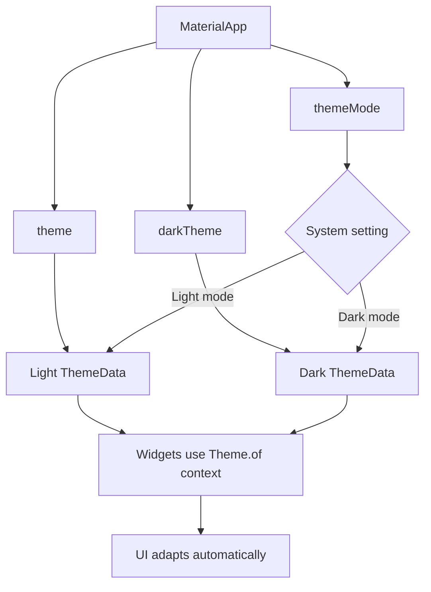
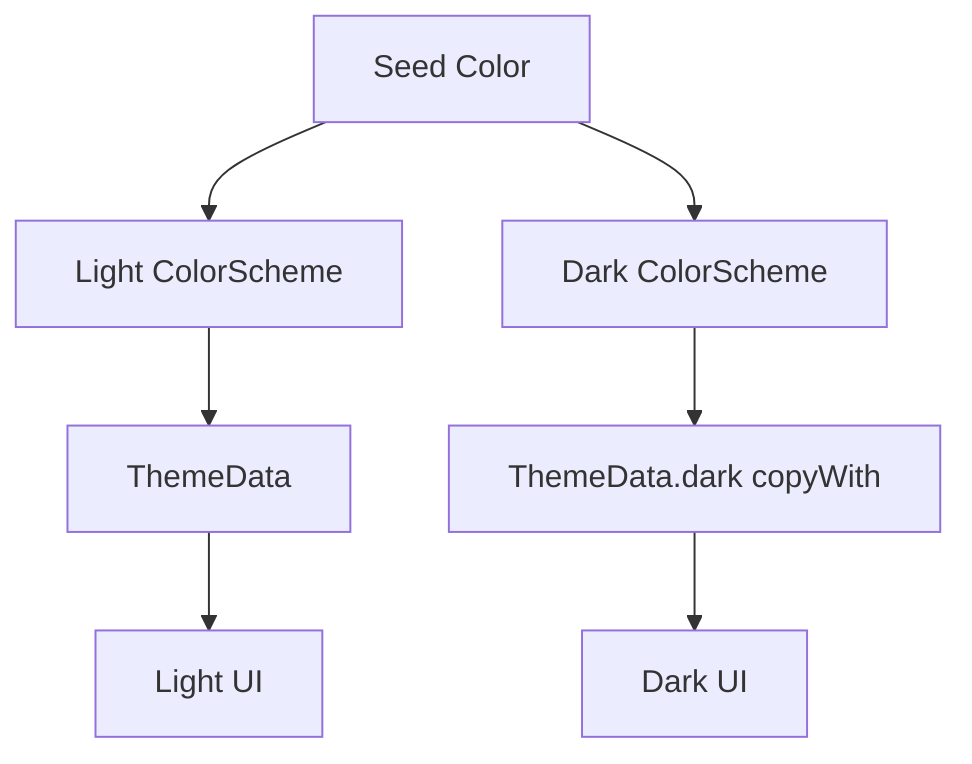
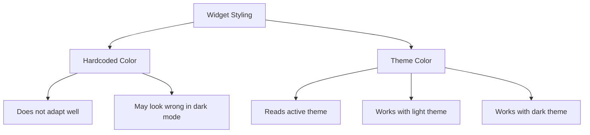

# Important: Adding Dark Mode

## Overview

This lecture is an important preparation note before implementing dark mode in the Expense Tracker app.

Dark mode support is not just about making the background black. A proper dark theme requires a separate dark color scheme and consistent use of theme values throughout the app.

If widgets use hardcoded colors, they may not adapt correctly when the app switches between light mode and dark mode.

---

## Why This Note Matters

In the next lecture, the app will receive dark mode support.

However, there are two important modern Flutter updates to keep in mind:

1. `useMaterial3: true` is usually no longer needed.
2. Dark theme customization should be added with `ThemeData.dark().copyWith(...)`.

Older course code may still show `useMaterial3: true`, but in modern Flutter versions, Material 3 is already the default.

---

## Light Theme vs Dark Theme

Flutter allows us to define two separate themes:

```dart
theme: lightTheme,
darkTheme: darkTheme,
```

The `theme` property is used for light mode.

The `darkTheme` property is used for dark mode.

Flutter can automatically choose between them based on the user's system setting.

---

## Basic Structure

```dart
MaterialApp(
  theme: ThemeData().copyWith(
    colorScheme: kColorScheme,
  ),
  darkTheme: ThemeData.dark().copyWith(
    colorScheme: kDarkColorScheme,
  ),
  home: const Expenses(),
)
```

This gives the app both a light theme and a dark theme.

---

## Step 1: Define a Light Color Scheme

The light color scheme can be generated from a seed color.

```dart
final kColorScheme = ColorScheme.fromSeed(
  seedColor: const Color.fromARGB(255, 96, 59, 181),
);
```

This creates a full Material color scheme for light mode.

---

## Step 2: Define a Dark Color Scheme

For dark mode, create another color scheme using the same seed color but with dark brightness.

```dart
final kDarkColorScheme = ColorScheme.fromSeed(
  brightness: Brightness.dark,
  seedColor: const Color.fromARGB(255, 96, 59, 181),
);
```

Using the same seed color keeps the app identity consistent.

Adding:

```dart
brightness: Brightness.dark
```

tells Flutter to generate colors suitable for dark mode.

---

## Step 3: Add `darkTheme` to `MaterialApp`

The dark theme is added through the `darkTheme` property.

```dart
MaterialApp(
  theme: ThemeData().copyWith(
    colorScheme: kColorScheme,
  ),
  darkTheme: ThemeData.dark().copyWith(
    colorScheme: kDarkColorScheme,
  ),
  home: const Expenses(),
)
```

This prepares the app to support both light and dark appearances.

---

## Important Modern Flutter Update

Older code might look like this:

```dart
ThemeData.dark(
  useMaterial3: true,
  colorScheme: kDarkColorScheme,
  cardTheme: CardTheme(
    color: kDarkColorScheme.secondaryContainer,
  ),
)
```

In modern Flutter, prefer this:

```dart
ThemeData.dark().copyWith(
  colorScheme: kDarkColorScheme,
  cardTheme: CardTheme(
    color: kDarkColorScheme.secondaryContainer,
  ),
)
```

The idea is:

1. Start with Flutter's default dark theme.
2. Use `.copyWith(...)` to override only the settings you need.

---

## About `useMaterial3`

In older Flutter versions, you may see this:

```dart
useMaterial3: true,
```

In newer Flutter versions, Material 3 is already enabled by default.

So this can usually be skipped:

```dart
useMaterial3: true
```

The rest of the theme code remains the same.

---

## Step 4: Use Theme Colors Everywhere

Dark mode only works well if widgets read colors from the active theme.

Good:

```dart
color: Theme.of(context).colorScheme.primary
```

Good:

```dart
color: Theme.of(context).colorScheme.error
```

Good:

```dart
style: Theme.of(context).textTheme.titleLarge
```

Avoid hardcoded colors like this:

```dart
color: Colors.red
```

or:

```dart
color: const Color.fromARGB(255, 96, 59, 181)
```

Hardcoded colors do not automatically adapt when the app switches to dark mode.

---

## Why Hardcoded Colors Are a Problem

Suppose a widget uses this:

```dart
Container(
  color: Colors.white,
)
```

That might look fine in light mode.

But in dark mode, it may still stay white, which can make the UI look broken.

Instead, use a theme color:

```dart
Container(
  color: Theme.of(context).colorScheme.surface,
)
```

Now the container can adapt to the active theme.

---

## Full Example

```dart
import 'package:flutter/material.dart';

import 'widgets/expenses.dart';

final kColorScheme = ColorScheme.fromSeed(
  seedColor: const Color.fromARGB(255, 96, 59, 181),
);

final kDarkColorScheme = ColorScheme.fromSeed(
  brightness: Brightness.dark,
  seedColor: const Color.fromARGB(255, 96, 59, 181),
);

void main() {
  runApp(
    MaterialApp(
      theme: ThemeData().copyWith(
        colorScheme: kColorScheme,
        appBarTheme: const AppBarTheme().copyWith(
          backgroundColor: kColorScheme.onPrimaryContainer,
          foregroundColor: kColorScheme.primaryContainer,
        ),
        cardTheme: CardTheme(
          color: kColorScheme.secondaryContainer,
          margin: const EdgeInsets.symmetric(
            horizontal: 16,
            vertical: 8,
          ),
        ),
      ),
      darkTheme: ThemeData.dark().copyWith(
        colorScheme: kDarkColorScheme,
        cardTheme: CardTheme(
          color: kDarkColorScheme.secondaryContainer,
          margin: const EdgeInsets.symmetric(
            horizontal: 16,
            vertical: 8,
          ),
        ),
      ),
      home: const Expenses(),
    ),
  );
}
```

---

## Optional: Control Theme Mode Manually

By default, Flutter can follow the system setting.

You can also explicitly set `themeMode`.

```dart
themeMode: ThemeMode.system,
```

This means:

> Use light mode when the device is in light mode, and dark mode when the device is in dark mode.

You can also force a specific mode:

```dart
themeMode: ThemeMode.light,
```

or:

```dart
themeMode: ThemeMode.dark,
```

For most apps, `ThemeMode.system` is the best default.

---

## Full Example with `themeMode`

```dart
MaterialApp(
  themeMode: ThemeMode.system,
  theme: ThemeData().copyWith(
    colorScheme: kColorScheme,
  ),
  darkTheme: ThemeData.dark().copyWith(
    colorScheme: kDarkColorScheme,
  ),
  home: const Expenses(),
)
```

---

## Dark Mode Preparation Checklist

Before implementing dark mode, check the app for hardcoded styles.

| Check             | Good Practice                                                   |
| ----------------- | --------------------------------------------------------------- |
| Text colors       | Use `Theme.of(context).textTheme`                               |
| Icon colors       | Use `Theme.of(context).colorScheme`                             |
| Background colors | Use `colorScheme.surface`, `surfaceContainer`, or related roles |
| Error colors      | Use `colorScheme.error` and `colorScheme.onError`               |
| Card colors       | Configure `cardTheme`                                           |
| Button colors     | Configure button themes or use color scheme roles               |

---

## Theme-Aware Widget Example

```dart
Icon(
  Icons.delete,
  color: Theme.of(context).colorScheme.onError,
)
```

```dart
Container(
  color: Theme.of(context).colorScheme.error,
)
```

```dart
Text(
  expense.title,
  style: Theme.of(context).textTheme.titleLarge,
)
```

These widgets will adapt better when switching between light and dark themes.

---

## Dark Mode Flow Diagram



---

## Color Scheme Diagram



---

## Hardcoded Colors vs Theme Colors



---

## Correct Update from Course Code

### Older Course Style

```dart
ThemeData.dark(
  useMaterial3: true,
  colorScheme: kDarkColorScheme,
  cardTheme: CardTheme(
    color: kDarkColorScheme.secondaryContainer,
  ),
)
```

### Modern Style

```dart
ThemeData.dark().copyWith(
  colorScheme: kDarkColorScheme,
  cardTheme: CardTheme(
    color: kDarkColorScheme.secondaryContainer,
  ),
)
```

### Even Cleaner in Modern Flutter

```dart
ThemeData.dark().copyWith(
  colorScheme: kDarkColorScheme,
)
```

Only add extra component themes when you actually need to override them.

---

## Key Takeaways

* Dark mode requires a separate `darkTheme`.
* Use `ColorScheme.fromSeed` with `brightness: Brightness.dark` for the dark color scheme.
* Use `ThemeData.dark().copyWith(...)` to configure the dark theme.
* `useMaterial3: true` is usually unnecessary in modern Flutter.
* Widgets should use `Theme.of(context)` instead of hardcoded colors.
* `themeMode: ThemeMode.system` allows the app to follow the device setting.
* Dark mode works best when all colors come from `colorScheme`.

---

## Summary

This lecture prepares the app for dark mode.

The main idea is to define a separate dark color scheme and assign it to the `darkTheme` property of `MaterialApp`.

Modern Flutter code should use `ThemeData.dark().copyWith(...)` for dark theme customization. Since Material 3 is now the default, `useMaterial3: true` can usually be skipped.

Most importantly, widgets must use theme colors through `Theme.of(context)` so they can automatically adapt when the app switches between light and dark mode.
