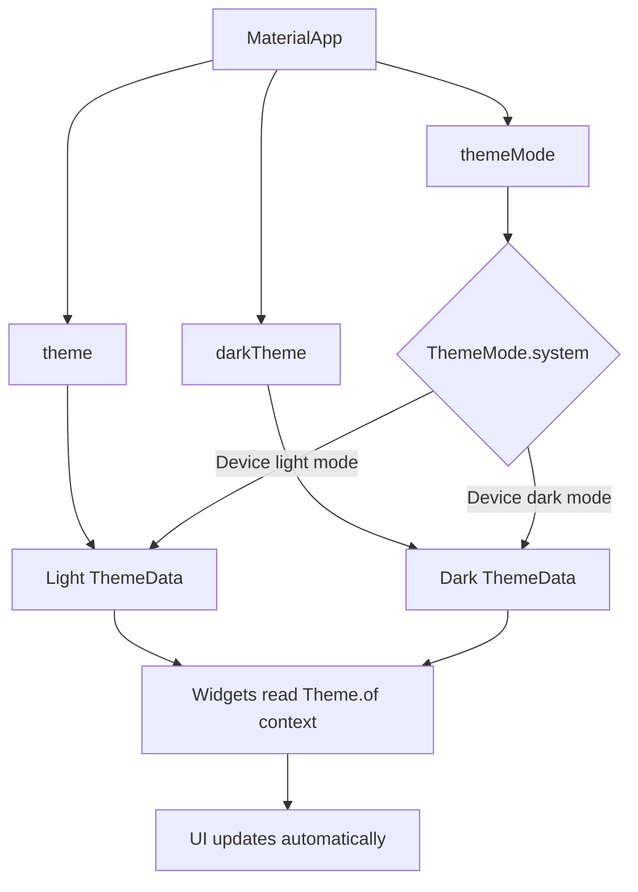
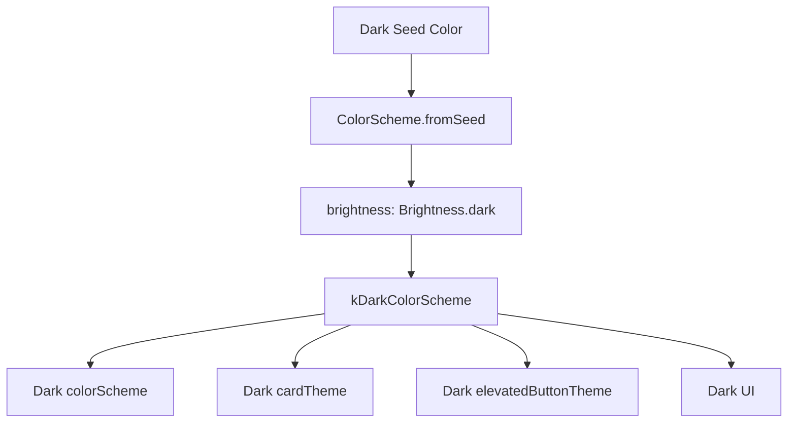
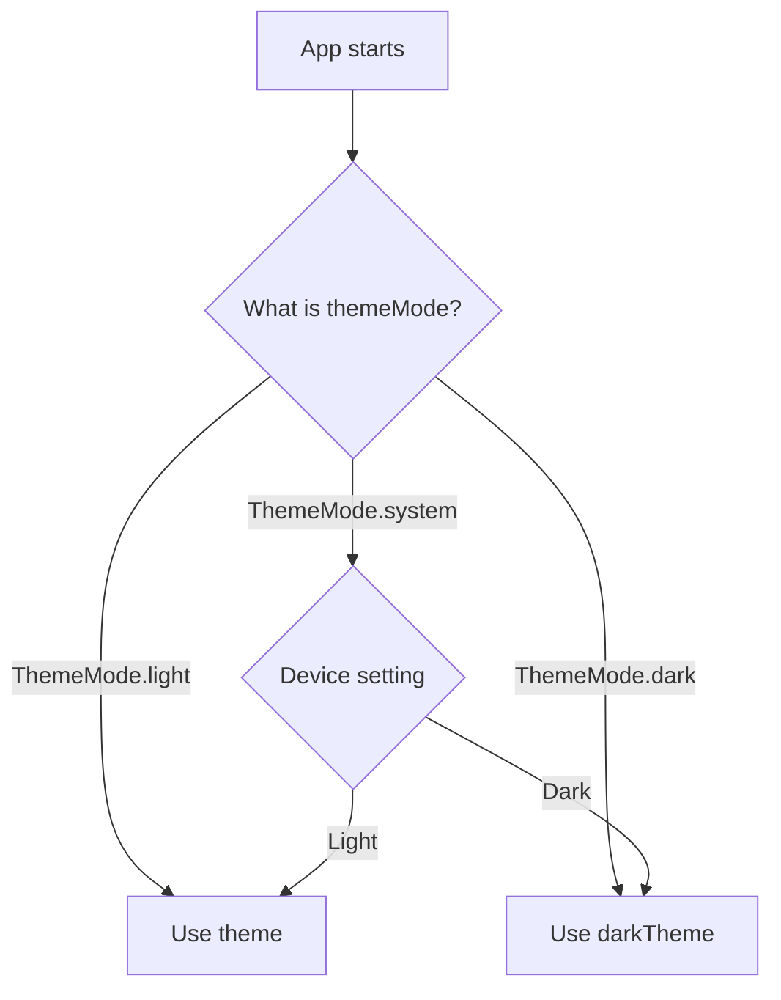
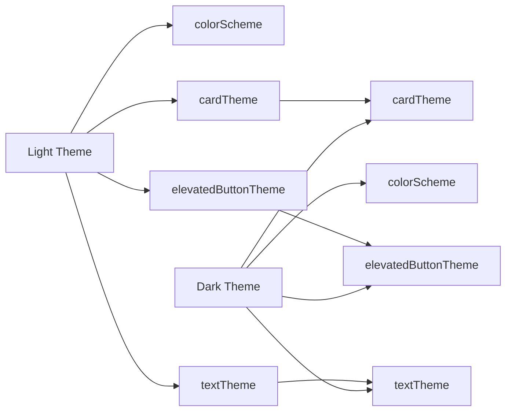

# Adding Dark Mode

## Overview

This lesson explains how to add full dark mode support to the Expense Tracker app.

At this point, the app already has a light theme. However, some users may prefer dark mode, and some users may have dark mode enabled at the system level on their device.

Flutter allows us to provide both a light theme and a dark theme. The app can then automatically switch between them based on the user's system settings.

---

## Why Add Dark Mode?

Dark mode improves the user experience for users who prefer darker interfaces.

It can be useful because:

* It is easier on the eyes in low-light environments.
* It matches the user's device setting.
* It gives the app a more polished and modern feel.
* It improves accessibility for some users.
* It allows the app to feel native on both Android and iOS.

---

## The Main Idea

To add dark mode, we need two themes:

```dart id="lj1rya"
theme: lightTheme,
darkTheme: darkTheme,
```

The `theme` property is used for light mode.

The `darkTheme` property is used for dark mode.

Flutter can automatically choose the correct theme based on the device setting.

---

## Step 1: Define the Light Color Scheme

The app already has a light color scheme.

```dart id="tcaai2"
final kColorScheme = ColorScheme.fromSeed(
  seedColor: const Color.fromARGB(255, 96, 59, 181),
);
```

This creates a Material color scheme from one seed color.

Flutter then generates related colors such as:

* `primary`
* `primaryContainer`
* `secondaryContainer`
* `surface`
* `error`
* `onPrimary`
* `onSurface`

---

## Step 2: Define the Dark Color Scheme

For dark mode, create a second color scheme.

```dart id="lctxy5"
final kDarkColorScheme = ColorScheme.fromSeed(
  brightness: Brightness.dark,
  seedColor: const Color.fromARGB(255, 5, 99, 125),
);
```

The important part is:

```dart id="fcn0hj"
brightness: Brightness.dark
```

This tells Flutter to generate color roles that are suitable for dark mode.

Without this setting, the generated colors may still look like light-mode colors.

---

## Why `Brightness.dark` Is Important

`ColorScheme.fromSeed` generates many color variations from a seed color.

If we do not specify dark brightness, the generated colors may not look good on a dark background.

This version is better for dark mode:

```dart id="ti2y8v"
ColorScheme.fromSeed(
  brightness: Brightness.dark,
  seedColor: const Color.fromARGB(255, 5, 99, 125),
)
```

It creates a color scheme optimized for darker surfaces and lighter foreground text.

---

## Step 3: Add `darkTheme` to `MaterialApp`

Now add the dark theme to `MaterialApp`.

```dart id="58gnsx"
MaterialApp(
  theme: ThemeData().copyWith(
    colorScheme: kColorScheme,
  ),
  darkTheme: ThemeData.dark().copyWith(
    colorScheme: kDarkColorScheme,
  ),
  home: const Expenses(),
)
```

`ThemeData.dark()` gives us a base dark theme.

Then `.copyWith(...)` lets us override selected settings.

---

## Modern Flutter Note

Older course code may show this:

```dart id="8tosqg"
ThemeData.dark(
  useMaterial3: true,
  colorScheme: kDarkColorScheme,
)
```

In modern Flutter, prefer this:

```dart id="xq2qb3"
ThemeData.dark().copyWith(
  colorScheme: kDarkColorScheme,
)
```

Also, `useMaterial3: true` is usually not needed anymore because Material 3 is enabled by default in current Flutter versions. Flutter docs describe `useMaterial3` as true by default and as a temporary opt-out flag.

---

## Step 4: Understand `themeMode`

`themeMode` controls which theme Flutter uses.

```dart id="ufibt4"
themeMode: ThemeMode.system,
```

This means:

> Use the system setting.

If the user's device is in light mode, Flutter uses:

```dart id="tzvld6"
theme
```

If the user's device is in dark mode, Flutter uses:

```dart id="yr2qpt"
darkTheme
```

---

## `themeMode` Options

Flutter provides three main theme mode options.

| ThemeMode          | Meaning                          |
| ------------------ | -------------------------------- |
| `ThemeMode.system` | Follow the device system setting |
| `ThemeMode.light`  | Always use the light theme       |
| `ThemeMode.dark`   | Always use the dark theme        |

For most apps, this is best:

```dart id="rjplg5"
themeMode: ThemeMode.system,
```

However, this is also the default behavior, so you do not always need to set it manually.

---

## Step 5: Copy Important Component Themes

If the light theme defines component themes, the dark theme may need matching versions.

For example, the light theme might define a card theme:

```dart id="n9ccjg"
cardTheme: CardTheme(
  color: kColorScheme.secondaryContainer,
  margin: const EdgeInsets.symmetric(
    horizontal: 16,
    vertical: 8,
  ),
),
```

If your widgets depend on this card theme, you should also define it in the dark theme.

```dart id="hk9cpd"
cardTheme: CardTheme(
  color: kDarkColorScheme.secondaryContainer,
  margin: const EdgeInsets.symmetric(
    horizontal: 16,
    vertical: 8,
  ),
),
```

---

## Why This Matters

In the expense app, the `Dismissible` background may read the card margin from the theme.

```dart id="l2jt0z"
Theme.of(context).cardTheme.margin!.horizontal
```

If the dark theme does not define `cardTheme.margin`, this value can be `null`.

That can cause an error.

So if your widgets depend on a theme value, make sure that value exists in both the light and dark themes.

---

## Safer Alternative for Nullable Theme Values

Instead of using `!`, you can provide a fallback.

```dart id="o1o3cz"
final cardMargin = Theme.of(context).cardTheme.margin;

final horizontalMargin = cardMargin == null ? 16.0 : cardMargin.horizontal;
```

Then use:

```dart id="rmkwcx"
margin: EdgeInsets.symmetric(
  horizontal: horizontalMargin,
),
```

This avoids runtime errors if the theme value is missing.

---

## Step 6: Customize Dark Cards

The dark theme should use the dark color scheme.

Avoid this inside the dark theme:

```dart id="rozzjk"
color: kColorScheme.secondaryContainer
```

That uses the light color scheme.

Use this instead:

```dart id="79fn0m"
color: kDarkColorScheme.secondaryContainer
```

Full example:

```dart id="amb4wm"
cardTheme: CardTheme(
  color: kDarkColorScheme.secondaryContainer,
  margin: const EdgeInsets.symmetric(
    horizontal: 16,
    vertical: 8,
  ),
),
```

---

## Step 7: Customize Dark Elevated Buttons

The dark theme can also define an elevated button theme.

```dart id="u9bezb"
elevatedButtonTheme: ElevatedButtonThemeData(
  style: ElevatedButton.styleFrom(
    backgroundColor: kDarkColorScheme.primaryContainer,
    foregroundColor: kDarkColorScheme.onPrimaryContainer,
  ),
),
```

The background color uses:

```dart id="s8o7v4"
primaryContainer
```

The text and icon color use:

```dart id="y7462x"
onPrimaryContainer
```

This follows the Material color pairing pattern.

---

## Step 8: Keep Light and Dark Themes Consistent

Your light and dark themes do not need to be identical, but they should define similar categories of styling.

For example, if the light theme defines:

* `colorScheme`
* `appBarTheme`
* `cardTheme`
* `elevatedButtonTheme`
* `textTheme`

then the dark theme may also need matching definitions.

This keeps the app visually consistent in both modes.

---

## Full Example

```dart id="m2pi0r"
import 'package:flutter/material.dart';

import 'widgets/expenses.dart';

final kColorScheme = ColorScheme.fromSeed(
  seedColor: const Color.fromARGB(255, 96, 59, 181),
);

final kDarkColorScheme = ColorScheme.fromSeed(
  brightness: Brightness.dark,
  seedColor: const Color.fromARGB(255, 5, 99, 125),
);

void main() {
  runApp(
    MaterialApp(
      title: 'Expense Tracker',

      theme: ThemeData().copyWith(
        colorScheme: kColorScheme,
        appBarTheme: const AppBarTheme().copyWith(
          backgroundColor: kColorScheme.onPrimaryContainer,
          foregroundColor: kColorScheme.primaryContainer,
        ),
        cardTheme: CardTheme(
          color: kColorScheme.secondaryContainer,
          margin: const EdgeInsets.symmetric(
            horizontal: 16,
            vertical: 8,
          ),
        ),
        elevatedButtonTheme: ElevatedButtonThemeData(
          style: ElevatedButton.styleFrom(
            backgroundColor: kColorScheme.primaryContainer,
            foregroundColor: kColorScheme.onPrimaryContainer,
          ),
        ),
        textTheme: ThemeData().textTheme.copyWith(
          titleLarge: TextStyle(
            fontWeight: FontWeight.bold,
            color: kColorScheme.onSecondaryContainer,
            fontSize: 16,
          ),
        ),
      ),

      darkTheme: ThemeData.dark().copyWith(
        colorScheme: kDarkColorScheme,
        cardTheme: CardTheme(
          color: kDarkColorScheme.secondaryContainer,
          margin: const EdgeInsets.symmetric(
            horizontal: 16,
            vertical: 8,
          ),
        ),
        elevatedButtonTheme: ElevatedButtonThemeData(
          style: ElevatedButton.styleFrom(
            backgroundColor: kDarkColorScheme.primaryContainer,
            foregroundColor: kDarkColorScheme.onPrimaryContainer,
          ),
        ),
      ),

      themeMode: ThemeMode.system,

      home: const Expenses(),
    ),
  );
}
```

---

## Note About `themeMode`

The following line is optional because `ThemeMode.system` is the default behavior.

```dart id="pauf09"
themeMode: ThemeMode.system,
```

However, adding it can make the code clearer for learning purposes.

It clearly communicates that the app should follow the device setting.

---

## Testing Dark Mode

You can test dark mode by changing the device or emulator theme.

### Android

Go to system settings and enable dark theme.

### iOS

Go to Display & Brightness and switch to Dark.

### Flutter DevTools

You can also use Flutter DevTools or emulator controls to test platform brightness changes.

---

## Common Dark Mode Mistakes

### Mistake 1: Forgetting `brightness: Brightness.dark`

Avoid this:

```dart id="zoxsql"
final kDarkColorScheme = ColorScheme.fromSeed(
  seedColor: const Color.fromARGB(255, 5, 99, 125),
);
```

Prefer this:

```dart id="ayal9z"
final kDarkColorScheme = ColorScheme.fromSeed(
  brightness: Brightness.dark,
  seedColor: const Color.fromARGB(255, 5, 99, 125),
);
```

---

### Mistake 2: Using Light Color Scheme in Dark Theme

Avoid this:

```dart id="5bc64j"
darkTheme: ThemeData.dark().copyWith(
  cardTheme: CardTheme(
    color: kColorScheme.secondaryContainer,
  ),
)
```

Prefer this:

```dart id="ukpi0p"
darkTheme: ThemeData.dark().copyWith(
  cardTheme: CardTheme(
    color: kDarkColorScheme.secondaryContainer,
  ),
)
```

---

### Mistake 3: Depending on a Theme Value That Is Missing

This can cause an error if `margin` is null:

```dart id="bowknk"
Theme.of(context).cardTheme.margin!.horizontal
```

Make sure the margin exists in both themes, or use a fallback.

---

### Mistake 4: Hardcoding Colors in Widgets

Avoid this:

```dart id="hi3tko"
color: Colors.white
```

Prefer this:

```dart id="7esjza"
color: Theme.of(context).colorScheme.surface
```

Hardcoded colors may look wrong when the app switches to dark mode.

---

## Light and Dark Theme Flow Diagram



---

## Dark Color Scheme Diagram



---

## Theme Selection Diagram



---

## Component Theme Consistency Diagram



---

## Important APIs

| API                           | Purpose                                               |
| ----------------------------- | ----------------------------------------------------- |
| `darkTheme`                   | Defines the app's dark theme                          |
| `theme`                       | Defines the app's light/default theme                 |
| `themeMode`                   | Controls whether light, dark, or system theme is used |
| `ThemeMode.system`            | Follows the user's device setting                     |
| `ThemeData.dark()`            | Creates a base dark theme                             |
| `.copyWith(...)`              | Overrides selected theme settings                     |
| `ColorScheme.fromSeed(...)`   | Generates a Material color scheme                     |
| `brightness: Brightness.dark` | Generates colors suitable for dark mode               |
| `kDarkColorScheme`            | Stores the dark mode color scheme                     |

---

## Key Takeaways

* Add dark mode with the `darkTheme` property of `MaterialApp`.
* Create a separate `kDarkColorScheme`.
* Use `brightness: Brightness.dark` when generating the dark color scheme.
* Use `ThemeData.dark().copyWith(...)` for modern dark theme setup.
* `ThemeMode.system` makes the app follow the device setting.
* Use dark theme color values inside dark component themes.
* If a widget reads a theme value, make sure that value exists in both light and dark themes.
* Avoid hardcoded colors so widgets can adapt to dark mode.

---

## Summary

This lesson adds full dark mode support to the Expense Tracker app.

The app now has both a light theme and a dark theme. The dark theme is created with `ThemeData.dark().copyWith(...)` and uses a separate `kDarkColorScheme` generated with `brightness: Brightness.dark`.

By setting `darkTheme` and optionally `themeMode: ThemeMode.system`, the app can automatically follow the user's system setting and switch between light and dark mode.
