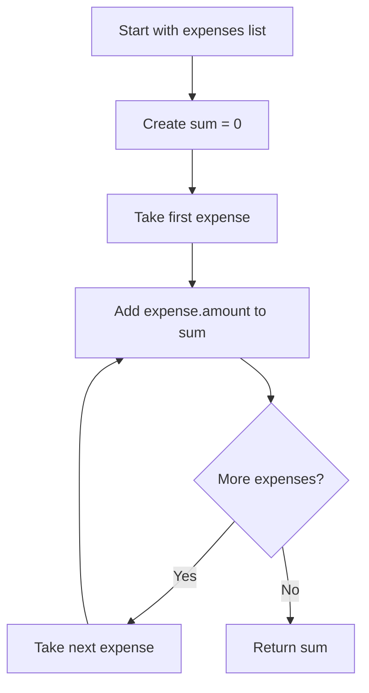
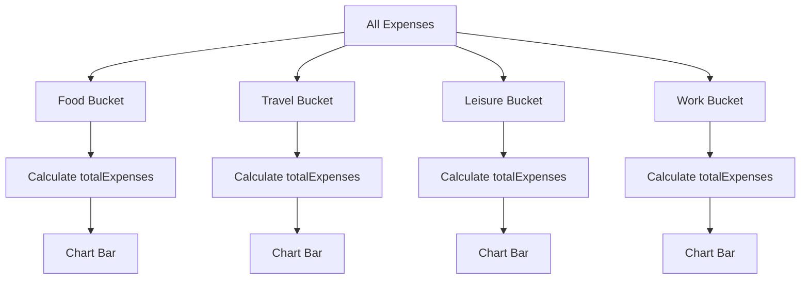
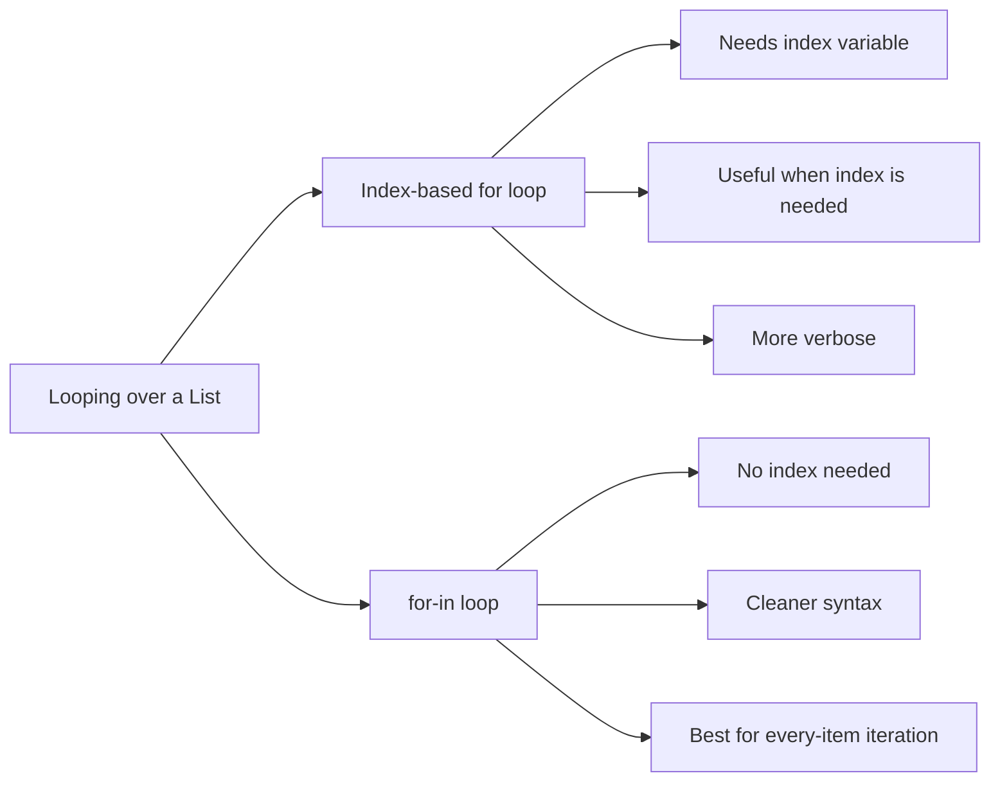

# Using Another Kind of Loop: `for-in`

## Overview

This lesson introduces another kind of loop in Dart: the `for-in` loop.

A `for-in` loop is useful when you want to go through every item in a collection, such as a `List`, without manually managing an index.

In the Expense Tracker app, this loop is used to calculate the total expenses inside an `ExpenseBucket`. Each bucket groups expenses by category, which will later help us build the chart.

---

## Why We Need Expense Buckets

The app will show a chart that compares expenses by category.

For example:

* Food
* Travel
* Leisure
* Work

To build this chart, we need to group expenses into buckets.

Each bucket represents one category and contains all expenses that belong to that category.

---

## Creating the `ExpenseBucket` Class

Inside the expense model file, we can add a new class named `ExpenseBucket`.

```dart id="bc29me"
class ExpenseBucket {
  const ExpenseBucket({
    required this.category,
    required this.expenses,
  });

  final Category category;
  final List<Expense> expenses;
}
```

This class stores two things:

| Property   | Type            | Purpose                                   |
| ---------- | --------------- | ----------------------------------------- |
| `category` | `Category`      | The category this bucket represents       |
| `expenses` | `List<Expense>` | All expenses that belong to this category |

---

## Why `ExpenseBucket` Is Useful

Instead of working with all expenses directly, the chart can work with grouped data.

For example:

```dart id="xqfrz4"
ExpenseBucket(
  category: Category.food,
  expenses: [
    Expense(...),
    Expense(...),
    Expense(...),
  ],
)
```

This bucket contains all food-related expenses.

Later, the chart can use this bucket to calculate how tall the food bar should be.

---

## Adding a Getter for Total Expenses

Each bucket should be able to calculate the total amount of all its expenses.

For that, we add a getter.

```dart id="cewqpm"
double get totalExpenses {
  double sum = 0;

  for (final expense in expenses) {
    sum += expense.amount;
  }

  return sum;
}
```

This getter returns the total amount spent in that category.

---

## What Is a Getter?

A getter is a special property-like method.

Instead of calling it like a method:

```dart id="hm3f81"
bucket.totalExpenses()
```

we use it like a property:

```dart id="r8gkcl"
bucket.totalExpenses
```

This makes the code cleaner and easier to read.

---

## Understanding the `for-in` Loop

The `for-in` loop goes through every item in a collection.

```dart id="zvqenl"
for (final expense in expenses) {
  sum += expense.amount;
}
```

This means:

> For every `expense` inside the `expenses` list, run the code inside the loop body.

In every loop cycle, Dart takes one item from the list and stores it in the temporary variable `expense`.

---

## `for-in` vs Index-Based `for` Loop

Before this, you may have seen loops like this:

```dart id="qe6m4l"
for (int i = 0; i < expenses.length; i++) {
  sum += expenses[i].amount;
}
```

This works, but it requires manually managing an index variable.

The `for-in` version is cleaner:

```dart id="dnej7s"
for (final expense in expenses) {
  sum += expense.amount;
}
```

Use `for-in` when you need every item but do not need the index.

---

## Understanding `+=`

Inside the loop, we use:

```dart id="yxxq7g"
sum += expense.amount;
```

This is a shorter way of writing:

```dart id="rk8tkz"
sum = sum + expense.amount;
```

Both versions mean:

> Take the current value of `sum`, add `expense.amount`, and store the result back in `sum`.

---

## Full `ExpenseBucket` Example

```dart id="o5yty3"
class ExpenseBucket {
  const ExpenseBucket({
    required this.category,
    required this.expenses,
  });

  final Category category;
  final List<Expense> expenses;

  double get totalExpenses {
    double sum = 0;

    for (final expense in expenses) {
      sum += expense.amount;
    }

    return sum;
  }
}
```

---

## Example Calculation

Imagine a food bucket contains three expenses:

```dart id="j9adwe"
[
  Expense(amount: 12.50, category: Category.food),
  Expense(amount: 8.00, category: Category.food),
  Expense(amount: 20.00, category: Category.food),
]
```

The getter calculates:

```dart id="yoji24"
0 + 12.50 + 8.00 + 20.00 = 40.50
```

So:

```dart id="5cr77q"
bucket.totalExpenses
```

returns:

```dart id="wdw3ok"
40.50
```

---

## Why This Helps the Chart

The chart needs to compare total spending per category.

For example:

| Category |     Total |
| -------- | --------: |
| Food     |  `$40.50` |
| Travel   | `$120.00` |
| Leisure  |  `$25.99` |
| Work     |  `$75.00` |

Each category can be represented by one `ExpenseBucket`.

The chart can then use `totalExpenses` to decide the height of each bar.

---

## Optional: Creating Buckets for All Categories

Later, we can create one bucket for every category.

```dart id="myxnt8"
List<ExpenseBucket> get buckets {
  return [
    for (final category in Category.values)
      ExpenseBucket.forCategory(_registeredExpenses, category),
  ];
}
```

This uses a `for` loop inside a list literal.

It creates a list of `ExpenseBucket` objects.

---

## Optional Named Constructor: `forCategory`

A useful improvement is to add a named constructor that filters expenses by category.

```dart id="yr5tr1"
class ExpenseBucket {
  const ExpenseBucket({
    required this.category,
    required this.expenses,
  });

  ExpenseBucket.forCategory(List<Expense> allExpenses, this.category)
      : expenses = allExpenses
            .where((expense) => expense.category == category)
            .toList();

  final Category category;
  final List<Expense> expenses;

  double get totalExpenses {
    double sum = 0;

    for (final expense in expenses) {
      sum += expense.amount;
    }

    return sum;
  }
}
```

This constructor receives all expenses and keeps only the ones that match the selected category.

---

## `for-in` Loop Flow Diagram



---

## Expense Bucket Diagram



---

## `for-in` vs Index Loop Diagram



---

## Important Syntax

| Syntax                     | Meaning                                 |
| -------------------------- | --------------------------------------- |
| `for (final item in list)` | Loops through every item in a list      |
| `final expense`            | Temporary variable for the current item |
| `in expenses`              | The collection being looped over        |
| `sum += expense.amount`    | Adds the amount to the running total    |
| `double get totalExpenses` | Getter that returns a `double`          |

---

## When to Use `for-in`

Use `for-in` when:

* You want to process every item in a collection.
* You do not need the index.
* You want cleaner and more readable code.
* You are working with a `List`, `Set`, or another `Iterable`.

Example:

```dart id="zpn4aw"
for (final expense in expenses) {
  print(expense.title);
}
```

---

## When to Use an Index-Based Loop

Use an index-based loop when you need the position of each item.

```dart id="djq6kw"
for (int i = 0; i < expenses.length; i++) {
  print('Expense number $i: ${expenses[i].title}');
}
```

This is useful when the index itself matters.

---

## Key Takeaways

* `for-in` is a clean way to loop through all items in a collection.
* It avoids manually creating and updating an index variable.
* `ExpenseBucket` groups expenses by category.
* The `totalExpenses` getter calculates the sum of all expenses in a bucket.
* `sum += expense.amount` is shorthand for `sum = sum + expense.amount`.
* Expense buckets will later help build the chart.
* Use `for-in` when you need every item but do not need the index.

---

## Summary

This lesson introduces the `for-in` loop and applies it to the Expense Tracker app.

A new `ExpenseBucket` class is created to group expenses by category. Inside this class, the `totalExpenses` getter uses a `for-in` loop to go through every expense and calculate the total amount.

This gives the app the grouped data it needs to build the expense chart.
