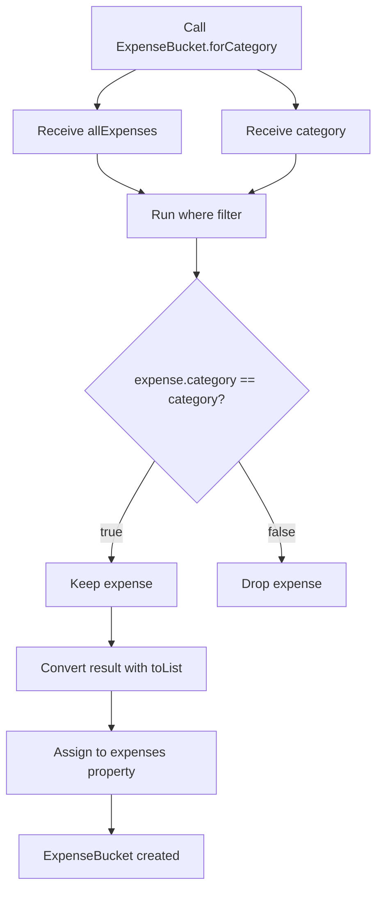
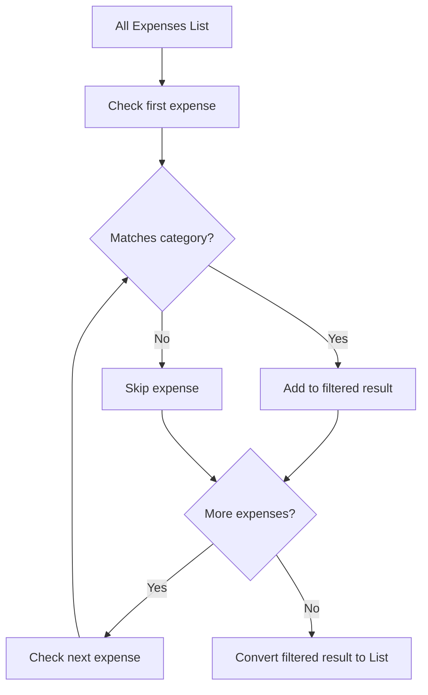
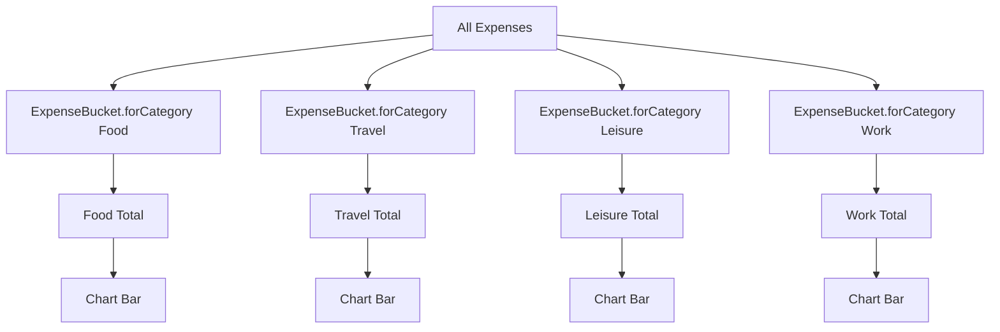
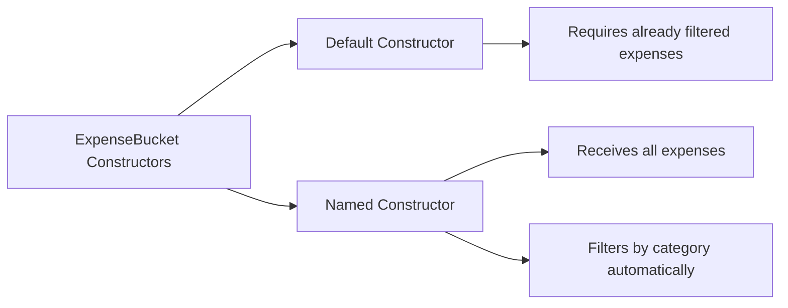

# Adding Alternative Constructor Functions and Filtering Lists

## Overview

This lesson introduces two important Dart concepts:

1. **Named constructor functions**
2. **Filtering lists with `where()`**

In the Expense Tracker app, these concepts are used to improve the `ExpenseBucket` class.

An `ExpenseBucket` represents a group of expenses that belong to one category. For example, one bucket can contain all food expenses, while another bucket can contain all travel expenses.

To make creating these category-specific buckets easier, we add an alternative constructor named `ExpenseBucket.forCategory`.

---

## Why We Need an Alternative Constructor

The normal constructor creates an `ExpenseBucket` when we already have a category and a filtered list of expenses.

```dart id="n52i12"
const ExpenseBucket({
  required this.category,
  required this.expenses,
});
```

This means we must manually provide:

* The category
* The list of expenses for that category

But for the chart, we often start with one full list of all expenses.

So it would be useful to create a bucket like this:

```dart id="47ty65"
ExpenseBucket.forCategory(allExpenses, Category.food)
```

This constructor should automatically filter the full expense list and keep only the expenses that belong to `Category.food`.

---

## What Is a Named Constructor?

A named constructor is an additional constructor function inside a class.

It uses this syntax:

```dart id="1v657p"
ClassName.constructorName(...)
```

Example:

```dart id="72if2h"
ExpenseBucket.forCategory(...)
```

You have already seen this pattern in Flutter classes such as:

```dart id="ot7d7e"
EdgeInsets.symmetric(...)
```

or:

```dart id="mw8b6k"
Color.fromARGB(...)
```

These are named constructors.

They provide alternative ways to create objects.

---

## Basic `ExpenseBucket` Class

Before adding the named constructor, the class looks like this:

```dart id="z22t2p"
class ExpenseBucket {
  const ExpenseBucket({
    required this.category,
    required this.expenses,
  });

  final Category category;
  final List<Expense> expenses;

  double get totalExpenses {
    double sum = 0;

    for (final expense in expenses) {
      sum += expense.amount;
    }

    return sum;
  }
}
```

This class stores:

| Property        | Type            | Purpose                                 |
| --------------- | --------------- | --------------------------------------- |
| `category`      | `Category`      | The category represented by the bucket  |
| `expenses`      | `List<Expense>` | The expenses that belong to this bucket |
| `totalExpenses` | `double` getter | The total amount spent in this bucket   |

---

## Adding the Named Constructor

Now we add an alternative constructor named `forCategory`.

```dart id="k6lbwb"
ExpenseBucket.forCategory(List<Expense> allExpenses, this.category)
    : expenses = allExpenses
          .where((expense) => expense.category == category)
          .toList();
```

This constructor accepts:

1. `allExpenses`

A list containing expenses from all categories.

2. `this.category`

The category this bucket should represent.

Then it filters `allExpenses` and stores only the expenses that match the selected category.

---

## Full Class with Named Constructor

```dart id="7qo1k4"
class ExpenseBucket {
  const ExpenseBucket({
    required this.category,
    required this.expenses,
  });

  ExpenseBucket.forCategory(List<Expense> allExpenses, this.category)
      : expenses = allExpenses
            .where((expense) => expense.category == category)
            .toList();

  final Category category;
  final List<Expense> expenses;

  double get totalExpenses {
    double sum = 0;

    for (final expense in expenses) {
      sum += expense.amount;
    }

    return sum;
  }
}
```

---

## Understanding the Initializer List

The part after the colon is called an initializer list.

```dart id="w1mnro"
: expenses = allExpenses
      .where((expense) => expense.category == category)
      .toList();
```

An initializer list sets class fields before the constructor body runs.

In this case, it sets the `expenses` property.

Since the constructor receives all expenses, the initializer list filters them and assigns the result to `expenses`.

---

## Why We Use an Initializer List

The `expenses` property is final:

```dart id="u2ve8q"
final List<Expense> expenses;
```

A final property must be assigned when the object is created.

The initializer list is a clean way to calculate and assign that value during object creation.

---

## Understanding `where()`

The `where()` method filters a collection.

```dart id="4ppqhd"
allExpenses.where((expense) => expense.category == category)
```

It checks every expense in `allExpenses`.

For each expense, it runs this condition:

```dart id="ujqgc0"
expense.category == category
```

If the condition returns `true`, the expense is kept.

If the condition returns `false`, the expense is removed from the filtered result.

---

## The Filter Function

The function passed to `where()` receives one item at a time.

```dart id="un2jvq"
(expense) => expense.category == category
```

This is an anonymous arrow function.

It means:

> Take one expense and return whether its category equals the bucket category.

Expanded version:

```dart id="meq21t"
(expense) {
  return expense.category == category;
}
```

The arrow syntax is shorter and useful for one-line return expressions.

---

## `==` vs `=`

Inside the filter condition, we use double equals:

```dart id="ivwyo5"
expense.category == category
```

This checks whether two values are equal.

Do not use a single equals sign here:

```dart id="e2i83m"
expense.category = category
```

A single equals sign is used for assignment, not comparison.

| Operator | Meaning        |
| -------- | -------------- |
| `=`      | Assign a value |
| `==`     | Check equality |

---

## Why `.toList()` Is Needed

The `where()` method returns an `Iterable`, not a `List`.

But the `expenses` property expects:

```dart id="yels56"
List<Expense>
```

So we convert the filtered iterable into a list:

```dart id="4k3dhk"
.toList()
```

Full expression:

```dart id="ieiu8e"
expenses = allExpenses
    .where((expense) => expense.category == category)
    .toList();
```

---

## Example

Imagine we have this full expense list:

```dart id="ke39al"
final allExpenses = [
  Expense(title: 'Pizza', category: Category.food, amount: 12),
  Expense(title: 'Taxi', category: Category.travel, amount: 20),
  Expense(title: 'Laptop Stand', category: Category.work, amount: 35),
  Expense(title: 'Coffee', category: Category.food, amount: 5),
];
```

Now we create a food bucket:

```dart id="89yc0h"
final foodBucket = ExpenseBucket.forCategory(
  allExpenses,
  Category.food,
);
```

The constructor filters the list and keeps only food expenses:

```dart id="c4j4dw"
[
  Expense(title: 'Pizza', category: Category.food, amount: 12),
  Expense(title: 'Coffee', category: Category.food, amount: 5),
]
```

So:

```dart id="yj8u4o"
foodBucket.totalExpenses
```

returns:

```dart id="rfa1yf"
17
```

---

## How This Helps the Chart

The chart needs one bucket per category.

Each bucket contains only the expenses for that category.

For example:

| Bucket         | Contains             |
| -------------- | -------------------- |
| Food bucket    | All food expenses    |
| Travel bucket  | All travel expenses  |
| Leisure bucket | All leisure expenses |
| Work bucket    | All work expenses    |

Then each bucket can calculate its own total with:

```dart id="hfrcvf"
bucket.totalExpenses
```

The chart can use those totals to display bars with different heights.

---

## Creating Buckets for All Categories

Later, we can use this named constructor to create all chart buckets.

```dart id="ac8ij3"
final buckets = [
  ExpenseBucket.forCategory(allExpenses, Category.food),
  ExpenseBucket.forCategory(allExpenses, Category.travel),
  ExpenseBucket.forCategory(allExpenses, Category.leisure),
  ExpenseBucket.forCategory(allExpenses, Category.work),
];
```

A cleaner version can use `Category.values`:

```dart id="f8kclk"
final buckets = [
  for (final category in Category.values)
    ExpenseBucket.forCategory(allExpenses, category),
];
```

This creates one bucket for every category in the enum.

---

## Named Constructor Flow Diagram



---

## Filtering Flow Diagram



---

## Expense Buckets for Chart Diagram



---

## Constructor Types Diagram



---

## Important Syntax

| Syntax                           | Meaning                                                  |
| -------------------------------- | -------------------------------------------------------- |
| `ExpenseBucket.forCategory(...)` | Named constructor                                        |
| `List<Expense> allExpenses`      | Parameter containing all expenses                        |
| `this.category`                  | Assigns the constructor argument to the `category` field |
| `: expenses = ...`               | Initializer list                                         |
| `.where(...)`                    | Filters an iterable                                      |
| `(expense) => ...`               | Anonymous arrow function                                 |
| `==`                             | Equality check                                           |
| `.toList()`                      | Converts iterable result into a list                     |

---

## Common Mistakes

### Mistake 1: Using `=` Instead of `==`

Incorrect:

```dart id="o83m39"
expense.category = category
```

Correct:

```dart id="ly60ig"
expense.category == category
```

Use `==` when comparing values.

---

### Mistake 2: Forgetting `.toList()`

Incorrect:

```dart id="yvzmxx"
expenses = allExpenses.where(
  (expense) => expense.category == category,
);
```

This returns an `Iterable<Expense>`.

Correct:

```dart id="me66nb"
expenses = allExpenses
    .where((expense) => expense.category == category)
    .toList();
```

This returns a `List<Expense>`.

---

### Mistake 3: Filtering After Object Creation

Less clean:

```dart id="v7a5p0"
final foodExpenses = allExpenses
    .where((expense) => expense.category == Category.food)
    .toList();

final foodBucket = ExpenseBucket(
  category: Category.food,
  expenses: foodExpenses,
);
```

Cleaner:

```dart id="zed735"
final foodBucket = ExpenseBucket.forCategory(
  allExpenses,
  Category.food,
);
```

The named constructor keeps the filtering logic inside the model class.

---

## Key Takeaways

* Named constructors provide alternative ways to create objects.
* A named constructor uses the syntax `ClassName.constructorName`.
* `ExpenseBucket.forCategory` creates a bucket for one category.
* `where()` filters a collection based on a condition.
* The function passed to `where()` must return `true` or `false`.
* Use `==` for equality checks.
* Use `.toList()` because `where()` returns an `Iterable`.
* The initializer list assigns calculated values to final fields before the object is created.
* This pattern keeps chart data preparation clean and reusable.

---

## Summary

This lesson adds a named constructor to the `ExpenseBucket` class.

The new constructor, `ExpenseBucket.forCategory`, receives a full list of expenses and a category. It filters the list with `where()` and stores only the expenses that belong to the selected category.

This makes it easy to create category-specific buckets for the chart while keeping the filtering logic clean and reusable.
