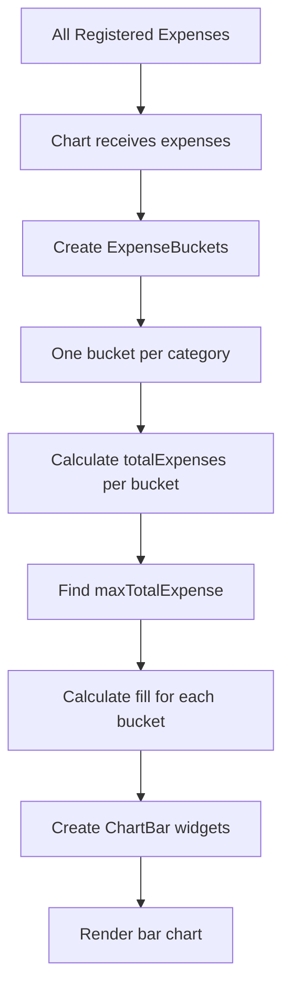
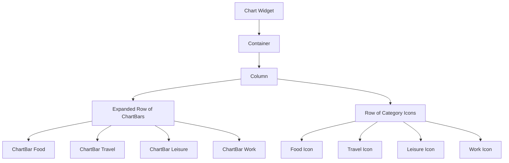
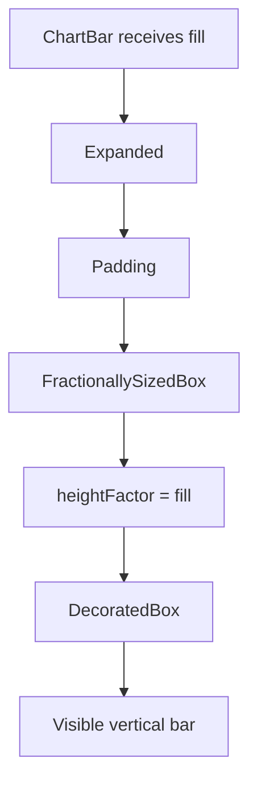
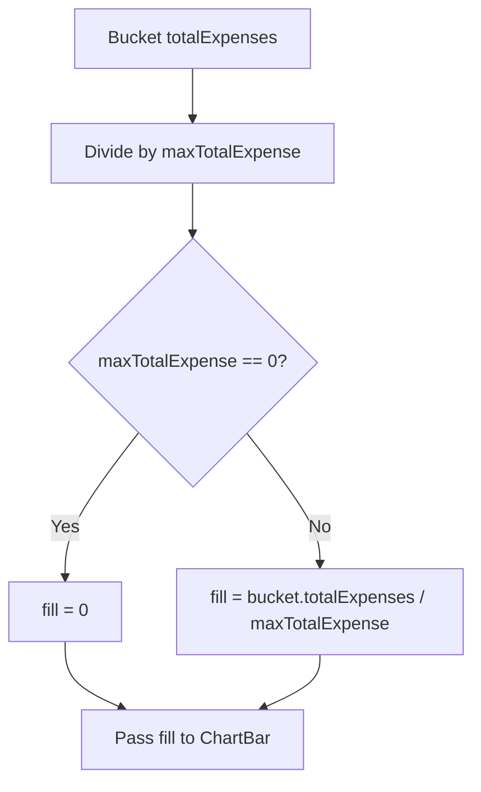
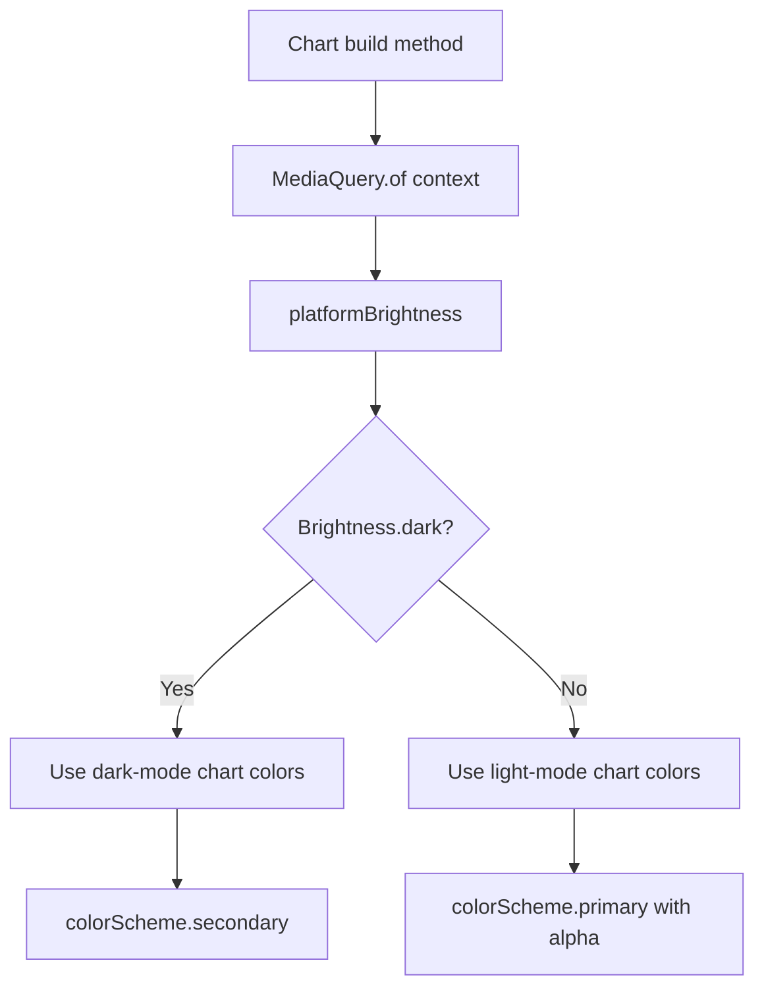
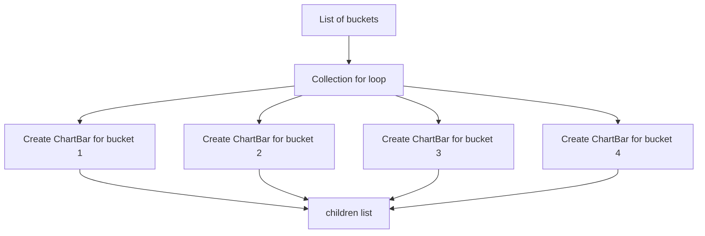

# Adding Chart Widgets

## Overview

This lesson adds a chart to the Expense Tracker app.

The chart visualizes how much money was spent in each expense category. Instead of using a third-party chart package, the chart is built with custom Flutter widgets.

The chart is made from two main widgets:

* `Chart`
* `ChartBar`

The `Chart` widget manages the list of expense buckets and creates one bar for each category.

The `ChartBar` widget renders a single vertical bar whose height depends on the total amount spent in that category.

---

## Why We Need a Chart

The app already allows users to:

* Add expenses
* Delete expenses
* Undo deleted expenses
* Use light and dark themes

The missing feature is a visual overview.

A chart helps users quickly understand where most of their money is going.

For example, the chart can show whether most spending belongs to:

* Food
* Travel
* Leisure
* Work

---

## Folder Structure

Create a new folder inside `lib/widgets`.

```text
lib/
  widgets/
    chart/
      chart.dart
      chart_bar.dart
```

The chart-related widgets are placed in their own `chart` folder to keep the project organized.

---

## Main Chart Files

The chart feature uses two files:

```text
chart.dart
chart_bar.dart
```

| File             | Purpose                                         |
| ---------------- | ----------------------------------------------- |
| `chart.dart`     | Creates the full chart and generates chart bars |
| `chart_bar.dart` | Renders one individual chart bar                |

---

## Step 1: Import the Chart Widget

In `expenses.dart`, import the chart widget.

```dart id="zg2hyd"
import 'package:expense_tracker/widgets/chart/chart.dart';
```

Make sure the package name matches your own Flutter project name.

If your project is not named `expense_tracker`, adjust the import path.

---

## Step 2: Add the Chart Above the Expense List

Inside the `Expenses` screen, place the `Chart` widget above the expense list.

```dart id="72mkgc"
Column(
  children: [
    Chart(expenses: _registeredExpenses),
    Expanded(
      child: mainContent,
    ),
  ],
)
```

The chart receives all registered expenses:

```dart id="48ivhd"
expenses: _registeredExpenses
```

The chart will then group those expenses into category buckets.

---

## Example in `expenses.dart`

```dart id="eiucrf"
body: Column(
  children: [
    Chart(expenses: _registeredExpenses),
    Expanded(
      child: mainContent,
    ),
  ],
),
```

The `Chart` is displayed at the top.

The expense list or fallback message is displayed below it.

---

## Step 3: The `Chart` Widget

The `Chart` widget receives all expenses.

```dart id="usq1g3"
class Chart extends StatelessWidget {
  const Chart({
    super.key,
    required this.expenses,
  });

  final List<Expense> expenses;

  // ...
}
```

The chart does not manage state.

It only receives data and renders the visual output.

---

## Step 4: Creating Expense Buckets

The chart needs one bucket for each category.

```dart id="9k8s52"
List<ExpenseBucket> get buckets {
  return [
    ExpenseBucket.forCategory(expenses, Category.food),
    ExpenseBucket.forCategory(expenses, Category.travel),
    ExpenseBucket.forCategory(expenses, Category.leisure),
    ExpenseBucket.forCategory(expenses, Category.work),
  ];
}
```

Each `ExpenseBucket` contains:

* One category
* All expenses belonging to that category
* A calculated `totalExpenses` value

---

## Cleaner Bucket Creation with `Category.values`

If your `Category` enum contains all categories, you can create the buckets more dynamically.

```dart id="oz4b9j"
List<ExpenseBucket> get buckets {
  return [
    for (final category in Category.values)
      ExpenseBucket.forCategory(expenses, category),
  ];
}
```

This creates one `ExpenseBucket` for every category in the enum.

---

## Step 5: Finding the Maximum Total Expense

The chart needs to know which category has the highest total spending.

That highest amount is used to calculate relative bar heights.

```dart id="i5xggw"
double get maxTotalExpense {
  double maxTotalExpense = 0;

  for (final bucket in buckets) {
    if (bucket.totalExpenses > maxTotalExpense) {
      maxTotalExpense = bucket.totalExpenses;
    }
  }

  return maxTotalExpense;
}
```

This loop checks every bucket and stores the highest total.

---

## Why Use the Maximum Total?

The chart bars are displayed relative to each other.

The category with the highest total should have the tallest bar.

Other categories should have shorter bars based on their totals.

Example:

| Category | Total | Bar Fill |
| -------- | ----: | -------: |
| Food     |   100 |      1.0 |
| Travel   |    50 |      0.5 |
| Leisure  |    25 |     0.25 |
| Work     |     0 |      0.0 |

The highest category becomes the reference point.

---

## Important: Max Total vs Grand Total

For this chart, each bar is usually calculated like this:

```dart id="lmooyq"
bucket.totalExpenses / maxTotalExpense
```

This means the bars are normalized against the highest category total.

This is different from calculating each category's share of all expenses.

| Formula                                   | Meaning                                          |
| ----------------------------------------- | ------------------------------------------------ |
| `bucket.totalExpenses / maxTotalExpense`  | Relative height compared to the largest category |
| `bucket.totalExpenses / totalAllExpenses` | Percentage share of total spending               |

The course chart uses the first approach so that the largest bar reaches full height.

---

## Step 6: Avoid Division by Zero

If all bucket totals are zero, `maxTotalExpense` is also zero.

To avoid division by zero, use a guard.

```dart id="rxss40"
final fill = maxTotalExpense == 0
    ? 0.0
    : bucket.totalExpenses / maxTotalExpense;
```

This ensures the chart does not crash when there are no expenses.

---

## Step 7: Creating Chart Bars with Collection `for`

Inside a widget tree, you can use a `for` loop inside a list of widgets.

```dart id="ok90qc"
Row(
  crossAxisAlignment: CrossAxisAlignment.end,
  children: [
    for (final bucket in buckets)
      ChartBar(
        fill: maxTotalExpense == 0
            ? 0
            : bucket.totalExpenses / maxTotalExpense,
      ),
  ],
)
```

This creates one `ChartBar` for every bucket.

---

## Collection `for` vs Normal `for-in`

A normal `for-in` loop uses curly braces.

```dart id="vk3dlo"
for (final bucket in buckets) {
  print(bucket.totalExpenses);
}
```

A collection `for` inside a widget list does not use curly braces.

```dart id="j44xva"
children: [
  for (final bucket in buckets)
    ChartBar(fill: bucket.totalExpenses / maxTotalExpense),
]
```

This is useful when building widget lists dynamically.

---

## Step 8: The `ChartBar` Widget

The `ChartBar` widget receives a `fill` value.

```dart id="v485wi"
class ChartBar extends StatelessWidget {
  const ChartBar({
    super.key,
    required this.fill,
  });

  final double fill;

  @override
  Widget build(BuildContext context) {
    // ...
  }
}
```

The `fill` value should be between `0.0` and `1.0`.

| Fill Value | Meaning         |
| ---------- | --------------- |
| `0.0`      | Empty bar       |
| `0.5`      | Half-height bar |
| `1.0`      | Full-height bar |

---

## Step 9: Using `FractionallySizedBox`

The `ChartBar` uses `FractionallySizedBox`.

```dart id="qp39dx"
FractionallySizedBox(
  heightFactor: fill,
  child: DecoratedBox(
    decoration: BoxDecoration(
      shape: BoxShape.rectangle,
      borderRadius: const BorderRadius.vertical(
        top: Radius.circular(8),
      ),
      color: Theme.of(context).colorScheme.primary,
    ),
  ),
)
```

`FractionallySizedBox` sizes its child as a fraction of the available space.

For example:

```dart id="grsk21"
heightFactor: 1.0
```

means 100% height.

```dart id="mx3i1l"
heightFactor: 0.5
```

means 50% height.

```dart id="8gwuf4"
heightFactor: 0.0
```

means 0% height.

---

## Why `FractionallySizedBox` Is Useful for Charts

A chart bar does not need a fixed pixel height.

Instead, its height should depend on the data.

`FractionallySizedBox` is perfect for this because it allows us to express bar height as a percentage of the available chart height.

```dart id="ua58xc"
heightFactor: fill
```

The higher the `fill`, the taller the bar.

---

## Step 10: Using `DecoratedBox`

The visible bar is created with `DecoratedBox`.

```dart id="q3w1eg"
DecoratedBox(
  decoration: BoxDecoration(
    shape: BoxShape.rectangle,
    borderRadius: const BorderRadius.vertical(
      top: Radius.circular(8),
    ),
    color: Theme.of(context).colorScheme.primary,
  ),
)
```

`DecoratedBox` is useful when you only need decoration.

Here, it creates:

* A rectangle
* Rounded top corners
* A theme-based color

---

## Basic `ChartBar` Example

```dart id="mmykhg"
class ChartBar extends StatelessWidget {
  const ChartBar({
    super.key,
    required this.fill,
  });

  final double fill;

  @override
  Widget build(BuildContext context) {
    return Expanded(
      child: Padding(
        padding: const EdgeInsets.symmetric(horizontal: 4),
        child: FractionallySizedBox(
          heightFactor: fill,
          child: DecoratedBox(
            decoration: BoxDecoration(
              shape: BoxShape.rectangle,
              borderRadius: const BorderRadius.vertical(
                top: Radius.circular(8),
              ),
              color: Theme.of(context).colorScheme.primary,
            ),
          ),
        ),
      ),
    );
  }
}
```

---

## Step 11: Detecting Dark Mode with `MediaQuery`

In some cases, we may want to choose a slightly different color depending on whether the app is in light mode or dark mode.

This can be done with `MediaQuery`.

```dart id="tre11t"
final isDarkMode =
    MediaQuery.of(context).platformBrightness == Brightness.dark;
```

This checks the current platform brightness.

If the platform is in dark mode, `isDarkMode` becomes `true`.

---

## Using Different Colors for Light and Dark Mode

```dart id="fxzfa4"
color: isDarkMode
    ? Theme.of(context).colorScheme.secondary
    : Theme.of(context).colorScheme.primary.withValues(alpha: 0.65),
```

This means:

* In dark mode, use `secondary`
* In light mode, use a slightly transparent `primary`

Older course code may use:

```dart id="vd39yz"
Theme.of(context).colorScheme.primary.withOpacity(0.65)
```

In newer Flutter versions, prefer:

```dart id="ltdyon"
Theme.of(context).colorScheme.primary.withValues(alpha: 0.65)
```

---

## Full `ChartBar` Example

```dart id="lcrn60"
class ChartBar extends StatelessWidget {
  const ChartBar({
    super.key,
    required this.fill,
  });

  final double fill;

  @override
  Widget build(BuildContext context) {
    final isDarkMode =
        MediaQuery.of(context).platformBrightness == Brightness.dark;

    return Expanded(
      child: Padding(
        padding: const EdgeInsets.symmetric(horizontal: 4),
        child: FractionallySizedBox(
          heightFactor: fill,
          child: DecoratedBox(
            decoration: BoxDecoration(
              shape: BoxShape.rectangle,
              borderRadius: const BorderRadius.vertical(
                top: Radius.circular(8),
              ),
              color: isDarkMode
                  ? Theme.of(context).colorScheme.secondary
                  : Theme.of(context)
                      .colorScheme
                      .primary
                      .withValues(alpha: 0.65),
            ),
          ),
        ),
      ),
    );
  }
}
```

---

## Step 12: Displaying Category Icons

Below the chart bars, the chart can display one icon per category.

```dart id="hlkoh5"
Row(
  children: buckets
      .map(
        (bucket) => Expanded(
          child: Padding(
            padding: const EdgeInsets.symmetric(horizontal: 4),
            child: Icon(categoryIcons[bucket.category]),
          ),
        ),
      )
      .toList(),
)
```

This uses the `categoryIcons` map created earlier in the app.

Each bucket has a category, and each category has a matching icon.

---

## Alternative: Icons with Collection `for`

Instead of `.map(...)`, you can also use collection `for`.

```dart id="s5iq33"
Row(
  children: [
    for (final bucket in buckets)
      Expanded(
        child: Padding(
          padding: const EdgeInsets.symmetric(horizontal: 4),
          child: Icon(categoryIcons[bucket.category]),
        ),
      ),
  ],
)
```

Both approaches are valid.

---

## Full `Chart` Widget Example

```dart id="sv223y"
import 'package:flutter/material.dart';

import 'package:expense_tracker/models/expense.dart';
import 'package:expense_tracker/widgets/chart/chart_bar.dart';

class Chart extends StatelessWidget {
  const Chart({
    super.key,
    required this.expenses,
  });

  final List<Expense> expenses;

  List<ExpenseBucket> get buckets {
    return [
      for (final category in Category.values)
        ExpenseBucket.forCategory(expenses, category),
    ];
  }

  double get maxTotalExpense {
    double maxTotalExpense = 0;

    for (final bucket in buckets) {
      if (bucket.totalExpenses > maxTotalExpense) {
        maxTotalExpense = bucket.totalExpenses;
      }
    }

    return maxTotalExpense;
  }

  @override
  Widget build(BuildContext context) {
    final isDarkMode =
        MediaQuery.of(context).platformBrightness == Brightness.dark;

    return Container(
      margin: const EdgeInsets.all(16),
      padding: const EdgeInsets.symmetric(
        vertical: 16,
        horizontal: 8,
      ),
      width: double.infinity,
      height: 180,
      decoration: BoxDecoration(
        borderRadius: BorderRadius.circular(8),
        gradient: LinearGradient(
          colors: [
            Theme.of(context).colorScheme.primary.withValues(alpha: 0.3),
            Theme.of(context).colorScheme.primary.withValues(alpha: 0.0),
          ],
          begin: Alignment.bottomCenter,
          end: Alignment.topCenter,
        ),
      ),
      child: Column(
        children: [
          Expanded(
            child: Row(
              crossAxisAlignment: CrossAxisAlignment.end,
              children: [
                for (final bucket in buckets)
                  ChartBar(
                    fill: maxTotalExpense == 0
                        ? 0
                        : bucket.totalExpenses / maxTotalExpense,
                  ),
              ],
            ),
          ),
          const SizedBox(height: 12),
          Row(
            children: buckets
                .map(
                  (bucket) => Expanded(
                    child: Padding(
                      padding: const EdgeInsets.symmetric(horizontal: 4),
                      child: Icon(
                        categoryIcons[bucket.category],
                        color: isDarkMode
                            ? Theme.of(context).colorScheme.secondary
                            : Theme.of(context)
                                .colorScheme
                                .primary
                                .withValues(alpha: 0.7),
                      ),
                    ),
                  ),
                )
                .toList(),
          ),
        ],
      ),
    );
  }
}
```

---

## Note About `withOpacity` and `withValues`

Many course videos use:

```dart id="f7m7gi"
.withOpacity(0.65)
```

In newer Flutter versions, you may see a deprecation warning.

Use this instead:

```dart id="mdhx42"
.withValues(alpha: 0.65)
```

If your Flutter SDK does not support `withValues`, use `withOpacity` as shown in the course.

---

## Chart Data Flow Diagram



---

## Chart Widget Structure Diagram



---

## ChartBar Rendering Diagram



---

## Fill Calculation Diagram



---

## Light and Dark Chart Color Diagram



---

## Collection `for` Diagram



---

## Important Widgets and APIs

| Widget / API                                | Purpose                                          |
| ------------------------------------------- | ------------------------------------------------ |
| `Chart`                                     | Displays the full expense chart                  |
| `ChartBar`                                  | Displays one individual chart bar                |
| `ExpenseBucket`                             | Groups expenses by category                      |
| `totalExpenses`                             | Calculates the total amount in a bucket          |
| `maxTotalExpense`                           | Finds the highest category total                 |
| `FractionallySizedBox`                      | Sizes the bar by a fraction of available height  |
| `DecoratedBox`                              | Draws the visual bar decoration                  |
| `MediaQuery.of(context).platformBrightness` | Detects light or dark mode                       |
| `Theme.of(context).colorScheme`             | Reads theme colors                               |
| Collection `for`                            | Creates multiple widgets from data               |
| `.map(...).toList()`                        | Alternative way to create widget lists from data |

---

## Common Mistakes

### Mistake 1: Dividing by Zero

Incorrect:

```dart id="b93n5v"
fill: bucket.totalExpenses / maxTotalExpense
```

If `maxTotalExpense` is zero, this can cause invalid results.

Better:

```dart id="c91qp1"
fill: maxTotalExpense == 0
    ? 0
    : bucket.totalExpenses / maxTotalExpense
```

---

### Mistake 2: Forgetting to Import the Chart

If you use `Chart(...)` in `expenses.dart`, you must import it.

```dart id="xxbzn5"
import 'package:expense_tracker/widgets/chart/chart.dart';
```

---

### Mistake 3: Using the Wrong Import Path

If your project name is different, this import will not work:

```dart id="j7l7ct"
import 'package:expense_tracker/widgets/chart/chart.dart';
```

Update it to match your project name.

---

### Mistake 4: Hardcoding Chart Colors

Avoid this:

```dart id="nuroua"
color: Colors.purple
```

Prefer this:

```dart id="t1yty5"
color: Theme.of(context).colorScheme.primary
```

This helps the chart adapt to light and dark mode.

---

## Key Takeaways

* The chart is built with custom Flutter widgets.
* `Chart` receives all expenses and creates category buckets.
* `ExpenseBucket` groups expenses by category.
* `maxTotalExpense` is used to normalize the bar heights.
* `ChartBar` receives a `fill` value between `0.0` and `1.0`.
* `FractionallySizedBox` is used to create proportional bar heights.
* Collection `for` can create widget lists directly inside `children`.
* `MediaQuery` can detect whether the platform is in dark mode.
* Theme colors should be used instead of hardcoded colors.
* The chart works in both light and dark mode.

---

## Summary

This lesson adds a custom bar chart to the Expense Tracker app.

The chart uses the existing `ExpenseBucket` class to group expenses by category. It calculates each category's total, finds the highest total, and then renders each bar proportionally with `FractionallySizedBox`.

The chart also uses theme-aware colors and `MediaQuery` to look good in both light and dark mode.

No external chart package is required because the entire chart is built with regular Flutter widgets.
