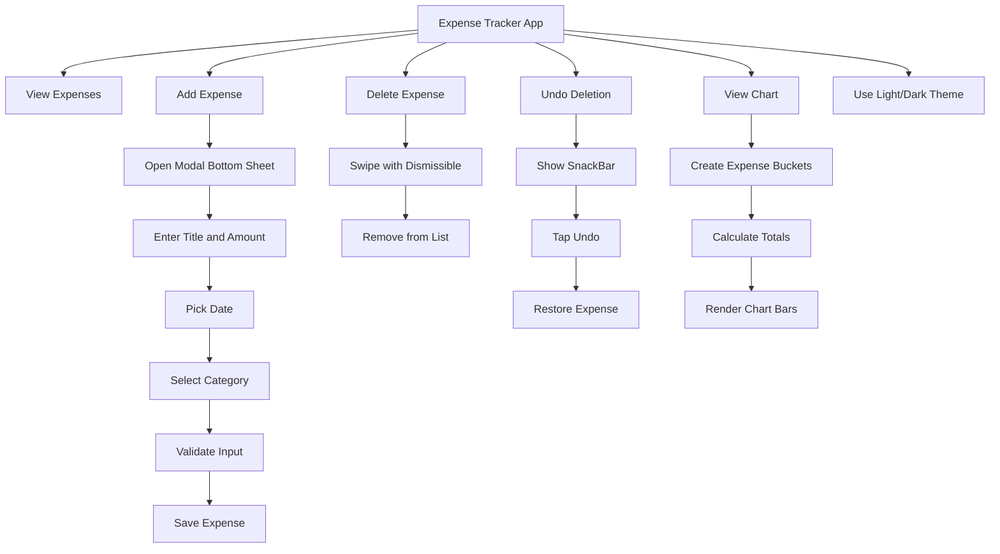
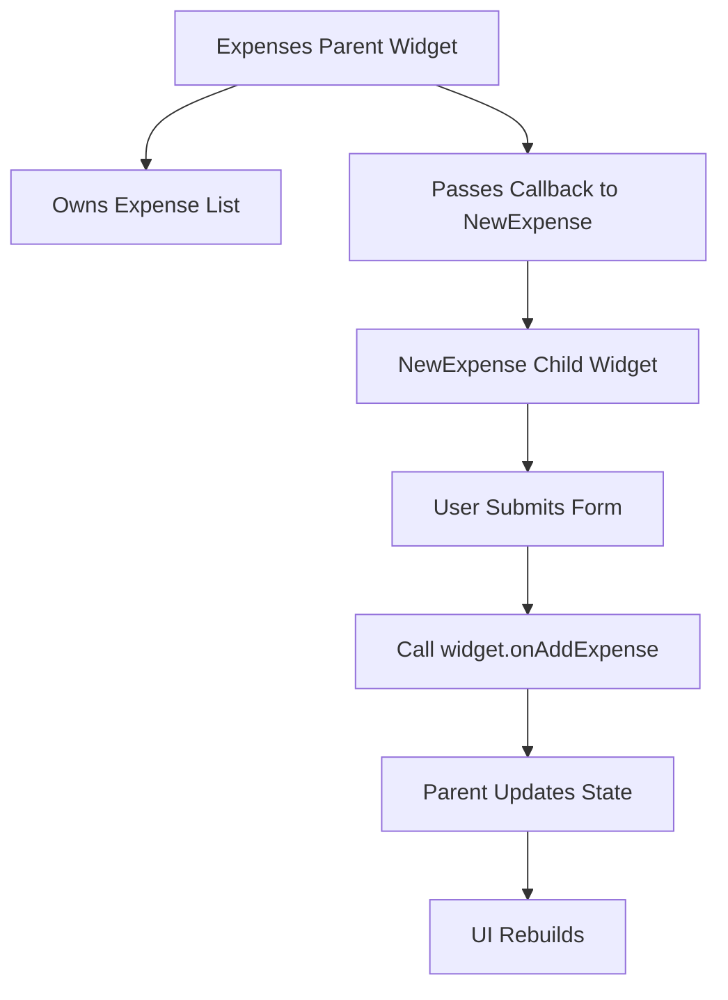
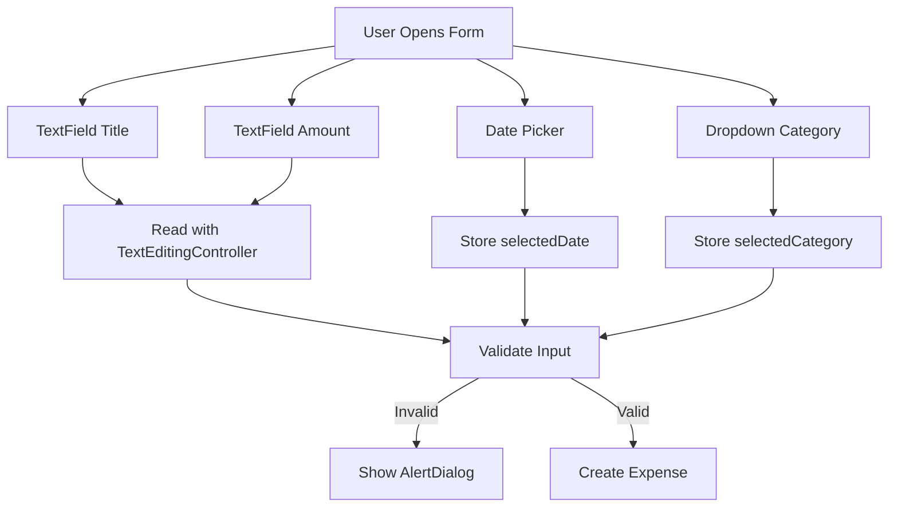
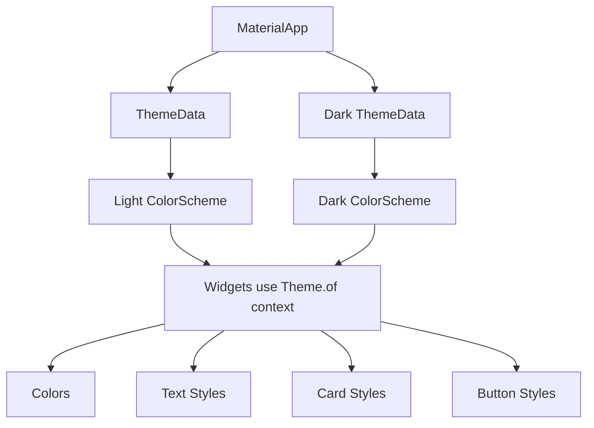
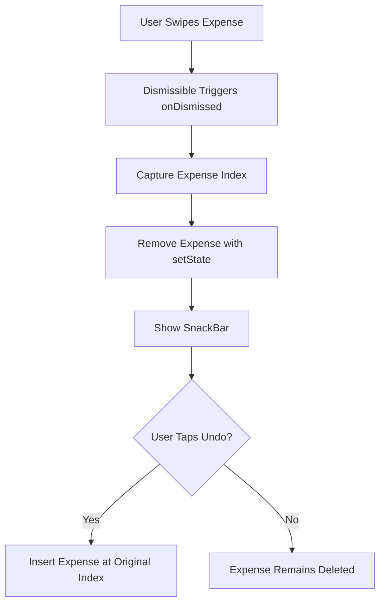
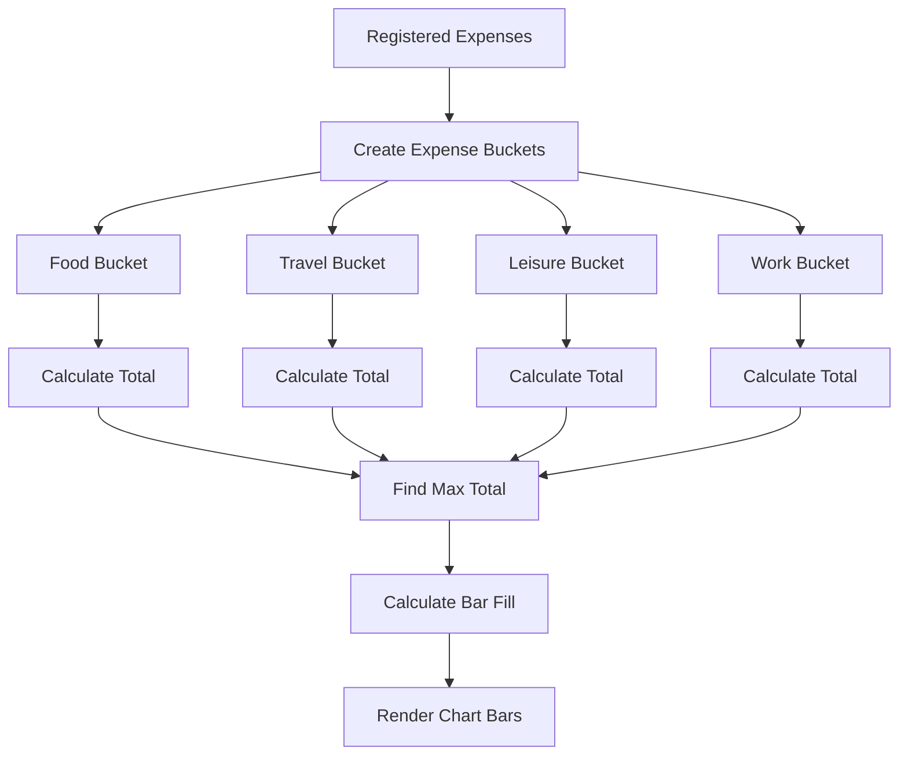

# Module Summary

## Overview

This lesson summarizes the full Expense Tracker module.

In this module, we built a complete Flutter app that allows users to:

* View expenses
* Add new expenses
* Validate user input
* Delete expenses with swipe gestures
* Undo deleted expenses
* Display a category-based expense chart
* Use light and dark themes

This module introduced many important Flutter and Dart concepts that are commonly used in real-world apps.

---

## What We Built

The final app is an Expense Tracker.

It allows users to manage expenses with:

* A title
* An amount
* A date
* A category

The app also visualizes expenses with a chart and supports both light mode and dark mode.

---

## Major Topics Covered

This module covered several key areas of Flutter development:

| Topic                | What You Learned                                        |
| -------------------- | ------------------------------------------------------- |
| Data modeling        | Classes, enums, IDs, and helper getters                 |
| User input           | Text fields, controllers, dropdowns, and date pickers   |
| Validation           | Checking invalid input and showing dialogs              |
| State management     | Updating UI with `setState`                             |
| Widget communication | Passing callback functions from parent to child         |
| Lists                | Rendering dynamic lists with `ListView.builder`         |
| Deletion             | Removing items with `Dismissible`                       |
| Feedback             | Showing `SnackBar` messages with Undo                   |
| Theming              | Material 3, color schemes, text themes, light/dark mode |
| Charts               | Building custom chart widgets with Flutter widgets      |

---

## Data Modeling

The app used custom Dart classes to represent expense data.

For example:

```dart id="8dz4rx"
class Expense {
  Expense({
    required this.title,
    required this.amount,
    required this.date,
    required this.category,
  }) : id = uuid.v4();

  final String id;
  final String title;
  final double amount;
  final DateTime date;
  final Category category;
}
```

We also used an enum to define expense categories.

```dart id="62jpru"
enum Category {
  food,
  travel,
  leisure,
  work,
}
```

This helped us avoid random string values and made the code safer and clearer.

---

## Expense Buckets

For the chart, we created an `ExpenseBucket` class.

Each bucket groups expenses by category.

```dart id="dipvxu"
class ExpenseBucket {
  const ExpenseBucket({
    required this.category,
    required this.expenses,
  });

  ExpenseBucket.forCategory(List<Expense> allExpenses, this.category)
      : expenses = allExpenses
            .where((expense) => expense.category == category)
            .toList();

  final Category category;
  final List<Expense> expenses;

  double get totalExpenses {
    double sum = 0;

    for (final expense in expenses) {
      sum += expense.amount;
    }

    return sum;
  }
}
```

This introduced:

* Named constructors
* Initializer lists
* `where()` filtering
* `for-in` loops
* Getters for computed values

---

## User Input

The app collected user input with several widgets.

| Widget / Tool           | Purpose                                   |
| ----------------------- | ----------------------------------------- |
| `TextField`             | Allows the user to enter title and amount |
| `TextEditingController` | Reads and manages text input              |
| `DropdownButton`        | Allows category selection                 |
| `showDatePicker`        | Opens a date picker dialog                |
| `IconButton`            | Triggers actions such as opening the form |

---

## Text Editing Controllers

We used `TextEditingController` to read text field values.

```dart id="mteom6"
final _titleController = TextEditingController();
final _amountController = TextEditingController();
```

Because controllers use memory resources, they must be disposed when the widget is removed.

```dart id="nn7fk0"
@override
void dispose() {
  _titleController.dispose();
  _amountController.dispose();
  super.dispose();
}
```

This is an important Flutter lifecycle pattern.

---

## Handling Dates and Categories

Some values were not managed with text controllers.

For example, selected date and selected category were stored manually.

```dart id="wic28t"
DateTime? _selectedDate;
Category _selectedCategory = Category.leisure;
```

The date can be nullable because the user might not select a date.

The category has a default value, so it does not need to be nullable.

---

## Input Validation

Before saving a new expense, we validated the user input.

```dart id="5d1hmf"
final enteredAmount = double.tryParse(_amountController.text);
final amountIsInvalid = enteredAmount == null || enteredAmount <= 0;

if (_titleController.text.trim().isEmpty ||
    amountIsInvalid ||
    _selectedDate == null) {
  showDialog(...);
  return;
}
```

The validation checked whether:

* The title was empty
* The amount was invalid
* The amount was less than or equal to zero
* No date was selected

If any value was invalid, the app showed an error dialog.

---

## Showing Dialogs

We used `showDialog()` and `AlertDialog` to show validation errors.

```dart id="t35pq4"
showDialog(
  context: context,
  builder: (ctx) => AlertDialog(
    title: const Text('Invalid input'),
    content: const Text(
      'Please make sure a valid title, amount, date and category was entered.',
    ),
    actions: [
      TextButton(
        onPressed: () {
          Navigator.pop(ctx);
        },
        child: const Text('Okay'),
      ),
    ],
  ),
);
```

This introduced another important Flutter pattern:

> Many Flutter UI helper functions need `context`.

---

## Understanding `context`

The `context` object carries information about where a widget is located in the widget tree.

It is needed for many Flutter features, such as:

* `showDialog`
* `showModalBottomSheet`
* `showDatePicker`
* `ScaffoldMessenger.of(context)`
* `Theme.of(context)`
* `MediaQuery.of(context)`
* `Navigator.pop(context)`

The `context` helps Flutter find the correct parent widgets, theme, navigator, scaffold, and environment information.

---

## Adding New Expenses

The `NewExpense` widget collected input, but the expense list was owned by the parent `Expenses` widget.

So we passed a callback function from the parent to the child.

```dart id="qgrqjm"
NewExpense(
  onAddExpense: _addExpense,
)
```

The child called that function after validation passed.

```dart id="9ffvt7"
widget.onAddExpense(
  Expense(
    title: _titleController.text.trim(),
    amount: enteredAmount,
    date: _selectedDate!,
    category: _selectedCategory,
  ),
);
```

This is an example of lifting state up.

---

## Updating State

The parent updated the list with `setState()`.

```dart id="nsguja"
void _addExpense(Expense expense) {
  setState(() {
    _registeredExpenses.add(expense);
  });
}
```

Calling `setState()` tells Flutter:

> The state changed. Rebuild the UI.

---

## Modal Bottom Sheet

The expense form was shown in a modal bottom sheet.

```dart id="ug8iql"
showModalBottomSheet(
  context: context,
  isScrollControlled: true,
  builder: (ctx) => NewExpense(
    onAddExpense: _addExpense,
  ),
);
```

We also learned how to make the modal more usable by:

* Enabling fullscreen behavior
* Adding padding
* Handling keyboard space
* Closing the modal after saving

```dart id="woq3s6"
Navigator.pop(context);
```

---

## Rendering Lists

The app displayed expenses with `ListView.builder`.

```dart id="9nrrd4"
ListView.builder(
  itemCount: expenses.length,
  itemBuilder: (ctx, index) {
    return ExpenseItem(expenses[index]);
  },
)
```

`ListView.builder` is useful for dynamic lists because it builds items efficiently.

It only creates the widgets that are needed.

---

## Dismissing List Items

We used `Dismissible` to allow users to swipe expenses away.

```dart id="7gi8am"
Dismissible(
  key: ValueKey(expense.id),
  onDismissed: (direction) {
    onRemoveExpense(expense);
  },
  child: ExpenseItem(expense),
)
```

Important details:

* Every `Dismissible` needs a unique key.
* `ValueKey(expense.id)` helps Flutter identify the correct item.
* `onDismissed` runs after the swipe animation completes.

---

## Snackbars and Undo

After deleting an expense, the app showed a snackbar.

```dart id="uzmrrm"
ScaffoldMessenger.of(context).showSnackBar(
  SnackBar(
    duration: const Duration(seconds: 3),
    content: const Text('Expense deleted.'),
    action: SnackBarAction(
      label: 'Undo',
      onPressed: () {
        setState(() {
          _registeredExpenses.insert(expenseIndex, expense);
        });
      },
    ),
  ),
);
```

This gave users feedback and allowed them to undo accidental deletions.

---

## Managing Snackbars

Before showing a new snackbar, we cleared old snackbars.

```dart id="m3a2y8"
ScaffoldMessenger.of(context).clearSnackBars();
```

This prevents multiple snackbars from stacking or appearing one after another.

---

## Empty List Fallback

If there were no expenses, the app showed fallback content.

```dart id="zwc9pp"
Widget mainContent = const Center(
  child: Text('No expenses found. Start adding some!'),
);

if (_registeredExpenses.isNotEmpty) {
  mainContent = ExpensesList(
    expenses: _registeredExpenses,
    onRemoveExpense: _removeExpense,
  );
}
```

This made the UI clearer when the list was empty.

---

## Theming

A large part of this module focused on Flutter's theming system.

We configured a global theme in `MaterialApp`.

```dart id="ph0ckt"
theme: ThemeData().copyWith(
  colorScheme: kColorScheme,
)
```

Theming allows us to define visual styles once and reuse them across the app.

---

## Color Schemes

We used `ColorScheme.fromSeed` to generate a full color scheme from one seed color.

```dart id="yasycm"
final kColorScheme = ColorScheme.fromSeed(
  seedColor: const Color.fromARGB(255, 96, 59, 181),
);
```

Widgets could then read colors from the active theme.

```dart id="uw2qjb"
Theme.of(context).colorScheme.primary
```

This is better than hardcoding colors manually.

---

## Text Themes

We also customized the app's text theme.

```dart id="ydxz59"
textTheme: ThemeData().textTheme.copyWith(
  titleLarge: TextStyle(
    fontWeight: FontWeight.bold,
    color: kColorScheme.onSecondaryContainer,
    fontSize: 16,
  ),
),
```

Widgets then used the theme style.

```dart id="w9r554"
Text(
  expense.title,
  style: Theme.of(context).textTheme.titleLarge,
)
```

This keeps typography consistent across the app.

---

## Light and Dark Mode

The app supports both light and dark mode.

```dart id="sx9vxv"
final kDarkColorScheme = ColorScheme.fromSeed(
  brightness: Brightness.dark,
  seedColor: const Color.fromARGB(255, 5, 99, 125),
);
```

Then we added a `darkTheme`.

```dart id="gsm3oi"
darkTheme: ThemeData.dark().copyWith(
  colorScheme: kDarkColorScheme,
)
```

Flutter can automatically switch between light and dark themes based on the system setting.

```dart id="xszfp5"
themeMode: ThemeMode.system
```

---

## Using Theme Data in Widgets

Inside custom widgets, we used `Theme.of(context)`.

```dart id="70d2lb"
Theme.of(context).colorScheme.error
```

```dart id="47c77n"
Theme.of(context).textTheme.titleLarge
```

```dart id="o35a0e"
Theme.of(context).cardTheme.margin
```

This allowed custom widgets to follow the active app theme.

---

## Custom Chart

At the end of the module, we added a custom chart.

The chart was built with regular Flutter widgets, not an external chart library.

It used:

* `Chart`
* `ChartBar`
* `ExpenseBucket`
* `FractionallySizedBox`
* `DecoratedBox`
* `Row`
* `Column`

Each chart bar represented one expense category.

---

## Chart Data Flow

The chart grouped expenses into buckets.

```dart id="seup7t"
List<ExpenseBucket> get buckets {
  return [
    for (final category in Category.values)
      ExpenseBucket.forCategory(expenses, category),
  ];
}
```

Then it calculated the maximum total expense.

```dart id="3jjjpi"
double get maxTotalExpense {
  double maxTotalExpense = 0;

  for (final bucket in buckets) {
    if (bucket.totalExpenses > maxTotalExpense) {
      maxTotalExpense = bucket.totalExpenses;
    }
  }

  return maxTotalExpense;
}
```

Each bar used a fill value between `0.0` and `1.0`.

```dart id="dsvd2s"
fill: maxTotalExpense == 0
    ? 0
    : bucket.totalExpenses / maxTotalExpense
```

---

## Important Dart Concepts Practiced

This module also reinforced important Dart concepts.

| Dart Concept       | Example                          |   |               |
| ------------------ | -------------------------------- | - | ------------- |
| Classes            | `Expense`, `ExpenseBucket`       |   |               |
| Enums              | `Category`                       |   |               |
| Final fields       | `final String title`             |   |               |
| Constructors       | `Expense(...)`                   |   |               |
| Named constructors | `ExpenseBucket.forCategory(...)` |   |               |
| Initializer lists  | `: expenses = ...`               |   |               |
| Getters            | `double get totalExpenses`       |   |               |
| Lists              | `List<Expense>`                  |   |               |
| Filtering          | `.where(...).toList()`           |   |               |
| Loops              | `for-in`                         |   |               |
| Boolean logic      | `                                |   | `, `&&`, `==` |
| Null safety        | `_selectedDate!`                 |   |               |

---

## Important Flutter Concepts Practiced

| Flutter Concept          | Example                                        |
| ------------------------ | ---------------------------------------------- |
| Stateless widgets        | Display-only widgets                           |
| Stateful widgets         | Widgets that manage changing data              |
| `setState()`             | Rebuild UI after state changes                 |
| `BuildContext`           | Access theme, navigator, scaffold, media query |
| `Navigator.pop()`        | Close dialogs and modals                       |
| `showDialog()`           | Display validation error                       |
| `showModalBottomSheet()` | Display the expense form                       |
| `showDatePicker()`       | Pick expense dates                             |
| `ScaffoldMessenger`      | Show snackbars                                 |
| `Dismissible`            | Swipe-to-delete list items                     |
| `ListView.builder`       | Efficient dynamic lists                        |
| `ThemeData`              | App-wide theme configuration                   |
| `MediaQuery`             | Detect device brightness                       |

---

## Full App Feature Flow Diagram



---

## Widget Communication Diagram



---

## User Input Flow Diagram



---

## Theming Flow Diagram



---

## Deletion and Undo Flow Diagram



---

## Chart Flow Diagram



---

## Patterns You Should Remember

### 1. Lifting State Up

The parent owns the data.

The child sends data back through callbacks.

```dart id="arj98e"
final void Function(Expense expense) onAddExpense;
```

---

### 2. Theme-Aware Widgets

Avoid hardcoded colors.

Use the active theme.

```dart id="tapxke"
Theme.of(context).colorScheme.primary
```

---

### 3. Early Return After Invalid Input

Stop the function if validation fails.

```dart id="dafyr7"
if (inputIsInvalid) {
  showDialog(...);
  return;
}
```

---

### 4. Dispose Controllers

Always dispose text controllers.

```dart id="0t7r2v"
@override
void dispose() {
  _titleController.dispose();
  _amountController.dispose();
  super.dispose();
}
```

---

### 5. Use `setState()` for UI Updates

When state changes, notify Flutter.

```dart id="plghqm"
setState(() {
  _registeredExpenses.add(expense);
});
```

---

## Suggested Practice Extensions

To improve the app further, try adding:

* Edit existing expenses
* Store expenses locally with `shared_preferences` or a database
* Add category labels under chart bars
* Add total monthly spending
* Add expense sorting
* Add expense filtering by category
* Add search
* Add custom categories
* Add recurring expenses
* Add export to CSV
* Push the project to GitHub as a portfolio app

---

## Key Takeaways

* You built a complete interactive Flutter app.
* You practiced both Dart and Flutter fundamentals.
* You learned how to collect, validate, and manage user input.
* You learned how child widgets communicate with parent widgets through callbacks.
* You used `setState()` to update the UI.
* You displayed modals, dialogs, date pickers, and snackbars.
* You built dynamic lists with `ListView.builder`.
* You added swipe-to-delete behavior with `Dismissible`.
* You added Undo behavior with `SnackBarAction`.
* You configured global themes with `ThemeData`.
* You supported both light and dark mode.
* You built a custom chart with Flutter widgets.

---

## Summary

This module was a major step forward in Flutter development.

You built a full Expense Tracker app from scratch and learned many practical patterns used in real-world applications.

The most important concepts include data modeling, user input handling, validation, state management, parent-child communication, modal UI, snackbars, theming, dark mode, and custom chart rendering.

These patterns will appear again in future Flutter projects, so it is worth reviewing this module carefully before moving on.
