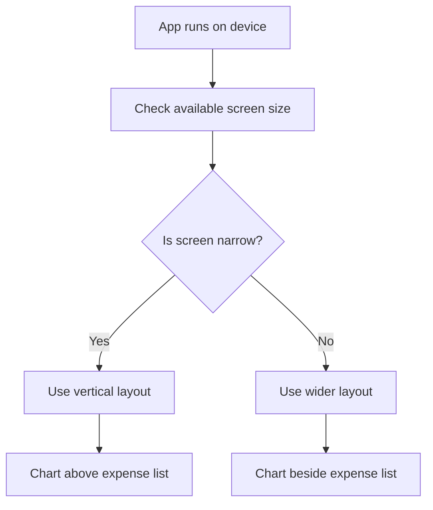
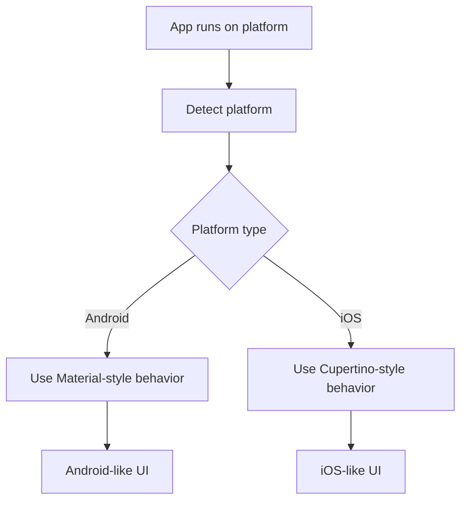
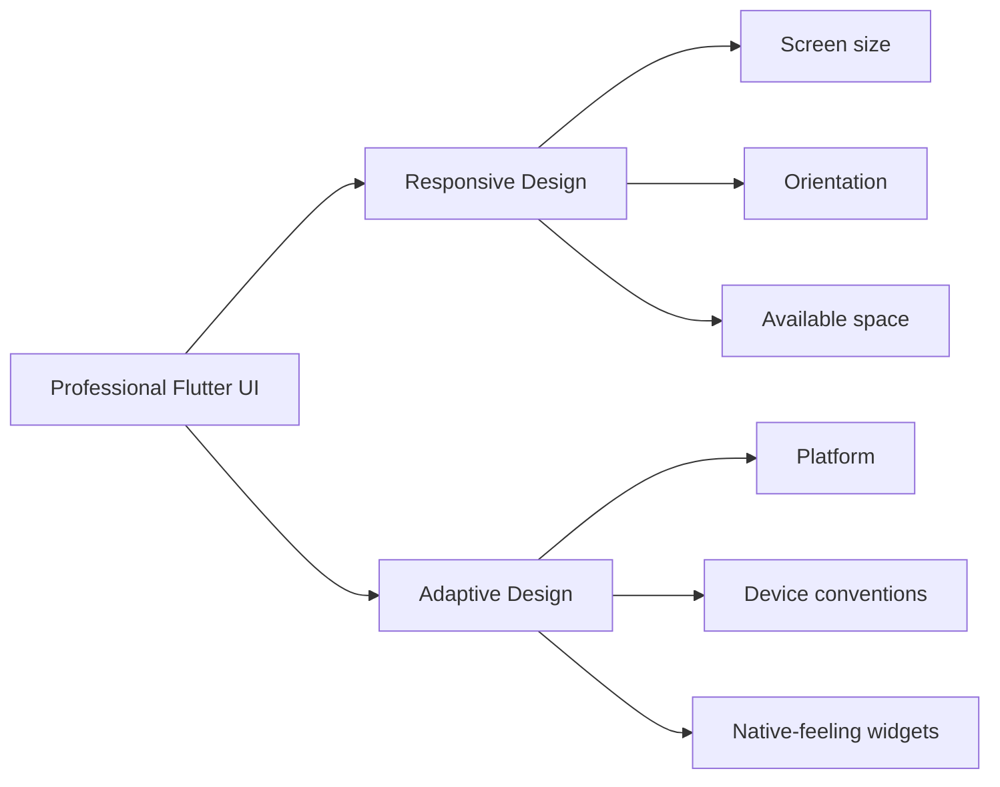
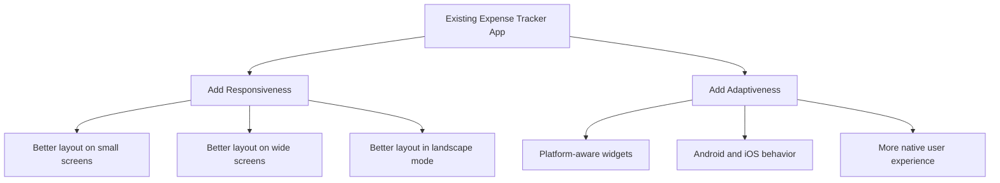

# Module Introduction

## Overview

This module introduces **responsive** and **adaptive** UI design in Flutter.

In the previous module, we built a complete Expense Tracker app. The app can:

* Add new expenses
* Delete expenses
* Undo deleted expenses
* Show expenses in a list
* Display expenses in a chart
* Support light and dark themes

In this module, we will continue working on that same app and improve it so that it works better across different screen sizes, orientations, and platforms.

---

## What This Module Is About

Modern apps are used on many different devices.

For example, a Flutter app may run on:

* Small phones
* Large phones
* Tablets
* Foldable devices
* Desktop screens
* Android devices
* iOS devices

A layout that looks good on one screen size may not look good on another.

That is why we need responsive and adaptive design.

---

## Responsive UI

A **responsive UI** changes its layout based on the available screen space.

For example, the Expense Tracker app may use one layout on a narrow phone screen and a different layout on a wider tablet screen.

Responsive design answers questions like:

* How much screen width is available?
* Should widgets be stacked vertically or placed side by side?
* Should the chart be above the list or next to the list?
* Should the layout change in landscape mode?

---

## Adaptive UI

An **adaptive UI** changes based on the platform or device conventions.

For example, Android and iOS apps often have different design expectations.

Adaptive design answers questions like:

* Is the app running on iOS or Android?
* Should the app use Material-style widgets or Cupertino-style widgets?
* Should the date picker look different on different platforms?
* Should certain controls behave differently depending on the platform?

---

## Responsive vs Adaptive

Responsive and adaptive design are related, but they are not the same.

| Concept       | Focus                           | Example                                 |
| ------------- | ------------------------------- | --------------------------------------- |
| Responsive UI | Screen size and available space | Change layout for portrait vs landscape |
| Adaptive UI   | Platform and device behavior    | Use iOS-style widgets on iOS            |

A professional Flutter app often needs both.

---

## Project Used in This Module

This module continues with the Expense Tracker app.

We will take the app from the previous module and improve its layout and behavior.

The goal is not to rebuild the app from scratch.

Instead, we will enhance the existing app so that it feels better on different devices and platforms.

---

## What You Will Learn

In this module, you will learn how to:

* Understand responsive UI design
* Understand adaptive UI design
* Detect available screen size
* React to screen width and height
* Adjust layouts based on orientation
* Use platform information
* Build adaptive widgets
* Improve the Expense Tracker layout
* Make the app feel more professional on multiple devices

---

## Why This Matters

A Flutter app can run on many platforms from a single codebase.

However, simply running on multiple platforms is not enough.

The app should also feel good on each platform.

That means:

* The layout should not feel cramped on small screens.
* The layout should not waste space on large screens.
* The app should respect platform conventions.
* UI elements should stay usable in different orientations.
* The app should remain readable and accessible.

Responsive and adaptive design help solve these problems.

---

## Example: Expense Tracker Layout

In portrait mode on a phone, the app might show:

```text id="8lpitr"
Chart
Expense List
```

But on a wider screen, it might be better to show:

```text id="9appzy"
Chart | Expense List
```

This is an example of responsive layout design.

The content is the same, but the layout changes based on the available space.

---

## Example: Platform Adaptiveness

On Android, the app may use Material Design components.

On iOS, some widgets may be replaced with Cupertino-style alternatives.

For example:

| Platform | Possible UI Style     |
| -------- | --------------------- |
| Android  | Material date picker  |
| iOS      | Cupertino date picker |
| Android  | Material dialog       |
| iOS      | Cupertino dialog      |

This is an example of adaptive UI design.

---

## Responsive Design Flow



---

## Adaptive Design Flow



---

## Responsive vs Adaptive Diagram



---

## Expense Tracker Improvement Diagram



---

## Key Concepts

| Concept         | Meaning                                                                       |
| --------------- | ----------------------------------------------------------------------------- |
| Responsive UI   | UI that adjusts to available screen space                                     |
| Adaptive UI     | UI that adjusts to platform conventions                                       |
| Screen size     | The width and height available to the app                                     |
| Orientation     | Whether the device is in portrait or landscape mode                           |
| Platform        | The operating system, such as Android or iOS                                  |
| Adaptive widget | A widget that changes behavior or appearance depending on platform or context |

---

## Key Takeaways

* This module builds on the Expense Tracker app from the previous module.
* Responsive design focuses on screen size and layout.
* Adaptive design focuses on platform-specific behavior and conventions.
* Flutter provides tools for detecting screen and platform information.
* A good app should work well on different devices and feel natural on different platforms.
* The goal is to make the Expense Tracker app more flexible, polished, and production-ready.

---

## Summary

This module introduces responsive and adaptive UI design in Flutter.

Responsive UI helps the app adjust to different screen sizes and orientations. Adaptive UI helps the app match platform expectations on Android, iOS, and other platforms.

Using the Expense Tracker app as the practical project, this module will show how to detect screen and platform information and use that information to build better Flutter layouts.
