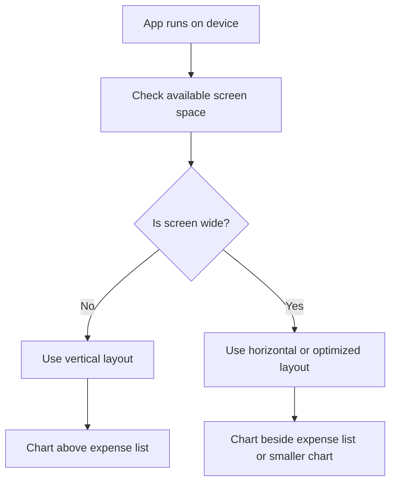
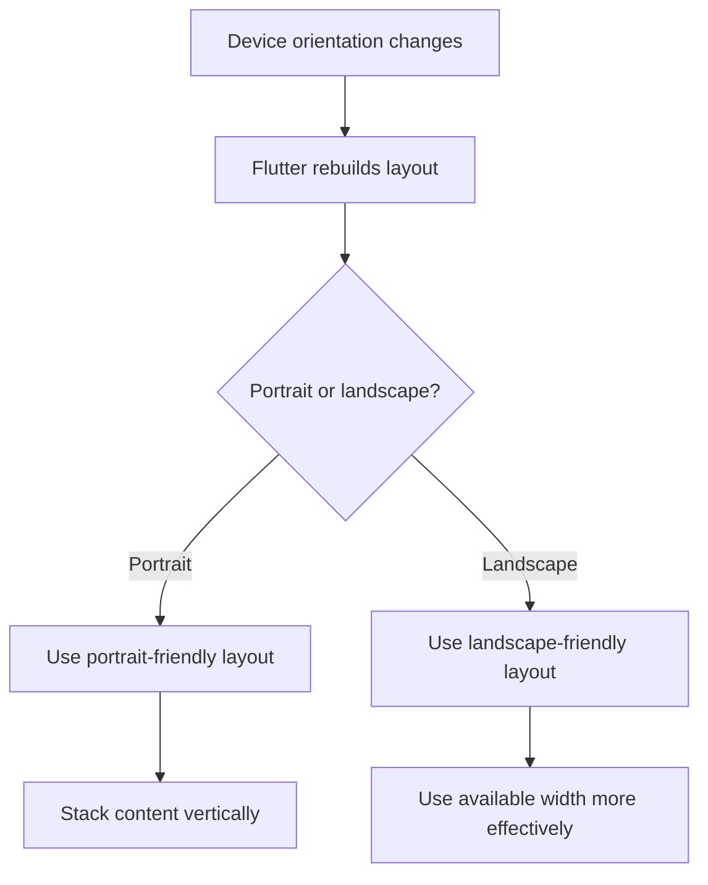
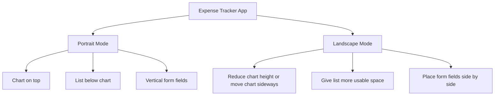
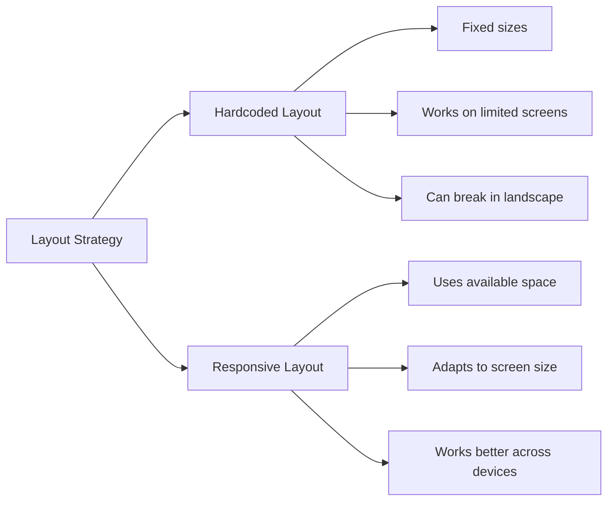

# What is Responsiveness?

## Overview

This lesson explains what **responsiveness** means in Flutter app development.

A responsive app is an app whose layout adjusts to the available screen space. The same app should still look good and remain usable on different devices, screen sizes, and orientations.

In this module, we continue working on the Expense Tracker app and improve it so that it works better in both portrait and landscape mode.

---

## Starting Point

This module builds on the Expense Tracker app from the previous section.

The app already supports:

* Adding expenses
* Deleting expenses
* Undoing deletions
* Showing expenses in a list
* Displaying expenses in a chart
* Light and dark mode

Now the next goal is to make the app responsive and adaptive.

---

## Required Project Setup

If you did not follow along in the previous module, you can start from the provided `lib` folder.

After copying the `lib` folder into a Flutter project, make sure the required packages are installed.

The app uses:

```yaml id="espuc9"
dependencies:
  uuid: ^4.0.0
  intl: ^0.19.0
```

The exact versions may differ, but the project needs both packages.

| Package | Purpose                           |
| ------- | --------------------------------- |
| `uuid`  | Generates unique IDs for expenses |
| `intl`  | Formats dates                     |

---

## What Responsiveness Means

Responsiveness means that the app adjusts its layout based on the available space.

A responsive UI should work well on:

* Small phones
* Large phones
* Tablets
* Landscape mode
* Portrait mode
* Desktop-sized screens

The app should not only fit on the screen. It should also use the available space well.

---

## Portrait vs Landscape

On a phone in portrait mode, a vertical layout often works well.

For example:

```text id="f86q7z"
Chart
Expense List
```

But when the device is rotated into landscape mode, the available width becomes much larger and the height becomes smaller.

If the app keeps the exact same vertical layout, the UI may start to look awkward.

For example:

* The chart may become too tall.
* The expense list may become too small.
* Too much horizontal space may be wasted.
* Some content may feel cramped vertically.

---

## Example Problem in the Expense Tracker App

In portrait mode, the Expense Tracker layout looks acceptable.

But in landscape mode, the current UI has problems:

* The chart takes too much vertical space.
* The expense list only gets a small amount of height.
* The list is scrollable, but it feels cramped.
* The layout does not use the wider screen efficiently.

This means the app technically works, but it is not optimized for the available screen space.

---

## Responsiveness in the Add Expense Form

The add expense form also has room for improvement.

In portrait mode, stacking fields vertically makes sense.

```text id="p1q8rf"
Title
Amount
Date Picker
Category Dropdown
Buttons
```

But in landscape mode, the screen is much wider.

So we could arrange some fields side by side.

```text id="f87wxr"
Title          Amount
Date Picker    Category Dropdown
Buttons
```

This makes better use of the available width.

---

## Responsive UI Goal

A responsive app should ask:

> How much space is available, and what layout works best for that space?

For the Expense Tracker app, this may mean:

| Screen Situation | Possible Layout                            |
| ---------------- | ------------------------------------------ |
| Portrait phone   | Chart above expense list                   |
| Landscape phone  | Chart beside expense list or smaller chart |
| Wide screen      | Use horizontal layout                      |
| Narrow screen    | Use vertical layout                        |

---

## Why Hardcoded Sizes Can Be a Problem

Hardcoded sizes can make an app look good on one device but bad on another.

Example:

```dart id="jqk5wf"
height: 300
```

This may look fine on a tall portrait screen.

But on a short landscape screen, it may take too much space.

A responsive layout should avoid depending too much on fixed pixel values.

---

## Better Approach: Use Available Space

Instead of always using fixed sizes, responsive apps use the available space.

Flutter provides tools such as:

* `MediaQuery`
* `LayoutBuilder`
* `Expanded`
* `Flexible`
* `FractionallySizedBox`
* Conditional layouts
* Orientation checks

These tools help widgets adapt to different screen sizes.

---

## Responsiveness vs Adaptiveness

Responsiveness and adaptiveness are related, but they are different concepts.

| Concept        | Meaning                                              | Example                         |
| -------------- | ---------------------------------------------------- | ------------------------------- |
| Responsiveness | Adjusting layout based on screen size or orientation | Change layout in landscape mode |
| Adaptiveness   | Adjusting behavior or style based on platform        | Use iOS-style widgets on iOS    |

This lesson focuses on responsiveness.

Adaptive behavior will be discussed separately.

---

## Responsive Layout Example

A simple responsive layout might check the available width.

```dart id="mx7b9q"
final width = MediaQuery.of(context).size.width;

if (width < 600) {
  // Use narrow layout
} else {
  // Use wide layout
}
```

This lets the app choose a layout based on screen width.

---

## Example: Portrait Layout

```text id="cvqtqj"
+----------------------+
| AppBar               |
+----------------------+
| Chart                |
|                      |
+----------------------+
| Expense List         |
|                      |
|                      |
+----------------------+
```

This layout works well when the screen is narrow and tall.

---

## Example: Landscape Layout

```text id="v6sc1a"
+--------------------------------------+
| AppBar                               |
+-------------------+------------------+
| Chart             | Expense List     |
|                   |                  |
|                   |                  |
+-------------------+------------------+
```

This layout uses the wider screen more effectively.

---

## Responsiveness Flow Diagram



---

## Orientation Flow Diagram



---

## Expense Tracker Responsiveness Diagram



---

## Hardcoded vs Responsive Layout



---

## Important Flutter Tools for Responsiveness

| Tool                   | Purpose                                                          |
| ---------------------- | ---------------------------------------------------------------- |
| `MediaQuery`           | Reads screen size, orientation, padding, and platform brightness |
| `LayoutBuilder`        | Reads constraints from the parent widget                         |
| `Expanded`             | Makes a child fill available space in a `Row` or `Column`        |
| `Flexible`             | Lets a child flexibly use available space                        |
| `FractionallySizedBox` | Sizes a child as a fraction of its parent                        |
| `OrientationBuilder`   | Builds different layouts based on orientation                    |

---

## Key Takeaways

* Responsiveness means adapting the UI to the available screen space.
* A layout that works in portrait mode may not work well in landscape mode.
* The Expense Tracker app currently works in landscape mode, but it is not optimized.
* Responsive design improves usability on different devices.
* Avoid hardcoding fixed sizes whenever possible.
* Think in terms of flexible layouts and available space.
* Flutter provides built-in tools to help build responsive UIs.

---

## Summary

Responsiveness is about making an app layout adjust to different screen sizes and orientations.

In the Expense Tracker app, the current portrait layout works reasonably well, but the landscape layout looks awkward. The chart takes too much space, and the expense list becomes too cramped.

In this module, we will improve the app so that it reacts better to the available screen space and provides a better user experience across devices and orientations.
