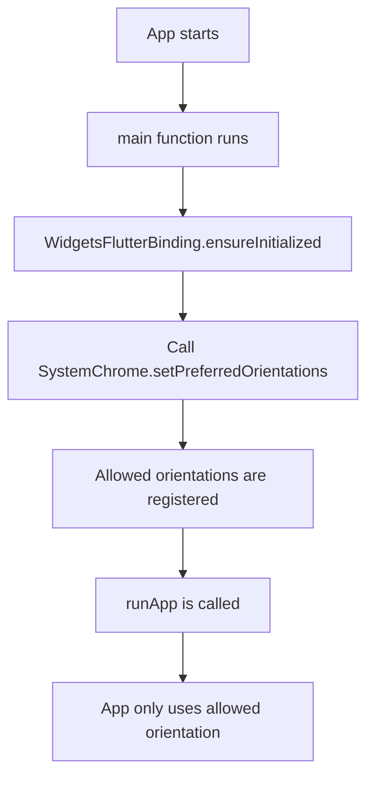
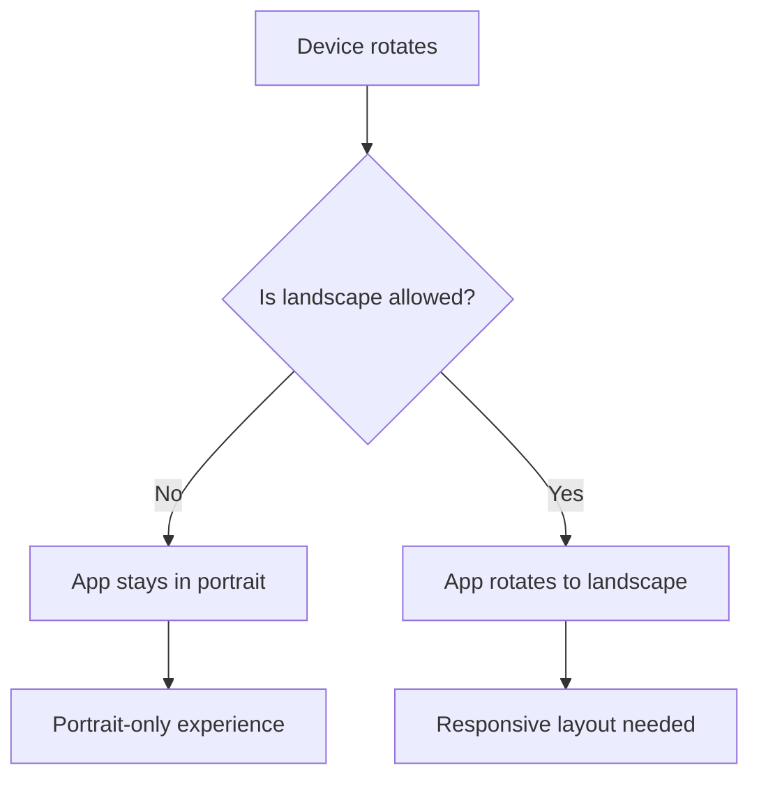
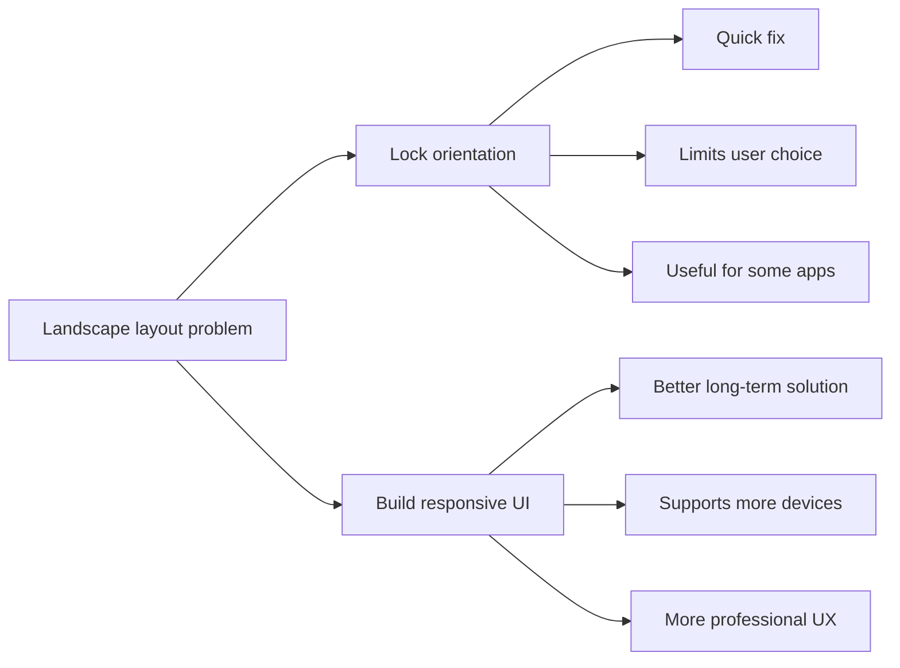

# Locking the Device Orientation

## Overview

This lesson explains how to lock a Flutter app to a specific device orientation.

Sometimes an app is only designed for one orientation, such as portrait mode. In that case, you can prevent the app from rotating into landscape mode.

Flutter provides this feature through the `SystemChrome` class from the `services.dart` package.

However, locking orientation should usually be treated as a quick solution. For many apps, building a responsive layout that works in both portrait and landscape mode is the better long-term approach.

---

## Why Lock Device Orientation?

In the Expense Tracker app, the portrait layout works well.

But when the device is rotated into landscape mode, the UI may look bad:

* The chart can take too much space.
* The expense list can become too small.
* The layout may feel cramped vertically.
* The form may not use the available width efficiently.

One possible solution is to disable landscape mode completely.

---

## Required Import

To control device orientation, import `services.dart`.

```dart id="24lj4f"
import 'package:flutter/services.dart';
```

This gives access to:

```dart id="cd4yta"
SystemChrome
```

and:

```dart id="7n9sd8"
DeviceOrientation
```

---

## Basic Portrait Lock Example

```dart id="ol27bh"
import 'package:flutter/material.dart';
import 'package:flutter/services.dart';

import 'app.dart';

void main() async {
  WidgetsFlutterBinding.ensureInitialized();

  await SystemChrome.setPreferredOrientations([
    DeviceOrientation.portraitUp,
  ]);

  runApp(const App());
}
```

This locks the app to portrait mode.

---

## Why `main()` Becomes `async`

`SystemChrome.setPreferredOrientations()` returns a `Future`.

That means orientation locking is an asynchronous operation.

So we make `main()` async:

```dart id="8aeb7t"
void main() async {
  // async setup
}
```

Then we wait for the orientation lock to complete:

```dart id="j71rd0"
await SystemChrome.setPreferredOrientations([
  DeviceOrientation.portraitUp,
]);
```

Only after that do we run the app:

```dart id="8sp4hh"
runApp(const App());
```

---

## Why `WidgetsFlutterBinding.ensureInitialized()` Is Needed

Before calling platform-related APIs before `runApp()`, initialize Flutter's binding.

```dart id="ag65tk"
WidgetsFlutterBinding.ensureInitialized();
```

This ensures that Flutter is ready to communicate with the underlying platform.

Since `SystemChrome` talks to the platform, this line should be called before `SystemChrome.setPreferredOrientations()`.

---

## Locking to Portrait Mode

To allow only normal portrait mode:

```dart id="pk471o"
await SystemChrome.setPreferredOrientations([
  DeviceOrientation.portraitUp,
]);
```

This means the app stays upright in portrait orientation.

---

## Allowing Both Portrait Directions

You can also allow both portrait orientations:

```dart id="wmk3ff"
await SystemChrome.setPreferredOrientations([
  DeviceOrientation.portraitUp,
  DeviceOrientation.portraitDown,
]);
```

This allows the app to rotate between normal portrait and upside-down portrait.

---

## Locking to Landscape Mode

To allow only landscape mode:

```dart id="xih53f"
await SystemChrome.setPreferredOrientations([
  DeviceOrientation.landscapeLeft,
  DeviceOrientation.landscapeRight,
]);
```

This can be useful for games, video apps, or apps designed specifically for wide screens.

---

## Allowing All Orientations Again

To remove the orientation lock and let the operating system decide, pass an empty list.

```dart id="kz2us0"
await SystemChrome.setPreferredOrientations([]);
```

This tells Flutter to defer to the system default.

---

## Modern Recommended Code

A clean modern version uses `async` and `await`.

```dart id="peixc9"
import 'package:flutter/material.dart';
import 'package:flutter/services.dart';

import 'widgets/expenses.dart';

void main() async {
  WidgetsFlutterBinding.ensureInitialized();

  await SystemChrome.setPreferredOrientations([
    DeviceOrientation.portraitUp,
  ]);

  runApp(
    const MaterialApp(
      home: Expenses(),
    ),
  );
}
```

This is easier to read than using `.then(...)`.

---

## Older `.then()` Style

Some course videos may show code like this:

```dart id="3u71hp"
void main() {
  WidgetsFlutterBinding.ensureInitialized();

  SystemChrome.setPreferredOrientations([
    DeviceOrientation.portraitUp,
  ]).then((fn) {
    runApp(
      const MaterialApp(
        home: Expenses(),
      ),
    );
  });
}
```

This works, but the `async` / `await` version is usually cleaner.

---

## Comparing Both Styles

| Style         | Example                                   | Readability                  |
| ------------- | ----------------------------------------- | ---------------------------- |
| `.then(...)`  | `setPreferredOrientations(...).then(...)` | Works, but more nested       |
| `async/await` | `await setPreferredOrientations(...)`     | Cleaner and easier to follow |

Recommended:

```dart id="cnetet"
void main() async {
  WidgetsFlutterBinding.ensureInitialized();

  await SystemChrome.setPreferredOrientations([
    DeviceOrientation.portraitUp,
  ]);

  runApp(const App());
}
```

---

## DeviceOrientation Values

Flutter provides several orientation values.

| Value                              | Meaning                             |
| ---------------------------------- | ----------------------------------- |
| `DeviceOrientation.portraitUp`     | Normal portrait orientation         |
| `DeviceOrientation.portraitDown`   | Upside-down portrait orientation    |
| `DeviceOrientation.landscapeLeft`  | Landscape orientation rotated left  |
| `DeviceOrientation.landscapeRight` | Landscape orientation rotated right |

You provide one or more of these values in a list.

---

## Full Expense Tracker Example

```dart id="q1aqd0"
import 'package:flutter/material.dart';
import 'package:flutter/services.dart';

import 'widgets/expenses.dart';

final kColorScheme = ColorScheme.fromSeed(
  seedColor: const Color.fromARGB(255, 96, 59, 181),
);

final kDarkColorScheme = ColorScheme.fromSeed(
  brightness: Brightness.dark,
  seedColor: const Color.fromARGB(255, 5, 99, 125),
);

void main() async {
  WidgetsFlutterBinding.ensureInitialized();

  await SystemChrome.setPreferredOrientations([
    DeviceOrientation.portraitUp,
  ]);

  runApp(
    MaterialApp(
      theme: ThemeData().copyWith(
        colorScheme: kColorScheme,
      ),
      darkTheme: ThemeData.dark().copyWith(
        colorScheme: kDarkColorScheme,
      ),
      home: const Expenses(),
    ),
  );
}
```

---

## Why Locking Orientation Is Only a Quick Fix

Locking orientation can solve layout problems quickly.

But it also limits the user.

For example:

* Tablet users may prefer landscape mode.
* Some users may use stands or keyboards.
* Landscape mode may be better for wide layouts.
* Larger screens should often take advantage of available space.

For the Expense Tracker app, landscape mode can be improved with a responsive layout.

So after demonstrating orientation locking, it makes sense to remove the lock and build a better responsive UI.

---

## Removing the Orientation Lock

To continue building a responsive app, remove or comment out the orientation-locking code.

Remove this import:

```dart id="e0v1hr"
import 'package:flutter/services.dart';
```

Remove this setup:

```dart id="pusw2w"
WidgetsFlutterBinding.ensureInitialized();

await SystemChrome.setPreferredOrientations([
  DeviceOrientation.portraitUp,
]);
```

Then return to a normal `main()` function:

```dart id="rrh40i"
void main() {
  runApp(
    const App(),
  );
}
```

or keep your full `MaterialApp` setup without the orientation lock.

---

## Locking Orientation Flow Diagram



---

## Portrait Lock Diagram



---

## Responsive Design vs Orientation Lock



---

## Common Use Cases for Orientation Lock

| App Type                | Common Orientation |
| ----------------------- | ------------------ |
| Simple form app         | Portrait           |
| Reading app             | Portrait or both   |
| Video player            | Landscape          |
| Mobile game             | Landscape          |
| Camera app              | Depends on feature |
| Tablet productivity app | Usually both       |

---

## Platform Notes

Orientation locking may not behave identically on every platform or device.

Important things to remember:

* Some large Android devices may restrict orientation locking.
* On iPad, orientation locking may require disabling multitasking.
* Some devices may letterbox apps that lock orientation.
* Testing on real devices is important.

Because of these limitations, responsive layouts are usually more flexible than forcing one orientation.

---

## Common Mistakes

### Mistake 1: Forgetting the Services Import

Incorrect:

```dart id="y4bca4"
// SystemChrome is unavailable
```

Correct:

```dart id="xd9m1p"
import 'package:flutter/services.dart';
```

---

### Mistake 2: Calling `SystemChrome` Without Initializing Binding

Incorrect:

```dart id="uxvg3h"
void main() async {
  await SystemChrome.setPreferredOrientations([
    DeviceOrientation.portraitUp,
  ]);

  runApp(const App());
}
```

Better:

```dart id="em2ofv"
void main() async {
  WidgetsFlutterBinding.ensureInitialized();

  await SystemChrome.setPreferredOrientations([
    DeviceOrientation.portraitUp,
  ]);

  runApp(const App());
}
```

---

### Mistake 3: Running the App Before the Orientation Is Set

Incorrect:

```dart id="ahxkij"
void main() {
  SystemChrome.setPreferredOrientations([
    DeviceOrientation.portraitUp,
  ]);

  runApp(const App());
}
```

Better:

```dart id="uohgkl"
void main() async {
  WidgetsFlutterBinding.ensureInitialized();

  await SystemChrome.setPreferredOrientations([
    DeviceOrientation.portraitUp,
  ]);

  runApp(const App());
}
```

---

## Key Takeaways

* Use `SystemChrome.setPreferredOrientations()` to lock app orientation.
* Import `package:flutter/services.dart`.
* Call orientation locking before `runApp()`.
* Use `WidgetsFlutterBinding.ensureInitialized()` before calling platform APIs.
* `setPreferredOrientations()` accepts a list of `DeviceOrientation` values.
* Use `async` / `await` for cleaner startup code.
* Locking orientation is useful in some apps, but it can limit the user experience.
* For the Expense Tracker app, building a responsive layout is the better next step.

---

## Summary

Flutter allows you to lock an app to specific device orientations with `SystemChrome.setPreferredOrientations()`.

To lock the Expense Tracker app to portrait mode, call this method before `runApp()` and pass `DeviceOrientation.portraitUp`.

However, locking orientation is usually only a quick fix. Since the Expense Tracker app can be improved to work in both portrait and landscape mode, the better solution is to remove the orientation lock and build a responsive layout.
