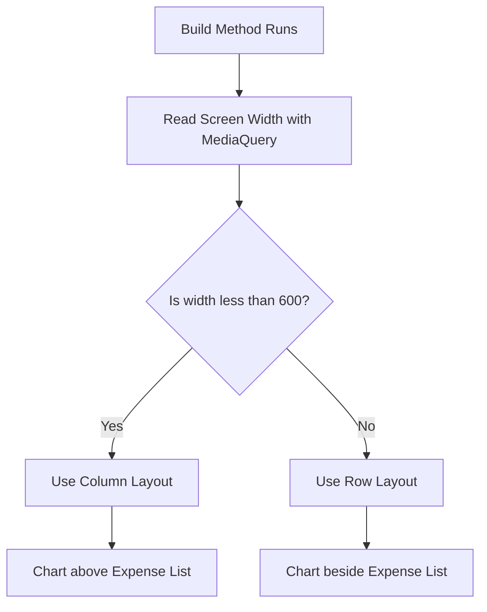
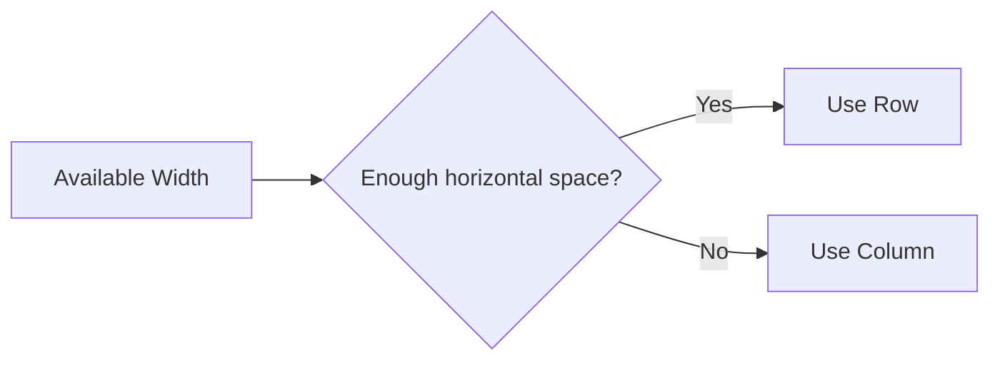
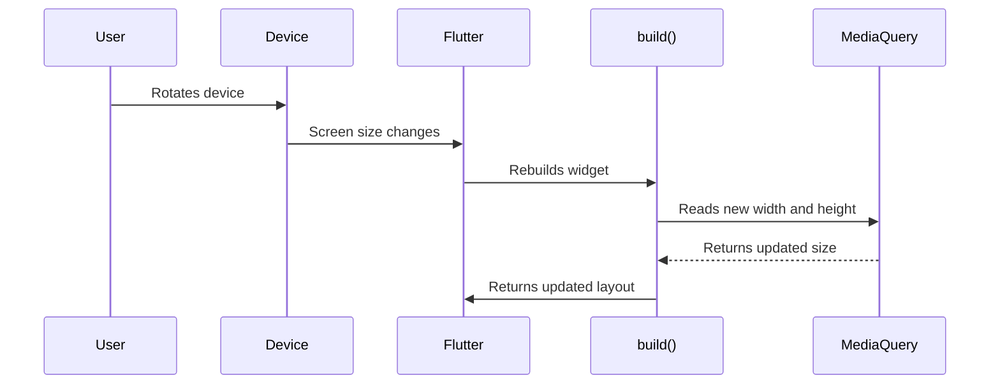
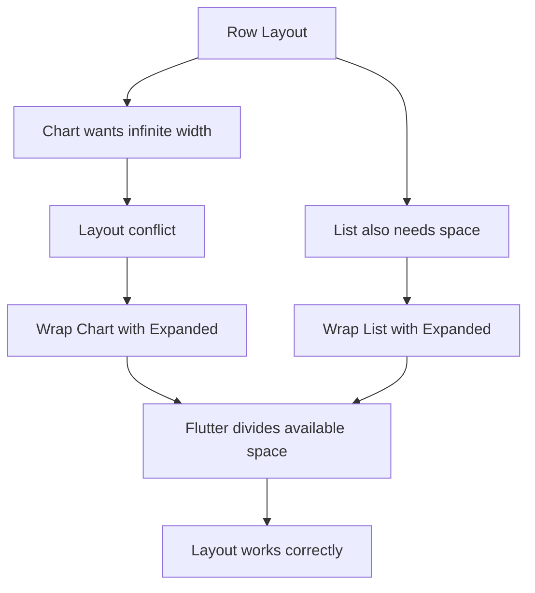
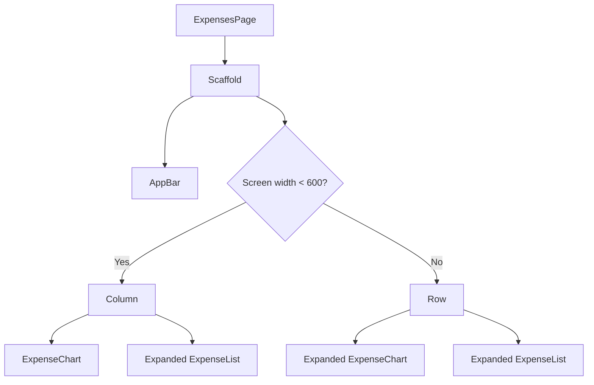
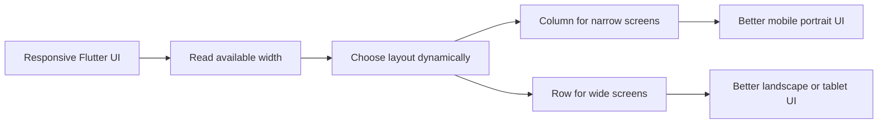

# Updating the UI Based on the Available Space

## Overview

This lecture explains how to build a responsive Flutter UI that adapts to the actual screen space available at runtime.

Instead of designing only for portrait or landscape mode, we should focus on the available width. For example, a phone in landscape mode or a tablet in portrait mode may both provide enough horizontal space to show content side by side.

In this example, the app displays:

* an expense chart
* an expense list

On narrow screens, the chart should appear above the list.
On wide screens, the chart should appear beside the list.

---

## The Problem

In portrait mode, the layout works well because the screen is tall and narrow.

```text
Portrait Layout

+----------------------+
|      AppBar          |
+----------------------+
|      Chart           |
|                      |
+----------------------+
|      Expense List    |
|                      |
|                      |
+----------------------+
```

However, in landscape mode, the chart takes too much vertical space, leaving very little room for the expense list.

```text
Landscape Problem

+----------------------------------+
|              AppBar              |
+----------------------------------+
|              Chart               |
|                                  |
+----------------------------------+
|        Expense List too small     |
+----------------------------------+
```

A better layout for wide screens is to place the chart on the left and the expense list on the right.

```text
Wide Screen Layout

+----------------------------------+
|              AppBar              |
+----------------+-----------------+
|     Chart      |  Expense List    |
|                |                 |
|                |                 |
+----------------+-----------------+
```

---

## Main Idea

The UI should change depending on the available width.

If the screen width is small, use a `Column`.

If the screen width is large, use a `Row`.



---

## Why Width Matters More Than Orientation

Instead of only checking whether the device is in portrait or landscape mode, it is often better to check the available width.

A tablet in portrait mode may still have enough width for a side-by-side layout.



This makes the layout more flexible across phones, tablets, foldables, and desktop screens.

---

## Using MediaQuery

Flutter provides the `MediaQuery` class to access information about the current screen and device environment.

The most important value here is:

```dart
MediaQuery.of(context).size
```

This returns a `Size` object containing:

```dart
width
height
```

Example:

```dart
final width = MediaQuery.of(context).size.width;
final height = MediaQuery.of(context).size.height;
```

When the device rotates, Flutter automatically rebuilds the widget. This means the `build()` method runs again, and `MediaQuery` returns the updated width and height.



---

## Column vs Row

A `Column` places widgets vertically.

```text
Column

Chart
  ↓
Expense List
```

A `Row` places widgets horizontally.

```text
Row

Chart  →  Expense List
```

In this lecture, we switch between these two widgets depending on screen width.

---

## Code Example

```dart
class ExpensesPage extends StatelessWidget {
  const ExpensesPage({super.key});

  @override
  Widget build(BuildContext context) {
    final width = MediaQuery.of(context).size.width;

    return Scaffold(
      appBar: AppBar(
        title: const Text('Expenses'),
      ),
      body: width < 600
          ? Column(
              children: [
                ExpenseChart(),
                Expanded(
                  child: ExpenseList(),
                ),
              ],
            )
          : Row(
              children: [
                Expanded(
                  child: ExpenseChart(),
                ),
                Expanded(
                  child: ExpenseList(),
                ),
              ],
            ),
    );
  }
}
```

---

## Important Detail: Why Expanded Is Needed

When the chart is placed inside a `Row`, it may cause a layout problem if the chart internally tries to take infinite width.

For example, the chart may contain a `Container` like this:

```dart
Container(
  width: double.infinity,
  child: ...
)
```

This works inside a `Column`, because the parent gives the child a clear width.

But inside a `Row`, both the parent and the child may try to take as much width as possible. Flutter cannot decide how much space each child should receive.

That can cause a layout error.

The solution is to wrap the chart inside `Expanded`.

```dart
Expanded(
  child: ExpenseChart(),
)
```

`Expanded` tells Flutter to divide the available horizontal space between the children of the `Row`.



---

## Final Responsive Layout Structure



---

## Key Points

* `MediaQuery.of(context).size` gives access to the current screen size.
* `size.width` can be used to decide which layout should be rendered.
* A `Column` is better for narrow screens.
* A `Row` is better for wide screens.
* Flutter automatically rebuilds the widget when the screen size changes.
* This allows the UI to update when the device is rotated.
* `Expanded` is important when using flexible children inside a `Row`.
* Responsive design means adapting the layout to the available space, not just the device orientation.

---

## When to Use MediaQuery

Use `MediaQuery` when you need information about the whole screen, such as:

* screen width
* screen height
* orientation-related layout decisions
* safe area padding
* text scale factor
* device pixel ratio

Example:

```dart
final size = MediaQuery.of(context).size;
final width = size.width;
final height = size.height;
```

---

## MediaQuery vs LayoutBuilder

`MediaQuery` reads the size of the entire screen.

`LayoutBuilder` reads the size available to a specific widget inside the widget tree.

| Tool                 | Best For                                         |
| -------------------- | ------------------------------------------------ |
| `MediaQuery`         | Reading full screen size                         |
| `LayoutBuilder`      | Reading available space inside a specific widget |
| `OrientationBuilder` | Reacting to portrait or landscape orientation    |

For this example, `MediaQuery` works well because we want to adjust the main page layout based on the available screen width.

---

## Summary

To make the Flutter UI responsive, read the available screen width using `MediaQuery`.

Then conditionally render different widget trees.

For narrow screens, use a `Column`.

For wide screens, use a `Row`.

This allows the UI to adapt automatically when the device is rotated or when the app runs on different screen sizes.


