# Understanding Size Constraints in Flutter

## Overview

This lecture explains one of the most important concepts in Flutter layout: **size constraints**.

Flutter does not allow widgets to choose any size they want freely. Instead, every widget receives constraints from its parent, chooses a size within those constraints, and then reports that size back to the parent.

The core rule is:

```text
Constraints go down.
Sizes go up.
Parent sets position.
```

Understanding this rule helps explain why some layouts work correctly, while others produce errors such as infinite width or infinite height issues.

---

## The Golden Rule of Flutter Layout

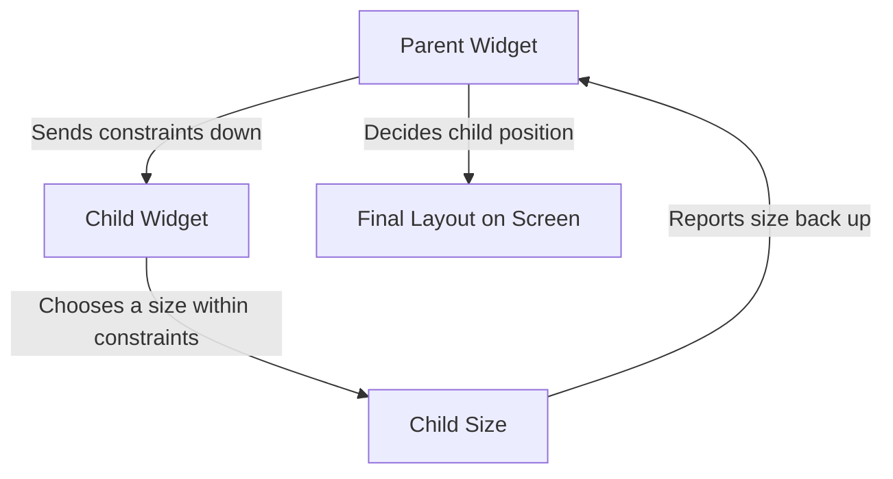

In Flutter:

1. The parent gives constraints to the child.
2. The child chooses a size within those constraints.
3. The child reports its size back to the parent.
4. The parent decides where to place the child.

---

## What Are Constraints?

A constraint defines the minimum and maximum size a widget is allowed to take.

Flutter represents this using the `BoxConstraints` class.

```dart
BoxConstraints(
  minWidth: 100,
  maxWidth: 300,
  minHeight: 50,
  maxHeight: 150,
)
```

This means the child must choose a size within this range:

```text
Width:  between 100 and 300
Height: between 50 and 150
```

---

## Basic Constraint Flow

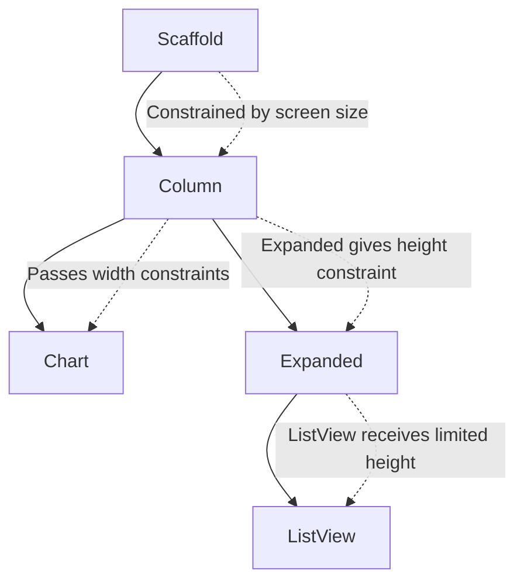

A widget cannot simply become bigger than the space its parent allows.

For example, if a `Column` is placed inside a `Scaffold`, the `Scaffold` limits the available width and height to the size of the screen.

---

## Column Size Behavior

A `Column` has its own sizing behavior.

By default:

* It tries to take as much height as possible.
* Its width depends on its children.
* It places children vertically.
* It may give its children unbounded height.

```text
Column

+----------------------+
| Child 1              |
+----------------------+
| Child 2              |
+----------------------+
| Child 3              |
+----------------------+
```

A `Column` works well inside a `Scaffold` because the `Scaffold` gives it screen-based constraints.

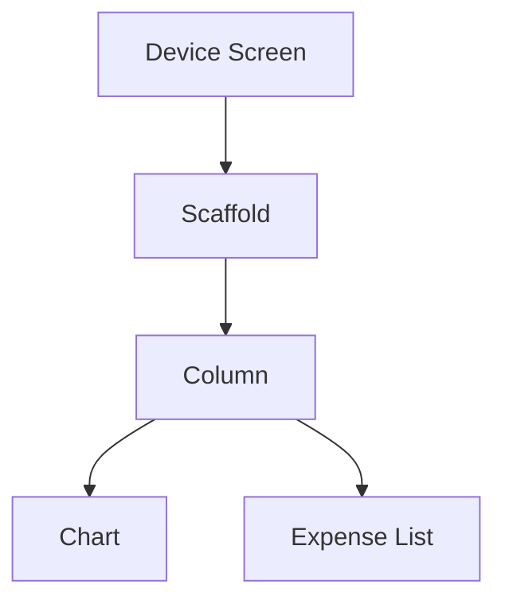

The `Scaffold` prevents the `Column` from growing beyond the screen.

---

## Why Layout Errors Happen

Layout errors often happen when a widget wants infinite space, but its parent does not give clear limits.

A common example is placing a scrollable widget such as `ListView` inside a `Column`.

```dart
Column(
  children: [
    Chart(),
    ListView(
      children: [
        ExpenseItem(),
        ExpenseItem(),
      ],
    ),
  ],
)
```

This can fail because:

* `Column` may not give a fixed height to its children.
* `ListView` wants as much vertical space as possible.
* Flutter cannot determine the final height of the `ListView`.

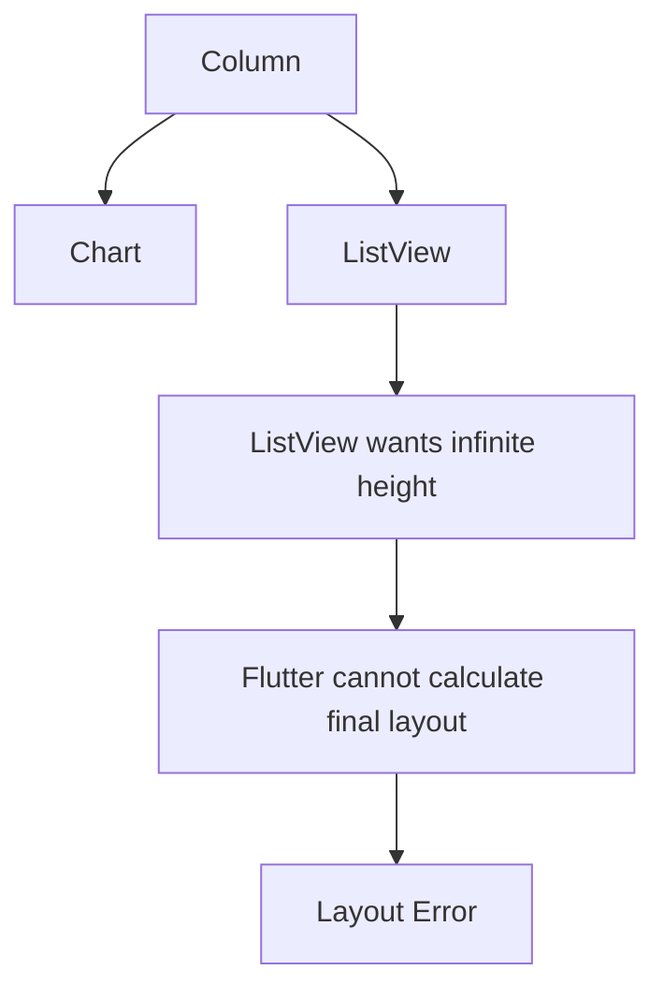

---

## The Problem with Unbounded Height

A `ListView` is scrollable. Because it can scroll, it naturally wants to take as much height as possible.

But if the parent does not limit its height, the `ListView` receives unbounded height.

```text
Column gives no fixed height
        ↓
ListView asks for infinite height
        ↓
Flutter cannot lay it out
```

This is why a `ListView` inside a `Column` often needs `Expanded`, `Flexible`, or a fixed height.

---

## Fixing the Problem with Expanded

`Expanded` tells Flutter that a child should take the remaining available space inside a `Row` or `Column`.

```dart
Column(
  children: [
    Chart(),
    Expanded(
      child: ListView(
        children: [
          ExpenseItem(),
          ExpenseItem(),
        ],
      ),
    ),
  ],
)
```

Now the `ListView` receives a real height limit.

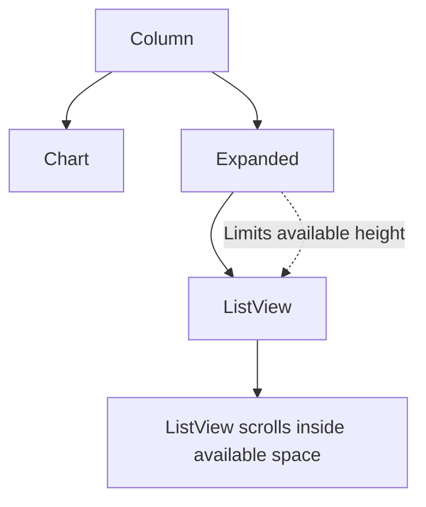

`Expanded` does not mean infinite space.
It means: **take the remaining available space within the parent constraints**.

---

## Why the Chart Failed Inside a Row

In the previous responsive layout example, the chart was moved into a `Row`.

The chart internally used a `Container` with:

```dart
width: double.infinity
```

This means the chart tries to take as much width as possible.

That works inside some parents, but it becomes a problem inside a `Row`.

```dart
Row(
  children: [
    ExpenseChart(),
    ExpenseList(),
  ],
)
```

The issue:

```text
Row wants horizontal space
Chart wants infinite width
List also needs width
Flutter cannot decide how much width each child should get
```

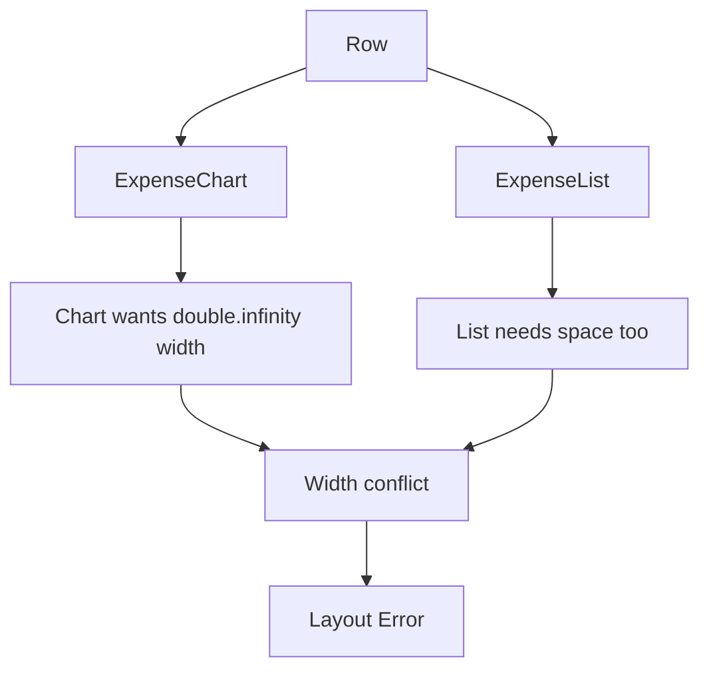

---

## Fixing the Row Problem with Expanded

The solution is to wrap the chart and list with `Expanded`.

```dart
Row(
  children: [
    Expanded(
      child: ExpenseChart(),
    ),
    Expanded(
      child: ExpenseList(),
    ),
  ],
)
```

Now Flutter can divide the available horizontal space between both widgets.

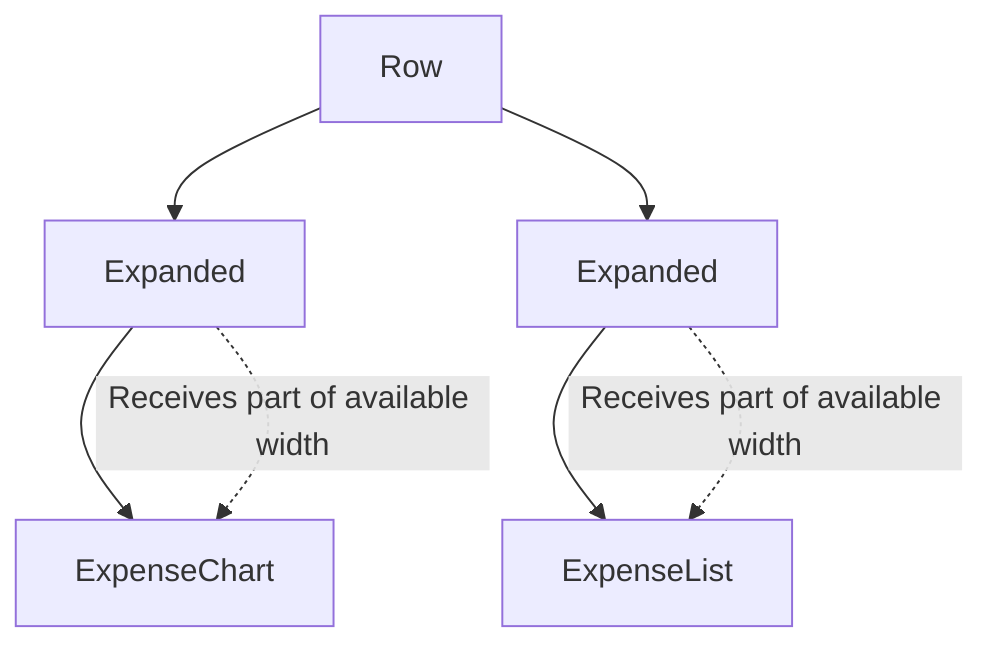

This gives the chart and list clear width constraints.

---

## Expanded in a Column

Inside a `Column`, `Expanded` controls height.

```dart
Column(
  children: [
    Header(),
    Expanded(
      child: ListView(),
    ),
  ],
)
```

```text
Column height
┌──────────────────────┐
│ Header               │
├──────────────────────┤
│ Expanded ListView    │
│ fills remaining      │
│ vertical space       │
└──────────────────────┘
```

---

## Expanded in a Row

Inside a `Row`, `Expanded` controls width.

```dart
Row(
  children: [
    Expanded(
      child: Chart(),
    ),
    Expanded(
      child: ExpenseList(),
    ),
  ],
)
```

```text
Row width
┌──────────────┬──────────────┐
│ Chart        │ Expense List │
│ Expanded     │ Expanded     │
└──────────────┴──────────────┘
```

---

## Using Flex Values

`Expanded` also supports a `flex` value.

```dart
Row(
  children: [
    Expanded(
      flex: 2,
      child: Container(color: Colors.red),
    ),
    Expanded(
      flex: 1,
      child: Container(color: Colors.green),
    ),
  ],
)
```

This means:

```text
Red container gets 2 parts.
Green container gets 1 part.
```

So the red container gets twice as much width as the green container.

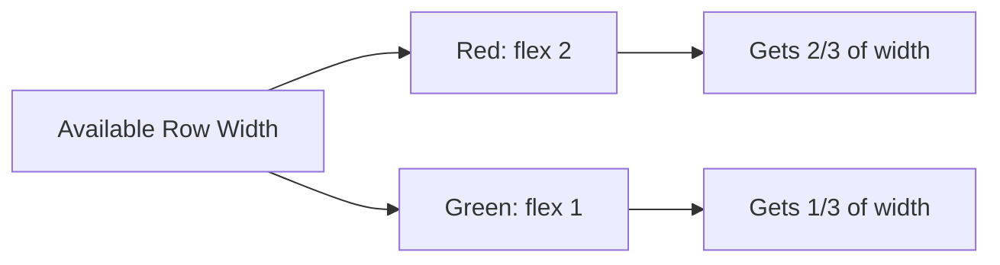

---

## ConstrainedBox Example

`ConstrainedBox` lets you manually apply constraints to a child widget.

```dart
ConstrainedBox(
  constraints: const BoxConstraints(
    minWidth: 100,
    maxWidth: 300,
    minHeight: 50,
    maxHeight: 150,
  ),
  child: Container(
    color: Colors.blue,
    child: const Text('Constrained Container'),
  ),
)
```

The child can only choose a size inside the limits defined by the `BoxConstraints`.

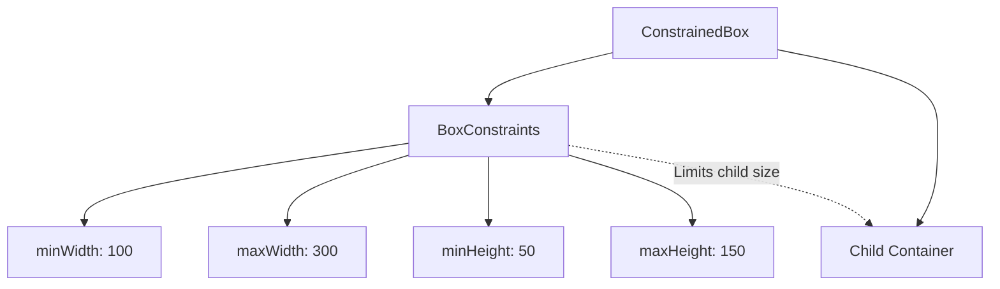

---

## Common Constraint Problems

| Problem                                                | Cause                                        | Common Fix                                  |
| ------------------------------------------------------ | -------------------------------------------- | ------------------------------------------- |
| `ListView` inside `Column` fails                       | ListView gets unbounded height               | Wrap ListView with `Expanded`               |
| `Container(width: double.infinity)` inside `Row` fails | Child wants infinite width                   | Wrap child with `Expanded`                  |
| Nested `Column` causes layout error                    | Inner Column may receive unbounded height    | Use `Expanded`, `Flexible`, or fixed height |
| Widget ignores width or height                         | Parent constraints override child preference | Check parent constraints                    |
| Scrollable widget becomes too large                    | No clear size limit                          | Use `SizedBox`, `Expanded`, or `shrinkWrap` |

---

## Important Mental Model

A child can have size preferences, but the parent constraints are stronger.

For example, a child may want infinite width:

```dart
Container(
  width: double.infinity,
)
```

But if the parent only allows 300 pixels, the child cannot exceed 300 pixels.

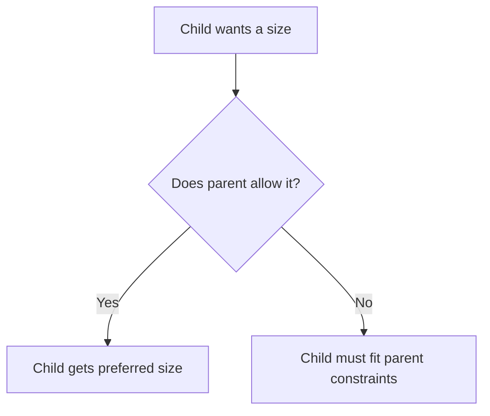

---

## Flutter DevTools Layout Explorer

Flutter DevTools can help inspect layout constraints.

With the Layout Explorer, you can check:

* widget size
* parent constraints
* child constraints
* flex behavior
* overflow issues

This is useful when a widget does not appear or when Flutter shows a layout error.

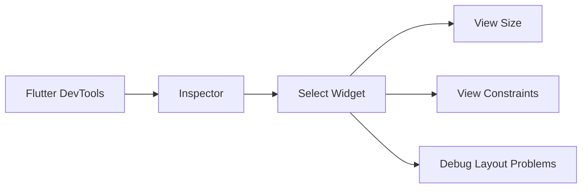

---

## Final Example: Responsive Expenses Layout

```dart
class ExpensesPage extends StatelessWidget {
  const ExpensesPage({super.key});

  @override
  Widget build(BuildContext context) {
    final width = MediaQuery.of(context).size.width;

    return Scaffold(
      appBar: AppBar(
        title: const Text('Expenses'),
      ),
      body: width < 600
          ? Column(
              children: [
                ExpenseChart(),
                Expanded(
                  child: ExpenseList(),
                ),
              ],
            )
          : Row(
              children: [
                Expanded(
                  child: ExpenseChart(),
                ),
                Expanded(
                  child: ExpenseList(),
                ),
              ],
            ),
    );
  }
}
```

---

## Final Layout Flow

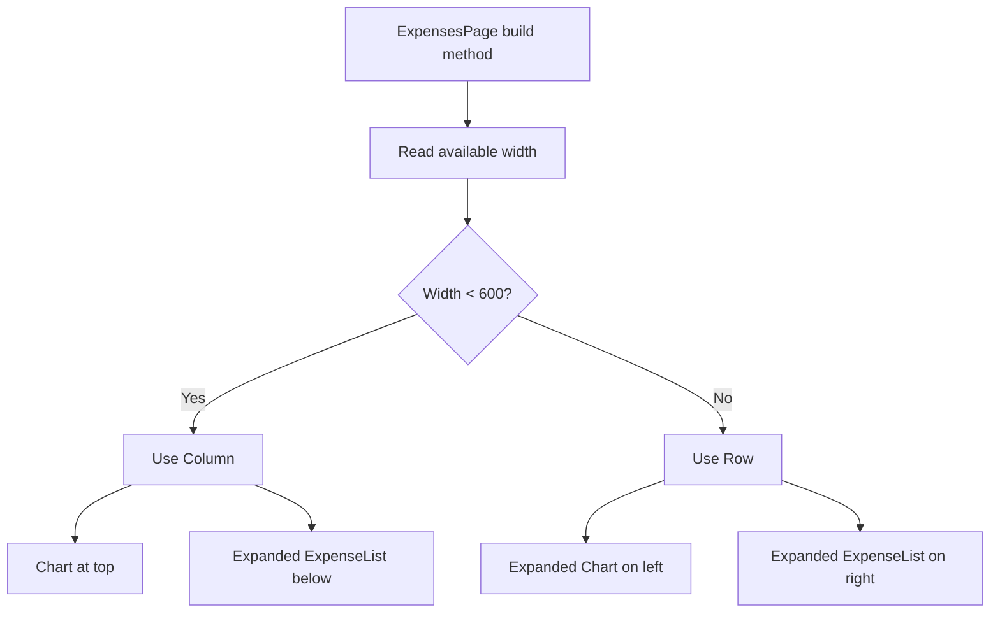

---

## Key Points

* Flutter layout is based on constraints.
* Parents send constraints down to children.
* Children choose a size within those constraints.
* Children report their size back to parents.
* Parents decide where children are positioned.
* `Column` and `ListView` can create unbounded height problems.
* `Row` and `double.infinity` can create unbounded width problems.
* `Expanded` solves many constraint problems inside `Row` and `Column`.
* `BoxConstraints` controls minimum and maximum width and height.
* Understanding constraints makes layout errors much easier to fix.

---

## Summary

Flutter widgets are not sized in isolation. Every widget is sized based on the constraints it receives from its parent.

The most important rule is:

```text
Constraints go down.
Sizes go up.
Parent sets position.
```

When a widget tries to take infinite space inside a parent that does not provide clear limits, Flutter cannot build the layout.

Use widgets like `Expanded`, `Flexible`, `SizedBox`, and `ConstrainedBox` to give children clear size boundaries.

Understanding this system is essential for building responsive Flutter layouts and fixing common UI errors.
