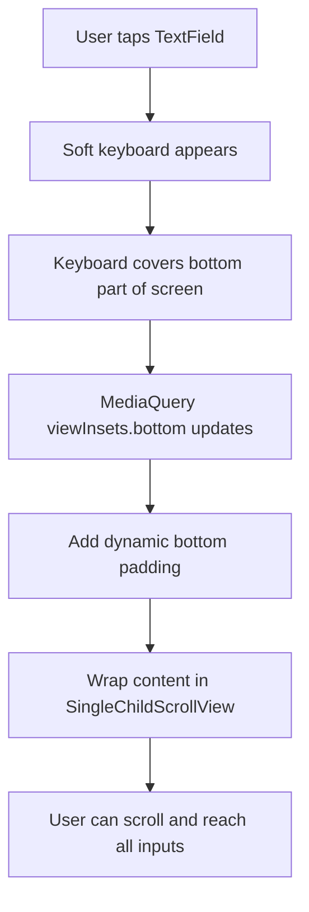
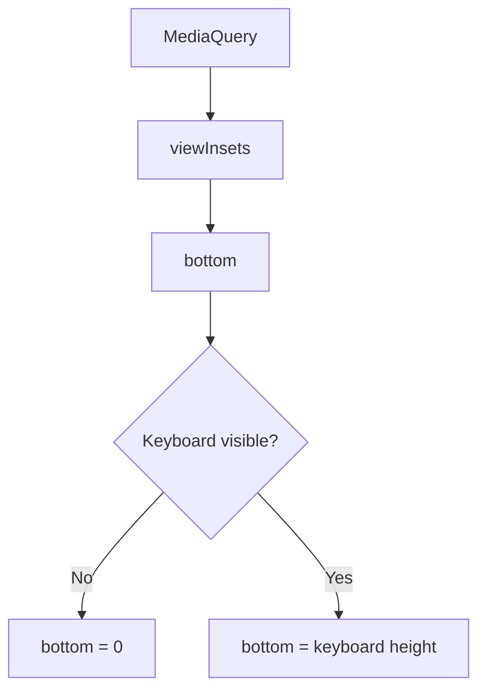
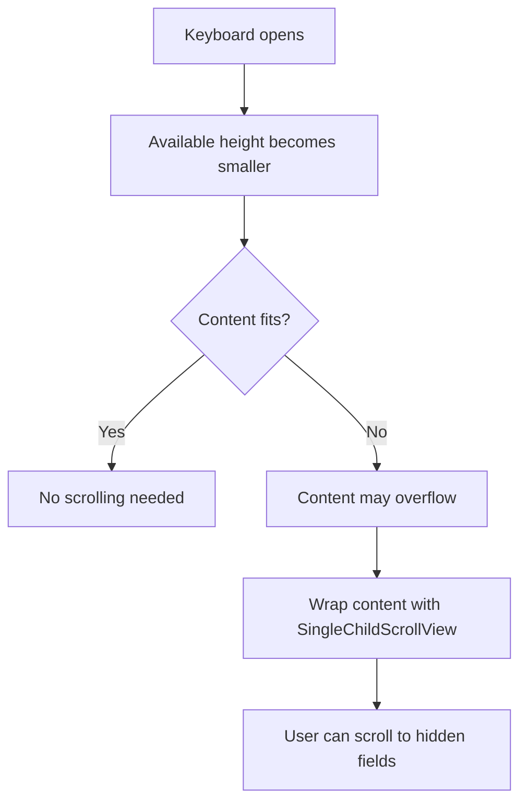
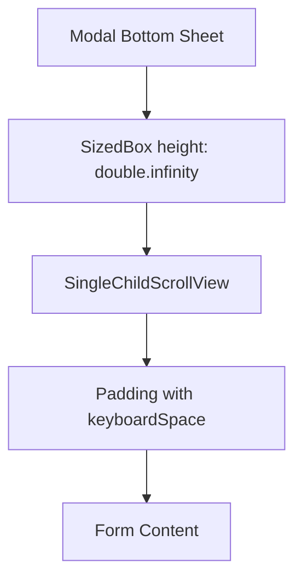
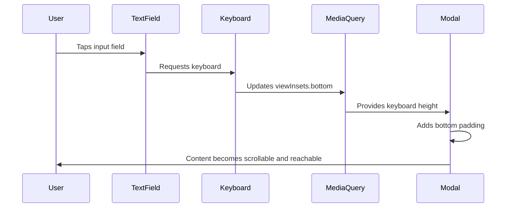
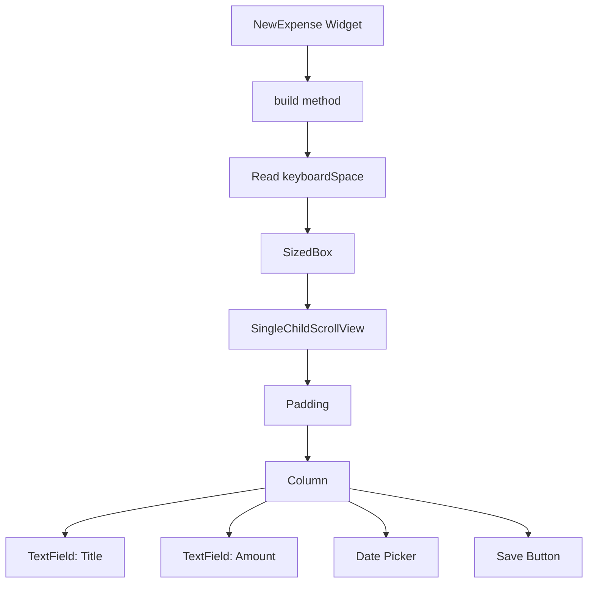

# Handling Screen Overlays Like the Soft Keyboard

## Overview

This lecture explains how to handle screen overlays in Flutter, especially the **soft keyboard**.

When a user taps a `TextField`, the on-screen keyboard appears from the bottom of the screen. This keyboard covers part of the app UI and reduces the available visible space.

If the layout does not react to this change, input fields or buttons may become hidden behind the keyboard.

To solve this, Flutter provides keyboard overlay information through `MediaQuery`.

The most important value is:

```dart
MediaQuery.of(context).viewInsets.bottom
```

This tells us how much space is currently covered from the bottom of the screen, usually by the keyboard.

---

## The Problem

In portrait mode, a modal form may look fine.

```text
Portrait Mode

+----------------------+
|      Add Expense     |
+----------------------+
| Title Input          |
| Amount Input         |
| Date Picker          |
| Save Button          |
+----------------------+
```

However, in landscape mode, the screen height is much smaller.

When the keyboard opens, it can cover the form content.

```text
Landscape Mode with Keyboard

+----------------------------------+
|          Add Expense Form         |
+----------------------------------+
| Title Input                       |
| Amount Input                      |
+----------------------------------+
|          Keyboard Overlay         |
|          covers content           |
+----------------------------------+
```

This makes it difficult or impossible to reach the remaining input fields and buttons.

---

## Main Idea

When the keyboard appears, we need to:

1. Detect how much space the keyboard takes.
2. Add bottom padding equal to that space.
3. Make the modal content scrollable.
4. Optionally force the modal to keep its full height.



---

## What Is viewInsets?

`viewInsets` describes parts of the screen that are completely covered by system UI.

The soft keyboard is the most common example.

```dart
final keyboardSpace = MediaQuery.of(context).viewInsets.bottom;
```

When the keyboard is closed:

```text
keyboardSpace = 0
```

When the keyboard is open:

```text
keyboardSpace = keyboard height
```



---

## Why Padding Is Needed

If the keyboard covers the bottom of the screen, we can add extra bottom padding to the modal content.

```dart
padding: EdgeInsets.fromLTRB(
  16,
  16,
  16,
  keyboardSpace + 16,
),
```

This means:

```text
Left padding:   16
Top padding:    16
Right padding:  16
Bottom padding: keyboard height + 16
```

The extra `16` keeps some spacing even when the keyboard is closed.

---

## Basic Code Example

```dart
class AddExpenseModal extends StatelessWidget {
  const AddExpenseModal({super.key});

  @override
  Widget build(BuildContext context) {
    final keyboardSpace = MediaQuery.of(context).viewInsets.bottom;

    return Padding(
      padding: EdgeInsets.fromLTRB(
        16,
        16,
        16,
        keyboardSpace + 16,
      ),
      child: Column(
        children: [
          const TextField(
            decoration: InputDecoration(
              label: Text('Title'),
            ),
          ),
          const TextField(
            decoration: InputDecoration(
              label: Text('Amount'),
            ),
            keyboardType: TextInputType.number,
          ),
          ElevatedButton(
            onPressed: () {},
            child: const Text('Save Expense'),
          ),
        ],
      ),
    );
  }
}
```

However, this is not enough yet.

Adding padding helps move the content up, but if the remaining height is too small, the content still needs to be scrollable.

---

## Why SingleChildScrollView Is Needed

When the keyboard appears, the visible area becomes smaller.

If the form content is taller than the available space, Flutter may show an overflow error.

To fix this, wrap the form content with `SingleChildScrollView`.

```dart
SingleChildScrollView(
  child: Column(
    children: [
      TextField(),
      TextField(),
      ElevatedButton(
        onPressed: () {},
        child: Text('Save Expense'),
      ),
    ],
  ),
)
```

This allows the user to scroll through the form while the keyboard is open.



---

## Improved Code Example

```dart
class AddExpenseModal extends StatelessWidget {
  const AddExpenseModal({super.key});

  @override
  Widget build(BuildContext context) {
    final keyboardSpace = MediaQuery.of(context).viewInsets.bottom;

    return SingleChildScrollView(
      child: Padding(
        padding: EdgeInsets.fromLTRB(
          16,
          16,
          16,
          keyboardSpace + 16,
        ),
        child: Column(
          children: [
            const TextField(
              decoration: InputDecoration(
                label: Text('Title'),
              ),
            ),
            const TextField(
              decoration: InputDecoration(
                label: Text('Amount'),
              ),
              keyboardType: TextInputType.number,
            ),
            ElevatedButton(
              onPressed: () {},
              child: const Text('Save Expense'),
            ),
          ],
        ),
      ),
    );
  }
}
```

Now the modal content can move above the keyboard and become scrollable when necessary.

---

## Full Modal Pattern

A common pattern for keyboard-safe modal forms is:

```dart
class AddExpenseModal extends StatelessWidget {
  const AddExpenseModal({super.key});

  @override
  Widget build(BuildContext context) {
    final keyboardSpace = MediaQuery.of(context).viewInsets.bottom;

    return SizedBox(
      height: double.infinity,
      child: SingleChildScrollView(
        child: Padding(
          padding: EdgeInsets.fromLTRB(
            16,
            16,
            16,
            keyboardSpace + 16,
          ),
          child: Column(
            children: [
              const TextField(
                decoration: InputDecoration(
                  label: Text('Title'),
                ),
              ),
              const TextField(
                decoration: InputDecoration(
                  label: Text('Amount'),
                ),
                keyboardType: TextInputType.number,
              ),
              const SizedBox(height: 16),
              ElevatedButton(
                onPressed: () {},
                child: const Text('Save Expense'),
              ),
            ],
          ),
        ),
      ),
    );
  }
}
```

---

## Why SizedBox Can Be Useful

After wrapping the modal content in `SingleChildScrollView`, the modal may no longer take up the full available height.

If we want the modal to remain full-height, we can wrap the scroll view with a `SizedBox`.

```dart
SizedBox(
  height: double.infinity,
  child: SingleChildScrollView(
    child: ...
  ),
)
```

This tells the modal to use as much height as it can get.



---

## How the Layout Reacts to the Keyboard



---

## Scaffold resizeToAvoidBottomInset

`Scaffold` has a property called:

```dart
resizeToAvoidBottomInset
```

By default, this is set to `true`.

```dart
Scaffold(
  resizeToAvoidBottomInset: true,
  body: ...
)
```

This means the `Scaffold` automatically resizes its body when the keyboard appears.

If you set it to `false`, Flutter will not automatically resize the body.

```dart
Scaffold(
  resizeToAvoidBottomInset: false,
  body: ...
)
```

This gives you more manual control, but you must handle keyboard spacing yourself.

---

## Modal Bottom Sheet and Keyboard

When using `showModalBottomSheet`, forms often need extra care.

A modal bottom sheet appears from the bottom of the screen, and the keyboard also appears from the bottom.

That means they can easily overlap.

```text
Screen

+--------------------------+
| App content              |
|                          |
+--------------------------+
| Modal Bottom Sheet       |
| +----------------------+ |
| | TextFields           | |
| | Buttons              | |
| +----------------------+ |
+--------------------------+
| Soft Keyboard            |
+--------------------------+
```

A good modal form should use:

* `MediaQuery.of(context).viewInsets.bottom`
* `Padding`
* `SingleChildScrollView`
* optionally `SizedBox(height: double.infinity)`

---

## Recommended Structure



Recommended code structure:

```dart
@override
Widget build(BuildContext context) {
  final keyboardSpace = MediaQuery.of(context).viewInsets.bottom;

  return SizedBox(
    height: double.infinity,
    child: SingleChildScrollView(
      child: Padding(
        padding: EdgeInsets.fromLTRB(
          16,
          16,
          16,
          keyboardSpace + 16,
        ),
        child: Column(
          children: [
            // form fields here
          ],
        ),
      ),
    ),
  );
}
```

---

## Common Mistake

A common mistake is only adding padding without making the content scrollable.

```dart
Padding(
  padding: EdgeInsets.only(
    bottom: keyboardSpace,
  ),
  child: Column(
    children: [
      TextField(),
      TextField(),
      ElevatedButton(),
    ],
  ),
)
```

This may still fail because the content has no way to scroll when the available height becomes too small.

Correct approach:

```dart
SingleChildScrollView(
  child: Padding(
    padding: EdgeInsets.only(
      bottom: keyboardSpace + 16,
    ),
    child: Column(
      children: [
        TextField(),
        TextField(),
        ElevatedButton(),
      ],
    ),
  ),
)
```

---

## Key Points

* The soft keyboard is a screen overlay.
* It reduces the visible space available to the app.
* `MediaQuery.of(context).viewInsets.bottom` gives the keyboard height.
* When the keyboard is closed, this value is usually `0`.
* When the keyboard is open, this value equals the height covered by the keyboard.
* Add dynamic bottom padding using `keyboardSpace + 16`.
* Use `SingleChildScrollView` so the user can scroll through the form.
* Use `SizedBox(height: double.infinity)` if the modal should still take the full available height.
* `Scaffold.resizeToAvoidBottomInset` controls automatic resizing when the keyboard appears.
* Keyboard-safe layouts are especially important for forms and modal bottom sheets.

---

## Summary

To handle the soft keyboard in Flutter, read the keyboard overlay height using:

```dart
MediaQuery.of(context).viewInsets.bottom
```

Then use that value as dynamic bottom padding.

For forms, padding alone is not enough. The content should also be scrollable using `SingleChildScrollView`.

A strong modal form structure is:

```text
SizedBox
  → SingleChildScrollView
    → Padding with keyboardSpace
      → Column with form fields
```

This ensures that users can always reach all input fields and buttons, even in landscape mode or when the keyboard covers a large part of the screen.
