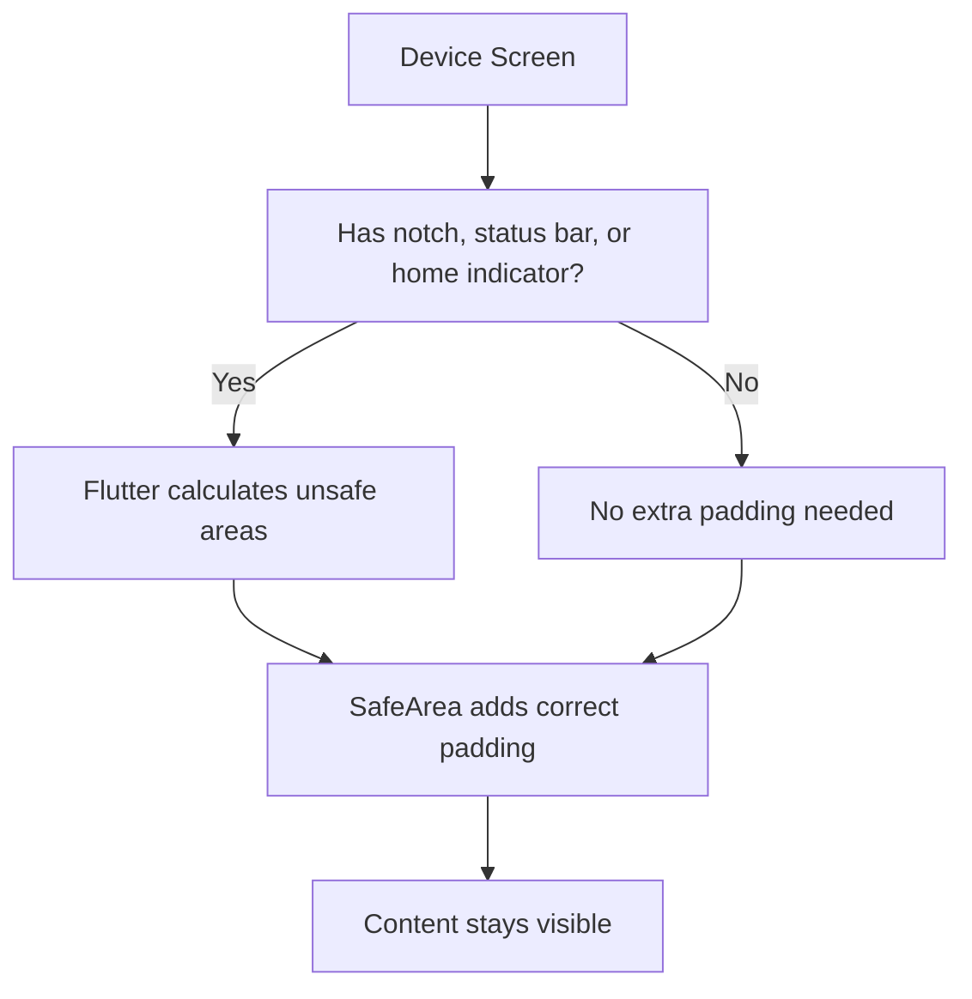
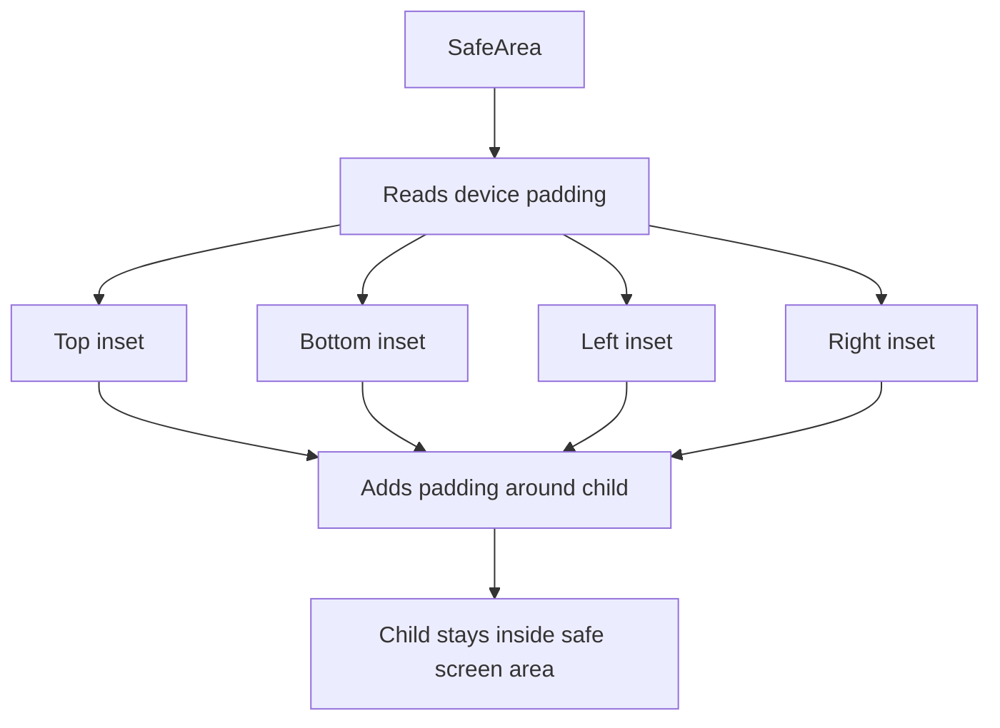
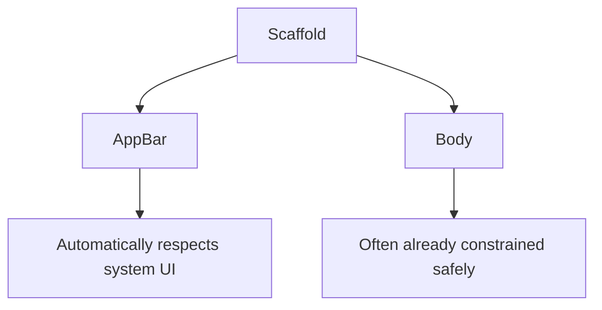
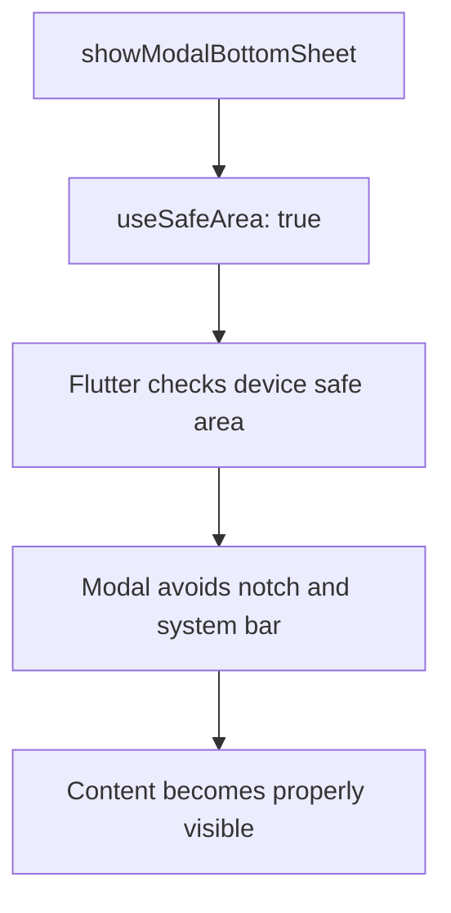
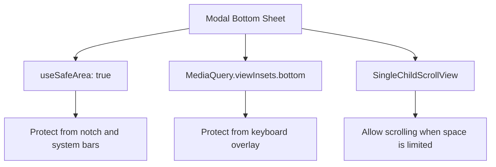
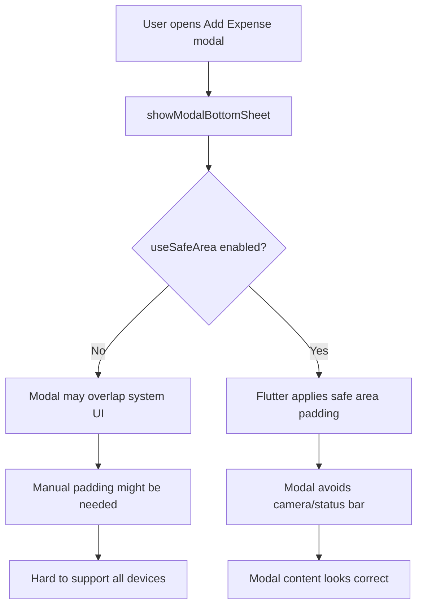

# Understanding Safe Areas in Flutter

## Overview

This lecture explains how Flutter handles **safe areas**.

Modern devices often have physical or system UI elements that can overlap app content, such as:

* camera cutouts
* notches
* status bars
* rounded corners
* home indicator bars
* system gesture areas

A **safe area** is the part of the screen where content can be displayed without being hidden by these device features.

Flutter provides the `SafeArea` widget and safe area-related options to help keep your UI visible and polished across different devices.

---

## The Problem

Some devices have a camera cutout or notch at the top of the screen.

If we manually add a fixed amount of padding, the UI might work on one device but not on another.

```text id="sg2p8a"
Device with Camera Cutout

+--------------------------+
|      Camera / Notch      |
+--------------------------+
| Title might be covered   |
|                          |
| Modal content            |
+--------------------------+
```

Hardcoding padding is not ideal because different devices have different safe area sizes.

```dart id="7e1e5a"
Padding(
  padding: EdgeInsets.only(top: 40),
  child: ...
)
```

This might work on one phone but fail on another.

---

## What Is a Safe Area?

A safe area is the visible part of the screen that is not blocked by hardware or system UI elements.

```text id="gin1qb"
Full Screen

+--------------------------+
| Unsafe Area              |
| Camera / Status Bar      |
+--------------------------+
|                          |
| Safe Area                |
| App content should go    |
| here                     |
|                          |
+--------------------------+
| Unsafe Area              |
| Home Indicator           |
+--------------------------+
```

The safe area protects your content from being hidden behind device-specific features.

---

## Main Idea

Instead of guessing how much padding is needed, let Flutter calculate it automatically.



---

## SafeArea Widget

The `SafeArea` widget automatically adds padding around its child so the child stays inside the safe region of the screen.

```dart id="k79otj"
class MyScreen extends StatelessWidget {
  const MyScreen({super.key});

  @override
  Widget build(BuildContext context) {
    return SafeArea(
      child: Column(
        children: const [
          Text('This content is safe from screen obstructions'),
        ],
      ),
    );
  }
}
```

By default, `SafeArea` protects all sides:

```dart id="dd42js"
SafeArea(
  top: true,
  bottom: true,
  left: true,
  right: true,
  child: ...
)
```

---

## How SafeArea Works



`SafeArea` uses the device information provided by Flutter to know how much padding is needed.

---

## Reading Safe Area Insets Manually

You can also read safe area padding manually with `MediaQuery`.

```dart id="tmucaa"
final topPadding = MediaQuery.of(context).padding.top;
final bottomPadding = MediaQuery.of(context).padding.bottom;
final leftPadding = MediaQuery.of(context).padding.left;
final rightPadding = MediaQuery.of(context).padding.right;
```

These values represent the unsafe areas around the screen.

```mermaid id="55d7yn"
flowchart TD
    A[MediaQuery.of(context).padding] --> B[top]
    A --> C[bottom]
    A --> D[left]
    A --> E[right]

    B --> F[Status bar / notch / camera]
    C --> G[Home indicator / gesture area]
    D --> H[Left screen obstruction]
    E --> I[Right screen obstruction]
```

---

## SafeArea vs Manual Padding

Manual padding:

```dart id="bnbhok"
Padding(
  padding: EdgeInsets.only(top: 40),
  child: ...
)
```

This is not flexible.

SafeArea:

```dart id="7ixjro"
SafeArea(
  child: ...
)
```

This adapts automatically to the current device.

| Approach             | Result                                                |
| -------------------- | ----------------------------------------------------- |
| Manual padding       | May work on one device but fail on another            |
| `SafeArea`           | Automatically adapts to device-specific screen insets |
| `MediaQuery.padding` | Gives manual access to safe area values               |

---

## Scaffold and Safe Areas

In many normal app screens, `Scaffold` already handles safe areas for common UI elements.

For example:

```dart id="2q2wb1"
Scaffold(
  appBar: AppBar(
    title: const Text('Expenses'),
  ),
  body: ...
)
```

The `AppBar` is automatically placed below the system status bar or camera cutout.

That is why the main app screen usually looks correct without adding `SafeArea` manually.



---

## Why the Modal Still Has a Problem

A modal bottom sheet may not always use the safe area automatically.

For example, when opening a modal using `showModalBottomSheet`, the modal content may appear too close to the top system area in landscape mode.

```text id="kb9gr1"
Modal without Safe Area

+--------------------------+
| Camera / System Bar      |
| Modal title overlaps     |
+--------------------------+
| Form fields              |
| Buttons                  |
+--------------------------+
```

This can make the UI look unpolished or cause content to be partially hidden.

---

## Fixing Modal Bottom Sheet with useSafeArea

When using `showModalBottomSheet`, you can enable safe area handling with:

```dart id="94350s"
useSafeArea: true
```

Example:

```dart id="bf2d6x"
showModalBottomSheet(
  context: context,
  useSafeArea: true,
  builder: (ctx) {
    return const NewExpense();
  },
);
```

This tells Flutter to keep the modal away from unsafe screen regions.



---

## Before and After

### Before

```text id="qgej90"
Without useSafeArea

+--------------------------+
| Camera / Notch           |
| Title overlaps here      |
+--------------------------+
| Modal content            |
|                          |
+--------------------------+
```

### After

```text id="cf1nzk"
With useSafeArea: true

+--------------------------+
| Camera / Notch           |
+--------------------------+
| Safe spacing             |
+--------------------------+
| Modal title              |
| Modal content            |
+--------------------------+
```

---

## Code Example: Opening the Modal Safely

```dart id="yrz99k"
void _openAddExpenseOverlay() {
  showModalBottomSheet(
    context: context,
    useSafeArea: true,
    isScrollControlled: true,
    builder: (ctx) {
      return const NewExpense();
    },
  );
}
```

In this example:

* `useSafeArea: true` protects the modal from notches and system bars.
* `isScrollControlled: true` allows the modal to take more vertical space.
* The modal content can still use `MediaQuery.viewInsets.bottom` to handle the keyboard.

---

## SafeArea and Keyboard Handling Together

Safe areas and keyboard overlays solve different problems.

| Feature                        | Protects Against                                      |
| ------------------------------ | ----------------------------------------------------- |
| `SafeArea`                     | Notches, camera cutouts, status bars, home indicators |
| `MediaQuery.viewInsets.bottom` | Soft keyboard overlay                                 |
| `SingleChildScrollView`        | Content overflow when space becomes small             |

A strong modal form may use all of them together.



---

## Example: Keyboard-Safe and Safe-Area-Aware Modal

```dart id="ozkvza"
void _openAddExpenseOverlay() {
  showModalBottomSheet(
    context: context,
    useSafeArea: true,
    isScrollControlled: true,
    builder: (ctx) {
      return const NewExpense();
    },
  );
}
```

Inside the modal widget:

```dart id="u3r82x"
@override
Widget build(BuildContext context) {
  final keyboardSpace = MediaQuery.of(context).viewInsets.bottom;

  return SizedBox(
    height: double.infinity,
    child: SingleChildScrollView(
      child: Padding(
        padding: EdgeInsets.fromLTRB(
          16,
          16,
          16,
          keyboardSpace + 16,
        ),
        child: Column(
          children: [
            // Form fields here
          ],
        ),
      ),
    ),
  );
}
```

This handles both:

```text id="irpw5v"
SafeArea
  → protects from device hardware/system UI

viewInsets.bottom
  → protects from keyboard overlay
```

---

## When to Use SafeArea Explicitly

You should consider using `SafeArea` when building:

* custom full-screen screens
* modal bottom sheets
* splash screens
* custom navigation layouts
* layouts that draw behind the system status bar
* screens using `extendBodyBehindAppBar`
* custom overlays
* full-screen images with text or buttons on top

---

## When You May Not Need SafeArea

You may not need to add `SafeArea` manually when using standard Flutter structures like:

```dart id="h138m2"
Scaffold(
  appBar: AppBar(...),
  body: ...,
)
```

`Scaffold`, `AppBar`, and other Material widgets often handle safe area concerns automatically.

However, if content is hidden behind a notch, camera cutout, status bar, or home indicator, then adding `SafeArea` or enabling `useSafeArea` is the correct fix.

---

## Final Layout Flow



---

## Key Points

* Safe areas protect content from device-specific screen obstructions.
* Common obstructions include notches, camera cutouts, status bars, rounded corners, and home indicators.
* `SafeArea` automatically adds the correct padding around its child.
* `MediaQuery.of(context).padding` gives raw safe area inset values.
* `Scaffold` and `AppBar` often handle safe areas automatically.
* Modal bottom sheets may need `useSafeArea: true`.
* Avoid guessing fixed padding values for notches or system bars.
* Use safe area tools so the app works across many devices.

---

## Summary

Safe areas help your Flutter UI avoid being hidden by hardware and system UI elements.

Instead of manually guessing padding, use Flutter’s built-in safe area support.

For normal screens, `Scaffold` often handles this automatically.

For modal bottom sheets, enable:

```dart id="z34vo1"
useSafeArea: true
```

For custom layouts, wrap content with:

```dart id="iyu6iq"
SafeArea(
  child: ...
)
```

This makes your app look cleaner, more professional, and more reliable across different devices.
