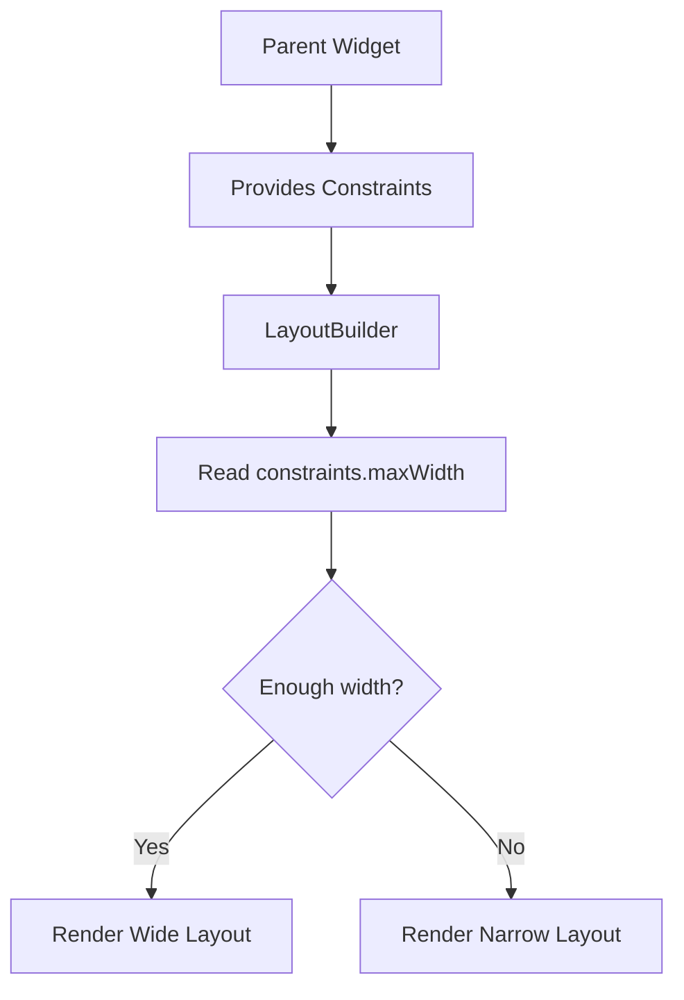
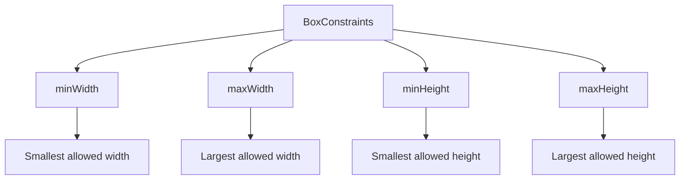
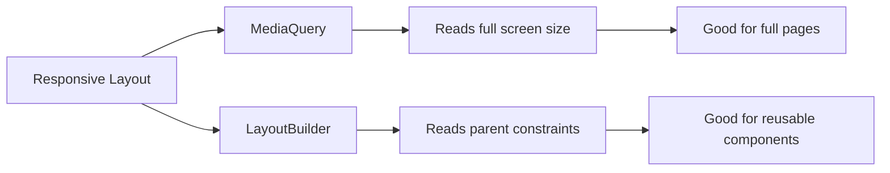
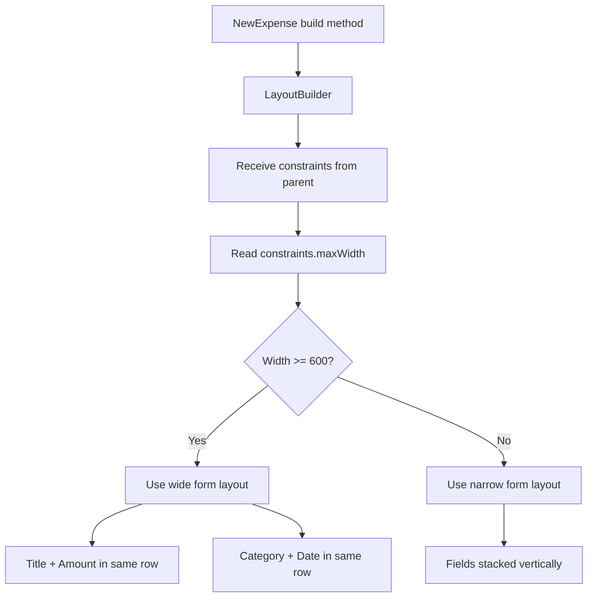
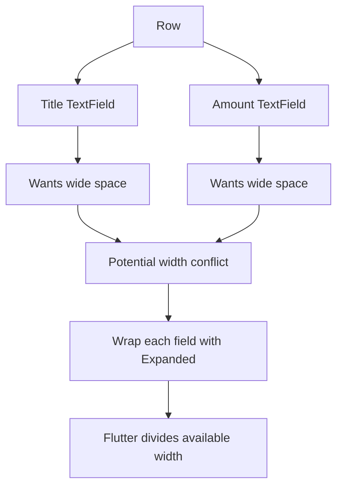
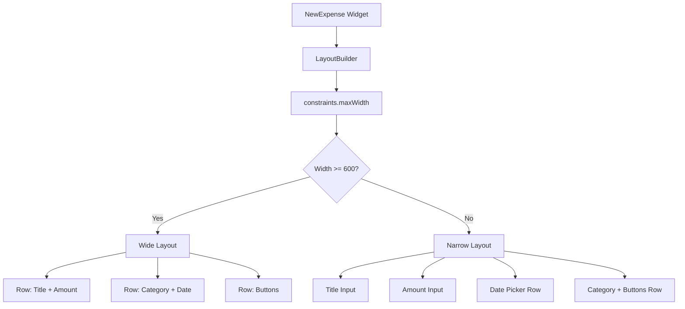
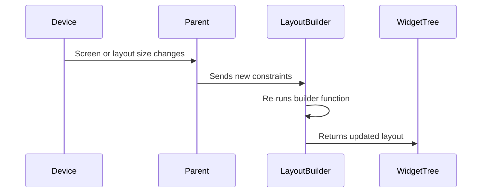
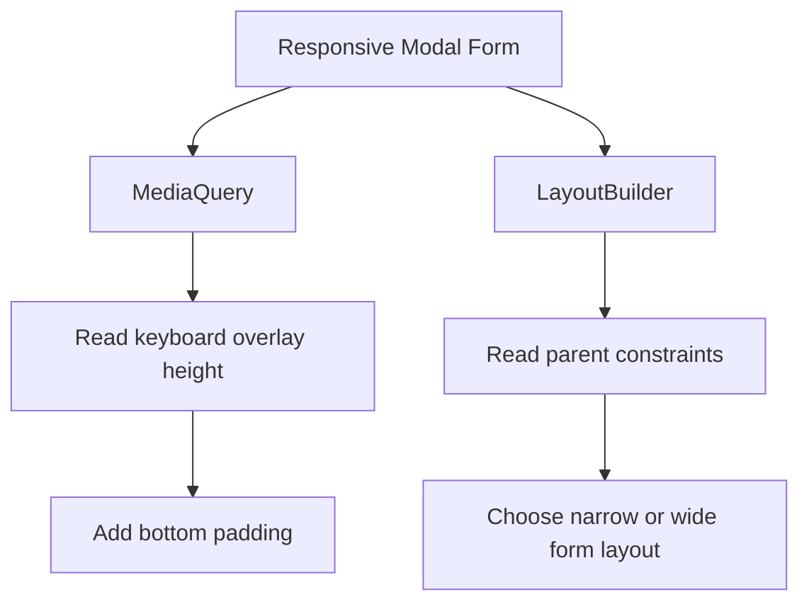

# Using the LayoutBuilder Widget

## Overview

This lecture explains how to use Flutter’s `LayoutBuilder` widget to build responsive layouts based on the **space available to a specific widget**, not just the full screen size.

Previously, we used `MediaQuery` to check the device width and switch between layouts. That works well when the widget should respond to the entire screen.

However, sometimes a widget should only care about the size given by its parent. In that case, `LayoutBuilder` is often the better tool.

`LayoutBuilder` gives access to a `BoxConstraints` object, which tells us the minimum and maximum width and height available to the widget.

---

## The Problem

In the expense app, the modal form works better now because it handles:

* the soft keyboard
* scrolling
* safe areas

However, in landscape mode, the form could still use the available horizontal space better.

Instead of stacking all fields vertically, we can place some fields next to each other.

For example:

```text id="wn09gy"
Portrait Layout

+----------------------+
| Title Input          |
+----------------------+
| Amount Input         |
+----------------------+
| Date Picker          |
+----------------------+
| Category Dropdown    |
+----------------------+
| Cancel / Save        |
+----------------------+
```

In landscape mode or wide layouts, we can improve it like this:

```text id="alns3w"
Wide Layout

+----------------------+----------------------+
| Title Input          | Amount Input         |
+----------------------+----------------------+
| Category Dropdown    | Date Picker          |
+----------------------+----------------------+
|               Cancel / Save                 |
+---------------------------------------------+
```

---

## Why Not Only Use MediaQuery?

`MediaQuery` gives information about the full screen.

```dart id="uw39k2"
final width = MediaQuery.of(context).size.width;
```

This is useful when the widget layout depends on the whole device size.

But sometimes a widget is placed inside another layout, such as:

* inside a modal
* inside a `Row`
* inside a `Column`
* inside a side panel
* inside a card
* inside a split-screen layout

In these cases, the full screen width may not represent the actual space available to that widget.

That is where `LayoutBuilder` is useful.

---

## Main Idea

`LayoutBuilder` gives the widget access to the constraints from its parent.



Instead of asking:

```text id="gpo2sr"
How wide is the entire screen?
```

`LayoutBuilder` asks:

```text id="zhxngj"
How much space did my parent give me?
```

---

## Basic LayoutBuilder Syntax

```dart id="hctmjj"
LayoutBuilder(
  builder: (context, constraints) {
    return Widget();
  },
)
```

The builder function receives two values:

```dart id="k0jdxc"
builder: (context, constraints) {
  // context: BuildContext
  // constraints: BoxConstraints
}
```

The `constraints` object contains:

```dart id="qu4rx7"
constraints.minWidth
constraints.maxWidth
constraints.minHeight
constraints.maxHeight
```

---

## Understanding BoxConstraints

`BoxConstraints` tells the widget how much space it is allowed to use.



Example:

```dart id="oxn73v"
LayoutBuilder(
  builder: (context, constraints) {
    print(constraints.maxWidth);
    print(constraints.maxHeight);

    return const Text('Hello');
  },
)
```

This helps you know exactly how much room your widget has.

---

## MediaQuery vs LayoutBuilder

| Tool                 | Measures                          | Best Used For                    |
| -------------------- | --------------------------------- | -------------------------------- |
| `MediaQuery`         | Full screen size                  | Page-level responsive layout     |
| `LayoutBuilder`      | Parent-provided constraints       | Widget-level responsive layout   |
| `OrientationBuilder` | Portrait or landscape orientation | Simple orientation-based changes |

`MediaQuery` is screen-aware.
`LayoutBuilder` is context-aware.



---

## Basic Code Example

```dart id="ltv9gj"
class ResponsiveExpenseChart extends StatelessWidget {
  const ResponsiveExpenseChart({super.key});

  @override
  Widget build(BuildContext context) {
    return LayoutBuilder(
      builder: (context, constraints) {
        final isWide = constraints.maxWidth > 300;

        return isWide
            ? Row(
                mainAxisAlignment: MainAxisAlignment.spaceEvenly,
                children: const [
                  Icon(Icons.bar_chart, size: 40),
                  Text('Wide Chart Layout'),
                ],
              )
            : Column(
                mainAxisAlignment: MainAxisAlignment.center,
                children: const [
                  Icon(Icons.bar_chart, size: 40),
                  Text('Narrow Chart Layout'),
                ],
              );
      },
    );
  }
}
```

If the widget receives more than `300` pixels of width, it uses a `Row`.

If it receives less width, it uses a `Column`.

---

## Applying LayoutBuilder to the Expense Modal

In the `NewExpense` widget, we can wrap the whole modal layout with `LayoutBuilder`.

```dart id="hi75hf"
@override
Widget build(BuildContext context) {
  final keyboardSpace = MediaQuery.of(context).viewInsets.bottom;

  return LayoutBuilder(
    builder: (context, constraints) {
      final width = constraints.maxWidth;

      return SizedBox(
        height: double.infinity,
        child: SingleChildScrollView(
          child: Padding(
            padding: EdgeInsets.fromLTRB(
              16,
              16,
              16,
              keyboardSpace + 16,
            ),
            child: Column(
              children: [
                // Dynamic form layout here
              ],
            ),
          ),
        ),
      );
    },
  );
}
```

Now the modal can decide its layout based on the actual width it receives.

---

## Layout Decision Flow



---

## Conditional Widgets Inside Lists

Dart allows conditional logic directly inside widget lists.

Example:

```dart id="yd6q0p"
Column(
  children: [
    if (width >= 600)
      Row(
        children: [
          Expanded(child: titleInput),
          const SizedBox(width: 16),
          Expanded(child: amountInput),
        ],
      )
    else
      titleInput,
  ],
)
```

This means:

```text id="frttqr"
If width is at least 600:
  add the Row to the children list

Otherwise:
  add only the title input
```

This is useful for building dynamic Flutter layouts.

---

## Title and Amount Row

When there is enough width, the title input and amount input can be placed in the same row.

```dart id="qxvzuz"
if (width >= 600)
  Row(
    crossAxisAlignment: CrossAxisAlignment.start,
    children: [
      Expanded(
        child: TextField(
          decoration: const InputDecoration(
            label: Text('Title'),
          ),
        ),
      ),
      const SizedBox(width: 16),
      Expanded(
        child: TextField(
          decoration: const InputDecoration(
            label: Text('Amount'),
          ),
          keyboardType: TextInputType.number,
        ),
      ),
    ],
  )
else
  TextField(
    decoration: const InputDecoration(
      label: Text('Title'),
    ),
  ),
```

`Expanded` is important here because `TextField` needs clear width constraints inside a `Row`.

Without `Expanded`, Flutter may not know how much width each text field should take.

---

## Why Expanded Is Needed in the Row

A `Row` gives its children horizontal space, but text fields often want as much width as possible.

If multiple unconstrained widgets are placed inside a `Row`, Flutter can run into layout problems.



Correct structure:

```dart id="ccy5k6"
Row(
  children: [
    Expanded(child: titleInput),
    const SizedBox(width: 16),
    Expanded(child: amountInput),
  ],
)
```

---

## Category and Date Row

When there is enough width, the category dropdown and date picker can also be placed in the same row.

```dart id="ifyfwl"
if (width >= 600)
  Row(
    children: [
      DropdownButton(
        value: selectedCategory,
        items: Category.values
            .map(
              (category) => DropdownMenuItem(
                value: category,
                child: Text(category.name.toUpperCase()),
              ),
            )
            .toList(),
        onChanged: (value) {
          if (value == null) {
            return;
          }

          setState(() {
            selectedCategory = value;
          });
        },
      ),
      const SizedBox(width: 16),
      Expanded(
        child: Row(
          mainAxisAlignment: MainAxisAlignment.end,
          children: [
            Text(
              selectedDate == null
                  ? 'No date selected'
                  : formatter.format(selectedDate!),
            ),
            IconButton(
              onPressed: presentDatePicker,
              icon: const Icon(Icons.calendar_month),
            ),
          ],
        ),
      ),
    ],
  )
```

This uses horizontal space more efficiently in landscape mode.

---

## Narrow Layout

When the available width is small, the form should stay vertical.

```text id="r2l7wu"
Narrow Layout

+----------------------+
| Title Input          |
+----------------------+
| Amount Input         |
+----------------------+
| Date Picker          |
+----------------------+
| Category Dropdown    |
+----------------------+
| Cancel / Save        |
+----------------------+
```

This is better for portrait mode and small screens.

---

## Wide Layout

When the available width is large, related inputs can be grouped horizontally.

```text id="gwmuac"
Wide Layout

+----------------------+----------------------+
| Title Input          | Amount Input         |
+----------------------+----------------------+
| Category Dropdown    | Date Picker          |
+----------------------+----------------------+
|                Cancel / Save                |
+---------------------------------------------+
```

This is better for landscape mode, tablets, and wider containers.

---

## Full Modal Structure



---

## Example: Simplified Responsive Form

```dart id="eq74yt"
class NewExpense extends StatefulWidget {
  const NewExpense({super.key});

  @override
  State<NewExpense> createState() {
    return _NewExpenseState();
  }
}

class _NewExpenseState extends State<NewExpense> {
  @override
  Widget build(BuildContext context) {
    final keyboardSpace = MediaQuery.of(context).viewInsets.bottom;

    return LayoutBuilder(
      builder: (context, constraints) {
        final width = constraints.maxWidth;
        final isWide = width >= 600;

        return SizedBox(
          height: double.infinity,
          child: SingleChildScrollView(
            child: Padding(
              padding: EdgeInsets.fromLTRB(
                16,
                16,
                16,
                keyboardSpace + 16,
              ),
              child: Column(
                children: [
                  if (isWide)
                    Row(
                      crossAxisAlignment: CrossAxisAlignment.start,
                      children: [
                        Expanded(child: _buildTitleInput()),
                        const SizedBox(width: 16),
                        Expanded(child: _buildAmountInput()),
                      ],
                    )
                  else ...[
                    _buildTitleInput(),
                    _buildAmountInput(),
                  ],

                  const SizedBox(height: 16),

                  if (isWide)
                    Row(
                      children: [
                        _buildCategoryDropdown(),
                        const SizedBox(width: 16),
                        Expanded(child: _buildDatePickerRow()),
                      ],
                    )
                  else
                    _buildDatePickerRow(),

                  const SizedBox(height: 16),

                  if (isWide)
                    Row(
                      children: [
                        const Spacer(),
                        TextButton(
                          onPressed: () {
                            Navigator.pop(context);
                          },
                          child: const Text('Cancel'),
                        ),
                        ElevatedButton(
                          onPressed: () {},
                          child: const Text('Save Expense'),
                        ),
                      ],
                    )
                  else
                    Row(
                      children: [
                        _buildCategoryDropdown(),
                        const Spacer(),
                        TextButton(
                          onPressed: () {
                            Navigator.pop(context);
                          },
                          child: const Text('Cancel'),
                        ),
                        ElevatedButton(
                          onPressed: () {},
                          child: const Text('Save Expense'),
                        ),
                      ],
                    ),
                ],
              ),
            ),
          ),
        );
      },
    );
  }

  Widget _buildTitleInput() {
    return const TextField(
      decoration: InputDecoration(
        label: Text('Title'),
      ),
    );
  }

  Widget _buildAmountInput() {
    return const TextField(
      decoration: InputDecoration(
        label: Text('Amount'),
      ),
      keyboardType: TextInputType.number,
    );
  }

  Widget _buildCategoryDropdown() {
    return const Text('Category Dropdown');
  }

  Widget _buildDatePickerRow() {
    return const Row(
      mainAxisAlignment: MainAxisAlignment.end,
      children: [
        Text('No date selected'),
        Icon(Icons.calendar_month),
      ],
    );
  }
}
```

---

## Why Extracting Widgets Helps

When using conditional layouts, code can quickly become duplicated.

For example, the title input may appear in both:

* the narrow layout
* the wide layout

Instead of copying the same `TextField` multiple times, it is cleaner to extract it into a helper method or custom widget.

```dart id="jmbt57"
Widget _buildTitleInput() {
  return TextField(
    controller: titleController,
    decoration: const InputDecoration(
      label: Text('Title'),
    ),
  );
}
```

This makes the responsive layout easier to read and maintain.

---

## When LayoutBuilder Rebuilds

The `LayoutBuilder` builder function runs when the parent constraints change.

This can happen when:

* the device rotates
* the widget is moved into a different parent
* the parent widget changes size
* the screen is resized
* the layout switches between narrow and wide modes



---

## When to Use LayoutBuilder

Use `LayoutBuilder` when a widget should adapt to the space given by its parent.

Good examples include:

* reusable cards
* charts
* modal forms
* dashboard panels
* widgets inside `Row` or `Column`
* widgets that may appear in different screen regions
* components used on both mobile and tablet layouts

---

## When to Use MediaQuery

Use `MediaQuery` when the widget should react to the full screen or device environment.

Good examples include:

* full page layout decisions
* reading keyboard height with `viewInsets`
* reading safe area padding
* checking screen size
* checking device orientation
* accessing text scaling or platform brightness

---

## LayoutBuilder and MediaQuery Together

`LayoutBuilder` and `MediaQuery` can be used together.

In the modal example:

```dart id="tlflfw"
final keyboardSpace = MediaQuery.of(context).viewInsets.bottom;
```

This uses `MediaQuery` because keyboard height is related to the whole screen.

Then:

```dart id="wnz63h"
LayoutBuilder(
  builder: (context, constraints) {
    final width = constraints.maxWidth;
    ...
  },
)
```

This uses `LayoutBuilder` because the form layout depends on the space available to the modal.



---

## Common Mistakes

| Mistake                                             | Why It Happens                                     | Fix                                            |
| --------------------------------------------------- | -------------------------------------------------- | ---------------------------------------------- |
| Using `MediaQuery` everywhere                       | It reads full screen size, not local space         | Use `LayoutBuilder` for component-level layout |
| Not wrapping `TextField` in `Expanded` inside `Row` | TextField needs width constraints                  | Wrap each flexible input with `Expanded`       |
| Duplicating too much widget code                    | Conditional layouts repeat fields                  | Extract widgets or helper methods              |
| Checking orientation only                           | Orientation does not always represent usable width | Check actual width instead                     |
| Forgetting spacing between horizontal fields        | UI becomes cramped                                 | Add `SizedBox(width: 16)`                      |

---

## Key Points

* `LayoutBuilder` gives access to the constraints from the parent widget.
* The builder function receives a `BoxConstraints` object.
* Use `constraints.maxWidth` to decide between narrow and wide layouts.
* `LayoutBuilder` is better than `MediaQuery` for reusable widgets.
* `MediaQuery` reads the full screen size.
* `LayoutBuilder` reads the space available to the current widget.
* The builder function runs again when constraints change.
* Conditional widgets inside lists allow dynamic UI structures.
* Use `Expanded` when placing flexible inputs inside a `Row`.
* Extract repeated widgets to keep the code clean.

---

## Summary

`LayoutBuilder` is a powerful Flutter widget for building responsive components.

It allows a widget to inspect the constraints provided by its parent and return a different layout depending on the available space.

The basic pattern is:

```dart id="t67m3l"
LayoutBuilder(
  builder: (context, constraints) {
    final width = constraints.maxWidth;

    if (width >= 600) {
      return WideLayout();
    }

    return NarrowLayout();
  },
)
```

Use `LayoutBuilder` when your widget should adapt to its local layout context.

Use `MediaQuery` when your widget needs full-screen or device-level information.

Together, they provide a strong foundation for building responsive Flutter apps.
