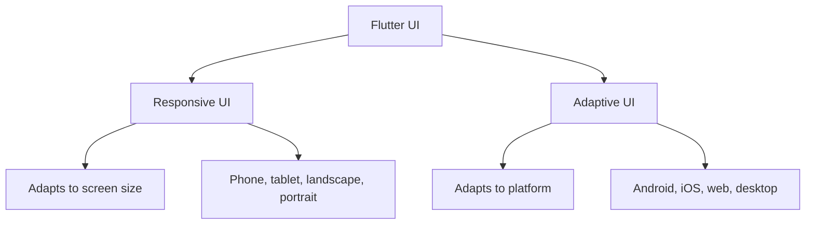
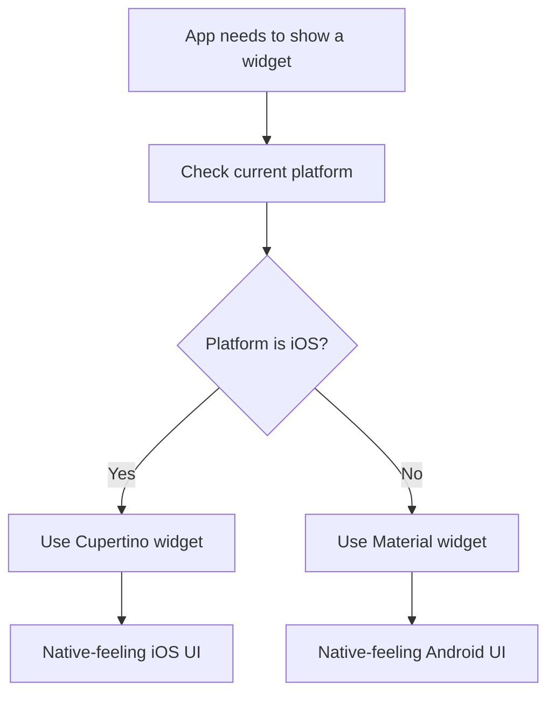
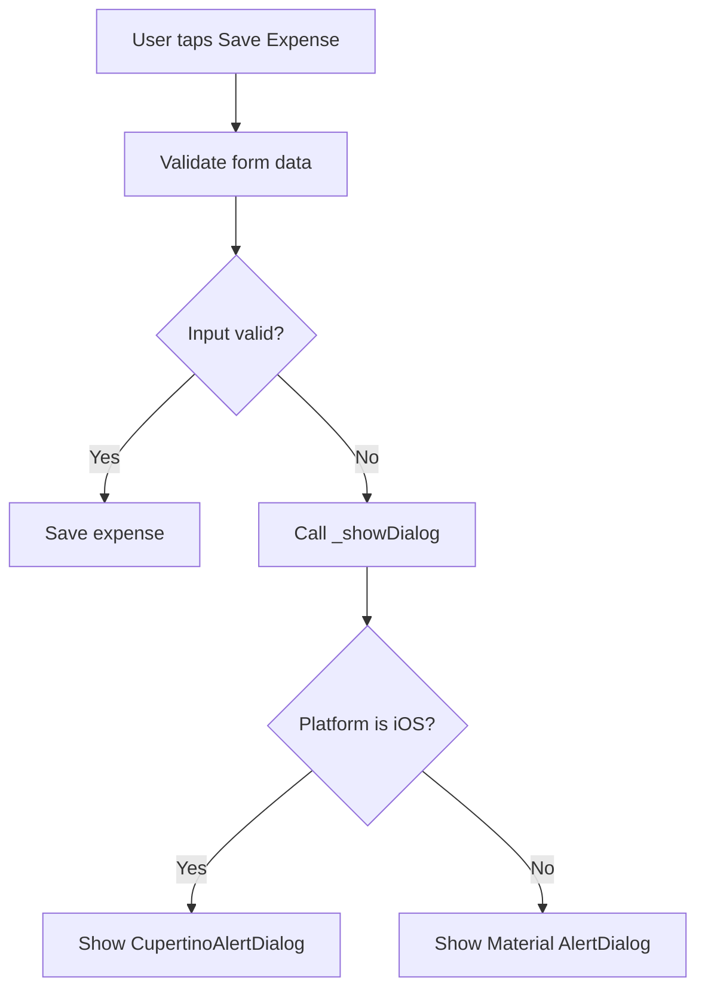
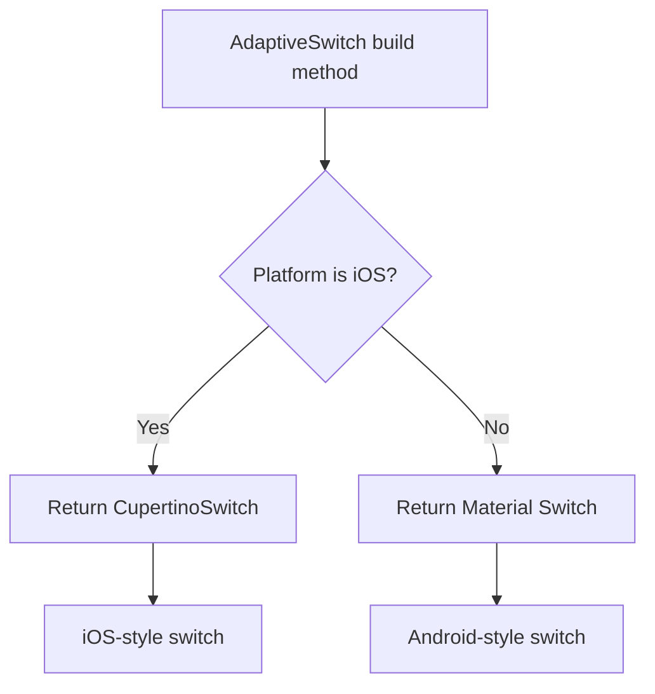
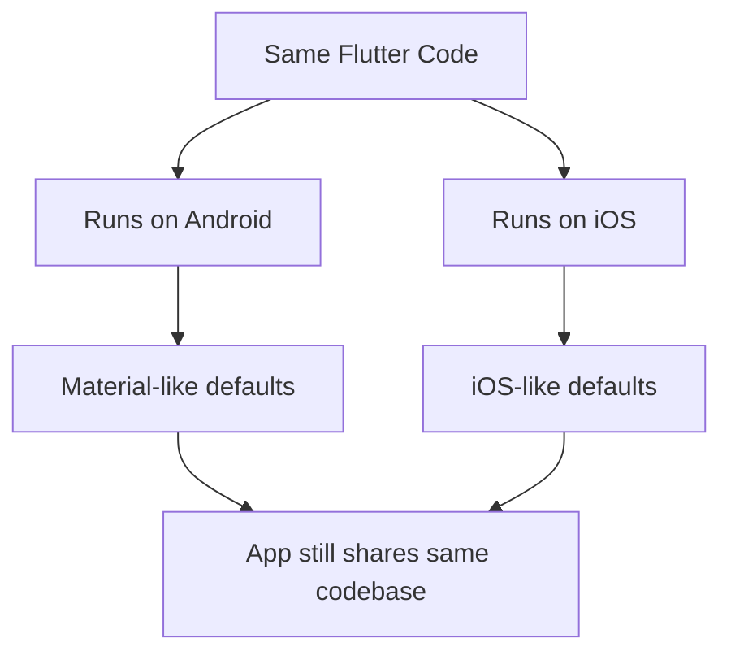
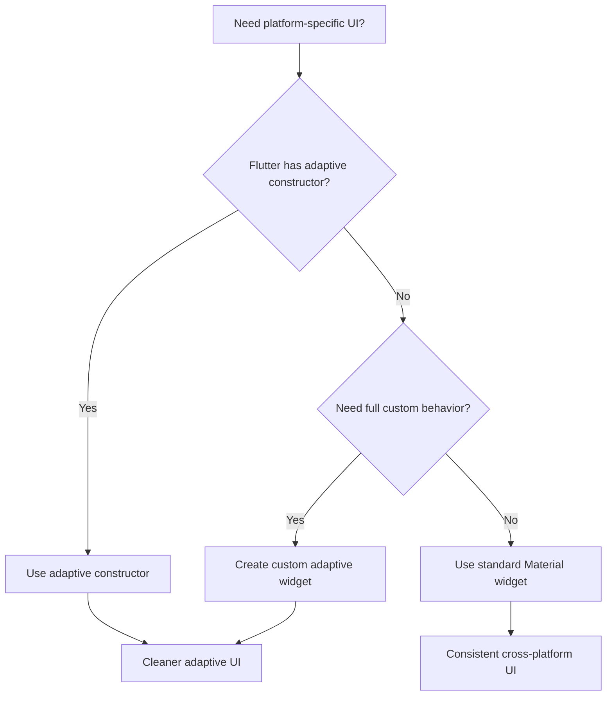

# Building Adaptive Widgets in Flutter

## Overview

This lecture explains how to build **adaptive widgets** in Flutter.

A responsive UI adapts to screen size.
An adaptive UI adapts to the **platform** where the app is running.

For example:

* Android apps usually follow **Material Design**
* iOS apps usually follow **Cupertino / iOS design**
* Web and desktop apps may need different input behavior, spacing, and navigation patterns

Flutter allows you to use the same codebase for multiple platforms, but you can still adjust specific widgets so the app feels more natural on each platform.

---

## Responsive vs Adaptive UI



Responsive design answers:

```text id="ygyp7n"
How much space is available?
```

Adaptive design answers:

```text id="dlm0mu"
Which platform is this app running on?
```

---

## Why Adaptive Widgets Matter

Flutter apps can look good on both Android and iOS using the same Material widgets.

However, some UI elements have different platform expectations.

For example, dialogs usually look different on Android and iOS.

```text id="i0zldi"
Android Dialog
+--------------------------+
| Material AlertDialog     |
| Title                    |
| Message                  |
| [OK]                     |
+--------------------------+

iOS Dialog
+--------------------------+
| CupertinoAlertDialog     |
| Title centered           |
| Message                  |
| Native iOS action style  |
+--------------------------+
```

Using platform-specific widgets can make the app feel more native.

---

## Platform-Specific Design Languages

| Platform | Design Style          | Flutter Library  |
| -------- | --------------------- | ---------------- |
| Android  | Material Design       | `material.dart`  |
| iOS      | Cupertino / iOS style | `cupertino.dart` |

Material widgets:

```dart id="87gaze"
import 'package:flutter/material.dart';
```

Cupertino widgets:

```dart id="2ppq8i"
import 'package:flutter/cupertino.dart';
```

---

## Detecting the Current Platform

Flutter can detect the current platform using the `Platform` class from `dart:io`.

```dart id="ttepuc"
import 'dart:io';
```

Then you can check:

```dart id="sq9yeu"
Platform.isIOS
Platform.isAndroid
Platform.isMacOS
Platform.isWindows
Platform.isLinux
```

Example:

```dart id="p4e69v"
if (Platform.isIOS) {
  // Use iOS-style widget
} else {
  // Use Material-style widget
}
```

---

## Main Adaptive Flow



---

## Example: Adaptive Dialog

In the expense app, when the user submits invalid data, we can show a dialog.

On Android, we can use:

```dart id="6sgl7j"
AlertDialog
```

On iOS, we can use:

```dart id="q8vfyu"
CupertinoAlertDialog
```

---

## Material AlertDialog

```dart id="ecxkzg"
showDialog(
  context: context,
  builder: (ctx) => AlertDialog(
    title: const Text('Invalid input'),
    content: const Text(
      'Please make sure a valid title, amount, date and category was entered.',
    ),
    actions: [
      TextButton(
        onPressed: () {
          Navigator.pop(ctx);
        },
        child: const Text('Okay'),
      ),
    ],
  ),
);
```

This gives the app a Material-style dialog.

---

## Cupertino AlertDialog

```dart id="9w29tn"
showCupertinoDialog(
  context: context,
  builder: (ctx) => CupertinoAlertDialog(
    title: const Text('Invalid input'),
    content: const Text(
      'Please make sure a valid title, amount, date and category was entered.',
    ),
    actions: [
      TextButton(
        onPressed: () {
          Navigator.pop(ctx);
        },
        child: const Text('Okay'),
      ),
    ],
  ),
);
```

This gives the app an iOS-style dialog.

---

## Adaptive Dialog Method

Instead of placing all dialog logic directly inside the submit method, we can extract it into a separate method.

```dart id="qo05wn"
void _showDialog() {
  if (Platform.isIOS) {
    showCupertinoDialog(
      context: context,
      builder: (ctx) => CupertinoAlertDialog(
        title: const Text('Invalid input'),
        content: const Text(
          'Please make sure a valid title, amount, date and category was entered.',
        ),
        actions: [
          TextButton(
            onPressed: () {
              Navigator.pop(ctx);
            },
            child: const Text('Okay'),
          ),
        ],
      ),
    );
  } else {
    showDialog(
      context: context,
      builder: (ctx) => AlertDialog(
        title: const Text('Invalid input'),
        content: const Text(
          'Please make sure a valid title, amount, date and category was entered.',
        ),
        actions: [
          TextButton(
            onPressed: () {
              Navigator.pop(ctx);
            },
            child: const Text('Okay'),
          ),
        ],
      ),
    );
  }
}
```

Now the app shows the correct dialog style depending on the platform.

---

## Using the Adaptive Dialog in Form Validation

```dart id="adhkl4"
void _submitExpenseData() {
  final enteredAmount = double.tryParse(_amountController.text);
  final amountIsInvalid = enteredAmount == null || enteredAmount <= 0;

  if (_titleController.text.trim().isEmpty ||
      amountIsInvalid ||
      _selectedDate == null) {
    _showDialog();
    return;
  }

  // Continue saving the expense
}
```

This keeps the validation method cleaner and easier to read.

---

## Adaptive Dialog Flow



---

## Custom Adaptive Widgets

You can also create your own adaptive widgets.

For example, Android and iOS switches look different.

Android uses a Material `Switch`.

iOS uses a `CupertinoSwitch`.

```dart id="jjnedx"
import 'dart:io';

import 'package:flutter/cupertino.dart';
import 'package:flutter/material.dart';

class AdaptiveSwitch extends StatelessWidget {
  const AdaptiveSwitch({
    super.key,
    required this.value,
    required this.onChanged,
  });

  final bool value;
  final void Function(bool) onChanged;

  @override
  Widget build(BuildContext context) {
    if (Platform.isIOS) {
      return CupertinoSwitch(
        value: value,
        onChanged: onChanged,
      );
    }

    return Switch(
      value: value,
      onChanged: onChanged,
    );
  }
}
```

---

## Custom Adaptive Widget Flow



---

## Built-In Adaptive Constructors

Flutter also provides adaptive constructors for some widgets.

For example:

```dart id="2clih2"
Switch.adaptive(
  value: true,
  onChanged: (value) {},
)
```

This automatically uses a platform-appropriate switch style.

Another example:

```dart id="lfq5um"
CircularProgressIndicator.adaptive()
```

This can show a progress indicator that better matches the current platform.

---

## Manual Adaptive Widget vs Built-In Adaptive Constructor

| Approach               | Example                                         | Best For                         |
| ---------------------- | ----------------------------------------------- | -------------------------------- |
| Manual platform check  | `Platform.isIOS ? CupertinoSwitch() : Switch()` | Full control                     |
| Adaptive constructor   | `Switch.adaptive()`                             | Simpler platform adaptation      |
| Custom adaptive widget | `AdaptiveSwitch`                                | Reusable platform-specific logic |

---

## Example: Adaptive Switch

```dart id="y5a7eg"
Switch.adaptive(
  value: isEnabled,
  onChanged: (value) {
    setState(() {
      isEnabled = value;
    });
  },
)
```

This is shorter than manually checking the platform.

Use built-in adaptive constructors when Flutter provides them.

Create custom adaptive widgets when you need more control.

---

## Platform Differences Flutter Handles Automatically

Flutter already applies some platform-specific behavior automatically.

For example:

* AppBar titles may be centered on iOS
* Default fonts can differ between platforms
* Scrolling behavior may feel different
* Some visual defaults may change based on platform



For example, an `AppBar` title may appear left-aligned on Android but centered on iOS.

You can override that behavior if needed:

```dart id="gqb8qq"
AppBar(
  title: const Text('Expenses'),
  centerTitle: false,
)
```

---

## Cupertino Widgets

Flutter provides many iOS-style Cupertino widgets.

Common examples include:

| Material Widget                        | Cupertino Alternative    |
| -------------------------------------- | ------------------------ |
| `AlertDialog`                          | `CupertinoAlertDialog`   |
| `Switch`                               | `CupertinoSwitch`        |
| `Scaffold`                             | `CupertinoPageScaffold`  |
| `AppBar`                               | `CupertinoNavigationBar` |
| `Slider`                               | `CupertinoSlider`        |
| `ButtonStyleButton` / `ElevatedButton` | `CupertinoButton`        |
| `DatePicker`                           | `CupertinoDatePicker`    |

Use Cupertino widgets when you want a more native iOS look and feel.

---

## Important Note About dart:io

`Platform` from `dart:io` works for mobile and desktop apps.

However, `dart:io` is not available for Flutter web.

If your app targets web, consider using Flutter’s platform utilities such as:

```dart id="xqawy0"
import 'package:flutter/foundation.dart';

defaultTargetPlatform
```

Example:

```dart id="i3knou"
import 'package:flutter/foundation.dart';

final isIOS = defaultTargetPlatform == TargetPlatform.iOS;
```

This is useful when building apps that also need to run on the web.

---

## Adaptive Design Strategy



---

## When to Build Adaptive Widgets

Adaptive widgets are useful when:

* the app targets both Android and iOS
* the same widget has different platform conventions
* the user expects native platform behavior
* a Material widget looks strange on iOS
* a Cupertino widget would feel more natural on iOS
* you want to improve polish without rewriting the whole app

Examples:

* dialogs
* switches
* date pickers
* navigation bars
* bottom sheets
* loading indicators
* buttons
* page transitions

---

## When Adaptive Widgets Are Not Necessary

You do not need to make every widget adaptive.

For many apps, using Material widgets everywhere is perfectly acceptable.

Adaptive widgets are most useful for UI elements where platform conventions are strong.

For example, an iOS-style alert dialog can feel more natural to iPhone users, but the rest of the app can still share the same general design.

---

## Full Example: Adaptive Invalid Input Dialog

```dart id="v8iwv7"
import 'dart:io';

import 'package:flutter/cupertino.dart';
import 'package:flutter/material.dart';

class NewExpense extends StatefulWidget {
  const NewExpense({super.key});

  @override
  State<NewExpense> createState() {
    return _NewExpenseState();
  }
}

class _NewExpenseState extends State<NewExpense> {
  void _showDialog() {
    if (Platform.isIOS) {
      showCupertinoDialog(
        context: context,
        builder: (ctx) => CupertinoAlertDialog(
          title: const Text('Invalid input'),
          content: const Text(
            'Please make sure a valid title, amount, date and category was entered.',
          ),
          actions: [
            TextButton(
              onPressed: () {
                Navigator.pop(ctx);
              },
              child: const Text('Okay'),
            ),
          ],
        ),
      );
    } else {
      showDialog(
        context: context,
        builder: (ctx) => AlertDialog(
          title: const Text('Invalid input'),
          content: const Text(
            'Please make sure a valid title, amount, date and category was entered.',
          ),
          actions: [
            TextButton(
              onPressed: () {
                Navigator.pop(ctx);
              },
              child: const Text('Okay'),
            ),
          ],
        ),
      );
    }
  }

  void _submitExpenseData() {
    // Validation logic here

    final inputIsInvalid = true;

    if (inputIsInvalid) {
      _showDialog();
      return;
    }

    // Save expense
  }

  @override
  Widget build(BuildContext context) {
    return ElevatedButton(
      onPressed: _submitExpenseData,
      child: const Text('Save Expense'),
    );
  }
}
```

---

## Key Points

* Adaptive UI changes based on the platform.
* Android usually follows Material Design.
* iOS usually follows Cupertino design.
* `Platform.isIOS` and `Platform.isAndroid` can detect the current platform.
* `Platform` comes from `dart:io`.
* Cupertino widgets are imported from `package:flutter/cupertino.dart`.
* Material widgets are imported from `package:flutter/material.dart`.
* Flutter provides built-in adaptive constructors like `Switch.adaptive`.
* You can create custom adaptive widgets for reusable platform-specific behavior.
* Adaptive design helps the app feel more natural on each platform.

---

## Summary

Adaptive widgets help Flutter apps feel native on different platforms.

The basic pattern is:

```dart id="fgc4x7"
if (Platform.isIOS) {
  return CupertinoWidget();
}

return MaterialWidget();
```

For dialogs, this means showing a `CupertinoAlertDialog` on iOS and a Material `AlertDialog` on Android.

For widgets like switches, Flutter may already provide adaptive constructors:

```dart id="tcqde4"
Switch.adaptive(
  value: value,
  onChanged: onChanged,
)
```

Responsive UI adapts to available space.
Adaptive UI adapts to the platform.

Together, they help create Flutter apps that work well and feel natural across many devices.
