# Module Summary: Responsive and Adaptive Flutter UI

## Overview

This module covered how to build Flutter apps that work well across different screen sizes, orientations, overlays, device shapes, and platforms.

Using the Expense Tracker app as the main example, we improved the UI step by step so it could adapt to:

* portrait and landscape mode
* narrow and wide screens
* soft keyboard overlays
* device notches and camera cutouts
* Android and iOS platform conventions

The main goal of this module was to move beyond fixed layouts and build user interfaces that respond intelligently to their environment.

---

## Big Picture

Flutter apps should not assume that every device has the same screen size, shape, orientation, or platform style.

A good Flutter UI should adapt to both:

```text
Available space
Platform conventions
```

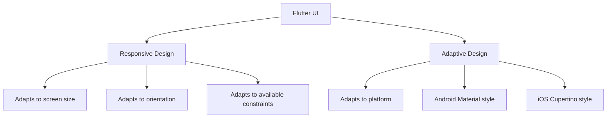

---

## Responsive vs Adaptive UI

| Concept       | Meaning                                 | Flutter Tools                                         |
| ------------- | --------------------------------------- | ----------------------------------------------------- |
| Responsive UI | Layout changes based on available space | `MediaQuery`, `LayoutBuilder`, `Expanded`, `Flexible` |
| Adaptive UI   | UI style changes based on platform      | `Platform`, Cupertino widgets, adaptive constructors  |

Responsive design asks:

```text
How much space do I have?
```

Adaptive design asks:

```text
Which platform am I running on?
```

---

# 1. Locking Device Orientation

At the beginning of the module, one simple solution was introduced: locking the app to a specific orientation.

This can be done with `SystemChrome`.

```dart
SystemChrome.setPreferredOrientations([
  DeviceOrientation.portraitUp,
]);
```

This prevents the app from rotating into landscape mode.

However, this is usually not the best long-term solution.

---

## Why Locking Orientation Is Limited

Locking orientation can avoid layout problems, but it does not truly solve them.

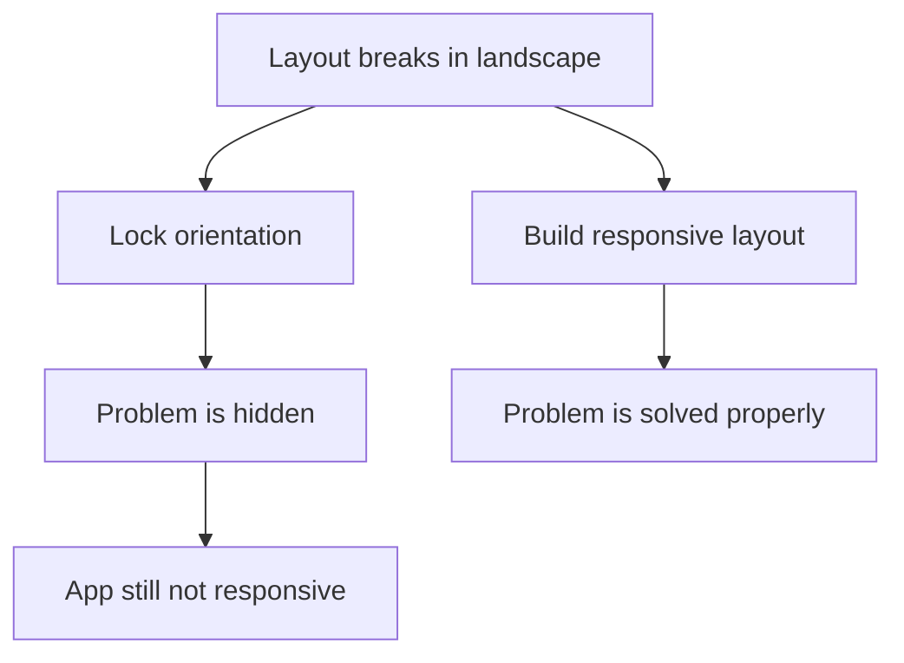

A better approach is to build layouts that work in different orientations and screen sizes.

---

# 2. Updating the UI Based on Available Space

The first major responsive improvement was changing the Expense Tracker layout based on available width.

In portrait mode, the chart and list work well vertically.

```text
Portrait Layout

+----------------------+
| Chart                |
+----------------------+
| Expense List         |
|                      |
+----------------------+
```

In landscape mode, the vertical layout wastes space.

A better layout is horizontal:

```text
Landscape Layout

+----------------------+----------------------+
| Chart                | Expense List         |
|                      |                      |
+----------------------+----------------------+
```

---

## Using MediaQuery

`MediaQuery` allows us to read the size of the screen.

```dart
final width = MediaQuery.of(context).size.width;
```

Then we can conditionally render a different layout.

```dart
body: width < 600
    ? Column(
        children: [
          ExpenseChart(),
          Expanded(child: ExpenseList()),
        ],
      )
    : Row(
        children: [
          Expanded(child: ExpenseChart()),
          Expanded(child: ExpenseList()),
        ],
      ),
```

---

## MediaQuery Layout Flow

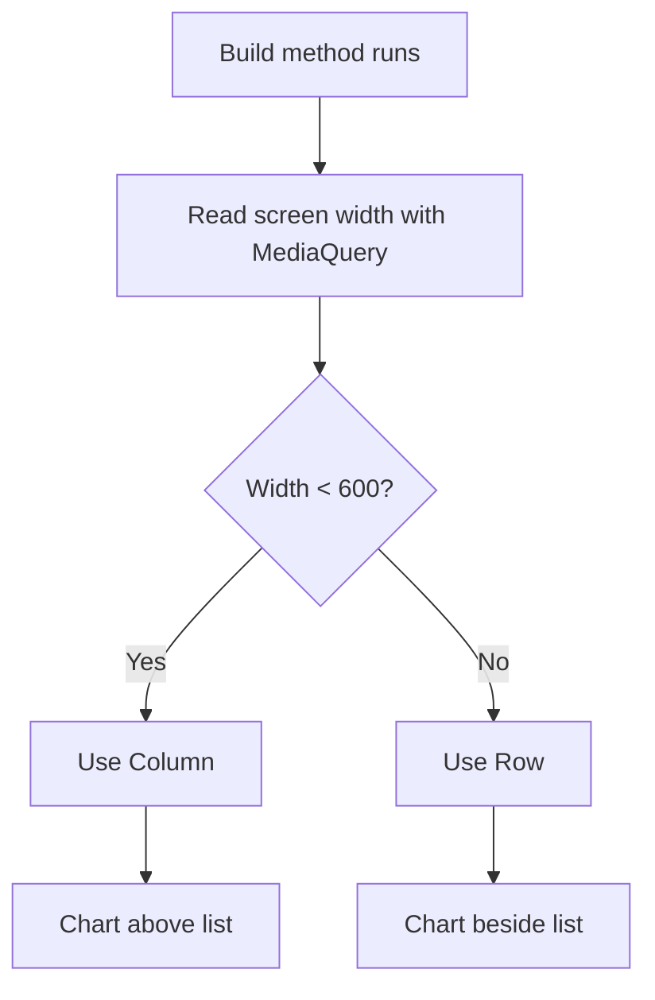

The important lesson is that responsive design should often depend on **available width**, not just orientation.

A tablet in portrait mode might still have enough width for a side-by-side layout.

---

# 3. Understanding Size Constraints

Flutter layout is based on constraints.

The golden rule is:

```text
Constraints go down.
Sizes go up.
Parent sets position.
```

This means:

1. A parent sends size constraints to its child.
2. The child chooses a size within those constraints.
3. The child reports its size back to the parent.
4. The parent decides where to place the child.

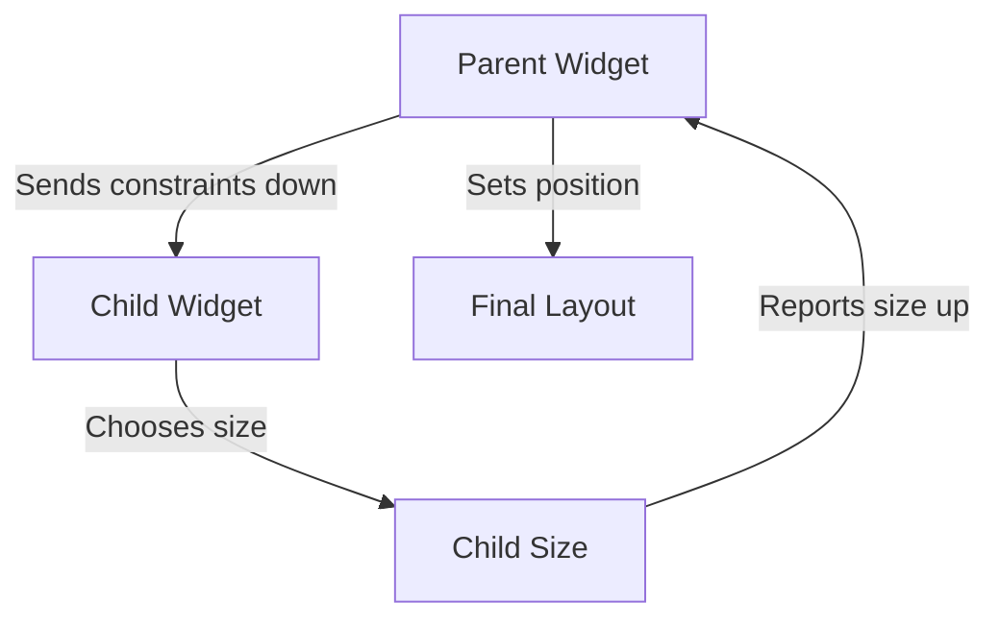

---

## Why Expanded Is Important

Some widgets want as much space as possible.

For example:

```dart
Container(
  width: double.infinity,
)
```

This can cause problems inside a `Row`, because the `Row` also tries to manage horizontal space for multiple children.

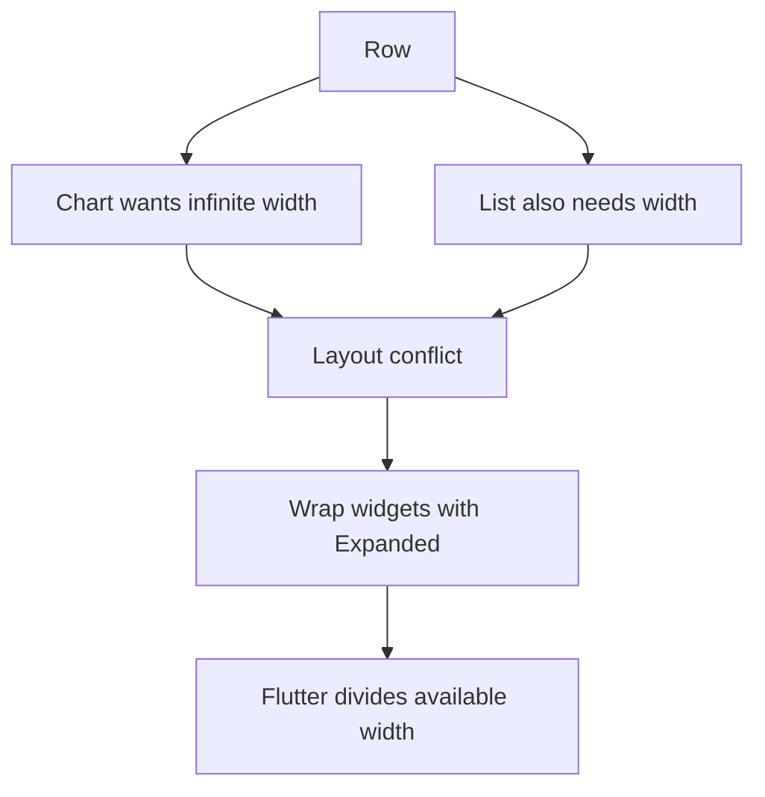

Correct version:

```dart
Row(
  children: [
    Expanded(child: ExpenseChart()),
    Expanded(child: ExpenseList()),
  ],
)
```

`Expanded` gives children clear constraints inside a `Row` or `Column`.

---

# 4. Handling Screen Overlays Like the Soft Keyboard

The next problem was the soft keyboard.

When a user taps a `TextField`, the keyboard appears from the bottom and covers part of the screen.

This is especially problematic in landscape mode because the screen height is already small.

```text
Screen with Keyboard

+--------------------------+
| Form content             |
| Some fields visible      |
+--------------------------+
| Keyboard covers bottom   |
+--------------------------+
```

---

## Using viewInsets.bottom

Flutter exposes keyboard overlay height through:

```dart
MediaQuery.of(context).viewInsets.bottom
```

Example:

```dart
final keyboardSpace = MediaQuery.of(context).viewInsets.bottom;
```

When the keyboard is closed:

```text
keyboardSpace = 0
```

When the keyboard is open:

```text
keyboardSpace = keyboard height
```

---

## Keyboard-Safe Modal Pattern

```dart
final keyboardSpace = MediaQuery.of(context).viewInsets.bottom;

return SizedBox(
  height: double.infinity,
  child: SingleChildScrollView(
    child: Padding(
      padding: EdgeInsets.fromLTRB(
        16,
        16,
        16,
        keyboardSpace + 16,
      ),
      child: Column(
        children: [
          // form fields
        ],
      ),
    ),
  ),
);
```

This combines three ideas:

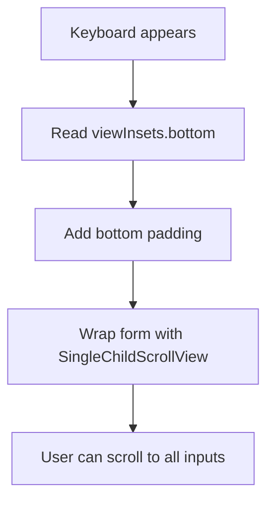

Padding alone is not enough.
The content also needs to be scrollable.

---

# 5. Understanding Safe Areas

Safe areas protect content from device-specific screen intrusions, such as:

* camera cutouts
* notches
* status bars
* rounded corners
* home indicator bars

Flutter provides the `SafeArea` widget for this.

```dart
SafeArea(
  child: Column(
    children: [
      Text('Safe content'),
    ],
  ),
)
```

---

## SafeArea Concept

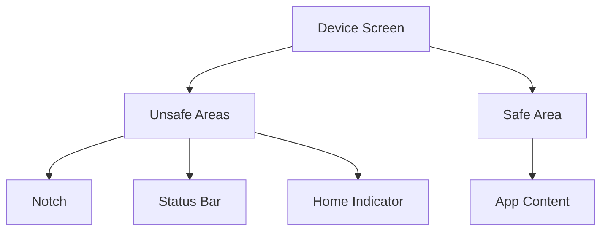

Instead of guessing fixed padding values, Flutter can calculate the correct safe area automatically.

---

## Modal Bottom Sheet Safe Area

For modal bottom sheets, we can enable safe area handling with:

```dart
showModalBottomSheet(
  context: context,
  useSafeArea: true,
  builder: (ctx) {
    return const NewExpense();
  },
);
```

This prevents the modal content from overlapping the camera cutout or system UI.

---

# 6. Using the LayoutBuilder Widget

`MediaQuery` reads the full screen size.

`LayoutBuilder` reads the constraints provided by the parent widget.

This makes `LayoutBuilder` better for reusable components.

```dart
LayoutBuilder(
  builder: (context, constraints) {
    final width = constraints.maxWidth;

    if (width >= 600) {
      return WideLayout();
    }

    return NarrowLayout();
  },
)
```

---

## MediaQuery vs LayoutBuilder

| Tool            | Reads                                   | Best For                                |
| --------------- | --------------------------------------- | --------------------------------------- |
| `MediaQuery`    | Full screen size and device information | Page-level layout, keyboard, safe areas |
| `LayoutBuilder` | Parent constraints                      | Component-level responsive layout       |

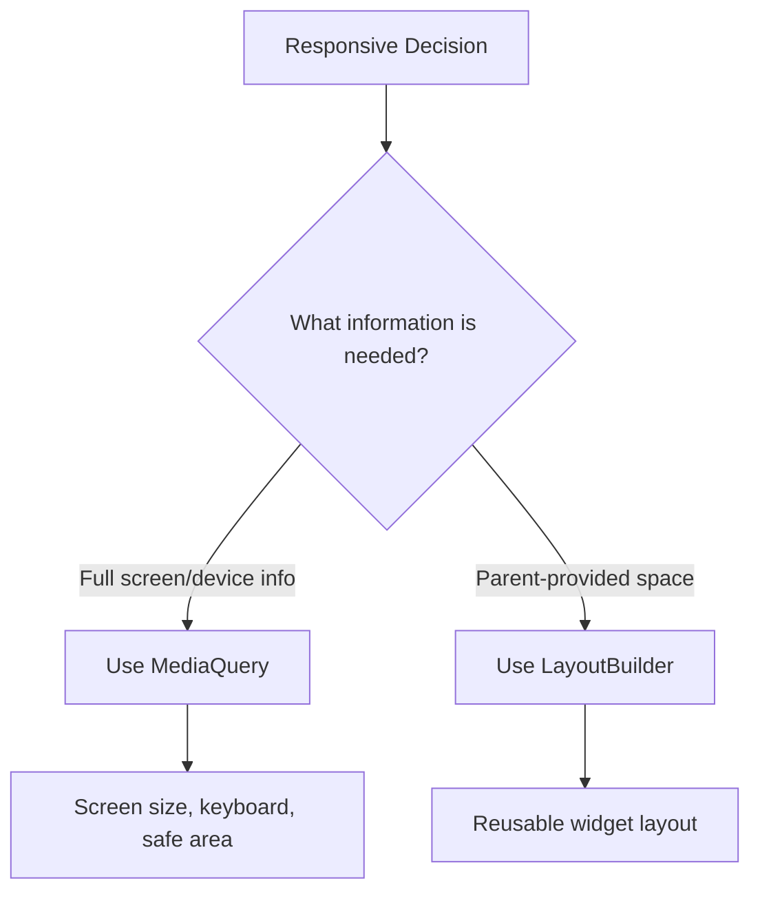

---

## LayoutBuilder in the Expense Modal

In the modal form, `LayoutBuilder` was used to place fields differently depending on available width.

Narrow layout:

```text
Title
Amount
Date
Category
Buttons
```

Wide layout:

```text
Title + Amount
Category + Date
Buttons
```

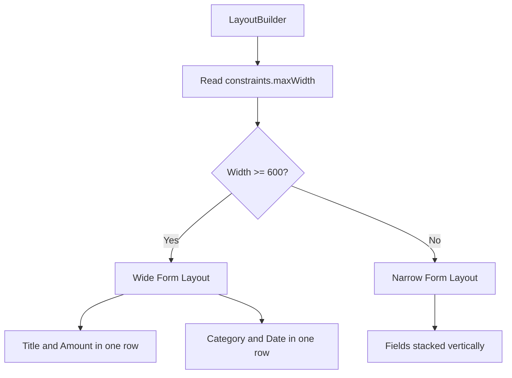

---

# 7. Building Adaptive Widgets

Responsive design changes layout based on space.

Adaptive design changes UI based on platform.

Flutter can detect the current platform using:

```dart
import 'dart:io';

Platform.isIOS
Platform.isAndroid
```

This allows us to show different widgets on different platforms.

---

## Material vs Cupertino

| Platform | Style           | Flutter Widgets                                                    |
| -------- | --------------- | ------------------------------------------------------------------ |
| Android  | Material Design | `AlertDialog`, `Switch`, `Scaffold`                                |
| iOS      | Cupertino style | `CupertinoAlertDialog`, `CupertinoSwitch`, `CupertinoPageScaffold` |

Example:

```dart
if (Platform.isIOS) {
  showCupertinoDialog(...);
} else {
  showDialog(...);
}
```

---

## Adaptive Dialog Flow

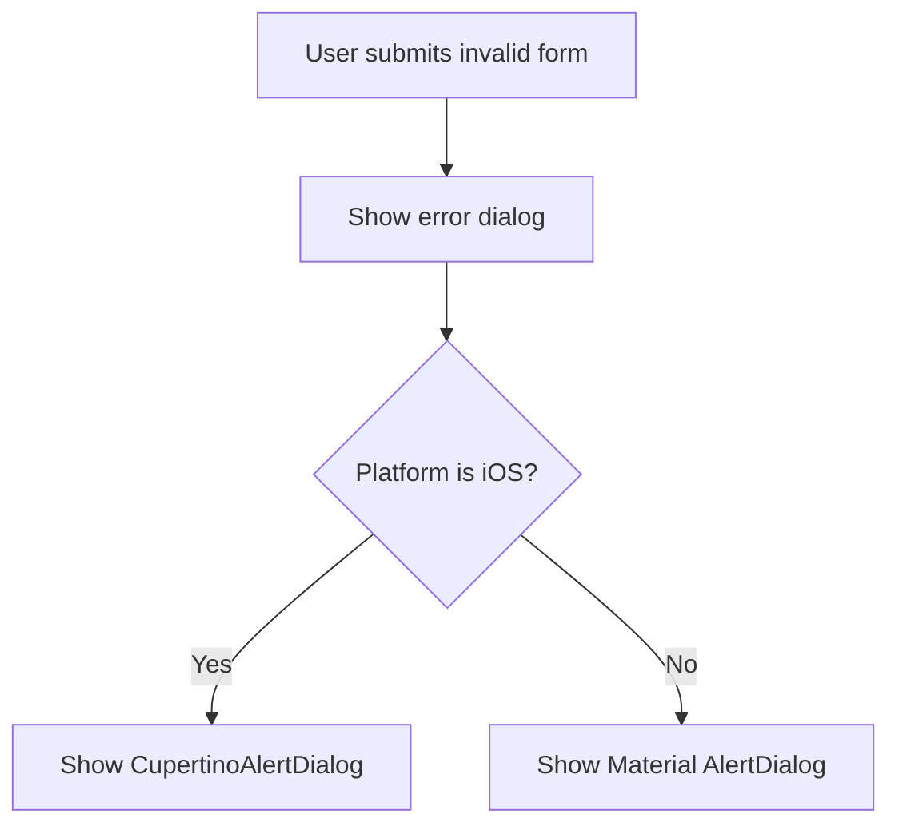

---

## Built-In Adaptive Constructors

Flutter also provides adaptive constructors.

Example:

```dart
Switch.adaptive(
  value: true,
  onChanged: (value) {},
)
```

Other examples include:

```dart
CircularProgressIndicator.adaptive()
```

Use built-in adaptive constructors when available.
Create custom adaptive widgets when you need more control.

---

# Complete Module Flow

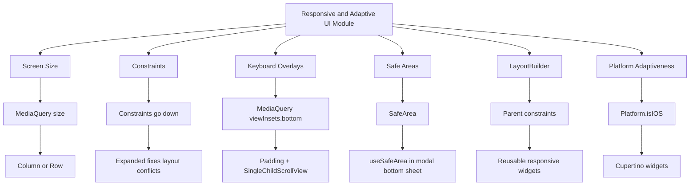

---

# Practical Rules

## Use MediaQuery when you need full screen information

Use `MediaQuery` for:

* screen width
* screen height
* keyboard height
* safe area padding
* full-page responsive layout

```dart
final width = MediaQuery.of(context).size.width;
final keyboardSpace = MediaQuery.of(context).viewInsets.bottom;
```

---

## Use LayoutBuilder when you need local constraints

Use `LayoutBuilder` for:

* reusable widgets
* cards
* charts
* forms inside modals
* widgets inside a `Row` or `Column`
* components that should adapt to parent size

```dart
LayoutBuilder(
  builder: (context, constraints) {
    final width = constraints.maxWidth;
    return width >= 600 ? WideLayout() : NarrowLayout();
  },
)
```

---

## Use Expanded when children need bounded space

Use `Expanded` inside:

* `Row`
* `Column`
* flexible layouts
* layouts with `ListView`
* layouts with `TextField`
* layouts with `double.infinity`

```dart
Row(
  children: [
    Expanded(child: FirstWidget()),
    Expanded(child: SecondWidget()),
  ],
)
```

---

## Use SafeArea for screen intrusions

Use `SafeArea` or `useSafeArea: true` when content might be hidden by:

* notch
* status bar
* camera cutout
* home indicator

```dart
SafeArea(
  child: MyContent(),
)
```

```dart
showModalBottomSheet(
  context: context,
  useSafeArea: true,
  builder: (ctx) => const NewExpense(),
);
```

---

## Use viewInsets for keyboard overlays

Use this when handling input forms:

```dart
final keyboardSpace = MediaQuery.of(context).viewInsets.bottom;
```

Then apply it as bottom padding:

```dart
padding: EdgeInsets.fromLTRB(
  16,
  16,
  16,
  keyboardSpace + 16,
)
```

---

## Use Platform checks for adaptive behavior

Use platform checks when the app should use native-looking UI.

```dart
if (Platform.isIOS) {
  return CupertinoWidget();
}

return MaterialWidget();
```

Use adaptive constructors when available:

```dart
Switch.adaptive(
  value: value,
  onChanged: onChanged,
)
```

---

# Recommended Responsive and Adaptive Strategy

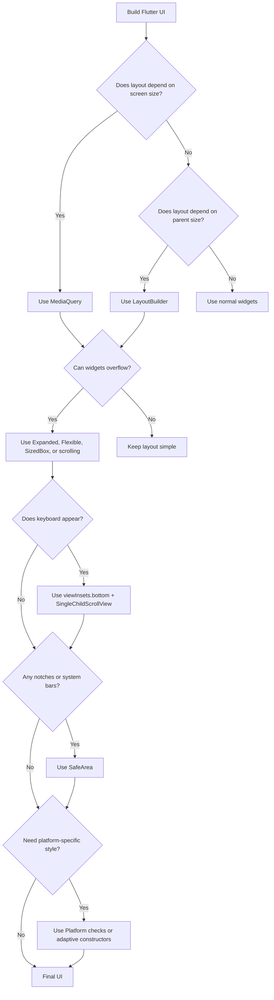

---

# Key Takeaways

* Responsive UI adapts to available space.
* Adaptive UI adapts to platform conventions.
* `MediaQuery` is useful for full-screen and device-level information.
* `LayoutBuilder` is useful for parent-based responsive decisions.
* Flutter layout is controlled by constraints.
* `Expanded` helps resolve unbounded width or height problems.
* `MediaQuery.viewInsets.bottom` helps handle the soft keyboard.
* `SingleChildScrollView` keeps form content reachable.
* `SafeArea` protects content from notches, cameras, and system UI.
* Cupertino widgets help create native-feeling iOS experiences.
* Built-in adaptive constructors can simplify platform-specific widgets.

---

# Final Summary

This module introduced the core tools for building responsive and adaptive Flutter apps.

You learned how to use `MediaQuery` to read screen dimensions, keyboard overlays, and safe area information.

You learned how Flutter constraints work and why widgets like `Expanded`, `Flexible`, and `SizedBox` are important for controlling layout.

You also learned how `LayoutBuilder` enables component-level responsiveness by giving widgets access to the constraints from their parent.

Finally, you learned how to build adaptive platform-aware UI by using `Platform` checks, Cupertino widgets, and Flutter’s built-in adaptive constructors.

Together, these techniques help you build Flutter apps that feel polished, flexible, and natural across phones, tablets, orientations, Android, and iOS.

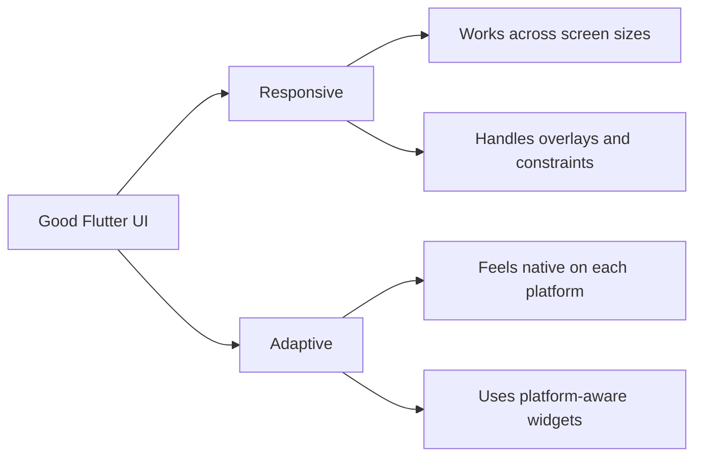
