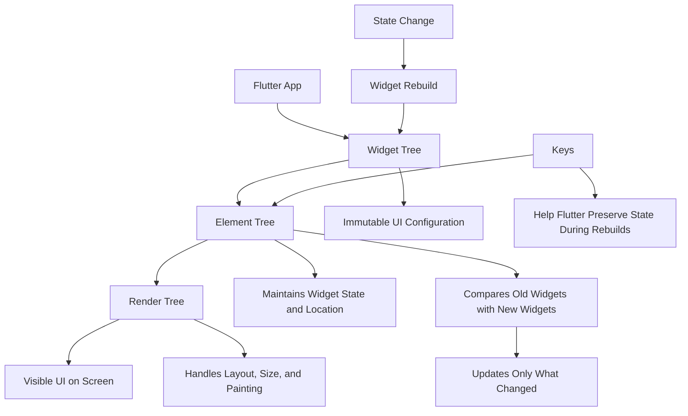
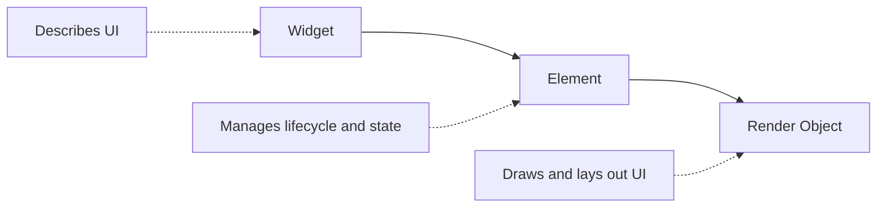
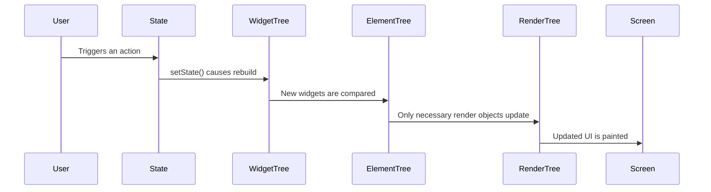
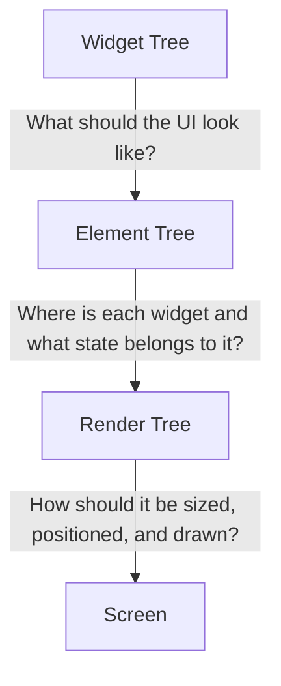

# Module Introduction: Flutter Internals

## Overview

This module explores the internal mechanics of Flutter and Dart, focusing on how Flutter builds, updates, and renders user interfaces behind the scenes.

Instead of only learning how to create visible UI components, this module helps you understand what Flutter does internally when widgets are created, rebuilt, updated, or removed.

The main concepts covered in this module include:

* The Widget Tree
* The Element Tree
* The Render Tree
* Widget rebuilds
* UI updates
* Keys and state preservation

A TODO app is used as the practical example throughout the module, helping connect theoretical concepts to real Flutter UI scenarios.

---

## Why This Module Matters

At this point in the course, you have already learned many important Flutter and Dart fundamentals. However, to build better and more efficient Flutter applications, it is important to understand what happens behind the scenes.

Understanding Flutter internals helps you:

* Write more performant apps
* Debug UI issues more effectively
* Understand why widgets rebuild
* Avoid unnecessary rebuilds
* Use keys correctly
* Understand state management more deeply
* Prepare for advanced tools such as Provider, Riverpod, and Bloc

---

## Core Concept Diagram



---

## The Three Trees in Flutter

Flutter does not render widgets directly. Instead, it uses three connected trees to manage and display the UI.

### 1. Widget Tree

The Widget Tree describes what the UI should look like.

Widgets are immutable, which means they cannot change after they are created. When the UI needs to update, Flutter creates a new widget tree.

Example:

```dart
Column(
  children: [
    Text('My Tasks'),
    TodoItem(),
  ],
)
```

The widget tree is mainly a configuration layer.

---

### 2. Element Tree

The Element Tree connects widgets to the actual running app.

Elements are created from widgets and remain in memory for longer than widgets. They help Flutter compare old widgets with new widgets during rebuilds.

The Element Tree is important because it:

* Tracks where widgets are located in the UI
* Connects widgets to render objects
* Preserves state
* Helps Flutter decide what needs to be updated

---

### 3. Render Tree

The Render Tree is responsible for the actual visual output.

It handles:

* Layout
* Size
* Position
* Painting
* Hit testing

In simple terms, the Render Tree decides how things appear on the screen.

---

## Relationship Between the Trees



| Tree         | Main Responsibility         | Key Idea                      |
| ------------ | --------------------------- | ----------------------------- |
| Widget Tree  | Describes the UI            | Immutable configuration       |
| Element Tree | Connects widgets to the app | Preserves structure and state |
| Render Tree  | Displays the UI             | Layout and painting           |

---

## How Flutter Updates the UI

When data changes, Flutter does not redraw the entire app from scratch.

Instead, Flutter rebuilds the affected widgets and compares the new widget tree with the existing element tree.



This process allows Flutter to stay fast and efficient.

---

## Understanding Widget Rebuilds

A widget rebuild means Flutter calls the `build()` method again.

However, rebuilding a widget does not always mean the whole screen is redrawn.

Flutter is optimized to compare the new widget configuration with the existing element tree and update only what is necessary.

This is why understanding rebuilds is important for performance.

---

## Keys in Flutter

Keys help Flutter identify widgets across rebuilds.

They are especially useful when working with lists, forms, animations, or widgets that hold state.

Without keys, Flutter matches widgets mainly by their type and position in the tree. This can sometimes cause state to be attached to the wrong widget.

Keys help solve this problem by giving Flutter a clearer identity for each widget.

---

## Example: Why Keys Matter

Imagine a TODO app where each task item has its own checkbox state.

If the list order changes, Flutter may confuse one item with another if no key is used.

```dart
TodoItem(
  key: ValueKey(todo.id),
  todo: todo,
)
```

Using a key helps Flutter understand that each TODO item is unique, even if its position changes.

---

## Key Points

* Flutter uses multiple internal trees to manage the UI.
* The Widget Tree describes the UI configuration.
* The Element Tree connects widgets to state and lifecycle.
* The Render Tree handles layout and painting.
* Widgets are immutable and are rebuilt when state changes.
* Rebuilds do not always mean expensive redraws.
* Keys help Flutter preserve widget identity and state.
* Understanding these internals makes debugging and optimization easier.

---

## Tips for Learning This Module

* Take notes on the three-tree architecture early.
* Focus on the difference between widgets and elements.
* Remember that widgets are temporary, but elements are longer-lived.
* Use the TODO app example to connect theory with real UI behavior.
* Revisit this introduction after completing the module.
* Do not overuse keys; use them when widget identity matters.

---

## Practical Mental Model

You can think of Flutter like this:



In simple words:

> Widgets describe the UI.
> Elements manage the UI structure and state.
> Render objects draw the UI.

---

## Notes

This module is more theoretical than previous sections, but it has a direct impact on how you write real Flutter applications.

Understanding the difference between the Widget Tree and the Element Tree is especially important because many state management concepts rely on this foundation.

Frameworks such as Provider, Riverpod, and Bloc become easier to understand once you know how Flutter internally connects widgets, elements, and state.

---

## Summary

This module introduces Flutter's internal rendering architecture and explains why understanding these internals is important for building efficient Flutter applications.

You will learn how Flutter uses the Widget Tree, Element Tree, and Render Tree to build and update the user interface. You will also learn how Flutter keeps apps performant by updating only what is necessary.

Finally, the module revisits keys and explains how they help Flutter preserve state correctly during rebuilds, especially in dynamic UI scenarios such as TODO lists.
