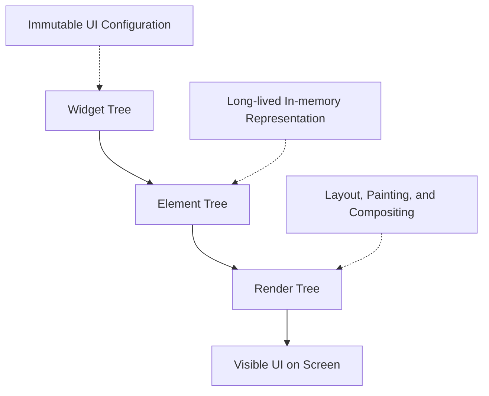
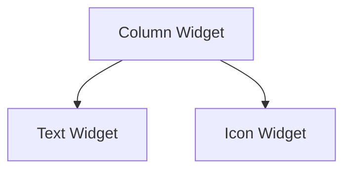
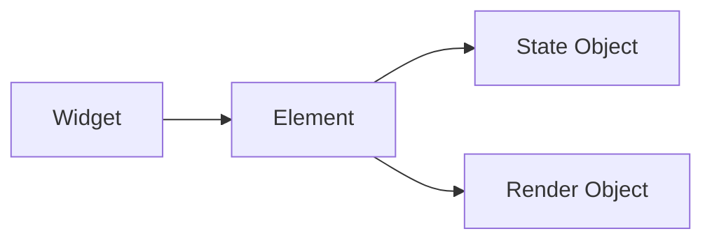
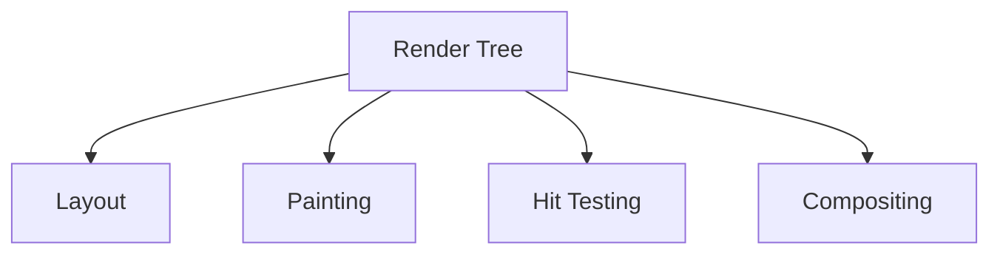
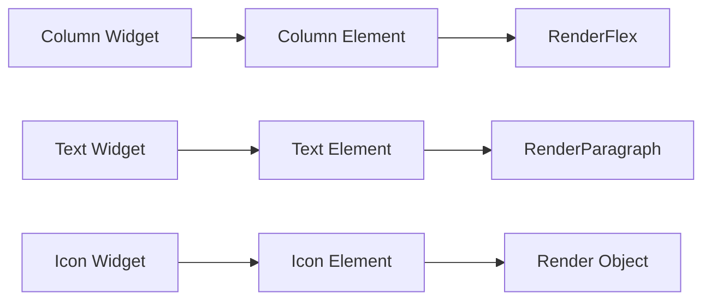
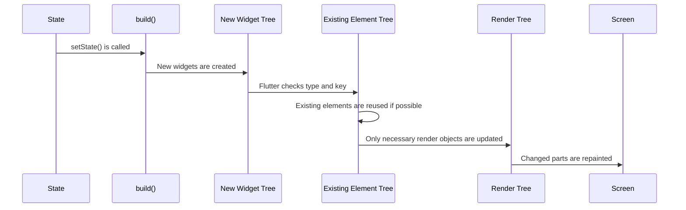
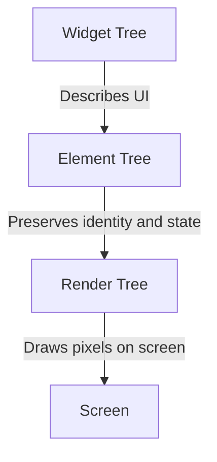
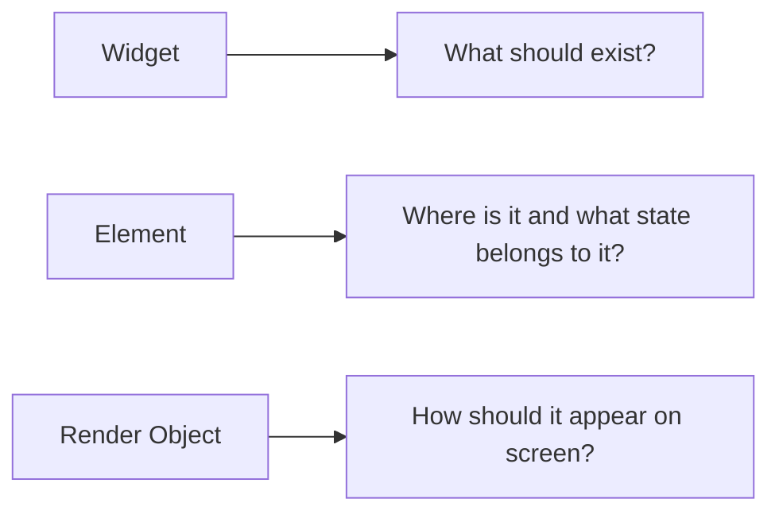

# Three Trees: Widget Tree, Element Tree, and Render Tree

## Overview

When building Flutter apps, you mostly work with widgets. However, behind the scenes, Flutter manages not just one tree, but three connected trees:

* **Widget Tree**
* **Element Tree**
* **Render Tree**

These three trees allow Flutter to describe the UI, preserve structure and state, and render only the necessary parts of the screen efficiently.

As a developer, you usually only write the Widget Tree. The Element Tree and Render Tree are managed internally by Flutter, but understanding them helps you debug rebuilds, optimize performance, and use keys correctly.

---

## Core Diagram



---

## The Three Trees

## 1. Widget Tree

The **Widget Tree** is the tree you create in your Flutter code.

It is made by nesting widgets inside other widgets.

For example:

```dart
Column(
  children: [
    Text('Hello'),
    Icon(Icons.star),
  ],
)
```

This creates a simple widget tree:



Widgets are lightweight and immutable. This means they do not change after they are created.

When the UI needs to update, Flutter often calls the `build()` method again and creates a new version of the widget subtree.

---

## 2. Element Tree

The **Element Tree** is Flutter's in-memory representation of the widgets.

Elements are created by Flutter when widgets are first inserted into the UI.

Unlike widgets, elements are not recreated every time `build()` runs. Flutter tries to reuse existing elements whenever possible.

An element connects:

* A widget
* Its position in the tree
* Its state, if it has one
* Its render object, if it needs one



The Element Tree is important because it helps Flutter decide what actually changed after a rebuild.

---

## 3. Render Tree

The **Render Tree** contains render objects.

Render objects are responsible for the actual visual work of the UI.

They handle:

* Layout
* Size calculation
* Positioning
* Painting
* Hit testing
* Compositing

The Render Tree is more expensive to update than the Widget Tree, so Flutter tries to avoid unnecessary changes to it.



---

## Tree Responsibilities

| Tree         | Managed By | Main Role                                    | Lifetime                 |
| ------------ | ---------- | -------------------------------------------- | ------------------------ |
| Widget Tree  | Developer  | Describes what the UI should look like       | Rebuilt frequently       |
| Element Tree | Flutter    | Connects widgets to state and render objects | Reused when possible     |
| Render Tree  | Flutter    | Handles layout and painting                  | Updated only when needed |

---

## Example Code

```dart
class MyWidget extends StatelessWidget {
  const MyWidget({super.key});

  @override
  Widget build(BuildContext context) {
    return Column(
      children: const [
        Text('Hello'),
        Icon(Icons.star),
      ],
    );
  }
}
```

In this example:



The widgets describe the UI, the elements keep track of those widgets in memory, and the render objects handle the actual layout and drawing.

---

## What Happens During a Rebuild?

When `setState()` is called, Flutter calls the `build()` method again for the affected widget subtree.

However, Flutter does **not** automatically recreate everything from scratch.

Instead, it compares the new widget configuration with the existing Element Tree.

If the widget type and key still match, Flutter reuses the existing element.



---

## Flutter's UI Update Process

The update process can be understood like this:

```mermaid
flowchart TD
    A[State changes] --> B[build() runs again]
    B --> C[New Widget Tree is created]
    C --> D[Flutter compares widgets with existing elements]
    D --> E{Type and key match?}

    E -->|Yes| F[Reuse existing Element]
    E -->|No| G[Create, remove, or replace Element]

    F --> H[Update Render Object only if needed]
    G --> H
    H --> I[Repaint affected UI parts]
```

This is one of the main reasons Flutter can rebuild widget trees frequently while still staying performant.

---

## Why Flutter Uses Three Trees

Flutter separates the UI system into three trees because each tree has a different responsibility.



This separation allows Flutter to:

* Rebuild widgets quickly
* Reuse elements when possible
* Avoid unnecessary render object creation
* Update only the parts of the UI that changed
* Preserve state across rebuilds
* Keep rendering efficient

---

## Important Mental Model

A simple way to remember the three trees:

> **Widgets describe.**
> **Elements remember.**
> **Render objects draw.**

Or:



---

## Key Points

* The **Widget Tree** is the tree you write in your Flutter code.
* Widgets are lightweight and immutable.
* The **Element Tree** is created and managed by Flutter.
* Elements are long-lived and reused across rebuilds when possible.
* The **Render Tree** handles layout, painting, and compositing.
* Calling `build()` again does not mean the whole UI is recreated.
* Flutter uses the Element Tree to decide what actually needs to change.
* Render objects are updated only when necessary.
* This architecture helps Flutter stay fast and efficient.

---

## Notes

The Element Tree acts as a bridge between the temporary Widget Tree and the more expensive Render Tree.

When `setState()` is called, Flutter rebuilds the widget subtree, but it does not blindly rebuild the entire UI. Instead, it checks whether existing elements can be reused.

If the widget type and key match, Flutter keeps the existing element and updates it with the new widget configuration. This process is called **reconciliation**.

Understanding reconciliation is especially important when learning about keys, because keys help Flutter decide whether a widget should reuse an existing element or create a new one.

---

## Summary

Flutter uses three internal trees to manage the UI efficiently.

The **Widget Tree** describes the UI.
The **Element Tree** stores the in-memory structure and connects widgets to state.
The **Render Tree** performs layout, painting, and rendering.

As a developer, you mostly work with widgets, but understanding the Element Tree and Render Tree helps you understand why Flutter rebuilds are efficient and why keys matter.

This three-tree architecture is one of the foundations of Flutter's performance model.
