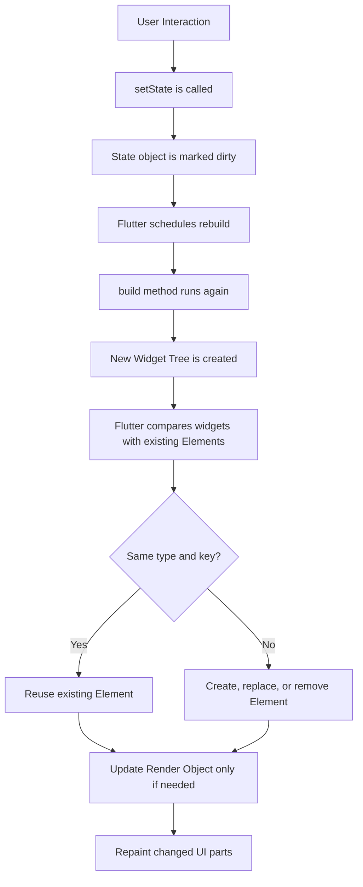
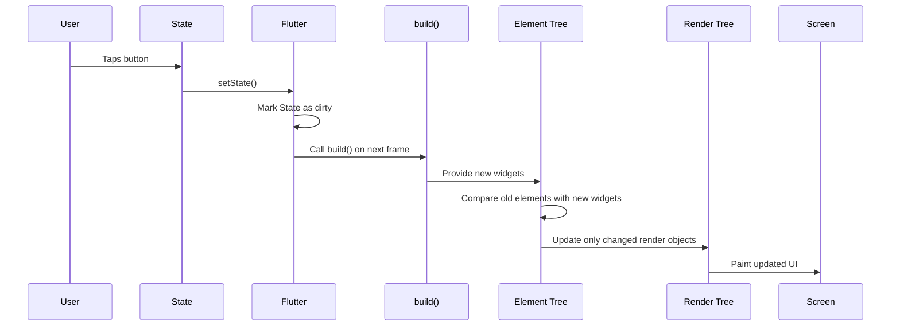
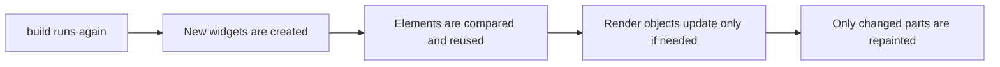
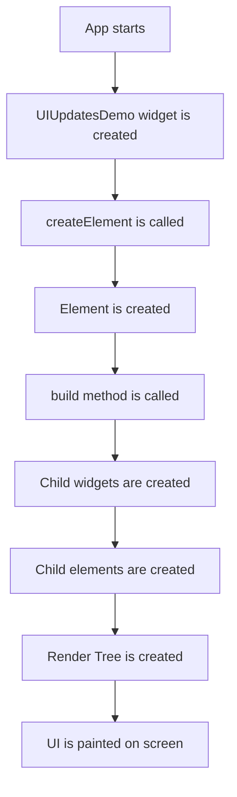
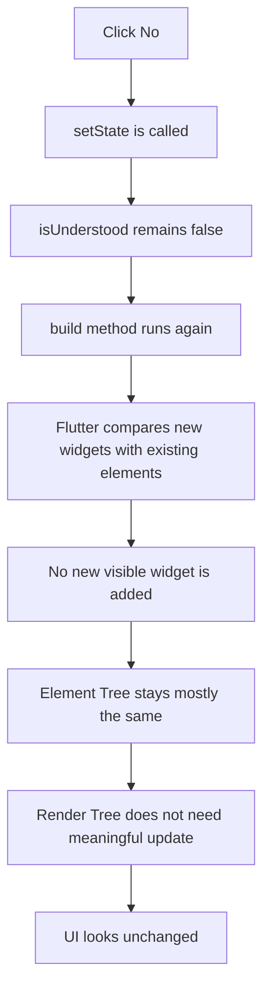
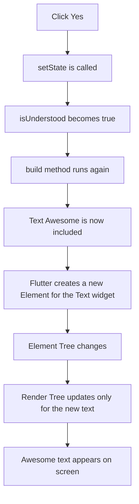
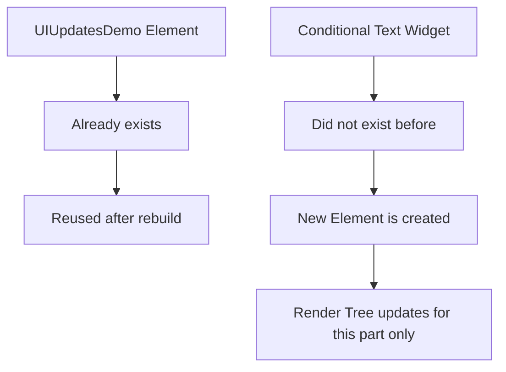
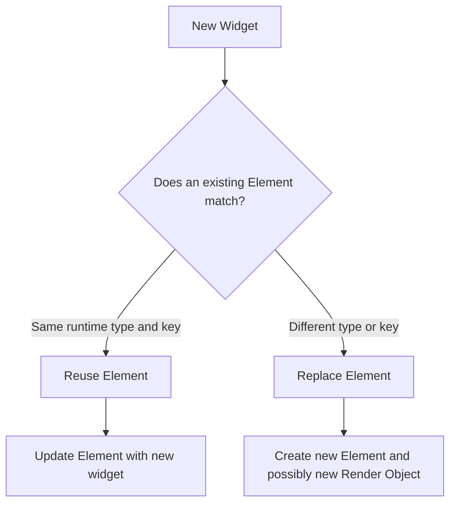
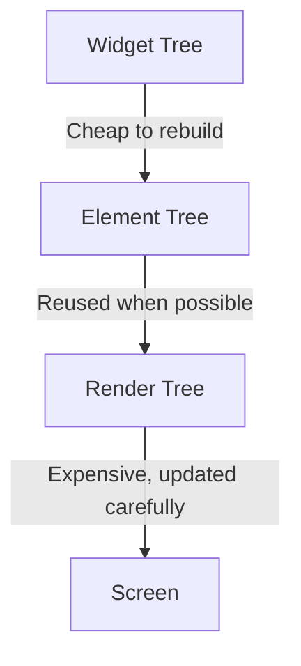

# How the UI Is Updated in Flutter

## Overview

Flutter updates the user interface through a process that starts when state changes.

Most commonly, this happens when `setState()` is called inside a `StatefulWidget`. Flutter then marks the related `State` object as dirty and schedules a rebuild for the next frame.

However, rebuilding does not mean Flutter recreates the entire UI from scratch. Instead, Flutter rebuilds the affected widget subtree, compares the new widgets with the existing Element Tree, and updates only the necessary parts of the Render Tree.

This process is called **reconciliation**, and it is one of the main reasons Flutter can update UIs efficiently.

---

## Core UI Update Flow



---

## Key Points

* Calling `setState()` marks a `State` object as dirty.
* Flutter schedules a rebuild for the next frame.
* The `build()` method is called again for the affected widget subtree.
* Flutter creates a new widget configuration.
* Flutter compares the new widgets with the existing Element Tree.
* If the widget type and key match, the existing element is reused.
* If the type or key does not match, Flutter creates, removes, or replaces elements.
* The Render Tree is updated only when necessary.
* Flutter does not repaint the entire screen if only one small part changes.

---

## Example: Counter Widget

```dart id="x230e8"
class CounterWidget extends StatefulWidget {
  const CounterWidget({super.key});

  @override
  State<CounterWidget> createState() => _CounterWidgetState();
}

class _CounterWidgetState extends State<CounterWidget> {
  int _count = 0;

  void _increment() {
    setState(() {
      // This marks the State object as dirty.
      // Flutter will call build() again on the next frame.
      _count++;
    });
  }

  @override
  Widget build(BuildContext context) {
    // build() may run many times.
    // This is usually cheap because widgets are lightweight.
    return Column(
      children: [
        Text('Count: $_count'),
        ElevatedButton(
          onPressed: _increment,
          child: const Text('Increment'),
        ),
      ],
    );
  }
}
```

---

## What Happens When `setState()` Is Called?

When `setState()` is called, Flutter does not instantly redraw everything.

Instead, Flutter follows these steps:



---

## Widget Rebuild vs UI Repaint

A common misunderstanding is thinking that every rebuild means the entire screen is repainted.

That is not true.

In Flutter:

* A **widget rebuild** means the `build()` method runs again.
* An **element update** means Flutter checks whether existing elements can be reused.
* A **render update** means Flutter updates layout or painting only where needed.



Widgets are cheap to create. Render objects are more expensive to update. That is why Flutter tries to keep the Render Tree as stable as possible.

---

## Demo App Explanation

In the demo app, there is a `UIUpdatesDemo` widget.

This widget contains:

* A `Column`
* Some `Text` widgets
* Some buttons
* A conditionally displayed text at the bottom

The app logs when certain methods are called:

```dart id="lr325u"
@override
Element createElement() {
  print('UIUpdatesDemo CREATEELEMENT called');
  return super.createElement();
}

@override
Widget build(BuildContext context) {
  print('UIUpdatesDemo BUILD called');

  return Column(
    children: [
      const Text('Do you understand Flutter updates?'),
      ElevatedButton(
        onPressed: () {
          setState(() {
            isUnderstood = true;
          });
        },
        child: const Text('Yes'),
      ),
      ElevatedButton(
        onPressed: () {
          setState(() {
            isUnderstood = false;
          });
        },
        child: const Text('No'),
      ),
      if (isUnderstood)
        const Text('Awesome!'),
    ],
  );
}
```

---

## Initial Render

When the app starts for the first time, Flutter creates the elements for the widgets.

You may see logs like this:

```text id="g4q19x"
UIUpdatesDemo CREATEELEMENT called
UIUpdatesDemo BUILD called
```

This means:

1. Flutter creates an element for `UIUpdatesDemo`.
2. Flutter calls the `build()` method.
3. Flutter creates child widgets.
4. Flutter creates elements for those child widgets.
5. Flutter creates the initial Render Tree.
6. The UI appears on the screen.



---

## Clicking the “No” Button

Assume the initial value is:

```dart id="o742ne"
bool isUnderstood = false;
```

If the user clicks the **No** button, `setState()` is called, but the value remains `false`.

```dart id="l1yogh"
setState(() {
  isUnderstood = false;
});
```

The `build()` method runs again, so the log appears again:

```text id="ma5le4"
UIUpdatesDemo BUILD called
```

However, the visible UI does not change.

Why?

Because the conditionally displayed text is still not included:

```dart id="ganyew"
if (isUnderstood)
  const Text('Awesome!');
```

Since `isUnderstood` is still `false`, the `Text('Awesome!')` widget is not added to the active widget tree.

So Flutter rebuilds the widget subtree, but it does not need to create new elements or update the Render Tree.



This shows an important idea:

> The `build()` method can run even when the visible UI does not change.

---

## Clicking the “Yes” Button

When the user clicks the **Yes** button, the state changes:

```dart id="ogxkmc"
setState(() {
  isUnderstood = true;
});
```

Now the condition becomes true:

```dart id="qee09v"
if (isUnderstood)
  const Text('Awesome!');
```

This means the `Text('Awesome!')` widget becomes part of the active widget tree.

Flutter then needs to create a new element for that new text widget and update the Render Tree so the text appears on the screen.



---

## Important Observation

When the **Yes** button is clicked, `UIUpdatesDemo CREATEELEMENT called` does not appear again.

That is because the `UIUpdatesDemo` element already exists.

Flutter reuses the existing element for `UIUpdatesDemo` because the widget type and key still match.

Only the newly added conditional text needs a new element.



---

## Why `createElement()` Is Usually Not Overridden

Flutter widgets have a `createElement()` method, but developers rarely override it.

Flutter calls this method internally to create the element connected to a widget.

In normal app development, you usually only write the `build()` method.

You should only override `createElement()` if you deeply understand Flutter internals and are building advanced custom framework-level behavior.

For learning purposes, overriding it with a `print()` statement can help you see when an element is created.

---

## Reconciliation

Reconciliation is the process Flutter uses to compare the new widget configuration with the existing Element Tree.

Flutter checks:



The two most important matching rules are:

* Same widget type
* Same key

If both match, Flutter usually reuses the existing element.

If they do not match, Flutter may remove the old element and create a new one.

---

## Why Flutter Is Efficient

Flutter is efficient because it separates the UI update process into different layers.



The Widget Tree can be rebuilt frequently because widgets are lightweight.

The Element Tree helps Flutter decide what actually changed.

The Render Tree is updated only when layout or painting changes are needed.

This means Flutter can respond quickly to state changes without repainting the entire screen.

---

## Key Points

* `setState()` does not directly redraw the UI.
* `setState()` marks a `State` object as dirty.
* Flutter calls `build()` again during the next frame.
* The new widget tree is compared with the existing Element Tree.
* Existing elements are reused when the widget type and key match.
* New elements are created only when new widgets appear.
* Removed widgets cause their elements to be removed.
* The Render Tree is updated only where necessary.
* Rebuilding widgets is usually cheap.
* Updating layout and painting is more expensive.

---

## Notes

Flutter is designed so that `build()` can be called often.

This is why you should not be afraid of rebuilds by themselves. A rebuild does not automatically mean a full repaint.

The expensive work happens when Flutter needs to update layout, painting, or compositing in the Render Tree.

In the demo app, clicking **No** initially causes `build()` to run again, but the UI does not visually change. Clicking **Yes** causes a new conditional text widget to appear, so Flutter creates a new element and updates only the necessary part of the UI.

---

## Simple Mental Model

You can remember Flutter's update process like this:

> `setState()` asks Flutter to check the UI again.
> `build()` creates a new widget description.
> The Element Tree decides what really changed.
> The Render Tree updates only what must be shown differently.

---

## Summary

Flutter updates the UI through a reconciliation process.

When state changes, Flutter rebuilds the affected widget subtree. It then compares the new widget configuration with the existing Element Tree.

If widgets still match by type and key, their elements are reused. If new widgets appear, Flutter creates new elements. If widgets disappear, Flutter removes their elements.

Finally, Flutter updates only the necessary parts of the Render Tree. This allows Flutter apps to remain performant even when `build()` is called frequently.
