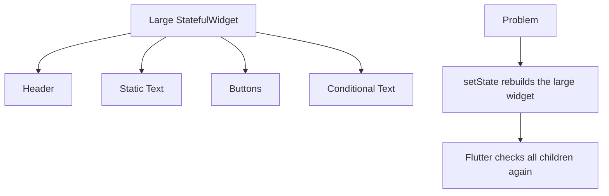
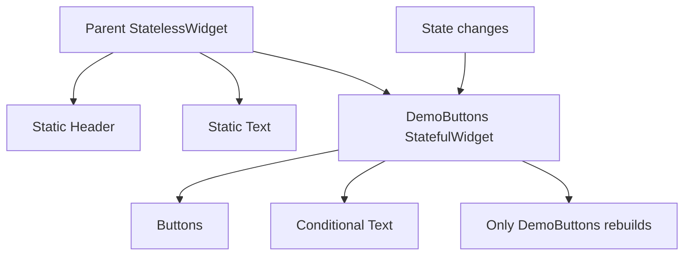
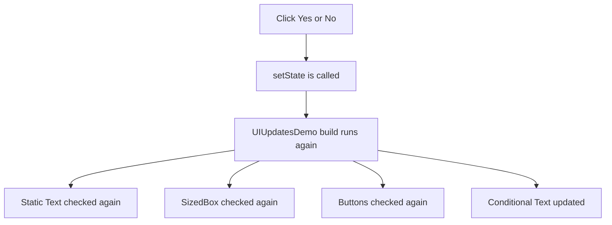
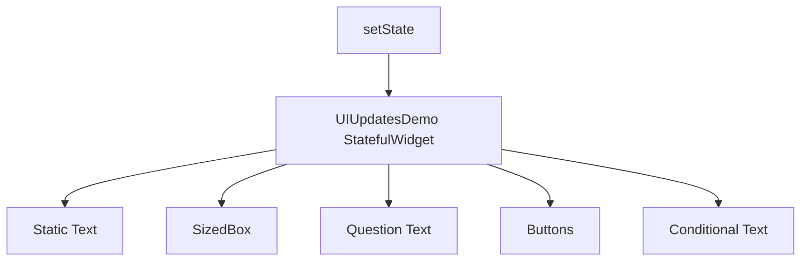
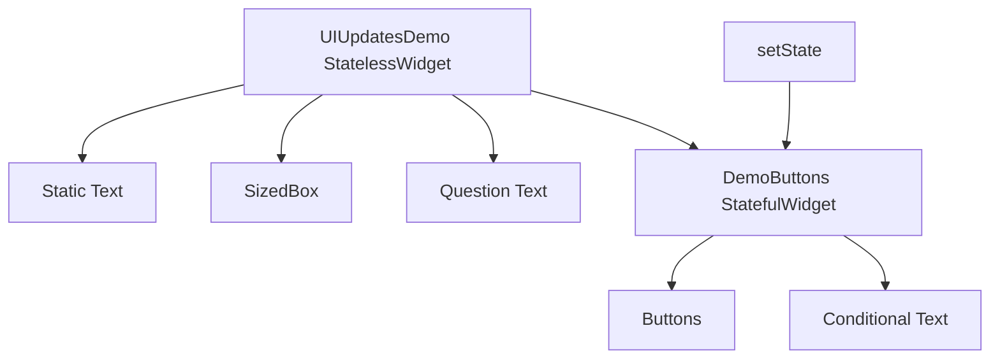
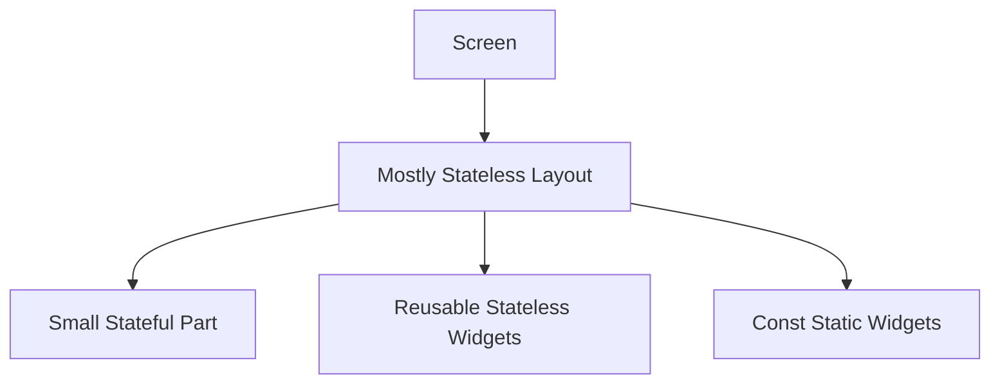
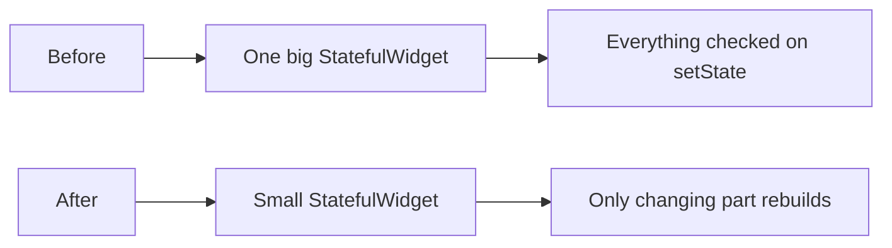

# Refactor and Extract Widgets to Avoid Unnecessary Builds

## Overview

In Flutter, every time `setState()` is called inside a `StatefulWidget`, Flutter calls that widget's `build()` method again.

For small widgets, this is not a problem. But in larger widget trees, rebuilding a large `build()` method can cause Flutter to check many widgets that are not actually affected by the state change.

A common optimization is to **move state closer to the part of the UI that actually changes** and extract unrelated UI parts into separate widgets.

This keeps rebuilds smaller, easier to reason about, and often more performant.

---

## Core Idea

Instead of keeping all UI and state in one large widget, split the UI into smaller widgets.



After refactoring:



---

## Why This Matters

Flutter widgets are cheap to rebuild, but large `build()` methods still require Flutter to walk through and compare more widget configurations.

When only a small part of the UI depends on state, it is better to isolate that state inside a smaller widget.

This means:

* The parent widget does not rebuild when the child state changes.
* Static widgets are not checked unnecessarily.
* The changing part of the UI is easier to understand.
* The code becomes more organized and maintainable.

---

## Before Refactoring

In this version, the parent widget manages all the state.

Whenever the user presses **Yes** or **No**, `setState()` causes the entire `UIUpdatesDemo` widget to rebuild.

```dart id="6ev1oz"
class UIUpdatesDemo extends StatefulWidget {
  const UIUpdatesDemo({super.key});

  @override
  State<UIUpdatesDemo> createState() => _UIUpdatesDemoState();
}

class _UIUpdatesDemoState extends State<UIUpdatesDemo> {
  var _isUnderstood = false;

  @override
  Widget build(BuildContext context) {
    print('UIUpdatesDemo BUILD called');

    return Column(
      mainAxisSize: MainAxisSize.min,
      children: [
        const Text('Flutter UI Updates'),
        const SizedBox(height: 16),
        const Text('Do you understand how Flutter updates the UI?'),
        const SizedBox(height: 16),
        Row(
          mainAxisAlignment: MainAxisAlignment.center,
          children: [
            ElevatedButton(
              onPressed: () {
                setState(() {
                  _isUnderstood = true;
                });
              },
              child: const Text('Yes'),
            ),
            const SizedBox(width: 16),
            ElevatedButton(
              onPressed: () {
                setState(() {
                  _isUnderstood = false;
                });
              },
              child: const Text('No'),
            ),
          ],
        ),
        if (_isUnderstood)
          const Text('Awesome!'),
      ],
    );
  }
}
```

### Problem

Only this part depends on `_isUnderstood`:

```dart id="xwdn66"
if (_isUnderstood)
  const Text('Awesome!');
```

But every time `setState()` is called, the whole `UIUpdatesDemo.build()` method runs again.



For a small demo app, this is fine.
For a complex screen, this can become unnecessary work.

---

## After Refactoring

A better approach is to move the changing part into its own `StatefulWidget`.

The parent widget can become a `StatelessWidget`, because it no longer manages state.

```dart id="xxj015"
class UIUpdatesDemo extends StatelessWidget {
  const UIUpdatesDemo({super.key});

  @override
  Widget build(BuildContext context) {
    print('UIUpdatesDemo BUILD called');

    return const Column(
      mainAxisSize: MainAxisSize.min,
      children: [
        Text('Flutter UI Updates'),
        SizedBox(height: 16),
        Text('Do you understand how Flutter updates the UI?'),
        SizedBox(height: 16),
        DemoButtons(),
      ],
    );
  }
}
```

Now the state is moved into `DemoButtons`.

```dart id="3ebg6m"
class DemoButtons extends StatefulWidget {
  const DemoButtons({super.key});

  @override
  State<DemoButtons> createState() => _DemoButtonsState();
}

class _DemoButtonsState extends State<DemoButtons> {
  var _isUnderstood = false;

  @override
  Widget build(BuildContext context) {
    print('DemoButtons BUILD called');

    return Column(
      mainAxisSize: MainAxisSize.min,
      children: [
        Row(
          mainAxisAlignment: MainAxisAlignment.center,
          children: [
            ElevatedButton(
              onPressed: () {
                setState(() {
                  _isUnderstood = true;
                });
              },
              child: const Text('Yes'),
            ),
            const SizedBox(width: 16),
            ElevatedButton(
              onPressed: () {
                setState(() {
                  _isUnderstood = false;
                });
              },
              child: const Text('No'),
            ),
          ],
        ),
        if (_isUnderstood)
          const Text('Awesome!'),
      ],
    );
  }
}
```

---

## What Changed?

Before refactoring:



After refactoring:



Now, when the user presses **Yes** or **No**, only `DemoButtons` rebuilds.

The parent `UIUpdatesDemo` does not rebuild because its state is not changing anymore.

---

## Console Output Before Refactoring

When clicking a button, you may see:

```text id="720vqu"
UIUpdatesDemo BUILD called
UIUpdatesDemo BUILD called
UIUpdatesDemo BUILD called
```

This means the whole parent widget keeps rebuilding.

---

## Console Output After Refactoring

After moving the state into `DemoButtons`, the output becomes more focused:

```text id="mhx4pl"
UIUpdatesDemo BUILD called
DemoButtons BUILD called
DemoButtons BUILD called
DemoButtons BUILD called
```

The parent builds once at the beginning.

After that, button clicks only rebuild the smaller `DemoButtons` widget.

---

## Why Widget Variables Inside `build()` Are Not Enough

Sometimes developers try to avoid rebuilds by storing child widgets in local variables inside the `build()` method.

Example:

```dart id="w0f0j5"
@override
Widget build(BuildContext context) {
  final header = Text('Flutter UI Updates');

  return Column(
    children: [
      header,
      DemoButtons(),
    ],
  );
}
```

This does not really isolate rebuilds.

The variable is recreated every time `build()` runs.

To create a clearer rebuild boundary, extract the UI into a separate widget class and use `const` when possible.

---

## Role of `const`

Using `const` helps Flutter reuse widget instances when their configuration never changes.

Example:

```dart id="io5bps"
return const Column(
  children: [
    Text('Flutter UI Updates'),
    SizedBox(height: 16),
    DemoButtons(),
  ],
);
```

`const` is useful because it tells Dart and Flutter:

> This widget configuration is fixed and does not need to be recreated at runtime.

This can reduce unnecessary widget object creation and help Flutter skip some work.

---

## Important Clarification

Extracting widgets is helpful, but the main performance benefit comes from **placing state in the smallest widget that needs it**.

A child widget may still rebuild if:

* Its parent rebuilds and passes new values to it
* Its own state changes
* An inherited widget it depends on changes
* Its key changes
* Its position or type in the tree changes

So the goal is not to avoid all rebuilds.
The goal is to avoid rebuilding parts of the UI that cannot possibly be affected by a state change.

---

## Best Practice: Keep StatefulWidgets Small

A good Flutter pattern is:



Keep `StatefulWidget`s as small as they need to be.

If only a button section or conditional text depends on state, put that state inside a small widget instead of the entire screen.

---

## Key Points

* `setState()` rebuilds the widget whose state changed.
* Large `build()` methods cause Flutter to check more widgets.
* Move state closer to the UI that actually changes.
* Extract static UI into separate widgets.
* Use `const` constructors when possible.
* Avoid keeping unrelated UI inside a large `StatefulWidget`.
* Local widget variables inside `build()` do not create a true rebuild boundary.
* Smaller widgets make rebuild behavior easier to understand.
* This optimization matters more in complex apps than in small demo apps.

---

## Practical Mental Model

You can think of the refactor like this:



In simple words:

> Put state where it is needed, not higher than necessary.

---

## Notes

This refactor is not only about clean code. It also affects how much work Flutter needs to do during rebuilds.

In the original version, the parent widget rebuilds even though most of its children are static. After extracting the interactive section into `DemoButtons`, only the widget that owns the changing state rebuilds.

For simple apps, the performance difference is small. But in larger applications, this pattern can help avoid unnecessary checks and make the UI easier to maintain.

---

## Summary

Extracting widgets and moving state into smaller components is one of the simplest ways to reduce unnecessary rebuilds in Flutter.

The key idea is to avoid placing state too high in the widget tree. When state is managed by a large parent widget, the entire parent build method runs whenever that state changes.

By extracting the interactive part into its own `StatefulWidget`, Flutter only rebuilds the smaller widget when the state changes. Combined with `const` constructors, this makes your Flutter UI more efficient, cleaner, and easier to debug.
